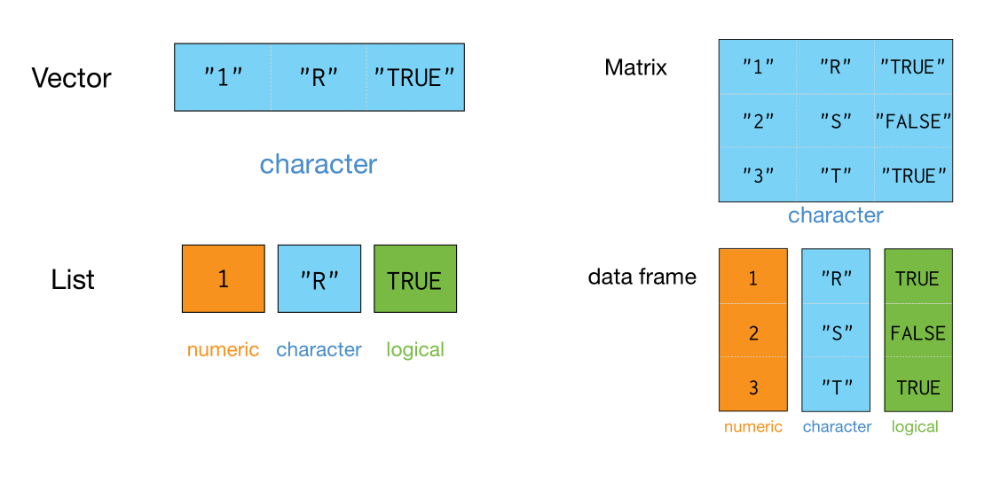

# R 集合类型

- [R 集合类型](#r-集合类型)
  - [基本类型](#基本类型)
    - [数值](#数值)
    - [字符串](#字符串)
    - [逻辑](#逻辑)
  - [数据结构](#数据结构)
  - [对象](#对象)
  - [数组](#数组)

2020-05-28, 19:20
*** **

## 基本类型

R 是一种基于对象的语言，在 R 中看到的一切食物都是对象。

对象的4种基本类型：

- 数值（numeric）
- 字符（character）
- 逻辑（logical）
- 复数（complex）

可以使用 `class()` 查看对象数据类型，`class(v)` 获得 `v` 的类型。

| 类型      | 说明                    |
| --------- | ----------------------- |
| numeric   | 0, 1, -2, 3.1415, 0.005 |
| character | "America", "31"         |
| logical   | TRUE, FALSE             |
| factor    | Levels: a b c           |

### 数值

```r
> a <- 0.001
> class(a)
[1] "numeric"
> mode(a)
[1] "numeric"
```

### 字符串

```r
> b <- "Hello"
> class(b)
[1] "character"
```

### 逻辑

```r
> c <- TRUE
> class(c)
[1] "logical"
```

## 数据结构

和 C 及 java 不同，R 和 python 一样，在声明变量时不指定数据类型。

R 没有标量，单个数值作为向量的特例来处理，它通过各种类型的向量来存储数据。

R 语言中，变量类型称为模式（mode）。

R 包含多种数据类型，常用的有：Vector, List, Matrix, Array, Factor, Data Frame。

其中 vector 是最简单数据类型，有 6 种原子向量，或者称为 6 种向量。

向量、矩阵和数组中的数据类型必须相同；而数据框和列表中的数据类型可以不一样。



说明：

- 向量是一个变量，和常规认知的向量含义一致。
- 因子是分类变量。
- 数组是 k 维的数据表
- 矩阵是数组的一个特例，其维度为2
- 数据库由一个或几个向量或因子构成，它们必须等长，但可以是不同类型
- 列表可以包含任意类型的对象，包括列表。

## 对象

`mode` 函数获取对象的类型，`length` 获得对象长度。例如：

```r
> x <- 1
> mode(x)
[1] "numeric"
> length(x)
[1] 1
> a <- "Hello World"
> mode(a)
[1] "character"
> compar <- TRUE
> mode(compar)
[1] "logical"
> z <- 1i
> mode(z)
[1] "complex"
```

无论什么类型的数据，缺失值总是用 NA 表示。对很大的数值可以用指数：

```r
> N <- 2.1e23
> N
[1] 2.1e+23
```

无穷数用 `Inf` 表示：

```r
> x <- 5/0
> x
[1] Inf
```

字符型的值输入时必须加上双引号，如果需要使用双引号，可以用反斜杠 `\`。

## 数组

```r
> ar <- array(c(11:14, 21:24, 31:34), dim = c(2, 2, 3))
> ar
, , 1

     [,1] [,2]
[1,]   11   13
[2,]   12   14

, , 2

     [,1] [,2]
[1,]   21   23
[2,]   22   24

, , 3

     [,1] [,2]
[1,]   31   33
[2,]   32   34
```
