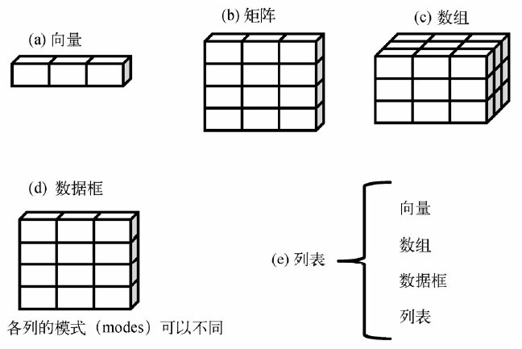

# R 数据类型

- [R 数据类型](#r-%e6%95%b0%e6%8d%ae%e7%b1%bb%e5%9e%8b)
  - [简介](#%e7%ae%80%e4%bb%8b)

## 简介

和 C 及 java 不同，R 和 python 一样，在声明变量时不指定数据类型。

R 没有标量，单个数值作为向量的特例来处理，它通过各种类型的向量来存储数据。

R 语言中，变量类型称为模式（mode）。

R 包含多种数据类型，常用的有：Vector, List, Matrix, Array, Factor, Data Frame。

其中 vector 是最简单数据类型，有 6 种原子向量，或者称为 6 种向量，如下所示：

