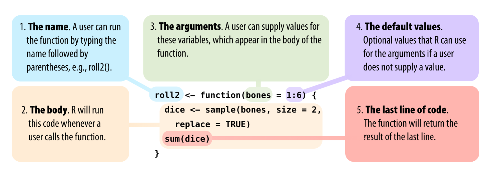
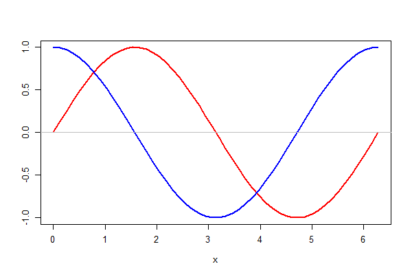

# 函数

2020-08-29
@author Jiawei Mao
***

## 简介

R 提供了许多函数，例如，用 `round` 函数对数字四舍五入，用 `factorial` 函数计算阶乘。

```R
> round(3.1415)
[1] 3
> factorial(3)
[1] 6
```

传递给函数的数据称为函数的**参数**（argument）。参数可以是原始数据、R 对象或者另一个 R 函数的结果：

```r
> mean(1:6)
[1] 3.5
> mean(die)
[1] 3.5
> round(mean(die))
[1] 4
```

抽样：从 `die` 中随机抽取一个样本

```R
> sample(x=die, size=1)
[1] 5
```

参数名称是可选的，特别是第一个参数，通常省略名称：

```R
> sample(die, size=1)
[1] 5
```

如果不确定参数名称，可以用 `args` 函数参看。例如，确定 `round` 函数包含两个参数 `x` 和 `digits`：

```r
> args(round)
function (x, digits = 0, ...) 
NULL
```

其中 `digits=0` 表示 `digits` 参数默认为 0，当不提供 `digits` 参数值，该参数取 0。覆盖默认值：

```R
> round(3.1415, digits = 2)
[1] 3.14
```

> [!TIP]
>
> 对包含多个参数的函数，建议在前 1 个或 2 个参数后，全部列出参数名称，这样有助于他人理解你的代码。

## 函数定义

R 函数包含三部分：

1. 函数名称
2. 函数体
3. 参数

使用 `function` 关键字定义函数，一般格式为：

```r
函数名 <- function(形参列表){
    函数体
}
```

使用 `return(x)` 返回 x 值，要返回多个值，可以打包在 list 中。

例如：模拟投掷两颗骰子，返回数字加和

```R
roll <- function() {
  die <- 1:6
  dice <- sample(die, size = 2, replace = TRUE)
  sum(dice) # 返回最后一行的结果
}
```

以参数形式提供初始的数字序列：

```R
roll2 <- function(bones){
  dice <- sample(bones, size=2, replace = TRUE)
  sum(dice)
}
```

为 `bones` 参数设置默认值：

```R
roll2 <- function(bones = 1:6) {
  dice <- sample(bones, size = 2, replace = TRUE)
  sum(dice)
}
```

总结：



### 无参函数

例如，定义一个无参的绘图函数：

```r
f <- function() {
  x <- seq(0, 2 * pi, length = 50)
  y1 <- sin(x)
  y2 <- cos(x)
  plot(x, y1, type = 'l', lwd = 2, col = 'red',
       xlab = 'x', ylab = "")
  lines(x, y2, lwd = 2, col = 'blue')
  abline(h = 0, col = 'gray')
}
f()
```



### 一元函数

一元函数，即包含一个参数的函数。其定义十分简单：

```r
f <- function(x) 1 / sqrt(1 + x^2)
```

该函数和数学函数 $f(x)=1/\sqrt{1+x^2}$ 对应。

函数定义中的自变量 `x` 称为形参（formal argument）。函数调用时，为形参提供的参数值称为实参（actual argument）。

## 向量化运算

例如，对下面向量每个元素乘以2，使用 for 循环实现：

```r
> a <- c(2, 4, 3, 1, 5, 7)
> for (i in seq_along(a)) {
+   print(a[i] * 2)
+ }
[1] 4
[1] 8
[1] 6
[1] 2
[1] 10
```

事实上，R支持向量化运算，即将运算符或函数作用于向量的每一个元素，所以可以用向量化代替循环：

```r
> a * 2
[1]  4  8  6  2 10 14
```

达到相同效果，但是更简洁。

再比如，找出 a 中元素大于2的所有值，也可以用向量化操作：

```r
> a[a > 2]
[1] 4 3 5 7
```
