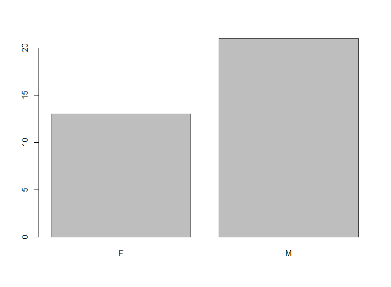

# R 绘图基础

## 简介

R语言的前身是S语言， S语言设计的目的就是交互式数据分析、绘图。 所以绘图是R的重要功能。

R 自带从S语言继承的基本绘图功能， 还有一些功能更易用、更强大的绘图系统， 如lattice、ggplot2。 基本绘图使用简单，灵活性强，但是为了做出满意的图形需要比较多的调整。下面先讲解R语言的基本绘图功能。

R的基本绘图功能有两类图形函数：

- 高级图形函数， 直接针对某一绘图任务作出完整图形；
- 低级图形函数，在已有图形上添加内容。

具备有限的与图形交互的能力（函数locator 和identify）。

## 常用高级图形

### 条形图

```r
library(readr)

d.cancer <- readr::read_csv("src/data/cancer.csv", locale = locale(encoding="GBK"))
res1 <- table(d.cancer[,'sex']);
barplot(res1)
```



添加颜色、标题：

```r
barplot(res1,
  main = "Sex Distribution",
  col = c("brown2", "green")
)
```


R 函数 `colors()` 可以返回 R 中定义的六百多种颜色名称，如前 10 种颜色：

```r
> head(colors(), 10)
 [1] "white"         "aliceblue"     "antiquewhite"  "antiquewhite1" "antiquewhite2" "antiquewhite3" "antiquewhite4"
 [8] "aquamarine"    "aquamarine1"   "aquamarine2" 
```

`width` 与 `xlim` 配合可以调整条形宽度，例如：
