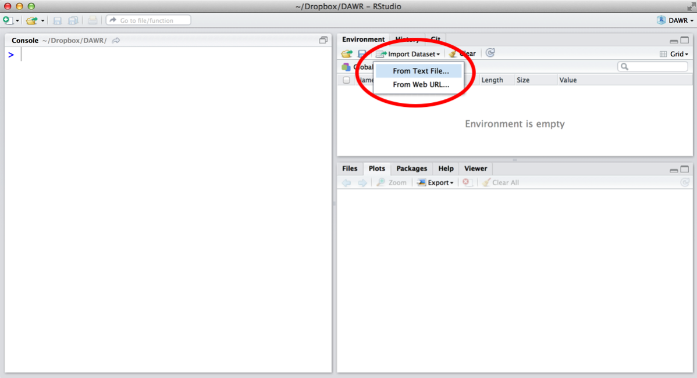
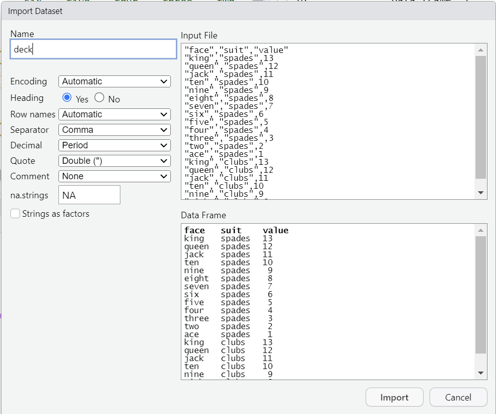
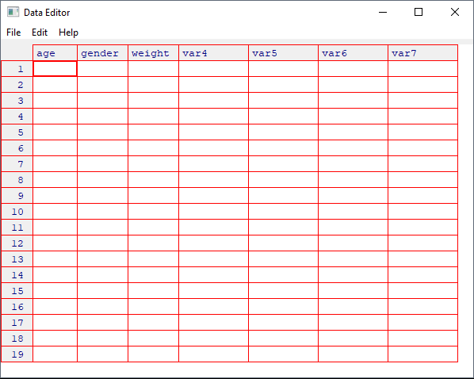

# R IO

2024-09-04 ⭐
@author Jiawei Mao
***

## base R 数据集

R 在 `datasets` 包中自带了许多数据集。查看数据集列表：

```R
help(package = "datasets")
```

要使用这些数据集，只需键入名称。每个数据集已经保存为一个 R 对象。例如：

```R
> iris
    Sepal.Length Sepal.Width Petal.Length Petal.Width    Species
1            5.1         3.5          1.4         0.2     setosa
2            4.9         3.0          1.4         0.2     setosa
3            4.7         3.2          1.3         0.2     setosa
4            4.6         3.1          1.5         0.2     setosa
5            5.0         3.6          1.4         0.2     setosa
6            5.4         3.9          1.7         0.4     setosa
7            4.6         3.4          1.4         0.3     setosa
8            5.0         3.4          1.5         0.2     setosa
9            4.4         2.9          1.4         0.2     setosa
...
```

## 工作目录

每次打开 R，它都会链接到计算机上的一个目录，R 称之为**工作目录**。

当你加载文件时，R 会在这里查找文件；当你保存文件，R 也会保存到这里。查看工作目录：

```R
> getwd()
[1] "D:/repo/rstudio_demo/hello_world"
```

可以直接将数据放到工作目录，也可以将工作目录设置到数据所在为止。使用 `setwd()` 设置工作目录。推荐将工作目录设置为正在处理的项目的文件夹，这样所有数据、脚本和图标都保存在同一个地方。例如：

```R
> setwd("D:/data/project1")
> getwd()
[1] "D:/data/project1"
```

如果文件不在工作目录的根目录，R 假设其路径从当前工作目录开始。

在 RStudio 中，可以通过 Session > Set Working Directory > Choose Directory 来设置工作目录。

查看工作目录文件：

```R
> list.files()
[1] "abalone.csv"       "cards.csv"         "deck.csv"         
[4] "hello_world.Rproj" "poker.R"           "qplot_demo.R"     
[7] "renv"              "renv.lock"         "s1.R"  
```

## 纯文本文件

### read.table

```R
read.table(file, header = FALSE, sep = "", quote = "\"'",
           dec = ".", numerals = c("allow.loss", "warn.loss", "no.loss"),
           row.names, col.names, as.is = !stringsAsFactors, tryLogical = TRUE,
           na.strings = "NA", colClasses = NA, nrows = -1,
           skip = 0, check.names = TRUE, fill = !blank.lines.skip,
           strip.white = FALSE, blank.lines.skip = TRUE,
           comment.char = "#",
           allowEscapes = FALSE, flush = FALSE,
           stringsAsFactors = FALSE,
           fileEncoding = "", encoding = "unknown", text, skipNul = FALSE)

read.csv(file, header = TRUE, sep = ",", quote = "\"",
         dec = ".", fill = TRUE, comment.char = "", ...)

read.csv2(file, header = TRUE, sep = ";", quote = "\"",
          dec = ",", fill = TRUE, comment.char = "", ...)

read.delim(file, header = TRUE, sep = "\t", quote = "\"",
           dec = ".", fill = TRUE, comment.char = "", ...)

read.delim2(file, header = TRUE, sep = "\t", quote = "\"",
            dec = ",", fill = TRUE, comment.char = "", ...)
```

使用 `read.table()` 读取纯文本文件，第一个参数为文件名。`read.table()`有很多参数：

- `sep`

数据分隔符。默认为遇到的第一个空格，即空格, tab、换行符和回车。

- `header`

文件的第一行是否为标题。

- `na.strings`

表示缺失值的字符串。所以匹配该字符串的值，`read.table()` 将其转换为 NA。

- `skip` 和 `nrow`

有些纯文本文件开头包含一段介绍性文字，它们不属于数据集；或者你只想读取一部分数据。

`skip` 表示开头跳过的行数；`nrow` 表示读取该行数后停止。

例如，下面的数据，需要跳过前 3 行，然后读取剩下的 5 行：

```
This data was collected by the National Poker Institute.
We accidentally repeated the last row of data.

"card", "suit", "value"
"ace", "spades", 14
"king", "spades", 13
"queen", "spades", 12
"jack", "spades", 11
"ten", "spades", 10
"ten", "spades", 10
```

```R
read.table("poker.csv", sep = ",", header = TRUE, skip = 3, nrow = 5)
```

标题行不包含在 `nrow` 中。

- `stringsAsFactors`

R 默认会将字符串转换为 factor，但这并不合理（R4.4 默认不转换为 factor）。因此建议保证 `stringsAsFactors = FALSE`：

```R
read.table("poker.csv", sep = ",", header = TRUE, stringsAsFactors = FALSE)
```

也可以在全局改变默认行为：

```R
options(stringsAsFactors = FALSE)
```

这就确保所有字符串被读取为字符串，而不是 factor，直到你结束当前 R 会话，或者再次修改全局设置：

```R
options(stringsAsFactors = TRUE)
```

### read Family

R 附带了特定设置的 `read.table` 快捷方式：

| 函数          | 配置                              | 使用          |
| ------------- | --------------------------------- | ------------- |
| `read.table`  | `sep="", header=FALSE`            | 通用          |
| `read.csv`    | `sep = ",", header=TRUE`          | csv 文件      |
| `read.delim`  | `sep = "\t", header=TRUE`         | tab 文件      |
| `read.csv2`   | `sep = ";", header=TRUE, dec=","` | 欧洲 csv 文件 |
| `read.delim2` | `sep="\t", header=TRUE, dec=","`  | 欧洲 tab 文件 |

> [!NOTE]
>
> 欧洲用逗号作为小数点，分号作为分隔符。

### read.fwf

有些文本文件不使用分隔符，而是采用固定宽度来分隔数据。这类文件称为固定宽度文件（fixed-width files），通常以 `.fwf` 结尾。

fwf 文件不怎么好处理，R 提供了读取 fwf 文件的函数，但没提供保存为 fwf 文件的函数。

`read.fwf()` 函数的参数与 `read.table` 类似，多了一个 `widths` 参数，定义每个数据开始的位置。示例：

```R
poker <- read.fwf("poker.fwf", widths = c(10, 7, 6), header = TRUE)
```

### HTML 链接

`read.table()`, `read.csv()` 可以直接读取网络上的文件。将文件名替换为 web 地址即可：

```R
poker <- read.csv("http://.../poker.csv")
```

### 保存纯文本文件

| 文件格式   | 函数和语法                                                   |
| ---------- | ------------------------------------------------------------ |
| csv        | ` write.csv(r_object, file = filepath, row.names = FALSE)`   |
| csv (欧洲) | `write.csv2(r_object, file = filepath, row.names = FALSE)`   |
| tab        | `write.table(r_object, file = filepath, sep = "\t", row.names=FALSE)` |

这三个函数的第一个参数为包含数据集的 R 对象。`file` 是文件路径（包括扩展名）。

默认将数据保存到当前工作目录。如果提供完整路径，则保存到对应为止。

- 保存 poker 保存到工作目录的 `data` 子目录

```R
write.csv(poker, "data/poker.csv", row.names = FALSE)
```

> [!IMPORTANT]
>
> `write.csv()` 和 `write.table` 不能创建新目录，因为指定的文件路径，每个文件夹必须存在。 

`row.names = FALSE` 参数是必然将 data-frame 的 row 名称保存为文件中的 column。R 会自动为 row 编号，作为每个 row 的名称。如果将其保存到文件，下次再次读取文件，这些编号成为新的 column，而 R 再次自动为 row 编号，导致前面两列都成了编号。

### 压缩文件

用函数 `bzfile()`, `gzfile()` 或 `xzfile()` 包围文件名或文件路径，即可压缩纯文本文件。例如：

```R
write.csv(poker, file = bzfile("data/poker.csv.bz2"), row.names = FALSE)
```

这三个函数对应的压缩类型：

| 函数     | 压缩类型       |
| -------- | -------------- |
| `bzfile` | bzip2          |
| `gzfile` | gnu zip (gzip) |
| `xzfile` | xz             |

最好调整文件扩展名以反应压缩类型。`read` 函数会自动读取压缩文件：

```R
read.csv("poker.csv.bz2")
```

## R 文件

R 提供了两种用于存储数据的文件格式：.RDS 和 .RData。

RDS 存储单个 R 对象，RData 可以存储多个 R 对象。

使用 `readRDS()` 读取 RDS 文件：

```R
poker <- readRDS("poker.RDS")
```

RData 文件则使用 `load` 函数：

```R
load("file.RData")
```

对 RData，不需要分配对象，RData 中的对象将以其原始名称加载到 R 会话中。RData 可以包含多个 R 对象，因此加载一个对象可能会读取多个对象。`load()` 函数不会告诉你读了多少个对象，也不会告诉你各个对象的名称，因此在加载 RData 文件时，应该已经知道里面包含的内容。

在 RStudio 的 environment 窗口可以查看 R 会话期间创建或加载的所有对象。

还可以在加载 RData 时加上括号，即 `(load("poker.RData"))`，这会是的 R 打印从 RData 加载的每个对象的名称。

`readRDS()` 和 `load()` 的第一个参数都是文件路径。

### 保存 R 文件

可以将 R 对象（如 data frame）保存为 RData 文件或 RDS 文件。RData 可以一次存储多个对象，但推荐使用 RDS，这样代码的可重现性更好。

- 使用 `save()` 保存为 RData 文件
- 使用 `saveRDS()` 保存为 RDS 文件

两个函数的第一个参数均为 R 对象，第二个参数为文件路径。

例如，假设有 `a`, `b`, `c` 三个 R 对象，可以将它们都保存到相同的 RData 文件，然后在另一个 R 会话中加载：

```R
a <- 1
b <- 2
c <- 3
save(a, b, c, file = "stuff.RData")
load("stuff.RData")
```

但是，如果你忘记对象名称，或者将文件交给其他人使用，就很难确定文件中包含哪些对象。

RDS 文件相对清晰，每个文件只能保存一个对象，加载它的人可以决定如何命名该对象。也不需要担心加载的对象是否会与已有对象重名：

```R
saveRDS(a, file = "stuff.RDS")
a <- readRDS("stuff.RDS")
```

将数据保存为 R 文件的主要优势：

- R 会自动压缩文件
- R 会保存对象相关的元数据

如果你的数据包含因子、日期或 class 属性，这将非常便捷。

另一方面，R 文件不能被其它程序读取，在共享方面效率低。

## 加载数据 

[deck.csv](https://gist.github.com/garrettgman/9629323) 是一个 CSV 文件。在 RStudio 中导入该文件：



RStudio 会提示选择要导入的文件，然后打开一个向导辅助导入数据，如下图所示：：

- Name，数据集名称
- Separator，分隔符
- Heading，是否包含标题行
- Strings as factors，是否将字符串转换为 factor，建议不勾选
- 右侧为预览



设置好后，点击 Import。RStudio 会读取文件，将数据保存为 data-frame，并同时打开一个 data-viewer 展示导入的数据。

可以用 `head(deck)` 查看导入的数据：

```R
> head(deck)
   face   suit value
1  king spades    13
2 queen spades    12
3  jack spades    11
4   ten spades    10
5  nine spades     9
6 eight spades     8
```

> [!NOTE]
>
> `head()` 和 `tail()` 是用来查看大型数据集的两个简便方法。
>
> `head()` 返回数据集的前 6 行，`tail()` 返回最后 6 行。
>
> 要查看不同的行数，可以提供第二个参数，例如 `head(deck, 10)` 查看前 10 行。

## 保存数据

使用 `write.csv()` 将数据保存为 csv 格式。例如，将上面的 deck 数据保存为 cards.csv 文件：

```R
write.csv(deck, file = "cards.csv", row.names = FALSE)
```

`write.csv()` 函数包含大量参数，其中有三个参数是必须的：

- 要保存的 data-frame
- 文件名
- `row.names=FALSE`，这样可以避免 R 在 data-frame 的第一列添加数字编号。

## 控制台 IO

`scan()`, `readline()`, `print()` 和 `cat()` 函数用于控制台 IO。

### scan

`scan()` 可以从控制台或文件读取数值向量。

```r
scan(file = "", what = double(), nmax = -1, n = -1, sep = "",
     quote = if(identical(sep, "\n")) "" else "'\"", dec = ".",
     skip = 0, nlines = 0, na.strings = "NA",
     flush = FALSE, fill = FALSE, strip.white = FALSE,
     quiet = FALSE, blank.lines.skip = TRUE, multi.line = TRUE,
     comment.char = "", allowEscapes = FALSE,
     fileEncoding = "", encoding = "unknown", text, skipNul = FALSE)
```

参数说明：

- file

文件名，如果为 `""`，则从键盘读取。

如果为文件路径，对相对路径，从工作目录 `getwd()` 解析文件路径；或者以绝对路径指定。

- what

`what` 指定读取的数据类型，支持类型有 `logical`, `integer`, `numeric`, `complex`, `character`, `raw` 以及 `list`。

`scan()` 从控制台或文件读取一个向量或 list。

例如，有四个文件：

- 文件 `z1.txt`

```txt
123
4 5
6
```

读取效果：

```r
> a <- scan("basic/z1.txt")
Read 4 items
> print(a)
[1] 123   4   5   6
> print(typeof(a))
[1] "double"
```

即结果为 `double` 类型的向量。

- 文件 `z2.txt`

```txt
123
4.2 5
6
```

读取效果：

```r
> b <- scan("basic/z2.txt")
Read 4 items
> print(b)
[1] 123.0   4.2   5.0   6.0
> print(typeof(b))
[1] "double"
```

- 文件 `z3.txt`

```txt
abc
de f
g
```

直接读取该文件报错：

```r
> v3 <- scan("basic/z3.txt")
Error in scan("basic/z3.txt") : scan() expected 'a real', got 'abc'
```

因为默认按照数字读取，对字符串，需要额外设置：

文件 `z4.txt`:

```txt
abc
123 6
y
```

```r
> a <- scan("basic/z1.txt")
Read 4 items
> print(a)
[1] 123   4   5   6
> print(typeof(a))
[1] "double"
```

返回的为 `double` 类型的向量。

输出输入：

```r
cat(1:12, "\n", file="d:/work/x.txt")
x <- scan("d:/work/x.txt")
```

如果没有给出文件参数，则从命令读入数据。可以在一行用空格隔开多个数据，也可以多行输入直到空行结束输入。

使用该方法可以读入矩阵，假设文件 `mat.txt` 包含如下矩阵：

```txt
3  4  2
5 12 10
7  8  6
1  9 11
```

可以先把文件读入到向量，再使用 `matrix()` 函数转换为矩阵。注意使用 `byrow=TRUE` 选项，同时指定 `ncol` 选项。例如：

```r
M <- matrix(scan("mat.txt", quiet=TRUE), ncol=3, byrow=TRUE)
```

`scan()` 中的 `quite=TRUE` 使得读入时不自动显示读入的数值数目。

上面读入数值矩阵的方法在数据量较大时可以使用。

`read_table()` 和 `readr::read_table()` 也可以读入这样的数据，但是会保存为数据框而不是矩阵，而且 `read_table()` 在读取大规模矩阵时效率很低。

### print

`print()` 函数显示某个变量或表达式的值，例如：

标量输出：

```r
> x <- 1.234
> print(x)
[1] 1.234
```

向量输出：

```r
> y <- c(1,3,5)
> print(y[2:3]) # 输出第二个和第三个元素
[1] 3 5
```

### cat

用 `cat()` 把字符串、变量、表达式连接起来显示，其中变量和表达式一般是标量或向量，不能为矩阵、列表等复杂数据。例如：

```r
> x <- 1.234
> cat("x = ", x, "\n")
x =  1.234
```

再比如：

```r
> cat("sin(pi/2) =", sin(pi/2), "\n")
sin(pi/2) = 1
```

`cat` 的最后一项 `\n` 用于换行。

`cat()` 默认显示在命令行窗口，要写入文件，可以在 `cat()` 中添加 `file=` 选项，如果已经文件，默认覆盖文件，否则在 `cat()` 中使用 `append=TRUE` 选项以追加内容。例如：

```r
cat("=== 结果文件 ===\n", file="res.txt")
cat("x =", x, "\n", file="res.txt", append=TRUE)
```

### sink

`sink()` 可用于收集控制台运行结果。

在 R 命令行中运行过的命令会被保存在工作文件夹的 `.Rhistory` 文件中。而使用 `sink()` 函数可以保存执行命令输出的内容。

`sink()` 打开一个文本，运行结束后再次调用 `sink()` 关闭文件：

```r
sink("tmpres01.txt", split=TRUE)
print(sin(pi/6))
print(cos(pi/6))
cat("t(10)的双侧0.05分位数（临界值）=", qt(1 - 0.05/2, 10), "\n")
sink()
```

`sink()` 用作输出记录，主要用在测试里，正常的输出应该使用 `cat()`、`write.table()`, `write.csv()` 等函数。

设置 `split=TRUE` 可以在写入文件时，同时在控制台输出：

```r
sink("allres.txt", split=TRUE)
```

### save

在 R 命令行中定义的变量、函数会保存在工作空间中， 并在退出 R 会话时可以保存到硬盘文件中。 用 `save()` 命令可以把指定的若干个变量（直接用名字，不需要表示成字符串） 保存到用 `file=` 指定的文件中， 随后可以用 `load()` 命令恢复到工作空间中。

虽然允许保存多个变量到同一文件中， 但应该尽可能仅保存一个变量， 而且使用变量名作为文件名。 用 `save()` 保存的R特殊格式的文件是通用的， 不依赖于硬件和操作系统。 如

```r
save(scores, file="scores.RData")
load("scores.RData")
```

保存多个变量，如：

```r
save(x, zeta, file="myvars20200315.RData")
```

或：

```r
save(x, zeta, file="myvars20200315.RData")
```

对数据框，可以用 `write.csv()` 或 `readr::write_csv()` 将其保存为 CSV 文本文件。比如：

```r
da <- tibble("name"=c("李明", "刘颖", "张浩"),
                 "age"=c(15, 17, 16))
write_csv(da, path="mydata.csv")
```

生成的 mydata.csv 文件内容如下：

```csv
name,age
李明,15
刘颖,17
张浩,16
```

不过，在 Windows 操作系统中，默认编码是 GBK编码，而用 `write_csv()` 生成的 CSV 文件是 UTF-8 编码，而 MS Office 不能自动识别这样的CSV文件，可以改用 `write_csv_excel()` 函数。

R 基本的 `write.csv()` 函数不存在该问题。

## 键盘输入

edit() 函数自动调用一个允许手动输入输入的文本编辑器。步骤：

1. 创建一个空的数据框（或矩阵），并制定好变量名和变量的类型
2. 针对该数据调用文本编辑器，输入你的数据，并将结果保存回数据对象。
这种输入方式，对小数据集比较合适。

例：

```r
mydata <- data.frame(age = numeric(0),
                     gender = character(0),
                     weight = numeric(0))
mydata <- edit(mydata)
```

说明：

- `numeric(0)` 指定类型但不包含实际数据
- `edit()`的返回值需要赋值回原对象.edit() 在对象的副本上进行操作，如果不赋值回原目标，数据丢失。

运行，弹出一个输入框：



输入完成后，关掉窗口，数据会自动保存到对象中。

## 文件读写

文件的读写在工作目录中完成，使用 `getwd()` 获得工作命令，使用 `setwd("C:/data")` 设置工作目录。如果文件不在工作目录里，则必须给出它的路径。

### 常见格式

| 文件格式      | R函数                                           |
| ------------- | ----------------------------------------------- |
| txt           | `read.table()`                                  |
| csv           | `read.csv()`, `readr:read_csv()`                |
| xls, xlsx     | `readxl::read_excel()`, `openxlsx::read.xlsx()` |
| sav           | `foreign::read.spss()`                          |
| .Rdata or rda | `load()`                                        |
| rds           | `readRDS()` and `readr:read_rds()`              |
| dta           | `haven::read_dta()` and `haven::read_stata()`   |
| Internet      | `download.file()`                               |

基本范例：

```r
d <- read.table(file= "./data/txt_file.txt", header = TRUE)
load(file = "./data/rda_file.rda")

d <- readRDS(file = "./data/rds_file.rds")

library(readr)
d <- read_csv(file = "./data/csv_file.csv")

url <- "https://raw.githubusercontent.com/perlatex/R_for_Data_Science/master/demo_data/wages.csv"
d <- read_csv(url)

library(readxl)
d <- read_excel("./data/vowel_data.xlsx")

library(haven)
d <- read_excel("./data/cfps2010.dta")
```

## 读取带分隔符的文本文件

语法：

```r
read.table(file, header = FALSE, sep = "", quote = "\"'",
           dec = ".", numerals = c("allow.loss", "warn.loss", "no.loss"),
           row.names, col.names, as.is = !stringsAsFactors,
           na.strings = "NA", colClasses = NA, nrows = -1,
           skip = 0, check.names = TRUE, fill = !blank.lines.skip,
           strip.white = FALSE, blank.lines.skip = TRUE,
           comment.char = "#",
           allowEscapes = FALSE, flush = FALSE,
           stringsAsFactors = default.stringsAsFactors(),
           fileEncoding = "", encoding = "unknown", text, skipNul = FALSE)
read.csv(file, header = TRUE, sep = ",", quote = "\"",
         dec = ".", fill = TRUE, comment.char = "", …)

read.csv2(file, header = TRUE, sep = ";", quote = "\"",
          dec = ",", fill = TRUE, comment.char = "", …)

read.delim(file, header = TRUE, sep = "\t", quote = "\"",
           dec = ".", fill = TRUE, comment.char = "", …)

read.delim2(file, header = TRUE, sep = "\t", quote = "\"",
            dec = ",", fill = TRUE, comment.char = "", …)
```

参数说明：

- file, 带分隔符的ASCII文本文件
- header，表面首行是否包含了变量名称
- sep, 指定分隔符
- row.names，可选参数，指定一个或多个表示行标识符的变量

字符型变量，默认读取为 factor类型，如果不希望如此，可以通过 read.table 的参数设置。

例如，读取CSV文件

```r
a_table <- read.table("io/input.csv", header = TRUE, sep = ",")
```

`read.csv` 对 `read.table`  进行了包装，从而更便于读取 CSV 文件。

## Excel 文件

### 从 Excel 导出

将数据从 Excel 迁移到 R 的最佳方式是从 Excel 将数据导出为 .csv 或 .txt 文件。这样 R 或其它数据分析软件就能读取。文本文件是数据存储的通用格式。

导出数据还解决了另一个问题。Excel 使用专有格式和元数据，直接转换为 R  不容易。例如，一个 Excel 文件可能包含多个表格，每个表格都有自己的列和宏。当 Excel 将其导出为 .csv 或 .txt 文件，Excel 会保证导出的正确性。而直接使用 R 可能无法保证转换的有效性。

### 复制粘贴

可以复制 Excel 表格的部分内容并粘贴到 R。从 Excel 复制数据后，使用 R 读取剪贴板：

```R
read.table("clipboard")
```

在 Mac 中：

```R
read.table(pipe("pbpaste"))
```

如果单元格包含带空格的值，`read.table()`  可能无法正确处理，此时可以采用其它 `read` 函数，或者直接从 Excel 导出 csv 文件。

### XLConnect

有许多包可以直接在 R 中读取 Excel 文件。可惜这些包大多无法跨平台工作，不过 `XLConnect` 包可以在所有文件系统工作。安装并加载：

```R
install.packages("XLConnect")
library(XLConnect)
```

XLConnect 依赖于 Java 平台，所以在第一次打开 XLConnect 时，RStudio 会要求安装 JRE。

### 读取 XLSX

用 XLConnect 读取 XSLX 文件可以采用一步或两步法。两步法：

1. 用 `loadWorkbook()` 加载 .xls 或 .xlsx 文件，采用为文件名

```R
wb <- loadWorkbook("file.xlsx")
```

2. 用 `readWorksheet()` 用 workbook 读取表格

- 第一个参数为 `loadWorkbook()` 返回的 workbook 对象；

- 第二个参数为 `sheet` 为表格名称或编号

`readWorksheet()` 余下四个参数指定要读取的单元格的范围：

- `startRow` 和 `endRow`
- `startCol` 和 `endCol`

如果不提供范围，`readWorksheet()` 读取包含数据的矩形区域。

`readWorksheet()` 假设该区域包含标题，可以用 `header = FALSE` 设置不包含标题。

例如：从 `wb` 读取第一个表格：

```R
sheet1 <- readWorksheet(wb, sheet = 1, startRow = 0, startCol = 0,
                        endRow = 100, endCol = 3)
```

R 将读取的数据保存为 data-frame。`readWorksheet()` 除了第一个参数，其它参数都是向量化的，因此可以使用它从一个 workbook 一次读取多个表格，返回 data-frame list。

以上两步可以合并为一步，用 `readWorksheetFromFile()` 函数直接从 Excel 文件读取一个或多个表格：

```R
sheet1 <- readWorksheetFromFile("file.xlsx", sheet = 1, startRow = 0,
	startCol = 0, endRow = 100, endCol = 3)
```

### 输出 XLSX

输出一个 Excel 文件分为 4 步：

1. 使用 `loadWorkbook()` 设置一个 workbook 对象

步骤和读取一样，只是添加参数 `create = TRUE`。XLConnect 会创建一个空的 workbook，保存时，XLConnect 会将数据写入指定的文件位置：

```R
wb <- loadWorkbook("file.xlsx", create = TRUE)
```

2. 使用 `createSheet()` 创建表格

```R
createSheet(wb, "Sheet 1")
```

3. 使用 `writeWorksheet()` 将 data-frame 或 matrix 对象保存到 sheet

```R
writeWorksheet(wb, data = poker, sheet = "Sheet 1")
```

- 第一个参数是待写入的 workbook 对象
- 第二个参数 `data` 是待输出的数据
- 第三个参数 `sheet` 是待写入 sheet 的名称
- 参数 `startRow` 和 `startCol` 指定将数据写入表格哪个位置，默认均为 1
- `header` 表示是否同时输出 column names

4. 使用 `saveWorkbook()` 保存 workbook

R 会将 workbook 保存到 `loadWorkbook()` 指定的文件位置。如果该位置已有文件，则覆盖它。

调用 `writeWorksheetToFile` 可以将这 4 个步骤合并为一步：

```R
writeWorksheetToFile("file.xlsx", data = poker, sheet = "Sheet 1",
  startRow = 1, startCol = 1)
```

XLConnect 还有许多高级功能，包括使用公式、单元格样式等，具体可参考 XLConnect 文档。

## xlsx

`readxl` 包的 `read_excel()` 可用于读取 `.xls` 和 `.xlsx` 文件。

```r
# Only need to install once
install.packages('readxl')

library(readxl)
data <- read_excel('datafile.xlsx', 1)
```

可以通过名称或索引指定读取的 sheet：

```r
data <- read_excel('datafile.xls', sheet = 2)

data <- read_excel('datafile.xls', sheet = 'Revenues')
```

`read_excel()` 使用第一行作为 column 名称。如果不希望如此，可以设置 `col_names=FALSE`。此时 columns 默认名称为 `X1`, `X2` 等。

另外，`read_excel()` 会自动推断每列的数据类型，也可以使用 `col_types` 参数指定类型。将特定列的类型指定为 `'blank'` 则删除该列：

```r
# Drop the first column, and specify the types of the next three columns
data <- read_excel('datafile.xls',
                   col_types = c('blank', 'text', 'date', 'numeric'))
```

## 从其他程序加载文件

和 Excel 文件一样，可以使用原程序将其导出为纯文本文件，通常为 csv 文件。

不过，也有各种 packages 支持直接读取这些程序的数据文件。示例：

| 文件格式                 | 函数             | 包         |
| ------------------------ | ---------------- | ---------- |
| ERSI ArcGIS              | `read.shapefile` | shapefiles |
| Matlab                   | `readMat`        | R.matlab   |
| minitab                  | `read.mtp`       | foreign    |
| SAS (permanent data set) | `read.ssd`       | foreign    |
| SAS (XPORT format)       | `read.xport`     | foreign    |
| SPSS                     | `read.spss`      | foreign    |
| Stata                    | `read.dta`       | foreign    |
| Systat                   | `read.systat`    | foreign    |

## 连接数据库

可以使用 R 连接数据库并读取数据。

如何实现这一点取决于使用的数据库系统，例如：

- 使用 RODBC 包可以通过 ODBC 连接数据库
- 使用 DBI 包可以通过单独的驱动连接到数据库。

DBI 包为处理不同数据库提供了通用语法。需要下载一个特定于数据库的包与 DBI 一起使用：

- 对 MySQL 使用 RMySQL
- 对 SQLite 使用 RSQLite
- 对 Oracle 使用 ROracle
- 对 PostgreSQL 使用 RPostgreSQL
- 对 JDBC 使用 RJDBC

加载合适的驱动程序包后，就可以使用 DBI 提供的命令访问数据库。
