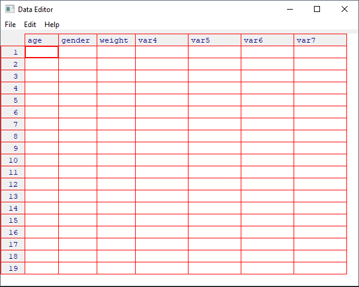

# 键盘输入

2026-09-01⭐
@author Jiawei Mao

***
## 简介

用键盘输入数据有两种常见的方式：

- 用 R 内置的文本编辑器
- 直接在代码中嵌入数据

## R 内置文本编辑器

`edit()` 函数自动调用一个允许手动输入的文本编辑器。步骤：

1. 创建一个空数据框（或矩阵），并指定变量名和变量类型
2. 针对该数据调用文本编辑器，输入数据，并将结果保存回数据对象。

这种输入方式，对小数据集比较合适。例如：

```r
mydata <- data.frame(age = numeric(0), # 数值型
                     gender = character(0), # 字符型
                     weight = numeric(0)) # 数值型
mydata <- edit(mydata) # 调用文本编辑器
```

说明：

- `numeric(0)` 指定类型但不包含实际数据
- `edit()`的返回值需要赋值回原对象。`edit()` 在对象的副本上进行操作，如果不赋值回原目标，数据丢失。

运行，弹出一个输入框：



输入完成后，关掉窗口，数据会自动保存到对象中。

## 在代码中嵌入数据

```R
mydatatxt <- "
age gender weight
25 m 166
30 f 115
18 f 120
"
mydata <- read.table(header = TRUE, text = mydatatxt)
```

这里创建了一个用来存储原始数据的字符型变量，然后使用函数 `read.table()` 处理这个字符串并返回数据框。

> [!TIP]
>
> 数据键盘输入数据在处理小型数据集时很有效。