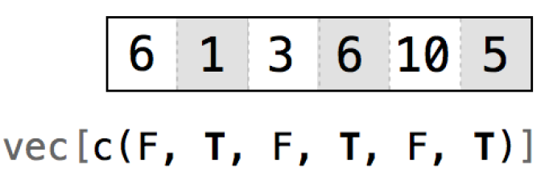
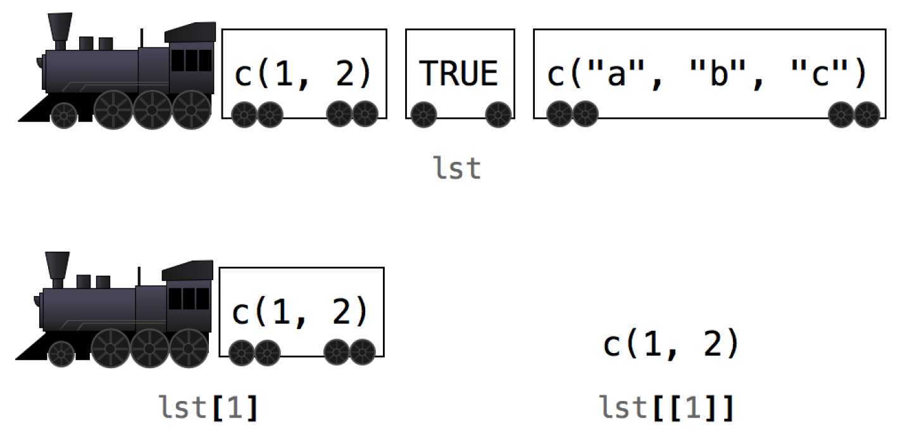

# R 符号系统

2024-09-05 ⭐
@author Jiawei Mao

***
## 选择值

从 data frame 选择一个或一组值：

```R
deck[,]
```

方括号中是用逗号分隔的两个索引值，分别对应 row-index 和 column-index。

索引的设置有 6 种选择：

1. 正整数
2. 负整数
3. 0
4. 空白
5. logical 值
6. names

### 1. positive integer

- `deck[i, j]` 表示第 $i$ 行第 $j$ 列的值。

例如：`deck[1,1]` 返回第 1 行第 1 列的值。

```R
> head(deck)
   face   suit value
1  king spades    13
2 queen spades    12
3  jack spades    11
4   ten spades    10
5  nine spades     9
6 eight spades     8
> deck[1,1]
[1] "king"
```

> [!NOTE]
>
> R 的索引从 1 开始。

- 返回多个值

使用 positive integer 向量，可以一次选择多个值。

例如：`deck[1, c(1, 2, 3)]` 或 `deck[1, 1:3]` 返回 `deck` 第一行的三个值：

```R
> deck[1, c(1,2,3)]
  face   suit value
1 king spades    13
```

> [!NOTE]
>
> 这里不会从 `deck` 删除原始值，而是返回新的 data.frame。

- 重复索引

如果重复索引值，则返回对应值多次。例如，返回第一行的值两次：

```R
> deck[c(1,1), c(1,2,3)]
    face   suit value
1   king spades    13
1.1 king spades    13
```

R 的符号系统不局限于 data.frame。

- 向量索引

```R
> vec <- c(6, 1, 3, 6, 10, 5)
> vec[1:3]
[1] 6 1 3
> vec[1]
[1] 6
```

- 选择两个或多个 columns，返回 data.frame

```R
> a <- deck[1:2, 1:2]
> class(a)
[1] "data.frame"
```

- 选择一个 column，返回 vector

```R
> b <- deck[1:2, 1]
> class(b)
[1] "character"
```

- 如果希望选择一个 column 也返回 data.frame，则设置 `drop = FALSE`

```R
> c <- deck[1:2, 1, drop = FALSE]
> class(c)
[1] "data.frame"
```

该方法对 matrix 和 array 都适用。

### 2. negative integer

负整数与正整数的操作完全相反。R 会排除负整数绝对值指向的值。例如：

- `deck[-1, 1:3]` 返回 deck 第一行外的所有值
- `deck[-(2:52), 1:3]` 返回第一行（共 52 行）

```R
> deck[-(2:52), 1:3]
  face   suit value
1 king spades    13
```

如果希望包含 data.frame 的大部分行或列，使用 negative integer 取子集效率更高。

- 在 same index 中同时使用 positive 和 negative integer，R 会报错：

```R
> deck[c(-1, 1), 1]
Error in xj[i] : only 0's may be mixed with negative subscripts
```

- 在不同 index 中，则可以混用 positive 和 negative integer

```R
> deck[-1, 1]
 [1] "queen" "jack"  "ten"   "nine"  "eight" "seven" "six"   "five"  "four" 
[10] "three" "two"   "ace"   "king"  "queen" "jack"  "ten"   "nine"  "eight"
[19] "seven" "six"   "five"  "four"  "three" "two"   "ace"   "king"  "queen"
[28] "jack"  "ten"   "nine"  "eight" "seven" "six"   "five"  "four"  "three"
[37] "two"   "ace"   "king"  "queen" "jack"  "ten"   "nine"  "eight" "seven"
[46] "six"   "five"  "four"  "three" "two"   "ace"  
```

### 3. zero

0 表示对应维度不返回任何值，即创建空对象：

```R
> deck[0,0]
data frame with 0 columns and 0 rows
```

0 索引用处不大。

### 4. blank space

空白表示取该维度的所有值。适合提取整个 rows 或 columns。梯度 `deck` 的第 1 行：

```R
> deck[1, ]
  face   suit value
1 king spades    13
```

### 5. logical

以逻辑向量为索引，R 会将 TRUE 或 FALSE 与对应 row (或 column) 匹配，选择为 TRUE 的 row (或 column)。这种选择方式很灵活，能够间隔取值。如下图：



例如，选择第一行的第 1,2 列：

```R
> deck[1, c(TRUE, TRUE, FALSE)]
  face   suit
1 king spades
```

### 6. name

对包含 name 属性的对象，可以通过 name 选择值。

在 data.frame 中使用 name 选择 column 很常用：

```R
> deck[1, c("face", "suit", "value")]
  face   suit value
1 king spades    13
```

选择 `deck` 的 `value` 列：

```R
> deck[, "value"]
 [1] 13 12 11 10  9  8  7  6  5  4  3  2  1 13 12 11 10  9  8  7  6  5  4  3
[25]  2  1 13 12 11 10  9  8  7  6  5  4  3  2  1 13 12 11 10  9  8  7  6  5
[49]  4  3  2  1
```

## 美元符和双括号

R 中的 data.frame 和 list 还另一套符号系统，即可以用 `$` 选择值。

### data.frame

- 用 `$` 加 column-name 从 data.frame 选择 column

注意，column-name 不加引号。

```r
> deck$value
 [1] 13 12 11 10  9  8  7  6  5  4  3  2  1 13 12 11 10  9  8  7  6  5  4  3
[25]  2  1 13 12 11 10  9  8  7  6  5  4  3  2  1 13 12 11 10  9  8  7  6  5
[49]  4  3  2  
```

以**向量形式**返回 `value` 列的所有值。

`$` 表示法非常有用，因为我们经常将数据集的变量存储到 data.frame，然后对某个变量的值计算 `mean` 或 `median`。这些函数需要以向量为输入，而类似 `deck$value` 返回的刚好为向量形式：

```R
> mean(deck$value)
[1] 7
> median(deck$value)
[1] 7
```

### list

- 用 `$` 选择 list 的元素

该方式对 list 也有类似好处，如果采用上一种方式，返回包含所选元素的 **list**，即使只选择一个元素也是返回 list：

```R
> lst <- list(numbers = c(1, 2), logical = TRUE, strings = c("a", "b", "c"))
> lst
$numbers
[1] 1 2

$logical
[1] TRUE

$strings
[1] "a" "b" "c"
```

选择一个元素，返回包含该元素的 list，该元素为向量 `c(1,2)`：

```R
> lst[1]
$numbers
[1] 1 2
```

许多 R 函数不能处理 list。例如，`sum(lst[1])`会抛出错误。如果将 vector 存储在 list，但只能以 list 形式返回，就太麻烦了：

```R
> sum(lst[1])
Error in sum(lst[1]) : invalid 'type' (list) of argument
```

使用 `$` 则返回元素自身类型：

```R
> lst$numbers
[1] 1 2
```

因此便于处理：

```R
> sum(lst$numbers)
[1] 3
```

如果 list 中的元素没有 names，还可以使用双括号 `[[]]`，其效果与 `$` 一样。

- 选择 list 的第一个元素

```R
> lst[[1]]
[1] 1 2
```

> [!NOTE]
>
> 用单个方括号 `[]` 取 list 的子集，返回 list 类型；用两个方括号 `[[]]`，则返回元素自身。

```r
> lst["numbers"]
$numbers
[1] 1 2

> lst[["numbers"]] # 也可以用 name 取子集
[1] 1 2
```

这个差别很小，但是很重要。如下图所示：



可以将 list 想象成一列火车，每个元素是一节车厢：

- 使用单括号，选择单个车厢并将其作为新的火车返回
- 使用双括号，则直接将车厢里的货物卸载下来，返回的是货物

