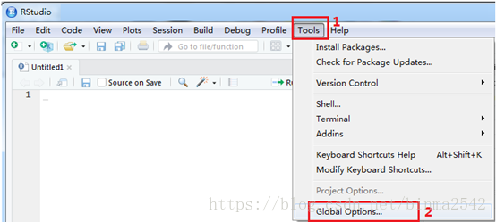
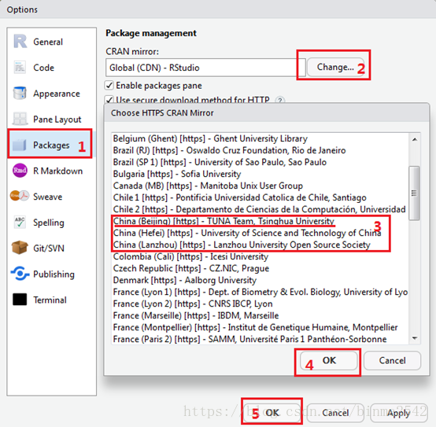

# 包管理

2024-09-04 updating R and packages
2024-09-03 ⭐⭐
@author Jiawei Mao
***

## 函数

| 函数 | 功能 |
|--|--|
| `install.packages()` | 安装包。不加参数，显示CRAN镜像站点站点，加包名称，直接下载安装包 |
| `installed.packages()` | 列出安装的包 |
| `update.packages()` | 更新已安装的包 |
| `library("lib name")` | 载入包 |
| `library()` | 不带参数，查看已安装的 R 包 |
| `search()` | 编译环境下已载入的包 |
| `help(package="package_name")` | 输出某个包的简短描述，以及包中的函数名称和数据集名称的列表 |

## 简介

R 包为 R 函数集合。

载入包
R 包在使用前，需要载入当前的 R 环境。载入包命令：

```r
library("package_name", lib.loc = "path to library")
```

安装多个包：

```r
install.packages(c("ggplot2", "devtools", "dplyr"))
```

如果下载太慢，可以设置镜像：





## 安装包

```r
install.packages(pkgs, lib, repos = getOption("repos"),
                 contriburl = contrib.url(repos, type),
                 method, available = NULL, destdir = NULL,
                 dependencies = NA, type = getOption("pkgType"),
                 configure.args = getOption("configure.args"),
                 configure.vars = getOption("configure.vars"),
                 clean = FALSE, Ncpus = getOption("Ncpus", 1L),
                 verbose = getOption("verbose"),
                 libs_only = FALSE, INSTALL_opts, quiet = FALSE,
                 keep_outputs = FALSE, …)
```

**参数：**

- `repos`，指定镜像

以安装sos包为例。sos 包用来搜索某些函数的帮助文档。 在RStudio中用 **Tools** 菜单的“Install Packages”安装， 输入sos就可以安装该扩展包。

如果不用RStudio， 在 R 图形界面选菜单“程序包-安装程序包”，在弹出的“CRAN mirror”选择窗口中选择一个中国的镜像如 “China (Beijing 2)”， 然后在弹出的“Packages”选择窗口中选择要安装的扩展软件包名称， 即可完成下载和安装。

还可以用如下程序制定镜像网站(例子中是位于清华大学的镜像网站)并安装指定的扩展包：

```r
options(repos=c(CRAN="http://mirror.tuna.tsinghua.edu.cn/CRAN/"))
install.packages("sos")
```

- 安装一个包

```R
install.packages("package name")
```

- 一次安装多个包

```R
install.packages(c("ggplot2", "reshape2", "dplyr"))
```

### 选择安装路径

如果权限允许，可以选择安装在R软件的主目录内或者用户自己的私有目录位置。

由于用户对子目录的读写有权限问题，有时不允许一般用户安装扩展包到 R 的主目录中。此时可以用 `.libPaths()`查看允许的扩展包安装位置。

在 `install.packages()` 中用 `lib=` 指定安装位置：

```r
print(.libPaths())
## [1] "D:/R/R-3.3.1/library"
install.packages("sos", lib=.libPaths()[1])
```

## 更新包

```r
update.packages()
```

对每个可更新包，会出现一个弹窗询问是否更新。如果不需要弹窗，直接更新，可以设置：

```r
update.packages(ask = FALSE)
```

示例：同时更新 ggplot2, reshape2 和 dplyr 三个包

```R
update.packages(c("ggplot2", "reshape2", "dplyr"))
```

更新 package 后，需要启动新的 R 会话才能使用新版本的 package。

如果在更新前已经加载了该 package，则需要关闭旧 R 会话，打开新的 R 会话。

## devtools

`devtools` R package 提供从 CRAN 以外的地方安装 package 的功能。devtools 提供了：

- `install_github`
- `install_gitorious`
- `install_bitbucket`
- `install_url`

等函数。它们功能类似 `install.packages`，但是 repository 不同。其中 `install_github` 特别有用，因为许多 R 开发者在 GitHub 上提供它们包的开发版本。开发版本包含新功能和补丁，但是可能没有 CRAN 版本稳定。

## GitHub 和 BioConductor

有一些扩展包没有在CRAN系统提供，而是放在 Github。对于这样的包， 安装方法如下：

```r
if(!require(devtools)) install.packages('devtools')
	devtools::install_github("kjhealy/socviz")
```

其中 kjhealy 是 Github 网站的某个作者的名称， socviz 是该作者名下的一个R扩展包。

还有一些包需要从Bioconductor网站安装：

- 需要先安装 `BiocManager`
- 然后用 `BiocManager` 安装 Bioconductor 中的包

示例如下：

```r
if (!requireNamespace("BiocManager", quietly = TRUE))
    install.packages("BiocManager")
BiocManager::install(c("Biostrings"))
```

## 加载包

例如，载入 RWeka 包：

```r
library(RWeka)
```

- 查看当前库中有哪些 package

```r
library()
```

## 迁移扩展包

在每一次 R 软件更新后，需要重新安装原来的软件包， 这个过程很麻烦。 如果仅仅是小的版本更新， 比如从3.5.1变成3.5.2， 或者从3.4.2变成3.5.0， 可以在安装新版本后， 临时将新版本的 library 子目录更名为 library0， 将老版本的library子目录剪切为新版本的library子目录， 然后将library0中所有内容复制并覆盖进入library子目录， 删除library0即可。 然后在基本R中（不要用RStudio）运行如下命令以更新有新版本的包：

```r
options(repos=c(CRAN="http://mirror.tuna.tsinghua.edu.cn/CRAN/"))
update.packages(checkBuilt=TRUE, ask=FALSE)
```

如果版本改变比较大， 可以用如下方法批量地重新安装原有的软件包。 首先，在更新R软件前，在原来的R中运行：

```r
packages <- .packages(TRUE)
dump("packages", file="packages-20180704.R")
```

这样可以获得要安装的软件包的列表。 在更新R软件后， 运行如下程序：

```r
options(repos=c(CRAN="http://mirror.tuna.tsinghua.edu.cn/CRAN/"))
source("packages-20180704.R")
install.packages(packages)
```

安装时如果提问是否安装需要编译的源代码包， 最好选择否， 因为安装源代码包速度很慢还有可能失败。

## 参考

- https://www.rdocumentation.org/packages/utils/versions/3.6.2/topics/install.packages