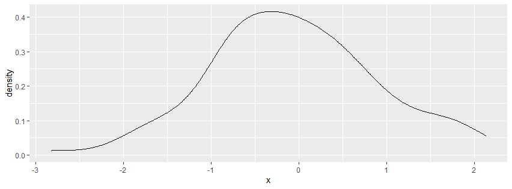
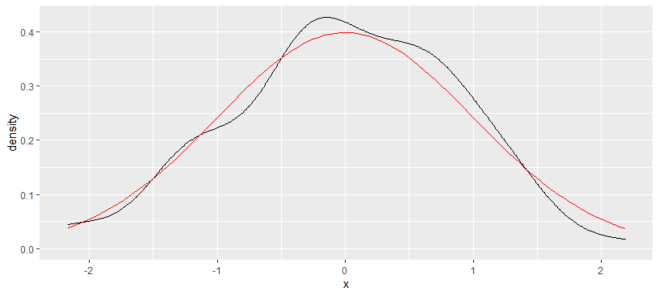

# 模拟与抽样

- [模拟与抽样](#模拟与抽样)
  - [随机数](#随机数)
    - [Uniform](#uniform)
    - [sample](#sample)

2020-06-16, 15:37
***

## 随机数

`rnorm()` 函数生成正态分布的随机数，例如：

```r
> rnorm(n=5, mean=0, sd=1)
[1]  1.1739663  0.6187899 -0.1127343  0.9170283 -0.2232594
```

R 内置了许多随机数生成函数：

| 分布     | 表示                  | 函数      |
| -------- | --------------------- | --------- |
| Uniform  | $U(a, b)$             | `runif`   |
| Normal   | $N(\mu, \sigma)$      | `rnorm`   |
| Binormal | $Bin(n, p)$           | `rbinorm` |
| Piosson  | $pois(\lambda)$       | `rpois`   |
| Beta     | $Beta(\alpha, \beta)$ | `rbeta`   |

每种分布都有四个函数：

| 函数 | 功能                   |
| ---- | ---------------------- |
| d    | density                |
| p    | cumulative probability |
| q    | quantile               |
| r    | random                 |

- 例如，生成 100 个正态分布的点，然后查看分布：

```r
library(tidyverse)

p <- tibble(
  x = rnorm(n = 100, mean = 0, sd = 1)
) %>% ggplot(aes(x = x)) +
  geom_density()
print(p)
```



下面将模拟的正态分布和理论正态分布画一下：

```r
library(tidyverse)

p <- tibble(
  x = rnorm(n = 100, mean = 0, sd = 1)
) %>% ggplot(aes(x = x)) +
  geom_density() +
  stat_function(
    fun = dnorm,
    args = list(mean = 0, sd = 1),
    color = "red"
  )
print(p)
```



数据点越多，会越接近理论分布。

### Uniform

### sample

`sample()` 从一个有限集合中无放回或有放回的随机抽样，产生随机结果。

设随机变量 X 取值 $\{正面, 反面\}$，且 $P(X=正面)=0.7=1-P(X=反面)$，如下产生 X 的 10 个随机抽样：

```r
> sample(c("正面", "反面"), size = 10, prob = c(0.7, 0.3), replace = TRUE)
 [1] "正面" "正面" "正面" "反面" "正面" "反面" "正面" "正面" "反面" "正面"
```

说明：

- `size` 指定抽样个数
- `prob` 指定每个值的概率
- `replace=TRUE` 表示放回抽样

如果要做无放回等概率抽样，可以不指定 `prob` 和 `replace` （默认 FALSE）。比如，从 `1:10` 随机抽取 4 个：

```r
> sample(1:10, size = 4)
[1] 1 7 9 2
```

如果要从 `1:n` 等概率无放回随机抽样直到每一个都被抽到，可以用：

```r
> sample(10)
 [1]  6  7  9  1 10  4  3  8  5  2
```

这实际上返回了 `1:10` 的重排序列。

dplyr 的 `sample_n()` 和 `sample()` 功能类似，但输入为数据框，输出为随机抽取的数据框行的子集。
