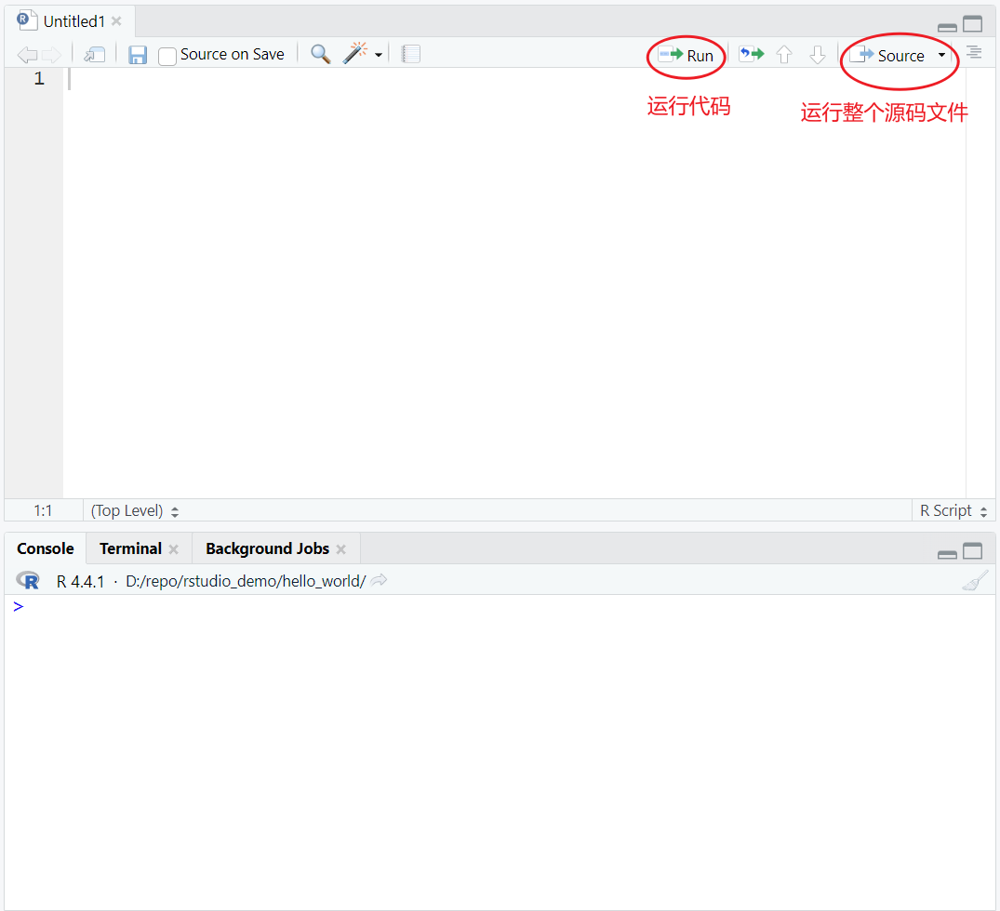

# 脚本

## 简介

R 脚本，就是一个纯文本文件，用于保存 R 代码。

在 RStudio 中创建脚本：File | New File | R Script。

保存脚本：File | Save As。

RStudio 提供的运行代码功能：

快捷键：Ctrl+Enter，运行单行或选择的代码，即 **Run** 按钮的功能。

> [!TIP]
>
> **提取函数**
>
> 在 R 脚本中选择代码，然后点击 **Code > Extract Function**。RStudio 会提示输入函数名，然后将你的代码封装在一个函数中。

