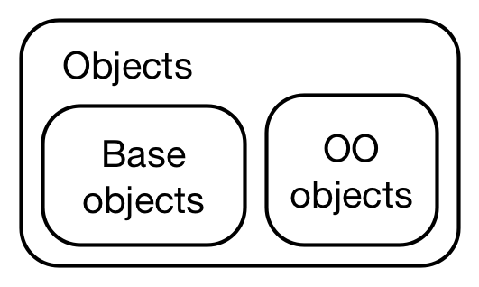

# 基础类型（Base types）

2026-09-04⭐
@author Jiawei Mao
## 1. 简介

要在 R 语言中探讨对象与面向对象编程（OOP），首先需要理清一个关于“对象（object）”一词两种用法的根本混淆。在本书到目前为止的内容中，我们使用的是广义上的“对象”概念，正如 John Chambers 那句精辟的名言所概括的：“R 中的一切皆对象（Everything that exists in R is an object）”。然而，尽管一切皆对象，但并非所有对象都是“面向对象”的。这种混淆的根源在于，R 语言的基础对象（base objects）脱胎于 S 语言，它们是在人们想到 S 语言可能需要一套 OOP 系统之前就已经开发出来的。相关的工具与命名体系在漫长的岁月中自然演进，始终缺乏一个统一的指导原则。

在大多数情况下，区分普通对象与面向对象对象并不重要。但在这里，我们需要深入探讨其中的细枝末节，因此我们将使用“基础对象（base objects）”和“面向对象对象（OO objects）”这两个术语来对它们加以区分。



**本章大纲**

- **12.2 节** 将向你展示如何识别基础对象与面向对象对象。
- **12.3 节** 将提供用于构建所有对象的完整基础类型集合。

## 2. 基础对象与面向对象

要区分基础对象和面向对象对象，可以使用 `is.object()` 或 `sloop::otype()`：

```r
# 基础对象：
> is.object(1:10)
[1] FALSE
> sloop::otype(1:10)
[1] "base"

# 面向对象对象
> is.object(mtcars)
[1] TRUE
> sloop::otype(mtcars)
[1] "S3"
```

从技术层面来说，基础对象和 OO 对象的区别在于：OO 对象具有一个名为 `"class"` 的属性：

```r
> attr(1:10, "class")
NULL

> attr(mtcars, "class")
[1] "data.frame"
```

你可能已经熟悉 `class()` 函数了。将该函数应用于 S3 和 S4 对象是安全的，但当它应用于基础对象时，会返回具有误导性的结果。更安全的做法是使用 `sloop::s3_class()`，它会返回 S3 和 S4 系统在进行方法分派（pick methods）时所使用的隐式类（implicit class）。你将在 13.7.1 节中进一步了解 `s3_class()`。

```r
> x <- matrix(1:4, nrow = 2)
> class(x)
[1] "matrix" "array" 
> sloop::s3_class(x)
[1] "matrix"  "integer" "numeric"
```

## 3. 基础类型

虽然只有 OO 对象才具有 `class` 属性，但每个对象都有其基础类型：

```r
> typeof(1:10)
[1] "integer"

> typeof(mtcars)
[1] "list"
```

基础类型并不构成一个 OOP 系统，因为针对不同基础类型表现出不同行为的函数，主要是用 C 语言编写的，并在底层使用了 `switch` 语句。这意味着只有 R 核心开发团队（R-core）才能创建新类型，而且创建新类型是一项极其繁重的工作，因为必须修改每一个相关的 `switch` 语句来处理新情况。因此，基础类型极少被添加。最近的一次更改是在 2011 年，当时添加了两种特殊的类型，你在常规的 R 代码中永远见不到它们，但它们对于诊断内存问题必不可少。

总共有 25 种不同的基础类型。下面列出了它们，并根据本书的讨论顺序进行了大致分组。这些类型在 C 语言代码中最为重要，因此你经常会看到它们被称作对应的 C 语言类型名称。我已将这些名称放在括号中。

- **向量（第 3 章）** 8 种：包括 `NULL` (`NILSXP`)、逻辑型 `logical` (`LGLSXP`)、整数型 `integer` (`INTSXP`)、双精度型 `double` (`REALSXP`)、复数型 `complex` (`CPLXSXP`)、字符型 `character` (`STRSXP`)、列表 `list` (`VECSXP`) 以及原始型 `raw` (`RAWSXP`)。

```r
typeof(NULL)
#> [1] "NULL"
typeof(1L)
#> [1] "integer"
typeof(1i)
#> [1] "complex"
```

- **函数（第 6 章）** 3 种：包括闭包 `closure`（常规 R 函数，`CLOSXP`）、特殊函数 `special`（内部函数，`SPECIALSXP`）以及内置函数 `builtin`（底层原生函数，`BUILTINSXP`）。

```r
typeof(mean)
#> [1] "closure"
typeof(`[`)
#> [1] "special"
typeof(sum)    
#> [1] "builtin"
```

内部函数（internal）和底层原生函数（primitive）在 6.2.2 节中有详细介绍。

- **环境（第 7 章）**：类型为环境 `environment` (`ENVSXP`)。

```r
typeof(globalenv())
#> [1] "environment"
```

- **S4 类型** (`S4SXP`)（第 15 章）：用于不继承自现有基础类型的 S4 类。

```r
mle_obj <- stats4::mle(function(x = 1) (x - 2) ^ 2)
typeof(mle_obj)
#> [1] "S4"
```

- **语言组件（第 18 章）**：包括符号 `symbol`（又称名称 `name`，`SYMSXP`）、语言对象 `language`（通常称为调用 `calls`，`LANGSXP`）以及配对列表 `pairlist`（用于函数参数，`LISTSXP`）。

```r
typeof(quote(a))
#> [1] "symbol"
typeof(quote(a + 1))
#> [1] "language"
typeof(formals(mean))
#> [1] "pairlist"
```

表达式 `expression` (`EXPRSXP`) 是一种特殊用途的类型，仅由 `parse()` 和 `expression()` 返回。在用户代码中通常不需要使用表达式。

- **其他类型**：其余的类型较为深奥，在 R 语言中极少见到。它们主要用于 C 语言代码：包括外部指针 `externalptr` (`EXTPTRSXP`)、弱引用 `weakref` (`WEAKREFSXP`)、字节码 `bytecode` (`BCODESXP`)、延迟求值对象 `promise` (`PROMSXP`)、省略号 `...` (`DOTSXP`) 以及任意类型 `any` (`ANYSXP`)。

你可能听说过 `mode()` 和 `storage.mode()` 这两个函数。请不要使用它们：它们的存在仅仅是为了提供与 S 语言兼容的类型名称。

### 3.1 数值类型

在讨论数值类型（numeric）时需要特别小心，因为 R 语言中“numeric”一词有三种略微不同的含义：

1. 在某些地方，`numeric` 被用作 `double`（双精度型）的别名。例如，`as.numeric()` 与 `as.double()` 完全相同，`numeric()` 与 `double()` 也完全相同。
   *（此外，R 偶尔也会使用 `real` 来代替 `double`；在实际应用中，你最有可能遇到这种用法的地方是 `NA_real_`。）*
2. 在 S3 和 S4 系统中，`numeric` 被用作 `integer`（整数型）或 `double`（双精度型）的简称，并在方法分派（picking methods）时使用：

```r
sloop::s3_class(1)
#> [1] "double"  "numeric"
sloop::s3_class(1L)
#> [1] "integer" "numeric"
```

3. `is.numeric()` 用于测试对象是否具有类似数字的行为。例如，因子（factor）的基础类型是 `"integer"`，但它们并不表现出数字的行为（即对因子求平均值是没有意义的）。

```r
typeof(factor("x"))
#> [1] "integer"
is.numeric(factor("x"))
#> [1] FALSE
```

在本书中，我将始终如一地使用 `numeric` 来表示类型为 `integer` 或 `double` 的对象。