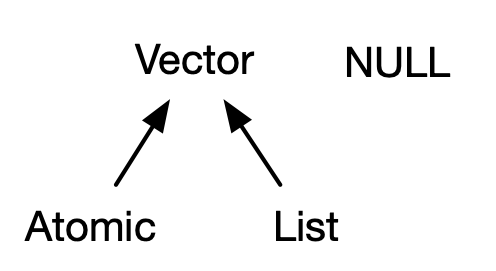
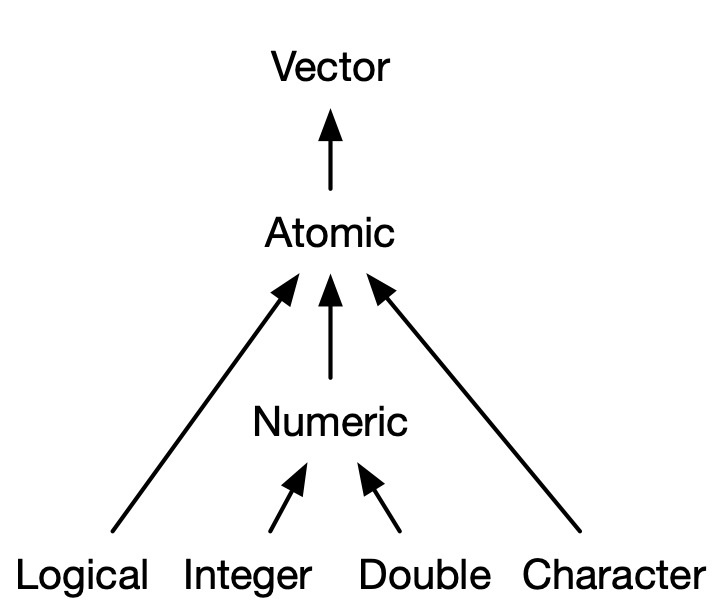
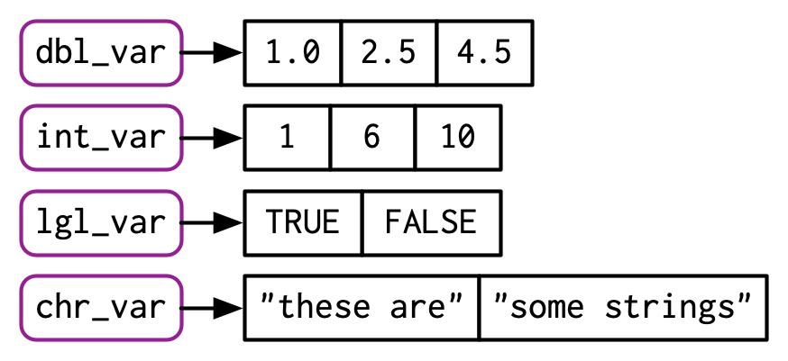

# 向量（Vectors）

## 1. 简介

本章将讨论 base R 中最重要的一系列数据类型：向量（vectors）。虽然你可能已经使用过许多不同类型的向量，但你可能并没有深入思考过它们之间的相互联系。在本章中，我不会过多地介绍单个向量类型的细节，而是会向你展示所有类型是如何作为一个整体组合在一起的。如果你需要更多细节，可以在 R 的官方文档中找到它们。

向量分为两种类型：原子向量（atomic vectors）和列表（lists）。它们的区别在于元素类型的不同：对于原子向量，所有元素必须具有相同的类型；而对于列表，元素可以具有不同的类型。虽然 `NULL` 不是向量，但它与向量密切相关，通常充当通用的零长度向量。下面的图表展示了它们之间的基本关系（我们将在本章中进一步展开说明）：



每个向量还可以具有属性（attributes），你可以将其视为包含任意元数据的命名列表。其中有两个属性尤为重要：**维度**（dimension）属性将向量转换为矩阵和数组；而**类**（class）属性则是 S3 面向对象系统的基础。虽然你将在第 13 章中学习如何使用 S3，但在本章中，你将了解一些最重要的 S3 向量：因子（factors）、日期和时间（date and times）、数据框（data frames）和 tibble 数据框（tibbles）。此外，虽然像矩阵和数据框这样的二维结构在你想到“向量”时可能不会立刻浮现，但你也会了解到为什么 R 将它们视为向量。

### 小测验

请完成以下简短的测验，以确定你是否需要阅读本章。如果答案能迅速浮现在脑海中，你可以放心地跳过本章。你可以在 3.8 节核对你的答案。

1. 四种常见的原子向量类型是什么？哪两种是罕见的类型？
2. 什么是属性？如何获取和设置它们？
3. 列表与原子向量有何不同？矩阵与数据框有何不同？
4. 列表可以是矩阵吗？数据框的某一列可以是矩阵吗？
5. tibble 与数据框在行为上有什么不同？

### 章节大纲

- **3.2 节**：介绍原子向量：逻辑型（logical）、整型（integer）、双精度型（double）和字符型（character）。这些是 R 中最基础的数据结构。
- **3.3 节**：稍微偏离主线，探讨属性（attributes），即 R 中灵活的元数据规范。最重要的属性包括名称（names）、维度（dimensions）和类（class）。
- **3.4 节**：讨论通过将原子向量与特殊属性结合而构建的重要向量类型。这些类型包括因子（factors）、日期（dates）、日期时间（date-times）和时间跨度（durations）。
- **3.5 节**：深入探讨列表（lists）。列表与原子向量非常相似，但有一个关键区别：列表的元素可以是任何数据类型，包括另一个列表。这使得列表非常适合表示层次结构数据。
- **3.6 节**：教你认识数据框（data frames）和 tibble，它们用于表示矩形（表格）数据。它们结合了列表和矩阵的特性，形成了一种极其适合统计数据分析需求的结构。

## 2. 原子向量

原子向量主要有四种基本类型：

- 逻辑型（logical）
- 整型（integer）
- 双精度型（double）
- 字符型（character，即字符串）

其中，整型和双精度型向量统称为数值型向量（numeric vectors）。此外，还有两种罕见的类型：

- 复数型（complex）
- 原生型（raw）

本书不会对这两种类型作进一步讨论，因为复数在统计学中极少用到，而原生向量是一种特殊类型，仅在处理二进制数据时才需要使用。



### 2.1 标量

这四种基本类型各自都有一种特殊的语法来创建单个值，也就是我们常说的标量（scalar）：

- **逻辑型（Logicals）**：可以写完整形式（`TRUE` 或 `FALSE`），也可以使用缩写形式（`T` 或 `F`）。
- **双精度型（Doubles）**：可以使用十进制（如 `0.1234`）、科学计数法（如 `1.23e4`）或十六进制（如 `0xcafe`）来指定。双精度型有三个特有的特殊值：`Inf`（正无穷大）、`-Inf`（负无穷大）和 `NaN`（Not a Number，非数字）。这些是由浮点数标准定义的特殊值。
- **整型（Integers）**：书写方式与双精度型类似，但数字后面必须跟一个大写字母 `L` [23]（例如 `1234L`、`1e4L` 或 `0xcafeL`），并且不能包含小数部分。
- **字符型（Strings）**：需要用双引号（如 `"hi"`）或单引号（如 `'bye'`）括起来。特殊字符需要使用反斜杠 `\` 进行转义；完整详情可以查看帮助文档 `?Quotes`。

### 2.2 使用 `c()` 创建长向量

要将较短的向量组合成较长的向量，可以使用 `c()` 函数，它是 combine（组合）的缩写：

```r
lgl_var <- c(TRUE, FALSE)
int_var <- c(1L, 6L, 10L)
dbl_var <- c(1, 2.5, 4.5)
chr_var <- c("these are", "some strings")
```

当输入为原子向量时，`c()` 总是会创建出另一个原子向量，也就是说，它会将嵌套的结构“展平（flatten）”：

```r
c(c(1, 2), c(3, 4))
#> [1] 1 2 3 4
```

在图表中，我会将向量描绘为相连的矩形，因此上面的代码可以绘制成如下形式：



你可以使用 `typeof()` 函数来确定向量的类型，并使用 `length()` 函数来获取向量的长度。

```r
typeof(lgl_var)
#> [1] "logical"
typeof(int_var)
#> [1] "integer"
typeof(dbl_var)
#> [1] "double"
typeof(chr_var)
#> [1] "character"
```

### 2.3 缺失值

R 使用一个特殊的哨兵值（sentinel value）来表示缺失值或未知值：`NA`（Not Applicable 的缩写，意为“不适用”）。缺失值往往具有“传染性”：大多数涉及缺失值的计算都会返回另一个缺失值。

```r
NA > 5
#> [1] NA
10 * NA
#> [1] NA
!NA
#> [1] NA
```

这个规则只有极少数例外。这些例外通常发生在无论输入是什么，某个恒等式（identity）都必然成立的情况下：

```r
NA ^ 0
#> [1] 1
NA | TRUE
#> [1] TRUE
NA & FALSE
#> [1] FALSE
```

缺失值的这种传播特性，会导致我们在判断向量中哪些值是缺失值时，容易犯一个常见的错误：

```r
x <- c(NA, 5, NA, 10)
x == NA
#> [1] NA NA NA NA
```

这个结果其实是正确的（尽管可能让人有些惊讶），因为我们没有任何理由认为一个缺失值和另一个缺失值是相等的。相反，你应该使用 `is.na()` 函数来测试缺失值的存在：

```r
is.na(x)
#> [1]  TRUE FALSE  TRUE FALSE
```

> [!NOTE]
>
> 严格来说，R 中存在四种缺失值，分别对应四种原子数据类型：`NA`（逻辑型）、`NA_integer_`（整型）、`NA_real_`（双精度型）和 `NA_character_`（字符型）。这种区分通常并不重要，因为在需要时，`NA` 会自动被强制转换为正确的类型。

### 2.4 类型测试与强制转换

通常，你可以使用 `is.*()` 系列函数来测试向量是否属于某种特定类型，但在使用这些函数时需要格外小心。

`is.logical()`、`is.integer()`、`is.double()` 和 `is.character()` 的作用符合你的预期：它们用于测试向量是否为逻辑型、整型、双精度型或字符型。请尽量避免使用 `is.vector()`、`is.atomic()` 和 `is.numeric()`：它们并不是用来测试你是否拥有向量、原子向量或数值型向量的；你需要仔细阅读官方文档才能弄清楚它们实际上到底做了什么。

对原子向量，类型是整个向量的一个属性：所有元素必须具有相同的类型。当你尝试组合不同类型的元素时，它们会按照固定的顺序被强制转换（coerced）：字符型 → 双精度型 → 整型 → 逻辑型。例如，将字符型和整型组合在一起，结果会变为字符型：

```r
str(c("a", 1))
#>  chr [1:2] "a" "1"
```

强制转换通常是自动发生的。大多数数学函数（如 `+`、`log`、`abs` 等）都会将输入强制转换为数值型。这种强制转换在处理逻辑型向量时特别有用，因为 `TRUE` 会变成 1，而 `FALSE` 会变成 0。

```r
x <- c(FALSE, FALSE, TRUE)
as.numeric(x)
#> [1] 0 0 1

# TRUE 的总数
sum(x)
#> [1] 1

# TRUE 所占的比例
mean(x)
#> [1] 0.333
```

通常，你可以通过使用 `as.*()` 系列函数（如 `as.logical()`、`as.integer()`、`as.double()` 或 `as.character()`）来主动进行强制转换。如果字符串无法成功转换，R 会生成一条警告并返回一个缺失值（NA）：

```r
as.integer(c("1", "1.5", "a"))
#> Warning: NAs introduced by coercion
#> [1]  1  1 NA
```

### 2.5 练习题

1. 如何创建原生型（raw）和复数型（complex）的标量？（请参阅 `?raw` 和 `?complex` 的帮助文档。）

2. 通过预测以下 `c()` 函数的输出结果，来测试你对向量强制转换（coercion）规则的了解：

   ```r
   c(1, FALSE)
   c("a", 1)
   c(TRUE, 1L)
   ```

3. 为什么 `1 == "1"` 的结果是 `TRUE`？为什么 `-1 < FALSE` 的结果是 `TRUE`？为什么 `"one" < 2` 的结果是 `FALSE`？

4. 为什么默认的缺失值 `NA` 是一个逻辑型（logical）向量？逻辑型向量有什么特殊之处？（提示：思考一下 `c(FALSE, NA_character_)` 的结果。）

5. `is.atomic()`、`is.numeric()` 和 `is.vector()` 这三个函数究竟是用来测试什么的？