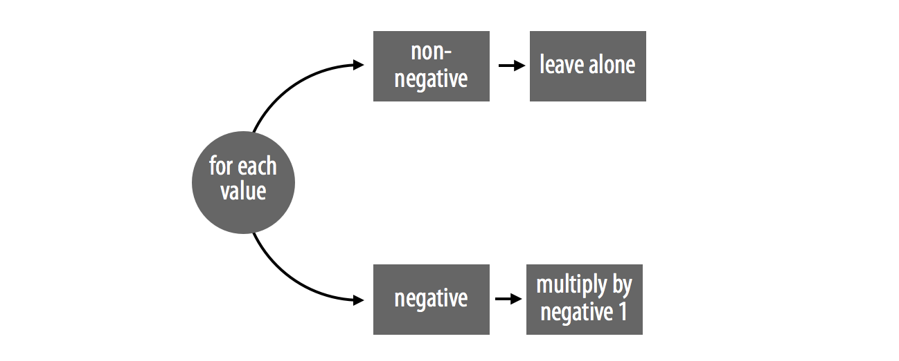
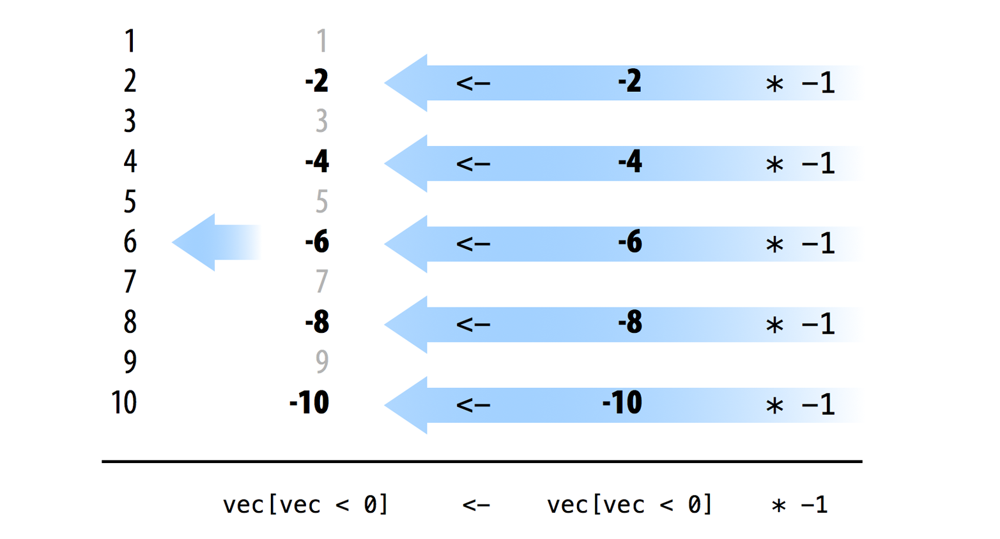
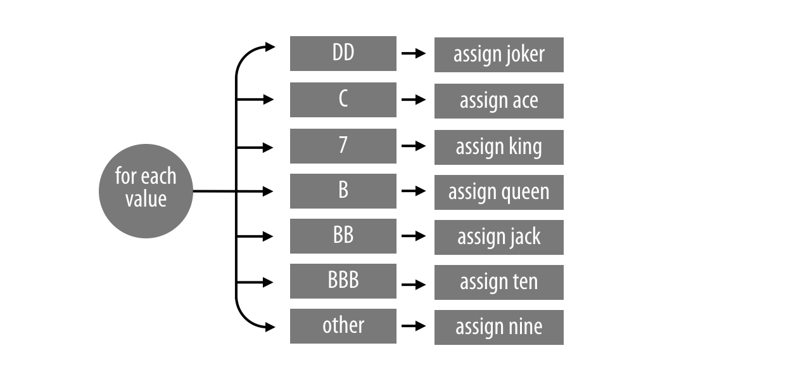
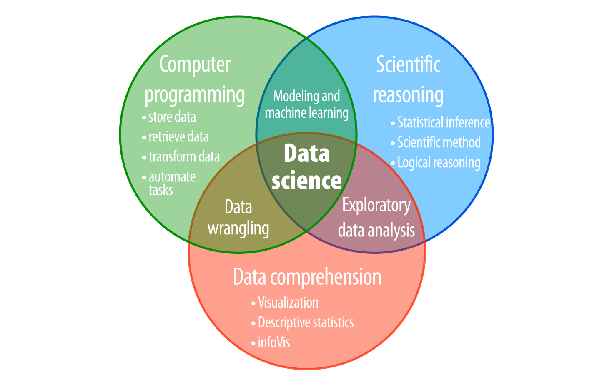

# 速度

作为一名数据科学家，你需要速度。当你的代码运行迅速时，你就能处理更大的数据集并完成更具挑战性的任务。本章将向你展示一种在 R 语言中编写高效代码的特定方法。随后，你将使用这种方法来模拟 1000 万次老虎机游戏。

## 1. 向量化代码

你可以用许多不同的方式编写一段代码，但最快的 R 代码通常会利用三个特性：逻辑测试、子集提取和逐元素运算。这些正是 R 语言最擅长的操作。使用这些特性的代码通常具备一个特定的品质：它是向量化的（vectorized）；也就是说，该代码能够接收一个值向量作为输入，并同时对该向量中的每个值进行操作。

为了直观了解向量化代码的样子，我们来比较两个求绝对值函数的示例。它们都接收一个数字向量，并将其转换为绝对值（即正数）向量。第一个示例不是向量化的；`abs_loop` 使用 `for` 循环逐个处理向量中的每个元素：

```r
abs_loop <- function(vec){
  for (i in 1:length(vec)) {
    if (vec[i] < 0) {
      vec[i] <- -vec[i]
    }
  }
  vec
}
```

第二个示例 `abs_set` 是 `abs_loop` 的向量化版本。它使用逻辑子集提取，同时处理向量中的所有负数：

```r
abs_sets <- function(vec){
  negs <- vec < 0
  vec[negs] <- vec[negs] * -1
  vec
}
```

`abs_set` 的速度比 `abs_loop` 快得多，因为它依赖于 R 语言能快速执行的操作：逻辑测试、子集提取和逐元素运算。

你可以使用 `system.time` 函数来看看 `abs_set` 到底有多快。`system.time` 接收一个 R 表达式，运行它，然后显示该表达式运行所花费的时间。

为了比较 `abs_loop` 和 `abs_set`，首先创建一个包含正数和负数的长向量。`long` 将包含 1000 万个值：

```r
long <- rep(c(-1, 1), 5000000)
```

`rep` 函数会将一个值或值向量重复多次。要使用 `rep`，请提供一个值向量，然后提供重复该向量的次数。R 会将结果作为一个新的、更长的向量返回。

接着，你可以使用 `system.time` 来测量每个函数计算 `long` 所需的时间：

```r
system.time(abs_loop(long))
##    user  system elapsed 
##  15.982   0.032  16.018

system.time(abs_sets(long))
##    user  system elapsed 
##   0.529   0.063   0.592
```

注意不要将 `system.time` 与 `Sys.time` 混淆，后者返回的是当前时间。

`system.time` 输出的前两列报告了你的计算机在进程的用户侧和系统侧分别花费了多少秒来执行该调用，这种划分因操作系统而异。

最后一列显示 R 运行该表达式时实际经过的秒数。结果表明，当应用于包含 1000 万个数字的向量时，`abs_set` 计算绝对值的速度比 `abs_loop` 快 30 倍。每当你编写向量化代码时，都可以期待获得类似的速度提升。

**练习 12.1（abs 有多快？）** 许多现有的 R 函数已经是向量化的，并且经过了优化以实现快速执行。只要有可能，尽量依赖这些函数，你的代码就会变得更快。例如，R 内置了一个求绝对值的函数 `abs`。

测试一下 `abs` 计算 `long` 绝对值的速度比 `abs_loop` 和 `abs_set` 快多少。

**解答**：你可以使用 `system.time` 来测量 `abs` 的速度。计算 1000 万个数字的绝对值，`abs` 仅用了极快的 0.05 秒。这比 `abs_set` 快 0.592 / 0.054 = 10.96 倍，比 `abs_loop` 快近 300 倍：

```r
system.time(abs(long))
##   user  system elapsed 
##  0.037   0.018   0.054
```

## 2. 如何编写向量化代码

在 R 语言中编写向量化代码非常容易，因为大多数 R 函数本身已经是向量化的。基于这些函数的代码很容易实现向量化，从而获得极高的运行速度。要编写向量化代码，请遵循以下原则：

1. 使用向量化函数来完成程序中的顺序步骤。
2. 使用逻辑子集提取来处理并行的情况。尽量一次性操作一个案例中的每个元素。

`abs_loop` 和 `abs_set` 很好地说明了这些规则。这两个函数都处理两种情况并执行一个顺序步骤（见图 12.1）。如果数字是正数，函数保持原样；如果数字是负数，函数将其乘以 -1。



*图 12.1：abs_loop 使用 for 循环将数据筛选为两种情况：负数和非负数。*

你可以使用逻辑测试来识别向量中属于某种情况的所有元素。R 会以逐元素的方式执行测试，并为属于该情况的每个元素返回 `TRUE`。例如，`vec < 0` 会识别出 `vec` 中属于负数情况的每个值。你可以使用相同的逻辑测试，通过逻辑子集提取来提取负数集合：

```r
vec <- c(1, -2, 3, -4, 5, -6, 7, -8, 9, -10)
vec < 0
## FALSE TRUE FALSE TRUE FALSE TRUE FALSE TRUE FALSE TRUE

vec[vec < 0]
## -2  -4  -6  -8 -10
```

图 12.1 中的计划现在需要一个顺序步骤：你必须将每个负数乘以 -1。R 的所有算术运算符都是向量化的，因此你可以使用 `*` 以向量化的方式完成此步骤。`*` 会同时将 `vec[vec < 0]` 中的每个数字乘以 -1：

```r
vec[vec < 0] * -1
## 2  4  6  8 10
```

最后，你可以使用 R 的赋值运算符（它同样是向量化的）将新集合覆盖保存在原始的 `vec` 对象中。由于 `<-` 是向量化的，新集合的元素会按顺序与旧集合的元素一一对应，然后进行逐元素赋值。结果就是，每个负数都会被其对应的正数替换，如图 12.2 所示。


*图 12.2：使用逻辑子集提取就地修改一组值。R 的算术和赋值运算符是向量化的，这让你能够同时操作和更新多个值。*

**练习 12.2（向量化一个函数）** 下面的函数将老虎机符号向量转换为新的老虎机符号向量。你能将其向量化吗？向量化后的版本能快多少？

```r
change_symbols <- function(vec){
  for (i in 1:length(vec)){
    if (vec[i] == "DD") {
      vec[i] <- "joker"
    } else if (vec[i] == "C") {
      vec[i] <- "ace"
    } else if (vec[i] == "7") {
      vec[i] <- "king"
    } else if (vec[i] == "B") {
      vec[i] <- "queen"
    } else if (vec[i] == "BB") {
      vec[i] <- "jack"
    } else if (vec[i] == "BBB") {
      vec[i] <- "ten"
    } else {
      vec[i] <- "nine"
    } 
  }
  vec
}

vec <- c("DD", "C", "7", "B", "BB", "BBB", "0")

change_symbols(vec)
##  "joker" "ace"   "king"  "queen" "jack"  "ten"   "nine"

many <- rep(vec, 1000000)

system.time(change_symbols(many))
##    user  system elapsed 
##  30.057   0.031  30.079
```

**解答**：`change_symbols` 使用 `for` 循环将值分为七种不同的情况，如图 12.3 所示。



*图 12.3：change_many 对七种不同的情况执行不同的操作。*

要对 `change_symbols` 进行向量化，需要创建一个逻辑测试来识别每种情况：

```r
vec[vec == "DD"]
## "DD"

vec[vec == "C"]
## "C"

vec[vec == "7"]
## "7"

vec[vec == "B"]
## "B"

vec[vec == "BB"]
## "BB"

vec[vec == "BBB"]
## "BBB"

vec[vec == "0"]
## "0"
```

然后编写代码，针对每种情况更改对应的符号：

```r
vec[vec == "DD"] <- "joker"
vec[vec == "C"] <- "ace"
vec[vec == "7"] <- "king"
vec[vec == "B"] <- "queen"
vec[vec == "BB"] <- "jack"
vec[vec == "BBB"] <- "ten"
vec[vec == "0"] <- "nine"
```

当你将这些代码组合成一个函数时，你就得到了一个 `change_symbols` 的向量化版本，它的运行速度大约快了 14 倍：

```r
change_vec <- function (vec) {
  vec[vec == "DD"] <- "joker"
  vec[vec == "C"] <- "ace"
  vec[vec == "7"] <- "king"
  vec[vec == "B"] <- "queen"
  vec[vec == "BB"] <- "jack"
  vec[vec == "BBB"] <- "ten"
  vec[vec == "0"] <- "nine"
  
  vec
}

system.time(change_vec(many))
##   user  system elapsed 
##  1.994   0.059   2.051 
```

或者，更好的方法是使用查找表（lookup table）。查找表是一种向量化方法，因为它依赖于 R 的向量化选择操作：

```r
change_vec2 <- function(vec){
  tb <- c("DD" = "joker", "C" = "ace", "7" = "king", "B" = "queen", 
    "BB" = "jack", "BBB" = "ten", "0" = "nine")
  unname(tb[vec])
}

system.time(change_vec2(many))
##   user  system elapsed 
##  0.687   0.059   0.746 
```

在这里，查找表比原始函数快了 40 倍。

`abs_loop` 和 `change_many` 揭示了向量化代码的一个特征：程序员通常会因为依赖不必要的 `for` 循环（就像 `change_many` 中的那样）而写出较慢的非向量化代码。我认为这是对 R 语言的普遍误解造成的。`for` 循环在 R 中的表现与其他语言不同，这意味着在 R 中编写代码的方式也应与其他语言有所区别。

当你使用 C 和 Fortran 等语言编写代码时，必须先编译代码，计算机才能运行它。这个编译步骤会优化代码中 `for` 循环对计算机内存的使用，从而使 `for` 循环运行得极快。因此，许多程序员在使用 C 和 Fortran 编写代码时会频繁使用 `for` 循环。

然而，当你使用 R 编写代码时，你不需要编译代码。跳过这一步使 R 语言的编程体验更加友好。遗憾的是，这也意味着你的循环无法获得在 C 或 Fortran 中那样的速度提升。因此，你的循环运行速度将慢于我们研究过的其他操作：逻辑测试、子集提取和逐元素运算。如果你能用更快的操作代替 `for` 循环来编写代码，就应该这样做。无论你使用哪种语言编写代码，都应该尽量使用该语言中运行最快的特性。

> [!TIP]
>
> **if 和 for**
>
> 发现可以向量化的 `for` 循环的一个好方法是寻找 `if` 和 `for` 的组合。`if` 一次只能应用于一个值，这意味着它经常与 `for` 循环结合使用。`for` 循环有助于将 `if` 应用于整个值向量。这种组合通常可以用逻辑子集提取来替代，逻辑子集提取能实现相同的功能，但运行速度快得多。

这并不意味着你永远不应该在 R 中使用 `for` 循环。在 R 中，仍然有许多使用 `for` 循环是合理的地方。`for` 循环执行的是基本任务，而这些任务有时无法用向量化代码重现。此外，`for` 循环易于理解，只要你采取一些预防措施，它们在 R 中的运行速度也是相当快的。

## 3. 如何在 R 中编写高效的 for 循环

你可以通过执行以下两项优化操作，大幅提升 `for` 循环的运行速度：

首先，尽可能将代码放在 `for` 循环外部执行。你放在 `for` 循环内部的每一行代码都会被重复执行非常多次。如果某行代码只需要执行一次，请将其放在循环外部以避免不必要的重复。

其次，确保你在循环中使用的存储对象足够大，能够容纳循环的所有结果。例如，下面这两个循环都需要存储一百万个值。第一个循环将结果存储在一个名为 `output` 的对象中，该对象的初始长度为一百万：

```r
system.time({
  output <- rep(NA, 1000000) 
  for (i in 1:1000000) {
    output[i] <- i + 1
  }
})
##   user  system elapsed 
##  1.709   0.015   1.724 
```

第二个循环将结果存储在一个名为 `output` 的对象中，该对象的初始长度为一。R 会在运行循环的过程中，将该对象的长度逐步扩展至一百万。这个循环中的代码与第一个循环非常相似，但它的运行时间比第一个循环长了 37 分钟：

```r
system.time({
  output <- NA 
  for (i in 1:1000000) {
    output[i] <- i + 1
  }
})
##     user   system  elapsed 
## 1689.537  560.951 2249.927
```

这两个循环执行的任务完全相同，那么是什么导致了如此巨大的差异呢？在第二个循环中，R 必须在每次循环运行时将 `output` 的长度增加 1。为此，R 需要在你的计算机内存中寻找一个新的位置来容纳这个更大的对象。接着，R 必须将 `output` 向量复制到新位置，并在进入下一次循环之前擦除旧版本的 `output`。当循环结束时，R 已经在计算机内存中将 `output` 重写了一百万次。

而在第一种情况中，`output` 的大小从未改变；R 可以在内存中只定义一个 `output` 对象，并在每次 `for` 循环运行时重复使用它。

> [!TIP]
>
> R 语言的开发者使用 C 和 Fortran 等底层语言来编写基础的 R 函数，其中许多函数内部使用了 `for` 循环。这些函数在成为 R 的一部分之前经过了编译和优化，因此运行速度非常快。
>
> 每当你在函数的定义中看到 `.Primitive`、`.Internal` 或 `.Call` 时，你就可以确信该函数正在调用其他语言的代码。通过使用这些函数，你将获得该语言带来的所有速度优势。

## 4. 向量化代码的实际应用

为了了解向量化代码如何帮助你成为一名数据科学家，让我们回顾一下老虎机项目。在“循环（Loops）”一章中，你计算了老虎机的精确赔付率，但其实你可以通过模拟来估算这个赔付率。如果你玩无数次老虎机，所有游戏结果的平均奖金将是对真实赔付率的一个良好估计。

这种估算方法基于大数定律，与许多统计模拟类似。要运行此模拟，你可以使用 `for` 循环：

```r
winnings <- vector(length = 1000000)
for (i in 1:1000000) {
  winnings[i] <- play()
}

mean(winnings)
## 0.9366984
```

在 100 万次运行后，估算的赔付率为 0.937，这非常接近 0.934 的真实赔付率。请注意，这里我使用的是将钻石（DD）视为百搭牌的修改版 `score` 函数。

如果你运行这个模拟，你会发现它需要花费一些时间。事实上，该模拟耗时 342,308 秒，大约 5.7 分钟。这个速度并不令人印象深刻，而你可以通过使用向量化代码做得更好：

```r
system.time(for (i in 1:1000000) {
  winnings[i] <- play()
})
##    user  system elapsed 
## 342.041   0.355 342.308 
```

当前的 `score` 函数不是向量化的。它接收单个老虎机组合，并使用 `if` 条件树为其分配奖金。这种 `if` 条件树与 `for` 循环的结合表明，你可以编写一段向量化代码，接收多个老虎机组合，然后使用逻辑子集提取一次性对它们进行操作。

例如，你可以重写 `get_symbols` 函数，使其生成 `n` 个老虎机组合，并将它们作为一个 `n x 3` 的矩阵返回，如下所示。矩阵的每一行将包含一个待评分的老虎机组合：

```r
get_many_symbols <- function(n) {
  wheel <- c("DD", "7", "BBB", "BB", "B", "C", "0")
  vec <- sample(wheel, size = 3 * n, replace = TRUE,
    prob = c(0.03, 0.03, 0.06, 0.1, 0.25, 0.01, 0.52))
  matrix(vec, ncol = 3)
}

get_many_symbols(5)
##      [,1]  [,2] [,3] 
## [1,] "B"   "0"  "B"  
## [2,] "0"   "BB" "7"  
## [3,] "0"   "0"  "BBB"
## [4,] "0"   "0"  "B"  
## [5,] "BBB" "0"  "0" 
```

你还可以重写 `play` 函数，使其接收一个参数 `n`，并在数据框中返回 `n` 个奖金结果：

```r
play_many <- function(n) {
  symb_mat <- get_many_symbols(n = n)
  data.frame(w1 = symb_mat[,1], w2 = symb_mat[,2],
             w3 = symb_mat[,3], prize = score_many(symb_mat))
}
```

这个新函数将使模拟一百万次甚至一千万次老虎机游戏变得轻而易举，而这正是我们的目标。完成后，你将能够使用以下代码估算赔付率：

```r
# plays <- play_many(10000000))
# mean(plays$prize)
```

现在你只需要编写 `score_many`，这是 `score` 的向量化（或者说是矩阵化？）版本，它接收一个 `n x 3` 的矩阵并返回 `n` 个奖金。编写这个函数会很困难，因为 `score` 本身已经相当复杂了。在你获得比目前更多的练习和经验之前，我不指望你能有信心独立完成这件事。

如果你想测试一下自己的技能并编写一个 `score_many` 版本，我建议你在代码中使用 `rowSums` 函数。它可以计算矩阵中每一行数字（或逻辑值）的总和。

如果你想以一种更温和的方式测试自己，我建议你研究下面的 `score_many` 示例函数，直到你理解每个部分是如何工作的，以及它们是如何协同工作以创建向量化函数的。为此，创建一个具体的示例（如下所示）会很有帮助：

```r
symbols <- matrix(
  c("DD", "DD", "DD", 
    "C", "DD", "0", 
    "B", "B", "B", 
    "B", "BB", "BBB", 
    "C", "C", "0", 
    "7", "DD", "DD"), nrow = 6, byrow = TRUE)

symbols
##      [,1] [,2] [,3] 
## [1,] "DD" "DD" "DD" 
## [2,] "C"  "DD" "0"  
## [3,] "B"  "B"  "B"  
## [4,] "B"  "BB" "BBB"
## [5,] "C"  "C"  "0"  
## [6,] "7"  "DD" "DD" 
```

然后，你可以针对这个示例运行 `score_many` 的每一行代码，并随时检查运行结果。

**练习 12.3（测试你的理解）** 研究 `score_many` 示例函数，直到你确信自己理解了它的工作原理，并且能够自己编写一个类似的函数。

**练习 12.4（高级挑战）** 不要查看示例答案，自己编写一个 `score` 的向量化版本。假设数据存储在 `n × 3` 的矩阵中，矩阵的每一行包含一个待评分的老虎机组合。

你可以使用将钻石视为百搭牌的 `score` 版本，也可以不使用。不过，示例答案将使用将钻石视为百搭牌的版本。

**解答**：`score_many` 是 `score` 的向量化版本。你可以使用它在 20 秒多一点的时间内运行本节开头的模拟。这比使用 `for` 循环快了 17 倍：

```r
# symbols 应该是一个矩阵，老虎机的每个窗口对应一列
score_many <- function(symbols) {

  # 步骤 1：根据樱桃和钻石分配基础奖金 ---------
  ## 计算每个组合中樱桃和钻石的数量
  cherries <- rowSums(symbols == "C")
  diamonds <- rowSums(symbols == "DD") 
  
  ## 百搭钻石算作樱桃
  prize <- c(0, 2, 5)[cherries + diamonds + 1]
  
  ## ...但如果没有任何真正的樱桃则不算 
  ### (当 cherries == 0 时，会被强制转换为 FALSE)
  prize[!cherries] <- 0
  
  # 步骤 2：更改包含“三个相同”组合的奖金 
  same <- symbols[, 1] == symbols[, 2] & 
    symbols[, 2] == symbols[, 3]
  payoffs <- c("DD" = 100, "7" = 80, "BBB" = 40, 
    "BB" = 25, "B" = 10, "C" = 10, "0" = 0)
  prize[same] <- payoffs[symbols[same, 1]]
  
  # 步骤 3：更改包含“全条（bars）”组合的奖金 ------
  bars <- symbols == "B" | symbols ==  "BB" | symbols == "BBB"
  all_bars <- bars[, 1] & bars[, 2] & bars[, 3] & !same
  prize[all_bars] <- 5
  
  # 步骤 4：处理百搭牌 ---------------------------------------------
  
  ## 包含两个百搭牌的组合
  two_wilds <- diamonds == 2

  ### 识别非百搭符号
  one <- two_wilds & symbols[, 1] != symbols[, 2] & 
    symbols[, 2] == symbols[, 3]
  two <- two_wilds & symbols[, 1] != symbols[, 2] & 
    symbols[, 1] == symbols[, 3]
  three <- two_wilds & symbols[, 1] == symbols[, 2] & 
    symbols[, 2] != symbols[, 3]
  
  ### 视为“三个相同”
  prize[one] <- payoffs[symbols[one, 1]]
  prize[two] <- payoffs[symbols[two, 2]]
  prize[three] <- payoffs[symbols[three, 3]]
  
  ## 包含一个百搭牌的组合
  one_wild <- diamonds == 1
  
  ### 视为“全条”（如果适用）
  wild_bars <- one_wild & (rowSums(bars) == 2)
  prize[wild_bars] <- 5
  
  ### 视为“三个相同”（如果适用）
  one <- one_wild & symbols[, 1] == symbols[, 2]
  two <- one_wild & symbols[, 2] == symbols[, 3]
  three <- one_wild & symbols[, 3] == symbols[, 1]
  prize[one] <- payoffs[symbols[one, 1]]
  prize[two] <- payoffs[symbols[two, 2]]
  prize[three] <- payoffs[symbols[three, 3]]
 
  # 步骤 5：组合中每有一个钻石，奖金翻倍 ------------------
  unname(prize * 2^diamonds)
  
}

system.time(play_many(10000000))
##   user  system elapsed 
## 20.942   1.433  22.367
```

### 4.1 循环与向量化代码

在许多编程语言中，`for` 循环运行得非常快。因此，程序员在学习编程时养成了尽可能使用 `for` 循环的习惯。当这些程序员开始使用 R 语言编程时，通常会继续依赖 `for` 循环，而且往往没有采取必要的简单步骤来优化 R 的 `for` 循环。当他们的代码运行速度不如预期时，可能会对 R 语言感到失望。如果你觉得这可能正在你身上发生，请检查一下你使用 `for` 循环的频率以及你用它们来做什么。如果你发现自己对每项任务都使用 `for` 循环，那么你很可能是在“带着 C 语言的口音说 R 语言”。解决这个问题的方法是学习编写和使用向量化代码。

这并不意味着 `for` 循环在 R 语言中没有用武之地。`for` 循环是一个非常实用的功能；它们能完成许多向量化代码无法完成的任务。你也不应该成为向量化代码的奴隶。有时，将代码重写为向量化格式所花费的时间，甚至比直接让 `for` 循环运行完还要长。例如，是让老虎机模拟运行 5.7 分钟更快，还是重写 `score` 函数更快呢？

## 5. 总结

高效的代码是数据科学的重要组成部分，因为与运行缓慢的代码相比，使用高效代码能完成更多的工作。在计算资源的限制介入之前，你可以处理更大的数据集；在时间的限制介入之前，你可以进行更多的计算。R 语言中运行最快的代码依赖于 R 最擅长的操作：逻辑测试、子集提取和逐元素运算。我将这种类型的代码称为向量化代码，因为使用这些操作编写的代码会接收一个值向量作为输入，并同时对该向量的每个元素进行操作。在 R 语言中编写的大多数代码本身已经是向量化的。

如果你使用了这些操作，但你的代码看起来仍然不是向量化的，请分析程序中的顺序步骤和并行情况。确保你使用了向量化函数来处理步骤，并使用逻辑子集提取来处理各种情况。不过请注意，有些任务是无法被向量化的。

## 6. 项目 3 总结

至此，你已经用 R 语言编写了你的第一个程序，这是一个值得你骄傲的程序。`play` 不是一个简单的“hello world”入门练习，而是一个以复杂方式完成真实任务的真正程序。

在 R 中编写新程序永远是一项挑战，因为编程在很大程度上取决于你个人的创造力、解决问题的能力以及编写类似程序的经验。不过，你可以利用本章中的建议，让即使是最复杂的程序也变得易于处理：将任务划分为简单的步骤和情况，使用具体的示例，并用自然语言（英语）描述可能的解决方案。

这个项目完成了你在“最基础入门（The Very Basics）”中开始的学习。现在你可以使用 R 语言来处理数据，这增强了你分析数据的能力。你可以：

- 在计算机中（而不是在纸上或脑海中）加载和存储数据；
- 准确无误地回忆和修改单个值，而不需要依赖你的记忆力；
- 指示计算机代你执行枯燥或复杂的任务。

这些技能解决了一个每位数据科学家都会面临的重要后勤问题（logistical problem）：如何在不犯错的情况下存储和操作数据？然而，这并非你作为数据科学家将要面临的唯一问题。当你试图理解数据中包含的信息时，下一个问题就会出现。在原始数据中几乎不可能直接发现洞察或模式。当你试图使用数据集对现实世界进行推理（包括数据集中未包含的事物）时，第三个问题就会出现。你的数据究竟对数据集之外的事物意味着什么？你能有多确定？

我将这些问题称为数据科学的后勤问题、战术问题和战略问题，如图 12.4 所示。每当你试图从数据中学习时，都会面临这些问题：

- **后勤问题**：如何在不犯错的情况下存储和操作数据？
- **战术问题**：如何发现数据中包含的信息？
- **战略问题**：如何利用数据对宏观世界得出结论？


*图 12.4：数据科学的三大核心技能集：计算机编程、数据理解和科学推理。*

一名全面发展的数据科学家需要能够在各种不同的情况下解决上述每个问题。通过学习 R 语言编程，你已经掌握了后勤问题，这是解决战术问题和战略问题的先决条件。

如果你想学习如何运用数据进行推理，或者如何使用 R 语言工具对数据集进行转换、可视化和探索，我推荐你阅读《R for Data Science》（R 数据科学）一书，它是本书的姊妹篇。《R for Data Science》教授了一套在 R 中转换、可视化和建模数据的简单工作流，以及如何利用 R Markdown 包来报告结果。