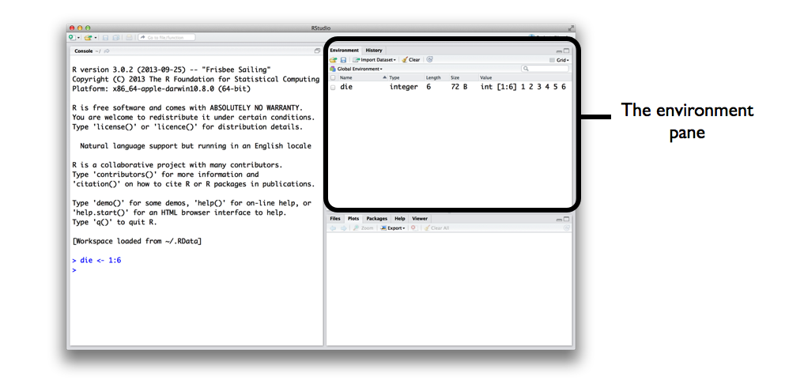
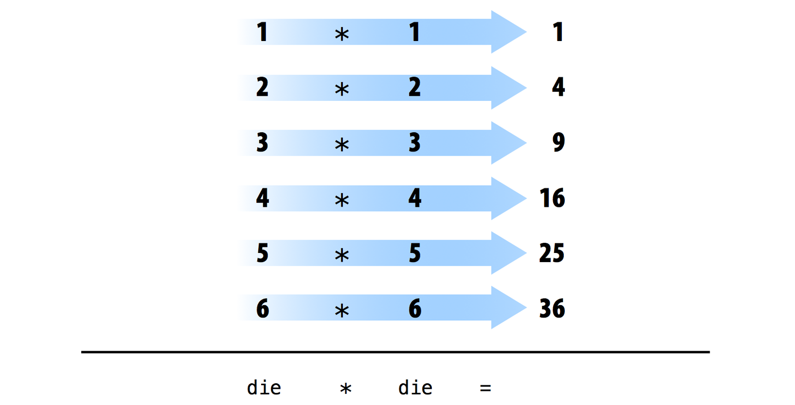
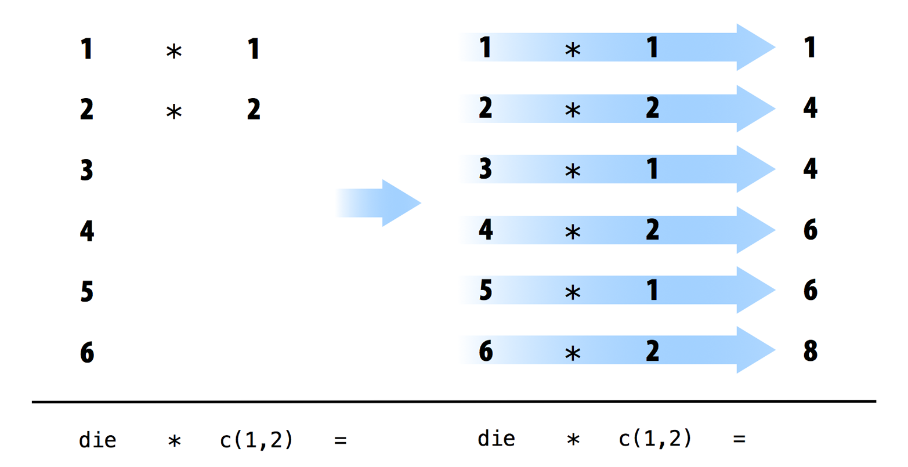
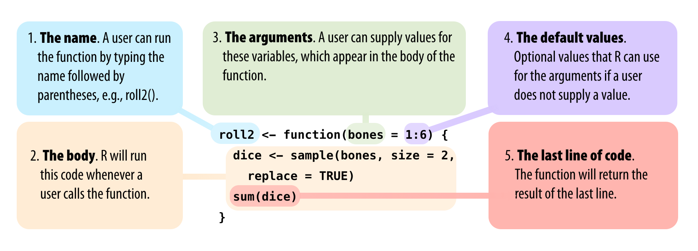
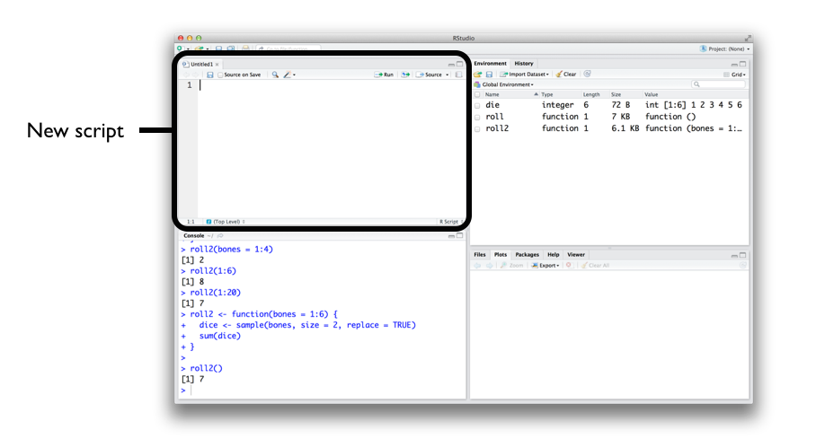
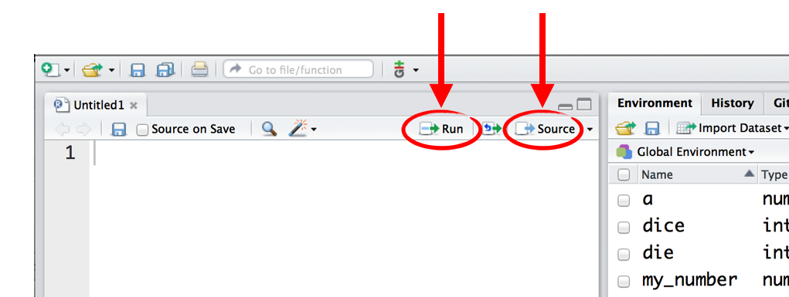

# 基础入门

2026-04-08⭐
@author Jiawei Mao
***
本章将对 R 语言进行全面概述，让你快速上手编程。在本章中，你将构建一对虚拟骰子，用于生成随机数。即使你此前从未接触过编程也无需担心，本章会讲解所有必备知识。

要模拟一对骰子，你需要提炼出单个骰子的核心特征。你无法将骰子这类实物放入计算机（当然，除非拆开电脑），但可以在计算机内存中存储该物体的相关信息。

需要存储哪些信息呢？通常来说，一个骰子包含六条关键信息：掷骰子时，只会出现六个数字中的一个，即 1、2、3、4、5、6。你可以将数字 1、2、3、4、5、6 作为一组数值存入计算机内存，以此体现骰子的基本属性。

我们先来学习如何存储这些数字，再研究 “掷骰子” 的实现方法。

## 2.1 R 用户界面

在让计算机存储数字之前，你需要知道如何与它交互。这正是 R 和 RStudio 的作用所在。RStudio 为你提供了与计算机交互的途径，而 R 则是你用来交流的语言。首先，像打开电脑上其他任何应用程序一样启动 RStudio。启动后，屏幕上会出现一个窗口，与图 2.1 所示的界面类似。


> 图 2.1：在控制台窗格底部的命令提示符后输入 R 指令，计算机就会执行你的操作。记得按下回车键。首次打开 RStudio 时，控制台会显示在左侧窗格中，你可以通过菜单栏中的「View->Panes」修改这一布局。

RStudio 的界面很简洁。在 RStudio 控制台窗格的底部一行输入 R 代码，然后按下回车键运行它。输入的代码被称为**命令（command）**，因为它会指挥你的计算机为你执行某项操作。输入代码的这一行则被称为**命令行（command line）**。

在命令提示符后输入指令并按下回车键，计算机就会执行该命令并显示结果。随后 RStudio 会出现一个新的提示符，等待你输入下一条命令。例如，如果你输入 `1 + 1` 并回车，RStudio 会显示：

```R
> 1 + 1
[1] 2
>
```

注意，结果旁边会出现一个 `[1]`。这只是 R 在提示你，这一行从结果中的第一个值开始显示。有些命令会返回多个值，其结果可能会占满多行。例如，命令 `100:130` 会返回 31 个值，生成从 100 到 130 的整数序列。可以看到，在输出的第二行和第三行开头会出现新的带方括号的数字。这些数字只是表示第二行从结果中的第 14 个值开始，第三行从第 25 个值开始。你基本可以忽略这些出现在方括号里的数字：

```R
> 100:130
 [1] 100 101 102 103 104 105 106 107 108 109 110 111 112
[14] 113 114 115 116 117 118 119 120 121 122 123 124 125
[25] 126 127 128 129 130
```

> [!TIP]
>
> 冒号运算符（:）会返回两个整数之间的所有整数，是创建数值序列的简便方法。

> [!NOTE]
>
> **R 难道不是一门语言吗？**
>
> 你可能会听到用第三人称来提及 R。比如，“让 R 做这件事” 或 “让 R 做那件事”，但 R 本身当然无法执行任何操作，它只是一门语言。这种说法其实是简便说法，完整的意思是：“在 RStudio 控制台的命令行中，用 R 语言编写命令，让你的计算机执行操作。” 实际完成运算和工作的是你的电脑，而非 R 本身。
>
> 这种简便说法会不会让人困惑，而且有点随意偷懒？确实会。但很多人都这么用，因为实在太方便了。

> [!NOTE]
>
> **我们何时需要编译？**
>
> 在某些编程语言中，例如 C、Java 和 FORTRAN，你必须先将人类可读的代码编译成机器可读的代码（通常是 0 和 1），然后才能运行。如果你以前使用过这类语言，可能会疑惑是否需要先编译 R 代码再运行。答案是：**不需要**。R 是一门动态编程语言，这意味着在你运行代码时，R 会自动对其进行解释执行。

如果你输入了一条不完整的命令并按下回车键，R 会显示一个 `+` 提示符，这表示 R 正在等待你输入该命令的剩余部分。你可以补全命令，或者按 **Esc** 键重新开始：

```R
> 5 -
+
+ 1
[1] 4
```

如果你输入了 R 无法识别的命令，R 会返回一条错误信息。当你看到错误信息时，不必慌张。R 只是在告诉你，计算机无法理解或执行你要求的操作。你可以在下一个提示符处尝试输入其他命令：

```R
> 3 % 5
Error: unexpected input in "3 % 5"
>
```

熟练掌握了命令行，在 R 里就能轻松完成任何计算器能做的运算。例如，你可以进行一些基础的算术计算：

```R
2 * 3   
## 6

4 - 1   
## 3

6 / (4 - 1)   
## 2
```

你有没有注意到这段代码省略了 `>` 和 `[1]` 这些符号。这样一来，把代码复制粘贴到自己的控制台里，操作会更方便。

R 会以特殊方式处理井号（#）；对于同一行中井号后面的任何内容，R 都不会执行。这使得井号非常适合用于给代码添加注释和说明。人可以阅读这些注释，但计算机会直接忽略它们。在 R 中，井号被称为**注释符号**。

在本书后续内容中，将使用井号来展示 R 代码的运行结果。用**单个井号 #** 添加注释，用**两个井号 ##** 展示代码的运行结果。除非需要特意说明，后面不再显示 `>` 和 `[1]` 这类符号。

> [!WARNING]
>
> **取消命令**
>
> 有些 R 命令运行耗时较长。命令开始执行后，可以按下 **Ctrl + C** 取消该命令。注意，R 取消命令可能也需要较长时间。

**练习 2.1（数字魔术）**

以上就是在 RStudio 中运行 R 代码的基本界面。如果没问题，试着完成下面这些简单的操作。如果你每一步都执行正确，最终得到的数字会和你最开始选的数字一模一样：

1. 任意选择一个数字，然后加上 2。
2. 将得到的结果乘以 3。
3. 用算出的得数减去 6。
4. 将最终结果除以 3。

本书会把练习题以模块形式呈现，就像上面这样。每个练习后面都会附上参考答案，如下方所示。

```R
10 + 2
## 12

12 * 3
## 36

36 - 6
## 30

30 / 3
## 10
```

## 2.2 对象

既然你已经学会了如何使用 R，我们用它来制作一个虚拟骰子。前几页学到的冒号运算符（:）可以很方便地创建一组从 1 到 6 的数字。冒号运算符会以  **向量（vector）** 的形式返回结果，向量就是一组一维的数字集：

```R
> 1:6
[1] 1 2 3 4 5 6
```

虚拟骰子就这么简单！但这还不算完成。运行 `1:6` 虽然为你生成了一组数字向量并显示出来，却并没有把这个向量保存在计算机的内存里。你现在看到的，本质上只是六个数字短暂存在后又消失在内存中的痕迹。如果你想再次使用这些数字，就需要让计算机把它们保存起来。你可以通过创建一个 **R 对象** 来实现这一点。

R 可以通过将数据存储在 R 对象中来保存数据。**对象**是什么？它只是一个名称，你可以用它来调取已存储的数据。例如，你可以将数据保存到像 `a` 或 `b` 这样的对象中。每当 R 遇到这个对象时，就会用对象内部存储的数据来替换它，如下所示

```R
a <- 1
a
## 1

a + 2
## 3
```

> [!NOTE]
>
> **刚才发生了什么？**
>
> 1. 要创建一个 R 对象，先选一个名称，然后使用小于号 `<` 紧接着一个减号 `-`，把数据保存进去。组合起来像一个箭头：`<-`。R 会用你取的名字创建一个对象，并把箭头后面的内容存储在里面。因此，`a <- 1` 就是把数字 1 存进一个名为 `a` 的对象里。
> 2. 当你询问 R 对象 `a` 里面是什么时，R 会在下一行告诉你结果。
> 3. 你也可以在新的 R 命令里使用这个对象。因为 `a` 之前已经存储了值 1，所以现在相当于在做 1 加 2 的运算。

再举个例子，下面的代码会创建一个名为 `die` 的对象，其中包含从 1 到 6 的数字。想要查看对象中存储的内容，只需直接输入对象名即可：

```R
die <- 1:6

die
## 1 2 3 4 5 6
```

创建对象后，该对象会出现在 RStudio 的 **环境窗格（environment pane）** 中，如图 2.2 所示。这个窗格会显示你打开 RStudio 以来创建的所有对象。



> 图 2.2：RStudio 环境窗格会记录创建的所有 R 对象。

在 R 中，几乎可以给对象任意命名，但有几条规则需要遵守。

1. 名称**不能以数字开头**。
2. 名称**不能使用某些特殊符号**，比如 `^`、`!`、`$`、`@`、`+`、`-`、`/` 或 `*`

| 何时名字 | 会引发错误的名字 |
| -------- | ---------------- |
| a        | 1trial           |
| b        | $                |
| FOO      | ^mean            |
| my_var   | 2nd              |
| .day     | !bad             |

> [!WARNING]
>
> R **区分大小写**，因此 `name` 和 `Name` 会代表两个不同的对象：
>
> ```R
> Name <- 1
> name <- 0
> 
> Name + 1
> ## 2
> ```

最后，R 会在**不经你确认**的情况下，直接覆盖对象中已存储的任何内容。因此，最好不要使用已经被占用的名称。

```R
my_number <- 1
my_number 
## 1

my_number <- 999
my_number
## 999
```

可以使用 `ls` 函数查看已经用过的对象名称：

```R
ls()
## "a"         "die"       "my_number" "name"     "Name"     
```

也可以通过查看 RStudio 的环境窗格来了解用过了哪些对象名称。

现在你有了一个保存在计算机内存中的虚拟骰子。只要输入 `die` 这个词，就可以随时调用它。那么能用这个骰子做些什么呢？能做的事情有很多。当对象名出现在命令中时，R 会自动用其存储的内容来替换它。例如，你可以对 `die` 进行各种数学运算。虽然数学运算对掷骰子来说用处不大，但对一组数字进行操作，是你作为数据科学家的常用技能。下面来看看具体怎么做：

```R
die - 1
## 0 1 2 3 4 5

die / 2
## 0.5 1.0 1.5 2.0 2.5 3.0

die * die
## 1  4  9 16 25 36
```

如果你很喜欢线性代数（谁不喜欢？），可能会注意到 R 并不总是遵循矩阵乘法的规则。相反，R 使用的是**逐元素运算**。当你对一组数字进行操作时，R 会对集合中的每个元素执行相同的运算。例如，运行 `die - 1` 时，R 会将 `die` 中的每个元素都减去 1。

当在运算中使用两个或更多向量时，R 会将这些向量按位置对齐，然后依次执行逐元素操作。例如，运行 `die * die` 时，R 会将两个 `die` 向量对齐，然后用第一个向量的第一个元素乘以第二个向量的第一个元素，接着用第一个向量的第二个元素乘以第二个向量的第二个元素，依此类推，直到所有元素都完成相乘。最终结果会是一个与原先两个向量长度相同的新向量，如图 2.3 所示。



> 图 2.3：当 R 执行逐元素运算时，它会将向量按位置配对，然后对每一对元素进行操作。

如果向 R 传入两个**长度不相等的向量**，R 会重复较短的向量，直到它与长向量长度相同，然后再进行数学运算，如图 2.4 所示。这并不是永久性的修改 —— 运算完成后，较短的向量仍会恢复为原来的长度。如果短向量的长度**不能被长向量的长度整除**，R 会返回一条警告信息。这种机制被称为**向量循环复用（vector recycling）**，它能帮助 R 完成逐元素运算：

```R
> 1:2
[1] 1 2
> 1:4
[1] 1 2 3 4
> die
[1] 1 2 3 4 5 6
> die + 1:2
[1] 2 4 4 6 6 8
> die + 1:4
[1] 2 4 6 8 6 8
Warning message:
In die + 1:4 :
  longer object length is not a multiple of shorter object length
```



> 图 2.4：当对两个长度不等的向量进行逐元素运算时，R 会重复较短的向量。

逐元素运算是 R 语言中一项非常实用的功能，它能以有序的方式处理多组数值。当你开始处理数据集时，逐元素运算可以确保来自同一观测或样本的数据只会与该观测或样本自身的其他数值进行配对计算。逐元素运算也能让你更轻松地用 R 编写自己的程序和函数。

不过 R 没有放弃传统的矩阵乘法。你只需要在需要时显式使用对应运算符即可。你可以使用 `%*%` 运算符进行矩阵内积（点积）运算，使用 `%o%` 运算符进行外积运算：

```R
> die %*% die
     [,1]
[1,]   91
> die %o% die
     [,1] [,2] [,3] [,4] [,5] [,6]
[1,]    1    2    3    4    5    6
[2,]    2    4    6    8   10   12
[3,]    3    6    9   12   15   18
[4,]    4    8   12   16   20   24
[5,]    5   10   15   20   25   30
[6,]    6   12   18   24   30   36
```

你还可以进行其他操作，例如使用 `t()` 对矩阵进行转置，使用 `det()` 计算矩阵的行列式。

如果你不熟悉这些运算也不用担心。它们很容易查阅，而且本书中并不会用到这些内容。

现在你已经可以对 `die` 这个对象进行数学运算，那我们来看看如何 “掷” 这个骰子。掷骰子需要比基础算术更复杂一点的操作；你需要从骰子的数值中**随机选取一个**。而要实现这一点，你就需要用到**函数**。

## 2.3 函数

R 自带许多函数，可用于完成类似随机抽样的复杂任务。例如，可以用 `round` 函数对数字取整，用 `factorial` 函数计算数字的阶乘。使用函数非常简单，只需写下函数名，然后将需要处理的数据放在括号里即可：

```R
> round(3.1415)
[1] 3
> factorial(3)
[1] 6
```

你传入函数中的数据被称为函数的**参数（argument）**。参数可以是原始数据、R 对象，甚至可以是另一个 R 函数的运行结果。对于最后这种情况，R 会按照**从最内层函数到最外层函数**的顺序执行，如图 2.5 所示。


> 图 2.5：当你把多个函数嵌套使用时，R 会从**最内层操作到最外层操作**依次执行。在本例中，R 先调取 `die` 对象，然后计算 1 到 6 的平均值，最后对平均值进行四舍五入。

幸运的是，R 中有一个函数可以帮我们 “掷” 骰子。可以使用 R 的 `sample` 函数模拟掷骰子。`sample` 有两个参数：一个名为 `x` 的向量和一个名为 `size` 的数字。`sample` 会从该向量中返回 `size` 个元素：

```R
sample(x = 1:4, size = 2)
## 3 2
```

想要掷出你的骰子并得到一个数字，只需将参数 `x` 设为 `die`，并从中抽取一个元素。每次投掷，你都会得到一个**新的（可能不同的）数字**：

```R
> sample(x = die, size = 1)
[1] 4
> sample(x = die, size = 1)
[1] 3
> sample(x = die, size = 1)
[1] 1
```

许多 R 函数都带有多个参数，以便它们完成相应的工作。你可以给函数传入任意数量的参数，只需用逗号将每个参数隔开即可。

你可能已经注意到，我把 `die` 和 `1` 分别赋值给了 `sample` 函数的参数 `x` 和 `size`。R 中每个函数的每一个参数都有对应的名称。你可以通过 “参数名 = 数据” 的形式，明确指定把哪些数据传给哪个参数，就像前面的代码那样。当你开始向同一个函数传入多个参数时，这一点就变得尤为重要；参数名能帮你避免把数据传给错误的参数。不过，使用参数名不是必需的。你会发现，R 用户通常不会写明函数第一个参数的名称。因此，你看到的前面那段代码也可能会写成这样：

```R
> sample(die, size = 1)
[1] 1
```

通常情况下，第一个参数的名称并不会很直观，而且第一段数据所指代的内容一般都是显而易见的。

但你要怎么知道该使用哪些参数名呢？如果你试图使用一个函数并不支持的参数名，很可能会出现报错：

```R
round(3.1415, corners = 2)
## Error in round(3.1415, corners = 2) : unused argument(s) (corners = 2)
```

如果你不确定某个函数该使用哪些参数名，可以用 `args` 来查看该函数的参数。操作方法是：把函数名写在 `args` 后面的括号里。例如，你可以看到 `round` 函数有两个参数，一个名为 `x`，另一个名为 `digits`。

```R
> args(round)
function (x, digits = 0, ...) 
NULL
```

注意，`args` 显示 `round` 函数的 `digits` 参数已经被设为 **0**。R 函数经常会包含像 `digits` 这样的**可选参数**。这些参数之所以是可选的，是因为它们自带**默认值**。如果你愿意，可以为可选参数传入新的值；如果不传入，R 就会使用默认值。例如，`round` 默认会将数字四舍五入到小数点后 **0 位**。如果要覆盖这个默认设置，只需为 `digits` 自行指定一个数值即可：

```R
> round(3.1415)
[1] 3
> round(3.1415, digits = 2)
[1] 3.14
```

当你调用带有多个参数的函数时，除前一两个参数外，其余每个参数都应写明参数名。为什么这么做？首先，这能让你自己和他人更容易读懂代码。通常第一个参数（有时也包括第二个参数）对应的含义是显而易见的，但要记住每个 R 函数的第三个、第四个参数，就需要极好的记忆力了。其次，也是更重要的一点，写明参数名可以避免出错。

如果不写明参数名，R 会**按照顺序**把你传入的数值匹配给函数的参数。例如在下面的代码中，第一个值 `die` 会匹配给 `sample` 的第一个参数 `x`；下一个值 `1` 会匹配给下一个参数 `size`：

```R
> sample(die, 1)
[1] 3
```

当你传入的参数越来越多，你所写的顺序就有可能与 R 预设的参数顺序不一致。这样一来，数值就可能被传递到错误的参数中。而使用参数名可以避免这种情况。无论参数在参数列表中出现在哪个位置，R 总会根据参数名来匹配对应的值：

```R
> sample(size = 1, x = die)
[1] 5
```

### 2.3.1 放回抽样

如果设置 `size = 2`，就可以模拟掷两个骰子。在运行这段代码之前，先思考一下为什么可以这样做。`sample` 会返回两个数字，分别对应两个骰子的点数：

```R
> sample(die, size = 2)
[1] 6 4
```

之所以说 “**几乎**” 可行，是因为这种方法会出现一个奇怪的问题。如果你多次运行代码，就会发现**第二个骰子的点数永远不会和第一个相同**—— 也就是说，你永远都掷不出两个三点或者一对幺点。这到底是怎么回事？

默认情况下，`sample` 执行的是**无放回抽样**。想理解这是什么意思，可以想象一下：`sample` 把骰子的所有点数都放进一个罐子中，然后伸手从罐子里逐个抽取数值来构成样本。一旦某个数值被从罐子里抽出，就会被放到一边，不会再放回罐中，因此也就不可能被再次抽到。所以，如果 `sample` 第一次抽到了数字 6，第二次就不可能再抽到 6 了 —— 因为 6 已经不在罐子里了。尽管 `sample` 是通过电子方式完成抽样的，但它遵循的正是这种类似现实物理操作的规则。

这种行为的一个副作用是：**每次抽取结果都会依赖于之前的抽取结果**。但在现实世界里，当你掷一对骰子时，两个骰子是**相互独立**的。如果第一个骰子掷出 6，并不会阻止第二个骰子也掷出 6。事实上，它对第二个骰子**完全没有任何影响**。你可以在 `sample` 中添加参数 `replace = TRUE`，来模拟这种独立效果：

```R
> sample(die, size = 2, replace = TRUE)
[1] 3 3
```

参数 `replace = TRUE` 会让 `sample` 进行**放回抽样**。用罐子的例子可以很好地理解放回抽样和无放回抽样的区别。当 `sample` 使用放回抽样时，它从罐子里抽出一个数值并记录下来，然后**把这个数值放回罐子里**。换句话说，`sample` 在每次抽取后都会将数值放回。这样一来，`sample` 就有可能在第二次抽取时选到相同的数值。每次抽取时，每个数值都有机会被选中，就好像每一次抽取都是第一次抽取一样。

有放回抽样是生成**独立随机样本**的简便方法。样本中的每个数值都将是一个独立的、样本量为 1 的抽样结果。这是模拟掷一对骰子的正确方法：

```R
> sample(die, size = 2, replace = TRUE)
[1] 5 1
```

恭喜你，你刚刚在 R 中完成了**第一次模拟实验**！现在你已经掌握了模拟掷两个骰子结果的方法。如果想把骰子的点数相加，可以直接把结果传入 `sum` 函数：

```R
> dice <- sample(die, size = 2, replace = TRUE)
> dice
[1] 4 1
> sum(dice)
[1] 5
```

如果多次调用 `dice`，会发生什么？R 会每次都生成一组新的骰子点数吗？我们来试一下：

```R
> dice
[1] 4 1
> dice
[1] 4 1
> dice
[1] 4 1
```

并不会。每次你调用 `dice`，R 只会显示你**当初调用一次 `sample` 并把结果保存到 `dice` 中**的那个结果。R 不会重新运行 `sample(die, 2, replace = TRUE)` 来生成一组新的骰子点数。从某种意义上说，这是件好事。一旦你把一组结果保存为一个 R 对象，这些结果就不会再改变。如果每次调用对象时，它的值都会发生变化，那编程就会变得非常困难。

不过，如果有一个对象能在你每次调用时都重新掷一次骰子，那会非常方便。你可以通过编写自己的 R 函数来创建这样一个对象。

## 2.4 编写你自己的函数

简单回顾一下，你已经有了可以正常运行、用于模拟掷一对骰子的 R 代码：

```R
> die <- 1:6
> dice <- sample(die, size = 2, replace = TRUE)
> sum(dice)
```

你可以在任何想重新掷骰子的时候，把这段代码重新输入到控制台中。但这样使用代码的方式很不方便。如果把它封装成一个专属函数，用起来会更简单，而这正是我们接下来要做的。我们将要编写一个名为 `roll` 的函数，用来掷虚拟骰子。完成后，每次调用 `roll()`，R 都会返回掷两个骰子的点数之和。

```R
roll()
## 8 

roll()
## 3

roll()
## 7
```

函数看似神秘，但它们只是 R 语言中的另一种对象。函数不包含数据，而是包含代码。这些代码以一种特殊格式存储，便于在新场景中重复使用。你可以通过重现这种格式来编写自己的函数。

### 2.4.1 函数构造器

R 中的每个函数都由三个基本组成部分：**函数名**、**代码主体**和**参数列表**。要创建自定义函数，需要把这三部分组合起来并保存为一个 R 对象，这可以通过 `function` 函数来实现。具体做法是：调用 `function()`，并在其后紧跟一对大括号 `{}`：

```R
my_function <- function() {}
```

`function` 会把你写在大括号之间的 R 代码构造成一个函数。例如，你可以用下面的方式把骰子相关代码转换成一个函数：

```R
roll <- function() {
  die <- 1:6
  dice <- sample(die, size = 2, replace = TRUE)
  sum(dice)
}
```

> [!NOTE]
>
> 注意这里对大括号内的每一行代码都进行了**缩进**处理。这能让你更容易阅读代码，但不会影响代码的运行效果。R 会忽略空格和换行符，每次只执行一个完整的表达式。

在左大括号 `{` 之后的每一行之间直接按回车键即可。R 会等到你输入最后一个右大括号 `}` 之后才会执行。

```R
> roll <- function(){
+     die <- 1:6
+     dice <- sample(die, size = 2, replace = TRUE)
+     sum(dice)
+ }
>
```

别忘了把 `function` 构造出的结果保存到一个 R 对象中。这个对象就会成为你的新函数。使用时，先写对象名，后面紧跟一对小括号即可：

```R
> roll()
[1] 7
```

你可以把小括号看作是让 R 运行函数的 **“触发器”**。如果你只输入函数名而不加小括号，R 会显示函数内部存储的代码；如果你在函数名后加上小括号，R 就会执行这段代码：

```R
> roll
function(){
    die <- 1:6
    dice <- sample(die, size = 2, replace = TRUE)
    sum(dice)
}
> roll()
[1] 11
```

你放在函数内部的代码被称为**函数体**。在 R 中运行函数时，R 会执行函数体里的所有代码，然后返回**最后一行代码**的运行结果。如果最后一行代码不返回任何值，那么你的函数也不会有返回值，因此你需要确保最后一行代码是会返回一个值的。检验这一点的一种方法是：想象你在命令行中逐行运行这段函数体代码，R 在最后一行之后会不会显示一个结果。

下面是一段**会显示结果**的代码：

```R
> dice
[1] 5 6
> 1 + 1
[1] 2
> sqrt(2)
[1] 1.414214
```

而下面这段代码则**不会**显示结果：

```R
> dice <- sample(die, size = 2, replace = TRUE)
> two <- 1 + 1
> a <- sqrt(2)
```

发现规律了吗？这些代码行不会向命令行返回结果，它们只是把一个值保存到了对象中。

## 2.5 参数

如果我们从函数中删掉一行代码，并把名称 `die` 改成 `bones`，会怎么样呢：

```R
roll2 <- function() {
  dice <- sample(bones, size = 2, replace = TRUE)
  sum(dice)
}
```

运行这个函数会报错。这个函数需要对象 `bones` 才能运行，但却找不到任何名为 `bones` 的对象：

```R
roll2()
## Error in sample(bones, size = 2, replace = TRUE) : 
##   object 'bones' not found
```

如果你把 **bones** 设为函数的参数，就可以在调用 `roll2` 时提供它。具体做法是：在定义 `roll2` 时，把 `bones` 这个名称写在 `function` 后面的括号里。

```R
roll2 <- function(bones) {
  dice <- sample(bones, size = 2, replace = TRUE)
  sum(dice)
}
```

现在，只要你在调用函数时提供 **bones**，`roll2` 就能正常运行。你可以利用这一点，在每次调用 `roll2` 时掷出不同类型的骰子。龙与地下城桌游，我们来啦！

记住，我们掷的是一对骰子：

```R
roll2(bones = 1:4)
##  3

roll2(bones = 1:6)
## 10

roll2(1:20)
## 31
```

注意，如果调用 `roll2` 时没有为 `bones` 参数提供值，函数仍然会报错：

```R
roll2()
## Error in sample(bones, size = 2, replace = TRUE) : 
##   argument "bones" is missing, with no default
```

你可以给 **bones** 参数设置一个**默认值**来避免这种错误。具体方法是：在定义 `roll2` 时，直接将 `bones` 赋值为一个默认值：

```R
roll2 <- function(bones = 1:6) {
  dice <- sample(bones, size = 2, replace = TRUE)
  sum(dice)
}
```

现在，你可以根据需要为 `bones` 提供新的数值；如果不提供，`roll2` 就会使用默认值。

```r
roll2()
## 9
```

你可以给函数设置任意多个参数，只需在 `function` 后的括号里列出参数名，并用逗号分隔。函数运行时，R 会将函数体中的每个参数名替换为用户传入的对应值。如果用户没有传入值，R 就会使用该参数的默认值（前提是你已设置默认值）。

总而言之，`function` 可以帮助你构建 R 函数。你在 `function` 后面的大括号内编写代码，以此创建函数要运行的**函数体**；在 `function` 后面的括号内填写参数名称，以此为函数设置**参数**。最后，将函数结果保存为一个 R 对象，即可为函数命名，如图 2.6 所示。

一旦你创建了自己的函数，R 就会像对待其他内置函数一样对待它。想想这有多实用：你是否曾尝试创建一个全新的 Excel 选项并添加到微软的菜单栏中？或是制作一种新的幻灯片动画效果并加入 PowerPoint 的功能选项里？而在使用编程语言时，你完全可以做到这类事情。随着你学习使用 R 编程，你将能够随时为自己打造全新的、自定义的、可重复使用的工具。项目 3：老虎机 将会更深入地教你如何在 R 中编写函数。



> 图 2.6：R 中的每个函数都由相同的部分组成，你可以使用 `function` 来创建这些部分。将运行结果赋值给一个名称，以便后续调用该函数。

## 2.6 脚本

如果你想再次编辑 `roll2` 函数该怎么办？你可以回头重新输入 `roll2` 中的每一行代码，但如果事先有一份代码草稿，操作会简便得多。你可以借助 **R 脚本**来随时创建代码草稿。R 脚本就是一个用于保存 R 代码的纯文本文件。在 RStudio 中打开 R 脚本的方法为：点击菜单栏中的 **File > New File > R script**。随后 RStudio 会在控制台面板上方打开一个空白脚本，如图 2.7 所示。



> 图 2.7：当你打开 R 脚本文件时（通过菜单栏依次点击文件 > 新建文件 > R 脚本），RStudio 会在控制台上方创建第四个面板，你可以在其中编写和编辑代码。

强烈建议先在脚本中编写和编辑所有 R 代码，再在控制台中运行。为什么？这种习惯会为你的工作创建一份**可复现的记录**。当你当天结束工作时，可以保存脚本，第二天就能用它重新运行整个分析流程。脚本还非常便于编辑和校对代码，也能作为一份完整的工作副本与他人分享。保存脚本时，先点击脚本面板，再在菜单栏中选择**文件 > 另存为**即可。

RStudio 自带许多功能，能让你更轻松地使用脚本。首先，你可以点击 **运行（Run）** 按钮，自动执行脚本中的某一行代码，如图 2.8 所示。



> 图 2.8：点击脚本面板顶部的 **运行（Run）**按钮，即可执行脚本中你选中的代码片段。点击**源（Source）** 按钮则可以运行整个脚本。

R 会运行光标所在的那一行代码。如果你选中了一整段代码，R 就会运行这段被选中的代码。此外，你也可以点击 **Source** 按钮来运行整个脚本。不喜欢点击按钮？可以使用快捷键 **Ctrl + Enter** 来代替运行按钮；在 Mac 系统上，则是 **Command + Enter**。

如果你还不觉得脚本有多实用，很快你就会深有体会。在控制台的单行命令行里编写多行代码是件很麻烦的事。在进入下一章之前，现在就打开你的第一个脚本文件。

> [!TIP]
>
> RStudio 提供了一个可以帮助你创建函数的工具。使用方法如下：在 R 脚本中选中你想要转换为函数的代码行，然后在菜单栏点击 **代码 > 提取函数**。RStudio 会让你输入一个函数名，接着自动把这段代码封装成函数。它还会扫描代码中未定义的变量，并将这些变量作为函数参数。
>
> 你最好仔细检查一下 RStudio 生成的结果。该工具默认你的代码本身是正确的，因此如果它出现了异常操作，很可能是你的代码本身存在问题。

## 2.7 小结

到目前为止，你已经学习了大量内容。现在你的计算机内存中不仅保存着一个虚拟骰子，还有一个属于你自己的、可投掷一对骰子的 R 函数。与此同时，你也已经开始掌握 R 语言的使用。

正如你所看到的，R 是一种可以与计算机交流的语言。你用 R 编写命令，并在命令行中运行它们，让计算机读取执行。计算机有时会给出反馈 —— 比如当你出现错误操作时 —— 但它通常只会按你的指令执行，然后显示运行结果。

R 语言中最重要的两个组成部分是**对象**（用于存储数据）和**函数**（用于处理数据）。R 还使用大量运算符，如 `+`、`-`、`*`、`/` 和 `<-` 等来完成基础操作。作为数据科学家，你会用 R 对象将数据保存在计算机内存中，并使用函数实现任务自动化与复杂计算。我们将在**项目 2：扑克牌**中更深入地讲解对象，并在**项目 3：老虎机**中进一步探讨函数。你在此处掌握的术语会让这些项目更容易理解。不过，关于骰子的内容我们还没有讲完。

在 “R 包与帮助文档” 章节中，你将对骰子进行一些模拟，并在 R 中绘制你的第一批图表。你还将学习 R 语言中两个最实用的组成部分：

- **R 包**：由 R 社区优秀开发者编写的函数集合
- **R 文档**：R 内置的帮助页面集合，详细解释语言中的每一个函数和数据集