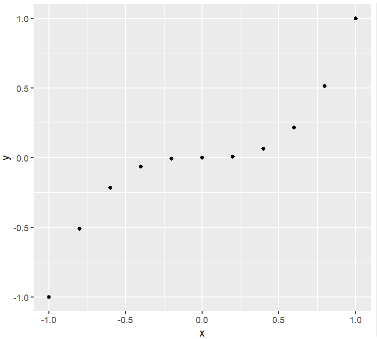
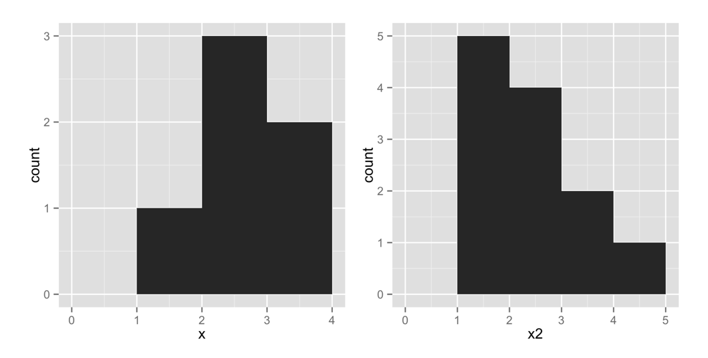
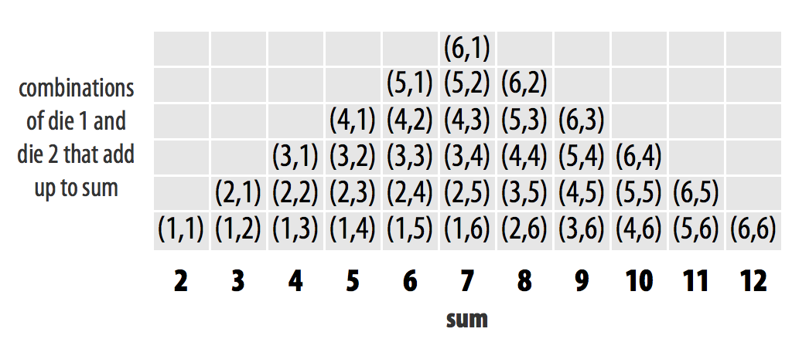
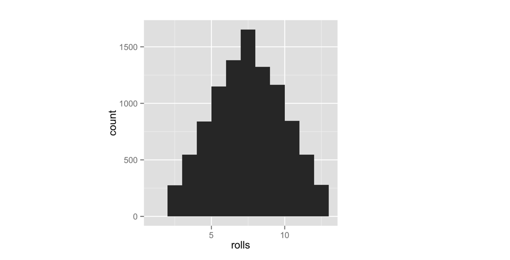
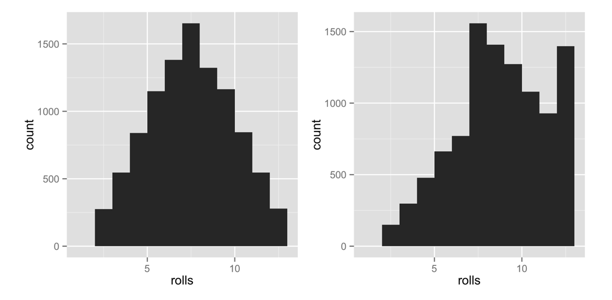

# 包与帮助页面

2026-04-09⭐
@author Jiawei Mao
***
现在有了可以模拟掷两枚骰子的函数。让我们给骰子加上偏向性，让结果变得更有趣一些。庄家总是赢，不是吗？我们来让骰子掷出高点数的概率略高于低点数。

在给骰子设置权重之前，我们首先要确保骰子原本是公平的。有两个工具可以帮你做到这一点：**重复试验**和**可视化**。这两个工具也是数据科学领域中最实用的两大 “超能力”。

我们将使用名为 `replicate` 的函数来重复掷骰子的操作，并使用名为 `qplot` 的函数对结果进行可视化展示。`qplot` 并不会随基础 R 一同安装，它来自一个独立的 R 程序包。很多非常实用的 R 工具都以 R 包的形式提供，因此我们花点时间了解一下什么是 R 包，以及如何使用它们。

## 3.1 程序包

不是只有你在用 R 编写自定义函数，许多教授、程序员和统计学家都在使用 R 开发数据分析工具，并将这些工具免费公开供所有人使用。你只需下载即可使用它们 —— 这些工具以 **程序包（packages）** 的形式提供的，即预先打包好的函数与对象集合。附录 2：R 程序包中包含了下载和更新 R 包的详细说明，这里我们先介绍基础用法。

我们将使用 `qplot` 函数快速绘制图表。`qplot` 来自 **ggplot2** 包，这是一个非常流行的绘图扩展包。在使用 `qplot` 或 ggplot2 包中的其他任何功能之前，你需要先下载并安装该包。

### 3.1.1 install.packages

每个 R 程序包都托管在 http://cran.r-project.org 网站上，该网站同样也是 R 语言的官方站点。不过，你无需访问该网站来下载 R 包；可以直接通过 R 的命令行下载程序包。操作方法如下：

1. 打开 RStudio。
2. 确保你的设备已连接互联网。
3. 在命令行中运行 `install.packages("ggplot2")`。

完成以上步骤即可。R 会自动访问该网站，下载 ggplot2 包，并将其安装到硬盘中 R 默认的程序包目录下。至此，你就成功安装了 ggplot2 包。如果需要安装其他程序包，只需将代码中的 `ggplot2` 替换为对应的包名即可。

### 3.1.2 library

安装程序包并不会立刻让你可以直接使用其中的函数：它只是将包文件保存到了你的硬盘中。要使用一个 R 包，必须在当前 R 会话中通过 `library("ggplot2")` 命令将其加载。如果你需要加载其他包，只需将代码中的 `ggplot2` 替换为对应的包名即可。

想看看这会产生什么效果，不妨做个实验。首先，让 R 显示 `qplot` 函数。R 会找不到 `qplot`，因为 `qplot` 位于 `ggplot2` 包中，而你还没有加载这个包：

```R
qplot
## Error: object 'qplot' not found
```

现在加载 ggplot2 包：

```R
library("ggplot2")
```

如果你按照说明使用 `install.packages` 安装了程序包，一切应该都会顺利。如果没有看到任何结果或提示信息，不用担心 —— 加载包时**没有消息就是好消息**。就算看到一些提示信息也没关系，`ggplot2` 有时会显示一些有用的启动信息。只要没有出现包含 “Error（错误）” 的内容，就说明一切正常。

现在，如果你再次查看 `qplot`，R 会显示出一大段代码（`qplot` 本身是一个很长的函数）：

```r
> qplot
function (x, y, ..., data, facets = NULL, margins = FALSE, geom = "auto", 
    xlim = c(NA, NA), ylim = c(NA, NA), log = "", main = NULL, 
    xlab = NULL, ylab = NULL, asp = NA, stat = deprecated(), 
    position = deprecated()) 
{...}
```

[附录 2](./Appendix-B.md) 详细介绍了更多关于获取和使用程序包的内容。如果你不熟悉 R 的包管理系统，建议阅读这部分。需要记住的核心要点是：**一个程序包只需安装一次**，但每次在新的 R 会话中使用时，都需要用 `library` 重新加载。关闭 RStudio 时，R 会自动卸载所有已加载的程序包。

加载 qplot 后，现在就让我们来试用一下它。`qplot` 的作用是制作 “快速图表”。如果你向 qplot 传入两个长度相同的向量，qplot 会为你绘制一幅散点图。qplot 会把第一个向量作为一组 x 轴数值，第二个向量作为一组 y 轴数值。你可以在 RStudio 窗口右下角面板的 “绘图” 标签页中查看生成的图表。

下面的代码将生成图 3.1 所示的图表。到目前为止，我们一直在使用 `:` 运算符创建数字序列；不过你也可以使用 `c` 函数来创建数值向量。把你想要放进向量里的所有数字传给 `c`，数字之间用逗号分隔。`c` 代表 **concatenate（拼接）**，但你可以把它理解为 “收集” 或 “合并”。

```R
> x <- c(-1, -0.8, -0.6, -0.4, -0.2, 0, 0.2, 0.4, 0.6, 0.8, 1)
> x
 [1] -1.0 -0.8 -0.6 -0.4 -0.2  0.0  0.2  0.4  0.6  0.8  1.0
> y <- x^3
> y
 [1] -1.000 -0.512 -0.216 -0.064 -0.008  0.000  0.008  0.064  0.216  0.512  1.000
> qplot(x, y)
```



> **图 3.1**：向 qplot 传入两个向量，它会绘制出散点图。

你不必把向量命名为 `x` 和 `y`。我这么做只是为了让示例更清晰易懂。如图 3.1 所示，散点图是一组点，每个点都根据其 x 值和 y 值绘制。向量 x 和 y 共同描述了 10 个点。R 是如何匹配 x 和 y 中的数值来生成这些点的呢？是通过**按元素逐个执行**的方式，就像我们在图 2.3 中看到的那样。

散点图有助于呈现两个变量之间的关系。不过，我们接下来要使用另一种图表 ——**直方图**。直方图用于展示单个变量的分布情况，它会显示在 x 轴的每个数值上各有多少个数据点。

我们来画一张直方图看看是否合理。当你只给 `qplot` 传入一个向量时，它就会绘制直方图。下面的代码会生成图 3.2 中左侧的图表（我们稍后再看右侧的图表）。为了让我们的图表样式一致，请加上额外参数 `binwidth = 1`：

```R
x <- c(1, 2, 2, 2, 3, 3)
qplot(x, binwidth = 1)
```



> 图 3.2：当向 qplot 传入单个向量时，它会绘制出直方图。

这张图表通过在区间 [1, 2) 上方绘制高度为 1 的柱形，表明我们的向量在该区间内有一个数值。同样地，图表在区间 [2, 3) 绘制高度为 3 的柱形，表示向量在该区间内有三个数值。在区间 [3, 4) 绘制高度为 2 的柱形，表示该区间内包含两个数值。在这些区间表示中，方括号 `[` 表示区间包含起始数字，而圆括号 `)` 表示区间不包含结束数字。

我们来尝试绘制另一张直方图。这段代码会生成图 3.2 中右侧的图表。注意，向量`x2`中有 5 个值为 1 的数据点，直方图会在`x2 = [1, 2)`这个区间上方绘制一个高度为 5 的柱形来体现这一点：

```R
x2 <- c(1, 1, 1, 1, 1, 2, 2, 2, 2, 3, 3, 4)
qplot(x2, binwidth = 1)
```

**练习 3.1（绘制直方图）**

设 `x3` 为如下向量：

```R
x3 <- c(0, 1, 1, 2, 2, 2, 3, 3, 4)
```

想象一下 `x3` 的直方图会是什么样子。假设直方图的 bin-width 为 1。直方图会有多少个 bar？它们会出现在哪些区间？每个 bar 的高度分别是多少？

完成之后，使用组距 `binwidth = 1` 绘制 `x3` 的直方图，看看你的猜想是否正确。

**答案：**

用 `qplot(x3, binwidth = 1)` 绘制 `x3` 的直方图。直方图会呈现一个对称的金字塔形状。中间的柱形高度为 3，出现在区间 `[2, 3)` 上方，你一定要亲自运行代码看看效果。

你可以用直方图直观地展示 x 的不同取值出现的频繁程度。高柱形覆盖的数值比矮柱形覆盖的数值出现得更频繁。

如何用直方图检验骰子是否均匀准确呢？

其实，如果你多次投掷骰子并记录结果，会发现某些数字出现的次数会比其他数字更多。这是因为两个骰子相加时，某些点数组合方式更多，如图 3.3 所示。

如果你多次投掷骰子，并用 qplot 绘制结果，直方图会显示每个总点数出现的频率。出现次数最多的点数会对应最高的柱形。如果骰子是均匀的，直方图应该呈现出图 3.3 中的分布形态。

这时就可以用到 `replicate` 函数。它能方便地让你重复执行某条 R 命令多次。使用时，先告诉 `replicate` 你想重复执行命令的次数，再传入需要重复的命令即可。`replicate` 会多次运行该命令，并将结果保存为一个向量。

```R
replicate(3, 1 + 1)
## 2 2 2

replicate(10, roll())
## 3  7  5  3  6  2  3  8 11  7
```



>  图 3.3：每个单独的骰子组合出现的频率应当相同。因此，某些点数之和会比其他点数之和出现得更频繁。在骰子均匀的情况下，每个点数和的出现次数，应与能组合出该点数和的组合数量成正比。

你前 10 次掷骰子得到的直方图，很可能不会呈现出图 3.3 所示的规律。为什么呢？因为其中包含的随机性太强了。要知道，我们在现实中使用骰子，正是因为它是高效的随机数生成器。只有在大量重复试验后，长期频率的规律才会显现出来。因此，我们来模拟掷 10000 次骰子，并绘制结果。不用担心，`qplot` 和 `replicate` 完全可以处理。结果如图 3.4 所示：

```R
rolls <- replicate(10000, roll())
qplot(rolls, binwidth = 1)
```

结果表明骰子是均匀公平的。从长期来看，每个点数出现的频率与能组合出该点数的组合数量成正比。

那么，**要如何让结果出现偏向呢？**前面出现的分布规律，是因为骰子的每一种基础组合（例如 (3,4)）出现的频率都相同。如果你能提高任意一颗骰子掷出 6 点的概率，那么**任何包含 6 点的组合**都会比不包含 6 点的组合出现得更频繁。组合 (6, 6) 将会是出现最多的情况。这并不会让点数和为 12 的情况比和为 7 的情况更常见，但会**使结果整体偏向更大的数值**。



> 图 3.4：骰子的表现说明它们是均匀公平的。点数 7 出现的次数比其他任何点数都多，且各点数出现的频率与能组合出该点数的骰子组合数量成比例递减。

换句话说，掷一枚均匀骰子得到任意一个点数的概率都是 **1/6**。我希望你把**小于 6 的每个点数**的概率都改为 **1/8**，然后将掷出 6 点的概率提高到 **3/8**。

| Number | Fair probability | Weighted probability |
| ------ | ---------------- | -------------------- |
| 1      | 1/6              | 1/8                  |
| 2      | 1/6              | 1/8                  |
| 3      | 1/6              | 1/8                  |
| 4      | 1/6              | 1/8                  |
| 5      | 1/6              | 1/8                  |
| 6      | 1/6              | 3/8                  |

你可以通过向 `sample` 函数添加一个新参数来修改概率。我不会直接告诉你这个参数是什么；相反，我会引导你去查看 `sample` 函数的帮助文档。

## 3.2 通过帮助页面获取帮助

R 的核心部分有超过 1000 个函数，而且新的 R 函数还在不断被开发出来。需要记忆和学习的内容实在太多了！幸运的是，每个 R 函数都配有专属的帮助页面，你只需在问号后面输入函数名即可访问。例如，下面这些命令都能打开对应的帮助页面。帮助页面会显示在 RStudio 右下角面板的 “帮助” 标签页中：

```R
?sqrt
?log10
?sample
```

帮助页面包含了关于每个函数功能的实用信息。这些页面同时也作为代码文档存在，所以阅读起来往往喜忧参半。它们常常看上去像是写给那些本来就懂这个函数、根本不需要帮助的人看的。

别为此烦恼 —— 你只需浏览帮助页面里**看得懂的内容**，忽略其余部分，就能收获很多。这种方法几乎总能让你找到每个帮助页面最有用的部分：**底部**。在这里，几乎所有帮助页面都会提供一些示例代码，演示该函数的实际用法。运行这些代码，是通过实例学习的绝佳方式。

> [!WARNING]
>
> 如果一个函数来自某个 R 包，除非该包已被加载，否则 R 将无法找到它的帮助页面。

### 3.2.1 帮助页面的组成

每个帮助页面都分为多个板块。不同函数的帮助页面所包含的板块会略有差异，但你通常都能找到以下内容：

- **Description（说明）**：对函数功能的简要概述。
- **Usage（用法）**：函数的输入格式示例。函数的各个参数会按照 R 要求的顺序排列（适用于你不指定参数名直接传参的情况）。
- **Arguments（参数）**：函数所接收的每个参数的列表，包括 R 期望你为该参数提供的数据类型，以及函数会如何处理这些信息。
- **Details（细节）**：对函数及其运行方式的更深入说明。该部分也会由函数作者补充一些使用时需要注意的重要信息。
- **Value（返回值）**：描述运行函数后会返回什么样的结果。
- **See Also（相关参考）**：相关的 R 函数简表。
- **Examples（示例）**：可直接运行的函数使用示例代码。帮助页面的示例部分通常会展示几种不同的用法，帮你了解该函数的功能范围。

如果你想查找某个函数的帮助页面，却忘记了函数名，可以通过**关键词**进行搜索。操作方法是：在 R 的命令行中输入两个问号，后面跟上关键词。R 会列出与该关键词相关的帮助页面链接。你可以把它理解为 “帮助页面的帮助页”：

```R
??log
```

我们一起来浏览 `sample` 函数的帮助页面。记住：我们要寻找帮你**改变抽样概率**的相关内容。我不会把整个帮助页面都放出来（只节选最关键的部分），所以你应该在自己的电脑上跟着一起操作。

```R
?sample
```

你看到了什么？从顶部开始看起：

```R
Random Samples and Permutations
Description
sample takes a sample of the specified size from the elements of x using either with or without replacement.
```

目前为止一切顺利，这些你都已经知道了。下一部分 **用法（Usage）** 给出了一个有用的线索：它提到了一个名为 **prob** 的参数。

```R
Usage
sample(x, size, replace = FALSE, prob = NULL)
```

如果你向下滚动到 **参数（Arguments）** 部分，对 `prob` 的描述看起来非常符合我们的需求：

```R
prob	
a vector of probability weights for obtaining the elements of the vector being sampled.
```

细节（Details）部分证实了我们的猜测：

```
The optional prob argument can be used to give a vector of weights for obtaining the elements of the vector being sampled. They need not sum to one, but they should be non-negative and not all zero.
```

虽然帮助页面此处并未说明，但这些**权重**会与被抽样的元素**按位置一一对应**。第一个权重对应第一个元素，第二个权重对应第二个元素，依此类推。这是 R 中的通用做法。

继续阅读：

```
If replace is true, Walker's alias method (Ripley, 1987) is used when there are more than 200 reasonably probable values: this gives results incompatible with those from R < 2.2.0.
```

看来可以开始略读剩下的内容了。我们现在已经有足够的信息，弄清楚该如何给骰子设置权重了。

**练习 3.2（掷一对骰子）**

改写下面的 `roll` 函数，使其能够掷一对**加权骰子**：

```R
roll <- function() {
  die <- 1:6
  dice <- sample(die, size = 2, replace = TRUE)
  sum(dice)
}
```

你需要在 `roll` 函数内部的 `sample` 函数中添加一个 `prob` 参数。该参数应设置为：数字 1 到 5 的抽样概率为 **1/8**，数字 6 的抽样概率为 **3/8**。

完成之后，继续阅读查看参考答案。

**解答：**

要给骰子设置权重，你需要在 `sample` 函数中添加一个 `prob` 参数，并传入一个权重向量，示例如下：

```R
roll <- function() {
  die <- 1:6
  dice <- sample(die, size = 2, replace = TRUE, 
    prob = c(1/8, 1/8, 1/8, 1/8, 1/8, 3/8))
  sum(dice)
}
```

这样一来，`roll` 函数掷出 1 到 5 点的概率均为 1/8，掷出 6 点的概率为 3/8。

在命令行中运行刚才的代码片段，用新函数**覆盖**你之前版本的 `roll` 函数。然后可视化展示这枚骰子新的长期分布规律。我已经将结果与原始结果对比展示在图 3.5 中：

```R
rolls <- replicate(10000, roll())
qplot(rolls, binwidth = 1)
```

这证实了我们已经**有效地给骰子加了权重**。大数出现的频率远高于小数。值得注意的是，这种规律只有在观察**长期频率**时才会显现出来。在单次投掷中，骰子的结果看起来依然是随机的。如果你玩《卡坦岛》桌游，这绝对是个好消息（你只需跟朋友说骰子弄丢了就行），但如果你在做数据分析，这就需要警惕了 —— 因为这意味着**偏差很容易在短期内不被任何人察觉地出现**。



> 图 3.5：骰子现在明显偏向于掷出较大的点数，因为大数之和出现的频率远高于小数之和。

### 3.2.2 获取更多帮助

R 还拥有一个非常活跃的用户社区，你可以通过 [R-help 邮件列表](bit.ly/r-help)寻求帮助。你可以向该列表发送邮件提问，但你的问题很大概率已经有人解答过了。通过搜索归档记录即可查到。

比 R-help 邮件列表更好的是 [Stack Overflow](https://stackoverflow.com/questions)，这是一个程序员可以回答问题、用户可以根据实用性对回答进行评分的网站。就我个人而言，Stack Overflow 的界面形式比 R-help 邮件列表更友好（而且回答者也更有人情味）。你可以提交自己的问题，或是搜索 Stack Overflow 上已有的、与 R 相关的解答，相关问题已超过三万条。

最推荐的是 **[community.rstudio.com](https://community.rstudio.com)**，这是一个氛围友好、包容的 R 相关问题交流平台。该论坛活跃度极高，且专注于 R 语言。如果你提问某个 R 包的问题，结果该包的作者亲自来回答，也不必感到惊讶。

在 R-help 邮件列表、Stack Overflow 和 [community.rstudio.com](https://community.rstudio.com) 上提问时，如果你能提供**可重复示例**，就更有可能获得有用的答复。这意味着粘贴一小段代码，其他人运行后就能复现你遇到的错误或你想咨询的问题。

## 3.3 小结

R 的扩展包与帮助文档能显著提升你的编程效率。在[基础部分](./2-basics.md)我们已经了解到，R 支持你编写实现特定功能的自定义函数，但很多你想实现的功能，往往在 R 扩展包中已有现成可用的函数。高校学者、程序员和科研工作者已经开发了超过 13000 个扩展包供你使用，能为你节省大量编程时间。使用某个扩展包时，你只需用 `install.packages` 在电脑上完成一次安装，之后每次开启新的 R 会话时用 `library` 加载即可。

R 的帮助页面能帮你掌握 R 及其扩展包中各类函数的用法。R 中的每个函数和数据集都配有专属帮助页面。尽管帮助页面常会包含一些高阶内容，但其中也有极具价值的使用说明和示例代码，能帮你学会函数的使用方法。

到这里，你已经掌握了足够的 R 知识，可以通过**实操来学习**—— 这也是学习 R 最好的方式。你可以编写自己的 R 命令并运行，遇到本书未讲解的内容时，也能通过帮助文档解决。建议你在阅读接下来的两个实战项目时，大胆在 R 中尝试自己的想法。

## 3.4 项目 1 总结

在这个项目中，你所做的远不止模拟作弊和赌博；你还学会了如何用**R 语言**与计算机交流。R 是一门和英语、西班牙语、德语类似的语言，只不过 R 是用来和计算机沟通，而不是和人交流。

你已经认识了 R 语言里的 “名词”——**对象（objects）**。想必你也猜到了，**函数（functions）** 就是 R 里的 “动词”（我觉得函数的参数可以算作 “副词”）。当你把函数和对象组合起来，就能表达一个完整的逻辑。把这些逻辑按顺序连贯地组合起来，你就可以写出简洁流畅、甚至颇具技巧性的代码。从这一点来看，R 和其他语言并没有太大区别。

R 还和人类语言有另一个共同点：只有积累了一定的 R 命令词汇量，你使用起来才会得心应手。好在你完全不必感到拘谨，只有你的计算机会 “听” 你用 R 语言编写代码。计算机或许对语法错误毫不留情，但它从不会评判你。你也无需担心，在读完本书的过程中，你的 R 词汇量会得到极大的扩充。

既然你已经会使用 R 了，接下来就该成为用 R 做数据科学的行家。数据科学的基础，是能够存储海量数据并按需提取数据。在此之上，才能进行后续的一切操作 —— 数据处理、数据可视化、数据建模等等。然而，只靠记忆很难在脑海中保存一个数据集，写在纸上也同样不便。存储大量数据唯一高效的方式，就是借助计算机。事实上，计算机的存储效率极高，过去三十年间计算机技术的发展，彻底改变了我们能够收集的数据类型以及分析数据的方法。简而言之，计算机数据存储推动了这场我们称之为**数据科学**的科学革命。

**项目 2：扑克牌**将教会你如何用 R 在计算机内存中存储数据集，以及如何对已存储的数据进行提取和处理，让你也成为这场革命的一员。