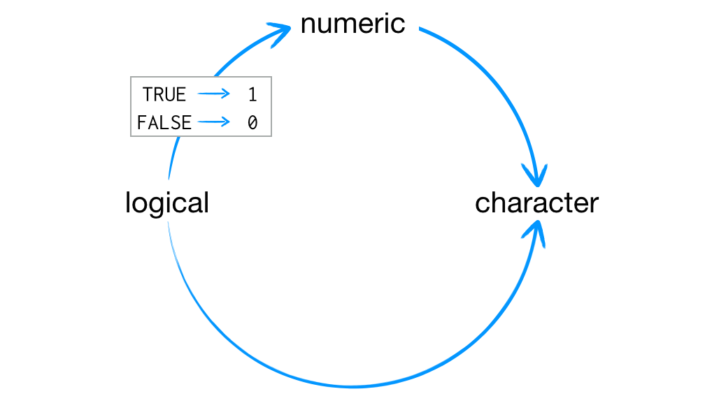
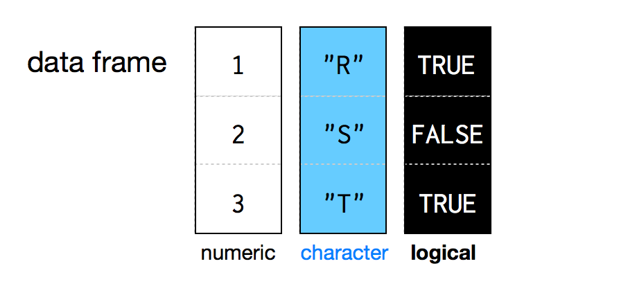
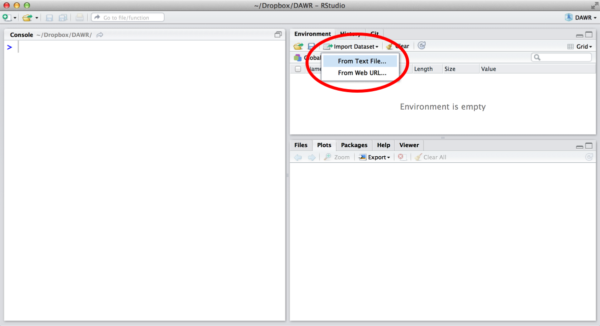
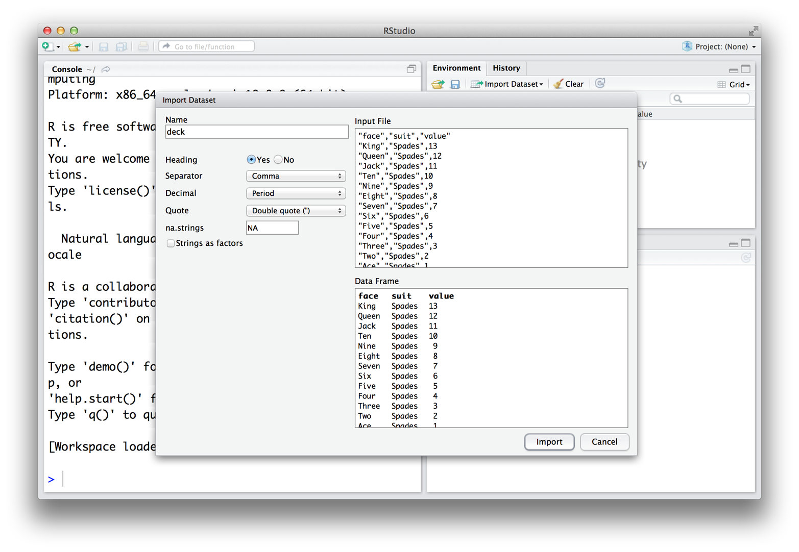
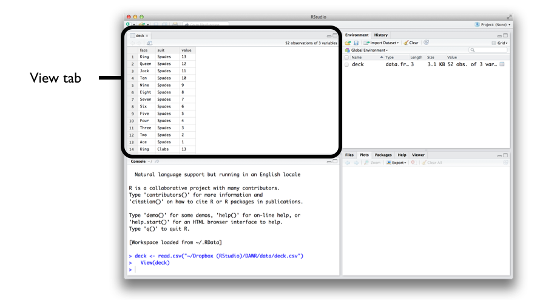

# R 对象

2026-08-28⭐
@author Jiawei Mao
***
在本章中，你将使用 R 语言来组装一副包含 52 张牌的扑克牌。

你将从构建代表扑克牌的简单 R 对象开始，然后逐步构建出一个完整的数据表。简而言之，你将从零开始构建一个相当于 Excel 电子表格的数据结构。当你完成本章内容时，你的扑克牌看起来会像下面这样：

```R
 face   suit value
 king spades    13
queen spades    12
 jack spades    11
  ten spades    10
 nine spades     9
eight spades     8
...
```

在 R 语言中使用数据集，必须要从零开始自己构建吗？完全不是这样。你只需一个简单的步骤，就能将大多数数据集加载到 R 中（详见“加载数据”一节）。不过，这项练习能帮助你理解 R 是如何存储数据的，以及你该如何组装或拆解自己的数据集。你还将了解到 R 语言提供的各种对象类型。你可以把这项练习看作是一场“成人礼”；完成它之后，你将成为 R 语言数据存储方面的专家。

我们将从最基础的内容开始。R 语言中最简单的对象类型是“原子向量”（atomic vector）。这里的“原子”（atomic）并不是指核动力，而是指它非常基础、简单，并且无处不在。如果你仔细观察，就会发现 R 语言中的大多数数据结构都是由原子向量构建而成的。

## 1. 原子向量

原子向量（atomic vector）本质上是简单的数据向量。事实上，你之前已经创建过一个原子向量了：项目 1 加权骰子中创建的骰子（die）对象。你可以使用 `c()` 函数将一些数据值组合在一起，从而创建一个原子向量：

```R
> die <- c(1, 2, 3, 4, 5, 6)
> die
[1] 1 2 3 4 5 6
> is.vector(die)
[1] TRUE
```

> [!NOTE]
>
> `is.vector` 用于测试一个对象是否为原子向量。如果该对象是原子向量，则返回 `TRUE`；否则返回 `FALSE`。

你也可以创建只包含单个值的原子向量。在 R 语言中，单个值会被保存为长度为 1 的原子向量：

```R
> five <- 5
> five
[1] 5
> is.vector(five)
[1] TRUE
> length(five)
[1] 1
> length(die)
[1] 6
```

> [!NOTE]
>
> `length` 函数返回原子向量的长度（即包含的元素个数）。

每个原子向量都将其值存储为一维向量，并且每个原子向量只能存储一种数据类型。在 R 语言中，你可以通过使用不同类型的原子向量来保存各种类型的数据。总的来说，R 语言支持六种基本的原子向量类型：双精度型（doubles）、整型（integers）、字符型（characters）、逻辑型（logicals）、复数型（complex）和原始型（raw）。

为了创建你的扑克牌，你需要使用不同类型的原子向量来分别保存文本和数字等信息。在输入数据时，只需遵循一些简单的规则即可实现这一点。例如，在输入的数字后面加上大写字母 `L`，就可以创建一个整型向量；用引号将输入内容括起来，就可以创建一个字符型向量：

```R
int <- 1L
text <- "ace"
```

每种类型的原子向量都有其特定的书写规则。R 语言会识别这些规则，并据此创建相应类型的原子向量。如果你想创建包含多个元素的原子向量，可以使用我们在“包与帮助页面”一章中介绍过的 `c()` 函数，将多个元素组合在一起。请注意，对每一个元素都要使用相同的书写规则：

```R
int <- c(1L, 5L)
text <- c("ace", "hearts")
```

你可能会好奇，为什么 R 语言要区分这么多类型的向量。其实，向量类型能让 R 语言的表现更符合你的预期。例如，R 语言会对包含数字的原子向量进行数学运算，但不会对包含字符串的原子向量进行数学运算：

```R
> int <- 1L
> text <- "ace"
> sum(int)
[1] 1
> sum(text)
Error in sum(text) : invalid 'type' (character) of argument
```

不过，我们现在说得有些超前啦！准备好迎接 R 语言中的六种原子向量类型吧。

### 1.1 双精度（Doubles）

double 向量用于存储常规数字。这些数字可以是正数或负数，也可以是大数或小数，可以有小数位，也可以没有。通常情况下，你在 R 语言中输入的任何数字都会被默认保存为双精度型（double）。例如，你在“项目 1：加权骰子”中创建的骰子（die）对象就是一个双精度型对象：

```r
die <- c(1, 2, 3, 4, 5, 6)
die
## [1] 1 2 3 4 5 6
```

通常，你很容易就能分辨出在 R 语言中处理的是哪种类型的对象（因为往往很明显）。不过，你也可以使用 `typeof()` 函数来询问 R 某个对象的具体类型。例如：

```r
> typeof(die)
[1] "double"
```

有些 R 语言函数会将双精度型称为“numerics”（数值型）。其实，“double”（双精度）是一个计算机科学术语，它特指计算机用来存储数字的具体字节数。但在进行数据科学工作时，使用“numeric”（数值型）这个词会更加直观易懂。

### 1.2 整型（Integers）

整型向量用于存储整数，即没有小数部分的数字。作为数据科学家，你通常不会经常使用整型，因为你可以直接将整数保存为 double 类型。

在 R 语言中，如果你要专门创建一个整数，只需在数字后面加上大写字母 `L`。例如：

```r
> int <- c(-1L, 2L, 4L)
> int
[1] -1  2  4

> typeof(int)
[1] "integer"
```

请注意，除非你加上了 `L`，否则 R 不会将数字保存为整型。没有 `L` 的整数会被默认保存为双精度型。`4` 和 `4L` 的唯一区别在于 R 在计算机内存中保存该数字的方式。整型在计算机内存中的定义比双精度型更精确（除非该整数极大或极小）。

那么，为什么要把数据保存为整型而不是双精度型呢？因为有时候精度的差异会带来意想不到的影响。在 R 语言程序中，计算机分配 64 位（bits）的内存来存储每一个双精度数。这提供了极高的精度，但有些数字是无法用 64 位（相当于 64 个 0 和 1 的序列）精确表示的。例如，圆周率 π 在小数点后有无限位的数字。为了将 π 存储在内存中，计算机必须将其四舍五入为一个非常接近但不完全等于 π 的值。许多十进制数都面临着同样的命运。

因此，每个双精度数大约精确到 **16 位有效数字**。这就引入了一点点误差。在大多数情况下，这种舍入误差可以忽略。然而，在某些情况下，舍入误差会导致令人惊讶的结果。例如，你可能认为下面这个表达式的结果应该是零，但不是：

```r
> sqrt(2)^2 - 2
[1] 4.440892e-16
```

2 的平方根无法用 16 位有效数字精确表示。因此，R 必须对这个数值进行四舍五入，导致该表达式的最终结果是一个非常接近零但等于零的值。

这类误差被称为“浮点误差”（floating-point errors），在这种条件下进行的算术运算被称为“浮点运算”（floating-point arithmetic）。浮点运算并不是 R 语言特有的，它是计算机编程的固有特性。通常，浮点误差不会给你带来太大的麻烦。你只需要记住，当你遇到令人惊讶的结果时，这可能是由浮点误差引起的。

你可以通过避免使用小数、只使用整数来避开浮点误差。然而，在大多数数据科学场景中，这并不现实。因为在进行整数运算时，你很快就会需要一个非整数（小数）来表达计算结果。幸运的是，浮点运算引起的误差通常微乎其微（即使偶尔影响较大，也很容易被察觉）。因此，作为数据科学家，你通常会选择使用双精度型而不是整型。

### 1.3 字符型（Characters）

字符型向量用于存储小段的文本。在 R 语言中，你可以将字符或字符串放在引号内，从而创建一个字符型向量：

```r
> text <- c("Hello", "World")
> text
[1] "Hello" "World"

> typeof(text)
[1] "character"

> typeof("Hello")
[1] "character"
```

字符型向量中的单个元素被称为字符串（strings）。请注意，字符串中不仅可以包含字母，你还可以使用数字或符号来组合成字符串。

**练习 5.1（字符还是数字？）** 你能分辨出字符串和数字的区别吗？来做个小测试：下面这些内容中，哪些是字符串，哪些是数字？`1`、`"1"`、`"one"`。

**解答：** `"1"` 和 `"one"` 都是字符串。

字符串中可以包含数字字符，但这并不意味着它们就变成了数值型。它们仅仅碰巧包含了数字而已，本质上依然是字符串。你可以通过引号来区分字符串和真正的数字，因为字符串总是被引号包围。事实上，在 R 语言中，任何被引号包围的内容都会被当作字符串处理——无论引号里面到底是什么。

人们很容易将 R 对象与字符串混淆。为什么呢？因为它们在 R 代码中看起来都是一段段文本。例如，`x` 是一个名为“x”的 R 对象，而 `"x"` 则是一个包含了字符“x”的字符串。前者是包含原始数据的对象，后者本身就是原始数据。

如果你忘记加引号，R 语言就会报错；因为它会试图去寻找一个大概率并不存在的对象。

### 1.4 逻辑型（Logicals）

逻辑型向量用于存储 `TRUE`（真）和 `FALSE`（假），它们是 R 语言中的布尔数据形式。逻辑型数据在进行比较等操作时非常有用：

```r
3 > 4
## [1] FALSE
```

只要你在 R 语言中输入大写的 `TRUE` 或 `FALSE`（且不加引号），R 就会将其识别为逻辑型数据。此外，R 语言也默认将 `T` 和 `F` 作为 `TRUE` 和 `FALSE` 的简写，除非你在其他地方对它们进行了重新定义（例如 `T <- 500`）。由于 `T` 和 `F` 的含义可能会发生改变，因此最好还是坚持使用完整的 `TRUE` 和 `FALSE`：

```r
logic <- c(TRUE, FALSE, TRUE)
logic
## [1]  TRUE FALSE  TRUE

typeof(logic)
## [1] "logical"

typeof(F)
## [1] "logical"
```

### 1.5 复数型（Complex）与原始型（Raw）

双精度型、整型、字符型和逻辑型是 R 语言中最常见的原子向量类型，但 R 还识别另外两种类型：复数型（complex）和原始型（raw）。在实际的数据分析中，你大概率不会用到它们，但为了内容的完整性，这里还是做一下介绍。

复数型向量用于存储复数。要创建一个复数型向量，只需在数字后面加上带有 `i` 的虚部即可：

```r
> comp <- c( 1+ 1i, 1+2i, 1+3i)
> comp
[1] 1+1i 1+2i 1+3i

> typeof(comp)
[1] "complex"
```

原始型向量用于存储原始的字节数据。创建原始型向量相对复杂，但你可以使用 `raw(n)` 来创建一个长度为 `n` 的空原始型向量。有关处理此类数据的更多选项，请参阅 `raw` 函数的帮助页面：

```r
raw(3)
## [1] 00 00 00

typeof(raw(3))
## [1] "raw"
```

**练习 5.2（扑克牌向量）** 创建一个原子向量，仅存储皇家同花顺（royal flush）中扑克牌的牌面名称。例如：黑桃 A、黑桃 K、黑桃 Q、黑桃 J 和黑桃 10。其中，黑桃 A 的牌面名称是 “ace”，而 “spades” 是花色。

你会使用哪种类型的向量来保存这些名称？

**解答：** 保存扑克牌名称最合适的原子向量类型是字符型向量。只要用引号将每个名称括起来，你就可以使用 `c()` 函数来创建它：

```r
hand <- c("ace", "king", "queen", "jack", "ten")
hand
## [1] "ace"   "king"  "queen" "jack"  "ten"  

typeof(hand)
## [1] "character"
```

这样就创建了一个包含扑克牌名称的一维数据组！接下来，让我们构建一个更复杂的数据结构：一个包含牌面名称和花色的二维表格。通过为原子向量添加属性（attributes）并为其分配一个类（class），就可以基于原子向量构建出更复杂的对象。

## 2. 属性（Attributes）

属性（attribute）是附加到原子向量（或任何 R 对象）上的一段信息。属性不影响对象中的任何值，在显示对象时也不会显示出来。你可以把属性理解为“元数据”（metadata）：它只是一个方便的地方，用来存放与对象相关的附加信息。R 通常会忽略这些元数据，但某些 R 函数会检查特定的属性，并据此对数据进行特殊处理。

你可以使用 `attributes()` 函数查看一个对象拥有哪些属性。如果对象没有任何属性，`attributes()` 返回 `NULL`。像 `die` 这样的原子向量，除非你主动给它添加属性，否则不会有任何属性：

```r
> die <- 1:6
> attributes(die)
NULL
```

> [!TIP]
>
> 在 R 语言中，`NULL` 用来表示空集，也就是一个空对象。当函数的返回值未定义时，通常也会返回 `NULL`。如果你想创建一个 `NULL` 对象，直接输入大写的 `NULL` 就可以了。

### 2.1 名称（Names）

原子向量最常见的属性包括名称（names）、维度（dim）和类（classes）。每种属性都有对应的辅助函数，你可以使用这些函数为对象设置属性，也可以用来查询已有对象的属性值。例如，你可以使用 `names()` 函数查看 `die` 的名称属性值：

```r
> names(die)
NULL
```

返回 `NULL` 表示 `die` 没有名称属性。你可以通过将一个字符向量赋值给 `names()` 的输出结果来为 `die` 添加名称。该向量中需要包含与 `die` 中元素个数相同的名称：

```r
names(die) <- c("one", "two", "three", "four", "five", "six")
```

现在 `die` 就拥有了名称属性：

```r
> names(die)
[1] "one"   "two"   "three" "four"  "five"  "six"  

> attributes(die)
$names
[1] "one"   "two"   "three" "four"  "five"  "six" 
```

每当你查看该向量时，R 都会在 `die` 的元素上方显示这些名称：

```r
> die
  one   two three  four  five   six 
    1     2     3     4     5     6 
```

不过，名称不影响向量的实际值，同样地，当你对向量的值进行操作时，名称也不会受到影响：

```r
> die + 1
  one   two three  four  five   six 
    2     3     4     5     6     7 
```

你还可以使用 `names()` 来修改名称属性，或者将其移除。要修改名称，只需将一组新的标签赋值给 `names()`：

```r
> names(die) <- c("uno", "dos", "tres", "quatro", "cinco", "seis")
> die
   uno    dos   tres quatro  cinco   seis 
     1      2      3      4      5      6 
```

若要移除名称属性，只需将其赋值为 `NULL`：

```r
> names(die) <- NULL
> die
[1] 1 2 3 4 5 6
```

### 2.2 维度（Dim）

可以通过 `dim()` 函数为原子向量添加维度（dimensions）属性，从而将其转换为 n 维数组。具体做法是将 `dim` 属性设置为一个长度为 n 的数值向量。R 会将向量中的元素重新组织为 n 个维度，每个维度的行数（或列数等）由 `dim` 向量中对应的值决定。例如，可以将 `die` 重新组织为一个 2 × 3 的矩阵（即 2 行 3 列）：

```r
> die
[1] 1 2 3 4 5 6
> attributes(die)
NULL

> dim(die) <- c(2, 3)
> die
     [,1] [,2] [,3]
[1,]    1    3    5
[2,]    2    4    6
> attributes(die)
$dim
[1] 2 3
```

或者是一个 3 × 2 的矩阵（即 3 行 2 列）：

```r
> dim(die) <- c(3, 2)
> die
     [,1] [,2]
[1,]    1    4
[2,]    2    5
[3,]    3    6
```

又或者是一个 1 × 2 × 3 的超立方体（即 1 行、2 列和 3 个“切片”）。这是一个三维结构，R 需要在你的二维屏幕上逐层（逐切片）进行展示：

```r
> dim(die) <- c(1, 2, 3)
> die
, , 1

     [,1] [,2]
[1,]    1    2

, , 2

     [,1] [,2]
[1,]    3    4

, , 3

     [,1] [,2]
[1,]    5    6
```

R 总是将 `dim` 中的第一个值作为行数，第二个值作为列数。通常来说，在 R 中同时涉及行和列的操作里，行总是排在列的前面。

你可能注意到，对于 R 如何将数值重新排布到行和列中，你没有太多控制权。例如，R 总是按列（而非按行）来填充矩阵。如果你希望对这一过程有更多的控制，可以使用 R 提供的辅助函数 `matrix()` 或 `array()`。它们的作用与修改 `dim` 属性相同，但提供了额外的参数，允许你自定义填充过程。

## 3. 矩阵（Matrices）

矩阵将数据存储在二维数组中，这与线性代数中的矩阵概念相同。要创建一个矩阵，首先需要向 `matrix()` 函数提供一个原子向量，以便将其重新组织为矩阵。接着，将 `nrow` 参数设置为一个数字，来定义矩阵应包含的行数。`matrix()` 函数会按照你指定的行数，将你的数值向量组织成一个矩阵。另外，你也可以设置 `ncol` 参数，用来告诉 R 矩阵中应包含多少列：

```r
m <- matrix(die, nrow = 2)
m
##      [,1] [,2] [,3]
## [1,]    1    3    5
## [2,]    2    4    6
```

默认情况下，`matrix()` 会**按列**（column by column）来填充矩阵。但如果你加上 `byrow = TRUE` 参数，就可以按行（row by row）来填充矩阵：

```r
m <- matrix(die, nrow = 2, byrow = TRUE)
m
##      [,1] [,2] [,3]
## [1,]    1    2    3
## [2,]    4    5    6
```

`matrix()` 函数还有其他一些默认参数，你可以利用它们来进一步自定义矩阵。你可以在 `matrix` 的帮助页面（通过 `?matrix` 访问）中了解这些参数的详细信息。

## 4. 数组（Arrays）

`array()` 函数用于创建 n 维数组。例如，你可以使用 `array()` 将数值排列成一个三维的立方体，或者一个四维、五维乃至 n 维的超立方体。与 `matrix()` 相比，`array()` 的可定制性较弱，它的作用基本上等同于设置 `dim` 属性。使用 `array()` 时，需要提供一个原子向量作为第一个参数，并提供一个维度向量作为第二个参数（现在这个参数被称为 `dim`）：

```r
> ar <- array(c(11:14, 21:24, 31:34), dim = c(2, 2, 3))
> ar
, , 1

     [,1] [,2]
[1,]   11   13
[2,]   12   14

, , 2

     [,1] [,2]
[1,]   21   23
[2,]   22   24

, , 3

     [,1] [,2]
[1,]   31   33
[2,]   32   34
```

**练习 5.3（创建一个矩阵）**
请创建以下矩阵，该矩阵存储了同花顺（royal flush）中每张牌的名称（name）和花色（suit）。

```text
##      [,1]    [,2]    
## [1,] "ace"   "spades"
## [2,] "king"  "spades"
## [3,] "queen" "spades"
## [4,] "jack"  "spades"
## [5,] "ten"   "spades"
```

**解答：**
创建这个矩阵的方法不止一种，但在所有方法中，你都需要先创建一个包含 10 个元素的字符向量。如果你从以下字符向量开始，可以使用以下三条命令中的任意一条将其转换为矩阵：

```r
hand1 <- c("ace", "king", "queen", "jack", "ten", "spades", "spades", 
  "spades", "spades", "spades")

matrix(hand1, nrow = 5)
matrix(hand1, ncol = 2)
dim(hand1) <- c(5, 2)
```

你也可以创建一个字符向量，只是牌和花色的排列顺序稍有不同。在这种情况下，你需要要求 R 按行（row by row）而不是按列（column by column）来填充矩阵：

```r
hand2 <- c("ace", "spades", "king", "spades", "queen", "spades", "jack", 
  "spades", "ten", "spades")

matrix(hand2, nrow = 5, byrow = TRUE)
matrix(hand2, ncol = 2, byrow = TRUE)
```

## 5. 类（Class）

请注意，改变对象的维度不会改变对象的类型，但会改变对象的类（class）属性：

```r
dim(die) <- c(2, 3)
typeof(die)
##  "double"
 
class(die)
##  "matrix"
```

矩阵是原子向量的一种特殊情况。例如，`die` 矩阵是双精度（double）向量的一种特殊情况。矩阵中的每个元素依然是双精度类型，只是这些元素被重新排列成了一种新的结构。当你改变 `die` 的维度时，R 会为它添加一个类属性，用来描述 `die` 的新格式。许多 R 函数会专门检查对象的类属性，并根据该属性以预设的方式来处理对象。

需要注意的是，运行 `attributes()` 函数时，对象的类属性并不一定会显示出来，你可能需要使用 `class()` 函数来专门查询它：

```r
attributes(die)
## $dim
## [1] 2 3
```

你可以对没有类属性的对象使用 `class()` 函数。此时，`class()` 会根据对象的原子类型返回一个对应的值。需要注意的是，双精度（double）类型对应的“类”是 `"numeric"`。虽然这看起来有些反常，但这种设定其实非常实用。我认为双精度向量最重要的属性就是它包含数值，而 `"numeric"` 这个名称恰好直观地体现了这一点：

```r
class("Hello")
##  "character"

class(5)
##  "numeric"
```

你也可以使用 `class()` 函数来设置对象的类属性，但这通常不是一个好主意。因为 R 会期望属于同一个类的对象具备某些共同的特征（比如特定的属性），而你自定义的对象可能并不具备这些特征。关于如何创建和使用自定义类，你将在“项目 3：老虎机（Slot Machine）”中学习到。

### 5.1 日期与时间

借助属性系统，R 能够表示的数据类型不再局限于双精度型（doubles）、整型（integers）、字符型（characters）、逻辑型（logicals）、复数型（complexes）和原生型（raws）。当你显示时间对象时，它看起来像是一个字符串，但其底层数据类型实际上是 `"double"`，并且它拥有两个类（class）属性：`"POSIXct"` 和 `"POSIXt"`：

```r
> now <- Sys.time()
> now
[1] "2026-08-27 23:06:12 CST"

> typeof(now)
[1] "double"

> class(now)
[1] "POSIXct" "POSIXt" 
```

POSIXct 是一种广泛使用的日期和时间表示框架。在 POSIXct 框架中，时间被表示为自 1970 年 1 月 1 日凌晨 12:00（协调世界时，UTC）以来所经过的秒数。例如，上述时间距离该基准时间刚好经过了 1,395,057,600 秒。因此，在 POSIXct 系统中，该时间会被存储为数值 `1395057600`。

R 通过创建一个包含单个元素（1395057600）的双精度向量来构建时间对象。你可以通过移除 `now` 的类属性，或者使用功能相同的 `unclass()` 函数来查看这个底层向量：

```r
> unclass(now)
[1] 1787843172
```

随后，R 会为该双精度向量赋予一个包含 `"POSIXct"` 和 `"POSIXt"` 两个类的属性。这个属性会提醒 R 函数它们正在处理 POSIXct 时间，从而以特殊方式对其进行处理。例如，在显示时间时，R 函数会按照 POSIXct 标准将其转换为用户友好的字符串格式。

你可以利用这一机制，将 POSIXct 类赋给普通的 R 对象。例如，你有没有好奇过，从 1970 年 1 月 1 日凌晨 12:00 算起，一百万秒之后是哪一天？

```r
> mil <- 1000000
> mil
[1] 1e+06

> class(mil) <- c("POSIXct", "POSIXt")
> mil
[1] "1970-01-12 21:46:40 CST"
```

答案是 1970 年 1 月 12 日。哎呀，一百万秒流逝得比你想象的要快。这种转换之所以能成功，是因为 POSIXct 类不依赖任何额外的属性。但在一般情况下，强行修改对象的类并不是一个好主意。

R 及其扩展包中包含许多不同的数据类，而且每天都有新的类被创造出来。试图了解每一种类是不现实的，你也没有必要这么做。大多数类只在特定场景下才有用。由于每种类型都有专属的帮助页面，你完全可以等到在实际工作中遇到时再去学习。不过，有一种数据类在 R 中极为常见，你应该在学习原子数据类型时一并掌握它，那就是因子（factors）。

### 5.2 因子（Factors）

因子是 R 语言中用来存储分类信息的数据结构。你可以把因子想象成“性别”这类变量：它只能取特定的几个值（如男或女），而且这些值往往有自己特定的顺序（比如女士优先）。这种特性使得因子在记录研究中的处理水平（treatment levels）和其他分类变量时非常有用。

要创建一个因子，只需将一个原子向量传入 `factor()` 函数即可。R 会将向量中的数据重新编码为整数，并将结果存储在一个整数向量中。同时，R 还会为该整数向量添加一个 `levels` 属性，其中包含用于显示因子值的标签集合；以及一个 `class`（类）属性，其值为 `factor`：

```r
> gender <- factor(c("male", "female", "female", "male"))

> typeof(gender)
[1] "integer"

> attributes(gender)
$levels
[1] "female" "male"  

$class
[1] "factor"
```

可以使用 `unclass()` 函数来查看 R 究竟是如何在底层存储因子的：

```r
> unclass(gender)
[1] 2 1 1 2
attr(,"levels")
[1] "female" "male" 
```

正如你即将看到的，R 在显示因子时会利用 `levels` 属性。R 会将每个 `1` 显示为 `levels` 向量中的第一个标签（即 female），将每个 `2` 显示为第二个标签（即 male）。如果因子中包含 `3`，它们就会被显示为第三个标签，依此类推：

```r
> gender
[1] male   female female male  
Levels: female male
```

由于因子在底层已经被编码为数字，因此将它们放入统计模型中非常方便。不过，因子有时也会让人困惑，因为它们看起来像字符串，但实际行为却像整数。

在加载或创建数据时，R 经常会尝试自动将字符串转换为因子。通常情况下，除非你明确要求，否则不要让 R 自动进行这种转换。当我们开始读取数据时，我会告诉你如何避免这种情况。

你可以使用 `as.character()` 函数将因子转换回字符串。R 会保留因子的显示版本（即标签），而不是内存中存储的整数：

```r
> as.character(gender)
[1] "male"   "female" "female" "male"  
```

现在你已经了解了 R 原子向量所提供的各种可能性，接下来让我们制作一种更复杂的扑克牌数据结构。

**练习 5.4（编写一张扑克牌）**
许多扑克牌游戏会为每张牌赋予一个数值。例如，在 21 点（blackjack）游戏中，每张人头牌（face card）价值 10 分，每张数字牌的价值在 2 到 10 分之间，而每张 A 牌（ace）的价值可以是 1 分或 11 分，具体取决于最终的总分。

请通过将 `"ace"`、`"heart"` 和 `1` 组合成一个向量，来制作一张虚拟扑克牌。这会生成什么类型的原子向量？请检验你的猜测是否正确。

**解答：**
你可能已经猜到，这个练习的结果并不理想。由于每个原子向量只能存储一种类型的数据，因此 R 会将你所有的值强制转换为字符串：

```r
card <- c("ace", "hearts", 1)
card
## "ace"    "hearts" "1" 
```

如果你想对这个点数进行数学运算（例如计算谁在 21 点游戏中获胜），这种强制转换就会带来麻烦。

> [!WARNING]
>
> **向量中的数据类型**
>
> 如果你尝试将多种类型的数据放入同一个向量中，R 会将所有元素转换为单一的数据类型。


由于矩阵和数组是原子向量的特殊情况，它们也存在同样的行为，即只能存储一种类型的数据。

这会带来两个问题。首先，许多数据集包含多种类型的数据。像 Excel 和 Numbers 这样简单的程序都可以在同一个数据集中保存多种类型的数据，你也应该希望 R 能做到这一点。别担心，R 确实可以。

其次，强制类型转换（coercion）是 R 中非常常见的行为，因此你需要了解它是如何运作的。

## 6. 强制类型转换（Coercion）

R 的强制类型转换行为虽然看着不便，但它绝非毫无规律。R 在进行数据类型转换时，始终遵循着一套固定的规则。一旦你熟悉了这些规则，就可以巧妙地利用 R 的转换机制来实现许多令人惊喜的实用功能。

那么，R 究竟是如何进行强制类型转换的呢：

- 如果原子向量中包含字符串，R 就会将向量中的所有其他元素都转换为字符串。
- 如果向量中仅包含逻辑值和数字，R 则会将逻辑值转换为数字：每个 `TRUE` 变为 `1`，每个 `FALSE` 变为 `0`，如图 5.1 所示。

R 始终使用相同的规则将数据统一为单一类型。如果存在字符串，所有数据都会被强制转换为字符串；否则，逻辑值会被强制转换为数值。



> **图 5.1：** R 始终使用相同的规则将数据统一为单一类型。如果存在字符串，所有数据都会被强制转换为字符串；否则，逻辑值会被强制转换为数值。

这种机制能够很好地保留信息。通过字符串可以很容易看出它原本包含什么信息。例如，你可以轻易识别出 `"TRUE"` 和 `"5"` 的原始来源。同样，你也可以轻松地将由 `1` 和 `0` 组成的向量逆向转换回 `TRUE` 和 `FALSE`。

当你对逻辑值进行数学运算时，R 也会应用相同的强制转换规则。因此，以下代码：

```r
sum(c(TRUE, TRUE, FALSE, FALSE))
```

实际上会变成：

```r
sum(c(1, 1, 0, 0))
## 2
```

这意味着，`sum()` 函数可以用来统计逻辑向量中 `TRUE` 的数量（而 `mean()` 函数则可以计算 `TRUE` 所占的比例）。是不是非常巧妙？

你可以使用 `as.` 系列函数，显式地将数据从一种类型转换为另一种类型。只要存在合理的转换方式，R 就会执行转换：

```r
> as.character(1)
[1] "1"

> as.logical(1)
[1] TRUE

> as.numeric(FALSE)
[1] 0
```

了解了 R 是如何进行强制类型转换的，但这并不能帮你成功保存一张扑克牌。要做到这一点，你需要彻底避免强制转换。你可以通过使用一种全新的对象类型——列表（list）来实现。

在了解列表之前，我们先来解决一个你可能正在思考的问题。

许多数据集包含多种类型的信息。向量、矩阵和数组无法存储多种数据类型，这似乎是一个很大的局限性。既然如此，为什么还要使用它们呢？

在某些情况下，仅使用单一数据类型其实是一个巨大的优势。因为 R 知道可以以相同的方式处理每一个值，所以使用向量、矩阵和数组可以非常方便地对大量数字进行数学运算。此外，由于这些对象在内存中的存储结构极其简单，针对它们的操作通常也非常快速。

在另一些情况下，仅允许单一数据类型也并非什么劣势。向量是 R 中最常见的数据结构，因为它们非常适合用来存储变量。变量中的每个值衡量的都是同一种属性，因此完全没有必要使用不同的数据类型。

## 7. 列表（Lists）

列表与原子向量类似，都将数据组织成一维集合。不过，列表组合的并非单个值，而是 R 对象。例如，你可以创建一个列表，在其第一个元素中放入一个长度为 31 的数值型向量，第二个元素中放入一个长度为 1 的字符型向量，并在第三个元素中放入一个新的长度为 2 的列表。要实现这一点，请使用 `list()` 函数。

`list()` 函数创建列表的方式与 `c()` 函数创建向量的方式相同。只需使用逗号分隔列表中的每个元素：

```r
> list1 <- list(100:130, "R", list(TRUE, FALSE))
> list1
[[1]]
 [1] 100 101 102 103 104 105 106 107 108 109 110 111 112 113
[15] 114 115 116 117 118 119 120 121 122 123 124 125 126 127
[29] 128 129 130

[[2]]
[1] "R"

[[3]]
[[3]][[1]]
[1] TRUE

[[3]][[2]]
[1] FALSE
```

双中括号索引 `[[]]` 告诉你当前显示的是列表中的第几个元素；单中括号索引（`[ ]`）则告诉你当前显示的是该元素中的第几个子元素。例如，100 是列表中第一个元素的第一个子元素，而 "R" 是第二个元素的第一个子元素。这种双重索引系统的出现，是因为列表中的每个元素都可以是任何 R 对象，包括拥有自己索引的新向量（或新列表）。

列表是 R 语言中的基本对象类型，与原子向量处于同等地位。与原子向量一样，列表也被用作构建更复杂 R 对象的基石。

可想而知，列表的结构可能会变得非常复杂，但这种灵活性使其成为 R 语言中极为实用的通用存储工具：你可以使用列表将任何对象组合在一起。

不过，并非所有的列表都必须很复杂。你可以用一个非常简单的列表来存储一张扑克牌。

**练习 5.5（使用列表制作一张扑克牌）** 使用列表存储一张扑克牌，例如红桃 A（点数为 1）。列表应在不同的元素中分别保存该牌的牌面、花色和点数。

**解答：** 你可以像这样创建你的扑克牌。在下面的例子中，列表的第一个元素是字符型向量（长度为 1），第二个元素也是字符型向量，第三个元素是数值型向量：

```r
card <- list("ace", "hearts", 1)
card
## 
## [1] "ace"
##
## 
## [1] "hearts"
##
## 
## [1] 1
```

你也可以使用列表来存储一整副扑克牌。既然你可以将单张扑克牌保存为一个列表，那么你就可以将一整副扑克牌保存为一个包含 52 个子列表的列表（每张牌一个子列表）。但我们就不费这个劲了——有一种更简洁的方法可以达到同样的目的。你可以使用一种特殊的列表类，也就是我们熟知的数据框（data frame）。

## 8. 数据框（Data Frames）

数据框是列表的二维版本。它绝对是数据分析中最实用的存储结构，也是存储一整副扑克牌的理想方式。你可以将数据框理解为 R 语言中的 Excel 电子表格。

数据框将多个向量组合成一个二维表格。向量成为表格中的一列。因此，数据框的每一列可以包含不同类型的数据；但在同一列中，每个单元格的数据类型必须相同，如图 5.2 所示。



> **图 5.2**：数据框以列序列的形式存储数据。每一列可以是不同的数据类型，但数据框中的每一列必须具有相同的长度。

可以使用 `data.frame()` 函数手动创建数据框。向 `data.frame()` 传入任意数量的向量，并用逗号分隔。每个向量都应被赋予一个描述性的名称。`data.frame()` 会将每个向量转化为新数据框中的一列：

```r
> df <- data.frame(
+   face = c("ace", "two", "six"),
+   suit = c("clubs", "clubs", "clubs"), value = c(1, 2, 3)
+ )
> df
  face  suit value
1  ace clubs     1
2  two clubs     2
3  six clubs     3
```

你需要确保每个向量的长度相同（或者可以通过 R 的循环补齐规则（recycling rules）使其长度相同；参见图 2.4），因为数据框无法组合长度不同的列。

在上面的代码中，我将 `data.frame()` 的参数命名为 `face`、`suit` 和 `value`，你也可以根据自己的喜好命名。`data.frame()` 会使用你提供的参数名作为数据框的列名。

> [!TIP]
>
> **名称（Names）**
>
> 在创建列表或向量时也可以指定名称。语法与创建 `data.frame()` 时相同：
>
> ```r
> list(face = "ace", suit = "hearts", value = 1)
> c(face = "ace", suit = "hearts", value = "one")
> ```
>
> 这些名称将存储在对象的 `names` 属性中。

如果你查看数据框的类型，你会发现它本质上是一个列表。事实上，每个数据框都是一个带有 `data.frame` 类的列表。你可以使用 `str()` 函数来查看列表（或数据框）中组合了哪些类型的对象：

```r
> typeof(df)
[1] "list"

> class(df)
[1] "data.frame"

> str(df)
'data.frame':	3 obs. of  3 variables:
 $ face : chr  "ace" "two" "six"
 $ suit : chr  "clubs" "clubs" "clubs"
 $ value: num  1 2 3
```

请注意，R 将你的字符串自动保存为了因子（factor）。我之前就说过，R 语言非常喜欢因子！在这里这不算什么大问题，但你可以通过在 `data.frame()` 中添加 `stringsAsFactors = FALSE` 参数来阻止这种行为：

```r
df <- data.frame(face = c("ace", "two", "six"),  
  suit = c("clubs", "clubs", "clubs"), value = c(1, 2, 3),
  stringsAsFactors = FALSE)
```

> [!NOTE]
>
> 新版 R 已经修改了该行为，默认类型为字符型（至少 R 4.6.1 默认为字符型）。

数据框是构建一整副扑克牌的绝佳方式。你可以将数据框中的每一行代表一张扑克牌，每一列代表一种属性——每种属性都可以拥有其对应的数据类型。这个数据框看起来大致如下：

```text
##    face   suit value
## 1  king spades    13
## 2 queen spades    12
## 3  jack spades    11
## 4   ten spades    10
## 5  nine spades     9
## 6 eight spades     8
## 7 seven spades     7
## 8   six spades     6
## 9  five spades     5
## 10 four spades     4
## 11 three spades    3
## 12  two spades     2
## 13  ace spades     1
## 14 king  clubs    13
## 15 queen clubs    12
## 16  jack clubs    11
## 17   ten clubs    10
##  ... 以此类推。
```

你可以使用 `data.frame()` 来创建这个数据框，但看看需要输入多少代码！你需要编写三个向量，每个向量都包含 52 个元素：

```r
deck <- data.frame(
  face = c("king", "queen", "jack", "ten", "nine", "eight", "seven", "six",
    "five", "four", "three", "two", "ace", "king", "queen", "jack", "ten", 
    "nine", "eight", "seven", "six", "five", "four", "three", "two", "ace", 
    "king", "queen", "jack", "ten", "nine", "eight", "seven", "six", "five", 
    "four", "three", "two", "ace", "king", "queen", "jack", "ten", "nine", 
    "eight", "seven", "six", "five", "four", "three", "two", "ace"),  
  suit = c("spades", "spades", "spades", "spades", "spades", "spades", 
    "spades", "spades", "spades", "spades", "spades", "spades", "spades", 
    "clubs", "clubs", "clubs", "clubs", "clubs", "clubs", "clubs", "clubs", 
    "clubs", "clubs", "clubs", "clubs", "clubs", "diamonds", "diamonds", 
    "diamonds", "diamonds", "diamonds", "diamonds", "diamonds", "diamonds", 
    "diamonds", "diamonds", "diamonds", "diamonds", "diamonds", "hearts", 
    "hearts", "hearts", "hearts", "hearts", "hearts", "hearts", "hearts", 
    "hearts", "hearts", "hearts", "hearts", "hearts"), 
  value = c(13, 12, 11, 10, 9, 8, 7, 6, 5, 4, 3, 2, 1, 13, 12, 11, 10, 9, 8, 
    7, 6, 5, 4, 3, 2, 1, 13, 12, 11, 10, 9, 8, 7, 6, 5, 4, 3, 2, 1, 13, 12, 11, 
    10, 9, 8, 7, 6, 5, 4, 3, 2, 1)
)
```

我们应该尽量避免手动输入大型数据集。手动输入不仅容易引发拼写错误，还会导致重复性劳损（RSI）。获取大型数据集的最佳方式始终是将其保存为计算机文件。然后，你可以让 R 读取该文件并将内容存储为一个对象。

我已经为你准备了一个包含扑克牌信息数据框的文件，所以你完全不需要手动输入上面的代码。相反，请将注意力转移到如何将数据加载到 R 中。

## 9. 加载数据

你可以从 [`deck.csv` 文件](http://bit.ly/deck_CSV)中加载 `deck` 数据框。在阅读下文之前，请先花点时间下载该文件。访问相关网站，点击“Download Zip”（下载压缩包），然后解压并打开浏览器下载的文件夹，`deck.csv` 文件就在里面。

`deck.csv` 是一个逗号分隔值文件（简称 CSV）。CSV 是纯文本文件，可以使用文本编辑器打开它。如果你打开 `deck.csv`，会注意到它包含一个数据表，看起来类似于下面的表格。表格的每一行使用逗号分隔行内的单元格。所有的 CSV 文件都遵循这种基本格式：

```text
"face","suit","value"
"king","spades",13
"queen","spades",12
"jack","spades",11
"ten","spades",10
"nine","spades",9
... 以此类推。
```

要将纯文本文件加载到 R 中，请点击 RStudio 中的“Import Dataset”（导入数据集）图标，如图 5.3 所示。然后选择“From text file”（从文本文件导入）。



>  图 5.3：你可以使用 RStudio 的“Import Dataset”功能从纯文本文件中导入数据。

RStudio 会要求你选择要导入的文件，随后打开一个向导来协助你导入数据，如图 5.4 所示。你可以使用该向导为数据集指定名称，使用哪个字符作为分隔符、使用哪个字符表示小数（在美国通常是句号，在欧洲通常是逗号），以及数据集是否包含一行列名（称为表头/header）。为了帮助你，向导会显示原始文件的样子，以及根据你输入的设置加载后数据的预览效果。

你还可以在向导中取消勾选“Strings as factors”（字符串转为因子）复选框。我建议取消勾选它。如果取消勾选，R 会将所有的字符串作为字符型（character strings）加载。如果不取消勾选，R 会将它们转换为因子（factors）。



>  图 5.4：RStudio 的导入向导。

确认无误后，点击“Import”（导入）。RStudio 将读取数据并将其保存为一个数据框。同时，RStudio 还会打开一个数据查看器，以便你以电子表格的格式查看新数据。这是检查数据是否按预期导入的好方法。如果一切顺利，你的文件应该会出现在 RStudio 的“View”（查看）选项卡中，如图 5.5 所示。你也可以在控制台中使用 `head(deck)` 来检查该数据框。

> [!TIP]
>
> **在线数据**
>
> 你可以通过点击“Import Dataset”下的“From Web URL…”（从网址导入）选项，直接从互联网加载纯文本文件。该文件必须拥有自己的独立 URL，并且你需要保持网络连接。



>  **图 5.5**：导入数据集时，RStudio 会将数据保存为数据框，并在“View”选项卡中显示。你可以随时使用 `View()` 函数打开数据框。

现在轮到你了。请下载 `deck.csv` 并将其导入 RStudio。请务必将输出结果保存为一个名为 `deck` 的 R 对象：在接下来的几章中你会用到它。如果一切顺利，你的数据框的前几行应该如下所示：

```r
> head(deck)
   face   suit value
1  king spades    13
2 queen spades    12
3  jack spades    11
4   ten spades    10
5  nine spades     9
6 eight spades     8
```

`head()` 和 `tail()` 是两个函数，它们提供了一种查看大型数据集的简便方法：

- `head()` 仅返回数据集的前六行
-  `tail()` 仅返回最后六行

如果你想查看其他数量的行，可以为 `head()` 或 `tail()` 提供第二个参数，即你想查看的行数。例如：`head(deck, 10)`。

R 可以打开多种类型的文件——不仅仅是 CSV。请访问《在 R 中加载和保存数据》（Loading and Saving Data in R），了解如何在 R 中打开其他常见类型的文件。

## 10. 保存数据

在继续往下讲之前，我们先把 `deck` 另存为一个新的 `.csv` 文件。这样你就可以把它通过电子邮件发给同事，存储在 U 盘上，或者在其他程序中打开。在 R 语言中，你可以使用 `write.csv()` 命令将任何数据框保存为 `.csv` 文件。要保存 `deck`，请运行：

```r
write.csv(deck, file = "cards.csv", row.names = FALSE)
```

R 会将你的数据框转换为逗号分隔值格式的纯文本文件，并保存到工作目录。要查看当前工作目录的位置，请运行 `getwd()`。若要更改工作目录的路径，请在 RStudio 的菜单栏中依次点击 `Session > Set Working Directory > Choose Directory`。

你可以利用 `write.csv()` 提供的丰富可选参数来自定义保存过程（详情请参阅 `?write.csv`）。不过，在每次运行 `write.csv()` 时，有三个参数是你应该始终使用的。

1. 你需要告诉 `write.csv()` 想要保存的数据框的名称
2. 你需要提供一个文件名。R 会完全照搬你提供的名称，因此请务必加上文件扩展名。
3. 最后，你应该加上 `row.names = FALSE` 这个参数。这可以防止 R 在数据框的开头自动添加一列数字。虽然这些数字会将你的行标记为 1 到 52，但你用来打开 `cards.csv` 的其他程序大概率无法识别这种行名系统。相反，其他程序很可能会把这些行名误认为是数据框中的第一列数据。事实上，如果你在 R 中重新打开 `cards.csv`，R 自己也会这么认为。如果你在 R 中多次保存并打开 `cards.csv`，就会发现数据框的开头不断生成重复的行号列。我无法解释 R 为什么会这么做，但我可以告诉你如何避免这个问题：只要使用 `write.csv()` 保存数据，就始终加上 `row.names = FALSE`。

有关保存文件的更多详细信息（包括如何压缩已保存的文件以及如何将文件保存为其他格式），请参阅《在 R 中加载和保存数据》（Loading and Saving Data in R）。

现在已经有了一副虚拟扑克牌可供使用。稍微休息一下吧，等你回来后，我们将开始编写一些用于处理这副扑克牌的函数。

## 11. 本章小结

在 R 语言中，你可以使用五种不同的对象来保存数据。它们允许你以不同的关系结构来存储各种类型的值，如图 5.6 所示。在这些对象中，数据框（data frames）对数据科学是最实用的。数据框用于存储数据科学中最常见的数据形式之一：表格型数据（tabular data）。


>  *图 5.6：R 语言中最常见的数据结构包括向量（vectors）、矩阵（matrices）、数组（arrays）、列表（lists）和数据框（data frames）。*

只要数据被保存为纯文本文件，你就可以通过 RStudio 的“Import Dataset”（导入数据集）按钮将表格型数据加载到数据框中。这个限制并没有听起来那么苛刻，因为大多数软件程序都可以将数据导出为纯文本文件。因此，如果你有一个 Excel 文件（举例来说），你可以在 Excel 中打开它，然后将数据导出为 CSV 格式，以便在 R 中使用。事实上，在原始程序中打开文件是一个好习惯。Excel 文件使用了诸如工作表和公式之类的元数据（metadata），这有助于 Excel 处理该文件。虽然 R 也可以尝试从文件中提取原始数据，但它在这方面做得不如 Microsoft Excel 好。没有任何程序比 Excel 本身更擅长转换 Excel 文件。同样，也没有任何程序比 SAS 更擅长转换 SAS Xport 文件，以此类推。

不过，你可能会遇到一种情况：手里有一个特定程序生成的文件，但电脑上却没有安装那个程序。你肯定不想为了打开一个 SAS 文件而去购买一份价值数千美元的 SAS 许可证。幸运的是，R 可以打开多种类型的文件，包括来自其他程序和数据库的文件。如果你确定自己将完全在 R 中进行工作，R 甚至拥有其专属的文件格式，这能帮你节省内存和时间。如果你想进一步了解在 R 中加载和保存数据的所有选项，请参阅《在 R 中加载和保存数据》（Loading and Saving Data in R）。

下一章“R 语言表示法”（R Notation）将建立在本章所学技能的基础之上。在本章中，你学习了如何在 R 中存储数据。而在“R 语言表示法”一章中，你将学习如何在数据被存储后去访问这些值。此外，你还将编写两个函数（洗牌函数 `shuffle` 和发牌函数 `deal`），让你能够开始真正使用你的那副扑克牌。