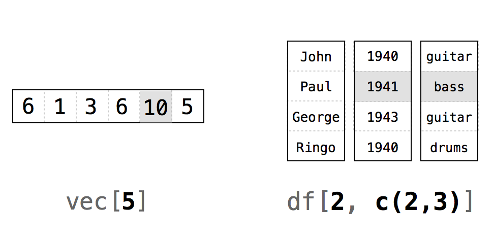
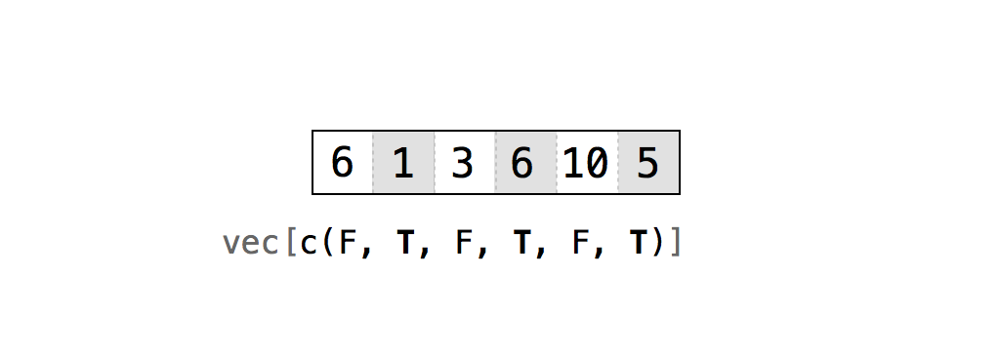
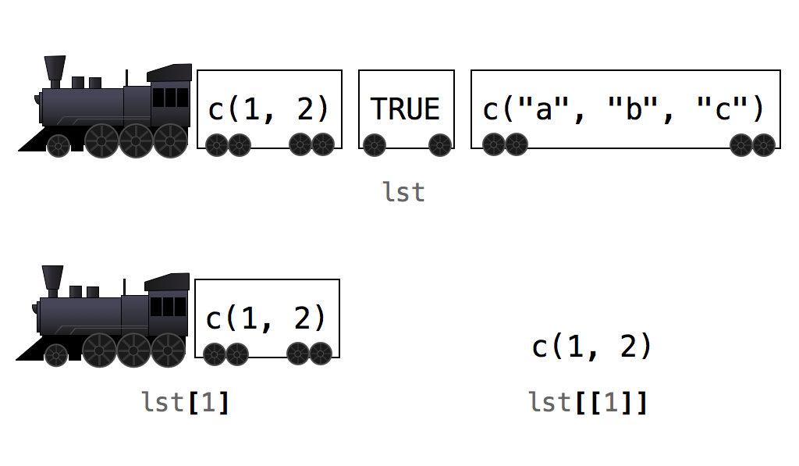

# R 语言表示法（R Notation）

2026-08-28⭐
@author Jiawei Mao
***
现在你已经有了一副扑克牌，接下来你需要一种方法来对它进行类似扑克牌的操作。首先，你希望时不时地重新洗牌（reshuffle）。其次，你希望从这副牌中发牌（deal cards）——每次发一张，并且只发最上面那张（我们可不是老千）。

为了完成这些操作，你需要对数据框中的单个值进行处理，这是数据科学中的一项核心任务。例如，要从牌堆顶部发一张牌，你需要编写一个函数来提取数据框中的第一行数据，就像这样：

```r
deal(deck)
##    face   suit value
## 1  king spades    13
```

你可以使用 R 语言的表示法系统（notation system）来提取 R 对象中的值。

## 1. 选择值

R 语言拥有一套表示法系统，允许你从 R 对象中选择值。要从数据框中提取一个或一组值，请在数据框的名称后加上一对方括号：

```r
deck[ , ]
```

在方括号内，需要输入两个由逗号分隔的索引（indexes）。这些索引会告诉 R 需要返回哪些值。R 会使用第一个索引来筛选（subset）数据框的行，使用第二个索引来筛选数据框的列。

在编写索引时，你有多种选择。R 语言共有六种不同的索引编写方式，每种方式的作用都略有不同：

1. 正整数（Positive integers）
2. 负整数（Negative integers）
3. 零（Zero）
4. 空白（Blank spaces）
5. 逻辑值（Logical values）
6. 名称（Names）

其中，最简单的一种就是使用正整数。

### 1.1 正整数

R 语言对正整数的处理方式与线性代数中的 `ij` 表示法完全相同：`deck[i, j]` 会返回 `deck` 中第 *i* 行、第 *j* 列的值，如图 6.1 所示。需要注意的是，这里的 *i* 和 *j* 只需要在数学意义上是整数即可。在 R 语言中，它们可以作为数值型（numerics）数据来保存：

```r
> head(deck)
   face   suit value
1  king spades    13
2 queen spades    12
3  jack spades    11
4   ten spades    10
5  nine spades     9
6 eight spades     8

> deck[1, 1] # 取第一行第一列的值，R 中索引从 1 开始
[1] "king"
```

要提取多个值，可以使用由正整数组成的向量。例如，你可以使用 `deck[1, c(1, 2, 3)]` 或 `deck[1, 1:3]` 来返回 `deck` 的第一行：

```r
> deck[1, c(1, 2, 3)]
  face   suit value
1 king spades    13
```

R 会返回 `deck` 中同时位于第一行以及第一、第二、第三列的值。请注意，R 不会从 `deck` 中删除这些值，而是提供原始值的副本。然后，你可以使用 R 的赋值运算符将这组新值保存为一个 R 对象：

```r
> deck[c(1, 1), c(1, 2, 3)]
    face   suit value
1   king spades    13
1.1 king spades    13
```

> [!TIP]
>
> **重复提取（Repetition）**
>
> 如果你在索引中重复输入了某个数字，R 会在你的“子集”中多次返回对应的值。以下代码将两次返回 `deck` 的第一行：
>
> ```r
> deck[c(1, 1), c(1, 2, 3)]
> ##     face  suit value
> ## 1   king spades    13
> ## 1.1 king spades    13
> ```



>  *图 6.1：R 语言使用线性代数中的 i,j表示法。图中的命令将返回被着色的值。*

该表示法系统并不局限于数据框。只要为对象的每个维度提供一个索引，你就可以使用相同的语法在任何 R 对象中提取值。例如，你可以使用单个索引来提取向量（一维对象）的子集：

```r
> vec <- c(6, 1, 3, 6, 10, 5)
> vec[1:3]
[1] 6 1 3
```

> [!TIP]
>
> **索引从 1 开始（Indexing begins at 1）**
>
> 在许多编程语言中，索引从 0 开始。这意味着 0 返回向量的第一个元素，1 返回第二个元素，依此类推。
>
> 但在 R 语言中并非如此。R 语言中的索引行为与线性代数中的索引完全一致，第一个元素的索引始终是 1。为什么 R 语言与众不同？也许是因为它是为数学家编写的。我们这些从线性代数课程中学到索引知识的人，反而常常纳闷为什么计算机程序员要从 0 开始计数。

> [!TIP]
>
> **`drop = FALSE`**
>
> 如果你从数据框中选择了两列或更多列，R 会返回一个新的数据框：
>
> ```r
> > deck[1:2, 1:2]
>    face   suit
> 1  king spades
> 2 queen spades
> ```
>
> 但是，如果你只选择了单列，R 会返回一个向量：
>
> ```r
> > deck[1:2, 1]
> [1] "king"  "queen"
> ```
>
> 如果你希望在这种情况下依然返回一个数据框，可以在方括号内添加可选参数 `drop = FALSE`：
>
> ```r
> > deck[1:2, 1, drop = FALSE]
>    face
> 1  king
> 2 queen
> ```
>
> 这种方法同样适用于从矩阵（matrix）或数组（array）中提取单列。

### 1.2 负整数

在使用负整数进行索引时，其作用与正整数相反。R 语言会返回除了负索引所包含的元素之外的所有元素。例如，`deck[-1, 1:3]` 将返回 `deck` 中除第一行之外的所有内容。而 `deck[-(2:52), 1:3]` 则会返回第一行（并排除其余所有内容）：

```r
> deck[-c(2:52), 1:3]
  face   suit value
1 king spades    13
```

若你需要保留数据框中的大多数行或列时，使用负整数进行提取比使用正整数更高效。

如果在同一个索引中同时混合使用负整数和正整数，R 语言会返回一个错误：

```r
deck[c(-1, 1), 1]
## Error in xj[i] : only 0's may be mixed with negative subscripts
```

不过，如果你在不同的索引中分别使用负整数和正整数（例如，在行索引中使用负整数，在列索引中使用正整数，如 `deck[-1, 1]`），则没问题。

### 1.3 零

如果使用零作为索引会发生什么？当使用零作为索引时，R 语言在该维度上不会返回任何内容，从而创建一个空对象：

```r
> deck[0, 0]
data frame with 0 columns and 0 rows
```

老实说，使用零进行索引并没有太大的实际用处。

### 1.4 空白

你可以使用空白（即什么都不写）来告诉 R 语言提取该维度上的所有值。这让你能够仅对对象的某一个维度进行子集提取，而不影响其他维度。这在从数据框中提取整行或整列时非常有用：

```r
> deck[1, ]
  face   suit value
1 king spades    13
```

### 1.5 逻辑值

如果你提供一个由 `TRUE` 和 `FALSE` 组成的向量作为索引，R 语言会将每一个 `TRUE` 和 `FALSE` 与数据框中的某一行（或某一列，具体取决于你将索引放在哪个位置）进行匹配。然后返回与 `TRUE` 相对应的每一行，如图 6.2 所示。

你可以这样想象：R 语言在逐行读取数据框时，会问自己：“我应该返回该数据结构的第 *i* 行吗？”然后它会去查看索引中第 *i* 个位置的值作为答案。为了让这个机制正常工作，你的向量长度必须与你想要提取子集的维度长度完全一致：

```r
> deck[1, c(TRUE, TRUE, FALSE)]
  face   suit
1 king spades

> rows <- c(TRUE, F, F, F, F, F, F, F, F, F, F, F, F, F, F, F, 
+           F, F, F, F, F, F, F, F, F, F, F, F, F, F, F, F, F, F, F, F, F, F, 
+           F, F, F, F, F, F, F, F, F, F, F, F, F, F)
> deck[rows, ]
  face   suit value
1 king spades    13
```



>  *图 6.2：你可以使用由 `TRUE` 和 `FALSE` 组成的向量，精确地告诉 R 你想要提取哪些值，以及不想要哪些值。图中的命令将仅返回数字 1、6 和 5。*

这种机制初看起来可能有些奇怪——谁会想手动输入这么多的 `TRUE` 和 `FALSE` 呢？——但在接下来的“修改值（Modifying Values）”一节中，你将体会到它强大的威力。

### 1.6 名称

最后，如果你的对象拥有名称（参见“Names”一节），你可以通过名称来提取所需的元素。这是提取数据框列的常用方法，因为数据框的列几乎总是有名称的：

```r
deck[1, c("face", "suit", "value")]
##   face  suit value
## 1 king spades    13

# 提取完整的 value 列
deck[ , "value"]
##  [1] 13 12 11 10  9  8  7  6  5  4  3  2  1 13 12 11 10  9  8
## [20]  7  6  5  4  3  2  1 13 12 11 10  9  8  7  6  5  4  3  2
## [39]  1 13 12 11 10  9  8  7  6  5  4  3  2  1
```

## 2. 发牌

现在你已经掌握了 R 语言表示法系统的基础知识，让我们将其付诸实践。

**练习 6.1（发牌）**：补全以下代码，编写一个能够返回数据框第一行的函数：

```r
deal <- function(cards) {
   # ?
}
```

**解答**：你可以使用前面提到的任何一种能返回数据框第一行的方法来编写 `deal` 函数。这里我使用正整数和空白，因为我认为它们最易于理解：

```r
deal <- function(cards) {
  cards[1, ]
}
```

这个函数完全实现了你的需求：它从数据集中发出顶部的牌。然而，如果你反复运行 `deal()`，这个函数就会显得有点“无趣”：

```r
> deal(deck)
  face   suit value
1 king spades    13

> deal(deck)
  face   suit value
1 king spades    13

> deal(deck)
  face   suit value
1 king spades    13
```

`deal()` 总是返回黑桃 K，因为 `deck` 并不知道我们已经把这张牌发出去了。因此，黑桃 K 依然留在原位，待在牌堆的最顶部，随时准备再次被发出。这是一个很难解决的问题，我们将在后面的“环境（Environments）”一节中处理它。在此期间，你可以通过每次发牌后都重新洗牌来解决这个问题。这样一来，牌堆顶部总是会出现一张新牌。

洗牌只是一种暂时的妥协方案：你的牌堆中出现的概率，与使用单副扑克牌玩游戏时的真实概率并不相符。例如，连续两次发出黑桃 K 的概率依然存在。不过，实际情况并没有看起来那么糟。为了防止算牌，大多数赌场在纸牌游戏中会同时使用五到六副牌。在那种情况下遇到的概率，与我们在这里模拟的概率是非常接近的。

## 3. 洗牌

在现实中洗牌时，你会随机重新排列扑克牌的顺序。在虚拟牌堆中，每张牌都是数据框中的一行。要洗牌，你需要随机重新排列数据框中的行。

我们先从提取数据框中的每一行开始：

```r
> deck2 <- deck[1:52,]
> head(deck2)
   face   suit value
1  king spades    13
2 queen spades    12
3  jack spades    11
4   ten spades    10
5  nine spades     9
6 eight spades     8
```

这里得到一个顺序完全相同的新数据框。如果你让 R 按照不同的顺序提取行呢？例如，你可以要求提取第 2 行，然后是第 1 行，接着是其余的牌：

```r
> deck3 <- deck[c(2, 1, 3:52), ]
> head(deck3)
   face   suit value
2 queen spades    12
1  king spades    13
3  jack spades    11
4   ten spades    10
5  nine spades     9
6 eight spades     8
```

R 会取回所有的行，并且按照你请求的顺序排列。如果你希望这些行以随机顺序出现，那么你需要将 1 到 52 的整数随机打乱，并将结果用作行索引。如何生成这样一个随机整数集合呢？使用我们亲切友好的 `sample()` 函数：

```r
> random <- sample(1:52, size = 52)
> random
 [1] 23 15  2 51 50  3 45 17 40 25 38 11 48 44 34 41 14 43 35 30  8 37 16
[24]  7  9 12 27 22  1 33 32  4 26 20 49 36  6 18 47 13 31 39 19 52 29 21
[47] 24 46  5 28 42 10

> deck4 <- deck[random, ]
> head(deck4)
    face   suit value
23  four  clubs     4
15 queen  clubs    12
2  queen spades    12
51   two hearts     2
50 three hearts     3
3   jack spades    11
```

现在，这组新数据真正被“洗”过了。只要将这些步骤封装成一个函数，你就大功告成了。

**练习 6.2（洗牌）**：利用前面的思路编写一个 `shuffle` 函数。`shuffle` 函数应该接收一个数据框，并返回一个被打乱顺序的数据框副本。

**解答**：你的 `shuffle` 函数应该如下所示：

```r
shuffle <- function(cards) {
  random <- sample(1:52, size = 52)
  cards[random, ]
}
```

现在你可以在每次发牌之间对你的牌进行洗牌了：

```r
> deal(deck)
  face   suit value
1 king spades    13

> deck2 <- shuffle(deck)

> deal(deck2)
  face   suit value
9 five spades     5
```

## 4. 美元符号与双括号

R 语言中有两类对象遵循一种可选的第二套表示法系统。你可以使用 `$` 语法从数据框和列表中提取值。作为一名 R 语言程序员，你会一次又一次地遇到 `$` 语法，因此让我们来研究一下它是如何工作的。

要从数据框中选择某一列，请写出数据框的名称和列名，中间用 `$` 隔开。注意，列名不需要加引号：

```r
> deck$value
 [1] 13 12 11 10  9  8  7  6  5  4  3  2  1 13 12 11 10  9  8  7  6  5  4
[24]  3  2  1 13 12 11 10  9  8  7  6  5  4  3  2  1 13 12 11 10  9  8  7
[47]  6  5  4  3  2  1
```

R 会将该列的所有值作为一个向量返回。这种 `$` 表示法极其有用，因为你通常会将数据集的变量存储为数据框的列。时不时地，你会希望对某个变量中的值运行诸如 `mean`（平均值）或 `median`（中位数）之类的函数。在 R 中，这些函数期望输入一个值向量，而 `deck$value` 恰好以正确的格式提供了你的数据：

```r
> mean(deck$value)
[1] 7

> median(deck$value)
[1] 7
```

如果列表中的元素有名称，你也可以对它们使用相同的 `$` 表示法。这种表示法在处理列表时同样具有优势。如果使用常规方法提取列表的子集，R 会返回一个包含所请求元素的新列表。即使你只请求了一个元素，也是如此。

为了看清这一点，我们先创建一个列表：

```r
> lst <- list(numbers = c(1, 2), logical = TRUE, strings = c("a", "b", "c"))
> lst
$numbers
[1] 1 2

$logical
[1] TRUE

$strings
[1] "a" "b" "c"
```

然后对其进行子集提取：

```r
> lst[1]
$numbers
[1] 1 2
```

结果是一个包含单个元素的较小列表。该元素是向量 `c(1, 2)`。这可能会让人感到烦恼，因为许多 R 语言函数无法处理列表。例如，`sum(lst[1])` 会返回一个错误。如果一旦将向量存储在列表中，你就只能将其作为列表取回，那将非常糟糕：

```r
> sum(lst[1])
Error in sum(lst[1]) : invalid 'type' (list) of argument
```

当你使用 `$` 表示法时，R 会原样返回选定的值，外面不会包裹任何列表结构：

```r
> lst$numbers
[1] 1 2
```

然后你可以将结果传递给函数：

```r
> sum(lst$numbers)
[1] 3
```

如果你的列表中的元素没有名称，你可以使用双括号 `[[]]` 来提取列表的子集。这种表示法与 `$` 表示法相同：

```r
> lst[[1]]
[1] 1 2
```

换句话说，如果使用单括号表示法提取列表的子集，R 会返回一个较小的列表。如果使用双括号表示法提取列表的子集，R 会仅返回该列表元素内部包含的值。你可以将此功能与 R 的任何索引方法结合使用：

```r
> lst["numbers"]
$numbers
[1] 1 2

> lst[["numbers"]]
[1] 1 2
```

这种差异很微妙但非常重要。在 R 社区中，有一种流行且有助于理解的方法（如图 6.3 所示）。想象每个列表都是一列火车，每个元素都是一节车厢。当你使用单括号时，R 会选中单独的车厢，并将它们作为一列新火车返回。每节车厢都保留了它的内容，但这些内容仍然在车厢内（即在一个列表中）。当你使用双括号时，R 实际上会“卸货”，把车厢里的内容直接交给你。



> *图 6.3：将列表想象成一列火车会很有帮助。使用单括号来选择车厢，使用双括号来选择车厢内的内容。* 

> [!WARNING]
>
> **切勿使用 `attach`**
>
> 在 R 语言的早期，人们在加载数据集后，很流行使用 `attach()` 函数。千万不要这么做！`attach()` 会重新创建一个类似于 Stata 和 SPSS 等其他统计应用程序所使用的计算环境，那些交叉使用的用户很喜欢这一点。然而，R 并不是 Stata 或 SPSS。R 针对其自身的计算环境进行了优化，运行 `attach()` 可能会导致某些 R 函数产生混淆。
>
> 那么 `attach()` 是做什么的呢？从表面上看，`attach()` 为你节省了打字的时间。如果你 `attach` 了 `deck` 数据集，你就可以直接通过名称来引用它的变量；你只需输入 `face`，而不必输入 `deck$face`。但打字并不是坏事。它给了你明确表达意图的机会，而在计算机编程中，明确是件好事。附加（attach）一个数据集会导致 R 混淆两个变量名称的可能性。如果这种情况发生在一个函数内部，你很可能会得到不可用的结果，并且 R 还会提供一个毫无帮助的错误信息来解释发生了什么。

既然你已经成为了从 R 中检索存储值的专家，让我们来总结一下你所取得的成就。

## 5. 总结

你已经学会了如何访问存储在 R 语言中的值。你可以提取数据框中值的副本，并将这些副本用于新的计算。

在接下来的“修改值（Modifying Values）”一节中，你将把这个系统向前推进一步，学习如何更改存储在数据框中的实际值。这些知识汇聚在一起，将赋予你一项特殊的能力：对数据的完全掌控。现在，你可以将数据存储在计算机中，随时提取单个值，并使用计算机对这些值执行准确的计算。

这听起来基础吗？也许确实如此，但它同样强大，是高效进行数据科学的必备基础。你不再需要把所有数据都记在脑子里，也不必担心心算出错。这种对数据的底层控制能力，也是编写更高效 R 程序的前提，而这正是项目 3（老虎机，Slot Machine）将要探讨的主题。