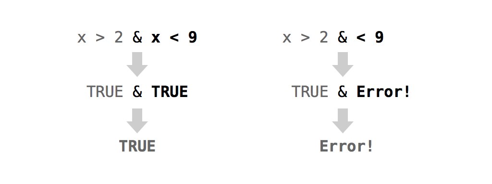

# 修改值

2026-08-28⭐
@author Jiawei Mao
***
准备好用你的虚拟扑克牌玩游戏了吗？别急！你的扑克牌当前的计分系统与许多纸牌游戏并不匹配。例如，在“战争（War）”和“扑克（Poker）”游戏中，A 的点数通常比 K 还要大，它的点数应该是 14，而不是 1。

在这个任务中，你将三次修改扑克牌的计分系统，以分别匹配三种不同的游戏：“战争（War）”、“红心大战（Hearts）”和“21点（Blackjack）”。这些游戏将分别教会你关于修改数据集内部值的不同知识。首先，请创建一个 `deck` 的副本以便进行操作。这样可以确保你始终保留一份原始的 `deck` 作为备份（以防操作出现差错）：

```R
deck2 <- deck
```

## 1. 原地修改值

你可以使用 R 语言的表示法系统来修改 R 对象内部的值。首先，描述你想要修改的值（或值集合）。然后，使用赋值运算符 `<-` 覆盖这些值。R 会直接更新原始对象中被选中的值。让我们通过一个实际的例子来演示：

```r
> vec <- c(0, 0, 0, 0, 0, 0)
> vec
[1] 0 0 0 0 0 0
```

选中 `vec` 中第一个值：

```r
> vec[1]
[1] 0
```

然后修改它：

```r
> vec[1] <- 1000
> vec
[1] 1000    0    0    0    0    0
```

只要新值的数量等于被选中值的数量，你就可以一次性替换多个值：

```r
> vec[c(1, 3, 5)] <- c(1, 1, 1)
> vec
[1] 1 0 1 0 1 0

> vec[4:6] <- vec[4:6] + 1
> vec
[1] 1 0 1 1 2 1
```

你还可以创建对象中尚不存在的值。R 会自动扩展对象以容纳这些新值：

```r
> vec[7] <- 0
> vec
[1] 1 0 1 1 2 1 0
```

这为向数据集中添加新变量提供了一种绝佳的方法：

```r
> deck2$new <- 1:52
> head(deck2)
   face   suit value new
1  king spades    13   1
2 queen spades    12   2
3  jack spades    11   3
4   ten spades    10   4
5  nine spades     9   5
6 eight spades     8   6
```

你还可以通过为列（或列表中的元素）赋值 `NULL` 将其从数据框中删除：

```r
> deck2$new <- NULL
> head(deck2)
   face   suit value
1  king spades    13
2 queen spades    12
3  jack spades    11
4   ten spades    10
5  nine spades     9
6 eight spades     8
```

在“战争（War）”游戏中，A 在所有牌中最高的点数，即 14。其余每张牌保留其在 `deck` 中已有的点数。要玩“战争”游戏，你只需要将 A 的点数从 1 改为 14。

只要你没有洗过牌，你就知道 A 的确切位置。它们每隔 13 张牌出现一次。因此，你可以使用 R 的表示法系统来定位它们：

```r
> deck2[c(13, 26, 39, 52),]
   face     suit value
13  ace   spades     1
26  ace    clubs     1
39  ace diamonds     1
52  ace   hearts     1
```

你可以通过对 `deck2` 的列维度进行子集提取，单独选中 A 的点数。或者直接对列向量 `deck2$value` 进行子集提取：

```r
> deck2[c(13, 26, 39, 52), 3] # 先选行，再选列
[1] 1 1 1 1

> deck2$value[c(13, 26, 39, 52)] # 先选列，再选行
[1] 1 1 1 1
```

现在，你只需将一组新值赋给这些旧值即可。新值集合的大小必须与你正在替换的旧值集合的大小相同。因此，你可以将 `c(14, 14, 14, 14)` 赋给 A 的值，或者只赋一个 `14`，依靠 R 的循环规则（recycling rules）将 `14` 自动扩展为 `c(14, 14, 14, 14)`：

```r
deck2$value[c(13, 26, 39, 52)] <- c(14, 14, 14, 14)

# 或者

deck2$value[c(13, 26, 39, 52)] <- 14
```

请注意，这些值是在原处直接修改的。你最终得到的不是 `deck2` 的修改版副本，而是新值直接出现在 `deck2` 内部：

```r
> head(deck2, 13)
    face   suit value
1   king spades    13
2  queen spades    12
3   jack spades    11
4    ten spades    10
5   nine spades     9
6  eight spades     8
7  seven spades     7
8    six spades     6
9   five spades     5
10  four spades     4
11 three spades     3
12   two spades     2
13   ace spades    14
```

无论你的数据是存储在向量、矩阵、数组、列表还是数据框中，该技术都适用。只需用 R 的表示法系统描述你想更改的值，然后使用 R 的赋值运算符覆盖这些值即可。

在这个例子中，操作之所以如此顺利，是因为你确切地知道每张 A 的位置。扑克牌是按顺序排列的，每隔 13 行就会出现一张 A。

但如果牌已经被洗过了呢？你可以逐一查看所有的牌并记下 A 的位置，但这太繁琐了。如果你的数据框更大，这甚至是不可能的：

```r
deck3 <- shuffle(deck)
```

现在 A 在哪里呢？

```r
head(deck3)
##     face     suit value
## 1  queen    clubs    12
## 2   king    clubs    13
## 3    ace   spades     1   # 一张 A
## 4   nine    clubs     9
## 5  seven   spades     7
## 6  queen diamonds    12
```

为什么不直接让 R 帮你找出 A 呢？你可以使用逻辑子集提取（logical subsetting）来实现。逻辑子集提取提供了一种对 R 对象进行定向提取和修改的方法，就像是在你自己的数据集中执行一场“搜索并替换”的任务。

## 2. 逻辑子集提取

你还记得 R 语言的逻辑索引系统（logicals）吗？你可以使用由 `TRUE` 和 `FALSE` 组成的向量来选择值。该向量的长度必须与你想要提取子集的维度长度相同。R 会返回与 `TRUE` 对应的所有元素：

```r
vec
## [1] 1 0 1 1 2 1 0

vec[c(FALSE, FALSE, FALSE, FALSE, TRUE, FALSE, FALSE)]
## [1] 2
```

乍一看，这似乎不太实用。谁会想手动输入一长串的 `TRUE` 和 `FALSE` 呢？没人会这么做。但你其实不必手动输入。你可以让逻辑测试（logical test）自动为你生成一个由 `TRUE` 和 `FALSE` 组成的向量。

### 2.1 逻辑测试

逻辑测试是一种比较操作，例如“1 小于 2 吗？”（`1 < 2`），或者“3 大于 4 吗？”（`3 > 4`）。R 语言提供了七个逻辑运算符供你进行比较，如表 7.1 所示。

**表 7.1：R 语言的逻辑运算符**

| 运算符 | 语法                | 测试内容                     |
| ------ | ------------------- | ---------------------------- |
| `>`    | `a > b`             | a 大于 b 吗？                |
| `>=`   | `a >= b`            | a 大于或等于 b 吗？          |
| `<`    | `a < b`             | a 小于 b 吗？                |
| `<=`   | `a <= b`            | a 小于或等于 b 吗？          |
| `==`   | `a == b`            | a 等于 b 吗？                |
| `!=`   | `a != b`            | a 不等于 b 吗？              |
| `%in%` | `a %in% c(a, b, c)` | a 在集合 `c(a, b, c)` 中吗？ |

每个运算符都会返回一个 `TRUE` 或 `FALSE`。如果你使用运算符来比较向量，R 会进行逐元素比较——就像它处理算术运算符一样：

```r
> 1 > 2
[1] FALSE

> 1 > c(0, 1, 2)
[1]  TRUE FALSE FALSE

> c(1, 2, 3) == c(3, 2, 1)
[1] FALSE  TRUE FALSE
```

`%in%` 是唯一一个不执行常规逐元素操作的运算符。`%in%` 用于测试左侧的值是否存在于右侧的向量中。如果你在左侧提供一个向量，`%in%` 不会将左侧和右侧的值一一配对并进行逐元素测试。相反，`%in%` 会独立测试左侧的每个值是否存在于右侧向量的某个位置：

```r
> 1 %in% c(3, 4, 5)
[1] FALSE

> c(1, 2) %in% c(3, 4, 5)
[1] FALSE FALSE

> c(1, 2, 3) %in% c(3, 4, 5)
[1] FALSE FALSE  TRUE

> c(1, 2, 3, 4) %in% c(3, 4, 5)
[1] FALSE FALSE  TRUE  TRUE
```

请注意，测试相等性时要使用双等号 `==`，而不是单等号 `=`。单等号是 `<-` 的另一种写法。人们很容易忘记这一点，误用 `a = b` 来测试 a 是否等于 b。此时 R 不会返回 `TRUE` 或 `FALSE`，因为它根本不需要这么做：a 确实会等于 b，因为你刚刚执行了等同于 `a <- b` 的赋值操作。

> [!WARNING]
>
> **`=` 是一个赋值运算符**
> 不要把 `=` 和 `==` 搞混。`=` 的作用与 `<-` 相同：它用于将一个值赋给一个对象。

你可以使用逻辑运算符比较任何两个 R 对象；不过，比较两个相同数据类型的对象时，逻辑运算符才最合理。如果你比较不同数据类型的对象，R 会使用其强制类型转换规则（coercion rules），在比较之前先将它们转换为相同的类型。

**练习 7.1（有多少张 A？）**：提取 `deck2` 的 `face` 列，并测试每个值是否等于 `"ace"`。作为挑战，请使用 R 快速统计等于 `"ace"` 的牌有多少张。

**解答**：你可以使用 R 的 `$` 表示法提取 `face` 列：

```r
deck2$face
##  [1] "king"  "queen" "jack"  "ten"   "nine"  "eight" "seven" "six"   "five" 
## [10] "four"  "three" "two"   "ace"   "king"  "queen" "jack"  "ten"   "nine" 
## [19] "eight" "seven" "six"   "five"  "four"  "three" "two"   "ace"   "king" 
## [28] "queen" "jack"  "ten"   "nine"  "eight" "seven" "six"   "five"  "four" 
## [37] "three" "two"   "ace"   "king"  "queen" "jack"  "ten"   "nine"  "eight"
## [46] "seven" "six"   "five"  "four"  "three" "two"   "ace"
```

接下来，你可以使用 `==` 运算符测试每个值是否等于 `"ace"`。在下面的代码中，R 会使用循环规则将 `deck2$face` 中的每个值与 `"ace"` 逐一进行比较。请注意，引号非常重要。如果省略引号，R 会尝试寻找一个名为 `ace` 的对象来与 `deck2$face` 进行比较：

```r
deck2$face == "ace"
##  [1] FALSE FALSE FALSE FALSE FALSE FALSE FALSE FALSE FALSE FALSE FALSE FALSE
## [13]  TRUE FALSE FALSE FALSE FALSE FALSE FALSE FALSE FALSE FALSE FALSE FALSE
## [25] FALSE FALSE FALSE FALSE FALSE FALSE FALSE  TRUE FALSE FALSE FALSE FALSE
## [37] FALSE FALSE FALSE FALSE FALSE FALSE FALSE FALSE FALSE FALSE FALSE FALSE
## [49] FALSE FALSE FALSE FALSE FALSE FALSE FALSE FALSE FALSE FALSE FALSE  TRUE
```

你可以使用 `sum()` 函数快速统计上一个向量中 `TRUE` 的数量。请记住，当你对逻辑值进行数学运算时，R 会将其强制转换为数值。R 会将 `TRUE` 转换为 1，将 `FALSE` 转换为 0。因此，`sum()` 会统计出 `TRUE` 的数量：

```r
sum(deck2$face == "ace")
## [1] 4
```

你可以使用这种方法来找出并修改牌堆中的 A——即使你已经洗过牌。首先，构建一个逻辑测试来识别洗牌后牌堆中的 A：

```r
deck3$face == "ace"
```

然后使用该测试单独选出 A 的点数。由于测试返回的是一个逻辑向量，你可以将其用作索引：

```r
deck3$value[deck3$face == "ace"]
## [1] 1 1 1 1
```

最后，使用赋值操作更改 `deck3` 中 A 的点数：

```r
deck3$value[deck3$face == "ace"] <- 14

head(deck3)
##    face     suit value
## 1 queen    clubs    12
## 2  king    clubs    13
## 3   ace   spades    14  # 一张 A
## 4  nine    clubs     9
## 5 seven   spades     7
## 6 queen diamonds    12
```

总结一下，你可以使用逻辑测试来选择对象内部的值。

逻辑子集提取是一项强大的技术，它能让你快速识别、提取和修改数据集中的单个值。使用逻辑子集提取时，你不需要知道某个值在数据集中的具体位置，只需要知道如何用逻辑测试来描述该值即可。

逻辑子集提取是 R 语言最擅长的事情之一，逻辑子集提取是向量化编程（vectorized programming）的关键组成部分。向量化编程是一种能让你编写快速、高效 R 代码的编程风格，我们将在后面的“速度（Speed）”一节中进行学习。

让我们将逻辑子集提取应用于一个新游戏：红心大战（Hearts）。在红心大战中，每张牌的点数都是 0：

```r
> deck4 <- deck
> deck4$value <- 0

> head(deck4, 13)
    face   suit value
1   king spades     0
2  queen spades     0
3   jack spades     0
4    ten spades     0
5   nine spades     0
6  eight spades     0
7  seven spades     0
8    six spades     0
9   five spades     0
10  four spades     0
11 three spades     0
12   two spades     0
13   ace spades     0
```

**练习 7.2（为红心大战计分）**：将 `deck4` 中所有红桃花色的牌的点数赋值为 1。

**解答**：为此，首先编写一个测试来识别红桃花色的牌：

```r
> deck4$suit == "hearts"
 [1] FALSE FALSE FALSE FALSE FALSE FALSE FALSE FALSE FALSE FALSE FALSE
[12] FALSE FALSE FALSE FALSE FALSE FALSE FALSE FALSE FALSE FALSE FALSE
[23] FALSE FALSE FALSE FALSE FALSE FALSE FALSE FALSE FALSE FALSE FALSE
[34] FALSE FALSE FALSE FALSE FALSE FALSE  TRUE  TRUE  TRUE  TRUE  TRUE
[45]  TRUE  TRUE  TRUE  TRUE  TRUE  TRUE  TRUE  TRUE
```

然后使用该测试来选中这些牌的点数：

```r
> deck4$value[deck4$suit == "hearts"]
 [1] 0 0 0 0 0 0 0 0 0 0 0 0 0
```

最后，为这些点数赋一个新值：

```r
deck4$value[deck4$suit == "hearts"] <- 1
```

现在，你所有的红桃牌都已更新：

```r
> deck4$value[deck4$suit == "hearts"]
 [1] 1 1 1 1 1 1 1 1 1 1 1 1 1
```

在红心大战中，黑桃 Q 的点数最为特殊：它值 13 分。更改它的点数看起来很简单，但令人惊讶的是，它很难被精准找到。你可以找出所有的 Q：

```r
> deck4[deck4$face == "queen", ]
    face     suit value
2  queen   spades     0
15 queen    clubs     0
28 queen diamonds     0
41 queen   hearts     1
```

但这多出了三张牌。另一方面，你可以找出所有的黑桃牌：

```r
> deck4[deck4$suit == "spades", ]
    face   suit value
1   king spades     0
2  queen spades     0
3   jack spades     0
4    ten spades     0
5   nine spades     0
6  eight spades     0
7  seven spades     0
8    six spades     0
9   five spades     0
10  four spades     0
11 three spades     0
12   two spades     0
13   ace spades     0
```

但这又多出了 12 张牌。你真正想要找出的，是同时满足“牌面等于 queen”且“花色等于 spades”的牌。此时可以使用布尔运算符（Boolean operator）来实现这一点。布尔运算符可以将多个逻辑测试组合成一个单一的测试。

### 2.2 布尔运算符

布尔运算符包括“与（`&`）”和“或（`|`）”等。它们将多个逻辑测试的结果合并为单个 `TRUE` 或 `FALSE`。R 语言有六个布尔运算符，如表 7.2 所示。

**表 7.2：布尔运算符**

| 运算符 | 语法                            | 测试内容                                           |
| ------ | ------------------------------- | -------------------------------------------------- |
| `&`    | `cond1 & cond2`                 | `cond1` 和 `cond2` 都为真吗？                      |
| `|`    | `cond1 | cond2`                 | `cond1` 和 `cond2` 中有一个或多个为真吗？          |
| `xor`  | `xor(cond1, cond2)`             | `cond1` 和 `cond2` 中有且仅有一个为真吗？          |
| `!`    | `!cond1`                        | `cond1` 为假吗？（例如，`!` 会反转逻辑测试的结果） |
| `any`  | `any(cond1, cond2, cond3, ...)` | 这些条件中有任何一个为真吗？                       |
| `all`  | `all(cond1, cond2, cond3, ...)` | 这些条件都为真吗？                                 |

要使用布尔运算符，请将其放在两个完整的逻辑测试之间。R 会先执行每个逻辑测试，然后使用布尔运算符将结果合并为一个单一的 `TRUE` 或 `FALSE`（如图 7.1 所示）。

> [!WARNING]
>
> **使用布尔运算符时最常见的错误**
>
> 很容易忘记在布尔运算符的两侧都放上完整的测试。在英语中，说“x 大于 2 且小于 9 吗？”很简洁。但在 R 中，你需要写出等价于“x 大于 2 吗，并且 x 小于 9 吗？”的完整表达。如图 7.1 所示。



>  *图 7.1：R 会分别计算布尔运算符两侧的表达式，然后将结果合并为一个单一的 `TRUE` 或 `FALSE`。如果你没有在运算符的两侧提供完整的测试，R 会返回一个错误。*

当与向量一起使用时，布尔运算符会遵循与算术和逻辑运算符相同的逐元素执行规则：

```r
> a <- c(1, 2, 3)
> b <- c(1, 2, 3)
> c <- c(1, 2, 4)

> a == b
[1] TRUE TRUE TRUE

> b == c
[1]  TRUE  TRUE FALSE

> a == b & b == c
[1]  TRUE  TRUE FALSE
```

现在可以测试每张牌是否既是 Q 又是黑桃。可以在 R 中这样编写这个测试：

```r
> deck4$face == "queen" & deck4$suit == "spades"
 [1] FALSE  TRUE FALSE FALSE FALSE FALSE FALSE FALSE FALSE FALSE FALSE
[12] FALSE FALSE FALSE FALSE FALSE FALSE FALSE FALSE FALSE FALSE FALSE
[23] FALSE FALSE FALSE FALSE FALSE FALSE FALSE FALSE FALSE FALSE FALSE
[34] FALSE FALSE FALSE FALSE FALSE FALSE FALSE FALSE FALSE FALSE FALSE
[45] FALSE FALSE FALSE FALSE FALSE FALSE FALSE FALSE
```

我将把这个测试结果保存到一个对象中。这样更容易操作：

```r
queenOfSpades <- deck4$face == "queen" & deck4$suit == "spades"
```

接下来，你可以使用该测试作为索引，来选中黑桃 Q 的点数。请确保该测试确实选中了正确的值：

```r
> deck4[queenOfSpades, ]
   face   suit value
2 queen spades     0

> deck4$value[queenOfSpades]
[1] 0
```

既然你已经找到了黑桃 Q，就可以更新它的点数了：

```r
> deck4$value[queenOfSpades] <- 13

> deck4[queenOfSpades, ]
   face   suit value
2 queen spades    13
```

现在，你的牌堆已经准备好可以玩红心大战了。

**练习 7.3（测试练习）**：请将以下句子转换为使用 R 代码编写的测试。为了帮助你，我在句子之后定义了一些 R 对象，你可以用它们来测试你的答案：

1. w 是正数吗？
2. x 大于 10 且小于 20 吗？
3. 对象 y 是单词 "February" 吗？
4. z 中的每个值都是星期几吗？

```r
w <- c(-1, 0, 1)
x <- c(5, 15)
y <- "February"
z <- c("Monday", "Tuesday", "Friday")
```

**解答**：以下是一些参考答案。如果你卡住了，请务必重新阅读 R 语言如何计算使用布尔值的逻辑测试：

```r
> w <- c(-1, 0, 1)
> w > 0
[1] FALSE FALSE  TRUE

> x <- c(5, 15)
> x > 10 & x < 20
[1] FALSE  TRUE

> y <- "February"
> y == "February"
[1] TRUE

> z <- c("Monday", "Tuesday", "Friday")
> all(z %in% c("Monday", "Tuesday", "Wednesday", "Thursday", "Friday", 
+              "Saturday", "Sunday"))
[1] TRUE
```

让我们再考虑最后一个游戏：21点（Blackjack）。在 21 点中，每张数字牌的点数等于其牌面数字。每张人头牌（K、Q 或 J）的点数为 10。最后，每张 A 的点数为 11 或 1，具体取决于游戏的最终结果。

让我们从一份全新的 `deck` 副本开始——这样数字牌（2 到 10）一开始就会拥有正确的点数：

```r
> deck5 <- deck
> head(deck5, 13)
    face   suit value
1   king spades    13
2  queen spades    12
3   jack spades    11
4    ten spades    10
5   nine spades     9
6  eight spades     8
7  seven spades     7
8    six spades     6
9   five spades     5
10  four spades     4
11 three spades     3
12   two spades     2
13   ace spades     1
```

你可以使用 `%in%` 一次性更改所有人头牌的点数：

```r
> facecard <- deck5$face %in% c("king", "queen", "jack")

> deck5[facecard, ]
    face     suit value
1   king   spades    13
2  queen   spades    12
3   jack   spades    11
14  king    clubs    13
15 queen    clubs    12
16  jack    clubs    11
27  king diamonds    13
28 queen diamonds    12
29  jack diamonds    11
40  king   hearts    13
41 queen   hearts    12
42  jack   hearts    11

> deck5$value[facecard] <- 10
> head(deck5, 10)
    face   suit value
1   king spades    10
2  queen spades    10
3   jack spades    10
4    ten spades    10
5   nine spades     9
6  eight spades     8
7  seven spades     7
8    six spades     6
9   five spades     5
10  four spades     4
```

现在你只需要修正 A 的点数——或者你真的需要吗？很难决定给 A 赋予什么点数，因为它的实际点数会随着每一局游戏而变化。在每一局结束时，如果玩家手中牌的总和不超过 21，A 就等于 11；否则，A 就等于 1。A 的实际点数取决于玩家手中的其他牌。这是一个信息缺失的情况。目前，你没有足够的信息为 A 赋予正确的点数。

## 3. 缺失信息

缺失信息问题在数据科学中非常常见。通常，它们的原因很直接：你不知道某个值，是因为测量数据丢失、损坏，或者一开始就没有进行测量。R 语言提供了一种专门的方法来帮你处理这些缺失值。

`NA` 是 R 语言中的一个特殊符号。它代表“不可用（Not Available）”，可以作为缺失信息的占位符。R 会完全按照你期望的方式来处理 `NA`。例如，如果你将 1 加上一个缺失信息，你期望得到什么结果？

```r
1 + NA
## [1] NA
```

R 会返回另一个缺失信息。说 `1 + NA = 1` 是不正确的，因为缺失的那个量很有可能是非零的。你没有足够的信息来确定计算结果。

如果你测试一个缺失信息是否等于 1 呢？

```r
NA == 1
## [1] NA
```

同样，你的答案会是类似“我不知道它是否等于 1”，也就是 `NA`。通常，只要你在 R 的操作或函数中使用了 `NA`，它就会一直传播下去。这可以防止你基于缺失数据得出错误的结论。

### 3.1 `na.rm` 参数

缺失值虽然能帮你处理数据集中的空缺，但有时也会带来一些令人头疼的问题。例如，假设你收集了 1,000 个观测值，并希望使用 R 语言的 `mean()` 函数计算它们的平均值。如果其中哪怕只有一个值是 `NA`，你的计算结果也会是 `NA`：

```r
c(NA, 1:50)
##  [1] NA  1  2  3  4  5  6  7  8  9 10 11 12 13 14 15 16 17 18 19 20 21 22
## [24] 23 24 25 26 27 28 29 30 31 32 33 34 35 36 37 38 39 40 41 42 43 44 45
## [47] 46 47 48 49 50

mean(c(NA, 1:50))
## [1] NA
```

你可能希望函数有不同的表现。大多数 R 语言函数都带有一个可选参数 `na.rm`，它的全称是“NA remove”（移除 NA）。如果你在函数中添加 `na.rm = TRUE` 参数，R 在执行该函数时就会忽略 `NA`：

```r
mean(c(NA, 1:50), na.rm = TRUE)
## [1] 25.5
```

### 3.2 `is.na()` 函数

有时，你可能想通过逻辑测试找出数据集中的 `NA`，该怎么做呢？如果某个值是缺失的，任何使用该值的逻辑测试都会返回一个缺失值，甚至连下面这个测试也不例外：

```r
NA == NA
## [1] NA
```

这意味着，像这样的测试无法帮你找出缺失值：

```r
c(1, 2, 3, NA) == NA
## [1] NA NA NA NA
```

但不必过于担心，R 提供了一个专门的函数，用于测试某个值是否为 `NA`。这个函数的命名非常直观，叫作 `is.na()`：

```r
is.na(NA)
## [1] TRUE

vec <- c(1, 2, 3, NA)
is.na(vec)
## [1] FALSE FALSE FALSE  TRUE
```

让我们把牌堆中所有 A 的点数都设置为 `NA`。这样做有两个好处：首先，它会提醒你，目前还不知道每张 A 的最终点数；其次，它可以防止你在确定 A 的最终点数之前，不小心对包含 A 的手牌进行计分。

你可以像将点数设置为数字一样，将 A 的点数设置为 `NA`：

```r
> deck5$value[deck5$face == "ace"] <- NA
> head(deck5, 13)
    face   suit value
1   king spades    10
2  queen spades    10
3   jack spades    10
4    ten spades    10
5   nine spades     9
6  eight spades     8
7  seven spades     7
8    six spades     6
9   five spades     5
10  four spades     4
11 three spades     3
12   two spades     2
13   ace spades    NA
```

恭喜！现在，你的牌已经准备好可以玩 21 点了。

## 4. 总结

当你将 R 语言的表示法语法与赋值运算符 `<-` 结合使用时，就可以直接在 R 对象内部原地修改值。这让你能够更新数据并清洗数据集。

在处理大型数据集时，修改和检索值会带来一个额外的逻辑难题：你该如何在数据中搜索并找到想要修改或检索的值呢？作为 R 语言用户，你可以使用逻辑子集提取来解决这个问题。你可以使用逻辑运算符和布尔运算符创建一个逻辑测试，然后将该测试作为 R 语言方括号表示法中的索引。即使你不知道这些值的具体位置，R 也会帮你找出你想要的值。

作为一名 R 语言程序员，检索单个值并不是你唯一需要关心的问题。你还需要检索整个数据集本身；例如，你可能需要在函数中调用某个数据集。接下来的“环境（Environments）”一节将教你 R 语言是如何在其环境系统中查找和保存数据集及其他 R 对象的。然后，你将利用这些知识来修复发牌（deal）和洗牌（shuffle）函数。