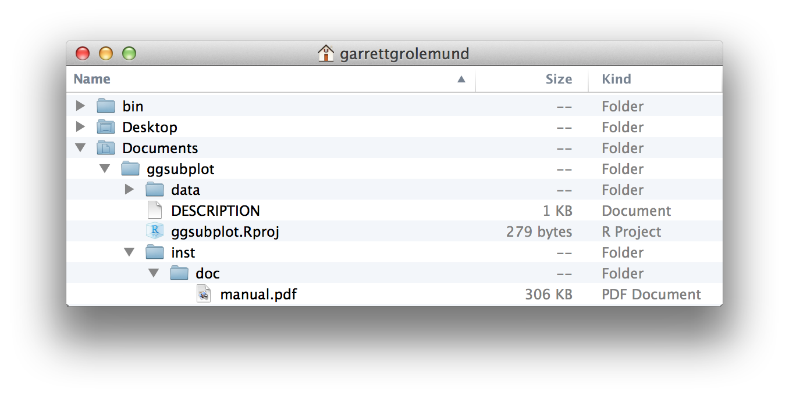
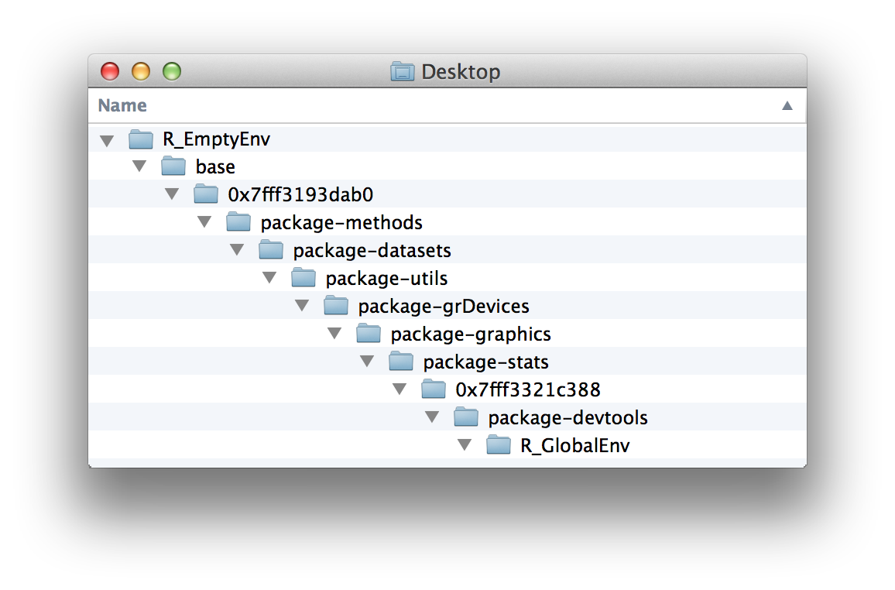
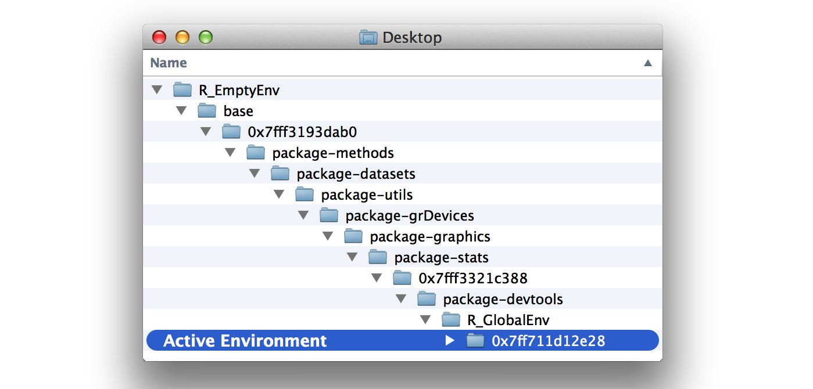
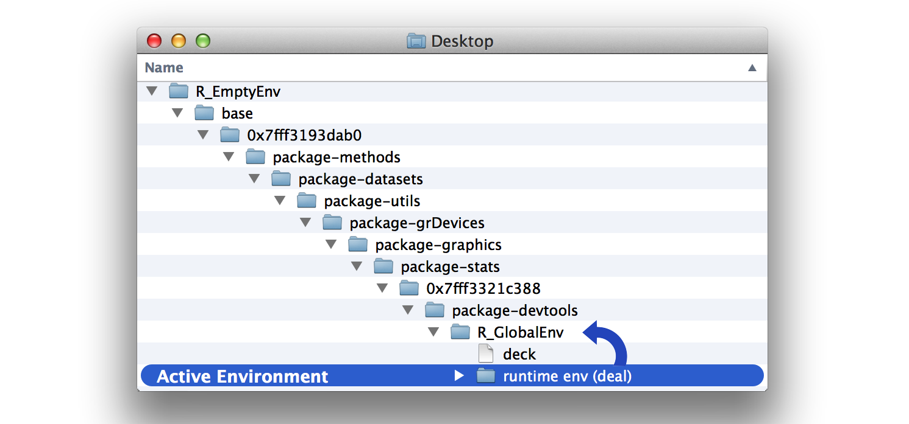
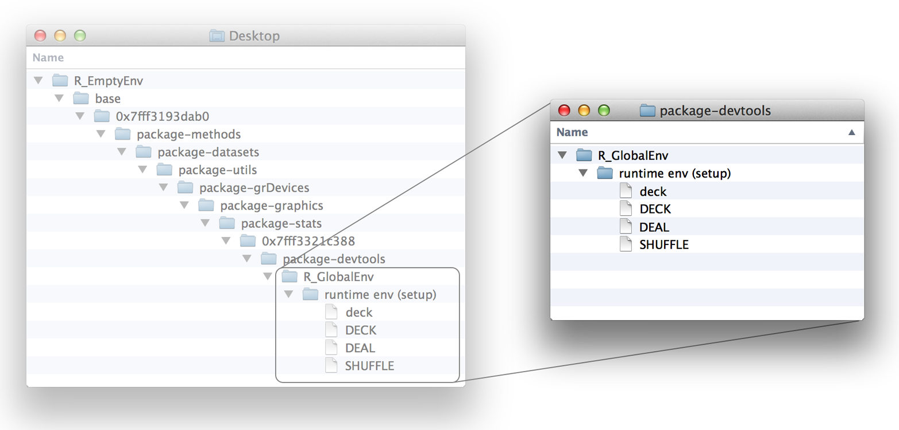
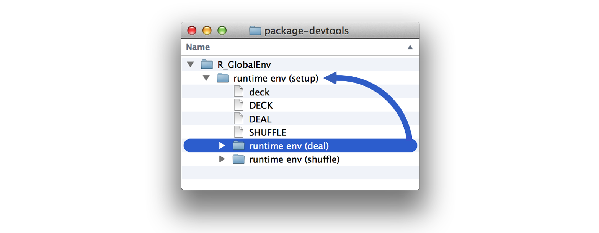
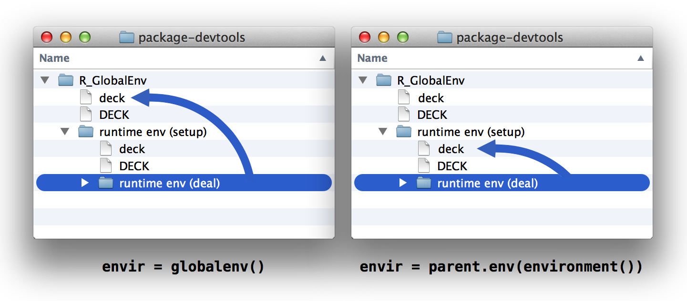

# 环境

2026-08-28⭐
@author Jiawei Mao
***
你的牌堆现在已经准备好可以玩 21 点（或红心大战、战争）了，但你的洗牌（shuffle）和发牌（deal）函数达到标准了吗？绝对没有。例如，`deal` 函数会反反复复发出同一张牌：

```r
deal(deck)
##   face   suit value
## 1 king spades    13

deal(deck)
##   face   suit value
## 1 king spades    13

deal(deck)
##   face   suit value
## 1 king spades    13
```

而且，`shuffle` 函数实际上并没有对 `deck` 进行洗牌（它只是返回了一个被洗过牌的 `deck` 副本）。简而言之，这两个函数虽然都在使用 `deck`，但都没有真正去修改 `deck`。

要修复这些函数，你需要了解 R 语言是如何存储、查找和修改像 `deck` 这样的对象的。R 语言是借助一套环境系统（environment system）来完成所有这些操作的。

## 1. 环境

请稍微设想一下你的电脑是如何存储文件的。每个文件都保存在某个文件夹中，而该文件夹又保存在另一个文件夹里，这就形成了一个分层的文件系统。如果你的电脑想要打开一个文件，它必须首先在这个文件系统中查找该文件。

你可以通过打开文件资源管理器（或 Finder 窗口）来查看你的文件系统。例如，图 8.1 展示了我的电脑上的部分文件系统。我有大量的文件夹。在其中一个文件夹内，有一个名为 `Documents` 的子文件夹；在这个子文件夹内，有一个名为 `ggsubplot` 的孙文件夹；再往里是一个名为 `inst` 的文件夹；接着是一个名为 `doc` 的文件夹；最里面是一个名为 `manual.pdf` 的文件。



>  *图 8.1：你的电脑将文件组织成文件夹和子文件夹的层级结构。要查看某个文件，你需要找到它在文件系统中的保存位置。*

R 语言使用类似的系统来保存 R 对象。每个对象都保存在一个环境（environment）中，环境是一种类似列表的对象，其作用类似于电脑上的文件夹。每个环境都连接到一个父环境（parent environment），即一个更高级别的环境，这就创建了一个环境的分层结构。

你可以使用 `pryr` 包中的 `parenvs()` 函数来查看 R 的环境系统（注：本书首次出版时，`parenvs()` 函数包含在 `pryr` 包中）。`parenvs(all = TRUE)` 会返回你的 R 会话正在使用的环境列表。实际的输出会因你加载的包不同而在各个会话之间有所差异。以下是我当前会话的输出：

```r
library(pryr)
parenvs(all = TRUE)
##    label                            name               
## 1  <environment: R_GlobalEnv>       ""                 
## 2  <environment: package:pryr>      "package:pryr"     
## 3  <environment: 0x7fff3321c388>    "tools:rstudio"    
## 4  <environment: package:stats>     "package:stats"    
## 5  <environment: package:graphics>  "package:graphics" 
## 6  <environment: package:grDevices> "package:grDevices"
## 7  <environment: package:utils>     "package:utils"    
## 8  <environment: package:datasets>  "package:datasets" 
## 9  <environment: package:methods>   "package:methods"  
## 10 <environment: 0x7fff3193dab0>    "Autoloads"        
## 11 <environment: base>              ""                 
## 12 <environment: R_EmptyEnv>        ""                 
```

> [!WARNING]
>
> `pryr` 已经弃用啦，可以改用 `rlang`。

要解读这段输出需要发挥一点想象力，所以让我们把这些环境可视化为一个文件夹系统，如图 8.2 所示。你可以这样理解这棵环境树：最底层的环境名为 `R_GlobalEnv`，它保存在名为 `package:pryr` 的环境中；`package:pryr` 又保存在名为 `0x7fff3321c388` 的环境中，依此类推，直到到达最终的、最高级别的环境 `R_EmptyEnv`。`R_EmptyEnv` 是唯一一个没有父环境的 R 环境。



>  *图 8.2：R 语言将 R 对象存储在一棵环境树中，该环境树类似于你电脑上的文件夹系统。*

请记住，这个例子只是一个比喻。R 的环境存在于你的内存（RAM）中，而不是文件系统中。此外，严格来说，R 的环境并不是“嵌套保存”在彼此内部的。每个环境只是连接到一个父环境，这使得向上搜索 R 的环境树变得很容易。但这种连接是单向的：你无法通过查看某个环境来知道它的“子环境”是什么。因此，你无法向下搜索 R 的环境树。不过在其他方面，R 的环境系统运作起来与文件系统非常相似。

## 2. 使用环境

R 语言自带了一些辅助函数，你可以用它们来探索你的环境树。首先，你可以使用 `as.environment()` 来引用环境树中的任何环境。`as.environment()` 接收一个环境名称（以字符串形式），并返回相应的环境对象：

```r
> as.environment("package:stats")
<environment: package:stats>
attr(,"name")
[1] "package:stats"
attr(,"path")
[1] "C:/Program Files/R/R-4.6.1/library/stats"
```

你的环境树中有三个环境自带专属的访问函数。它们分别是全局环境（`R_GlobalEnv`）、基础环境（`base`）和空环境（`R_EmptyEnv`）。你可以使用以下函数来引用它们：

```r
> globalenv()
<environment: R_GlobalEnv>

> baseenv()
<environment: base>

> emptyenv()
<environment: R_EmptyEnv>
```

接下来，你可以使用 `parent.env()` 来查找某个环境的父环境：

```r
> parent.env(globalenv())
<environment: package:rlang>
attr(,"name")
[1] "package:rlang"
attr(,"path")
[1] "C:/Users/jiawe/AppData/Local/R/win-library/4.6/rlang"
```

请注意，空环境是唯一一个没有父环境的 R 环境：

```r
> parent.env(emptyenv())
Error in parent.env(emptyenv()) : the empty environment has no parent
```

你可以使用 `ls()` 或 `ls.str()` 来查看保存在某个环境中的对象。`ls()` 仅返回对象的名称，而 `ls.str()` 则会显示每个对象的一些结构信息：

```r
ls(emptyenv())
## character(0)

ls(globalenv())
##  [1] "deal"    "deck"    "deck2"   "deck3"   "deck4"   "deck5"  
##  [7] "die"     "gender"  "hand"    "lst"     "mat"     "mil"    
## [13] "new"     "now"     "shuffle" "vec"
```

不出所料，空环境是空的；基础环境包含的对象太多，这里无法一一列出；而全局环境里则有一些熟悉的面孔。R 将你迄今为止创建的所有对象都保存在这里。

> [!TIP]
>
> *RStudio 的环境面板会显示全局环境中的所有对象。*

你可以使用 R 的 `$` 语法来访问特定环境中的对象。例如，你可以从全局环境中访问 `deck`：

```r
head(globalenv()$deck, 3)
##    face   suit value
## 1  king spades    13
## 2 queen spades    12
## 3  jack spades    11
```

此外，你还可以使用 `assign()` 函数将对象保存到特定的环境中。首先，给 `assign()` 提供新对象的名称（以字符串形式）；然后提供新对象的值；最后指定保存该对象的环境：

```r
assign("new", "Hello Global", envir = globalenv())

globalenv()$new
## [1] "Hello Global"
```

请注意，`assign()` 的作用类似于 `<-`。如果指定环境中已经存在同名对象，`assign()` 会直接覆盖它，而不会请求许可。这使得 `assign()` 在更新对象时非常有用，但也可能带来数据被意外覆盖的风险。

既然你已经学会了如何探索 R 的环境树，接下来让我们看看 R 是如何使用它的。R 与环境树紧密配合，以查找对象、存储对象和评估函数。R 在执行这些任务时的具体方式，将取决于当前的活动环境（active environment）。

### 2.1 活动环境

在任何时刻，R 都在与某一个特定的环境紧密配合。R 会将你创建的新对象存储在这个环境中，并且当你调用已有对象时，R 也会将这个环境作为查找的起点。这个特殊的环境称为“活动环境（active environment）”。活动环境通常是全局环境（global environment），但当你运行函数时，它可能会发生改变。

你可以使用 `environment()` 函数来查看当前的活动环境：

```r
environment()
## <environment: R_GlobalEnv>
```

全局环境在 R 语言中扮演着特殊的角色。它是你在命令行（console）中运行的每条命令的活动环境。因此，你在命令行中创建的任何对象都会被保存在全局环境中。你可以把全局环境理解为你的用户工作区（user workspace）。

当你在命令行中调用某个对象时，R 会首先在全局环境中查找它。但如果该对象不在这里呢？在这种情况下，R 会遵循一系列规则去查找该对象。

## 3. 作用域规则

R 遵循一套特殊的规则来查找对象。这些规则被称为 R 的作用域规则（scoping rules），你之前已经接触过其中几条了：

1. R 会在当前的活动环境中查找对象。
2. 当你在命令行中工作时，活动环境就是全局环境。因此，R 会在全局环境中查找你在命令行里调用的对象。

下面介绍第三条规则，它解释了当对象不在活动环境中时，R 是如何找到它们的：

3. 当 R 在某个环境中找不到某个对象时，它会去该环境的父环境中查找，接着是父环境的父环境，依此类推，直到找到该对象或到达空环境为止。

因此，如果你在命令行中调用一个对象，R 会首先在全局环境中查找它。如果在那里找不到，R 就会去全局环境的父环境中查找，接着是父环境的父环境，依此类推，沿着环境树向上搜索，直到找到该对象为止，如图 8.3 所示。如果 R 在任何环境中都找不到该对象，它会返回一个“找不到对象（object is not found）”的错误提示。


>  *图 8.3：R 会在活动环境（此处为全局环境）中按名称搜索对象。如果在那里找不到，它就会在活动环境的父环境中搜索，接着是父环境的父环境，依此类推，直到找到该对象或遍历完所有环境为止。*

> [!TIP]
>
> 函数也是 R 中的一种对象。R 存储和查找函数的方式与存储和查找其他对象的方式相同，都是通过在环境树中按名称进行搜索。

## 4. 赋值

当你给一个对象赋值时，R 会将该值以对象的名称保存在当前的活动环境中。如果活动环境中已经存在同名对象，R 会将其覆盖。

例如，全局环境中已经存在一个名为 `new` 的对象：

```r
new
## [1] "Hello Global"
```

你可以通过以下命令将一个新的 `new` 对象保存到全局环境中。覆盖掉旧的对象：

```r
new <- "Hello Active"

new
## [1] "Hello Active"
```

这种机制在 R 运行函数时带来了一个难题。许多函数在执行任务时，需要保存一些临时对象。例如，在“项目 1：加权骰子”中，`roll` 函数就保存了一个名为 `die` 的对象和一个名为 `dice` 的对象：

```r
roll <- function() {
  die <- 1:6
  dice <- sample(die, size = 2, replace = TRUE)
  sum(dice)
}
```

R 必须将这些临时对象保存在活动环境中；但如果这么做，它可能会覆盖掉你已有的对象。函数作者无法提前预知你的活动环境中已经存在哪些名称。那么 R 是如何避免这种风险的呢？答案是：每次 R 运行函数时，都会创建一个全新的活动环境来执行该函数。

## 5. 函数求值

R 每次对函数进行求值，都会创建一个新的环境。R 在运行该函数时，会将这个新环境作为活动环境；运行结束后，R 会带着函数的返回值，重新回到调用该函数的环境。我们将这些新环境称为“运行时环境（runtime environments）”，因为它们是 R 在程序运行时为了执行函数而临时创建的。

接下来，我们将使用以下函数来探索 R 的运行时环境。我们想知道这些环境具体是什么样的：它们的父环境是什么？它们内部包含了哪些对象？为此，我们设计了 `show_env` 函数来告诉我们答案：

```R
show_env <- function() {
  list(
    ran.in = environment(),
    parent = parent.env(environment()),
    objects = ls.str(environment())
  )
}
```

`show_env` 本身也是一个函数，因此当我们调用 `show_env()` 时，R 会创建一个运行时环境来执行该函数。`show_env` 的运行结果会告诉我们这个运行时环境的名称、它的父环境，以及该运行时环境中包含了哪些对象：

```R
show_env()
## $ran.in
## <environment: 0x7ff711d12e28>
## 
## $parent
## <environment: R_GlobalEnv>
## 
## $objects
```

运行结果显示，R 创建了一个名为 `0x7ff711d12e28` 的新环境来运行 `show_env()`。这个环境内部没有任何对象，它的父环境是全局环境。因此，在运行 `show_env` 时，R 的环境树结构如图 8.4 所示。

让我们再次运行 `show_env`：

```r
show_env()
## $ran.in
## <environment: 0x7ff715f49808>
## 
## $parent
## <environment: R_GlobalEnv>
## 
## $objects
```

这一次，`show_env` 在一个新的环境 `0x7ff715f49808` 中运行。每次你运行一个函数时，R 都会创建一个新环境。环境 `0x7ff715f49808` 看起来和环境 `0x7ff711d12e28` 完全一样：它也是空的，并且同样以全局环境作为其父环境。



>  *图 8.4：R 会创建一个新环境来运行 `show_env`。这个新环境是全局环境的子环境。*

现在，我们来探讨一下 R 将使用哪个环境作为运行时环境的父环境。

R 会将函数的运行时环境连接到该函数最初被创建时所在的环境中。这个环境在函数的生命周期中扮演着重要的角色——因为该函数所有的运行时环境都会将它作为父环境。我们将这个环境称为“起源环境（origin environment）”。你可以通过对函数运行 `environment()` 来查找函数的起源环境：

```r
environment(show_env)
## <environment: R_GlobalEnv>
```

`show_env` 的起源环境是全局环境，因为我们是在命令行中创建它的，但起源环境并不一定非得是全局环境。例如，`parenvs` 函数的环境就是 `pryr` 包：

```r
environment(parenvs)
## <environment: namespace:pryr>
```

换句话说，运行时环境的父环境并不总是全局环境，而是该函数最初被创建时所在的那个环境。

最后，让我们看看运行时环境中包含的对象。目前，`show_env` 的运行时环境中没有包含任何对象，但这很容易解决。只需让 `show_env` 在其代码主体中创建一些对象即可。R 会将 `show_env` 创建的任何对象都存储在它的运行时环境中。为什么呢？因为在创建这些对象时，运行时环境正是当前的活动环境：

```r
show_env <- function() {
  a <- 1
  b <- 2
  c <- 3
  list(
    ran.in = environment(),
    parent = parent.env(environment()),
    objects = ls.str(environment())
  )
}
```

再次运行 `show_env` 时，R 将 `a`、`b` 和 `c` 存储在了运行时环境中：

```R
> show_env()
$ran.in
<environment: 0x000001bdba059bb0>

$parent
<environment: R_GlobalEnv>

$objects
a :  num 1
b :  num 2
c :  num 3
```

这就是 R 确保函数不会覆盖它不该覆盖的内容的方法。函数创建的任何对象都被存储在一个安全、独立的运行时环境中。

R 还会将第二类对象放入运行时环境中。如果一个函数有参数，R 会将每个参数复制到运行时环境中。该参数会作为一个对象出现，其名称是参数名，而值则是用户为该参数提供的任何输入。这确保了函数能够找到并使用它的每个参数：

```r
foo <- "take me to your runtime"

show_env <- function(x = foo){
  list(ran.in = environment(), 
    parent = parent.env(environment()), 
    objects = ls.str(environment()))
}

show_env()
## $ran.in
## <environment: 0x7ff712398958>
## 
## $parent
## <environment: R_GlobalEnv>
## 
## $objects
## x :  chr "take me to your runtime"
```

现在我们把所有这些整合起来，看看 R 是如何对一个函数进行求值的。在你调用一个函数之前，R 正在一个活动环境中工作；我们称这个环境为**调用环境**（calling environment）。它就是 R 调用该函数时所处的环境。

然后你调用了这个函数。R 设置一个新的运行时环境。这个环境将是函数**起源环境**（origin environment）的子环境。R 会将函数的每个参数都复制到运行时环境中，然后将这个运行时环境设为新的活动环境。

接下来，R 运行函数主体中的代码。如果代码创建了任何对象，R 会将它们存储在活动的（即运行时）环境中。如果代码调用了任何对象，R 会使用其作用域规则来查找它们。R 会先搜索运行时环境，然后是运行时环境的父环境（也就是起源环境），接着是起源环境的父环境，依此类推。请注意，调用环境可能不在这个搜索路径上。通常，一个函数只会调用它的参数，而 R 可以在活动的运行时环境中找到这些参数。

最后，R 完成了函数的运行。它将活动环境切换回调用环境。现在 R 执行调用该函数的那行代码中的其他命令。所以，如果你用 `<-` 将函数的结果保存到一个对象中，这个新对象将被存储在调用环境中。

总结一下，R 将其对象存储在一个环境系统中。在任何时刻，R 都与一个单一的活动环境紧密协作。它将新对象存储在这个环境中，并在搜索对象时，将这个环境作为起点。R 的活动环境通常是全局环境，但 R 会调整活动环境，以安全地执行诸如运行函数之类的操作。

你如何利用这些知识来修复 `deal` 和 `shuffle` 函数呢？

首先，让我们从一个热身问题开始。假设我在命令行中这样重新定义 `deal`：

```r
deal <- function() {
  deck[1, ]
}
```

请注意，`deal` 不再接受参数，并且它调用了 `deck` 对象，该对象存在于全局环境中。

**练习 8.1 (`deal` 能工作吗？)** 当我调用新版本的 `deal`（例如 `deal()`）时，R 能找到 `deck` 并返回一个答案吗？

**解答**：可以。`deal` 仍然会和以前一样工作。R 会在一个作为全局环境子环境的运行时环境中运行 `deal`。为什么它会是全局环境的子环境？因为全局环境是 `deal` 的起源环境（我们在全局环境中定义了 `deal`）：

```r
environment(deal)
## <environment: R_GlobalEnv>
```

当 `deal` 调用 `deck` 时，R 需要查找 `deck` 对象。R 的作用域规则会引导它找到全局环境中的 `deck` 版本，如图 8.5 所示。因此，`deal` 如预期一样工作：

```r
deal()
##  face   suit value
##  king spades    13
```



>  *图 8.5：R 通过在 `deal` 的运行时环境的父环境中查找来找到 `deck`。这个父环境就是全局环境，即 `deal` 的起源环境。在这里，R 找到了 `deck` 的副本。*

现在让我们修复 `deal` 函数，以移除它已经发出去的牌。回想一下，`deal` 返回 `deck` 的顶牌，但并没有从 `deck` 中移除这张牌。因此，`deal` 总是返回同一张牌：

```r
deal()
##  face   suit value
##  king spades    13

deal()
##  face   suit value
##  king spades    13
```

你掌握的 R 语法足以移除 `deck` 的顶牌。以下代码将保存 `deck` 的一个原始副本，然后移除顶牌：

```r
DECK <- deck

deck <- deck[-1, ]

head(deck, 3)
##  face   suit value
## queen spades    12
##  jack spades    11
##   ten spades    10
```

现在让我们把代码添加到 `deal` 中。这里的 `deal` 保存（然后返回）`deck` 的顶牌。在这之间，它从 `deck` 中移除了这张牌……或者说它真的移除了吗？

```r
deal <- function() {
  card <- deck[1, ]
  deck <- deck[-1, ]
  card
}
```

这段代码不会起作用，因为当它执行 `deck <- deck[-1, ]` 时，R 正处于一个运行时环境中。`deal` 不会用 `deck[-1, ]` 覆盖全局环境中的 `deck` 副本，而只是在其运行时环境中创建一个名为 `deck` 的、略有修改的 `deck` 副本，如图 8.6 所示。

![The deal function looks up deck in the global environment but saves deck[-1, ] in the runtime environment as a new object named deck. ](./images/hopr_0606.png)

>  *图 8.6：`deal` 函数在全局环境中查找 `deck`，但将 `deck[-1, ]` 作为一个名为 `deck` 的新对象保存在其运行时环境中。*

**练习 8.2 (覆盖 `deck`)** 重写 `deal` 中的 `deck <- deck[-1, ]` 这一行，将 `deck[-1, ]` 赋值给全局环境中一个名为 `deck` 的对象。提示：考虑 `assign` 函数。

**解答**：你可以使用 `assign` 函数将一个对象赋值给一个特定的环境：

```r
deal <- function() {
  card <- deck[1, ]
  assign("deck", deck[-1, ], envir = globalenv())
  card
}
```

现在 `deal` 终于可以清理全局环境中的 `deck` 副本了，我们可以像在现实生活中一样发牌了：

```r
deal()
##  face   suit value
## queen spades    12

deal()
## face   suit value
## jack spades    11

deal()
## face   suit value
##  ten spades    10
```

让我们把注意力转向 `shuffle` 函数：

```r
shuffle <- function(cards) { 
  random <- sample(1:52, size = 52)
  cards[random, ]
}
```

`shuffle(deck)` 并没有打乱 `deck` 对象本身；它返回的是 `deck` 对象的一个被打乱顺序的副本：

```r
head(deck, 3)
##  face   suit value
##  nine spades     9
## eight spades     8
## seven spades     7

a <- shuffle(deck)

head(deck, 3)
##  face   suit value
##  nine spades     9
## eight spades     8
## seven spades     7

head(a, 3)
##  face     suit value
##   ace diamonds     1
## seven    clubs     7
##   two    clubs     2
```

这种行为现在有两个方面是不理想的。首先，`shuffle` 未能打乱 `deck`。其次，`shuffle` 返回的是 `deck` 的一个副本，这个副本可能缺少已经被发出去的牌。如果 `shuffle` 能先把发出去的牌放回牌堆，然后再进行洗牌，那就更好了。这才是现实生活中洗一副牌时会发生的情况。

**练习 8.3 (重写 `shuffle`)** 重写 `shuffle`，使其用一个被打乱顺序的 `DECK` 版本来替换存储在全局环境中的 `deck` 副本。`DECK` 是同样存储在全局环境中的、完整无缺的 `deck` 副本。新版本的 `shuffle` 应该没有参数，也不返回任何输出。

**解答**：你可以用更新 `deck` 的同样方式来更新 `shuffle`。以下版本可以完成这项工作：

```r
shuffle <- function(){
  random <- sample(1:52, size = 52)
  assign("deck", DECK[random, ], envir = globalenv())
}
```

由于 `DECK` 存在于全局环境（即 `shuffle` 的起源环境）中，`shuffle` 在运行时就能找到 `DECK`。R 会首先在 `shuffle` 的运行时环境中搜索 `DECK`，然后在 `shuffle` 的起源环境——全局环境中搜索，而 `DECK` 就存储在这里。

`shuffle` 的第二行代码会创建一个重新排序的 `DECK` 副本，并将其作为 `deck` 保存在全局环境中。这将覆盖之前未洗牌的 `deck` 版本。

## 6. 闭包（Closures）

我们的系统终于能正常工作了。例如，你可以先洗牌，然后再发一手二十一点（Blackjack）的牌：

```r
shuffle()

deal()
##  face   suit value
## queen hearts    12

deal()
##  face   suit value
## eight hearts     8
```

但这个系统要求 `deck` 和 `DECK` 必须存在于全局环境中。在这个环境里会发生很多事情，`deck` 很有可能会被意外修改或删除。

如果我们能把 `deck` 存储在一个安全、不受干扰的地方就好了，就像 R 为了运行函数而创建的那些安全、不受干扰的环境一样。事实上，把 `deck` 存储在运行时环境中是个不错的主意。

你可以创建一个函数，将 `deck` 作为参数传入，并保存一份 `deck` 的副本作为 `DECK`。这个函数还可以保存它自己的 `deal` 和 `shuffle` 副本：

```r
setup <- function(deck) {
  DECK <- deck

  DEAL <- function() {
    card <- deck[1, ]
    assign("deck", deck[-1, ], envir = globalenv())
    card
  }

  SHUFFLE <- function(){
    random <- sample(1:52, size = 52)
    assign("deck", DECK[random, ], envir = globalenv())
 }
}
```

当你运行 `setup` 时，R 会创建一个运行时环境来存储这些对象。这个环境看起来会像图 8.7 那样。



>  *图 8.7：运行 `setup` 会将 `deck` 和 `DECK` 存储在一个不受干扰的地方，并创建 `DEAL` 和 `SHUFFLE` 函数。这些对象都会被存储在一个父环境为全局环境的环境中。*

现在，所有这些东西都被安全地存放在全局环境的子环境中了。这使它们很安全，但也变得很难使用。让我们让 `setup` 返回 `DEAL` 和 `SHUFFLE`，以便我们可以使用它们。最好的方法是将这些函数作为一个列表返回：

```r
setup <- function(deck) {
  DECK <- deck

  DEAL <- function() {
    card <- deck[1, ]
    assign("deck", deck[-1, ], envir = globalenv())
    card
  }

  SHUFFLE <- function(){
    random <- sample(1:52, size = 52)
    assign("deck", DECK[random, ], envir = globalenv())
 }

 list(deal = DEAL, shuffle = SHUFFLE)
}

cards <- setup(deck)
```

然后，你可以将列表中的每个元素保存为全局环境中的专用对象：

```r
deal <- cards$deal
shuffle <- cards$shuffle
```

现在，你可以像以前一样运行 `deal` 和 `shuffle`。每个对象包含的代码与最初的 `deal` 和 `shuffle` 完全相同：

```r
deal
## function() {
##     card <- deck[1, ]
##     assign("deck", deck[-1, ], envir = globalenv())
##     card
##   }
## <environment: 0x7ff7169c3390>

shuffle
## function(){
##     random <- sample(1:52, size = 52)
##     assign("deck", DECK[random, ], envir = globalenv())
##  }
## <environment: 0x7ff7169c3390>
```

然而，这些函数现在有一个重要的区别。它们的起源环境不再是全局环境（尽管 `deal` 和 `shuffle` 目前保存在那里）。它们的起源环境是你运行 `setup` 时 R 创建的运行时环境。R 正是在那里创建了 `DEAL` 和 `SHUFFLE`，也就是被复制到新的 `deal` 和 `shuffle` 中的函数，如下所示：

```r
environment(deal)
## <environment: 0x7ff7169c3390>

environment(shuffle)
## <environment: 0x7ff7169c3390>
```

这为什么重要？因为现在当你运行 `deal` 或 `shuffle` 时，R 会在一个以 `0x7ff7169c3390` 为父环境的运行时环境中对这些函数进行求值。`DECK` 和 `deck` 就在这个父环境中，这意味着 `deal` 和 `shuffle` 在运行时能够找到它们。`DECK` 和 `deck` 处于函数的搜索路径中，但在其他所有方面仍然不受干扰，如图 8.8 所示。



*图 8.8：现在，`deal` 和 `shuffle` 将在一个搜索路径中包含受保护的 `deck` 和 `DECK` 的环境中运行。*

这种结构被称为“闭包（closure）”。`setup` 的运行时环境“封闭（encloses）”了 `deal` 和 `shuffle` 函数。`deal` 和 `shuffle` 都可以与封闭环境中的对象紧密协作，但几乎其他任何东西都不行。这个封闭环境不在任何其他 R 函数或环境的搜索路径上。

你可能已经注意到，`deal` 和 `shuffle` 仍然在更新全局环境中的 `deck` 对象。别担心，我们马上就要改变这一点。我们希望 `deal` 和 `shuffle` 专门与它们运行时环境的父环境（即封闭环境）中的对象进行交互。你可以让它们引用运行时的父环境来更新 `deck`，而不是让每个函数都引用全局环境来更新，如图 8.9 所示：

```r
setup <- function(deck) {
  DECK <- deck

  DEAL <- function() {
    card <- deck[1, ]
    assign("deck", deck[-1, ], envir = parent.env(environment()))
    card
  }

  SHUFFLE <- function(){
    random <- sample(1:52, size = 52)
    assign("deck", DECK[random, ], envir = parent.env(environment()))
 }

 list(deal = DEAL, shuffle = SHUFFLE)
}

cards <- setup(deck)
deal <- cards$deal
shuffle <- cards$shuffle
```



*图 8.9：当你更改代码后，`deal` 和 `shuffle` 将从更新全局环境（左）转变为更新它们的父环境（右）。*

我们终于有了一个完全独立的纸牌游戏。现在，你可以随意删除（或修改）全局环境中的 `deck` 副本，依然可以继续玩牌。`deal` 和 `shuffle` 会使用那个完好无损、受保护的 `deck` 副本：

```r
rm(deck)

shuffle()

deal()
## face   suit value
##  ace hearts     1

deal()
## face  suit value
## jack clubs    11
```

二十一点！

## 7. 总结

R 将其对象保存在一个类似于计算机文件系统的环境系统中。如果你理解了这个系统，你就能预测 R 将如何查找对象。如果你在命令行中调用一个对象，R 会首先在全局环境中查找该对象，然后依次向上查找全局环境的父环境，沿着环境树逐个环境地向上搜索。

当你从函数内部调用对象时，R 会使用一条稍微不同的搜索路径。当你运行一个函数时，R 会创建一个新环境来执行命令。这个新环境将是该函数最初定义时所在环境的子环境。这个环境可能是全局环境，也可能不是。你可以利用这种行为来创建闭包，即链接到受保护环境中的对象的函数。

随着你对 R 的环境系统越来越熟悉，你可以利用它来产生优雅的结果，就像我们在这里做的一样。然而，理解环境系统的真正价值在于了解 R 函数是如何工作的。你可以利用这些知识，在函数未按预期执行时，找出问题所在。

## 8. 项目 2 总结

现在，你已经完全掌握了加载到 R 中的数据集和值。你可以将数据存储为 R 对象，随心所欲地检索和操作数据值，甚至还能预测 R 将如何在计算机内存中存储和查找你的对象。

你可能还没有意识到，你的这些专业知识已经让你成为一个强大的、由计算机赋能的数据使用者。借助 R，你可以保存和处理那些原本无法手动应对的庞大数据集。到目前为止，我们仅仅使用了 `deck` 这个小型数据集；但实际上，你可以将同样的技术应用于任何能装入计算机内存的数据集。

然而，作为一名数据科学家，存储数据并不是你将面临的唯一后勤任务。你经常需要对数据执行一些极其复杂的操作，如果没有计算机，这些任务将难以完成。其中一些任务可以通过 R 及其扩展包中现有的函数来完成，但并非所有任务都能如此。如果你能为计算机编写自定义程序来执行这些任务，你作为数据科学家的能力将变得更加全面。R 可以帮助你做到这一点。当你准备好时，“项目 3：老虎机（Slot Machine）”将教授你在 R 语言中编写程序最实用的技巧。