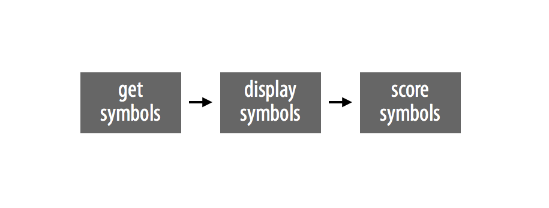
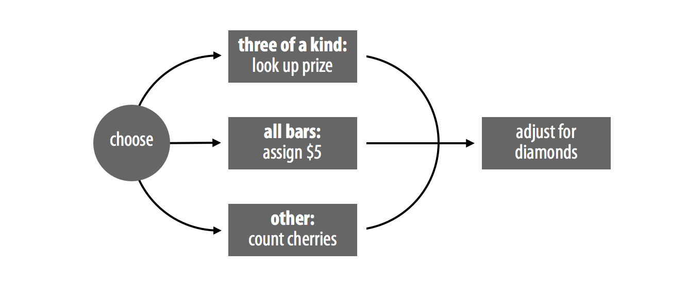
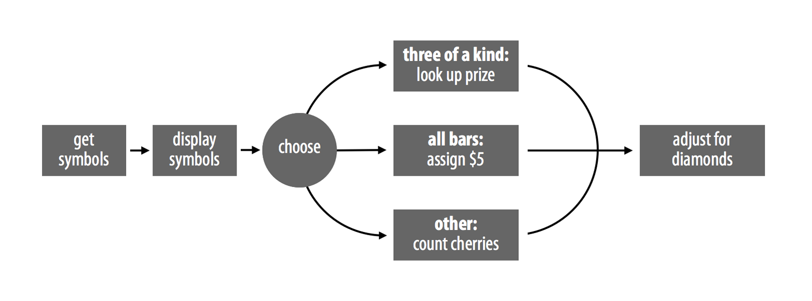
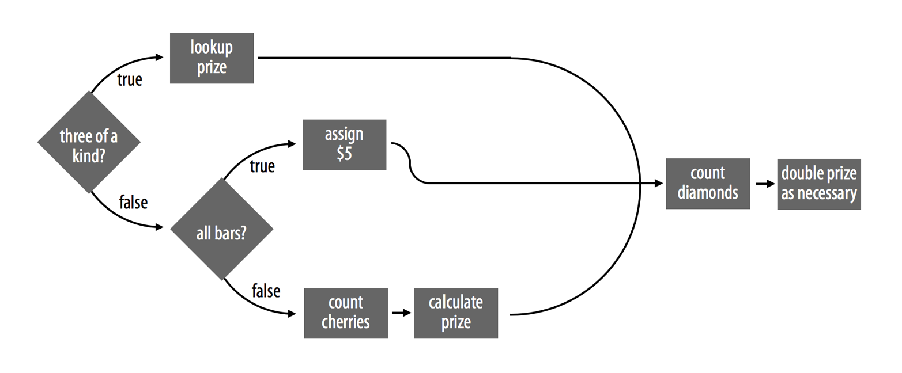

# 程序

2026-08-28⭐
@author Jiawei Mao
***
在本章中，你将构建一台老虎机，只需运行一个 R 函数即可玩。完成之后，你将能够这样玩：

```r
play()
## 0 0 DD
## $0

play()
## 7 7 7
## $80
```

`play` 函数需要做两件事。首先，它需要随机生成三个符号；其次，它需要根据这些符号计算奖金。

第一步很容易模拟。你可以使用 `sample` 函数随机生成三个符号。以下函数从一组常见的老虎机符号中生成三个符号：钻石（DD）、七（7）、三条（BBB）、双条（BB）、单条（B）、樱桃（C）和零（0）。符号是随机选择的，并且每个符号出现的概率各不相同：

```r
get_symbols <- function() {
  wheel <- c("DD", "7", "BBB", "BB", "B", "C", "0")
  sample(wheel,
    size = 3, replace = TRUE,
    prob = c(0.03, 0.03, 0.06, 0.1, 0.25, 0.01, 0.52)
  )
}
```

你可以使用 `get_symbols` 来生成老虎机中使用的符号：

```r
get_symbols()
## "BBB" "0"   "C"  

get_symbols()
## "0" "0" "0"

get_symbols()
## "7" "0" "B"
```

`get_symbols` 使用的概率数据来源于加拿大马尼托巴省的一组视频彩票终端机。这些老虎机在 20 世纪 90 年代曾短暂引发过争议，当时一名记者决定测试它们的赔付率。结果显示，这些机器的赔付率似乎只有 40%，尽管制造商声称赔付率应为 92%。关于这些机器的原始数据和对该争议的详细描述，可以在 W. John Braun 发表的一篇在线期刊文章中找到。当进一步的测试证明制造商是正确的之后，这场争议便平息了。

马尼托巴省的老虎机使用了表 9.1 中所示的复杂赔付方案。如果玩家获得以下情况，即可赢得奖金：

- 三个相同类型的符号（三个零除外）
- 三个条（任意组合的条）
- 一个或多个樱桃

否则，玩家将无法获得任何奖金。

奖金的具体金额由符号的精确组合决定，并且还会受到钻石（DD）存在与否的进一步修改。钻石被视为“百搭牌（wild cards）”，这意味着如果将钻石视为其他符号能增加玩家的奖金，它就可以充当任何其他符号。例如，如果玩家摇出 `7 7 DD`，将获得三个七的奖金。不过，这条规则有一个例外：除非玩家还获得了一个真正的樱桃，否则钻石不能被视为樱桃。这可以防止像 `0 DD 0` 这样毫无意义的组合被误判为 `0 C 0`。

钻石在另一个方面也很特别。组合中每出现一个钻石，最终奖金的金额就会翻倍。因此，`7 7 DD` 的实际得分实际上会高于 `7 7 7`。三个七能为你赢得 80 美元，但两个七和一个钻石能为你赢得 160 美元。一个七和两个钻石会更好，奖金翻倍两次，即 320 美元。当玩家摇出 `DD DD DD` 时，就会触发头奖。此时，玩家将获得 100 美元的基础奖金，并经过三次翻倍，最终赢得 800 美元。

> *表 9.1：每次玩老虎机花费 1 美元。玩家的符号决定了他们的奖金数额。钻石（DD）是百搭牌，每个钻石都会使最终奖金翻倍。* = 任意符号。*

| 组合         | 奖金 ($) |
| ------------ | -------- |
| DD DD DD     | 100      |
| 7 7 7        | 80       |
| BBB BBB BBB  | 40       |
| BB BB BB     | 25       |
| B B B        | 10       |
| C C C        | 10       |
| 任意条的组合 | 5        |
| C C *        | 5        |
| C * C        | 5        |
| * C C        | 5        |
| C * *        | 2        |
| * C *        | 2        |
| * * C        | 2        |

要创建 `play` 函数，你需要编写一个程序，该程序能够获取 `get_symbols` 的输出，并根据表 9.1 计算正确的奖金。

在 R 中，程序通常保存为 R 脚本或函数。我们将把你的程序保存为一个名为 `score` 的函数。完成后，你将能够像这样使用 `score` 来计算奖金：

```r
score(c("DD", "DD", "DD"))
## 800
```

之后，创建完整的老虎机就很容易了，如下所示：

```r
play <- function() {
  symbols <- get_symbols()
  print(symbols)
  score(symbols)
}
```

你可能会注意到，`play` 调用了一个新函数 `print`。由于函数最后一行不会返回这三个老虎机符号，`print` 将帮助 `play` 将它们显示出来。`print` 命令会将其输出打印到控制台窗口——即使 R 是在函数内部调用它也是如此。

在“项目 1：加权骰子”中，我曾鼓励你将所有的 R 代码写在 R 脚本中，R 脚本是一个你可以编写和保存代码的文本文件。随着你深入学习本章，这个建议将变得非常重要。请记住，你可以在 RStudio 中通过点击菜单栏的 `File > New File > R Script` 来打开一个 R 脚本。

## 1. 策略

对老虎机的结果进行计分是一项复杂的任务。你可以使用一个简单的策略来使这项任务以及其他编码任务变得更容易：

- 将复杂的任务分解为简单的子任务。
- 使用具体的示例。
- 先用英语（自然语言）描述你的解决方案，然后再将其转换为 R 代码。

让我们首先看看如何将程序划分为易于处理的子任务。

程序是一组供计算机逐步执行的指令。将这些指令结合在一起，可能会完成非常复杂的工作。但如果将它们拆开来看，每一个单独的步骤通常都是简单明了的。

你可以通过识别程序中的各个独立步骤或子任务来简化编码过程。然后，你可以分别处理每个子任务。如果某个子任务看起来很复杂，请尝试将其再次划分为更简单的子任务。通常，你可以将一个 R 程序分解为极其简单的子任务，以至于每个子任务都可以直接使用现有的函数来完成。

R 程序包含两种类型的子任务：顺序步骤（sequential steps）和并行分支（parallel cases）。

### 1.1 顺序步骤

对程序进行细分的一种方法是将其划分为一系列顺序步骤。`play` 函数就采用了这种方法，如图 9.1 所示。首先，它生成三个符号（步骤 1），然后在控制台窗口中显示它们（步骤 2），最后对它们进行计分（步骤 3）：

```r
play <- function() {

  # step 1: generate symbols
  symbols <- get_symbols()

  # step 2: display the symbols
  print(symbols)

  # step 3: score the symbols
  score(symbols)
}
```

要让 R 按顺序执行步骤，只需将这些步骤依次放置在 R 脚本或函数主体中即可。



> *图 9.1：`play` 函数使用了一系列顺序步骤。*

### 1.2 并行分支

划分任务的另一种方法是找出任务中相似的案例组。有些任务针对不同的输入组需要采用不同的算法。如果你能识别出这些组，就可以逐一为它们设计算法。

例如，如果 `symbols` 包含三个相同的符号（即“三条”），`score` 就需要用一种方式来计算奖金（在这种情况下，`score` 需要将这个相同的符号与对应的奖金进行匹配）。如果符号全都是条（bars），`score` 就需要用第二种方式来计算奖金（在这种情况下，`score` 可以直接分配 5 美元的奖金）。最后，如果符号既不是三条，也不全是条，`score` 就需要用第三种方式来计算奖金（在这种情况下，`score` 必须计算其中包含的樱桃数量）。`score` 永远不会同时使用这三种算法；它总是根据符号的组合，选择其中一种算法来执行。

钻石（Diamonds）的加入使这一切变得复杂，因为钻石可以作为百搭牌。我们现在先忽略这一点，专注于更简单的情况：钻石仅能使奖金翻倍，而不作为百搭牌。在运行了以下算法之一后，`score` 可以根据需要使奖金翻倍，如图 9.2 所示。

将这些计分案例（score cases）添加到 `play` 的步骤中，就揭示了完整老虎机程序的策略，如图 9.3 所示。

我们已经解决了这个策略中的前几个步骤。我们的程序可以使用 `get_symbols` 函数获取三个老虎机符号，然后使用 `print` 函数显示这些符号。现在，让我们来看看程序如何处理并行的计分案例。



*图 9.2：`score` 函数必须区分不同的并行案例。*



*图 9.3：完整的老虎机模拟将涉及既按顺序排列又按并行排列的子任务。*

## 2. `if` 语句

将多个案例并行连接起来需要一定的结构；每当程序必须在不同案例之间做出选择时，就会面临一个“岔路口”。你可以使用 `if` 语句来帮助程序应对这个岔路口。

`if` 语句会告诉 R 针对某个特定案例执行某项任务。用英语表达的话，你会说：“如果这是真的，就去做那件事。” 在 R 语言中，你会这样写：

```r
if (this) {
  that
}
```

这里的 `this` 对象应该是一个逻辑测试，或者是一个最终计算结果为单个 `TRUE` 或 `FALSE` 的 R 表达式。如果 `this` 的计算结果为 `TRUE`，R 就会运行紧跟在 `if` 语句后面的大括号（即 `{` 和 `}` 符号）之间的所有代码。如果 `this` 的计算结果为 `FALSE`，R 会跳过括号之间的代码，不予执行。

例如，你可以编写一个 `if` 语句来确保某个对象 `num` 为正数：

```r
if (num < 0) {
  num <- num * -1
}
```

如果 `num < 0` 为 `TRUE`，R 会将 `num` 乘以 -1，从而使 `num` 变为正数：

```r
num <- -2

if (num < 0) {
  num <- num * -1
}

num
## 2
```

如果 `num < 0` 为 `FALSE`，R 将什么都不做，`num` 将保持原样——为正数（或零）：

```r
num <- 4

if (num < 0) {
  num <- num * -1
}

num
## 4
```

`if` 语句的条件必须计算结果为单个 `TRUE` 或 `FALSE`。如果条件生成了一个包含多个 `TRUE` 和 `FALSE` 的向量（这比你想象的要容易），你的 `if` 语句将打印出一条警告信息，并且仅使用该向量的第一个元素。请记住，你可以使用 `any` 和 `all` 函数将逻辑值向量缩减为单个 `TRUE` 或 `FALSE`。

你不必将 `if` 语句限制在单行代码中；你可以在大括号之间包含任意多行代码。例如，以下代码使用了多行代码来确保 `num` 为正数。如果 `num` 初始为负数，额外的代码行会打印出一些提示信息。如果 `num` 初始为正数，R 将跳过整个代码块（包括所有的打印语句）：

```r
num <- -1

if (num < 0) {
  print("num is negative.")
  print("Don't worry, I'll fix it.")
  num <- num * -1
  print("Now num is positive.")
}
## "num is negative."
## "Don't worry, I'll fix it."
## "Now num is positive."

num
## 1
```

尝试完成以下小测验，以加深你对 `if` 语句的理解。

**练习 9.1（小测验 A）** 这段代码会返回什么？

```r
x <- 1
if (3 == 3) {
  x <- 2
}
x
```

**解答**：代码将返回数字 2。`x` 的初始值为 1，然后 R 遇到了 `if` 语句。由于条件计算结果为 `TRUE`，R 会执行 `x <- 2`，从而将 `x` 的值更改为 2。

**练习 9.2（小测验 B）** 这段代码会返回什么？

```r
x <- 1
if (TRUE) {
  x <- 2
}
x
```

**解答**：这段代码也会返回数字 2。它的工作原理与小测验 A 中的代码相同，只是该语句中的条件已经是 `TRUE` 了。R 甚至不需要对其进行计算。因此，`if` 语句内部的代码会被执行，`x` 将被赋值为 2。

**练习 9.3（小测验 C）** 这段代码会返回什么？

```r
x <- 1
if (x == 1) {
  x <- 2
  if (x == 1) {
    x <- 3
  }
}
x
```

**解答**：同样，代码将返回数字 2。`x` 的初始值为 1，第一个 `if` 语句的条件计算结果为 `TRUE`，这会导致 R 运行该 `if` 语句主体中的代码。首先，R 将 `x` 设置为 2，然后 R 计算第二个 `if` 语句（它位于第一个 `if` 语句的主体中）。这一次，由于 `x` 现在等于 2，`x == 1` 的计算结果为 `FALSE`。因此，R 会忽略 `x <- 3` 并退出这两个 `if` 语句。

## 3. `else` 语句

`if` 语句告诉 R 在条件为真（true）时该做什么，但你也可以告诉 R 在条件为假（false）时该做什么。`else` 是 `if` 的对应部分，它将 `if` 语句扩展为包含第二种情况。用英语表达的话，你会说：“如果这是真的，就执行计划 A；否则（else），就执行计划 B。” 在 R 语言中，你会这样写：

```r
if (this) {
  Plan A
} else {
  Plan B
}
```

当 `this` 的计算结果为 `TRUE` 时，R 会运行第一组大括号中的代码，而不会运行第二组中的代码。当 `this` 的计算结果为 `FALSE` 时，R 会运行第二组大括号中的代码，而不会运行第一组中的代码。你可以使用这种结构来涵盖所有可能的情况。例如，你可以编写一些代码，将小数四舍五入到最接近的整数。

首先，设定一个小数：

```r
a <- 3.14
```

然后，使用 `trunc` 函数分离出小数部分：

```r
dec <- a - trunc(a)
dec
## 0.14
```

> [!NOTE]
>
> `trunc` 函数接收一个数字，并仅返回该数字小数点左侧的部分（即该数字的整数部分）。
>
> `a - trunc(a)` 是返回 `a` 的小数部分的一种便捷方法。

接着，使用 `if else` 分支树来对数字进行四舍五入（向上或向下取整）：

```r
if (dec >= 0.5) {
  a <- trunc(a) + 1
} else {
  a <- trunc(a)
}

a
## 3
```

如果你的情况包含两个以上的互斥案例，你可以通过在 `else` 后面直接添加一个新的 `if` 语句，将多个 `if` 和 `else` 语句串联起来。例如：

```r
a <- 1
b <- 1

if (a > b) {
  print("A wins!")
} else if (a < b) {
  print("B wins!")
} else {
  print("Tie.")
}
## "Tie."
```

R 会依次检查 `if` 条件，直到某个条件计算结果为 `TRUE`，然后 R 会忽略分支树中所有剩余的 `if` 和 `else` 子句。如果没有条件计算结果为 `TRUE`，R 将运行最后的 `else` 语句。

如果两个 `if` 语句描述的是互斥事件，最好使用 `else if` 将它们连接起来，而不是将它们单独列出。这样，只要第一个 `if` 返回 `TRUE`，R 就会忽略第二个 `if` 语句，从而节省计算资源。

你可以使用 `if` 和 `else` 来连接老虎机函数中的子任务。打开一个全新的 R 脚本，并将以下代码复制到其中。这段代码将是我们最终 `score` 函数的骨架。请将其与图 9.2 中 `score` 的流程图进行对比：

```r
if ( # Case 1: all the same <1>) {
  prize <- # look up the prize <3>
} else if ( # Case 2: all bars <2> ) {
  prize <- # assign $5 <4>
} else {
  # count cherries <5>
  prize <- # calculate a prize <7>
}

# count diamonds <6>
# double the prize if necessary <8>
```

我们的骨架还相当不完整；有很多部分只是代码注释，而不是真正的代码。然而，我们已经将程序简化为八个简单的子任务：

<1> - 测试符号是否为“三条”（三个相同）。
<2> - 测试符号是否全为条（bars）。
<3> - 根据相同的符号，查找“三条”对应的奖金。
<4> - 分配 5 美元的奖金。
<5> - 计算樱桃的数量。
<6> - 计算钻石的数量。
<7> - 根据樱桃的数量计算奖金。
<8> - 根据钻石调整奖金。

如果你愿意，你可以围绕这些任务重新组织你的流程图，如图 9.4 所示。该图将描述相同的策略，但方式更为精确。我将使用菱形符号来表示 `if else` 决策。



> *图 9.4：`score` 函数可以通过两个 `if else` 决策来处理三种案例。我们也可以将某些任务拆分为两个步骤。*

现在，我们可以逐个处理这些子任务，并在处理过程中将 R 代码添加到 `if` 分支树中。如果你为每个子任务准备一个具体的示例，并在编写 R 代码之前尝试用自然语言（英语）描述解决方案，那么解决每个子任务都会变得很容易。

第一个子任务要求你测试符号是否为“三条”（三个相同）。你该如何开始编写这个子任务的代码呢？

你知道最终的 `score` 函数看起来大概是这样的：

```r
score <- function(symbols) {

  # calculate a prize

  prize
}
```

它的参数 `symbols` 将是 `get_symbols` 函数的输出，即一个包含三个字符串的向量。你可以像我写的那样开始编写 `score`：先定义一个名为 `score` 的对象，然后慢慢填充函数主体。然而，这并不是一个好主意。最终的函数将包含八个独立的部分，在所有这些部分都编写完成（且本身都能正确运行）之前，它是无法正确工作的。这意味着你必须写完整个 `score` 函数才能测试其中的任何一个子任务。如果 `score` 无法正常工作（这是极有可能的），你将不知道是哪个子任务需要修复。

如果你每次只专注于一个子任务，就可以节省时间。对于每个子任务，创建一个具体的示例来测试你的代码。例如，你知道 `score` 需要处理一个名为 `symbols` 的向量，该向量包含三个字符串。如果你创建一个真实的名为 `symbols` 的向量，你就可以在处理过程中针对该向量运行许多子任务的代码：

```r
symbols <- c("7", "7", "7")
```

如果某段代码在 `symbols` 上不起作用，你就会知道在继续之前必须修复它。你可以在不同的子任务之间更改 `symbols` 的值，以确保你的代码在各种情况下都能正常工作：

```r
symbols <- c("B", "BB", "BBB")
symbols <- c("C", "DD", "0")
```

只有当每个子任务在具体的示例上都能正常运行后，才将它们组合到 `score` 函数中。如果你遵循这个计划，你将花更多的时间使用你的函数，而不是花时间去弄清楚它们为什么不起作用。

准备好具体的示例后，尝试用英语描述你将如何完成该子任务。你对解决方案的描述越精确，编写 R 代码就越容易。

我们的第一个子任务要求我们“测试符号是否为三条”。这句话并没有给我提供任何有用的 R 代码思路。但是，我可以为“三条”描述一个更精确的测试：如果第一个符号等于第二个符号，且第二个符号等于第三个符号，那么这三个符号就是相同的。或者，更精确地说：

如果名为 `symbols` 的向量的第一个元素等于第二个元素，且第二个元素等于第三个元素，那么该向量将包含三个相同的符号。

**练习 9.4（编写测试）** 将上述语句转换为逻辑测试。该测试应适用于向量 `symbols`，并且当且仅当 `symbols` 中的每个元素都相同时返回 `TRUE`。请务必在你的 `symbols` 上测试你的代码。

**解答**：以下是几种测试 `symbols` 是否包含三个相同符号的方法。第一种方法模仿了上面的英语描述，但还有其他方法可以进行同样的测试。没有绝对的对错，只要你的解决方案有效即可。因为你已经创建了一个名为 `symbols` 的向量，所以很容易检查：

```r
symbols
##  "7" "7" "7"

symbols[1] == symbols[2] & symbols[2] == symbols[3]
## TRUE

symbols[1] == symbols[2] & symbols[1] == symbols[3]
## TRUE

all(symbols == symbols[1])
## TRUE
```

随着你掌握的 R 函数词汇量的增加，你会想到更多完成基本任务的方法。我喜欢的一种检查“三条”的方法是：

```r
length(unique(symbols) == 1)
```

`unique` 函数返回向量中出现的每一个唯一项。如果你的 `symbols` 向量包含“三条”（即一个唯一项出现了三次），那么 `unique(symbols)` 将返回一个长度为 1 的向量。

现在你有了一个可用的测试，你可以将其添加到你的老虎机脚本中：

```r
same <- symbols[1] == symbols[2] && symbols[2] == symbols[3]

if (same) {
  prize <- # look up the prize
} else if ( # Case 2: all bars ) {
  prize <- # assign $5
} else {
  # count cherries
  prize <- # calculate a prize
}

# count diamonds
# double the prize if necessary
```

`&&` 和 `||` 的行为类似于 `&` 和 `|`，但有时效率更高。如果在成对的测试中，第一个测试已经使结果明确，双运算符将不会计算第二个测试。例如，如果在下一个表达式中 `symbols[1]` 不等于 `symbols[2]`，`&&` 将不会计算 `symbols[2] == symbols[3]`；它可以立即为整个表达式返回 `FALSE`（因为 `FALSE & TRUE` 和 `FALSE & FALSE` 的计算结果都为 `FALSE`）。这种效率可以加快程序的运行速度；但是，双运算符 `&&` 和 `||` 不是向量化的，这意味着它们只能处理运算符两侧的单次逻辑测试。

第二种奖金情况发生在所有符号都是某种条（bar）时，例如 `B`、`BB` 和 `BBB`。让我们首先创建一个具体的示例来进行处理：

```r
symbols <- c("B", "BBB", "BB")
```

**练习 9.5（测试是否全为条）** 使用 R 的逻辑和布尔运算符编写一个测试，以确定名为 `symbols` 的向量是否仅包含条类型的符号。用我们的示例 `symbols` 向量检查你的测试是否有效。

**解答**：与 R 中的许多事物一样，测试 `symbols` 是否全为条有多种方法。例如，你可以编写一个使用多个布尔运算符的非常长的测试，如下所示：

```r
symbols[1] == "B" | symbols[1] == "BB" | symbols[1] == "BBB" &
  symbols[2] == "B" | symbols[2] == "BB" | symbols[2] == "BBB" &
  symbols[3] == "B" | symbols[3] == "BB" | symbols[3] == "BBB"
## TRUE
```

然而，这并不是一个非常高效的解决方案，因为 R 必须运行九次逻辑测试（而且你还得把它们全打出来）。你通常可以使用单个 `%in%` 运算符来替换多个 `|` 运算符。此外，你可以使用 `all` 来检查测试对向量中的每个元素是否为真。这两项更改将前面的代码缩短为：

```r
all(symbols %in% c("B", "BB", "BBB"))
## TRUE
```

让我们将这段代码添加到我们的脚本中：

```r
same <- symbols[1] == symbols[2] && symbols[2] == symbols[3]
bars <- symbols %in% c("B", "BB", "BBB")

if (same) {
  prize <- # look up the prize
} else if (all(bars)) {
  prize <- # assign $5
} else {
  # count cherries
  prize <- # calculate a prize
}

# count diamonds
# double the prize if necessary
```

你可能已经注意到，我将这个测试分成了 `bars` 和 `all(bars)` 两个步骤。这纯粹是个人偏好。只要有可能，我喜欢编写这样的代码：通过函数和对象的名称就能传达它们的作用。

你可能还注意到，我们对案例 2 的测试会捕获一些本应属于案例 1 的符号，因为它们包含“三条”：

```r
symbols <- c("B", "B", "B")
all(symbols %in% c("B", "BB", "BBB"))
## TRUE
```

然而，这不会成为问题，因为我们在 `if` 树中使用 `else if` 连接了这些案例。只要 R 遇到一个计算结果为 `TRUE` 的案例，它就会跳过树中剩余的代码。你可以这样理解：每个 `else` 都在告诉 R，只有当之前的条件都不满足时，才运行它后面的代码。因此，当我们有三个相同类型的条时，R 会计算案例 1 的代码，然后跳过案例 2（以及案例 3）的代码。

我们的下一个子任务是为符号分配奖金。当 `symbols` 向量包含三个相同的符号时，奖金将取决于具体是哪一种符号。如果有三个 `DD`，奖金将是 100 美元；如果有三个 `7`，奖金将是 80 美元；依此类推。

这暗示了需要另一个 `if` 树。你可以使用类似这样的代码来分配奖金：

```r
if (same) {
  symbol <- symbols[1]
  if (symbol == "DD") {
    prize <- 800
  } else if (symbol == "7") {
    prize <- 80
  } else if (symbol == "BBB") {
    prize <- 40
  } else if (symbol == "BB") {
    prize <- 5
  } else if (symbol == "B") {
    prize <- 10
  } else if (symbol == "C") {
    prize <- 10
  } else if (symbol == "0") {
    prize <- 0
  }
}
```

虽然这段代码可以工作，但写起来和读起来都有点长，并且可能需要 R 在给出正确的奖金之前执行多次逻辑测试。我们可以使用另一种方法做得更好。

## 4. 查找表

在 R 语言中，提取子集是最常见的操作。既然知道符号与其奖金之间的确切对应关系，你可以创建一个向量来捕获这些信息。这个向量可以将符号存储为名称（names），将奖金值存储为元素（elements）：

```r
payouts <- c("DD" = 100, "7" = 80, "BBB" = 40, "BB" = 25, 
  "B" = 10, "C" = 10, "0" = 0)
payouts
##  DD   7 BBB  BB   B   C   0 
## 100  80  40  25  10  10   0 
```

现在，你可以通过使用符号名称对向量进行子集提取，来获取任何符号对应的正确奖金：

```r
payouts["DD"]
##  DD 
## 100 

payouts["B"]
##  B
## 10
```

如果你希望在子集提取时去掉符号的名称，可以对输出结果运行 `unname` 函数：

```r
unname(payouts["DD"])
## 100 
```

`unname` 会返回一个去除了名称属性的对象副本。

`payouts` 是一种**查找表**（lookup table），即一种可以用来查找值的 R 对象。对 `payouts` 进行子集提取提供了一种查找符号对应奖金的简单方法。它不需要很多行代码，并且无论你的符号是 `DD` 还是 `0`，它所需的工作量都是一样的。你可以通过创建命名对象，来在 R 中创建查找表。

遗憾的是，我们的方法还不够自动化；我们需要告诉 R 在 `payouts` 中查找哪个符号。或者说，真的需要吗？如果你用 `symbols[1]` 对 `payouts` 进行子集提取，会发生什么？试一试吧：

```r
symbols <- c("7", "7", "7")
symbols[1]
## "7"

payouts[symbols[1]]
##  7 
## 80 

symbols <- c("C", "C", "C")
payouts[symbols[1]]
##  C 
## 10 
```

你不需要知道确切的符号是什么，因为你可以让 R 去查找 `symbols` 中碰巧存在的符号。你可以使用 `symbols[1]`、`symbols[2]` 或 `symbols[3]` 来找到这个符号，因为在这种情况下它们都包含相同的符号。现在，当 `symbols` 包含“三条”时，你有了一种简单的自动化方法来计算奖金。让我们把它添加到我们的代码中，然后看看案例 2：

```r
same <- symbols[1] == symbols[2] && symbols[2] == symbols[3]
bars <- symbols %in% c("B", "BB", "BBB")

if (same) {
  payouts <- c("DD" = 100, "7" = 80, "BBB" = 40, "BB" = 25, 
    "B" = 10, "C" = 10, "0" = 0)
  prize <- unname(payouts[symbols[1]])
} else if (all(bars)) {
  prize <- # assign $5
} else {
  # count cherries
  prize <- # calculate a prize
}

# count diamonds
# double the prize if necessary
```

只要符号全都是条（bars），就会触发案例 2。在这种情况下，奖金将是 5 美元，这很容易分配：

```r
same <- symbols[1] == symbols[2] && symbols[2] == symbols[3]
bars <- symbols %in% c("B", "BB", "BBB")

if (same) {
  payouts <- c("DD" = 100, "7" = 80, "BBB" = 40, "BB" = 25, 
    "B" = 10, "C" = 10, "0" = 0)
  prize <- unname(payouts[symbols[1]])
} else if (all(bars)) {
  prize <- 5
} else {
  # count cherries
  prize <- # calculate a prize
}

# count diamonds
# double the prize if necessary
```

现在我们可以处理最后一个案例了。在这里，你需要先知道 `symbols` 中有多少个樱桃，然后才能计算奖金。

**练习 9.6（查找 C）** 你如何判断名为 `symbols` 的向量中哪些元素是 `C`？设计一个测试并尝试一下。

**挑战**

你如何计算名为 `symbols` 的向量中 `C` 的数量？请回想一下 R 的强制类型转换规则。

**解答**：一如既往，让我们用一个真实的例子来进行：

```r
symbols <- c("C", "DD", "C")
```

测试樱桃的一种方法是检查 `symbols` 中有哪些（如果有的话）是 `C`：

```r
symbols == "C"
## TRUE FALSE  TRUE
```

更有用的是计算 `symbols` 中有多少个樱桃。你可以使用 `sum` 函数来实现，它期望接收数值输入，而不是逻辑值。知道这一点后，R 会在求和之前将 `TRUE` 和 `FALSE` 强制转换为 `1` 和 `0`。因此，`sum` 将返回 `TRUE` 的数量，这也就是樱桃的数量：

```r
sum(symbols == "C")
## 2
```

你可以使用同样的方法来计算 `symbols` 中钻石的数量：

```r
sum(symbols == "DD")
## 1
```

让我们将这两个子任务添加到程序骨架中：

```r
same <- symbols[1] == symbols[2] && symbols[2] == symbols[3]
bars <- symbols %in% c("B", "BB", "BBB")

if (same) {
  payouts <- c("DD" = 100, "7" = 80, "BBB" = 40, "BB" = 25, 
    "B" = 10, "C" = 10, "0" = 0)
  prize <- unname(payouts[symbols[1]])
} else if (all(bars)) {
  prize <- 5
} else {
  cherries <- sum(symbols == "C")
  prize <- # calculate a prize
}

diamonds <- sum(symbols == "DD")
# double the prize if necessary
```

由于案例 3 在 `if` 树中的位置比案例 1 和案例 2 更靠后，因此案例 3 中的代码仅适用于没有“三条”或“全为条”的玩家。根据老虎机的赔付方案，如果玩家有两个樱桃，他们将赢得 5 美元；如果有一个樱桃，则赢得 2 美元。如果玩家没有樱桃，奖金为 0 美元。我们不需要担心出现三个樱桃的情况，因为该结果已在案例 1 中涵盖。

与案例 1 一样，你可以编写一个 `if` 树来处理樱桃的每种组合，但就像案例 1 一样，这将是一个低效的解决方案：

```r
if (cherries == 2) {
  prize <- 5
} else if (cherries == 1) {
  prize <- 2
} else {
  prize <- 0
}
```

我们知道，如果没有樱桃，奖金应为 0 美元；如果有一个樱桃，奖金为 2 美元；如果有两个樱桃，奖金为 5 美元。你可以创建一个包含这些信息的向量。这将是一个非常简单的查找表：

```r
c(0, 2, 5)
```

现在，就像在案例 1 中一样，你可以对向量进行子集提取以获取正确的奖金。在这种情况下，奖金不是通过符号名称来识别的，而是通过存在的樱桃数量来识别的。我们有这个信息吗？有的，它存储在 `cherries` 中。我们可以使用基本的整数子集提取从先前的查找表中获取正确的奖金，例如，`c(0, 2, 5)[1]`。

`cherries` 并不完全适合整数子集提取，因为它可能包含零，但这很容易修复。我们可以使用 `cherries + 1` 进行子集提取。现在，当 `cherries` 等于零时，我们有：

```r
cherries + 1
## 1

c(0, 2, 5)[cherries + 1]
## 0
```

当 `cherries` 等于一时，我们有：

```r
cherries + 1
## 2

c(0, 2, 5)[cherries + 1]
## 2
```

当 `cherries` 等于二时，我们有：

```r
cherries + 1
## 3

c(0, 2, 5)[cherries + 1]
## 5
```

仔细检查这些解决方案，直到你确信它们能为每种数量的樱桃返回正确的奖金。然后将代码添加到你的脚本中，如下所示：

```r
same <- symbols[1] == symbols[2] && symbols[2] == symbols[3]
bars <- symbols %in% c("B", "BB", "BBB")

if (same) {
  payouts <- c("DD" = 100, "7" = 80, "BBB" = 40, "BB" = 25, 
    "B" = 10, "C" = 10, "0" = 0)
  prize <- unname(payouts[symbols[1]])
} else if (all(bars)) {
  prize <- 5
} else {
  cherries <- sum(symbols == "C")
  prize <- c(0, 2, 5)[cherries + 1]
}

diamonds <- sum(symbols == "DD")
# double the prize if necessary
```

> [!WARNING]
>
> **查找表与 `if` 树的对比**
>
> 这是我们第二次创建查找表以避免编写 `if` 树。为什么这种技术很有用，而且为什么它会不断出现？R 语言中的许多 `if` 树是必不可少的。它们提供了一种有用的方法，可以告诉 R 在不同情况下使用不同的算法。然而，`if` 树并非适用于所有地方。
>
> `if` 树有几个缺点。首先，它们要求 R 在沿着 `if` 树向下执行时运行多次测试，这会产生不必要的工作量。其次，正如你将在“速度（Speed）”一节中看到的，在向量化代码中使用 `if` 树会很困难，而向量化代码是一种利用 R 编程优势来创建快速程序的代码风格。查找表则没有这两个缺点。
>
> 你无法用查找表替换所有的 `if` 树，也不应该这么做。但是，你通常可以使用查找表来避免使用 `if` 树来赋值。作为一般规则：如果树的每个分支运行不同的代码，请使用 `if` 树；如果树的每个分支只是分配不同的值，请使用查找表。
>
> 要将 `if` 树转换为查找表，请识别要赋的值并将它们存储在向量中。接下来，识别 `if` 树条件中使用的选择标准。如果条件使用字符串，请为你的向量命名并使用基于名称的子集提取。如果条件使用整数，请使用基于整数的子集提取。

最后一个子任务是根据存在的钻石数量，将奖金翻倍相应的次数。这意味着最终奖金将是当前奖金的某个倍数。例如，如果没有钻石，奖金将是：

```r
prize * 1      # 1 = 2 ^ 0
```

如果有一个钻石，将是：

```r
prize * 2      # 2 = 2 ^ 1
```

如果有两个钻石，将是：

```r
prize * 4      # 4 = 2 ^ 2
```

如果有三个钻石，将是：

```r
prize * 8      # 8 = 2 ^ 3
```

你能想到一种简单的处理方法吗？类似于这些示例的方法怎么样？

**练习 9.7（根据钻石调整）** 编写一种根据钻石数量调整 `prize` 的方法。先用英语描述解决方案，然后编写代码。

**解答**：以下是受前面模式启发得出的一个简洁解决方案。调整后的奖金等于：

```r
prize * 2 ^ diamonds
```

这为我们提供了最终的计分脚本：

```r
same <- symbols[1] == symbols[2] && symbols[2] == symbols[3]
bars <- symbols %in% c("B", "BB", "BBB")

if (same) {
  payouts <- c("DD" = 100, "7" = 80, "BBB" = 40, "BB" = 25, 
    "B" = 10, "C" = 10, "0" = 0)
  prize <- unname(payouts[symbols[1]])
} else if (all(bars)) {
  prize <- 5
} else {
  cherries <- sum(symbols == "C")
  prize <- c(0, 2, 5)[cherries + 1]
}

diamonds <- sum(symbols == "DD")
prize * 2 ^ diamonds
```

## 5. 代码注释

现在，你已经有了一个可以运行的计分（score）脚本，接下来可以将其保存为一个函数。不过，在保存脚本之前，建议考虑使用 `#` 为代码添加注释。注释可以通过解释代码“为什么这样做”来使你的代码更易于理解。例如，我会在 `score` 代码中添加三条注释：

```r
# identify case（识别案例）
same <- symbols[1] == symbols[2] && symbols[2] == symbols[3]
bars <- symbols %in% c("B", "BB", "BBB")

# get prize（获取奖金）
if (same) {
  payouts <- c("DD" = 100, "7" = 80, "BBB" = 40, "BB" = 25, 
    "B" = 10, "C" = 10, "0" = 0)
  prize <- unname(payouts[symbols[1]])
} else if (all(bars)) {
  prize <- 5
} else {
  cherries <- sum(symbols == "C")
  prize <- c(0, 2, 5)[cherries + 1]
}

# adjust for diamonds（根据钻石进行调整）
diamonds <- sum(symbols == "DD")
prize * 2 ^ diamonds
```

既然代码的每个部分都能正常运行了，你就可以将其封装成一个函数。你可以使用 RStudio 菜单栏中 `Code` 下的 `Extract Function`（提取函数）选项，或者直接使用 `function` 函数。确保函数的最后一行会返回一个结果，并确认函数使用了哪些参数。通常，你用来测试代码的具体示例（比如 `symbols`）就会成为函数的参数。运行以下代码即可开始使用 `score` 函数：

```r
score <- function (symbols) {
  # identify case
  same <- symbols[1] == symbols[2] && symbols[2] == symbols[3]
  bars <- symbols %in% c("B", "BB", "BBB")
  
  # get prize
  if (same) {
    payouts <- c("DD" = 100, "7" = 80, "BBB" = 40, "BB" = 25, 
      "B" = 10, "C" = 10, "0" = 0)
    prize <- unname(payouts[symbols[1]])
  } else if (all(bars)) {
    prize <- 5
  } else {
    cherries <- sum(symbols == "C")
    prize <- c(0, 2, 5)[cherries + 1]
  }
  
  # adjust for diamonds
  diamonds <- sum(symbols == "DD")
  prize * 2 ^ diamonds
}
```

一旦定义了 `score` 函数，`play` 函数也能正常工作了：

```r
play <- function() {
  symbols <- get_symbols()
  print(symbols)
  score(symbols)
}
```

现在，玩老虎机变得轻而易举：

```r
play()
## "0"  "BB" "B" 
## 0

play()
## "DD"  "0" "B"  
## 0

play()
## "BB" "BB" "B" 
## 25
```

## 6. 总结

R 程序是一组供计算机遵循的指令，这些指令被组织成一系列步骤和案例。这可能会让程序看起来很简单，但不要被这种错觉欺骗：通过简单步骤（和案例）的正确组合，你完全可以创造出复杂的结果。

作为一名程序员，你更容易在相反的方向上被欺骗。当你知道一个程序必须实现某些令人惊叹的功能时，它可能会让你觉得根本无法写出来。在这些情况下不要惊慌。将眼前的工作分解为简单的任务，然后再对这些任务进行细分。如果有帮助的话，你可以使用流程图来可视化任务之间的关系。然后，一次只专注于一个子任务。先用自然语言（英语）描述解决方案，然后再将其转换为 R 代码。在处理过程中，针对具体的示例测试每个解决方案。一旦你的所有子任务都能正常运行，就可以将代码整合到一个函数中，以便分享和复用。

R 提供了可以帮助你完成这些工作的工具。你可以使用 `if` 和 `else` 语句来管理案例。你可以使用对象和子集提取来创建查找表。你可以使用 `#` 添加代码注释。你还可以使用 `function` 将程序保存为函数。

人们在编写程序时经常会出错。你需要自己去寻找错误的根源并修复它们。如果你采用循序渐进的方法来编写函数——每次编写并测试一小部分代码——那么找到错误根源应该会很容易。但是，如果你找不到错误的原因，或者发现自己正在处理大段未经测试的代码，请考虑使用 R 的内置调试工具，这在“调试 R 代码（Debugging R Code）”一节中有详细描述。

接下来的两章将教你更多可以在程序中使用的工具。随着你熟练掌握这些工具，你会发现编写 R 程序变得更加容易，从而让你能够随心所欲地处理数据。在“S3”一章中，你将学习如何使用 R 的 S3 系统，这是一个塑造了 R 语言诸多方面的“无形之手”。你将使用该系统为你的老虎机输出构建一个自定义类，并告诉 R 如何显示具有该类的对象。