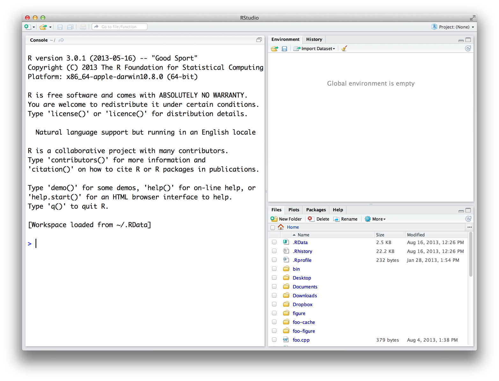

# 附录 A：安装 R 和 RStudio

2026-04-08⭐
@author Jiawei Mao
***
要使用 R 语言，你需要获取 R 安装包。本附录介绍如何下载 R 以及 RStudio—— 一款能让 R 更易使用的应用软件。你将一步步完成从下载 R 到启动首个 R 会话的全过程。

R 和 RStudio 均为免费软件，且下载过程简单便捷。

## A.1 如何下载并安装 R

R 语言由一支国际开发者团队维护，他们通过[综合 R 存档网络（CRAN）](https://cran.r-project.org/) 提供 R 语言的下载服务。网页顶部提供了三个下载 R 的链接，请根据你的操作系统选择对应链接：Windows、macOS 或 Linux。

### A.1.1 Windows 系统

要在 Windows 系统上安装 R，请点击 “**Download R for Windows**（下载适用于 Windows 的 R）” 链接，随后点击 “**base**（基础版）” 链接。接下来，点击新页面顶部的第一个链接。该链接通常显示为 “**Download R 4.5.3 for Windows**”，其中版本号 4.5.3 会替换为当前最新的 R 版本。点击此链接将下载一个安装程序，该程序会为你安装最新版的 Windows 版 R。运行该程序，并按照弹出的安装向导逐步操作。向导会将 R 安装到程序文件夹中，并在开始菜单中创建快捷方式。注意：你需要在电脑上拥有**相应的管理员权限**，才能安装新软件。

### A.1.2 Mac 系统

若要在 Mac 上安装 R，请点击 “**Download R for Mac**（下载适用于 Mac 的 R）” 链接。接着，点击 R-4.5.3 安装包链接（或对应最新版本 R 的安装包链接）。随后会下载一个安装程序，引导你完成安装，整个过程十分简便。安装程序支持自定义安装设置，但**默认配置已适用于绝大多数用户**，我个人从未觉得有必要修改这些设置。如果你的电脑在安装新软件时需要输入密码，在此步骤中你将需要用到它。

> [!NOTE]
>
> **二进制版本与源代码版本**
>
> R 既可以通过预编译的**二进制文件**安装，也可以在任意操作系统上从**源代码**编译安装。
>
> 在 Windows 和 macOS 设备上，通过二进制文件安装 R 极为简便。二进制文件已内置安装程序，可直接安装。尽管在这些平台上也能从源代码编译 R，但过程要复杂得多，且对大多数用户而言并无明显优势。
>
> 而在 Linux 系统上情况则相反。虽然部分系统能找到预编译的二进制文件，但在 Linux 上安装 R 时，更常见的方式是从源代码文件编译安装。
>
> CRAN 官网的下载页面提供了在 Windows、macOS 和 Linux 平台上从源代码编译 R 的相关说明。

### A.1.3 Linux 系统

许多 Linux 系统已预装 R，但如果你的版本过旧，建议安装最新版。CRAN 网站提供了适用于 Debian、Redhat、SUSE 和 Ubuntu 系统的源代码编译文件，可通过 “Download R for Linux” 链接获取。点击该链接，然后按目录层级进入你要安装的对应 Linux 版本。具体安装步骤会因所用 Linux 系统而异。CRAN 会为每组源代码配套提供说明文档或 README 文件，解释在对应系统上的安装方法，以此指导整个安装流程。

> [!NOTE]
>
> **32 位与 64 位版本**
>
> R 同时提供 32 位和 64 位版本。你该选择哪一个？大多数情况下并无太大影响。两个版本均使用 32 位整数进行计算，因此数值计算精度是相同的。二者的区别在于内存管理方式：64 位 R 使用 64 位内存指针，而 32 位 R 使用 32 位内存指针，这意味着 64 位 R 拥有更大的可使用（及可检索）内存空间。
>
> 一般经验而言，32 位版 R 运行速度比 64 位版更快，但并非绝对如此。另一方面，64 位版能够处理更大的文件和数据集，且内存管理问题更少。无论哪个版本，向量长度上限均约为 20 亿个元素。如果你的操作系统不支持 64 位程序，或内存小于 4GB，选择 32 位 R 即可。若系统支持 64 位 R，Windows 和 Mac 安装程序会自动**同时安装两个版本**。

## A.2 使用 R

R 并不是像 Microsoft Word 或 IE 浏览器那样，打开就能直接使用的程序。相反，R 是一门计算机语言，类似于 C、C++ 或 UNIX。你需要用 R 语言编写命令，再让计算机去解释执行这些命令。在早些年，人们会在 UNIX 终端窗口中运行 R 代码，就像 20 世纪 80 年代电影里的黑客一样。如今几乎所有人都会借助一款名为 RStudio 的软件来使用 R，我也推荐你这样做。

> [!TIP]
>
> **R 与 UNIX**
>
> 你仍然可以在 UNIX 或 BASH 窗口中输入以下命令来运行 R：
>
> ```bash
> R
> ```
>
> 该命令会启动 R 解释器。之后你就可以进行操作，完成后输入 `q()` 即可关闭解释器。

## A.3 RStudio

RStudio 是一款类似 Microsoft Word 的应用软件，区别在于：Word 用于编写英文文档，而 RStudio 用于编写 R 语言代码。本书全程使用 RStudio 进行讲解，因为它能极大简化 R 的使用流程。此外，RStudio 在 Windows、Mac OS 和 Linux 系统上的界面完全一致，这也便于让书中内容与你的实际操作体验相匹配。

你可以免费[下载 RStudio](https://posit.co/downloads/)。只需点击 “Download RStudio”按钮，然后按照随后出现的简易说明操作即可。安装好 RStudio 后，你就可以像打开电脑上其他程序一样启动它 —— 通常是点击桌面上的图标。

> [!TIP]
>
> **R 图形用户界面（GUI）**
>
> Windows 和 Mac 用户通常不会在终端窗口中编写程序，因此这两个系统对应的 R 安装包都附带了一个简易程序，它会打开一个类似终端的窗口，供你运行 R 代码。当你在 Windows 或 Mac 电脑上点击 R 图标时，启动的正是这个程序。这类程序比基础终端窗口功能稍多一些，但差别并不大。你可能会听到人们将它们称作 **Windows 或 Mac 版 R 图形用户界面（GUI）**。

打开 RStudio，会出现一个包含三个窗格的窗口，如图 A.1 所示。其中最大的窗格是**控制台窗口**，在这里运行 R 代码并查看运行结果。控制台窗口与在 UNIX 控制台或 Windows、Mac 系统的 R 图形界面中运行 R 时所看到的完全一致。你看到的其余界面都是 RStudio 独有的。其他窗格中还包含文本编辑器、图形窗口、调试器、文件管理器等诸多功能。在本书的学习过程中，随着这些窗格的实际应用，你会逐步了解它们。



> Figure A.1: The RStudio IDE for R.

> [!TIP]
>
> **我还需要下载 R 吗？**
>
> 即使使用 RStudio，仍然需要在电脑上安装 R。RStudio 只是帮你使用电脑上已安装的 R 程序，但其本身并不自带 R 环境。

## A.4 启动 R

现在你的电脑上已经安装了 R 和 RStudio，可以通过打开 RStudio 程序来开始使用 R。打开 RStudio 的方式和其他软件一样：点击它的图标，或者在 Windows 的「运行」对话框中输入 “RStudio”。