# 2. 快速探索数据

@since 2026-09-30⭐
@author Jiawei Mao
***
尽管本书大部分图形使用 ggplot2 绘制，但它并非绘图的唯一选择。在需要快速探索数据时，base R 自带绘图函数也很实用：这些函数 R 自带，无需安装扩展包，输入快捷，在简单场景下使用直观，而且运行极快。

但是绘制复杂图表时，还是改用 ggplot2 更好。ggplot2 提供了一套统一接口和选项，而 base R 那样充斥着零散的修改参数和特例。掌握 ggplot2 后，可以将这套知识广泛应用于散点图、直方图、小提琴图乃至地图等。

本节每个示例都会展示如何使用 base R 来绘制图表，并用 ggplot2 绘制类似图表。如果你熟悉 base R 图形，将其与 ggplot2 示例对照阅读有助于在需要制作高级图形时顺利过渡到 ggplot2。

## 2.1 创建散点图

### 2.1.1 问题

需要创建散点图。

### 2.1.2 解决方法

使用 `plot()` 函数，并依次传入 `x` 和 `y` 值向量：

```r
plot(mtcars$wt, mtcars$mpg)
```

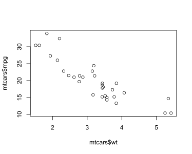

> 图 2.1：基础图形绘制散点图

`mtcars$wt` 返回 `mtcars` 数据框中名为 `wt` 的列，而 `mtcars$mpg` 则是 `mpg` 列。

使用 ggplot2 可得类似结果：

```r
library(ggplot2)

ggplot(mtcars, aes(x = wt, y = mpg)) +
  geom_point()
```

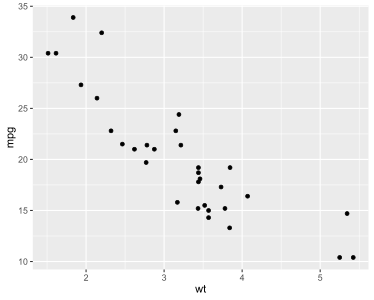

> 图 2.2：使用 ggplot2 绘制散点图

其中：

1. `ggplot()` 创建一个绘图对象
2. `geom_point()` 则在绘图中添加一个散点图层

使用 `ggplot()` 的常规方法是：传入一个数据框（如 `mtcars`），再指定 x 和 y 值的列。

如果直接传入两个向量作为 `x` 和 `y` 值，需设置 `data = NULL`，再传入这些向量。

```R
ggplot(data = NULL, aes(x = mtcars$wt, y = mtcars$mpg)) +
  geom_point()
```

> [!NOTE]
>
> ggplot2 为数据框设计，直接传入向量会限制其功能。

在实际应用中，`ggplot()` 代码常分多行书写，`+` 放末尾。

### 2.1.3 延伸阅读

更多散点图细节见第 5 章。

## 2.2 创建折线图

### 2.2.1 问题

需要创建一个折线图。

### 2.2.2 解决方法

用 `plot()` 传入 `x` 向量 `y` 向量，并设置 `type = "l"`：

```r
plot(pressure$temperature, pressure$pressure, type = "l")
```

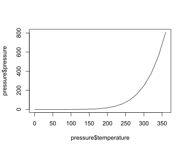

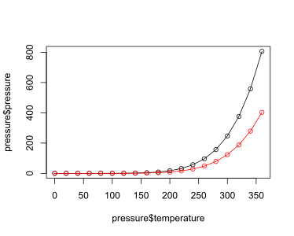

> 图 2.3：基础图形折线图（上）；添加数据点和另一条折线（下）

若要添加数据点和多条折线（图 2.3）：先调用 `plot()` 画第一条线，再用 `points()` 添加点，`lines()` 添加线：

```r
plot(pressure$temperature, pressure$pressure, type = "l")
points(pressure$temperature, pressure$pressure)

lines(pressure$temperature, pressure$pressure / 2, col = "red")
points(pressure$temperature, pressure$pressure / 2, col = "red")
```

用 ggplot2，通过 `geom_line()` 可得类似结果（图 2.4）：

```r
library(ggplot2)

ggplot(pressure, aes(x = temperature, y = pressure)) +
  geom_line()
```

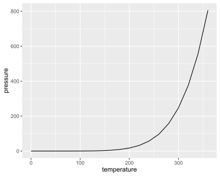

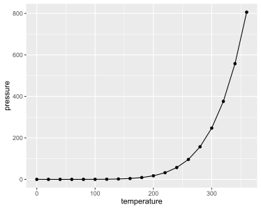

>  图 2.4：使用 ggplot() 绘制的折线图（左）；添加了数据点（右）

与散点图一样，也可以将数据以向量形式传入，但会限制后续对图形的操作。

添加数据点：

```r
library(ggplot2)

ggplot(pressure, aes(x = temperature, y = pressure)) +
  geom_line() +
  geom_point()
```

> [!TIP]
>
> 使用 `ggplot()` 时通常分多行书写，每行末尾加 `+`，表示命令在下一行继续。

### 2.2.3 延伸阅读

更多折线图细节见第 4 章。

## 2.3 创建条形图

### 2.3.1 问题

需要创建条形图。

### 2.3.2 解决方法

用 `barplot()` 创建数值条形图（图 2.5），传入包含各条形高度的数值向量，以及可选的标签向量。如果数值向量的元素自带名称，则会自动被用作标签。

查看 `BOD` 数据集：

```R
> BOD
  Time demand
1    1    8.3
2    2   10.3
3    3   19.0
4    4   16.0
5    5   15.6
6    7   19.8
```

```R
barplot(BOD$demand, names.arg = BOD$Time)
```

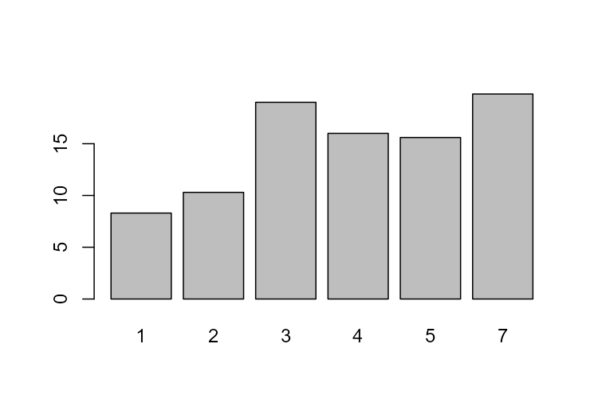

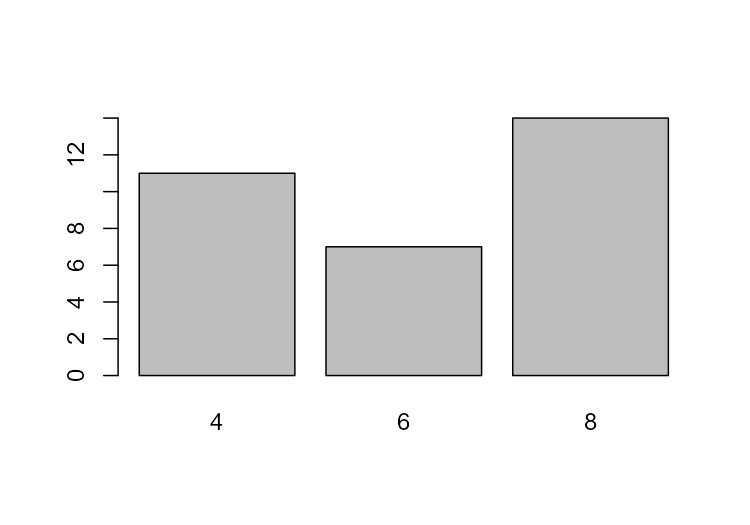

> 图 2.5：基础图形绘制的数值条形图（左）；频数条形图（右）

频数条形图：先用 `table()` 统计频数，再传给 `barplot()`。

```R
# 值为 4 的有 11 个，值为 6 的有 7 个，值为 8 的有 14 个
table(mtcars$cyl)
#> 
#>  4  6  8 
#> 11  7 14
```

将统计结果（table）传入 `barplot()` 生成频数条形图：

```r
barplot(table(mtcars$cyl))
```


ggplot2 中数值条形图用 `geom_col()`（图 2.6）。注意观察 `x` 为连续型和离散型时输出结果的差异：

```R
library(ggplot2)

# 数值条形图。使用 BOD 数据框，
# "Time" 列作为 x，"demand" 列作为 y。
ggplot(BOD, aes(x = Time, y = demand)) +
  geom_col()
```

```R
# 将 x 转换为因子（factor），使其被视为离散型变量
ggplot(BOD, aes(x = factor(Time), y = demand)) +
  geom_col()
```

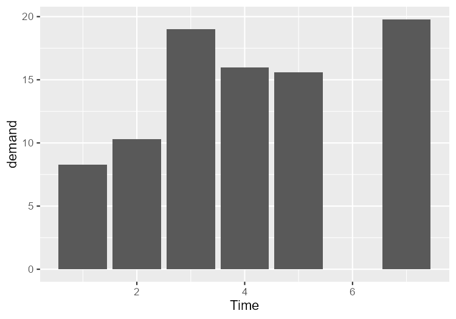

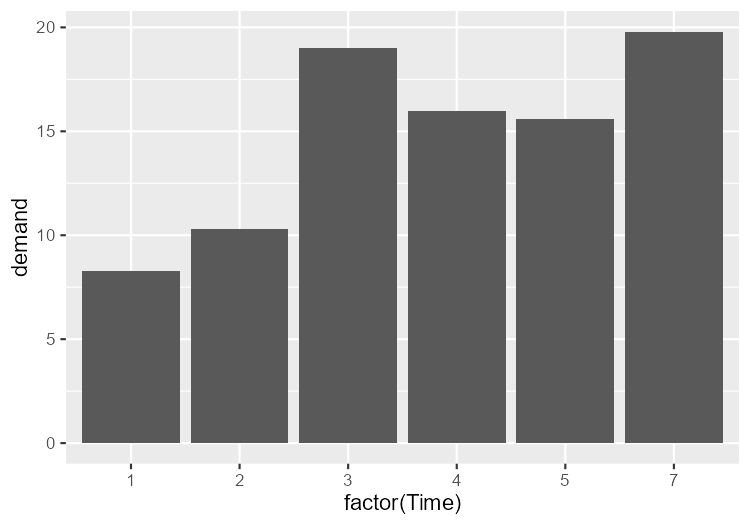

> 图 2.6：x 为连续型时的数值条形图（左）；x 转换为因子后（注意没有值为 6 的条目；右）

ggplot2 中用 `geom_bar()` 绘制频数条形图。注意连续型 x 和离散型 x 的区别。某些数据用 `factor()` 将连续 x 转为离散变量更合理。

```r
# 频数条形图。这里使用了 mtcars 数据框，
# "cyl" 列作为 x 轴位置。y 轴位置是通过统计每个 cyl 值的行数来计算的。
ggplot(mtcars, aes(x = cyl)) +
  geom_bar()

# 频数条形图
ggplot(mtcars, aes(x = factor(cyl))) +
  geom_bar()
```


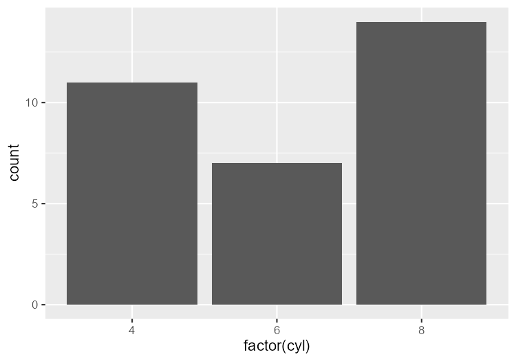

>  图 2.7：x 为连续型变量的频数条形图（左）；x 换为因子后（右）

> [!TIP]
>
> ggplot2 早期版本中使用 `geom_bar(stat = "identity")` 创建数值条形图。ggplot2 2.2.0 开始新增 `geom_col()` ，其功能与上述方法相同。

### 2.3.3 延伸阅读

更多条形图细节见第 3 章。

## 2.4 创建直方图

### 2.4.1 问题

需要通过直方图查看一维数据分布。

### 2.4.2 解决方法

使用 `hist()` 函数并传入一个数值向量：

```r
hist(mtcars$mpg)

# 用 breaks 参数指定大概 bins 数
hist(mtcars$mpg, breaks = 10)
```

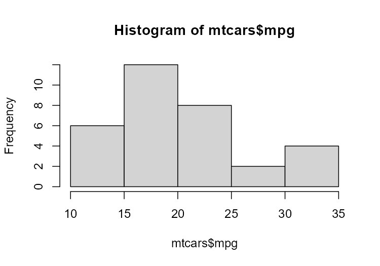

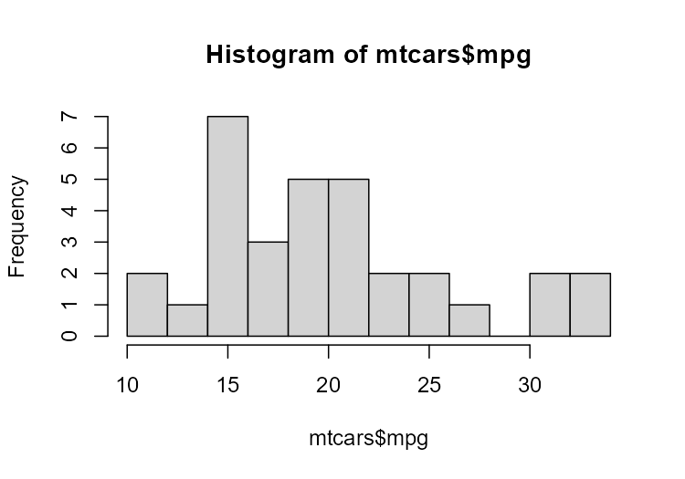

>  图 2.8：基础图形绘制的直方图（左）；增加分组数后的直方图（右）。注意，由于分组变窄，每组包含的数据变少。

ggplot2 用 `geom_histogram()` 绘制直方图（图 2.9）：

```R
library(ggplot2)

ggplot(mtcars, aes(x = mpg)) +
  geom_histogram()
#> `stat_bin()` using `bins = 30`. Pick better value `binwidth`.
```

```r
# 使用更宽的分组
ggplot(mtcars, aes(x = mpg)) +
  geom_histogram(binwidth = 4)
```

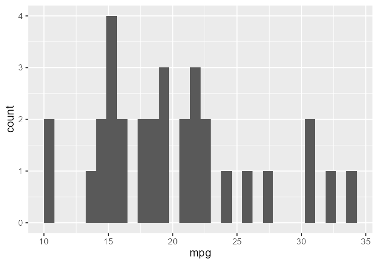

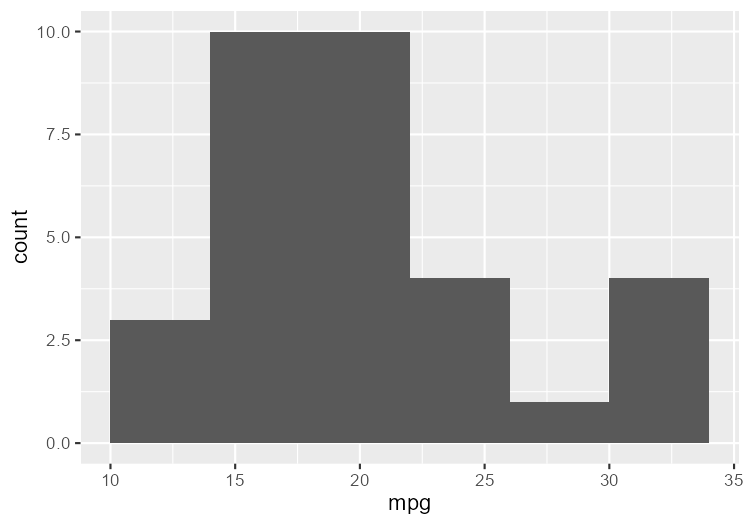

>  图 2.9：默认分组宽度（上）；使用更宽分组（下）

未指定分组宽度（bin width）时，ggplot2 默认使用 30 个 bins，并提示选择更合适的 `binwidth`。`binwidth` 对探索数据非常重要；默认 30 个 bins 可能有用也可能无用。

### 2.4.3 延伸阅读

关于创建直方图的更多细节见示例 6.1 和 6.2。

## 2.5 创建箱线图

### 2.5.1 问题

创建箱线图以比较数据分布。

### 2.5.2 解决方法

使用 `plot()` 创建箱线图，传入 x 因子（factor）和 y 值向量。当 x 为因子（非数值向量）时 `plot()` 自动创建箱线图：

```r
plot(ToothGrowth$supp, ToothGrowth$len)
```

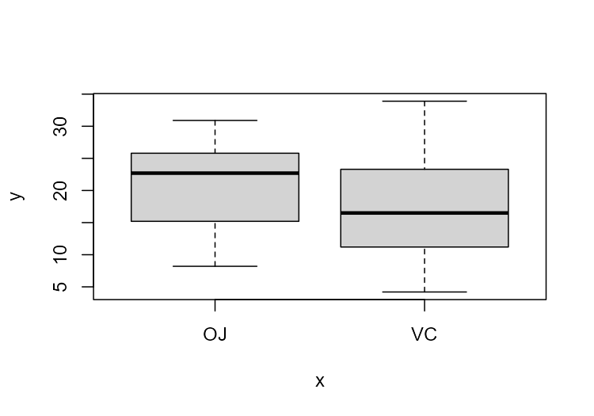

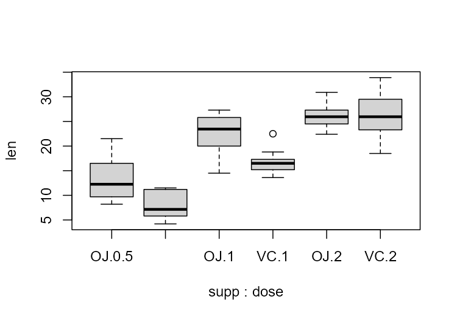

>   图 2.10：箱线图（左）；包含多个分组的箱线图（右）

若这两个向量在同一数据框，可以使用公式语法（formula syntax）调用 `boxplot()` 。支持在 x 轴组合两个变量：

```r
# 公式语法,效果同上
boxplot(len ~ supp, data = ToothGrowth)

# 将两个变量的交互作用放在 x 轴上
boxplot(len ~ supp + dose, data = ToothGrowth)
```


ggplot2 通过 `geom_boxplot()` 生成箱线图（图 2.11）：

```r
library(ggplot2)
ggplot(ToothGrowth, aes(x = supp, y = len)) +
  geom_boxplot()
```

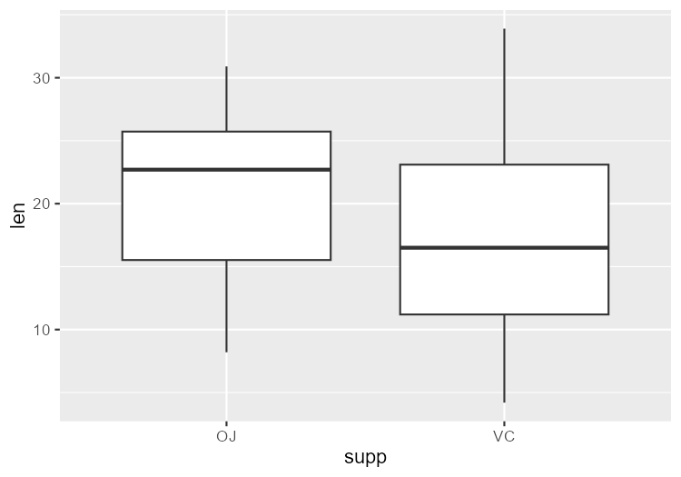

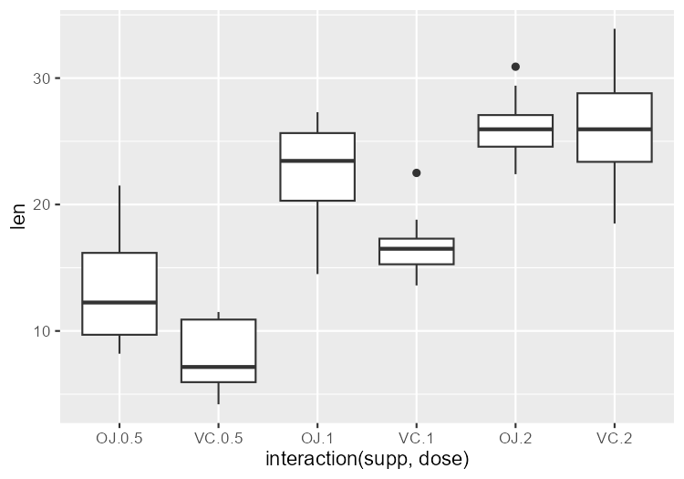

> 图 2.11：`ggplot()` 绘制的箱线图（左）；包含多个分组的箱线图（右）

使用 `interaction()` 组合变量，绘制多变量箱线图：

```r
ggplot(ToothGrowth, aes(x = interaction(supp, dose), y = len)) +
  geom_boxplot()
```

> [!NOTE]
>
> base R 箱线图与 ggplot2 箱线图有微小差异，这是因为分位数计算方法不同。详见 `?geom_boxplot` 和 `?boxplot.stats`。

### 2.5.3 延伸阅读

关于创建基础箱线图的更多内容，请参阅示例 6.6。

## 2.6 绘制函数曲线

### 2.6.1 问题

绘制函数曲线。

### 2.6.2 解决方法

用 `curve()` 绘制函数曲线，传入包含变量 `x` 的表达式：

```r
curve(x^3 - 5*x, from = -4, to = 4)
```

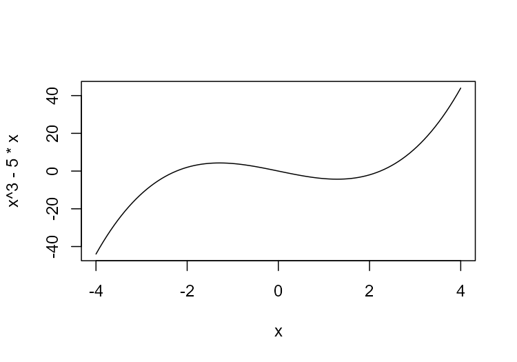

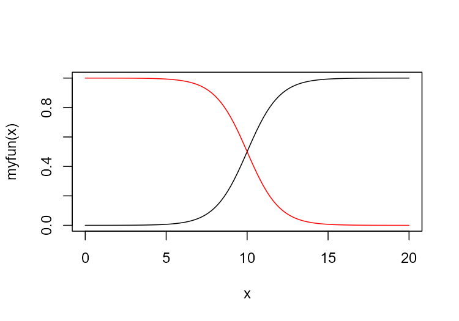

>  图 2.12：base R 绘制的函数曲线（上）；自定义函数绘制的曲线（下）

可以绘制任何以数值向量为输入、并返回数值向量的函数，包括自定义函数。使用 `add = TRUE` 可以将新曲线添加到已创建图形：

```r
# 绘制自定义函数
myfun <- function(xvar) {
  1 / (1 + exp(-xvar + 10))
}
curve(myfun(x), from = 0, to = 20)
# 添加一条线
curve(1 - myfun(x), add = TRUE, col = "red")
```


ggplot2 使用 `stat_function(geom = "line")` 绘制，同样传入以数值向量为输入、返回数值向量的函数：

```r
library(ggplot2)

myfun <- function(xvar) {
  1 / (1 + exp(-xvar + 10))
}

# 这里将 x 轴的范围设置为 0 到 20
ggplot(data.frame(x = c(0, 20)), aes(x = x)) +
  stat_function(fun = myfun, geom = "line")
```

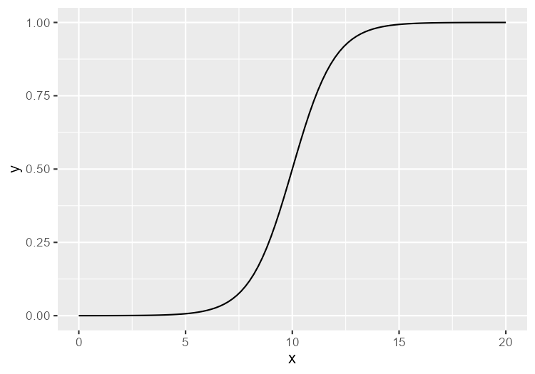

>  图 2.13：使用 ggplot2 绘制的函数曲线

### 2.6.3 延伸阅读

关于绘制函数曲线的更多细节，请参阅示例 13.2。