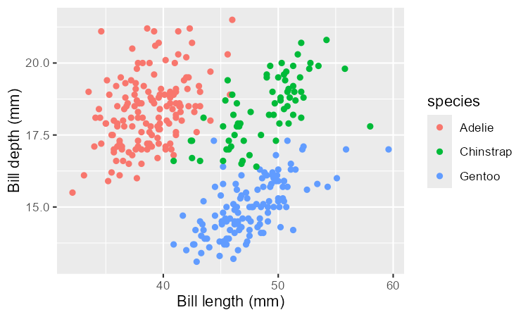
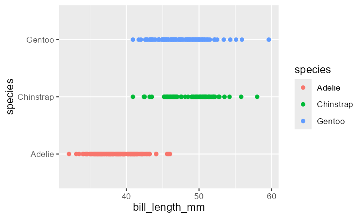
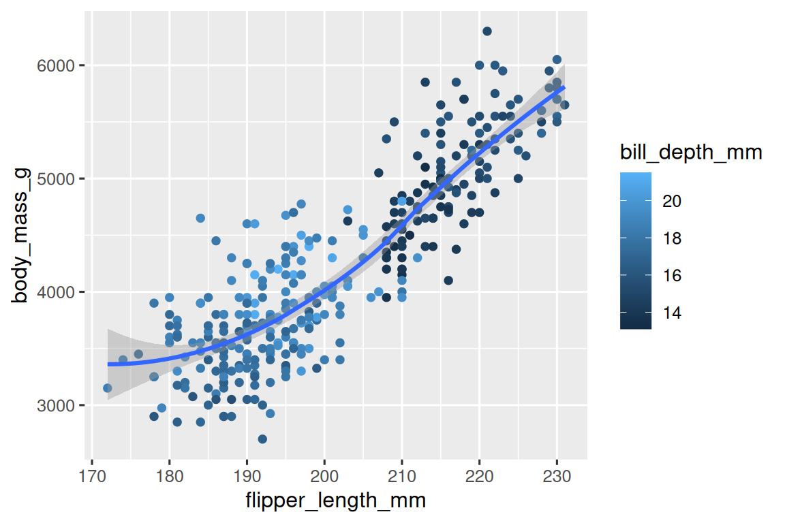

# 1. 数据可视化

2026-09-23: 润色、补充
@since 2026-08-24⭐
@author Jiawei Mao
***

## 1.1 简介

R 拥有多套绘图系统，**ggplot2** 是其中最优雅、功能最全的绘图包之一。ggplot2 基于**图形语法（grammar of graphics）**，掌握后可举一反三，高效应对各类绘图场景。

本章介绍使用 ggplot2 实现数据可视化：从散点图入手，并借此介绍**美学映射（aesthetic mappings）**与**几何对象（geometric objects）**这两个 ggplot2 基础单元；然后介绍单变量分布可视化与多变量可视化；最后讲解图像保存与常见绘图问题的排查技巧。

### 1.1.1 前置环境

本章聚焦 **ggplot2**（tidyverse 核心包）。为了使用本章用到的数据集、帮助文档和函数，请运行以下代码加载 tidyverse：

```R
> library(tidyverse)
── Attaching core tidyverse packages ─────────────── tidyverse 2.0.0 ──
✔ dplyr     1.2.1     ✔ readr     2.2.0
✔ forcats   1.0.1     ✔ stringr   1.6.0
✔ ggplot2   4.0.3     ✔ tibble    3.3.1
✔ lubridate 1.9.5     ✔ tidyr     1.3.2
✔ purrr     1.2.2     
── Conflicts ─────────────────────────────────────── tidyverse_conflicts() ──
✖ dplyr::filter() masks stats::filter()
✖ dplyr::lag()    masks stats::lag()
ℹ Use the conflicted package to force all conflicts to become errors
```

该代码会加载 **tidyverse 核心包**，几乎每次数据分析都会用到这些包。控制台同时提示：tidyverse 中有哪些函数与 R 基础包或已加载其他扩展包存在命名冲突。

如果报错：**there is no package called 'tidyverse'**，需要先安装 `tidyverse`，然后再执行 `library()` 加载。

```R
install.packages("tidyverse")
library(tidyverse)
```

扩展包**只需要安装一次**，但每次开启新 R 会话都需重新加载。

本章还会用到`palmerpenguins`和`ggthemes`。`palmerpenguins` 提供 `penguins` 数据集（帕尔默群岛三座岛屿上企鹅的身体测量数据）；`ggthemes`则提供色盲友好的安全配色板。

```R
library(palmerpenguins)
#> 
#> Attaching package: 'palmerpenguins'
#> The following objects are masked from 'package:datasets':
#> 
#>     penguins, penguins_raw
library(ggthemes)
```

## 1.2 入门实操

鳍足较长的企鹅是否更重？企鹅的鳍足长度与体重是正相关还是负相关、线性还是非线性？这种关系是否会因企鹅的种类或岛屿而异？让我们通过可视化来解答。

### 1.2.1 `penguins` data-frame

可以使用 `palmerpenguins` 包中的 `penguins` 数据框（即 [`palmerpenguins::penguins`](https://allisonhorst.github.io/palmerpenguins/reference/penguins.html)）来验证上述问题。 数据框（data frame）是由变量（列）和观测值（行） 组成的矩形数据表。`penguins` 数据集包含 344 条观测数据，由 Kristen Gorman 博士与南极帕尔默站长期生态研究站收集并公开。

先明确几个术语：

- **变量（variable）**：可测量的数量、特征或属性。
- **值（value）**：变量在一次测量中呈现的状态。
- **观测（observation）**：在相似条件下完成的一组测量（通常是在同一时间、对同一对象完成所有测量）。一个观测会包含多个值，每个值对应不同的变量，又称为**数据点**（data point）。即数据表中的一行或单个样本点。
- **表格数据（tabular data）**：一组值的集合，每个值对应一个变量和一次观测。如果每个值放在独立单元格，每列一个变量、每行一个观测，则称为**整洁数据**（tidy data）。

在本数据集下，**变量**指所有企鹅都具备的一项属性；而**观测**是单只企鹅的全部测量信息。

在控制台中输入数据框名称即可预览数据内容。注意顶部的 **tibble** 字样，这是 tidyverse 使用的一种特殊数据框，后续会详述。

```R
penguins
#> # A tibble: 344 × 8
#>   species island    bill_length_mm bill_depth_mm flipper_length_mm
#>   <fct>   <fct>              <dbl>         <dbl>             <int>
#> 1 Adelie  Torgersen           39.1          18.7               181
#> 2 Adelie  Torgersen           39.5          17.4               186
#> 3 Adelie  Torgersen           40.3          18                 195
#> 4 Adelie  Torgersen           NA            NA                  NA
#> 5 Adelie  Torgersen           36.7          19.3               193
#> 6 Adelie  Torgersen           39.3          20.6               190
#> # ℹ 338 more rows
#> # ℹ 3 more variables: body_mass_g <int>, sex <fct>, year <int>
```

该数据框有 8 列。可以用`glimpse()`函数看到**全部变量**及前几条观测样本；在 RStudio 中还可以用 `View(penguins)` 打开交互式数据查看器。

```R
glimpse(penguins)
#> Rows: 344
#> Columns: 8
#> $ species           <fct> Adelie, Adelie, Adelie, Adelie, Adelie, Adelie, A…
#> $ island            <fct> Torgersen, Torgersen, Torgersen, Torgersen, Torge…
#> $ bill_length_mm    <dbl> 39.1, 39.5, 40.3, NA, 36.7, 39.3, 38.9, 39.2, 34.…
#> $ bill_depth_mm     <dbl> 18.7, 17.4, 18.0, NA, 19.3, 20.6, 17.8, 19.6, 18.…
#> $ flipper_length_mm <int> 181, 186, 195, NA, 193, 190, 181, 195, 193, 190, …
#> $ body_mass_g       <int> 3750, 3800, 3250, NA, 3450, 3650, 3625, 4675, 347…
#> $ sex               <fct> male, female, female, NA, female, male, female, m…
#> $ year              <int> 2007, 2007, 2007, 2007, 2007, 2007, 2007, 2007, 2…
```

`penguins` 数据集包含的主要变量：

- `species`：企鹅物种（阿德利、帽带、巴布亚）
- `flipper_length_mm`：鳍肢长度（毫米）
- `body_mass_g`：体重（克）

可以在控制台运行 `?penguins` 打开帮助文档以进一步了解`penguins`数据集。

### 1.2.2 目标图表

本章目标是复现下图：该图展示企鹅鳍肢长度与体重之间的关系，并考虑企鹅物种的影响。


### 1.2.3 创建 ggplot 图表

下面逐步复现这张图。

` ggplot2` 绘图从`ggplot()`函数开始，它会生成一个绘图对象，再逐步叠加**图层（layers）**。`ggplot()`的第一个参数是数据集。因此，`ggplot(data = penguins)` 会生成一张空白画布，并做好展示`penguins`数据集的准备；但由于没指定可视化方法，所以画布是空的。

```R
ggplot(data = penguins)
```


接着用 `mapping` 参数定义变量到**美学属性**的**映射**：

- `mapping` 必须写在 `aes()` 函数内部；
- `aes()` 的 `x` 和 `y` 参数指定映射到 x 轴和 y 轴的变量 ，这里将**鳍肢长度**映射到 x 轴，**体重**映射到 y 轴；
- `ggplot2` 会在 `data` 参数指定的数据中寻找映射变量，在本例中为 `penguins` 数据集。

```R
ggplot(
  data = penguins,
  mapping = aes(x = flipper_length_mm, y = body_mass_g)
)
```


这块画布已有基本框架结构：x 轴对应鳍肢长度，y 轴对应体重。但由于没指定用什么几何图形展示观测，所以没显示任何数据点。

定义**几何对象（geom）**的函数以`geom_` 开头，如：

- `geom_bar()` 表示柱状图
- `geom_line()` 表示折线图
- `geom_boxplot()` 表示箱线图
- `geom_point()`  表示散点图

`geom_point()` 会添加一个**点图层**，从而生成**散点图**。ggplot2 提供了大量 geom 函数，详见[第 9 章](./9.layers.md)。

```R
ggplot(
  data = penguins,
  mapping = aes(x = flipper_length_mm, y = body_mass_g)
) +
  geom_point()
#> Warning: Removed 2 rows containing missing values or values outside the scale range
#> (`geom_point()`).
```


> [!TIP]
>
> 若点不够圆，可以安装并加载 `ragg` 包，然后将 `Options>General>Graphics>Backend` 设置为 `AGG`，就能改善。

现在得到**散点图**，已经能够发现鳍肢长度与体重呈正相关（鳍足越长，体重越大）、近似线性（样本点聚集在一条直线周围，而非曲线）、相关性中等偏强（样本点相对直线不算太分散）。总体而言，鳍肢更长的企鹅，体重通常也更大。

以上代码会弹出一条警告信息：

> Warning message: Removed 2 rows containing missing values or values outside the scale range (`geom_point()`). 

原因：有两只企鹅的**体重**或**鳍足长度**缺失，ggplot2 无法绘制。ggplot2 遵循原则：**缺失值不应被无声忽略**。这类警告在处理真实数据时很常见，因为缺失值非常普遍，[第 18 章](./18.missing-values.md)会详述缺失值问题。后续绘图将**屏蔽此警告**，避免重复输出。

### 1.2.4 添加美学映射与图层

散点图适合展示两个数值变量之间的关系。但变量间呈现出的这种关联可能受其他变量影响。例如：鳍肢长度和体重之间的关系是否因物种而异？我们把物种映射为颜色看看：

```R
ggplot(
  data = penguins,
  mapping = aes(x = flipper_length_mm, y = body_mass_g, color = species)
) +
  geom_point()
```


将**分类变量**映射到美学属性，ggplot2 会自动为该变量的每个类别（这里是三种企鹅）分配一个唯一美学属性值（如颜色），这个过程称为**标度变换（scaling）**，并生成图例，标注颜色与类别的对应关系。

接下来添加一条平滑曲线，用来展示体重和鳍肢长度之间的关系。用 `geom_smooth()` 并设置参数`method = "lm"`，绘制基于线性模型的最优拟合直线。

```R
ggplot(
  data = penguins,
  mapping = aes(x = flipper_length_mm, y = body_mass_g, color = species)
) +
  geom_point() +
  geom_smooth(method = "lm")
```


虽然成功添加了拟合直线，但目标是对**全部数据绘制一条回归线**，而不是为每种企鹅各生成一条直线。

- 在`ggplot()`中定义的映射为**全局层级**，会传递给后续所有几何图层；
- 每个 geom 图层可以单独设置 `mapping` 参数，实现**局部美学映射**；
- 局部映射会叠加到从全局继承的映射。

我们希望散点按照物种区分颜色，但回归线不按物种分开绘制，只需在`geom_point()`内设置 `color = species` 实现局部映射。

```R
ggplot(
  data = penguins,
  mapping = aes(x = flipper_length_mm, y = body_mass_g)
) +
  geom_point(mapping = aes(color = species)) +
  geom_smooth(method = "lm")
```


已接近最终目标，但还需为不同企鹅种类设置**不同形状**并完善**标签**。只靠颜色展示信息对色盲类人群不友好，可同时映射形状。

```R
ggplot(
  data = penguins,
  mapping = aes(x = flipper_length_mm, y = body_mass_g)
) +
  geom_point(mapping = aes(color = species, shape = species)) +
  geom_smooth(method = "lm")
```


图例也随之更新，显示各个点对应的颜色与形状。

最后用 `labs()` 完善标签：

- `title` 添加**主标题**
- `subtitle` 添加**副标题**
- `x` 设置 x 轴标签
- `y` 设置 y 轴标签
- `color` 和 `shape` 设置**图例名称**

此外，还可以使用 `ggthemes` 中的 `scale_color_colorblind()` 改为**色盲友好配色**。

```R
ggplot(
  data = penguins,
  aes(x = flipper_length_mm, y = body_mass_g)
) +
  geom_point(aes(color = species, shape = species)) +
  geom_smooth(method = "lm") +
  labs(
    title = "Body mass and flipper length",
    subtitle = "Dimensions for Adelie, Chinstrap, and Gentoo Penguins",
    x = "Flipper length (mm)",
    y = "Body mass (g)",
    color = "Species",
    shape = "Species"
  ) +
  scale_color_colorblind()
```


得到与目标完全一致的图形。

> [!TIP]
>
> 在 `labs` 中，如果 `color` 与 `shape` 设置的值不同，会得到两个 legend。

### 1.2.5 练习

1. `penguins` 数据集中有多少行、多少列？

```R
> penguins
# A tibble: 344 × 8
   species island    bill_length_mm bill_depth_mm
   <fct>   <fct>              <dbl>         <dbl>
 1 Adelie  Torgersen           39.1          18.7
 2 Adelie  Torgersen           39.5          17.4
 3 Adelie  Torgersen           40.3          18  
 4 Adelie  Torgersen           NA            NA  
 5 Adelie  Torgersen           36.7          19.3
 6 Adelie  Torgersen           39.3          20.6
 7 Adelie  Torgersen           38.9          17.8
 8 Adelie  Torgersen           39.2          19.6
 9 Adelie  Torgersen           34.1          18.1
10 Adelie  Torgersen           42            20.2
# ℹ 334 more rows
# ℹ 4 more variables: flipper_length_mm <int>,
#   body_mass_g <int>, sex <fct>, year <int>
# ℹ Use `print(n = ...)` to see more rows
```

344 行，8 列。


2. `penguins` 数据框中的 `bill_depth_mm` 变量描述的是什么？用 `?penguins` 查看帮助文档来找答案。

```R
bill_length_mm # 喙长（毫米）
a number denoting bill length (millimeters)

bill_depth_mm # 喙深（毫米）
a number denoting bill depth (millimeters)
```


3. 绘制 `bill_length_mm` （x 轴）与 `bill_depth_mm` （y 轴）的散点图，并描述二者之间的关系。

```R
ggplot(
  data = penguins,
  aes(x = bill_length_mm, y = bill_depth_mm)
) +
  geom_point(aes(color = species)) +
  labs(
    x = "Bill length (mm)",
    y = "Bill depth (mm)"
  )
```




4. 绘制 `bill_depth_mm`（x 轴）与 `species`（y 轴）的散点图，效果如何？选择哪种 geom 可能会更好？

```R
ggplot(
  data = penguins,
  aes(x = bill_length_mm, y = species)
) +
  geom_point(aes(color = species))
```



一个为连续数值变量，一个为分类变量，用箱线图或者小提琴图更合适。


5. 以下代码为何报错？如何修复？

```r
ggplot(data = penguins) + 
  geom_point()
```

`geom_point()` 需要定义 `x` 和 `y` 映射，补充上该映射即可。可以在全局 `ggplot()` 中定义，`geom_point()` 会自动继承，也可以在 `geom_point()` 定义。


6. `geom_point()` 的 `na.rm` 参数有什么作用？默认值是什么？请创建一个散点图并将该参数设置为 `TRUE`。

查看文档可知，`na.rm` 表示当数据里有缺失值时，是否要发出警告信息。默认为 `False`，表示移除缺失值并发出警告信息；设为 `TRUE` 则直接移除缺失值，没有任何提示。


7. 为上一题的图添加图注：“Data come from the palmerpenguins package.”。提示：请查看 `labs()` 的文档。


8. 复现下图。`bill_depth_mm`（喙深）应映射到哪个视觉属性？应在全局还是 geom 层级进行映射？



平滑曲线对应所有数据点，因此只能在 `geom_point` 局部将 `bill_depth_mm` 映射到颜色。代码如下：

```R
ggplot(
  data = penguins,
  aes(x = flipper_length_mm, y = body_mass_g)
) +
  geom_point(aes(color = bill_depth_mm)) +
  geom_smooth()
```


9. 先预测以下代码的输出结果，再在 R 中运行代码核对。

```r
ggplot(
  data = penguins,
  mapping = aes(x = flipper_length_mm, y = body_mass_g, color = island)
) +
  geom_point() +
  geom_smooth(se = FALSE)
```


10. 这两张图表是否不同？为什么？

```r
ggplot(
  data = penguins,
  mapping = aes(x = flipper_length_mm, y = body_mass_g)
) +
  geom_point() +
  geom_smooth()

ggplot() +
  geom_point(
    data = penguins,
    mapping = aes(x = flipper_length_mm, y = body_mass_g)
  ) +
  geom_smooth(
    data = penguins,
    mapping = aes(x = flipper_length_mm, y = body_mass_g)
  )
```

完全相同，只是将全局属性改为在局部定义。

## 1.3 ggplot2 调用

入门之后，我们将改用更精简的 ggplot2 写法。前面写全参数名称的做法对初学者友好：

```R
ggplot(
  data = penguins,
  mapping = aes(x = flipper_length_mm, y = body_mass_g)
) +
  geom_point()
```

一般函数最前面一两个参数最重要，应熟记。`ggplot()` 前两个参数为：数据集`data`与美学映射`mapping`，之后不再显式写出这两个参数名。这样能减少打字，也更容易比较多张绘图代码的差异。这是一项非常重要的编程思路，在[函数](./25.functions.md)这一章会深入探讨。

将前面的绘图改用精简写法，得到如下代码：

```R
ggplot(penguins, aes(x = flipper_length_mm, y = body_mass_g)) + 
  geom_point()
```

## 1.4 分布可视化

展示变量分布的方式取决于变量类型：分类变量和数值变量。

### 1.4.1 分类变量

只能取有限几个值的变量是分类变量。可以使用柱状图展示其分布，柱高代表各类别的观测数。

```R
ggplot(penguins, aes(x = species)) +
  geom_bar()
```


对无序分类变量（如企鹅物种），通常按频数对柱子重新排序。这需要先将变量转换成因子（R 存储分类数据的类型），再调整该因子的水平顺序。

```R
ggplot(penguins, aes(x = fct_infreq(species))) +
  geom_bar()
```


因子及其处理函数（例 `fct_infreq()`）将在[后续](./16.factors.md)详述。

### 1.4.2 数值变量

**数值变量**能取大范围的数值，能做加减、求平均等运算，并分为连续型与离散型。 

展示连续变量分布最常用的是**直方图**。

```R
ggplot(penguins, aes(x = body_mass_g)) +
  geom_histogram(binwidth = 200)
```


直方图将 x 轴分为等间距的箱体（bins），柱高代表落入 bin 中的观测数。上图最高柱子代表有 39 个观测的 `body_mass_g` 介于 3500‑3700 克之间，这两个数值为该柱子的左、右边界。

`binwidth`参数设置 bin 宽度，其单位与 x 轴变量保持一致。绘制直方图时应尝试多种宽度，下图中:`binwidth = 20` 过窄，柱子过多，难以看清分布的整体形态；`binwidth = 2000` 过大，只有 3 个 bins，同样无法看清分布形态；`binwidth = 200` 较平衡。

```R
ggplot(penguins, aes(x = body_mass_g)) +
  geom_histogram(binwidth = 20)
ggplot(penguins, aes(x = body_mass_g)) +
  geom_histogram(binwidth = 2000)
```


数值变量分布的另一种可视化方案是**密度图**。密度图相当于经过平滑处理后的直方图，是一个很实用的替代选择，适合本身服从平滑分布的连续型数据。我们不讲解 `geom_density()` 的实现细节，这里用一个类比来解释密度曲线的绘制原理：想象一个由木块搭建的直方图，取一根煮熟的意大利面条搭上去，面条覆盖木块呈现的轮廓就类似密度曲线。相比直方图，密度图的细节更少，但更易看出整体形态、众数和偏态。

```R
ggplot(penguins, aes(x = body_mass_g)) +
  geom_density()
#> Warning: Removed 2 rows containing non-finite outside the scale range
#> (`stat_density()`).
```


###  1.4.3 练习题

1. 绘制企鹅物种的条形图，把`species`映射到`y`。这张图和原来的图有什么区别？

```R
ggplot(penguins, aes(y = species)) +
  geom_bar()
```


条形图从垂直变为水平。


2. 下面两张图有何不同？改柱子颜色用 `color` 还是 `fill` 更合适？

```R
ggplot(penguins, aes(x = species)) +
  geom_bar(color = "red")

ggplot(penguins, aes(x = species)) +
  geom_bar(fill = "red")
```

第一个将 bar 的边框设置为红色，第二个整个填充为红色。`fill` 更合适。


3. `geom_histogram()` 的 `bins` 参数有什么作用？

`bins` 参数设置 bins 数量，默认为 30。如果同时设置了 `binwidth`，那么 `binwidth` 优先生效。


4. 加载 `tidyverse` 后可以使用 `diamonds`数据集。请为该数据集中的 `carat`（克拉）变量绘制直方图，并尝试不同的 `binwidth`，哪种 `binwidth` 最能揭示数据规律？

可以先用 RStudio 的 `View` 功能查看数据集，判断 `carat` 的取值范围：[0.20, 5.01]。

## 1.5 变量间关系可视化

可视化变量关系至少需要将两个变量映射到美学属性。下面介绍常用图表以及对应的几何对象。

### 1.5.1 一个数值变量与一个分类变量

展示数值变量与分类变量之间的关系，可用并列箱线图。它基于百分位数描述数据分布，也适合识别异常值。箱线图结构如图 1.1 所示：

- **箱体**：代表中间一半数据的取值范围，即**四分位距（IQR）**，从分布的 25 分位数到 75 分位数。中间横线为**中位数（50 分位数）**。通过这三条参考线可以感知数据的离散程度， 还能判断分布相对于中位数是对称还是偏斜的。
- **离群点**：距离箱体任意一边超过 1.5 倍 IQR 的观测值会被绘制成散点作为异常值单独展示。
- **须线**：从箱体两端延伸到最远的**非离群**点。


> 图 1.1：箱线图绘制原理示意图

接下来使用`geom_boxplot()` 查看**按物种分组的企鹅体重分布**：

```R
ggplot(penguins, aes(x = species, y = body_mass_g)) +
  geom_boxplot()
```


也可以使用`geom_density()`绘制密度图。

```R
ggplot(penguins, aes(x = body_mass_g, color = species)) +
  geom_density(linewidth = 0.75)
```


`linewidth` 可定义线条粗细。 

还可以将物种同时映射到 `color`（轮廓颜色）和 `fill`（填充色），并用 `alpha` 设置填充后密度曲线的透明度。`alpha` 取值范围为 0‑1：0 完全透明，1 完全不透明。下图设为 0.5。

```R
ggplot(penguins, aes(x = body_mass_g, color = species, fill = species)) +
  geom_density(alpha = 0.5)
```


说明：

-  **变量映射到美学属性**：图形视觉属性随变量取值变化。 
- **给美学属性设定固定值**：对应视觉属性固定不变。

### 1.5.2 两个分类变量

可以用**堆叠条形图**可视化两个分类变量的关系。下面两张图都展示了`island` 与`species`的关联，即各岛屿内企鹅物种的分布。

第一张图展示每座岛屿上各企鹅物种的频数。可见阿德利企鹅（Adelie）在三座岛屿上的数量大致相等，但难以看出每座岛屿内部各物种的占比。

```R
ggplot(penguins, aes(x = island, fill = species)) +
  geom_bar()
```


第二张图通过 `position = "fill"`得到相对频数图，更适合比较不同岛屿的物种分布，不受各岛屿样本总量不等的影响。从这张图可以看出：巴布亚企鹅（Gentoo）全部栖息在比斯科岛（Biscoe），约占该岛企鹅总数的 75%；帽带企鹅（Chinstrap）全部生活在德瑞姆岛（Dream），约占该岛企鹅总数的 50%；而阿德利企鹅（Adelie）在三座岛上均有分布，托尔格森岛（Torgersen）全部都是阿德利企鹅。

```R
ggplot(penguins, aes(x = island, fill = species)) +
  geom_bar(position = "fill")
```


在这类条形图中，将划分柱子的变量映射到 `x` （`island`），将控制柱子颜色的变量映射到 `fill`。但 ggplot2 默认将 y 轴标为 `count`。可用 `labs()` 把 y 轴标签改为`proportion`（占比）。

```R
ggplot(penguins, aes(x = island, fill = species)) +
  geom_bar(position = "fill") +
  labs(y = "proportion")
```


### 1.5.3 两个数值变量

目前已介绍两种展示两个数值变量关系的图形：**散点图**（`geom_point()`）和**平滑拟合曲线**（`geom_smooth()`）。散点图是展示两个数值变量关系最常用的图表。

```R
ggplot(penguins, aes(x = flipper_length_mm, y = body_mass_g)) +
  geom_point()
```


### 1.5.4 三个及以上变量

如 [添加美学映射与图层](#124-添加美学映射与图层) 所示，可以将多个变量映射到额外美学属性，从而在一张图中纳入多个变量。下图中，点的颜色代表企鹅物种，形状代表所属岛屿。

```R
ggplot(penguins, aes(x = flipper_length_mm, y = body_mass_g)) +
  geom_point(aes(color = species, shape = island))
```


但美学映射过多会让图形杂乱不堪，难以解读。另一种方式尤其适合分类变量：把图表切分为**分面（facets）**，即若干个子图，每个子图展示数据的一个子集。

### 1.5.4 三个及以上变量

正如在前面 [添加美学映射与图层](#124-添加美学映射与图层) 所看到的，我们可以把更多变量映射到额外的美学属性，从而在一张图中纳入多个变量。举个例子，下面这张散点图里，点的颜色代表企鹅物种，点的形状代表所属岛屿。

```R
ggplot(penguins, aes(x = flipper_length_mm, y = body_mass_g)) +
  geom_point(aes(color = species, shape = island))
```


但如果在一张图上设置过多美学映射，图形就会杂乱不堪，难以解读。另一种处理方式尤其适合分类变量：把图表切分为**分面（facets）**，也就是若干个子图，每个子图展示数据集的一个子集。

按单个变量分面用`facet_wrap()`函数。`facet_wrap()`的第一个参数是**公式（formula）**，写法为 `~`后接变量名，该变量必须是分类变量。

```R
ggplot(penguins, aes(x = flipper_length_mm, y = body_mass_g)) +
  geom_point(aes(color = species, shape = species)) +
  facet_wrap(~island)
```


### 1.5.5 练习题

1. `ggplot2` 中内置的 `mpg` 数据框包含美国环境保护局（EPA）收集的 38 个车型的 234 条观测。`mpg` 数据集中哪些变量是分类变量？哪些是数值变量？（提示：在控制台输入 `?mpg` 查看文档。）直接运行 `mpg` 时如何查看这些信息？

2. 用 `mpg` 数据绘制 `hwy`（高速公路油耗）与 `displ`（发动机排量）的散点图，再把第三个数值型变量映射到颜色（color）、大小（size）、颜色+大小、以及形状（shape）。分类变量和数值变量在这些美学属性上的表现有什么不同？

3. 在 `hwy` 与 `displ` 的散点图中，将第三个变量映射到线宽（linewidth）上会发生什么？

4. 将同一个变量映射到多个视觉属性会发生什么？

5. 绘制 `bill_depth_mm`（喙深）与 `bill_length_mm`（喙长）的散点图，并按物种（species）着色。按物种着色揭示了这两个变量怎样的关系？如果按物种进行分面（faceting）呢？

6. 为什么下面代码会生成两个图例？如何修改才能合并这两个图例？

```r
ggplot(
  data = penguins,
  mapping = aes(
    x = bill_length_mm, y = bill_depth_mm, 
    color = species, shape = species
  )
) +
  geom_point() +
  labs(color = "Species")
```

虽然 `color` 和 `shape` 都映射到 `species`，但 `labs()` 只把 `color` 的标题设为 `Species`，`shape` 的标题仍是默认的 `species`。标题不同，ggplot2 不会合并图例。修改方法：

- 统一标题

```R
ggplot(penguins, aes(
  x = bill_length_mm,
  y = bill_depth_mm,
  colour = species,
  shape = species
)) +
  geom_point() +
  labs(color = "Species", shape = "Species")
```

标题一致，ggplot2 会自动合并图例。


7. 创建下面两个堆叠条形图。第一张图可以回答什么问题？第二张图可以回答什么问题？

```r
ggplot(penguins, aes(x = island, fill = species)) +
  geom_bar(position = "fill")

ggplot(penguins, aes(x = species, fill = island)) +
  geom_bar(position = "fill")
```

## 1.6 保存图形

绘图后若想导出为图片，可用 `ggsave()`函数：

```R
ggplot(penguins, aes(x = flipper_length_mm, y = body_mass_g)) +
  geom_point()
ggsave(filename = "penguin-plot.png")
```

图片会保存到**工作目录**。

如果不指定宽度`width`和高度`height`，`ggsave()`会沿用当前绘图设备尺寸。为便于复现，建议显式指定宽高。

在撰写最终报告时，推荐使用 **Quarto**：Quarto 是一套可复现文档编写系统，可将 R 代码和文字穿插在一起，绘图会自动嵌入文档。详见 [第 28 章](./28.quarto.md)。

### 1.6.1 练习题

1. 运行以下代码，哪张图会保存为 `mpg-plot.png`？为什么？

```r
ggplot(mpg, aes(x = class)) +
  geom_bar()
ggplot(mpg, aes(x = cty, y = hwy)) +
  geom_point()
ggsave("mpg-plot.png")
```

2. 上述代码要保存为 PDF 格式，需要修改什么？如何查看 `ggsave()` 支持哪些格式？

## 1.7 常见问题

刚开始写 R 代码，遇到报错很正常。我们写了很多年 R 代码，也经常出错。

第一步：仔细对照你写的代码和书中示例代码。R 对语法极严格，一个字符错，结果就会不同。确保每个左括号 `(` 都有对应的右括号 `)`，每个双引号`"`都成对。

有时候运行代码后控制台没有输出。观察控制台左侧提示符，如果出现`+`，代表 R 判定输入的表达式不完整，正在等待后续输入。遇到这种情况，按 **ESC 键** 终止，重写代码即可。

ggplot2 高频错误：`+` 放错位置。`+` **必须写在行末，不能放下一行开头**。错误形式：

```
ggplot(data = mpg)
+ geom_point(mapping = aes(x = displ, y = hwy))
```

✅正确写法：

```
ggplot(data = mpg) +
  geom_point(mapping = aes(x = displ, y = hwy))
```

若仍未解决，可以查帮助文档：控制台输入`?函数名`，或在 RStudio 选中函数名按 **F1**。如果看不懂文档，可以跳到文档的示例部分看示例代码。

要是还不行，仔细阅读报错信息，很多时候解决方案就藏在报错文本里面。不过 R 初学者即便看到报错，也未必看得懂含义。这时可以把报错文本复制去搜索引擎搜索，大概率已经有人遇到过一模一样的问题并且在网上得到了解答。

## 1.8 本章小结

本章介绍 ggplot2 数据可视化基础。ggplot2 核心理念：**可视化就是将变量映射到位置、颜色、大小、形状等美学属性**。之后介绍了如何逐层增加图形复杂度、优化展示效，并展示了一系列常用图表：单变量分布，多变量分布，以及映射更多美学属性，或分面拆分子图。

本书后续会反复使用可视化，第 9‑11 章深入讲解 ggplot2。下一章转向代码工作流建议，穿插讲解工作流与数据科学工具，帮你保持代码井然有序。
