# 1. 数据可视化

@since 2026-08-24⭐
@author Jiawei Mao
***

## 1.1 简介

R 语言拥有多套绘图系统，而 **ggplot2** 是其中最为优雅、功能最全的绘图包之一。ggplot2 实现了**图形语法（grammar of graphics）**，一套用于描述和绘制图表的完整统一体系。掌握这一套体系之后，你便可举一反三，在各类场景下更加高效地完成绘图工作。

本章将教会你如何使用 ggplot2 实现数据可视化。我们先从绘制一张简单的散点图入手，并借此介绍**美学映射（aesthetic mappings）**与**几何对象（geometric objects）**—— 这二者正是 ggplot2 最基础的组成单元。随后我们会带你学习单变量分布可视化，以及两个或多个变量之间的关系可视化。本章最后讲解图像保存的方法与常见绘图问题的排查技巧。

### 1.1.1 前置环境

本章重点讲解 **ggplot2**，它是 tidyverse 核心扩展包之一。为了使用本章用到的数据集、帮助文档以及各类函数，请运行以下代码加载 tidyverse：

```R
> library(tidyverse)
── Attaching core tidyverse packages ─────────────────────────────────── tidyverse 2.0.0 ──
✔ dplyr     1.2.1     ✔ readr     2.2.0
✔ forcats   1.0.1     ✔ stringr   1.6.0
✔ ggplot2   4.0.3     ✔ tibble    3.3.1
✔ lubridate 1.9.5     ✔ tidyr     1.3.2
✔ purrr     1.2.2     
── Conflicts ───────────────────────────────────────────────────── tidyverse_conflicts() ──
✖ dplyr::filter() masks stats::filter()
✖ dplyr::lag()    masks stats::lag()
ℹ Use the conflicted package to force all conflicts to become errors
```

这一行代码会加载 **tidyverse 核心包**，这些包几乎是每次数据分析都会用到的工具。同时控制台会提示：tidyverse 中有哪些函数与 R 基础包（或是你已经加载的其他扩展包）存在函数名冲突。

如果你运行代码后报错：**there is no package called 'tidyverse'**，你就需要先安装该包，然后再重新执行一次 `library()` 加载命令。

```R
install.packages("tidyverse")
library(tidyverse)
```

扩展包**只需要安装一次**，但每次开启新的 R 会话，都需要重新加载它。

除了 tidyverse 之外，本章还会用到`palmerpenguins`包与`ggthemes`包。`palmerpenguins`包内置`penguins`数据集，保存了帕尔默群岛三座岛屿上企鹅的身体测量数据；`ggthemes`包则提供了色盲友好的安全配色板。

```R
library(palmerpenguins)
#> 
#> Attaching package: 'palmerpenguins'
#> The following objects are masked from 'package:datasets':
#> 
#>     penguins, penguins_raw
library(ggthemes)
```

## 1.2 入门实操

鳍足较长的企鹅，体重会比鳍足较短的企鹅更重还是更轻？你心里或许已经有了答案，但不妨试着给出更精确的回答。企鹅的鳍足长度与体重之间呈现怎样的关系？是正相关还是负相关？线性相关还是非线性相关？这种关系是否会因企鹅的种类而变化？是否会因企鹅栖息的岛屿而不同？让我们通过可视化来解答这些问题。

### 1.2.1 `penguins` data-frame

你可以使用 palmerpenguins 包中的 `penguins` 数据框（即 [`palmerpenguins::penguins`](https://allisonhorst.github.io/palmerpenguins/reference/penguins.html)）来验证你对上述问题的判断。 数据框（data frame）是由变量（列）和观测值（行） 组成的矩形数据表。`penguins` 数据集包含 344 条观测数据，由 Kristen Gorman 博士与南极帕尔默站长期生态研究站收集并公开。

为了方便后续，我们先定义几个术语：

- **变量（variable）**：能够测量的数量、特征或属性。
- **值（value）**：测量时变量所呈现的状态。同一变量在不同测量中，其值可能会发生变化。
- **观测（observation）**：指在相似条件下完成的一组测量（通常是在同一时间、对同一对象完成所有测量）。一个观测会包含多个值，每个值对应不同的变量。观测又称为**数据点**（data point）。
- **表格数据（tabular data）**：是一组值的集合，每个值都对应一个变量和一次观测。如果表格数据中，每个值都放在独立的 “单元格” 中，每个变量独占一列，每个观测独占一行，这样的数据就是**整洁数据**（tidy data）。

在本数据集下，**变量**指所有企鹅都具备的一项属性；而**观测**则代表单只企鹅身上测得的全部属性信息。

在控制台中输入数据框的名称，R 就会打印输出这份数据的预览内容。留意预览结果顶部出现的 **tibble** 字样。在 tidyverse 中，我们使用一种特殊的数据框，叫作 **tibble**，后续会介绍更多相关知识。

```R
penguins
#> # A tibble: 344 × 8
#>   species island    bill_length_mm bill_depth_mm flipper_length_mm
#>   <fct>   <fct>              <dbl>         <dbl>             <int>
#> 1 Adelie  Torgersen           39.1          18.7               181
#> 2 Adelie  Torgersen           39.5          17.4               186
#> 3 Adelie  Torgersen           40.3          18                 195
#> 4 Adelie  Torgersen           NA            NA                  NA
#> 5 Adelie  Torgersen           36.7          19.3               193
#> 6 Adelie  Torgersen           39.3          20.6               190
#> # ℹ 338 more rows
#> # ℹ 3 more variables: body_mass_g <int>, sex <fct>, year <int>
```

该数据框共有 8 列。如果你想一次性看到**全部变量**以及每个变量对应的前几条观测样本，可以使用`glimpse()`函数。如果你正在使用 RStudio，还可以运行`View(penguins)`，打开交互式数据查看器。

```R
glimpse(penguins)
#> Rows: 344
#> Columns: 8
#> $ species           <fct> Adelie, Adelie, Adelie, Adelie, Adelie, Adelie, A…
#> $ island            <fct> Torgersen, Torgersen, Torgersen, Torgersen, Torge…
#> $ bill_length_mm    <dbl> 39.1, 39.5, 40.3, NA, 36.7, 39.3, 38.9, 39.2, 34.…
#> $ bill_depth_mm     <dbl> 18.7, 17.4, 18.0, NA, 19.3, 20.6, 17.8, 19.6, 18.…
#> $ flipper_length_mm <int> 181, 186, 195, NA, 193, 190, 181, 195, 193, 190, …
#> $ body_mass_g       <int> 3750, 3800, 3250, NA, 3450, 3650, 3625, 4675, 347…
#> $ sex               <fct> male, female, female, NA, female, male, female, m…
#> $ year              <int> 2007, 2007, 2007, 2007, 2007, 2007, 2007, 2007, 2…
```

`penguins` 数据集包含以下几个变量：

- `species`：企鹅物种（阿德利企鹅、帽带企鹅、巴布亚企鹅）
- `flipper_length_mm`：企鹅鳍肢长度，单位为毫米
- `body_mass_g`：企鹅体重，单位为克

想要进一步了解`penguins`数据集，可以在控制台运行 `?penguins` 打开帮助文档页面。

### 1.2.2 最终目标

本章的最终目标是复现下面这张可视化图表，该图展示企鹅鳍肢长度与体重之间的关系，同时还会考虑企鹅物种带来的影响。


### 1.2.3 创建 ggplot 图表

让我们一步步复现这张图。

 在 ggplot2 中，绘图从`ggplot()`函数开始，该函数会生成一个绘图对象，之后再向这个对象叠加**图层（layers）**。`ggplot()`的第一个参数是绘图所用的数据集。因此，`ggplot(data = penguins)`会生成一张空白画布，做好展示`penguins`数据集的准备；但由于我们还没有指定如何可视化这份数据，所以目前画面是空的。

```R
ggplot(data = penguins)
```


接下来，我们需要告诉 `ggplot()` 如何将数据中的信息进行可视化呈现。`ggplot()` 函数的 `mapping` 参数，用来定义数据集中的变量如何**映射**到图表的**视觉属性**，也就是美学（aesthetics）。`mapping` 参数必须写在 `aes()` 函数内部，而 `aes()` 的 `x` 和 `y` 参数用来指定将哪些变量映射到 x 轴和 y 轴。这里我们将**鳍肢长度**映射到 x 轴，**体重**映射到 y 轴。`ggplot2` 会在 `data` 参数指定的数据中寻找被映射的变量，在本例中也就是 `penguins` 数据集。

下图展示了添加上述映射之后得到的结果。

```R
ggplot(
  data = penguins,
  mapping = aes(x = flipper_length_mm, y = body_mass_g)
)
```

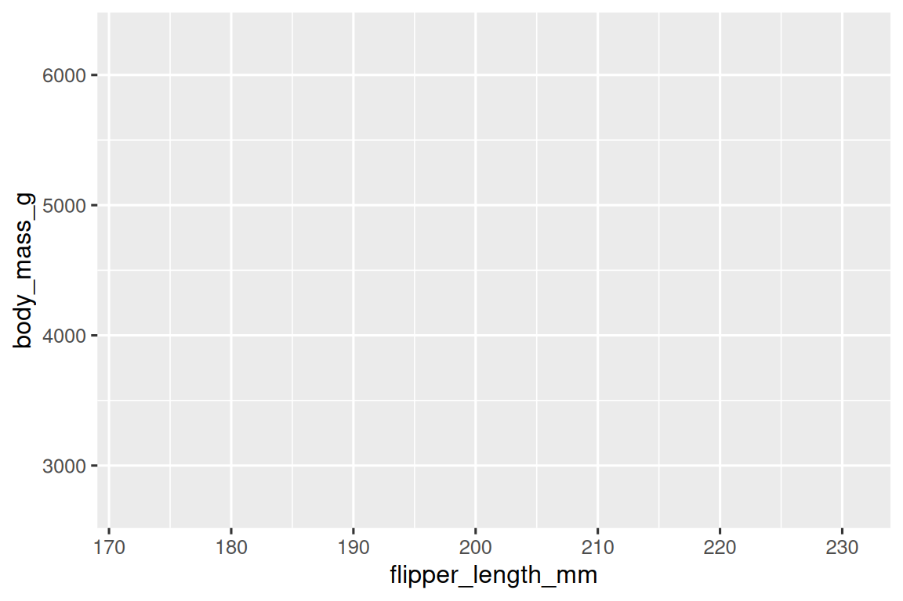

如今这块空白画布已经具备了框架结构：鳍肢长度将展示在 x 轴上，体重将展示在 y 轴上。但代表企鹅的数据点仍然没有出现在图中。这是由于我们还没有在代码里说明，应当以何种形式把数据框中的观测值绘制到图形上。

想要画出数据，我们需要定义一个**几何对象（geom）**：也就是用来展现数据的图形元素。在 ggplot2 中，所有几何对象都由以`geom_`开头的函数实现。人们常常依据绘图所使用的几何对象类型来称呼一张图表。例如：柱状图使用柱状几何对象`geom_bar()`、折线图使用线条几何对象`geom_line()`、箱线图使用箱形几何对象`geom_boxplot()`、散点图使用点几何对象`geom_point()`，以此类推。

`geom_point()` 函数会为图表添加一个**点图层**，从而生成一张**散点图**。ggplot2 提供了大量 geom 函数，每个函数都可以为图表添加不同类型的图层。本书后续内容你将会学到非常多的几何对象，相关内容重点见第 9 章。

```R
ggplot(
  data = penguins,
  mapping = aes(x = flipper_length_mm, y = body_mass_g)
) +
  geom_point()
#> Warning: Removed 2 rows containing missing values or values outside the scale range
#> (`geom_point()`).
```


> [!TIP]
>
> 如何显示的点不够圆，可以安装 `ragg` 包，加载该包，然后将 Options>General>Graphics>Backend 设置为 `AGG`，就能够改善。

现在我们得到了一张**散点图**。虽然它还没有达到我们的 “最终目标” 的效果，但借助这张图，我们已经可以回答最开始提出的问题了：**“鳍肢长度与体重之间存在什么样的关系？”**两者呈现出正相关（鳍足越长，体重越大），且近似线性（样本点聚集在一条直线周围，而非曲线），相关性中等偏强（样本点相对直线不算太分散）。总体而言，鳍肢更长的企鹅，体重通常也更大。

在给这张图添加更多图层之前，我们先停下来看一下运行代码后弹出的警告信息。

> Warning message: Removed 2 rows containing missing values or values outside the scale range (`geom_point()`). 

我们会看到这条提示，是因为数据集中有**两只企鹅**的**体重**和 / 或**鳍足长度**存在**缺失值**，而如果缺少这两个变量中的任意一个，ggplot2 就无法在图上展示它们。和 R 语言一样，ggplot2 遵循的原则是：**缺失值绝不应该被无声忽略**。这类警告可能是你在处理真实数据时最常见的警告之一 ——**缺失值是非常普遍的问题**，在本书中你会学到更多相关内容，尤其是在**第 18 章**。在本章后续的绘图中，我们会**屏蔽这条警告**，以免它在每张图下方都重复出现。

出现这条警告，是因为数据集中有两只企鹅的体重、鳍肢长度存在缺失值。缺少这两项数值，ggplot2 就无法在图上画出它们。和 R 语言本身一样，ggplot2 秉持一条原则：**缺失值绝不应该悄无声息地消失**。这类警告也是你处理真实数据时最常遇见的警告之一：缺失值是数据分析里非常普遍的问题。本书后续章节会详细讲解缺失值。本章剩下的绘图示例中，我们将屏蔽这条警告，避免每一张图都输出该提示。

### 1.2.4 添加美学映射与图层

散点图适合展示两个数值变量之间的关系。但面对变量间呈现出的表面关联，我们应当保持审慎，思考是否还存在其他变量可以解释这一关联，或是改变这种关联的性质。举个例子：鳍肢长度和体重之间的关系，会不会因企鹅物种不同而不一样？我们把物种信息加入图形，看看能否对这组变量的关联得到更多新的发现。实现方式就是用不同颜色的点来代表不同的企鹅物种。

要实现该效果，我们需要修改美学映射（aesthetic）：

```R
ggplot(
  data = penguins,
  mapping = aes(x = flipper_length_mm, y = body_mass_g, color = species)
) +
  geom_point()
```

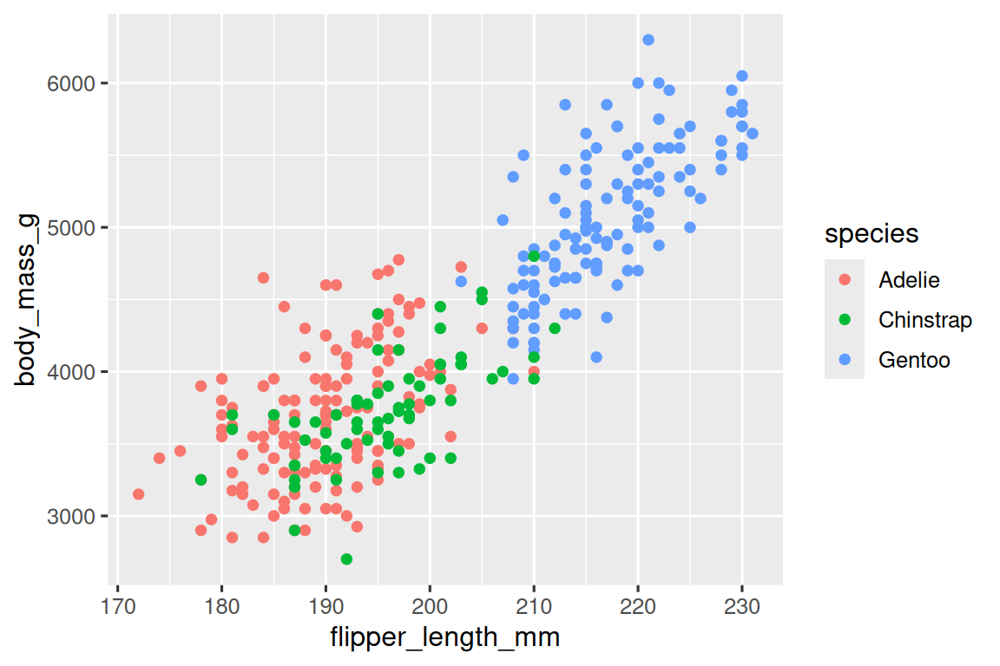

当把一个**分类变量**映射到某个美学属性时，ggplot2 会自动为该变量的每个类别（这里是三种企鹅）分配一个唯一的美学属性值（此处为不同颜色），这个过程称为**标度变换（scaling）**。同时 ggplot2 还会自动生成图例，标注哪种颜色对应哪个类别。

接下来我们再添加一个图层：一条平滑曲线，用来展示体重和鳍肢长度之间的关系。在继续往下操作之前，请回看上面的代码，想一想我们该如何把这条曲线添加到现有的图形当中。

因为这是用来展示数据的全新几何对象，我们需要在散点图层之上新增一个图层：`geom_smooth()`。并且通过设置参数`method = "lm"`，指定绘制基于线性模型的最优拟合直线。

```R
ggplot(
  data = penguins,
  mapping = aes(x = flipper_length_mm, y = body_mass_g, color = species)
) +
  geom_point() +
  geom_smooth(method = "lm")
```

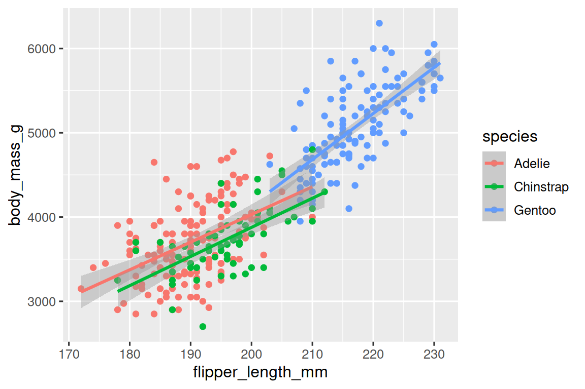

我们虽然成功添加了拟合直线，但生成的图形和本章最开始的目标效果图并不一样。目标图对**全部数据只绘制一条回归线**，而不是为每一个企鹅物种各自生成一条独立的直线。

如果美映射在`ggplot()`函数中定义，也就是**全局层级**，那么该映射会传递给后续每一个几何图层。不过 ggplot2 里每一个 geom 图层函数也可以设置`mapping`参数，实现**局部美学映射**，局部映射会叠加到从全局继承而来的映射之上。我们希望散点按照物种区分颜色，但回归线不需要按物种分开绘制，因此只需要在`geom_point()`内指定`color = species`即可。

```R
ggplot(
  data = penguins,
  mapping = aes(x = flipper_length_mm, y = body_mass_g)
) +
  geom_point(mapping = aes(color = species)) +
  geom_smooth(method = "lm")
```

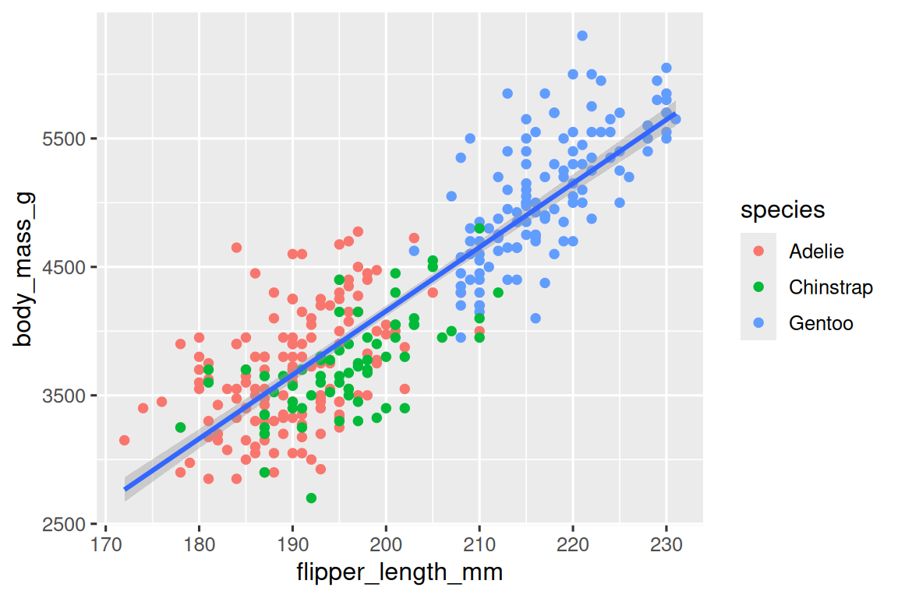

现在的图表已经和最终目标效果图非常接近了，但还不够完美。我们还需要为不同种类的企鹅设置**不同形状**，并完善图表的**标签**。

通常来说，在图表中只依靠颜色来展示信息并不好，。因为色盲或者其他色觉差异，会导致人们对颜色的感知有所不同。因此，除了颜色之外，我们还可以将物种映射到形状美学属性上。

```R
ggplot(
  data = penguins,
  mapping = aes(x = flipper_length_mm, y = body_mass_g)
) +
  geom_point(mapping = aes(color = species, shape = species)) +
  geom_smooth(method = "lm")
```

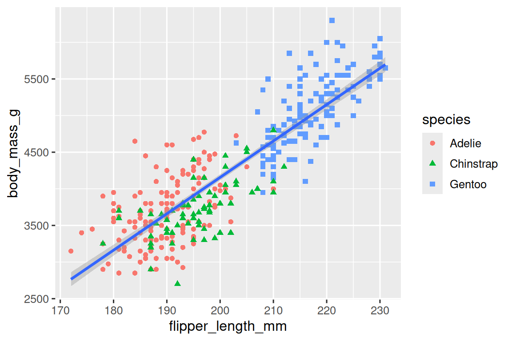

请注意，图例也会随之自动更新，显示出各个点对应的不同形状。

最后，我们可以在新图层中使用 `labs()` 函数来完善图表的标签。`labs()` 的部分参数的含义：`title` 为图表添加**标题**，`subtitle` 添加**副标题**。其他参数与美学映射相对应：`x` 是 x 轴标签，`y` 是 y 轴标签，`color` 和 `shape` 用于设置**图例的名称**。此外，我们还可以使用 `ggthemes` 包中的 `scale_color_colorblind()` 函数，将调色板修改为**色盲友好配色**。


最后，我们可以新增一个图层，借助`labs()`函数优化图表的标签。`labs()`里部分参数含义一目了然：

- `title`用于添加主标题
- `subtitle`添加副标题。

其余参数与美学映射一一对应：

- `x`设置 x 轴标签，`y`设置 y 轴标签；
- `color`与`shape`用来定义图例的名称。

除此之外，我们还可以使用`ggthemes`包中的`scale_color_colorblind()`函数更换配色，选用对色盲人群友好的安全色板。

```R
ggplot(
  data = penguins,
  mapping = aes(x = flipper_length_mm, y = body_mass_g)
) +
  geom_point(aes(color = species, shape = species)) +
  geom_smooth(method = "lm") +
  labs(
    title = "Body mass and flipper length",
    subtitle = "Dimensions for Adelie, Chinstrap, and Gentoo Penguins",
    x = "Flipper length (mm)", y = "Body mass (g)",
    color = "Species", shape = "Species"
  ) +
  scale_color_colorblind()
```


这样就得到了一张和 “最终目标” 效果图完全一致的图形！

### 1.2.5 练习

1. `penguins` 数据集中有多少行、多少列？

```R
> penguins
# A tibble: 344 × 8
   species island    bill_length_mm bill_depth_mm flipper_length_mm body_mass_g sex     year
   <fct>   <fct>              <dbl>         <dbl>             <int>       <int> <fct>  <int>
 1 Adelie  Torgersen           39.1          18.7               181        3750 male    2007
 2 Adelie  Torgersen           39.5          17.4               186        3800 female  2007
 3 Adelie  Torgersen           40.3          18                 195        3250 female  2007
 4 Adelie  Torgersen           NA            NA                  NA          NA NA      2007
 5 Adelie  Torgersen           36.7          19.3               193        3450 female  2007
 6 Adelie  Torgersen           39.3          20.6               190        3650 male    2007
 7 Adelie  Torgersen           38.9          17.8               181        3625 female  2007
 8 Adelie  Torgersen           39.2          19.6               195        4675 male    2007
 9 Adelie  Torgersen           34.1          18.1               193        3475 NA      2007
10 Adelie  Torgersen           42            20.2               190        4250 NA      2007
# ℹ 334 more rows
# ℹ Use `print(n = ...)` to see more rows
```

344 行，8 列。

2. penguins 数据框中的 `bill_depth_mm` 变量描述的是什么？使用 `?penguins` 查看帮助文档来找答案。

```
bill_length_mm
a number denoting bill length (millimeters)
```

3. 绘制一张 `bill_depth_mm` 与 `bill_length_mm` 的散点图。也就是将 `bill_depth_mm` 放在 y 轴，`bill_length_mm` 放在 x 轴绘制散点图，并描述这两个变量之间的关系。

```R
ggplot(
  data = penguins,
  mapping = aes(x = bill_length_mm, y = bill_depth_mm)
) +
  geom_point(aes(color = species, shape = species)) +
  labs(
    x = "Bill length (mm)", y = "Bill depth (g)"
  ) +
  scale_color_colorblind()
```

## 1.3 ggplot2 调用

在结束这些入门章节之后，我们接下来会改用更加精简的写法编写 ggplot2 代码。到目前为止，我们写的代码都十分详尽完整，这种写法对于初学者非常友好。

```R
ggplot(
  data = penguins,
  mapping = aes(x = flipper_length_mm, y = body_mass_g)
) +
  geom_point()
```

一般而言，一个函数最前面一两个参数至关重要，你应当熟记于心。`ggplot()`函数的前两个参数依次为数据集`data`与美学映射`mapping`。本书后续章节，我们就不再显式写出这两个参数的名称了。这样既能减少打字工作量，删减冗余文字后，也更容易对比出多张绘图代码之间的差异。这是一项非常重要的编程思路，我们将会在函数章节再回过头深入探讨该问题。

将前面的绘图改用精简写法，得到如下代码：

```R
ggplot(penguins, aes(x = flipper_length_mm, y = body_mass_g)) + 
  geom_point()
```

## 1.4 分布可视化

选择何种方式展示一个变量的分布，取决于该变量的类型：分类变量或是数值变量。

### 1.4.1 分类变量

如果一个变量只能取有限集合内的若干取值，那它就是分类变量。想要考察分类变量的分布，可以使用柱状图。柱子的高度代表每个 x 取值对应的观测数量。

```R
ggplot(penguins, aes(x = species)) +
  geom_bar()
```

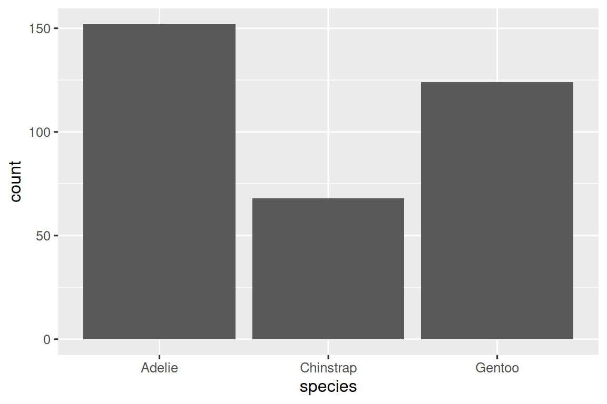

对于无顺序的分类变量（如企鹅物种）绘制柱状图时，通常建议按照各类别的频数对柱子重新排序。要实现该效果，需要先将变量转换成因子（R 语言存储分类数据的数据类型），再重新调整该因子的水平顺序。

```R
ggplot(penguins, aes(x = fct_infreq(species))) +
  geom_bar()
```

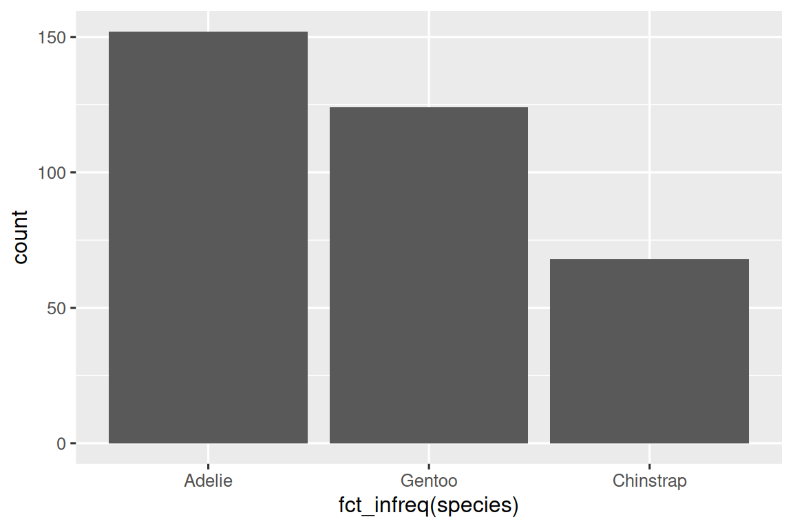

关于因子以及处理因子的各类函数（例如上面展示的`fct_infreq()`），后续会做更详尽的讲解。

### 1.4.2 数值变量

如果一个变量可以取大范围的数值，并且可以对其做加减、求平均这类运算，那它就是**数值变量**（也叫定量变量）。数值变量分为连续型与离散型两类。 

展示连续变量分布最常用的可视化方式是直方图。

```R
ggplot(penguins, aes(x = body_mass_g)) +
  geom_histogram(binwidth = 200)
```

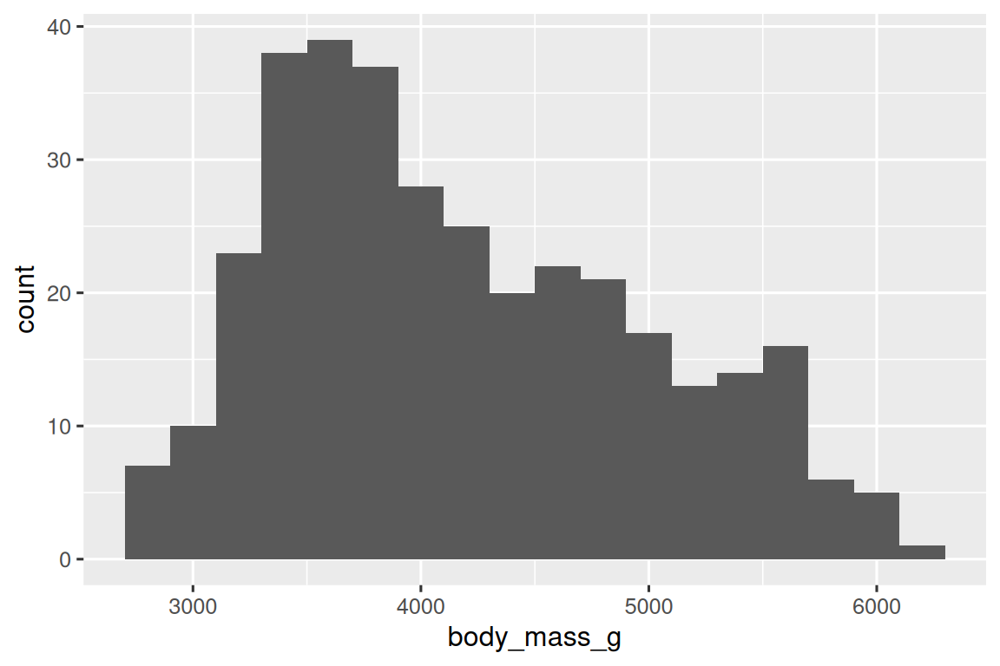

直方图将 x 轴切分为等间距的箱体（bins），再利用柱子的高度展示落入每个箱体中的观测数量。在上图里，最高的柱子代表有 39 个观测的`body_mass_g`（体重，单位克）取值介于 3500‑3700 克之间，这两个数值分别是该柱子的左、右边界。

可以使用`binwidth`参数设置直方图的区间宽度，该参数单位与 x 轴变量的单位保持一致。绘制直方图时应当尝试多种箱体宽度，因为不同的箱体宽度会展现出不一样的数据模式。下面几张图中，`binwidth = 20`设置的区间过窄，生成了数量过多的柱子，难以看清分布的整体形态。与之类似，`binwidth = 2000`又设置得过大，全部数据只被划分到 3 个箱体中，同样无法看清分布形态。而`binwidth = 200`取得了比较合适的平衡。

```R
ggplot(penguins, aes(x = body_mass_g)) +
  geom_histogram(binwidth = 20)
ggplot(penguins, aes(x = body_mass_g)) +
  geom_histogram(binwidth = 2000)
```

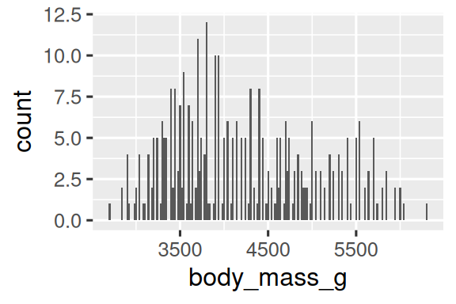

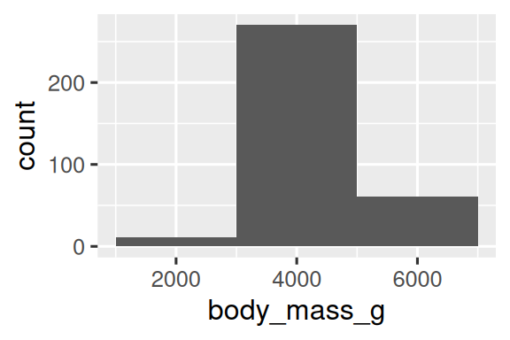

数值变量分布的另一种可视化方案是**密度图**。密度图相当于经过平滑处理后的直方图，是一个很实用的替代选择，尤其适合本身服从平滑分布的连续型数据。我们不深入讲解`geom_density()`是如何估算密度值的（你可以查阅该函数的官方文档了解更多细节），这里用一个类比来解释密度曲线的绘制原理。想象一个由木块搭建而成的直方图，再取一根煮熟的意大利面条，把它搭在这些木块上方。面条覆盖木块之后呈现出来的轮廓，就可以类比成密度曲线的形状。相比直方图，密度图展示的细节更少，但能够让你更快把握分布的整体形态，尤其是众数和偏态特征。

```R
ggplot(penguins, aes(x = body_mass_g)) +
  geom_density()
#> Warning: Removed 2 rows containing non-finite outside the scale range
#> (`stat_density()`).
```

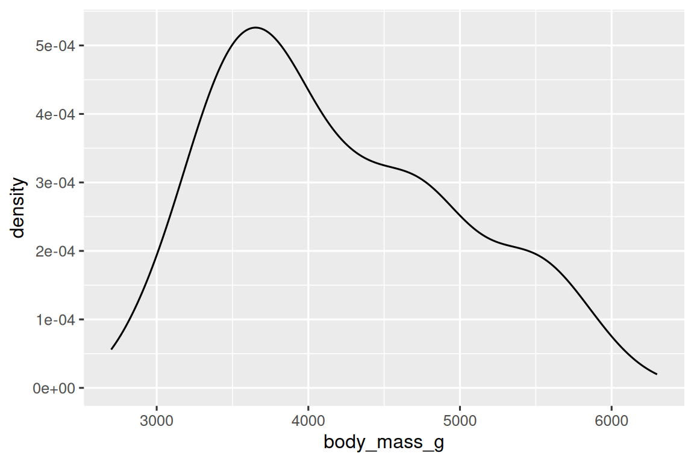

###  1.4.3 练习题

1. 绘制企鹅物种的条形图，把`species`映射到`y`美学属性。这张图和原来的图有什么区别？

```R
ggplot(penguins, aes(y = species)) +
  geom_bar()
```

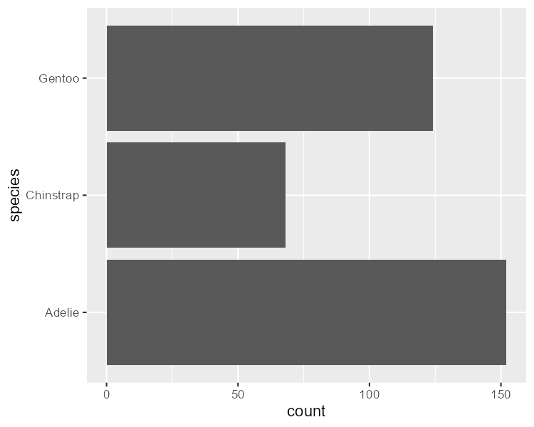

条形图，从垂直变为水平。

2. 下面两张图有什么不同？`color`和`fill`这两个美学属性，哪一个更适合修改柱子的颜色？

```R
ggplot(penguins, aes(x = species)) +
  geom_bar(color = "red")

ggplot(penguins, aes(x = species)) +
  geom_bar(fill = "red")
```

第一个将 bar 的边框设置为红色，第二个整个填充为红色。

## 1.5 变量间关系可视化

想要可视化变量之间的关系，至少需要把两个变量映射到图形的美学属性上。接下来介绍展示两个或多个变量间关系的常用图表，以及绘制这些图表所用到的几何对象（geoms）。

### 1.5.1 一个数值变量与一个分类变量

想要可视化一个数值变量与一个分类变量之间的关系，可以使用并列箱线图。依靠位置统计量（百分位数）来描述数据分布，同时它也非常适合识别潜在的异常值。如图 1.1 所示，每一个箱线图由以下部分构成：

- **箱体**：代表数据中间一半的取值范围，该区间长度称为**四分位距（IQR）**，从分布的 25 分位数延伸至 75 分位数。箱体中间有一条横线，表示分布的**中位数（即 50 分位数）**。通过这三条参考线，我们可以感知数据的离散程度，还能判断分布相对于中位数是对称的，还是向某一侧偏斜。
- **离群点**：如果观测值距离箱体任意一边的距离超过 1.5 倍四分位距，就会被绘制成独立散点。这类离群观测属于异常样本，因此会单独显示。
- **须线（触须）**：从箱体的两端向外延伸，终止于分布里最远的**非离群**数据点。


> 图 1.1：箱线图绘制原理示意图

接下来，我们使用`geom_boxplot()`箱线图，查看**按物种分组的企鹅体重分布**：

```R
ggplot(penguins, aes(x = species, y = body_mass_g)) +
  geom_boxplot()
```

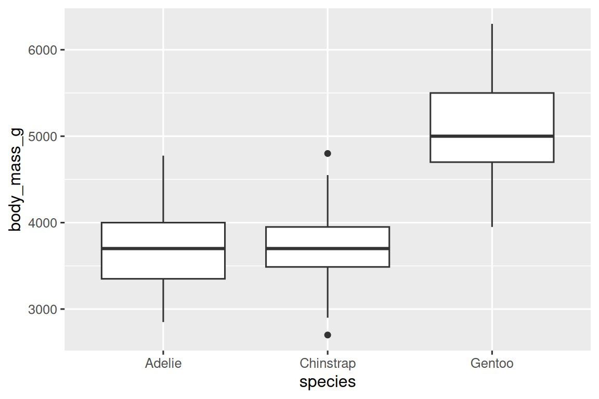

也可以选择使用`geom_density()`绘制密度图。

```R
ggplot(penguins, aes(x = body_mass_g, color = species)) +
  geom_density(linewidth = 0.75)
```

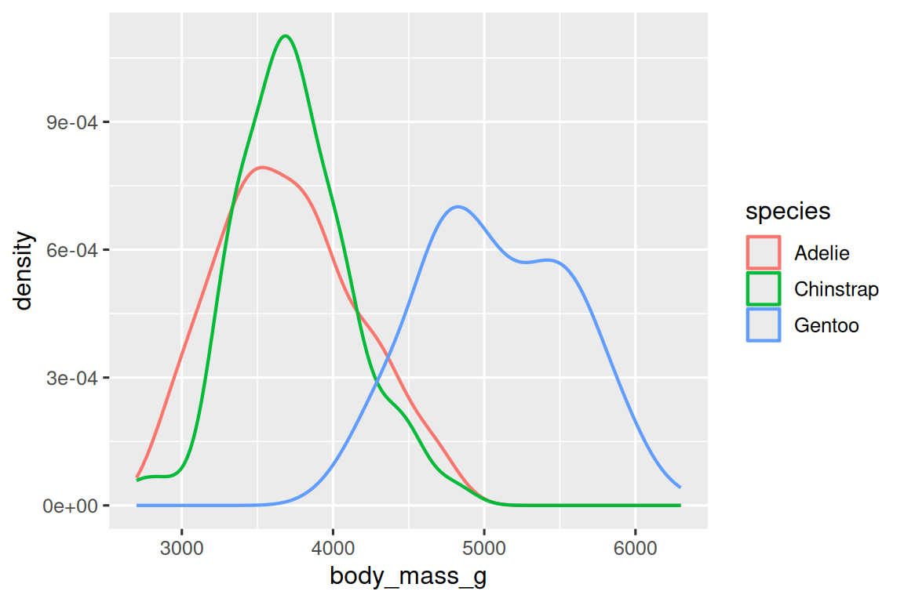

我们通过`linewidth`参数自定义线条粗细，使曲线相较于背景更加醒目。 

除此之外，我们既可以将物种映射到`color`（轮廓颜色），又可以映射到`fill`（填充色），同时借助`alpha`美学属性为填充后的密度曲线添加透明度。`alpha`的取值范围为 0‑1：0 代表完全透明，1 代表完全不透明。下图中将该参数设置为 0.5。

```R
ggplot(penguins, aes(x = body_mass_g, color = species, fill = species)) +
  geom_density(alpha = 0.5)
```

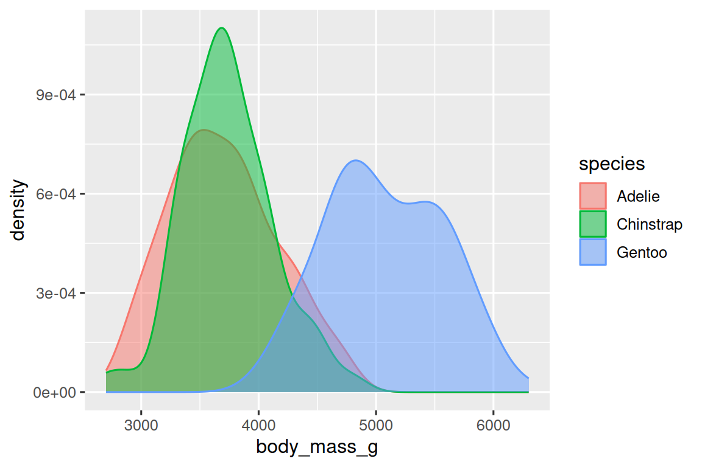

请注意此处用到的术语：

-  如果希望图形的视觉属性随某个变量的取值发生变化，我们就称**将变量映射到美学属性**。 
- 反之，则是**直接给美学属性设定固定值**。

### 1.5.2 两个分类变量

可以使用**堆叠条形图**来可视化两个分类变量之间的关系。举个例子，下面两张堆叠条形图都展示了`island`（岛屿）与`species`（企鹅物种）的关联，更具体地说，是展示**各个岛屿内部企鹅物种的分布情况**。

第一张图展示了每座岛屿上各个企鹅物种的频数。从这张频数图可以看到，阿德利企鹅（Adelie）在三座岛屿上的样本数量大致相等。但这张图**很难直观看出每一座岛屿内部各物种的占比构成**。

```R
ggplot(penguins, aes(x = island, fill = species)) +
  geom_bar()
```

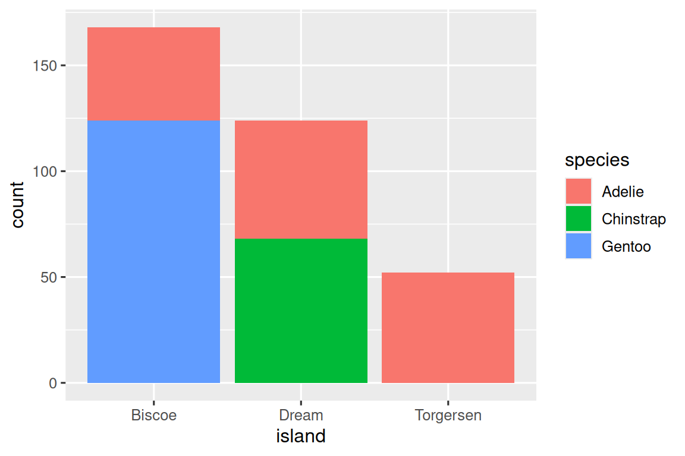

第二张图是相对频数图，通过在几何对象中设置`position = "fill"`得到。它更适合在不同岛屿之间对比物种分布，不会受到各岛屿企鹅样本总量不等的干扰。从这张图可以看出：巴布亚企鹅（Gentoo）全部栖息在比斯科岛（Biscoe），约占该岛屿企鹅总数的 75%；帽带企鹅（Chinstrap）全部生活在德瑞姆岛（Dream），约占该岛屿企鹅的 50%；而阿德利企鹅（Adelie）在三座岛屿均有分布，托尔格森岛（Torgersen）上的企鹅全部都是阿德利企鹅。

```R
ggplot(penguins, aes(x = island, fill = species)) +
  geom_bar(position = "fill")
```


在绘制这类条形图时，我们把用来划分一根根柱子的变量映射给`x`美学属性，把控制柱子内部颜色变化的变量映射给`fill`美学属性。但有一点不太方便：ggplot2 默认会将 y 轴标签命名为`count`（频数）。我们可以新增一层`labs()`，把 y 轴标签手动指定为`proportion`（占比），以此覆盖这个默认设置。

```R
ggplot(penguins, aes(x = island, fill = species)) +
  geom_bar(position = "fill") +
  labs(y = "proportion")
```

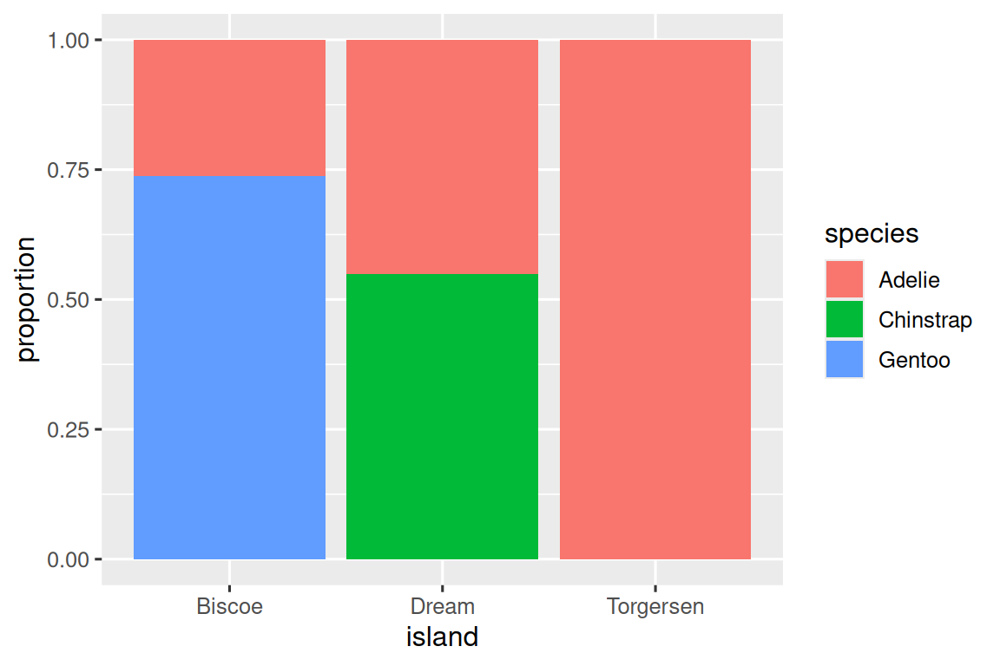

### 1.5.3 两个数值变量

到目前为止，你已经学习了两种用来可视化两个数值变量之间关系的图形：**散点图**（由`geom_point()`生成）和**平滑拟合曲线**（由`geom_smooth()`生成）。散点图大概是展示两个数值变量关联关系最常用的图表。

```R
ggplot(penguins, aes(x = flipper_length_mm, y = body_mass_g)) +
  geom_point()
```

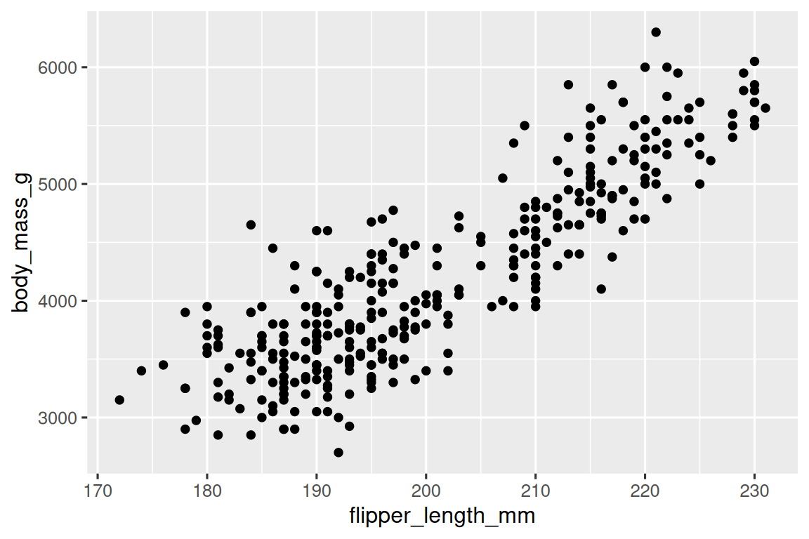

### 1.5.4 三个及以上变量

正如在前面 [添加美学映射与图层](#124-添加美学映射与图层) 所看到的，我们可以把更多变量映射到额外的美学属性，从而在一张图中纳入多个变量。举个例子，下面这张散点图里，点的颜色代表企鹅物种，点的形状代表所属岛屿。

```R
ggplot(penguins, aes(x = flipper_length_mm, y = body_mass_g)) +
  geom_point(aes(color = species, shape = island))
```

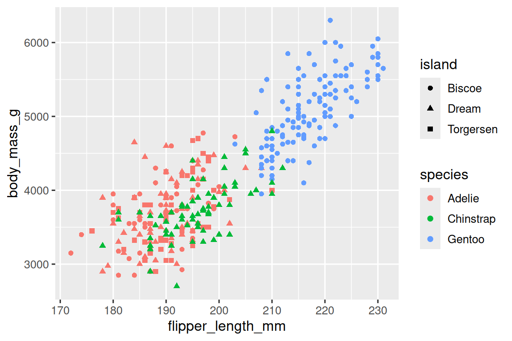

但如果在一张图上设置过多美学映射，图形就会杂乱不堪，难以解读。另一种处理方式尤其适合分类变量：把图表切分为**分面（facets）**，也就是若干个子图，每个子图展示数据集的一个子集。

如果要依据单个变量对图表做分面，请使用`facet_wrap()`函数。`facet_wrap()`的第一个参数是**公式（formula）**，写法为波浪号`~`后接变量名。传入`facet_wrap()`的变量必须是分类变量。

```R
ggplot(penguins, aes(x = flipper_length_mm, y = body_mass_g)) +
  geom_point(aes(color = species, shape = species)) +
  facet_wrap(~island)
```

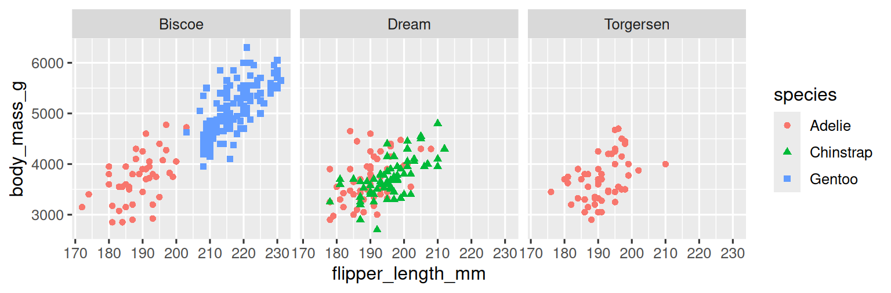

## 1.6 保存图形

绘制完图形之后，你可能希望把它从 R 中导出，保存为图片，用于其他场合。这正是`ggsave()`函数的用途：它会把最近生成的图保存到磁盘上：

```R
ggplot(penguins, aes(x = flipper_length_mm, y = body_mass_g)) +
  geom_point()
ggsave(filename = "penguin-plot.png")
```

上述代码会把图片保存到你的**工作目录**。

如果你没有指定宽度`width`和高度`height`，`ggsave()`会直接沿用当前绘图设备的尺寸。想要写出可复现的代码，建议显式指定宽高参数。

不过一般情况下，我们推荐使用 **Quarto** 来撰写最终报告。Quarto 是一套可复现的文档编写系统，你可以把 R 代码和文字叙述穿插在一起，绘图会自动嵌入文档。第 28 章会进一步介绍 Quarto。

## 1.7 常见问题

刚开始运行 R 代码时，你很可能会遇到报错。别担心，每个人都会碰到这种情况。我们写 R 代码已经很多年，但依旧经常写出无法一次运行成功的代码！

第一步：仔细对照你写的代码和书中示例代码。R 对语法极其严格，一个字符放错位置，结果就会完全不一样。务必保证每一个左括号`(`都有对应的右括号`)`，每一个双引号`"`都成对闭合。

有时候运行代码之后控制台什么输出都没有。观察控制台左侧提示符，如果出现`+`，代表 R 判定你输入的表达式不完整，正在等待你继续输入剩余代码。遇到这种情况，按下 **ESC 键** 终止当前命令，重新写代码即可。

使用 ggplot2 绘图有一个高频错误：`+`加号放错位置。**加号必须写在行的末尾，不能写在下一行的开头**。千万不要写成下面这种错误形式：

```
ggplot(data = mpg)
+ geom_point(mapping = aes(x = displ, y = hwy))
```

✅正确写法：

```
ggplot(data = mpg) +
  geom_point(mapping = aes(x = displ, y = hwy))
```

如果问题还没解决，可以查阅帮助文档。在控制台输入`?函数名`，或者在 RStudio 选中函数名按 **F1** 快捷键，就可以打开该函数帮助页面。如果帮助文档正文读不懂，可以直接跳到文档的示例部分，找和你目标接近的参考代码。

要是还不行，仔细阅读报错信息，很多时候解决方案就藏在报错文本里面。不过 R 初学者即便看到报错，也未必看得懂含义。这时可以把报错文本复制去搜索引擎搜索，大概率已经有人遇到过一模一样的问题并且在网上得到了解答。

## 1.8 本章小结

本章介绍了使用 ggplot2 进行数据可视化的基础知识。从支撑 ggplot2 的核心理念开始：**可视化就是将数据中的变量映射到位置、颜色、大小、形状这类美学属性**。之后学习了如何逐层增加图形的复杂度、优化图形展示效果。同时你也掌握了一系列常用图表：既可以可视化单个变量的分布，也可以展示两个及以上变量之间的关系，实现手段包括使用更多美学映射，或是借助分面将图表拆分为多子图（小多图）。

本书后续会反复使用可视化相关内容，遇到新场景就会引入新的绘图技术；第 9‑11 章还会对 ggplot2 绘图做更加深入的讲解。

掌握可视化基础之后，下一章我们转换方向，介绍一些实用的代码工作流建议。本书这一部分会穿插讲解工作流与数据科学工具，随着你编写的 R 代码越来越多，这些内容可以帮你保持代码井然有序。
