# 探索性数据分析

@since 2026-09-17⭐
@author Jiawei Mao
***
## 1. 引言

本章介绍如何运用可视化和数据转换来探索数据，统计学家将其称为**探索性数据分析**（Exploratory Data Analysis，简称 EDA）。EDA 是一个不断迭代的循环过程：

1. 针对数据提出问题;
2. 通过数据可视化、转换和建模来寻找答案;
3. 利用获得的认知来优化现有问题，或提出新问题。

EDA 并不是一个有着严格规则的形式化流程，而是一种思维状态。在 EDA 初始阶段，你应该放开手脚，去探索每一个想法。有些想法会开花结果，有些则会走进死胡同。随着探索的深入，你会逐渐聚焦于少数几个具有价值的问题，并最终将其整理成文，与他人分享交流。

EDA 是任何数据分析中不可或缺的一环。即使核心研究问题已经摆在你面前，你依然需要去检验数据的质量。数据清洗只是 EDA 的一种应用场景：你需要不断追问数据是否符合预期。为了完成数据清洗，你需要动用 EDA 的所有工具：可视化、数据转换以及建模。

### 1.1 前置准备

本章将结合之前学过的 `dplyr` 和 `ggplot2`，通过交互的方式提出问题、用数据解答问题，然后再提出新的问题。

```r
library(tidyverse)
```

## 2. 提出问题

探索性数据分析（EDA）的目标是加深对数据的理解。实现这一目标最简单的方法，就是把“问题”作为引导探索的工具。当你提出一个问题时，你会特别注意数据集的某个特定部分，并帮助你决定应该绘制哪种图表、构建哪种模型或进行何种数据转换。

EDA 从根本上说是一个充满创造力的过程。与大多数创造性过程一样，提出高质量问题的关键在于**先提出足够多的问题**。在分析初期，你还不清楚能从数据集中挖掘出什么洞察，因此很难直接提出直击要害的问题。但另一方面，你提出的每一个新问题，都会向你展示数据的一个新侧面，从而增加你获得重大发现的机会。只要你能根据每次的发现不断追问新问题，你就能迅速深入数据中最有趣的部分，并逐渐形成一系列引人深思的问题。

关于应该提出哪些问题来引导研究，并没有绝对的规则。不过，有两类问题对于在数据中挖掘发现始终非常有用。你可以将它们大致表述为：

1. 变量内部存在何种变异（variation）？
2. 变量之间存在何种协变（covariation）？

下面将围绕这两个问题展开，并解释什么是变异和协变，并向你展示解答这两个问题的多种方法。

## 3. 变异（Variation）

**变异 (Variation)**，是指变量的值在不同测量之间变化的趋势。在现实生活中，变异现象随处可见：如果你对任何一个连续变量进行两次测量，通常都会得到两个不同的结果。即便你测量的是像光速这样的恒定物理量，也是如此。因为你的每一次测量都会包含微小的误差，而这些误差每次都会有所不同。此外，当你在不同对象之间（例如不同人的眼睛颜色）或不同时间点（例如电子在不同时刻的能量水平）进行测量时，变量也会表现出差异。每个变量都有其独特的变异模式，这种模式能揭示出许多有趣的信息——无论是同一观测对象在不同测量间的变化，还是不同观测对象之间的差异。想要深入了解这种模式，最好的方法就是直观地展示变量值的分布情况，这也是你在第 1 章中已经学过的内容。

接下来，我们将通过可视化 `diamonds`（钻石）数据集中约 54,000 颗钻石的重量（克拉，carat）分布，来开启我们的探索之旅。由于克拉是一个数值型变量，我们可以使用直方图（histogram）来进行展示：

```r
library(tidyverse)

ggplot(diamonds, aes(x = carat)) +
  geom_histogram(binwidth = 0.5)
```

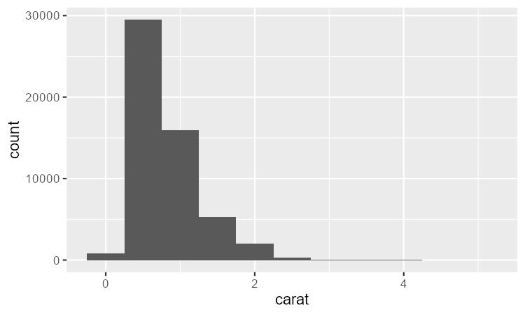

当我们用图表展现数据差异时，应当重点观察图表中哪些内容？又该提出哪些问题？下面整理了一份清单，列出了能从图中获取的有价值的各类信息，并针对每类信息附上一些跟进问题。提出高质量跟进问题的关键，在于兼顾你的**好奇心**（你想进一步了解什么？）与**批判性思维**（这一结果可能存在哪些误导性？）。

### 3.1 典型值

无论是条形图还是直方图，柱子越高，代表对应变量的取值越常见；柱子越矮，对应的取值就越稀少。没有柱子的位置，说明你的数据里没有出现过这个数值。想要从图表信息里挖掘出有价值的问题，重点就是去寻找**出乎意料的地方**：

- 哪些数值出现得最多？背后是什么原因？
- 哪些数值很少见？为什么？和你预想的一致吗？
- 有没有看到特殊的分布规律？如何解释这些现象？

我们来看小克拉钻石的克拉（`carat`）重量分布：

```R
library(tidyverse)

smaller <- diamonds |>
  filter(carat < 3)

ggplot(smaller, aes(x = carat)) +
  geom_histogram(binwidth = 0.01)
```

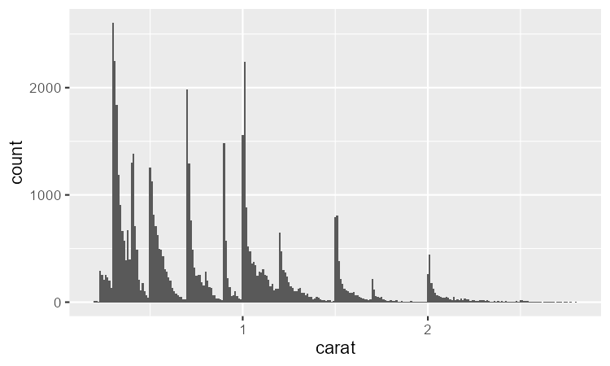

这张直方图有几个有意思的地方：

- 为什么整数克拉和常见分数克拉的钻石数量会更多？
- 为什么每个峰值的右侧钻石数量会略多于左侧？

可视化能帮我们发现 `cluster`，这往往代表数据里存在 `subgroup`。想要理解这些 `subgroup`，可以问问自己：

- 同一 `subgroup` 里的样本，有哪些共性？
- 不同 `subgroup` 之间的样本，差别在哪里？
- 我们该如何描述、解释这些 `cluster`？
- 有没有可能，这些 `cluster` 只是假象，会误导我们？

这些问题，有些可以靠现有数据回答，有些则需要对应领域的专业知识。很多时候，这些疑问会引导我们去探索变量之间的关联，比如看看一个变量的取值，能不能解释另一个变量的变化规律。这部分内容后面会讲到。

### 3.2 异常值

**离群点（outliers）** 就是反常的观测值：看起来不符合整体分布模式的数据点。 离群点有时是录入错误；有时只是本次采集里刚好出现的极端观测；还有的时候，它们预示着重要的新发现。当数据量很大时，直方图里很难看出离群点。以 `diamonds` 数据集里的变量 `y` 的分布为例：唯一能看出存在异常值的线索，就是横轴范围很宽。

```R
library(tidyverse)

ggplot(diamonds, aes(x = y)) +
  geom_histogram(binwidth = 0.5)
```

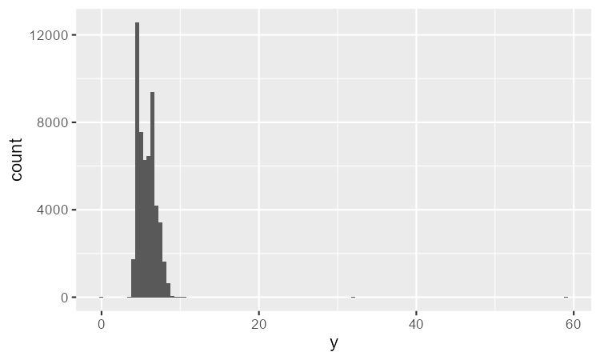

大部分观测都集中在常规区间，少数异常区间的柱子极矮，很难看清（0附近勉强能发现一点）。 想要清晰看到异常值，需要用 `coord_cartesian()` 调整y轴范围：

```R
library(tidyverse)

ggplot(diamonds, aes(x = y)) +
  geom_histogram(binwidth = 0.5) +
  coord_cartesian(ylim = c(0, 50))
```

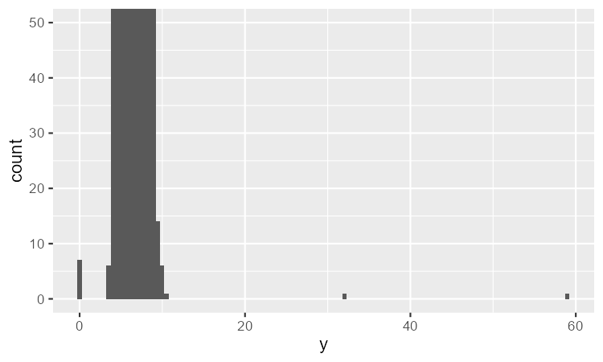

`coord_cartesian()` 还支持用 `xlim` 参数调整 x 轴范围。ggplot2 还有单独的 `xlim()` / `ylim()` 函数，但二者行为有区别：`xlim()/ylim()` 会直接丢弃范围外的数据，而 `coord_cartesian` 只是缩放视图，保留全部原始数据。

放大后我们能看到三类异常值：`0`、`~30`、`~60`。 我们用 `dplyr` 把它们提取出来：

```R
> unusual <- diamonds |>
+   filter(y < 3 | y > 20) |>
+   select(price, x, y, z) |>
+   arrange(y)
> 
> unusual
# A tibble: 9 × 4
  price     x     y     z
  <int> <dbl> <dbl> <dbl>
1  5139  0      0    0   
2  6381  0      0    0   
3 12800  0      0    0   
4 15686  0      0    0   
5 18034  0      0    0   
6  2130  0      0    0   
7  2130  0      0    0   
8  2075  5.15  31.8  5.12
9 12210  8.09  58.9  8.06
```

变量 `y` 代表钻石三个维度之一，单位 mm。钻石的宽度不可能是 0mm，所以这些 0 可定不对。 通过探索性数据分析（EDA），我们找到了**用0编码的缺失值**——如果只是简单查找 `NA`，根本发现不了这类隐藏缺失。后续处理时，可以把这些 0 重编码为`NA`，避免计算结果被误导。另外两个值 31.8mm、58.9mm 也明显不合理：钻石长度超过1英寸，但价格却没有几十万美金的级别，明显可疑。

✅ 实操准则：**分别保留离群点、剔除离群点，重复做两遍分析**

- 如果离群点对最终结果影响很小，且找不到异常成因，可以剔除继续分析。
- 如果离群点显著改变分析结论，**不能无理由直接删掉**。要追查异常来源（比如录入错误），并且在报告里写明你剔除了这部分数据。

### 3.3 练习题

1. 探索 `diamonds` 中 x、y 和 z 每个变量的分布。你学到了什么？想一想一颗钻石，以及你可能会如何判断哪个维度是长度、宽度和深度。

2. 探索 `price` 的分布。你是否发现任何不寻常或令人惊讶的地方？（提示：仔细考虑 `binwidth`，确保尝试范围广泛的多个取值。）

3. 有多少颗钻石是 0.99 克拉？有多少颗是 1 克拉？你认为这种差异的原因是什么？

4. 在直方图上放大时，比较 `coord_cartesian()` 与 `xlim()` 或 `ylim()`。如果不设置 `binwidth` 会发生什么？如果你尝试缩放，使得只显示半个柱子，会发生什么？

## 4. 异常值

如果你在数据集中遇到了异常值，并且想继续进行分析，你有两种选择。

1. 删除包含奇怪值的数据：

```r
diamonds2 <- diamonds |> 
  filter(between(y, 3, 20))
```

我们不推荐，因为一个无效值并不意味着该样本的其它值也无效。此外，如果你的数据质量很低，当你对每个变量都应用这种方法，你可能会发现已经没有数据剩下了！

2. 相反，我们建议将异常值替换为缺失值。最简单的方法是使用 `mutate()` 将该变量替换为一个修改后的副本。你可以使用 `if_else()` 函数将异常值替换为 `NA`：

```r
diamonds2 <- diamonds |> 
  mutate(y = if_else(y < 3 | y > 20, NA, y))
```

ggplot2 不会绘制缺失值，但它会警告这些值已被移除：

```r
library(tidyverse)

diamonds2 <- diamonds |>
  mutate(y = if_else(y < 3 | y > 20, NA, y))

ggplot(diamonds2, aes(x = x, y = y)) +
  geom_point()
#> Warning: Removed 9 rows containing missing values or values outside the scale range
#> (`geom_point()`).
```

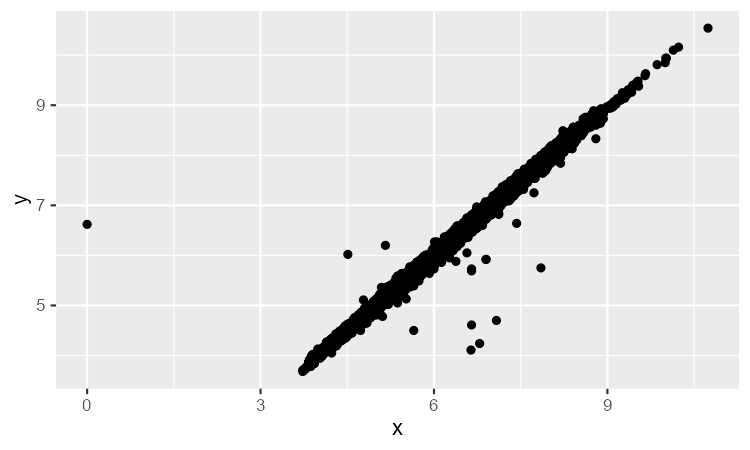

设置 `na.rm = TRUE` 可以禁止该警告：

```r
ggplot(diamonds2, aes(x = x, y = y)) + 
  geom_point(na.rm = TRUE)
```

你可能想了解是什么原因导致缺失值。例如，在 `nycflights13::flights` 中，`dep_time` 变量中的缺失值表示航班被取消。因此，你可能想比较取消航班和未取消航班的计划起飞时间。你可以通过创建一个新变量来实现这一点，使用 `is.na()` 检查 `dep_time` 是否缺失。

```r
library(tidyverse)

nycflights13::flights |>
  mutate(
    calcelled = is.na(dep_time),
    sched_hour = sched_dep_time %/% 100,
    sched_min = sched_dep_time %% 100,
    sched_dep_time = sched_hour + (sched_min / 60)
  ) |>
  ggplot(aes(x = sched_dep_time)) +
  geom_freqpoly(aes(color = calcelled), binwidth = 1 / 4)
```

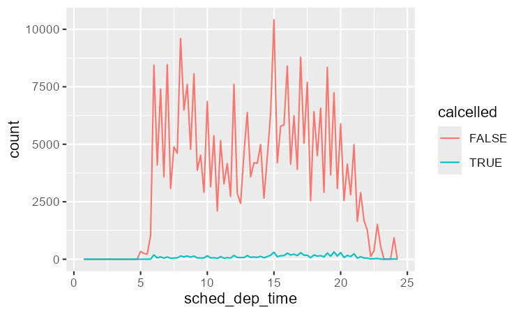

不过这个图并不理想，因为未取消航班比取消航班多得多。在下一节中，我们将探讨一些改进这种比较的技术。

### 4.1 练习

1. 直方图中的缺失值会发生什么？条形图中的缺失值会发生什么？为什么直方图和条形图处理缺失值的方式会有差异？

2. 在 `mean()` 和 `sum()` 中，`na.rm = TRUE` 有什么作用？

3. 重新创建 `scheduled_dep_time` 频率图，并按航班是否取消着色。同时按 `cancelled` 变量分面。尝试分面函数中 `scales` 变量的不同取值，以减轻未取消航班多于取消航班的影响。

## 5. 协变（Covariation）

变异描述的是一个变量内部的行为，而协变描述的是变量之间的行为。协变是两个或多个变量的值以相关方式一起变化的趋势。发现协变的最佳方式是可视化两个或多个变量之间的关系。

### 5.1 分类变量和数值变量

例如，使用 `geom_freqpoly()` 探索钻石价格如何随其质量（由 `cut` 衡量）变化：

```r
library(tidyverse)

ggplot(diamonds, aes(x = price)) +
  geom_freqpoly(aes(color = cut), binwidth = 500, linewidth = 0.75)
```

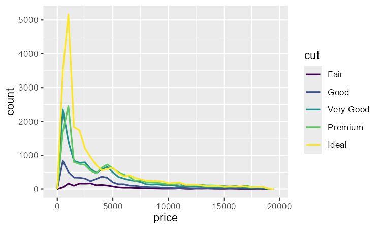

注意，ggplot2 对 `cut` 使用有序 color-scale，因为它在数据中被定义为有序 factor。

这里 `geom_freqpoly()` 的默认样式不太有用，因为由总计数决定的高度在不同 `cut` 之间差异太大，很难看出它们分布形状的差异。

为了让比较更容易，我们需要交换 y 轴上显示的内容。不再显示计数，而是显示密度，即标准化后的计数，使得每个频率多边形下方的面积为 1。

```r
library(tidyverse)

ggplot(diamonds, aes(x = price, y = after_stat(density))) +
  geom_freqpoly(aes(color = cut), binwidth = 500, linewidth = 0.75)
```

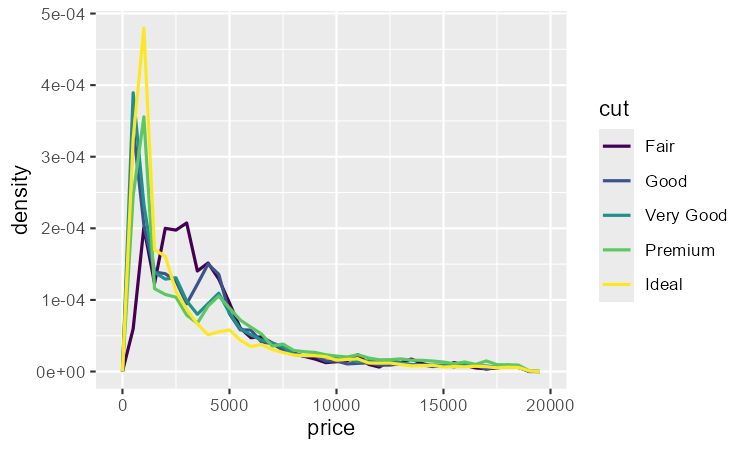

注意，我们将密度映射到 y，但由于密度不是 `diamonds` 数据集中的变量，所以需要先计算它。这里使用 `after_stat()` 函数计算。

这个图有些令人惊讶——看起来 fair 钻石（质量最差）的平均价格最高！但也许这是因为频率多边形有点难以解释——这个图里有太多信息了。

探索这种关系的一个视觉上更简单的图是使用并排箱线图。

```r
library(tidyverse)

ggplot(diamonds, aes(x = cut, y = price)) +
  geom_boxplot()
```

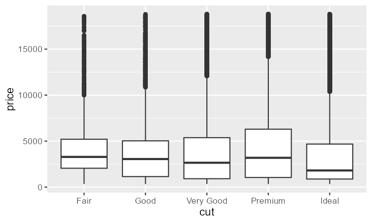

箱线图关于分布的信息少得多，但更紧凑，因此可以更容易地比较它们。它支持了一个反直觉的发现：质量更好的钻石通常更便宜！在练习中，你将被要求弄清楚原因。

`cut` 是一个有序 factor：fair 比 good 差，good 比 very good 差，依此类推。许多分类变量没有这种内在顺序，如果你想重新排序它们，可以使用 `fct_reorder()`。例如，取 `mpg` 数据集中的 `class` 变量，查看高速公路里程如何随类别变化：

```r
library(tidyverse)

ggplot(mpg, aes(x = class, y = hwy)) +
  geom_boxplot()
```

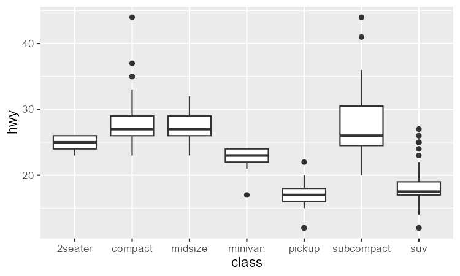

为了让趋势更明显，我们可以根据 `hwy` 的中位数重新排序 `class`：

```r
library(tidyverse)

ggplot(mpg, aes(x = fct_reorder(class, hwy, median), y = hwy)) +
  geom_boxplot()
```

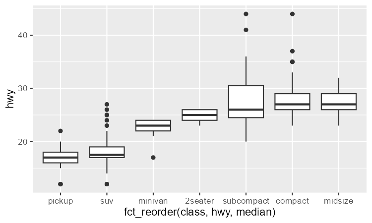

如果变量名很长，将 `geom_boxplot()` 翻转 90° 效果会更好。可以通过交换 x 和 y 美学映射来实现。

```r
library(tidyverse)

ggplot(mpg, aes(x = hwy, y = fct_reorder(class, hwy, median))) +
  geom_boxplot()
```

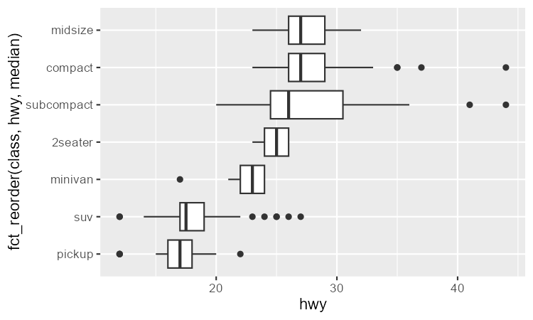

#### 5.1.1 练习

1. 使用你学到的知识改进取消与未取消航班起飞时间的可视化。

2. 基于 EDA，`diamonds` 数据集中哪个变量似乎对预测钻石价格最重要？该变量与 `cut` 如何相关？为什么这两个关系的组合会导致低质量钻石更贵？

3. 不要交换 x 和 y 变量，而是将 `coord_flip()` 作为新图层添加到垂直箱线图中，以创建水平箱线图。这与交换变量相比如何？

4. 箱线图的一个问题是，它们是在数据集小得多的时代开发的，并且倾向于显示数量多得令人望而却步的“离群值”。解决这个问题的一种方法是字母值图。安装 `lvplot` 包，并尝试使用 `geom_lv()` 显示 `price` 与 `cut` 的分布。你学到了什么？你如何解释这些图？

5. 使用 `geom_violin()` 创建钻石价格与 `diamonds` 数据集中一个分类变量的可视化，然后使用分面的 `geom_histogram()`，再使用着色的 `geom_freqpoly()`，最后使用着色的 `geom_density()`。比较并对比这四个图。基于分类变量的水平来可视化数值变量分布，每种方法的优缺点是什么？

6. 如果你有一个小数据集，有时使用 `geom_jitter()` 避免过度绘制，从而更容易看出连续变量和分类变量之间的关系，会很有用。`ggbeeswarm` 包提供了许多类似于 `geom_jitter()` 的方法。列出它们，并简要描述每个方法的作用。

### 5.2 两个分类变量

可视化分类变量之间的协变，需要计算这些分类变量水平每种组合的样本数量。一种方法是使用内置的 `geom_count()`：

```r
library(tidyverse)

ggplot(diamonds, aes(x = cut, y = color)) +
  geom_count()
```

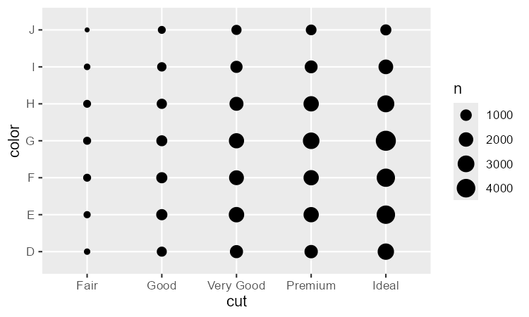

图中每个圆的大小取决于对应取值组合有多少样本。协变会表现为特定 x 值与特定 y 值之间的强相关。

探索这些变量之间关系的另一种方法是使用 dplyr 计算计数：

```r
diamonds |> 
  count(color, cut)
#> # A tibble: 35 × 3
#>   color cut           n
#>   <ord> <ord>     <int>
#> 1 D     Fair        163
#> 2 D     Good        662
#> 3 D     Very Good  1513
#> 4 D     Premium    1603
#> 5 D     Ideal      2834
#> 6 E     Fair        224
#> # ℹ 29 more rows
```

然后使用 `geom_tile()` 和 `fill` 美学映射进行可视化：

```r
library(tidyverse)

diamonds |>
  count(color, cut) |>
  ggplot(aes(x = color, y = cut)) +
  geom_tile(aes(fill = n))
```

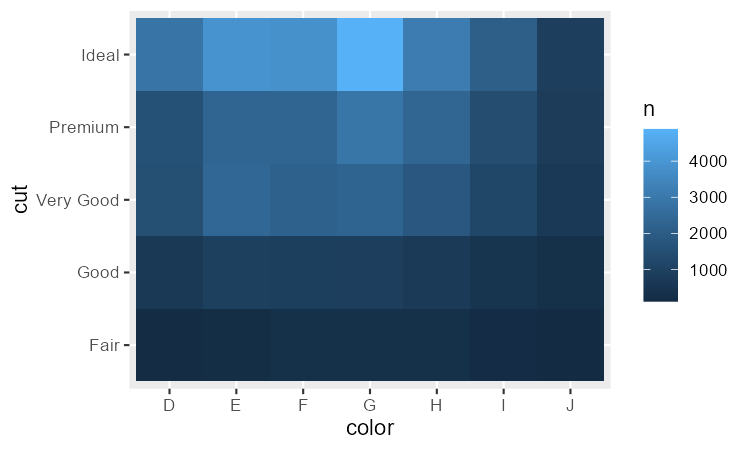

如果分类变量是无序的，可以使用 `seriation` 包来重新排序行和列，以便更清楚地揭示有趣的模式。对于更大的图可以使用 `heatmaply` 包，它可以创建交互式图。

#### 5.2.1 练习

1. 你如何重新缩放上面的计数数据集，以更清楚地显示 color 内 cut 的分布，或 cut 内 color 的分布？

2. 如果将 color 映射到 x 美学，将 cut 映射到 fill 美学，分段条形图能给你什么不同的数据洞见？计算落入每个分段的计数。

3. 将 `geom_tile()` 与 dplyr 结合使用，探索平均航班起飞延误如何随目的地和一年中的月份变化。是什么使这个图难以阅读？你可以如何改进它？

### 5.3 两个数值变量

前面已经介绍了一种可视化两个数值变量之间协变的方法：用 `geom_point()` 绘制散点图。你可以把协变看作数据点点中的一种模式。例如，你可以看到钻石的克拉大小和价格之间存在正相关关系：克拉数更大的钻石价格更高。这种关系是指数型的。

```r
library(tidyverse)

ggplot(smaller, aes(x = carat, y = price)) +
  geom_point()
```

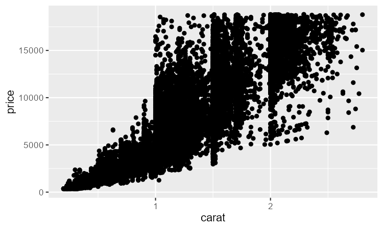

> `smaller` 数据集是前面介绍的小于 3 克拉的钻石

随着数据集规模增大，散点图变得不那么有用，点开始过度绘制，并堆积成均匀黑色的区域，使得难以判断二维空间中数据密度的差异，也难以发现趋势。一种解决该问题的方法：使用 `alpha` 美学映射添加透明度。

```r
library(tidyverse)

ggplot(smaller, aes(x = carat, y = price)) +
  geom_point(alpha = 1 / 100)
```

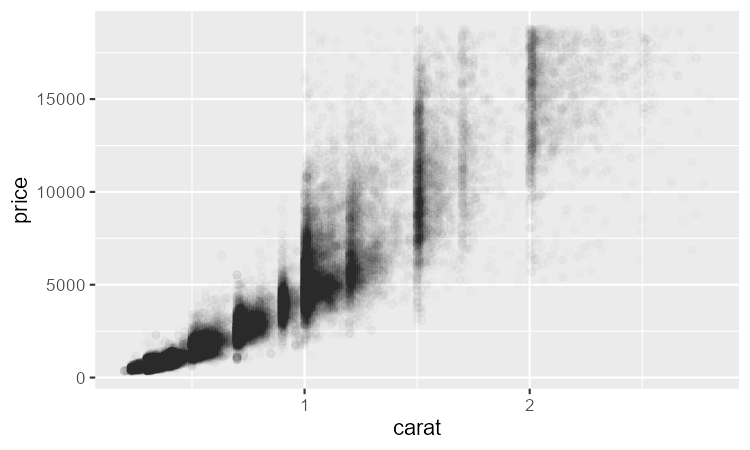

但对于非常大的数据集，使用透明度可能也没多大用。另一种解决方案是使用分箱。之前使用的 `geom_histogram()` 和 `geom_freqpoly()` 在一维中分箱。现在介绍如何使用 `geom_bin2d()` 和 `geom_hex()` 在二维中分箱。

`geom_bin2d()` 和 `geom_hex()` 将坐标平面划分为二维箱，然后使用填充颜色显示每个箱中有多少点。`geom_bin2d()` 创建矩形箱。`geom_hex()` 创建六边形箱。需要安装 `hexbin` 包才能使用 `geom_hex()`。

```r
library(tidyverse)

ggplot(smaller, aes(x = carat, y = price)) +
  geom_bin2d()

ggplot(smaller, aes(x = carat, y = price)) +
  geom_hex()
```

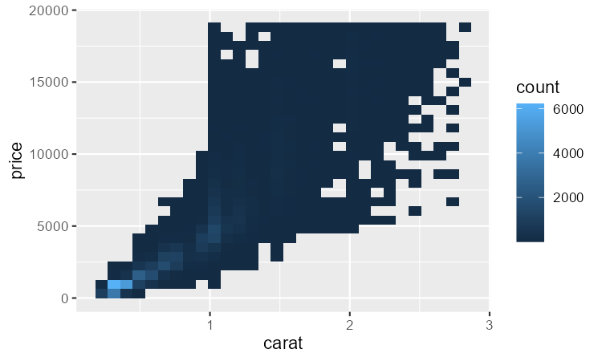

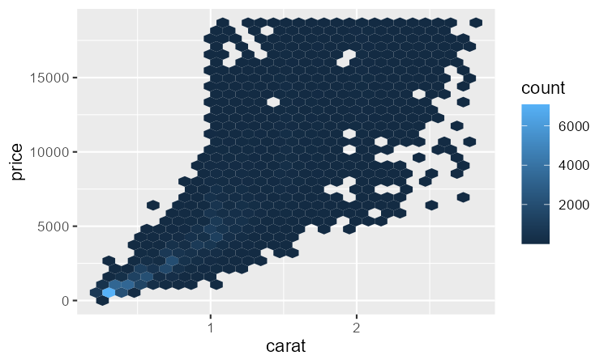

另一种选择是将一个连续变量分箱，使其表现得像一个分类变量。然后使用分类变量和连续变量组合的可视化技术。例如，可以对 `carat` 分箱，然后为每组显示一个箱线图：

```r
library(tidyverse)

ggplot(smaller, aes(x = carat, y = price)) +
  geom_boxplot(aes(group = cut_width(carat, 0.1)))

#> Warning: Orientation is not uniquely specified when both the x and y aesthetics are
#> continuous. Picking default orientation 'x'.
```

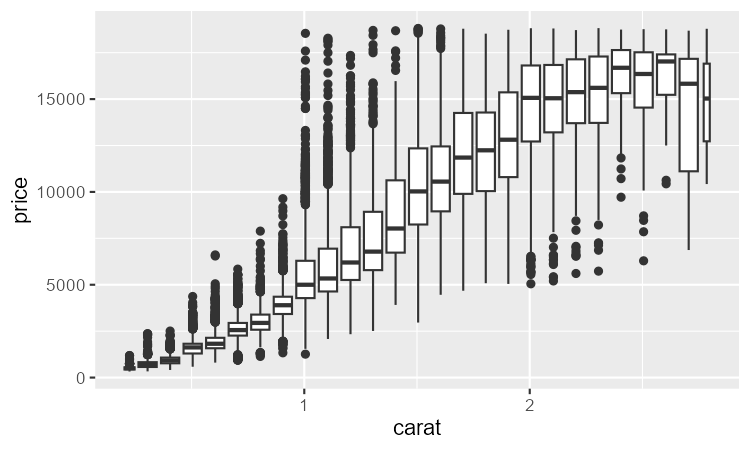

`cut_width(x, width)` 将 `x` 划分为宽度为 `width` 的箱。默认情况下，无论有多少观测，箱线图看起来大致相同（除了离群值数量），因此很难看出每个箱线图汇总了不同数量的点。一种显示这一点的方法是使用 `varwidth = TRUE` 使箱线图的宽度与点数成比例。

#### 5.3.1 练习

1. 除了用箱线图汇总条件分布之外，你还可以使用频率多边形。使用 `cut_width()` 与 `cut_number()` 时需要考虑什么？这对 `carat` 和 `price` 的二维分布可视化有何影响？

2. 可视化 `carat` 的分布，按 `price` 划分。

3. 非常大的钻石的价格分布与小钻石相比如何？这符合你的预期，还是让你感到惊讶？

4. 结合你学过的两种技术，可视化 `cut`、`carat` 和 `price` 的组合分布。

5. 二维图揭示了在一维图中看不到的离群值。例如，下面图中的一些点具有不寻常的 x 和 y 值组合，这使得这些点成为离群值，尽管它们的 x 和 y 值分别检查时看起来正常。为什么在这种情况下散点图比分箱图更好？

```r
diamonds |> 
  filter(x >= 4) |> 
  ggplot(aes(x = x, y = y)) +
  geom_point() +
  coord_cartesian(xlim = c(4, 11), ylim = c(4, 11))
```

6. 与使用 `cut_width()` 创建等宽箱不同，我们可以使用 `cut_number()` 创建包含大致相等数量点的箱。这种方法的优点和缺点是什么？

```r
ggplot(smaller, aes(x = carat, y = price)) + 
  geom_boxplot(aes(group = cut_number(carat, 20)))
```

## 6. 模式与模型

如果两个变量之间存在系统性关系，它会在数据中表现为一种模式。如果你发现了一种模式，问问自己：

- 这种模式可能是巧合（即随机）造成的吗？

- 如何描述该模式所暗示的关系？

- 该模式所暗示的关系有多强？

- 还有哪些其他变量可能影响这种关系？

- 如果你查看数据的各个子组，这种关系会发生变化吗？

数据中的模式为关系提供了线索，它们揭示了协变。如果把变异看作一种产生不确定性的现象，那么协变就是一种减少不确定性的现象。如果两个变量协变，就可以使用一个变量的值来更好地预测第二个变量的值。如果这种协变是由因果关系（一种特殊情况）引起的，那么你可以使用一个变量的值来控制第二个变量的值。

模型是一种从数据中提取模式的工具。例如，考虑 `diamonds` 数据，很难理解 `cut` 和 `price` 之间的关系，因为 `cut` 和 `carat`、以及 `carat` 和 `price` 都紧密相关。可以使用模型来移除 `price` 和 `carat` 之间非常强的关系，以便我们可以探索剩下的细微之处。以下代码拟合了一个从 `carat` 预测 `price` 的模型，然后计算残差（预测值与实际值之间的差）。从残差可以看到在移除 `carat` 的影响后钻石的价格。注意，我们没有使用 `price` 和 `carat` 的原始值，而是先对它们进行对数变换，然后进行拟合。然后对残差取指数，恢复到原始价格的尺度。

```r
library(tidyverse)
library(tidymodels)

diamonds <- diamonds |>
  mutate(
    log_price = log(price),
    log_carat = log(carat)
  )

diamonds_fit <- linear_reg() |>
  fit(log_price ~ log_carat, data = diamonds)

diamonds_aug <- augment(diamonds_fit, new_data = diamonds) |>
  mutate(.resid = exp(.resid))

ggplot(diamonds_aug, aes(x = carat, y = .resid)) +
  geom_point()
```

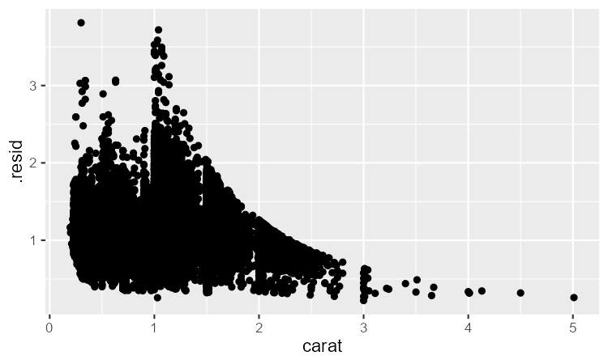

移除 `carat` 和 `price` 之间的强关系后，可以看到 `cut` 和 `price` 之间你所预期的关系：相对于它们的大小，质量更好的钻石更贵。

```r
ggplot(diamonds_aug, aes(x = cut, y = .resid)) + 
  geom_boxplot()
```

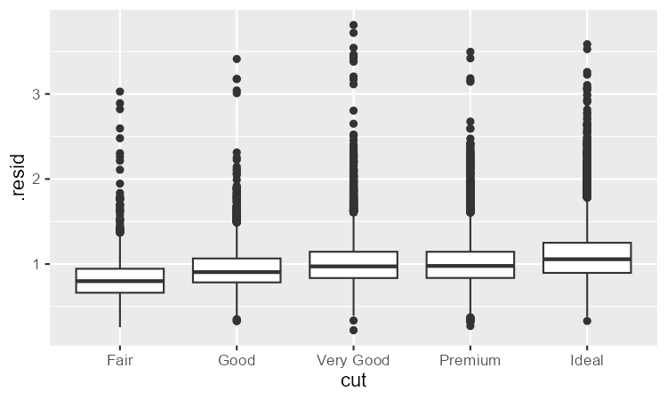

这里不讨论建模，因为一旦你掌握了数据整理和编程工具，理解模型是什么以及它们如何工作就会变得最容易。

## 7. 总结

本章介绍各种工具，帮助你理解数据中的变异。介绍了一次处理一个变量以及处理一对变量的技术。如果你的数据中有几十个或几百个变量，这些技术可能看起来极其受限，但它们是所有其他技术的基础。
