# 沟通

@since 2026-09-20⭐
@author Jiawei Mao
***
## 1. 引言

第 10 章介绍了如何将图形用作探索工具。在制作探索性图形时，你已经知道图形会显示哪些变量。你制作的每张图都有其目的。在大多数分析过程中，你会生成几十甚至上百张图，其中大部分都会被立刻丢弃。

充分理解自己的数据后，你需要把你的理解传达给他人。你的受众很可能不具备你的背景知识，也不会对数据有很深的投入。为了帮助他人快速对数据建立起良好的心智模型，你需要投入相当多的精力，让你的图形尽可能不言自明。在本章中，你将学习 ggplot2 为此提供的一些工具。

本章重点介绍创建优秀图形所需的工具。这里假设你知道自己想要什么，只是需要知道如何实现它。因此，我们强烈建议将本章与一本优秀的数据可视化通论书籍搭配阅读。我们尤其喜欢 Albert Cairo 的《The Truthful Art》。它并不教授创建可视化的具体技法，而是聚焦于为了创建有效图形，你需要思考哪些问题。

### 1.1 前提条件

本章聚焦于 `ggplot2`。我们还会少量使用 `dplyr` 进行数据操作，使用 scales 来覆盖默认的断点、标签、变换和调色板，并使用几个 ggplot2 扩展包，包括 Kamil Slowikowski 的 ggrepel（https://ggrepel.slowkow.com）和 Thomas Lin Pedersen 的 patchwork（https://patchwork.data-imaginist.com）。别忘了，如果还没有安装这些包，你需要用 `install.packages()` 安装它们。

```r
library(tidyverse)
library(scales)
library(ggrepel)
library(patchwork)
```

## 2. 标签

把探索性图形转变为说明性图形时，最容易入手的地方就是使用良好的标签。可以用 `labs()` 函数来添加标签。

```R
library(tidyverse)

ggplot(mpg, aes(x = displ, y = hwy)) +
  geom_point(aes(color = class)) +
  geom_smooth(se = FALSE) +
  labs(
    x = "Engine displacement (L)",
    y = "Highway fuel economy (mpg)",
    color = "Car type",
    title = "Fuel efficiency generally decreases with engine size",
    subtitle = "Two seaters (sports cars) are an exception because of their light weight",
    caption = "Data from fueleconomy.gov"
  )
```

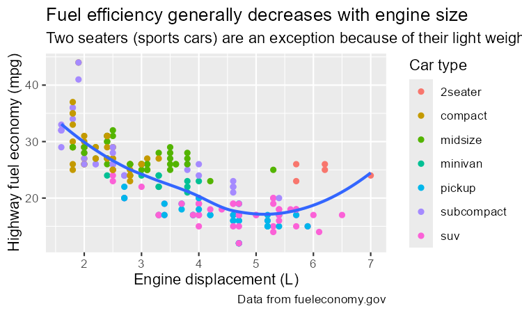

图形标题的目的是概括主要发现。**避免只描述图形是什么的标题**，例如“发动机排量与燃油经济性的散点图”。

如果需要添加更多文本，还有两个有用的标签：

- `subtitle` 会在标题下方以较小字体添加额外细节
- `caption` 会在图形右下角添加文本，通常用于描述数据来源。

也可以使用 `labs()` 来替换坐标轴和图例标题。通常，建议用更详细的描述替换简短的变量名，并包含单位。

可以使用数学公式代替文本字符串。只需将 `""` 换成 `quote()`，可以在 `?plotmath` 中阅读可用的选项：

```R
library(tidyverse)

df <- tibble(
  x = 1:10,
  y = cumsum(x^2)
)

ggplot(df, aes(x, y)) +
  geom_point() +
  labs(
    x = quote(x[i]),
    y = quote(sum(x[i]^2, i == 1, n))
  )
```

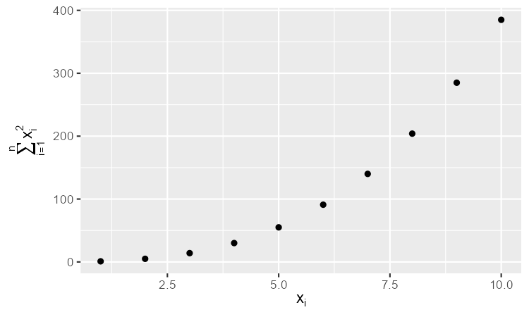

### 2.1 练习

1. 使用燃油经济性数据创建一幅图形，并自定义标题（`title`）、副标题（`subtitle`）、图注（`caption`）、x 轴、y 轴和颜色标签。

2. 使用燃油经济性数据重新创建以下图形。注意，点的颜色和形状都随驱动方式类型而变化。


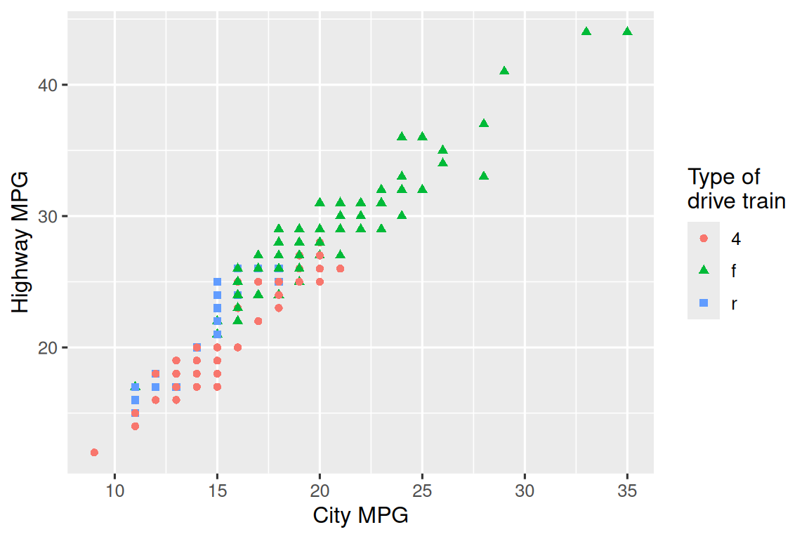

3. 选取你在过去一个月中创建的某一幅探索性图形，并添加信息丰富的标题，使他人更容易理解。

## 3. 注释

除了为图形的主要组件添加标签外，标注单个样本或一组样本也很有用。可以使用的第一个工具是 `geom_text()`。`geom_text()` 与 `geom_point()` 类似，但它有一个额外的美学属性：`label`，可以向图形中添加文本标签。

标签有两种可能来源。首先，你可能有一个提供标签的 tibble。在下面的图形中，我们提取每种驱动类型中发动机尺寸最大的汽车，并将它们的信息保存为一个名为 `label_info` 的新数据框。

```r
label_info <- mpg |>
  group_by(drv) |>
  arrange(desc(displ)) |>
  slice_head(n = 1) |>
  mutate(
    drive_type = case_when(
      drv == "f" ~ "front-wheel drive",
      drv == "r" ~ "rear-wheel drive",
      drv == "4" ~ "4-wheel drive"
    )
  ) |>
  select(displ, hwy, drv, drive_type)

label_info
#> # A tibble: 3 × 4
#> # Groups:   drv [3]
#>   displ   hwy drv   drive_type       
#>   <dbl> <int> <chr> <chr>            
#> 1   6.5    17 4     4-wheel drive    
#> 2   5.3    25 f     front-wheel drive
#> 3   7      24 r     rear-wheel drive
```

然后，使用这个新数据框直接标记这三个 group，用直接放置在图形上的标签替换 legend。使用 `fontface` 和 `size` 参数，可以自定义文本标签的外观。它们比图形上的其他文本更大且加粗。（`theme(legend.position = "none")` 会关闭所有图例）

```r
ggplot(mpg, aes(x = displ, y = hwy, color = drv)) +
  geom_point(alpha = 0.3) +
  geom_smooth(se = FALSE) +
  geom_text(
    data = label_info, 
    aes(x = displ, y = hwy, label = drive_type),
    fontface = "bold", size = 5, hjust = "right", vjust = "bottom"
  ) +
  theme(legend.position = "none")
#> `geom_smooth()` using method = 'loess' and formula = 'y ~ x'
```

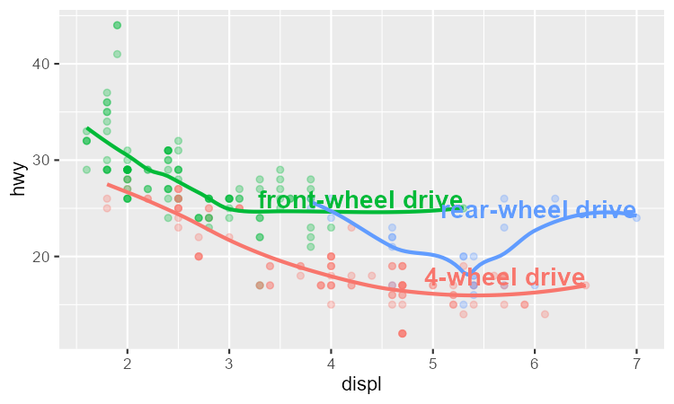

注意使用了 `hjust`（水平对齐）和 `vjust`（垂直对齐）来控制标签的对齐方式。

然而，上面制作的带注释图形很难阅读，因为标签彼此重叠，也与点重叠。我们可以使用 `ggrepel` 包中的 `geom_label_repel()` 函数来解决这两个问题。这个包会自动调整标签，使它们不重叠：

```r
ggplot(mpg, aes(x = displ, y = hwy, color = drv)) +
  geom_point(alpha = 0.3) +
  geom_smooth(se = FALSE) +
  geom_label_repel(
    data = label_info, 
    aes(x = displ, y = hwy, label = drive_type),
    fontface = "bold", size = 5, nudge_y = 2
  ) +
  theme(legend.position = "none")
#> `geom_smooth()` using method = 'loess' and formula = 'y ~ x'
```

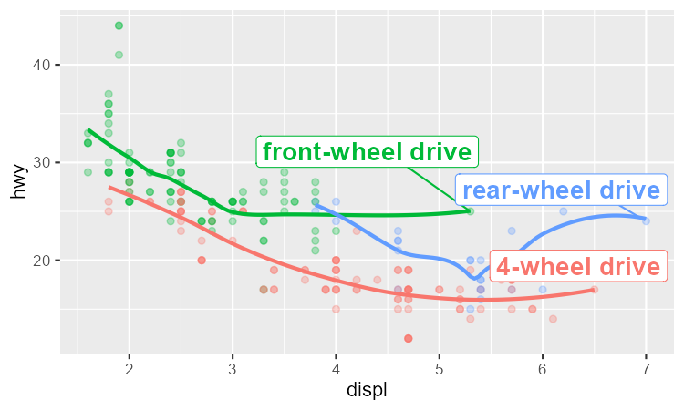

你也可以使用同样的思路，通过 ggrepel 包中的 `geom_text_repel()` 来突出显示图形上的某些点。注意这里使用的另一个便捷技巧：添加第二层大的空心点，以进一步突出被标记的点。

```r
potential_outliers <- mpg |>
  filter(hwy > 40 | (hwy > 20 & displ > 5))
  
ggplot(mpg, aes(x = displ, y = hwy)) +
  geom_point() +
  geom_text_repel(data = potential_outliers, aes(label = model)) +
  geom_point(data = potential_outliers, color = "red") +
  geom_point(
    data = potential_outliers,
    color = "red", size = 3, shape = "circle open"
  )
```

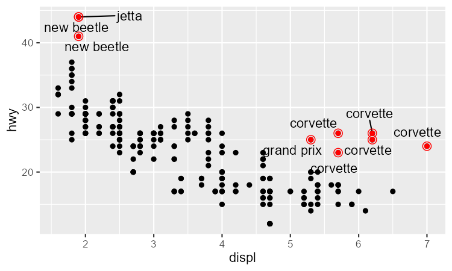

请记住，除了 `geom_text()` 和 `geom_label()`，ggplot2 中还有许多其他几何对象可用于帮助注释图形：

- 使用 `geom_hline()` 和 `geom_vline()` 添加参考线。我们通常将它们设置得较粗（`linewidth = 2`）且为白色（`color = "white"`），并将它们绘制在主数据层下方。这样它们容易看到，又不会将注意力从数据上引开。
- 使用 `geom_rect()` 在感兴趣的点周围绘制矩形。矩形的边界由美学属性 `xmin`、`xmax`、`ymin`、`ymax` 定义。或者，可以研究 [ggforce](https://ggforce.data-imaginist.com/index.html) 包，特别是 `geom_mark_hull()`，它允许你用凸包注释点的子集。
- 使用 `geom_segment()` 配合 `arrow` 参数，用箭头将注意力引向某个点。使用美学属性 `x` 和 `y` 定义起始位置，`xend` 和 `yend` 定义结束位置。

另一个向图形添加注释的便捷函数是 `annotate()`。根据经验，几何对象通常用于突出数据的子集，而 `annotate()` 则用于向图形中添加一个或少数几个注释元素。

为了演示 `annotate()` 的用法，让我们创建一些文本添加到图形中。文本有点长，所以我们使用 `stringr::str_wrap()` 根据每行想要的字符数自动添加换行符：

```r
trend_text <- "Larger engine sizes tend to have lower fuel economy." |>
  str_wrap(width = 30)
trend_text
#> [1] "Larger engine sizes tend to\nhave lower fuel economy."
```

然后，我们添加两层注释：一层使用 label-geom ，另一层使用 segment-geom。两者的 `x` 和 `y` 美学属性都定义注释起点，而 segment 注释中的 `xend` 和 `yend` 美学属性定义线段的结束位置。还要注意，线段的样式被定义为箭头。

```r
ggplot(mpg, aes(x = displ, y = hwy)) +
  geom_point() +
  annotate(
    geom = "label", x = 3.5, y = 38,
    label = trend_text,
    hjust = "left", color = "red"
  ) +
  annotate(
    geom = "segment",
    x = 3, y = 35, xend = 5, yend = 25, color = "red",
    arrow = arrow(type = "closed")
  )
```

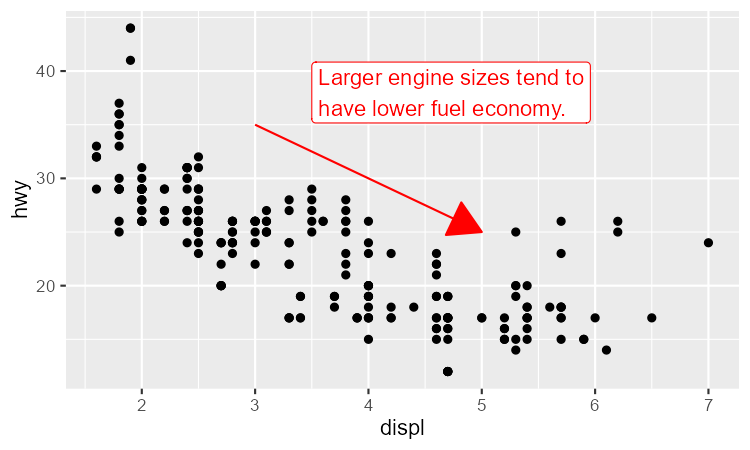

注释是传达可视化主要结论和有趣特征的强大工具。唯一的限制是你的想象力（以及你耐心调整注释位置使其美观的程度）！

### 3.1 练习

1. 使用 `geom_text()`，将文本放置在图形的四个角上。
2. 使用 `annotate()` 在你上一个图形的中间添加一个点几何对象，而无需创建 tibble。自定义点的形状、大小或颜色。
3. 使用 `geom_text()` 的标签如何与分面交互？如何向单个分面添加标签？如何向每个分面添加不同的标签？（提示：思考传递给 `geom_text()` 的数据集是什么。）
4. `geom_label()` 的哪些参数控制背景框的外观？
5. `arrow()` 的四个参数是什么？它们如何工作？创建一系列图形来演示最重要的选项。

## 4. 标度（Scales）

让图形更好地用于沟通的第三种方式是调整 scales。scales 控制美学映射如何以视觉方式呈现。

### 4.1 默认标度

通常，ggplot2 会自动添加标度。例如：

```r
ggplot(mpg, aes(x = displ, y = hwy)) +
  geom_point(aes(color = class))
```

ggplot2 会在后台自动添加默认标度：

```r
ggplot(mpg, aes(x = displ, y = hwy)) +
  geom_point(aes(color = class)) +
  scale_x_continuous() +
  scale_y_continuous() +
  scale_color_discrete()
```

注意标度的命名方案：`scale_` 后面是美学属性的名称，然后是 `_`，再然后是标度的名称。

默认标度根据它们所对应的变量类型命名：continuous（连续型）、discrete（离散型）、datetime（日期时间型）或 date（日期型）：

- `scale_x_continuous()` 将 `displ` 的数值放在 x 轴上的连续数轴上
- `scale_color_discrete()` 为每种汽车类别选择颜色，等等。

还有许多非默认标度，你将在下面了解到。默认标度经过精心选择，能够对广泛的输入表现良好。尽管如此，你可能出于两个原因想要覆盖默认值：

- 微调默认标度的某些参数，如更改轴上的断点，或图例上的键标签等。
- 完全替换标度，使用完全不同的算法。通常你可以做得比默认更好，因为你对数据了解得更多。

### 4.2 轴刻度与图例 keys

轴和图例统称为**向导**（guides）。轴用于 x 和 y 美学属性；图例用于其他所有内容。

影响轴上刻度和图例 keys 外观主要有两个参数：`breaks` 和 `labels`

- `breaks` 控制刻度的位置，或与键关联的值。
- `labels` 控制与每个刻度/键关联的文本标签。

`breaks` 常用于覆盖默认选择：

```r
ggplot(mpg, aes(x = displ, y = hwy, color = drv)) +
  geom_point() +
  scale_y_continuous(breaks = seq(15, 40, by = 5))
```

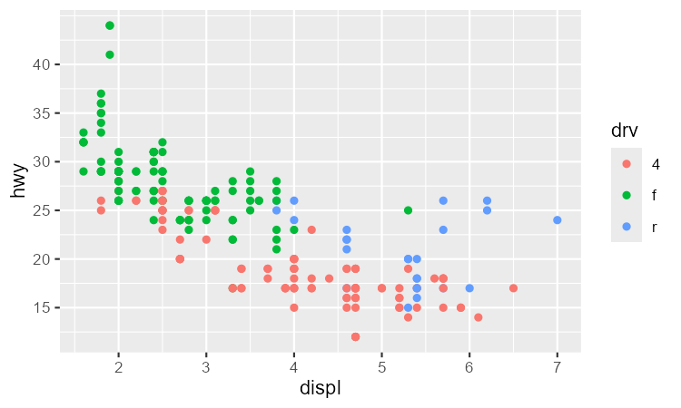

可以用同样的方式使用 `labels`（一个与 `breaks` 长度相同的字符向量），但也可以将其设置为 `NULL` 来完全抑制标签。这对于地图，或者对于无法分享绝对数字的出版图形很有用。你还可以使用 `breaks` 和 `labels` 来控制图例的外观。对于分类变量的离散 scales，`labels` 可以是一个命名列表，包含现有水平名称和标签。

```r
ggplot(mpg, aes(x = displ, y = hwy, color = drv)) +
  geom_point() +
  scale_x_continuous(labels = NULL) +
  scale_y_continuous(labels = NULL) +
  scale_color_discrete(labels = c("4" = "4-wheel", "f" = "front", "r" = "rear"))
```

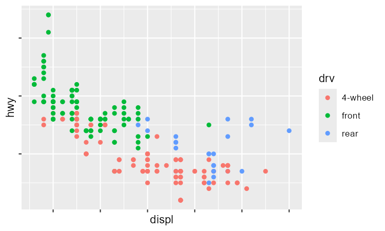

`labels` 参数与 scales 包中的标签函数结合，可用于将数字格式化为货币、百分比等。

左图显示了使用 `label_dollar()` 的默认标签，它添加了美元符号以及千位分隔符逗号。

右图进一步自定义，将美元值除以 1,000 并添加后缀“K”（表示“千”），同时添加自定义断点。注意 `breaks` 使用的是数据的原始标度。

```r
library(tidyverse)
library(scales)

# 左图
ggplot(diamonds, aes(x = price, y = cut)) +
  geom_boxplot(alpha = 0.05) +
  scale_x_continuous(labels = label_dollar())

# 右图
ggplot(diamonds, aes(x = price, y = cut)) +
  geom_boxplot(alpha = 0.05) +
  scale_x_continuous(
    labels = label_dollar(scale = 1 / 1000, suffix = "K"),
    breaks = seq(1000, 19000, by = 6000)
  )
```

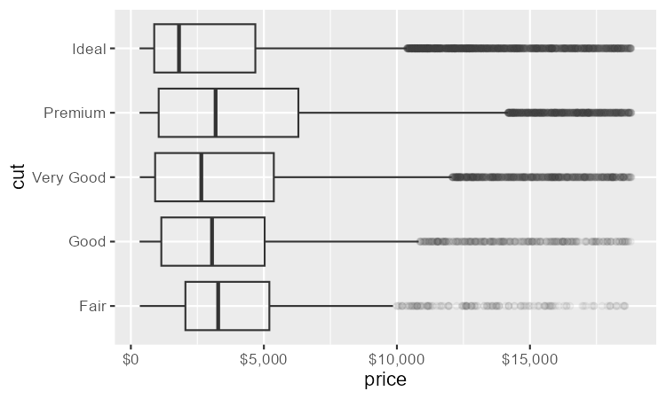

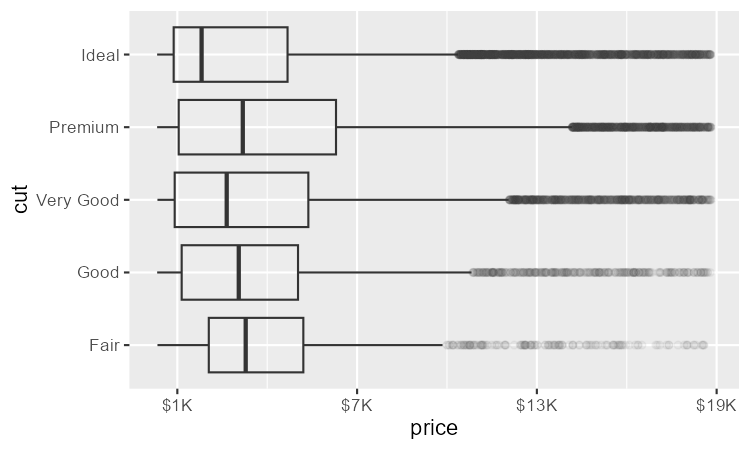

另一个方便的标签函数是 `label_percent()`：

```r
library(tidyverse)
library(scales)

ggplot(diamonds, aes(x = cut, fill = clarity)) +
  geom_bar(position = "fill") +
  scale_y_continuous(name = "Percentage", labels = label_percent())
```

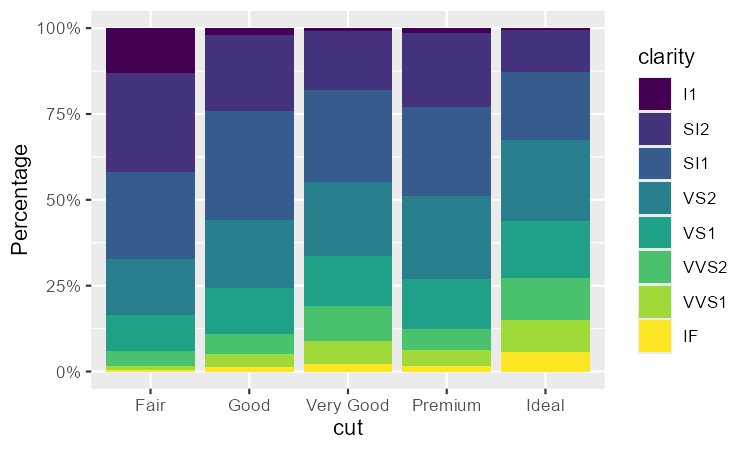

`breaks` 的另一个用途是当你数据点相对较少，并希望突出样本的确切位置。例如，看下面这张图，显示了每位美国总统开始和结束任期的时间。

```r
presidential |>
  mutate(id = 33 + row_number()) |>
  ggplot(aes(x = start, y = id)) +
  geom_point() +
  geom_segment(aes(xend = end, yend = id)) +
  scale_x_date(name = NULL, breaks = presidential$start, date_labels = "'%y")
```

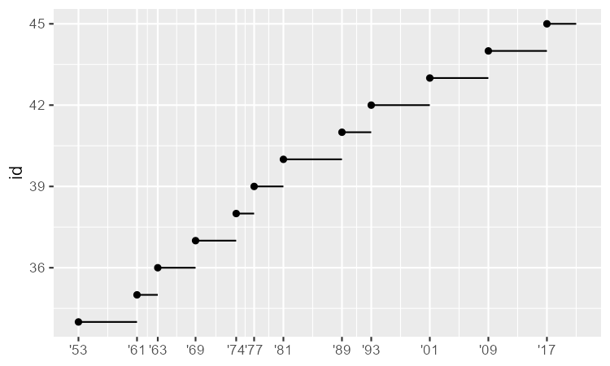

注意，对 `breaks` 参数，我们将 `start` 变量作为向量 `presidential$start` 提取出来，因为无法为此参数进行美学映射。还要注意，日期和日期时间标度的 `breaks` 和 `labels` 指定方式略有不同：

- `date_labels` 接受格式规范，形式与 `parse_datetime()` 相同。
- `date_breaks`（此处未显示）接受类似“2 days”或“1 month”的字符串。

### 4.3 图例布局

调整坐标轴最常用的方式是使用 `breaks` 和 `labels` 。虽然它们也适用于图例，但针对图例有专用方法。

要控制图例的整体位置，需要使用 `theme()` 设置。我们将在本章末尾介绍 theme，简而言之，它们控制图形的非数据部分。`theme` 设置 `legend.position` 控制图例绘制的位置：

```r
base <- ggplot(mpg, aes(x = displ, y = hwy)) +
  geom_point(aes(color = class))

base + theme(legend.position = "right") # 默认 legend 在右侧
base + theme(legend.position = "left")
base + 
  theme(legend.position = "top") +
  guides(color = guide_legend(nrow = 3))
base + 
  theme(legend.position = "bottom") +
  guides(color = guide_legend(nrow = 3))
```

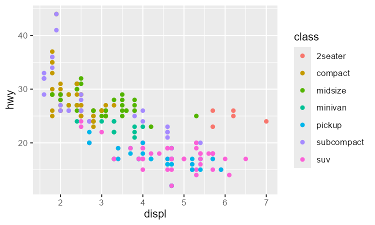

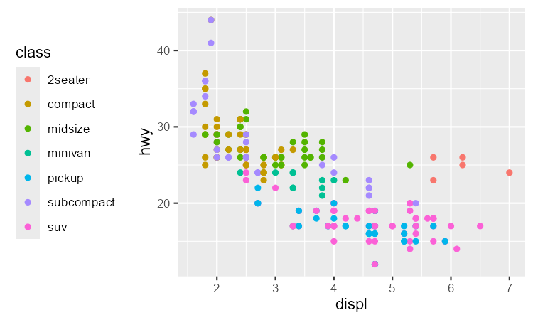

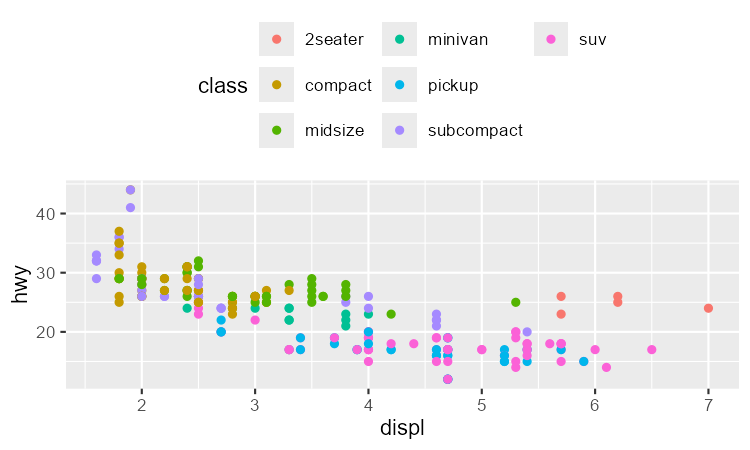

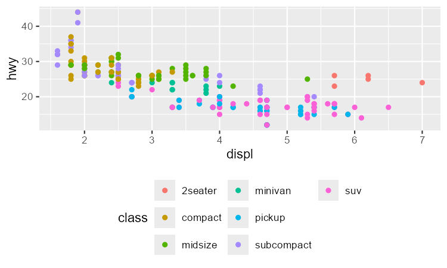

如果你的图形短而宽，将图例放在顶部或底部；如果高而窄，将图例放在左侧或右侧。你也可以使用 `legend.position = "none"` 不显示图例。

要控制单个图例的显示，使用 `guides()` 以及 `guide_legend()` 或 `guide_colorbar()`。以下示例展示了两个重要设置：用 `nrow` 控制图例使用的行数，以及覆盖其中一个美学属性使 point 更大。如果你使用了较低的 alpha 来显示许多点，这尤其有用。

```r
ggplot(mpg, aes(x = displ, y = hwy)) +
  geom_point(aes(color = class)) +
  geom_smooth(se = FALSE) +
  theme(legend.position = "bottom") +
  guides(color = guide_legend(nrow = 2, override.aes = list(size = 4)))
#> `geom_smooth()` using method = 'loess' and formula = 'y ~ x'
```

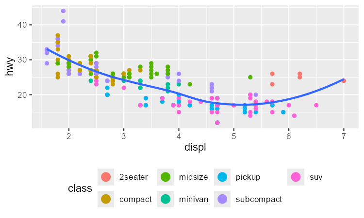

注意 `guides()` 中参数的名称与美学属性的名称匹配，就像 `labs()` 中一样。

### 4.4 替换标度

除了稍微调整细节之外，也可以完全替换标度。你最可能想要替换的标度有两种：连续位置标度和颜色标度。幸运的是，同样的原则适用于所有其他美学属性，所以一旦你掌握了位置和颜色，就能快速掌握其他标度的替换。

绘制变量的变换非常有用。例如，如果我们对 `carat` 和 `price` 进行对数变换，就更容易看出它们之间的精确关系：

```r
# 左图
ggplot(diamonds, aes(x = carat, y = price)) +
  geom_bin2d()
#> `stat_bin2d()` using `bins = 30`. Pick better value `binwidth`.

# 右图
ggplot(diamonds, aes(x = log10(carat), y = log10(price))) +
  geom_bin2d()
#> `stat_bin2d()` using `bins = 30`. Pick better value `binwidth`.
```

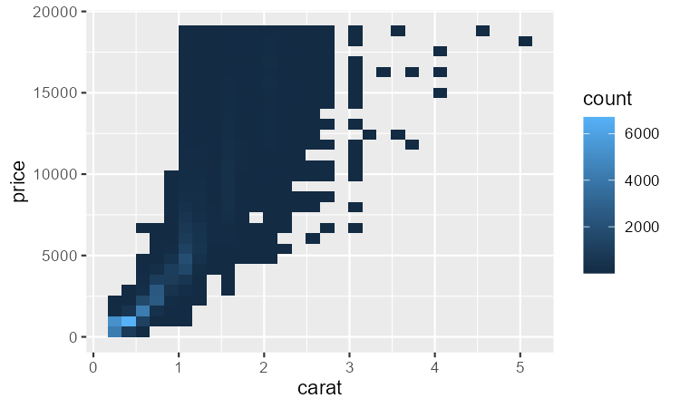

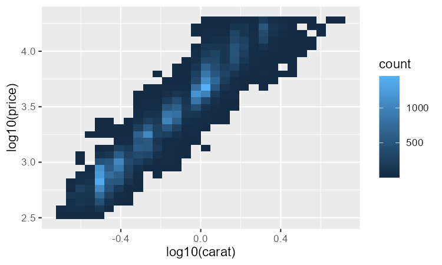

这种变换的缺点是轴现在用变换后的值标记，使得图形难以解释。我们可以在美学映射中进行变换，也可以改用标度进行变换。这在视觉上完全相同，只是轴用原始数据标度标记。

```r
ggplot(diamonds, aes(x = carat, y = price)) +
  geom_bin2d() + 
  scale_x_log10() + 
  scale_y_log10()
#> `stat_bin2d()` using `bins = 30`. Pick better value `binwidth`.
```

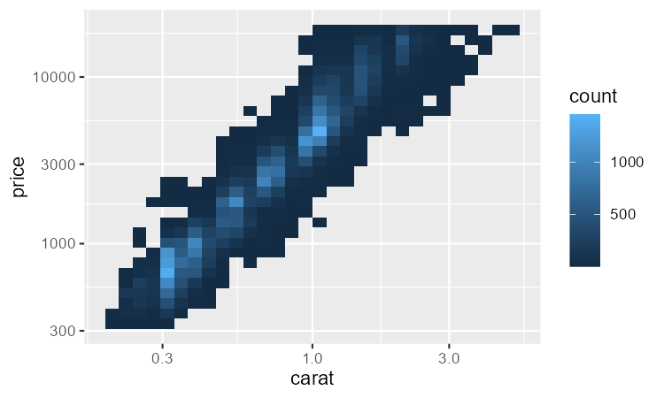

另一种经常自定义的标度是颜色。默认的分类标度选择在色轮上均匀分布的颜色。有用的替代方案是 ColorBrewer 标度，它们经过手工调整，对常见类型的色盲人群效果更好。下面两个图看起来相似，但红色和绿色的深浅差异足够大，即使是红绿色盲的人也能区分右图中的点。

```r
ggplot(mpg, aes(x = displ, y = hwy)) +
  geom_point(aes(color = drv))

ggplot(mpg, aes(x = displ, y = hwy)) +
  geom_point(aes(color = drv)) +
  scale_color_brewer(palette = "Set1")
```

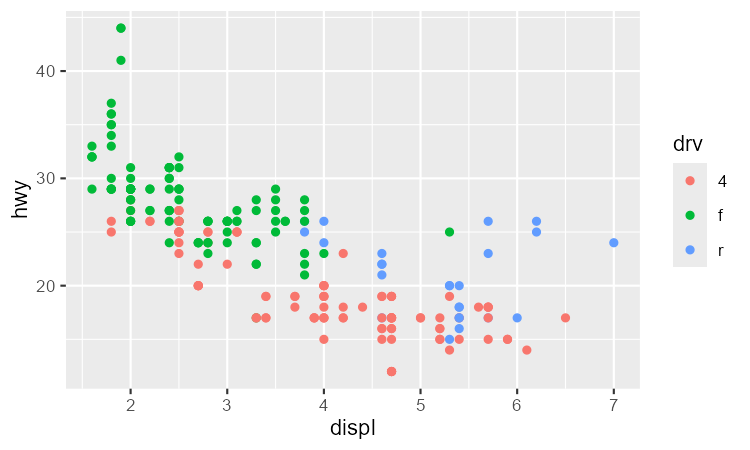

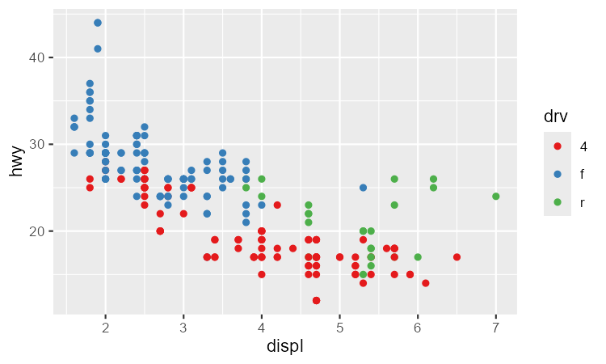

别忘了提高可访问性的更简单技巧。如果只有少数几种颜色，你可以添加形状映射。这也有助于确保你的图形在黑白打印时可解释。

```r
ggplot(mpg, aes(x = displ, y = hwy)) +
  geom_point(aes(color = drv, shape = drv)) +
  scale_color_brewer(palette = "Set1")
```

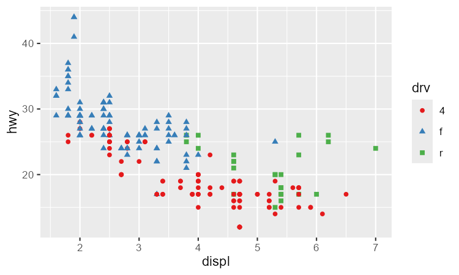

ColorBrewer 标度在 https://colorbrewer2.org/ 上有文档，并通过 Erich Neuwirth 的 RColorBrewer 包在 R 中提供。图 11.1 显示了所有调色板的完整列表。如果你的分类值是有序的，或者有一个“中间值”，那么顺序（顶部）和发散（底部）调色板特别有用。如果你使用 `cut()` 将连续变量转换为分类变量，通常会出现这种情况。

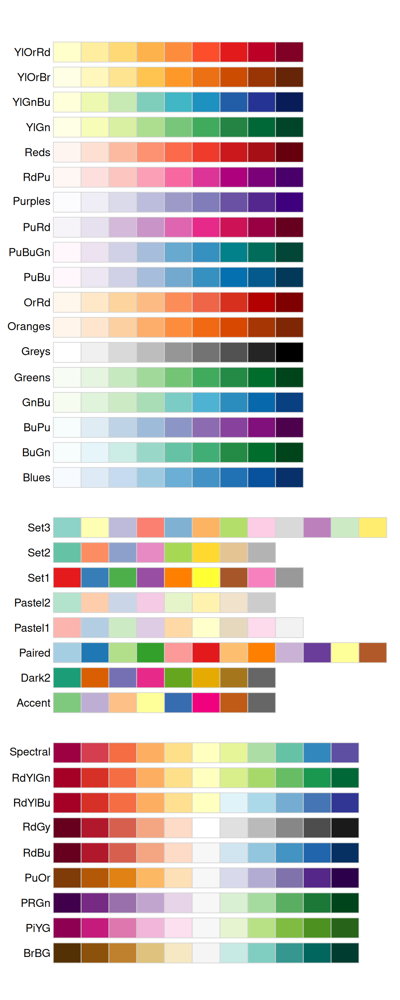

> **图 11.1** 所有 ColorBrewer 标度。

当你有一个预定义的值与颜色之间的映射时，使用 `scale_color_manual()`。例如，如果将总统党派映射到颜色，使用共和党红色、民主党蓝色的标准映射。分配这些颜色的一种方法是使用十六进制颜色代码：

```r
presidential |>
  mutate(id = 33 + row_number()) |>
  ggplot(aes(x = start, y = id, color = party)) +
  geom_point() +
  geom_segment(aes(xend = end, yend = id)) +
  scale_color_manual(values = c(Republican = "#E81B23", Democratic = "#00AEF3"))
```

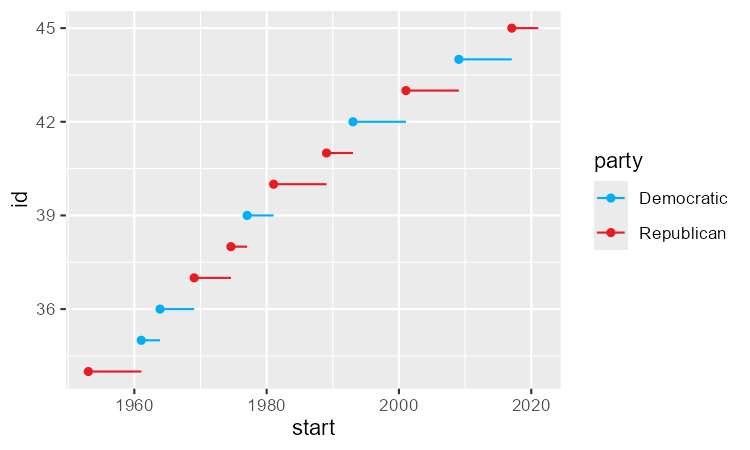

对连续颜色，可以使用内置的 `scale_color_gradient()` 或 `scale_fill_gradient()`。如果你有一个发散标度，可以使用 `scale_color_gradient2()`。这允许你为正值和负值赋予不同的颜色，对区分高于或低于均值的点很有用。

另一个选择是使用 viridis 颜色标度。设计者 Nathaniel Smith 和 Stéfan van der Walt 精心调整了连续配色方案，使其对各种形式的色盲人群可感知，并且在彩色和黑白下都感知均匀。这些标度在 ggplot2 中提供连续（c）、离散（d）和分箱（b）调色板。

```r
df <- tibble(
  x = rnorm(10000),
  y = rnorm(10000)
)

ggplot(df, aes(x, y)) +
  geom_hex() +
  coord_fixed() +
  labs(title = "Default, continuous", x = NULL, y = NULL)

ggplot(df, aes(x, y)) +
  geom_hex() +
  coord_fixed() +
  scale_fill_viridis_c() +
  labs(title = "Viridis, continuous", x = NULL, y = NULL)

ggplot(df, aes(x, y)) +
  geom_hex() +
  coord_fixed() +
  scale_fill_viridis_b() +
  labs(title = "Viridis, binned", x = NULL, y = NULL)
```

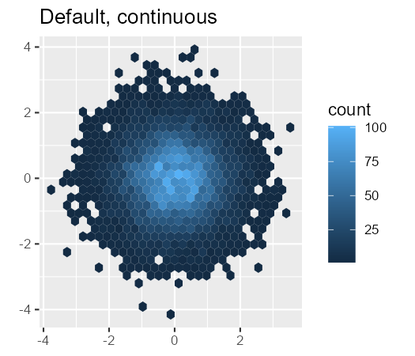

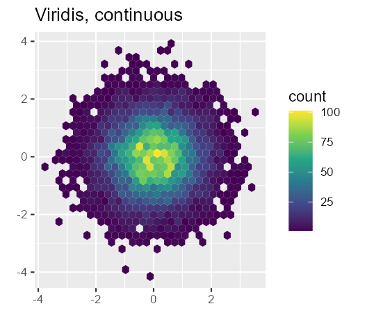

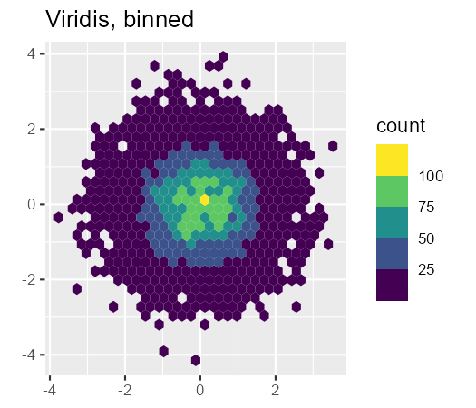

注意，所有颜色标度都有两种变体：`scale_color_*()` 和 `scale_fill_*()`，分别用于 color 和 fill 美学属性（颜色标度有英式和美式拼写两种）。

### 4.5 缩放

有三种方法控制图形范围：

1. 调整绘制哪些数据。
2. 为每个标度中设置范围。
3. 在 `coord_cartesian()` 中设置 `xlim` 和 `ylim`。

我们将通过一系列图形来演示这些选项：

- 左图显示了发动机尺寸与燃油效率之间的关系，按驱动类型着色。
- 右图显示了相同的变量，但对绘制的数据进行了子集化。子集化数据影响了 x 和 y 标度以及平滑曲线。

```r
# 左图
ggplot(mpg, aes(x = displ, y = hwy)) +
  geom_point(aes(color = drv)) +
  geom_smooth()

# 右图
mpg |>
  filter(displ >= 5 & displ <= 6 & hwy >= 10 & hwy <= 25) |>
  ggplot(aes(x = displ, y = hwy)) +
  geom_point(aes(color = drv)) +
  geom_smooth()
```

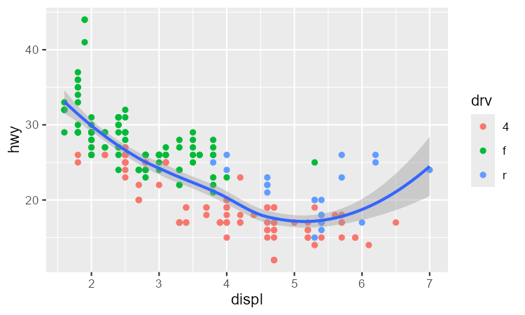

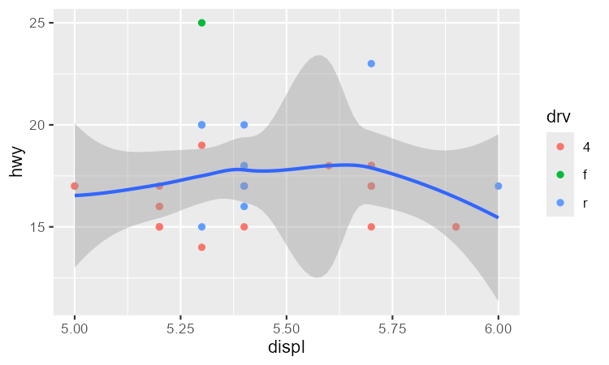

让我们将这些与下面两个图比较，左图在单个标度上设置范围，右图在 `coord_cartesian()` 中设置范围。我们可以看到，减小范围等同于子集化数据。因此，要放大图形的某个区域，通常最好使用 `coord_cartesian()`。

```r
# 左图
ggplot(mpg, aes(x = displ, y = hwy)) +
  geom_point(aes(color = drv)) +
  geom_smooth() +
  scale_x_continuous(limits = c(5, 6)) +
  scale_y_continuous(limits = c(10, 25))

# 右图
ggplot(mpg, aes(x = displ, y = hwy)) +
  geom_point(aes(color = drv)) +
  geom_smooth() +
  coord_cartesian(xlim = c(5, 6), ylim = c(10, 25))
```

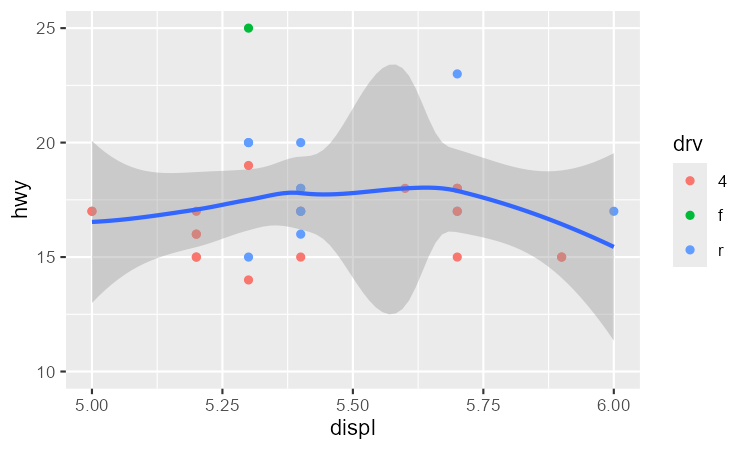

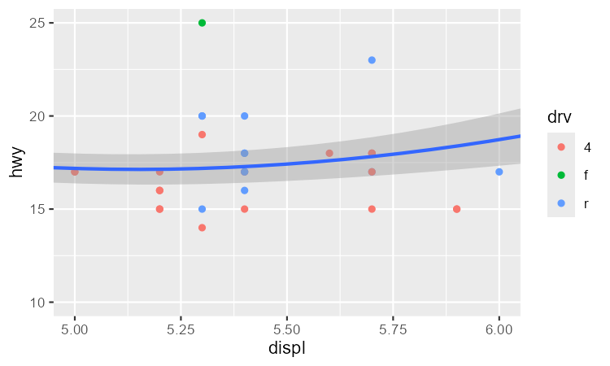

另一方面，如果你想扩展范围，例如匹配不同图形的标度，那么在单个标度上设置 `limits` 通常更有用。例如，如果我们提取两类汽车并分别绘制，很难比较这些图，因为所有三个标度（x 轴、y 轴和颜色美学属性）都有不同的范围。

```r
suv <- mpg |> filter(class == "suv")
compact <- mpg |> filter(class == "compact")

# 左图
ggplot(suv, aes(x = displ, y = hwy, color = drv)) +
  geom_point()

# 右图
ggplot(compact, aes(x = displ, y = hwy, color = drv)) +
  geom_point()
```

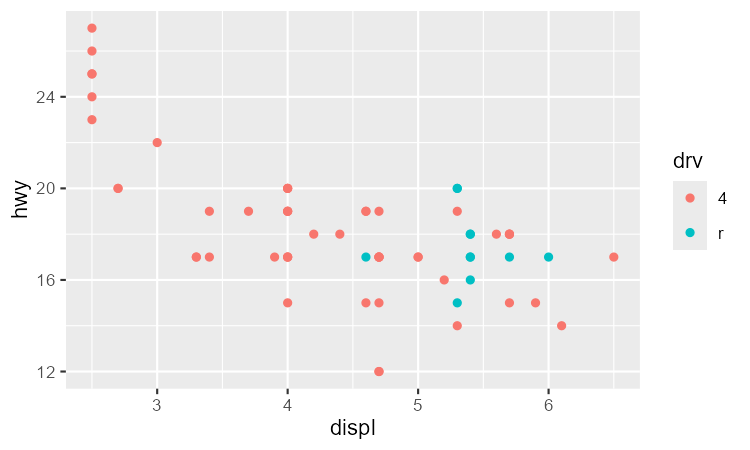

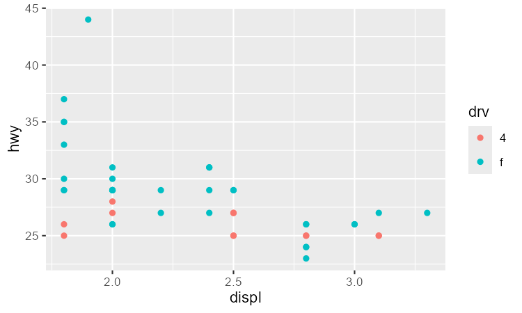

克服这个问题的一种方法是在多个图形之间共享标度，用完整数据的范围来训练标度。

```r
x_scale <- scale_x_continuous(limits = range(mpg$displ))
y_scale <- scale_y_continuous(limits = range(mpg$hwy))
col_scale <- scale_color_discrete(limits = unique(mpg$drv))

# 左图
ggplot(suv, aes(x = displ, y = hwy, color = drv)) +
  geom_point() +
  x_scale +
  y_scale +
  col_scale

# 右图
ggplot(compact, aes(x = displ, y = hwy, color = drv)) +
  geom_point() +
  x_scale +
  y_scale +
  col_scale
```

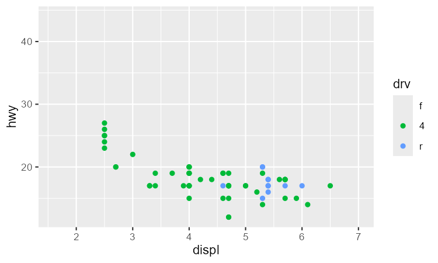

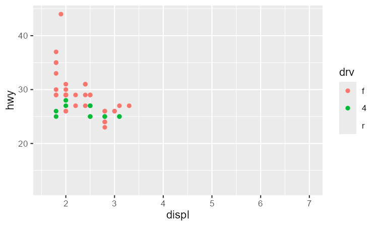

在这种特殊情况下，你本可以简单地使用分面，但这种技术更普遍地有用，例如，如果你想将图形分散到报告的多页上。

### 4.6 练习

1. 为什么以下代码没有覆盖默认标度？

```r
df <- tibble(
  x = rnorm(10000),
  y = rnorm(10000)
)

ggplot(df, aes(x, y)) +
  geom_hex() +
  scale_color_gradient(low = "white", high = "red") +
  coord_fixed()
```

2. 每个标度的第一个参数是什么？它与 `labs()` 相比如何？

3. 通过以下方式更改总统任期的显示：
   - 结合自定义颜色和 x 轴断点的两个变体。
   - 改进 y 轴的显示。
   - 用总统名字标记每个任期。
   - 添加信息丰富的图形标签。
   - 每 4 年放置一个断点（这比看起来更棘手！）。

4. 首先，创建以下图形。然后，使用 `override.aes` 修改代码，使图例更容易看清。

```r
ggplot(diamonds, aes(x = carat, y = price)) +
  geom_point(aes(color = cut), alpha = 1/20)
```

## 5. 主题

可以使用主题来自定义图形的非数据元素：

```r
ggplot(mpg, aes(x = displ, y = hwy)) +
  geom_point(aes(color = class)) +
  geom_smooth(se = FALSE) +
  theme_bw()
```

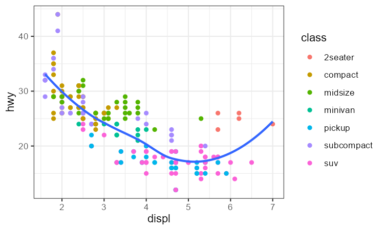

ggplot2 包含图 11.2 所示的八种主题，默认主题是 `theme_gray()`。附件包中包含更多主题，例如 Jeffrey Arnold 的 ggthemes（https://jrnold.github.io/ggthemes）。如果你想匹配特定的公司或期刊风格，也可以创建自己的主题。


> 图 11.2：ggplot2 内置的八种主题。

可以控制每个主题的各个组件，例如 y 轴字体的大小和颜色。我们已经看到 `legend.position` 控制图例绘制的位置。图例还有许多其他方面可以用 `theme()` 自定义。例如，在下面的图形中，我们改变了图例的方向，并在其周围添加了黑色边框。注意，图例框和图形标题元素的自定义是通过 `element_*()` 函数完成的。这些函数指定非数据组件的样式，例如，标题文本在 `element_text()` 的 `face` 参数中加粗，图例边框颜色在 `element_rect()` 的 `color` 参数中定义。控制标题和图注位置的主题元素分别是 `plot.title.position` 和 `plot.caption.position`。在下面的图形中，它们被设置为 `"plot"`，表示这些元素与整个绘图区域对齐，而不是与绘图面板（默认）对齐。还使用了其他几个有用的 `theme()` 组件来更改标题和图注文本的放置位置和格式。

```r
ggplot(mpg, aes(x = displ, y = hwy, color = drv)) +
  geom_point() +
  labs(
    title = "Larger engine sizes tend to have lower fuel economy",
    caption = "Source: https://fueleconomy.gov."
  ) +
  theme(
    legend.position = c(0.6, 0.7),
    legend.direction = "horizontal",
    legend.box.background = element_rect(color = "black"),
    plot.title = element_text(face = "bold"),
    plot.title.position = "plot",
    plot.caption.position = "plot",
    plot.caption = element_text(hjust = 0)
  )
```

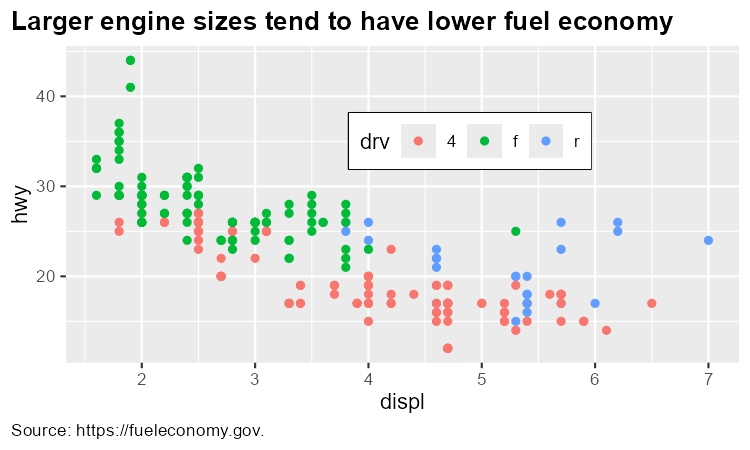

关于所有 `theme()` 组件的概述，请参阅 `?theme` 的帮助。ggplot2 这本书也是了解主题完整细节的好去处。

### 5.1 练习

1. 从 ggthemes 包提供的一个主题中挑选一个，并将其应用到你上一个绘制的图形中。
2. 将图形的轴标签设为蓝色并加粗。

## 6. 布局

到目前为止，我们讨论的都是如何创建和修改单个图形。如果你想以某种方式排列多个图形，该怎么办？`patchwork` 包支持将多个独立的图形组合到同一个图形中。我们在本章前面已经加载了这个包。

要把两个图形并排放置，只需将它们相加即可。注意，你需要先创建图形并将它们保存为对象（在下面的例子中，它们分别叫做 `p1` 和 `p2`）。然后，用 `+` 将它们并排放置。

```r
p1 <- ggplot(mpg, aes(x = displ, y = hwy)) + 
  geom_point() + 
  labs(title = "Plot 1")
p2 <- ggplot(mpg, aes(x = drv, y = hwy)) + 
  geom_boxplot() + 
  labs(title = "Plot 2")
p1 + p2
```

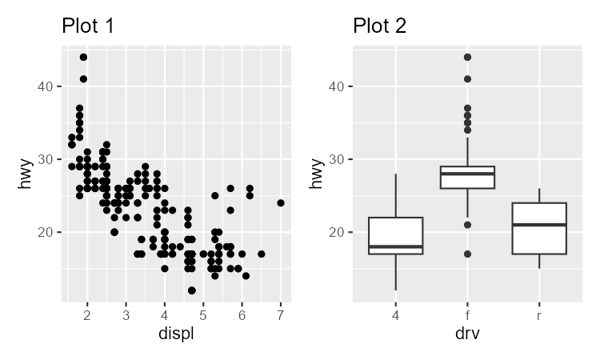

需要注意的是，在上面的代码块中，我们并没有使用 patchwork 包中的新函数。相反，这个包为 `+` 运算符添加了新的功能。

你还可以用 patchwork 创建复杂的图形布局。在下面的例子中，`|` 将 `p1` 和 `p3` 并排放置，`/` 将 `p2` 移到下一行。

```r
p3 <- ggplot(mpg, aes(x = cty, y = hwy)) + 
  geom_point() + 
  labs(title = "Plot 3")
(p1 | p3) / p2
```

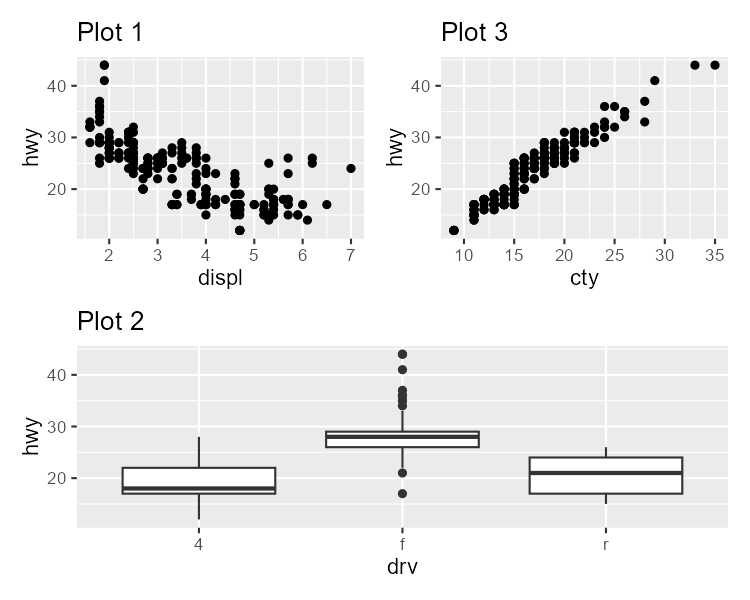

此外，`patchwork` 允许你将多个图形的图例收集到一个共同的图例中，自定义图例的位置以及图形的尺寸，并为图形添加共同的标题、副标题、图注等。下面创建 5 个图形。我们关闭了箱线图和散点图的图例，并用 `& theme(legend.position = "top")` 将密度图的图例收集到图形顶部。注意这里使用了 `&` 运算符而不是通常的 `+`。这是因为我们是在修改 patchwork 图形的主题，而不是单个 ggplot 的主题。图例被放置在顶部，位于 `guide_area()` 内。最后，我们还自定义了 patchwork 各组件的高度——向导高度为 1，箱线图为 3，密度图为 2，分面散点图为 4。patchwork 使用这个比例划分你为图形分配的区域，并相应地放置各个组件。

```r
p1 <- ggplot(mpg, aes(x = drv, y = cty, color = drv)) + 
  geom_boxplot(show.legend = FALSE) + 
  labs(title = "Plot 1")

p2 <- ggplot(mpg, aes(x = drv, y = hwy, color = drv)) + 
  geom_boxplot(show.legend = FALSE) + 
  labs(title = "Plot 2")

p3 <- ggplot(mpg, aes(x = cty, color = drv, fill = drv)) + 
  geom_density(alpha = 0.5) + 
  labs(title = "Plot 3")

p4 <- ggplot(mpg, aes(x = hwy, color = drv, fill = drv)) + 
  geom_density(alpha = 0.5) + 
  labs(title = "Plot 4")

p5 <- ggplot(mpg, aes(x = cty, y = hwy, color = drv)) + 
  geom_point(show.legend = FALSE) + 
  facet_wrap(~drv) +
  labs(title = "Plot 5")

(guide_area() / (p1 + p2) / (p3 + p4) / p5) +
  plot_annotation(
    title = "City and highway mileage for cars with different drive trains",
    caption = "Source: https://fueleconomy.gov."
  ) +
  plot_layout(
    guides = "collect",
    heights = c(1, 3, 2, 4)
    ) &
  theme(legend.position = "top")
```

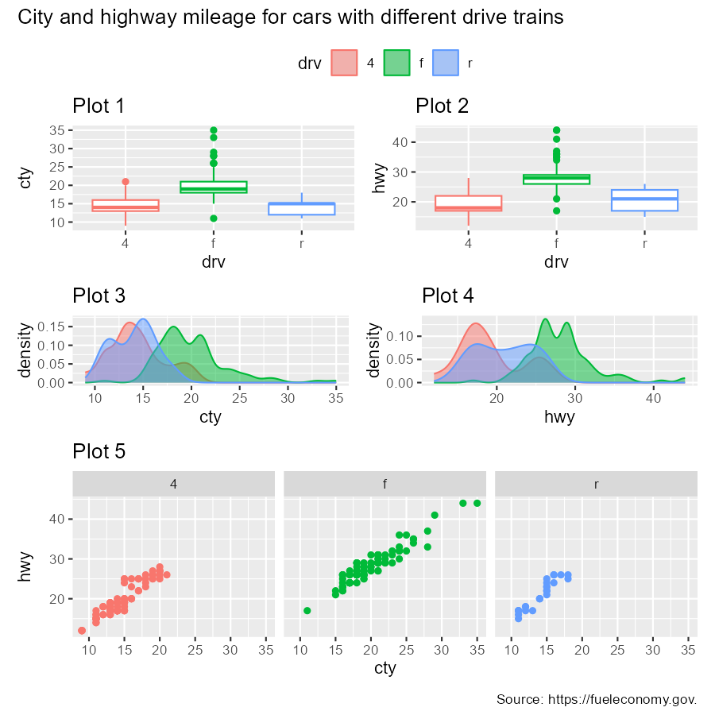

如果你想了解更多关于用 patchwork 组合和布局多个图形的知识，可以查阅该包网站上的指南：https://patchwork.data-imaginist.com。

### 6.1 练习

1. 如果在下面的图形布局中省略括号会发生什么？你能解释原因吗？

```r
p1 <- ggplot(mpg, aes(x = displ, y = hwy)) + 
  geom_point() + 
  labs(title = "Plot 1")
p2 <- ggplot(mpg, aes(x = drv, y = hwy)) + 
  geom_boxplot() + 
  labs(title = "Plot 2")
p3 <- ggplot(mpg, aes(x = cty, y = hwy)) + 
  geom_point() + 
  labs(title = "Plot 3")

(p1 | p2) / p3
```

2. 使用上一题中的三个图形，重新创建以下 patchwork 布局。

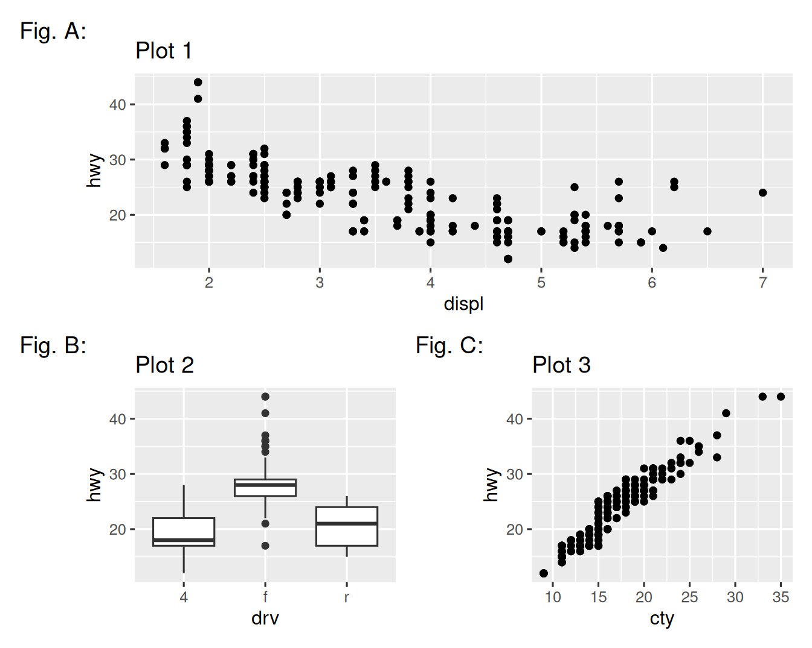

## 7. 总结

在本章中，你学习了添加图形标签（如标题、副标题、图注）以及修改默认轴标签，使用注释向图形添加信息文本或突出显示特定数据点，自定义轴标度，以及更改图形主题。你还学习了使用简单和复杂的图形布局将多个图形组合到单个图形中。

虽然到目前为止你已经学习了如何制作许多不同类型的图形，以及如何使用各种技术来自定义它们，但我们对 ggplot2 能创建的内容还只是浅尝辄止。如果你想全面了解 ggplot2，我们建议阅读 [*ggplot2: Elegant Graphics for Data Analysis*](https://ggplot2-book.org/) 一书。其他有用的资源包括 Winston Chang 的 *R Graphics Cookbook* 和 Claus Wilke 的 *Fundamentals of Data Visualization*。