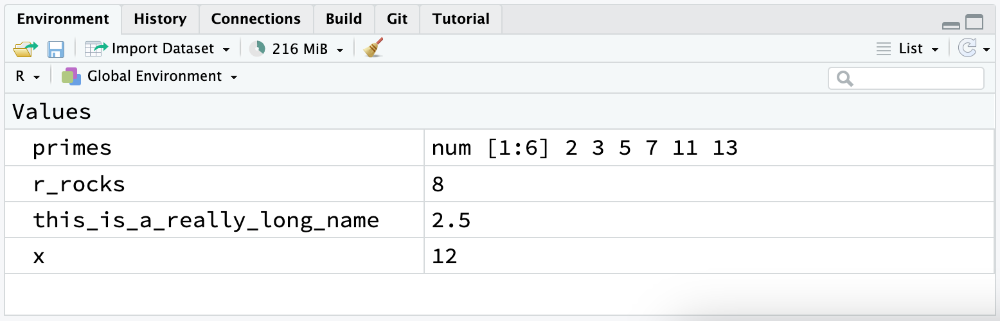

# 工作流基础

2026-08-24⭐
@author Jiawei Mao
***
## 简介

你现在已经有了一些运行 R 代码的经验。虽然我们并没有给你讲太多细节，但显然你已经掌握了基础要领，不然你早就因为沮丧而把这本书扔掉了！刚开始用 R 语言编程时，感到沮丧是很正常的，因为 R 对标点符号的要求极其严格，哪怕只是放错了一个字符，它都会向你‘抗议’。不过，虽然你可能会感到有些挫败，但请放心，这种经历非常普遍，而且只是暂时的：每个人都会经历这个阶段，而克服它的唯一方法就是不断尝试。

在进入下一步之前，让我们先确保你在运行 R 代码方面已经打下了坚实的基础，并且掌握了一些最实用的 RStudio 功能。

## 1. 编码基础

为了让你能尽快上手画图，我们到目前为止刻意省略了一些基础内容。现在，让我们来回顾一下这些基础知识。你可以使用 R 语言来进行基本的数学计算：

```R
> 1 / 200 * 30
[1] 0.15
> (59 + 73 + 2)/3
[1] 44.66667
> sin(pi / 2)
[1] 1
```

可以使用赋值运算符 `<-` 来创建新的对象：

```R
x <- 3 * 4
```

请注意，`x` 的值并不会自动打印出来，它只是被存储了。如果你想查看该值，可以在控制台中输入 `x`。

你可以使用 `c()` 函数将多个元素组合成一个向量（vector）：

```R
primes <- c(2, 3, 5, 7, 11, 13)
```

对向量进行的基本算术运算，会直接应用于该向量中的每一个元素：

```R
primes * 2
#> [1]  4  6 10 14 22 26
primes - 1
#> [1]  1  2  4  6 10 12
```

在 R 语言中，所有用于创建对象的语句（即赋值语句）都具有相同的形式：

```R
object_name <- value
```

在阅读这类代码时，你可以在心里把 `<-` 读作对象 `object_name` 获得值 `value`。

在实际编程中，你会进行大量的赋值操作，而 `<-` 手动敲起来确实很麻烦。你可以利用 RStudio 的快捷键来节省时间：`Alt + -`（减号键）。你会发现，RStudio 会自动在 `<-` 的两侧加上空格，这是一种非常好的代码排版习惯。

## 2. 注释

在 R 语言中，同一行内 `#` 号之后的任何文本都会被忽略。这允许你编写注释——也就是 R 会忽略，但其他人类读者可以阅读的文字。在示例中，我们有时也会加入注释，来解释代码正在执行什么操作。

注释有助于简要说明接下来的代码是做什么的。

```R
# create vector of primes
primes <- c(2, 3, 5, 7, 11, 13)

# multiply primes by 2
primes * 2
#> [1]  4  6 10 14 22 26
```

对这样简短的代码片段，给每一行都加注释可能没必要。但随着你编写的代码变得越来越复杂，注释能为你（以及你的协作者）节省大量时间，帮助你们快速理清代码的逻辑。

写注释时，请用它来解释你写这段代码的**初衷（Why）**，而不是解释代码**是什么（What）**或**怎么做（How）**。只要仔细阅读，代码的内容和实现方式总是能被推导出来的，哪怕过程有些繁琐。但如果你在注释里描述了每一个操作步骤，之后又修改了代码，你就得时刻记得去同步更新注释，否则将来回头看时只会感到一头雾水。

相比之下，要弄明白当初**为什么**要这么做，往往要困难得多，甚至根本无从考证。举个例子，`geom_smooth()` 函数中有一个名为 `span` 的参数，用来控制曲线的平滑度，该值越大，曲线就越平滑。假设你决定将 `span` 的值从默认的 0.75 改为 0.9：未来的读者很容易看懂代码发生了什么变化，但除非你在注释中记录了你的思考过程，否则没人能明白你为什么非要修改默认值。

对于数据分析代码，建议利用注释来记录你的整体分析思路，并在分析过程中随时记下重要的发现。因为这些宝贵的思路与洞察，是绝对无法单凭代码本身找回来的。

## 3. 命名规范

在 R 语言中，对象名称必须以字母开头，并且只能包含字母、数字、下划线（`_`）和点（`.`）。为了让对象名称更具描述性，当名称包含多个单词时，你需要采用一种统一的命名约定。我们推荐使用**蛇形命名法（snake_case）**，也就是用下划线 `_` 将小写单词连接起来。

```R
i_use_snake_case
otherPeopleUseCamelCase
some.people.use.periods
And_aFew.People_RENOUNCEconvention
```

在第 4 章讨论代码风格时，我们会再次回到命名这个话题。

你可以通过输入对象名称来查看该对象的内容：

```R
x
#> [1] 12
```

再进行一次赋值操作：

```R
this_is_a_really_long_name <- 2.5
```

要查看这个对象的内容，你可以试试 RStudio 的自动补全功能：先输入 `this`，然后按 `TAB` 键，继续输入字母直到前缀唯一，最后按回车键即可。

假设你不小心写错了，`this_is_a_really_long_name` 的值应该是 3.5 而不是 2.5。你可以按 `↑`（向上箭头）调出你刚刚输入的命令并进行编辑。或者，先输入 `this`，然后按 `Cmd/Ctrl + ↑`，RStudio 会列出所有以这几个字母开头的历史命令。你可以使用方向键进行上下选择，然后按回车键重新执行该命令。只需把 2.5 改成 3.5 然后重新运行即可。

再进行一次赋值：

```R
r_rocks <- 2^3
```

我们来试着查看一下：

```R
r_rock
#> Error: object 'r_rock' not found
R_rocks
#> Error: object 'R_rocks' not found
```

这体现了你与 R 语言之间一种‘心照不宣的契约’：R 会为你完成所有繁琐的计算，但作为交换，你的指令必须绝对精准。否则，你很可能会收到一个‘未找到对象’的错误提示。拼写错误和大小写错误都不允许。

## 4. 调用函数

R 语言内置了非常丰富的函数，它们的调用格式如下：

```R
function_name(argument1 = value1, argument2 = value2, ...)
```

下面演示 `seq()` 函数，它可以生成等差数列。同时，我们也借此了解 RStudio 更多实用的功能。输入 `se` 并按下 `TAB` 键，会弹出一个提示框显示可能的补全选项。你可以继续输入字母（比如 `q`）来明确你要选的是 `seq()`，或者使用上/下方向键（`↑/↓`）进行选择。此时你会注意到弹出了一个悬浮提示框，提醒你该函数的参数及其用途。如果你需要更详细的帮助，可以按 `F1` 键，右下角面板的帮助标签页会显示所有详细信息。

选中你需要的函数后，再次按下 `TAB` 键，RStudio 会自动为你补全括号。接着，输入第一个参数的名称 `from`，并将其赋值为 1。然后，输入第二个参数的名称 `to`，并将其赋值为 10。最后，按回车键运行。

```R
seq(from = 1, to = 10)
#>  [1]  1  2  3  4  5  6  7  8  9 10
```

在调用函数时，我们通常会省略前几个参数的名称，因此上面的代码也可以简写为：

```R
seq(1, 10)
#>  [1]  1  2  3  4  5  6  7  8  9 10
```

输入以下代码，你会发现 RStudio 在处理成对的引号时也会提供类似的辅助功能

```R
x <- "hello world"
```

引号和括号必须总是成对出现。虽然 RStudio 会尽力帮你补全，但仍然有可能弄错，导致括号或引号不匹配。如果发生这种情况，R 会显示一个续行符 `+`：

```R
> x <- "hello
+
```

这段文本主要讲解了 R 语言中函数的调用方法以及 RStudio 提供的各种贴心辅助功能。用中文可以这样顺畅地表达：

“**2.4 调用函数**

R 语言内置了非常丰富的函数，它们的调用格式如下：

```
function_name(argument1 = value1, argument2 = value2, ...)
```

我们来试着使用 `seq()` 函数，它可以生成等差数列。同时，我们也会借此了解 RStudio 更多实用的功能。输入 `se` 并按下 `TAB` 键，会弹出一个提示框显示可能的补全选项。你可以继续输入字母（比如 `q`）来明确你要选的是 `seq()`，或者使用上/下方向键（`↑/↓`）进行选择。此时你会注意到弹出了一个悬浮提示框，提醒你该函数的参数及其用途。如果你需要更详细的帮助，可以按 `F1` 键，右下角面板的帮助标签页会显示所有详细信息。

选中你需要的函数后，再次按下 `TAB` 键。RStudio 会自动为你补全匹配的左括号 `(` 和右括号 `)`。接着，输入第一个参数的名称 `from`，并将其赋值为 1。然后，输入第二个参数的名称 `to`，并将其赋值为 10。最后，按回车键运行。

`seq(from = 1, to = 10)`
`#> [1] 1 2 3 4 5 6 7 8 9 10`

在调用函数时，我们通常会省略前几个参数的名称，因此上面的代码也可以简写为：

`seq(1, 10)`
`#> [1] 1 2 3 4 5 6 7 8 9 10`

输入以下代码，你会发现 RStudio 在处理成对的引号时也会提供类似的辅助功能：

```
x <- "hello world"
```

引号和括号必须总是成对出现。虽然 RStudio 会尽力帮你自动补全，但你仍然有可能弄错，导致括号或引号不匹配。如果发生这种情况，R 会显示一个续行符 `+`：

```R
> x <- "hello
+
```

这个 `+` 号表示 R 正在等待你继续输入，它认为命令还没有结束。通常，这意味着你忘记输入了某个 `"` 或 `)`。此时，你可以补上缺失的符号，或者按下 `ESC` 键中止当前表达式的输入，然后重新开始。

另外请注意，右上角面板的“环境（Environment）”标签页会显示你已经创建的所有对象：



## 5. 本章小结

现在，你已经对 R 代码的运行机制有了更多的了解，也掌握了一些实用技巧，在未来回看代码时能更快地理解其逻辑。在下一章中，我们将继续你的数据科学之旅，为你介绍 `dplyr` 包。它是 `tidyverse` 集合包中用于数据转换的核心工具，无论是筛选重要变量、过滤出感兴趣的行，还是计算汇总统计数据，它都能帮你轻松搞定。

