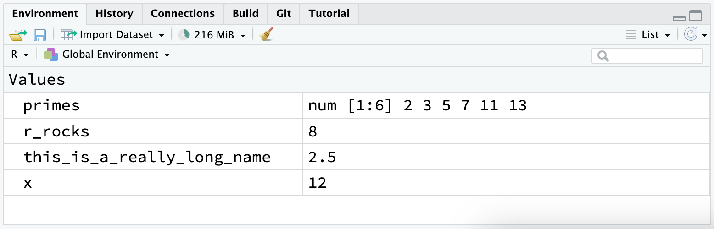

# 2. 工作流基础

2026-09-29: 润色文字
@since 2026-08-24⭐
@author Jiawei Mao
***
你现在已经有了一些运行 R 代码的经验。虽然没有讲太多细节，但你显然已掌握基础，否则早就放弃了。初学 R 感到沮丧很正常，因为 R 对标点符号的要求极其严格，错一个字符就会报错。这种挫败感很普遍，但只是暂时的，每个人都会经历这个阶段，而克服它的唯一方法就是不断尝试。

在进入下一步之前，先确保你已掌握运行 R 代码的基础，并熟悉 RStudio 最实用的一些功能。

## 2.1 编码基础

之前为快速上手画图省略了一些基础，现在回顾一下。

- R 可以用来执行基本的数学计算

```R
> 1 / 200 * 30
[1] 0.15
> (59 + 73 + 2)/3
[1] 44.66667
> sin(pi / 2)
[1] 1
```

- 使用赋值运算符 `<-` 创建对象

```R
x <- 3 * 4
```

注意，`x` 不会自动打印，只是存储值。在控制台输入 `x` 可查看该值。

- 使用 `c()` 函数将多个元素组合成一个向量（vector）

```R
primes <- c(2, 3, 5, 7, 11, 13)
```

- 对向量的基本算术运算，会逐元素应用

```R
primes * 2
#> [1]  4  6 10 14 22 26
primes - 1
#> [1]  1  2  4  6 10 12
```

- 所有赋值语句形式相同

```R
object_name <- value
```

可以把 `<-` 读作"对象 `object_name` 获得值 `value`"。

在实际编程中，赋值操作很频繁，而 `<-` 手动敲很麻烦。RStudio 快捷键 `Alt + -`（减号）可自动插入 `<-`，并在两侧加空格。

## 2.2 注释

R 会忽略同一行内 `#` 之后文本，可用于写注释。

```R
# create vector of primes
primes <- c(2, 3, 5, 7, 11, 13)

# multiply primes by 2
primes * 2
#> [1]  4  6 10 14 22 26
```

简短代码可能没必要每行都注释，但复杂代码的注释能节省大量时间，帮助清理代码逻辑。

注释应解释为什么**（Why）**，而非**是什么（What）**或**怎么做（How）**。从代码能看出做了什么和怎么做，但要弄明白当初为什么这么做很难。若用注释描述操作步骤，改代码后又要同步更新，否则容易造成混乱。

例如，`geom_smooth()` 函数的 `span` 参数用来控制曲线的平滑度，值越大曲线就越平滑。假设你将 `span` 从默认 0.75 改为 0.9：变化可见，但原因只有注释能说明。

在数据分析中，建议用注释记录整体分析思路，和分析过程中重要发现，因为这些宝贵的思路与洞察无法从代码本身找回。

## 2.3 命名规范

R 对象名必须以字母开头，只能包含字母、数字、下划线 `_` 和点 `.`。当名称包含多个单词，推荐**蛇形命名法（snake_case）**：单词小写，单词之间用下划线 `_` 连接。

```R
i_use_snake_case
otherPeopleUseCamelCase
some.people.use.periods
And_aFew.People_RENOUNCEconvention
```

在第 4 章讨论代码风格时会再次讨论命名问题。

- 输入对象名称可查看对象的内容

```R
x
#> [1] 12
```

- 长名称赋值

```R
this_is_a_really_long_name <- 2.5
```

输入长名称时，可使用 RStudio 的自动补全功能：输入 `this` 后按 `TAB` 键可自动补全。

若值写错，按 `↑`（向上箭头）可调出上一条命令并继续编辑；或输入 `this` 后按 `Cmd/Ctrl + ↑`，从命令中选择，然后按回车键重新执行。

- 再次赋值

```R
r_rocks <- 2^3
```

- 查看值

```R
r_rock
#> Error: object 'r_rock' not found
R_rocks
#> Error: object 'R_rocks' not found
```

R 会替你完成计算，但指令必须绝对精准。拼写错误和大小写错误都会报错。

## 2.4 调用函数

R 内置大量函数，调用格式为：

```R
function_name(argument1 = value1, argument2 = value2, ...)
```

以 `seq()` 函数为例，它生成等差数列。输入 `se` 并按 `TAB` 键，会弹出补全选项；继续输入 `q` 或用方向键选择 `seq()`。此时会弹窗显示该函数的参数与用途，按 `F1` 键右下角面板会显示详细信息。

选中所需函数后按 `TAB` 自动补全括号。接着输入参数 `from=1`， `to=10`，按回车键运行。

```R
seq(from = 1, to = 10)
#>  [1]  1  2  3  4  5  6  7  8  9 10
```

通常可省略前几个参数名：

```R
seq(1, 10)
#>  [1]  1  2  3  4  5  6  7  8  9 10
```

输入以下代码，你会发现 RStudio 会辅助生成成对引号：

```R
x <- "hello world"
```

引号和括号必须成对。若 R 会显示续行符 `+`：

```R
> x <- "hello
+
```

表示 R 在等待输入，通常是因为缺少 `"` 或 `)`。补上缺失符号，或按 `ESC` 键中止重来。

右上角“环境（Environment）”标签页会显示已创建的所有对象：



## 2.5 练习题

1. 这段代码为什么无法运行？注意仔细观察。

```r
my_variable <- 10
my_varıable
#> Error:
#> ! object 'my_varıable' not found
```


2. 调整以下命令，使其能够正确运行：

```r
libary(todyverse)

ggplot(dTA = mpg) + 
  geom_point(maping = aes(x = displ y = hwy)) +
  geom_smooth(method = "lm)
```

3. 按 `Option + Shift + K` / `Alt + Shift + K`，会发生什么？如何通过菜单栏到达同一位置？

4. 回顾 1.6 节的一个练习。运行以下代码，哪张图会保存为 `mpg-plot.png`？为什么？

```r
my_bar_plot <- ggplot(mpg, aes(x = class)) +
  geom_bar()
my_scatter_plot <- ggplot(mpg, aes(x = cty, y = hwy)) +
  geom_point()
ggsave(filename = "mpg-plot.png", plot = my_bar_plot)
```

## 2.6 本章小结

现在你更了解 R 代码的运行机制，也掌握了一些实用技巧，日后回看代码能更快理解其逻辑。下一章将介绍 `dplyr` 包，它是 `tidyverse` 中用于数据转换的核心工具，可轻松筛选变量、过滤行、计算汇总统计数据。

