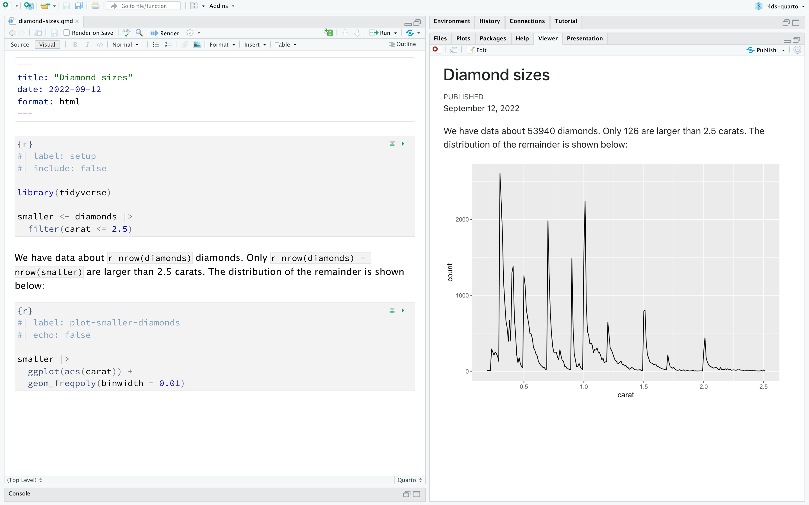

# Quarto

2026-08-24
@author Jiawei Mao
***
## 1. 简介

Quarto 提供一套面向数据科学的统一创作框架，可以把**代码、运行结果与叙述文字**融合在一起。Quarto 文档具备完全可复现的特性，支持几十种输出格式，例如 PDF、Word 文档、演示文稿等等。

Quarto 文件主要有三类使用场景：

1. **面向决策者汇报成果**：读者只关心分析结论，不需要看背后的代码。
2. **和其他数据科学家协作**（也包括你自己）：既要看结论，也要看得出结论的实现过程，也就是代码。
3. **开展数据科学分析的工作环境**：充当现代版实验记录本，不仅可以记录你做了什么操作，还可以记录你的思考过程。

Quarto 是**命令行工具，并非 R 包**。这意味着你基本不能用 `?` 获取帮助。学习本章以及后续使用 Quarto 时，请查阅官方网站：https://quarto.org/。

如果你用过 R Markdown，心里可能会想：“Quarto 听上去和 R Markdown 很像”。确实如此！Quarto 将 R Markdown 生态众多扩展包（rmarkdown、bookdown、distill、xaringan 等）的能力整合进一套统一连贯的系统；除此之外还原生支持 R、Python、Julia 等多种编程语言。某种意义上，Quarto 凝聚了十余年来维护、拓展 R Markdown 生态所积累的全部经验。

### 1.1 先决条件

你需要 Quarto 命令行程序（Quarto CLI），但**不需要手动安装和加载它**，RStudio 在需要时会自动完成这两件事。

## 2. Quarto 基础

下面就是一份 Quarto 文件，它是**纯文本文件，文件后缀为 `.qmd`**：

````markdown
---
title: "Diamond sizes"
date: 2022-09-12
format: html
---

```{r}
#| label: setup
#| include: false

library(tidyverse)

smaller <- diamonds |> 
  filter(carat <= 2.5)
```

We have data about `r nrow(diamonds)` diamonds.
Only `r nrow(diamonds) - nrow(smaller)` are larger than 2.5 carats.
The distribution of the remainder is shown below:

```{r}
#| label: plot-smaller-diamonds
#| echo: false

smaller |> 
  ggplot(aes(x = carat)) + 
  geom_freqpoly(binwidth = 0.01)
```
````

该文件包含三类重要内容：

1. **YAML 头部**（可选），使用`---`符号包裹；
2. **R 代码块**，使用 ``` 符号包裹；
3. 正文文本，搭配简单文本格式语法，例如`# 标题`和`_斜体_`。

图 28.1 展示了 RStudio 中使用笔记本界面的`.qmd`文档，代码与运行输出交错排布。你可以点击代码块上方的**运行图标**（外形如同播放按钮），或者按下快捷键 Cmd / Ctrl + Shift + Enter，来执行单个代码块。RStudio 会运行代码，并把输出结果直接内嵌显示在代码块的下方。


> **图 28.1**：RStudio 中的一份 Quarto 文档。文档内代码与输出交错显示，绘图结果直接出现在对应代码的正下方。

如果你不希望图表和运行结果直接显示在文档内部，而更想使用 RStudio 的**控制台（Console）**与**绘图面板（Plot）**，可以点击 “Render（渲染）” 旁边的齿轮图标，切换为 **“Chunk Output in Console（代码块输出到控制台）”**，如下图。


> **图 28.2**：RStudio 中的 Quarto 文档，绘图结果显示在绘图面板中。

如果你想要生成一份包含全部文字、代码和运行结果的完整报告，可以点击 “Render（渲染）” 按钮，或者按下快捷键 Cmd / Ctrl + Shift + K。也可以用代码函数完成渲染：`quarto::quarto_render("diamond‑sizes.qmd")`。执行之后，报告会在 RStudio 的**查看器面板（viewer pane）**中预览展示，同时生成一份 HTML 文件，效果见下图。



> **图 28.3**：RStudio 中的 Quarto 文档，渲染完成的文档显示在查看器面板中。

渲染文档时，Quarto 会把`.qmd`文件交给 **knitr**（https://yihui.org/knitr/）。knitr 会执行全部代码块，生成一份全新的 Markdown（`.md`）文档，这份文档包含源代码以及代码运行输出结果。 knitr 生成的 Markdown 文件会再交由 **pandoc**（https://pandoc.org/）处理，由 pandoc 负责生成最终成品文件。该工作流程如下图所示。 这种两步处理工作流的优势在于：你可以由此生成种类十分丰富的输出格式。


> **图 28.4**：Quarto 工作流程图：从 qmd 文件，经由 knitr 生成 md 文件，再通过 pandoc 转换，最终输出 PDF、微软 Word 或 HTML 格式文档。

在菜单栏选择 `File > New File > Quarto Document...` 创建 `.qmd` 文件。RStudio 会弹出一个创建向导，向导可以预先在文档中填入示例内容，帮助你快速熟悉 Quarto 的各项核心功能。

接下来深入讲解 Quarto 文档的三大组成部分：Markdown 正文文本、代码块以及 YAML 头部。

## 3. 可视化编辑器

RStudio 的可视化编辑器提供了一套 **WYSIWYM（所见即所想）** 界面，用于编写 Quarto 文档。在底层，Quarto 文档（`.qmd`）的正文是用 Markdown 编写的，Markdown 是一套用于格式化纯文本文件的轻量语法规范。实际上 Quarto 使用的是 Pandoc Markdown（Markdown 的小幅扩展版本），它支持表格、引用、交叉引用、脚注、div/span 标签、定义列表、属性、原生 HTML/TeX 等诸多功能，同时还可以运行代码块并内嵌展示运行结果。

在可视化编辑器中，既可以使用菜单栏上的按钮插入图片、表格、交叉引用等内容；也可以使用**万能快捷键** ⌘ + /（Mac）或 Ctrl + /（Windows/Linux），几乎可以插入任意元素。如 28.5 图所示，当光标位于行首时，你只需要输入 `/` 即可唤起该快捷插入面板。

![A Quarto document displaying various features of the  visual editor such as text formatting (italic, bold,  underline, small caps, code, superscript, and subscript), first through third level headings, bulleted and numbered lists, links, linked phrases, and images (along with a  pop-up window for customizing image size, adding a  caption and alt text, etc.), tables with a header row,  and the insert anything tool with options to insert an  R code chunk, a Python code chunk, a div, a bullet list,  a numbered list, or a first level heading (the top few  choices in the tool).](./images/quarto-visual-editor.png)

> 图 28.5：Quarto 可视化编辑器

可视化编辑器还可以便捷地插入图片并自定义图片的展示方式。你可以直接把剪贴板里的图片粘贴到可视化编辑器中（RStudio 会把图片副本保存到项目目录下，并自动生成图片链接）；也可以通过可视化编辑器的「插入 > 图形 / 图片」菜单，浏览本地文件选择图片，或者粘贴图片网络 URL。此外，借助该菜单，你还可以调整图片尺寸，为图片添加图题、替代文本以及超链接。

可视化编辑器还有大量本章没有逐一列举的功能，随着你使用它撰写文档经验的增长，你会慢慢发现这些实用功能。 

最重要的一点：尽管可视化编辑器以带排版效果的形式展示内容，但在底层，文档仍然以纯 Markdown 格式保存。你可以在可视化编辑器与源代码编辑器之间自由来回切换，任选一种模式查看、编辑文档内容。

## 4. 源代码编辑器

你也可以直接使用 RStudio 的**源代码编辑器**编辑 Quarto 文档，不需要可视化编辑器辅助。习惯使用谷歌文档这类软件写文档的用户会对可视化编辑器感到顺手；而写过 R 脚本或者 R Markdown 文档的用户，则会更适应源代码编辑器。源代码编辑器也适合排查 Quarto 语法错误，因为在纯文本模式下更容易发现这类问题。

下面这份示例指南演示了如何在源代码编辑器中，使用 Pandoc Markdown 语法来编写 Quarto 文档。

```markdown
## Text formatting

*italic* **bold** ~~strikeout~~ `code`

superscript^2^ subscript~2~

[underline]{.underline} [small caps]{.smallcaps}

## Headings

# 1st Level Header

## 2nd Level Header

### 3rd Level Header

## Lists

-   Bulleted list item 1

-   Item 2

    -   Item 2a

    -   Item 2b

1.  Numbered list item 1

2.  Item 2.
    The numbers are incremented automatically in the output.

## Links and images

<http://example.com>

[linked phrase](http://example.com)

{fig-alt="Quarto logo and the word quarto spelled in small case letters"}

## Tables

| First Header | Second Header |
|--------------|---------------|
| Content Cell | Content Cell  |
| Content Cell | Content Cell  |
```

学习这些语法最好的办法就是动手多多实践。刚开始需要花时间熟悉，但很快就会变成**本能习惯**，写的时候无需刻意思考语法。如果遗忘了语法，可以通过菜单：**帮助 > Markdown 快速参考**，打开一份便捷的语法速查表。

## 5. 代码块

如果要在 Quarto 文档中运行代码，需要插入代码块。一共有三种插入方式：

1. 快捷键：Cmd + Option + I（Mac） / Ctrl + Alt + I（Windows/Linux）
2. 编辑器工具栏上的「Insert」按钮图标
3. 手动输入代码块起止标记：` ```{r}` 和 `````

建议熟记快捷键，长期使用会帮你节省大量时间！

你仍然可以使用想必已经很熟悉的快捷键 Cmd/Ctrl + Enter 来逐行执行代码。而代码块有专属新快捷键：**Cmd/Ctrl + Shift + Enter**，用来运行整个代码块内的全部代码。可以把代码块类比成函数：代码块应当尽量独立完整，只围绕一项任务编写。

接下来几节将介绍**代码块头部**：它由 ` ```{r}` 开头，后面可接可选的代码块标签以及各类代码块选项；每一项配置单独占一行，以 `#|` 作为标记。

### 5.1 Chunk label

代码块可以设置一个可选标签，例如：

````R
```{r}
#| label: simple-addition
1 + 1
```
````

```
#> [1] 2
```

设置标签有三点好处：

1. 你可以借助脚本编辑器左下角的下拉式代码导航器，更便捷地跳转到指定代码块。


2. 代码块生成的图形会获得对应文件名，方便你在其他地方复用这些图片。
3. 你可以搭建一组具备缓存关联关系的代码块，避免每次渲染都重新执行耗时巨大的计算。

chunk-label 应当简短且表意清晰，**不能包含空格**。推荐使用短横线（`-`）分隔单词（而非下划线`_`），并且标签中尽量不要使用其他特殊字符。

一般情况下你可以随意为代码块命名，但有一个特殊名称会触发专属行为：**setup**。在笔记本模式下，名为`setup`的代码块会在所有其他代码运行之前，**自动执行一次**。

此外，代码块标签不可重复，每一个代码块的标签都必须唯一。

### 5.2 代码块选项

代码块的输出效果可以通过**选项**进行自定义，这些选项是写在代码块头部的配置字段。knitr 提供了近 60 个选项，用来对代码块做各类定制。本节只讲解你会高频使用的核心选项。完整选项列表可以查阅：https://yihui.org/knitr/options/

最重要的一类选项用来控制代码块是否执行，以及哪些结果会被放入最终报告：

- `eval: false`：**不运行代码**。显而易见，代码不执行就不会生成任何结果。适合只展示示例代码，或是一次性停用一大段代码。
- `include: false`：**运行代码，但最终文档里不显示代码和任何运行结果**。适合放置初始化配置代码，避免报告内容杂乱。
- `echo: false`：**隐藏源代码，但保留运行结果**。如果你撰写的报告面向不需要看到底层 R 代码的读者，可以使用该选项。
- `message: false` / `warning: false`：在最终文档中屏蔽代码输出的提示信息、警告信息。
- `results: hide`：隐藏文本打印输出
- `fig‑show: hide`：隐藏生成的绘图
- `error: true`：即便代码报错，渲染过程仍然继续执行。最终版报告一般很少开启该选项；但调试 `.qmd` 文档问题、教学演示故意展示报错案例时非常有用。默认值 `error: false`：只要文档中出现一处代码错误，渲染就直接终止失败。

以上所有代码块选项都写在代码块头部，以 `#|` 开头。例如下面的代码块，由于`eval`设置为`false`，不会输出运行结果。

````R
```{r}
#| label: simple-multiplication
#| eval: false
2 * 2
```
````

下表汇总了各个选项分别会屏蔽哪一类输出内容：

| 选项           | 运行代码 | 显示代码 | 文本输出 | 绘图 | 提示信息 | 警告信息 |
| -------------- | -------- | -------- | -------- | ---- | -------- | -------- |
| eval: false    | X        |          | X        | X    | X        | X        |
| include: false |          | X        | X        | X    | X        | X        |
| echo: false    |          | X        |          |      |          |          |
| results: hide  |          |          | X        |      |          |          |
| fig‑show: hide |          |          |          | X    |          |          |
| message: false |          |          |          |      | X        |          |
| warning: false |          |          |          |      |          | X        |

### 5.3 Global options

随着你不断使用 knitr，会发现部分代码块的默认选项无法满足你的需求，这时就需要修改默认设置。

 你可以在文档 YAML 头部的 `execute` 配置项下添加所需选项。例如，如果你编写一份报告，受众只需要查看结果与文字分析，不需要看到代码，你就可以在**文档全局层级**设置 `echo: false`。该配置默认隐藏所有代码，只有你主动指定 `echo: true` 的代码块才会显示源代码。你也可以考虑开启 `message: false` 和 `warning: false`，但这会增加调试问题的难度，因为最终生成的文档中将看不到任何提示信息。

```R
title: "My report"
execute:
  echo: false
```

由于 Quarto 为多语言设计（除 R 之外，还支持 Python、Julia 等其他语言），**并非所有 knitr 选项都能在文档的 execute 层级下使用**。这是因为一部分选项仅适用于 knitr，而无法作用于 Quarto 运行其他语言代码所使用的引擎（例如 Jupyter）。不过你仍然可以在文档的 `knitr` → `opts_chunk` 字段下，为 R‑knitr 设置这类全局选项。例如，在编写书籍与教学教程时，我们常会做如下配置：

```R
title: "Tutorial"
knitr:
  opts_chunk:
    comment: "#>"
    collapse: true
```

该配置采用了我们推荐的注释格式，并保证代码与其运行输出紧密地放在一起。

### 5.4 内联代码

还有另一种把 R 代码嵌入 Quarto 文档的方式：直接写在正文文字当中，语法为 ``r ``。如果你需要在叙述文本中引用数据的统计特征，该功能会十分好用。例如，本章开头的示例文档中就写了如下内容：

> 我们共有 ``r nrow(diamonds)`` 颗钻石的数据。其中仅有 ``r nrow(diamonds) - nrow(smaller)`` 颗钻石的重量大于 2.5 克拉。其余钻石的分布情况见下文：

当报告被渲染时，这些计算得到的结果就会被插入到正文当中：

>我们共有 53940 颗钻石的数据。其中仅有 126 颗钻石的重量大于 2.5 克拉。其余钻石的分布情况见下文：

在正文插入数值时，`format()` 函数非常实用。可以通过它设置有效数字位数，避免打印出精度过高、没有实际意义的结果；还可以通过 `big.mark` 参数给大数添加分隔符，提升可读性。你可以把这些功能封装成一个辅助函数：

```R
comma <- function(x) format(x, digits = 2, big.mark = ",")
comma(3452345)
#> [1] "3,452,345"
comma(.12358124331)
#> [1] "0.12"
```

