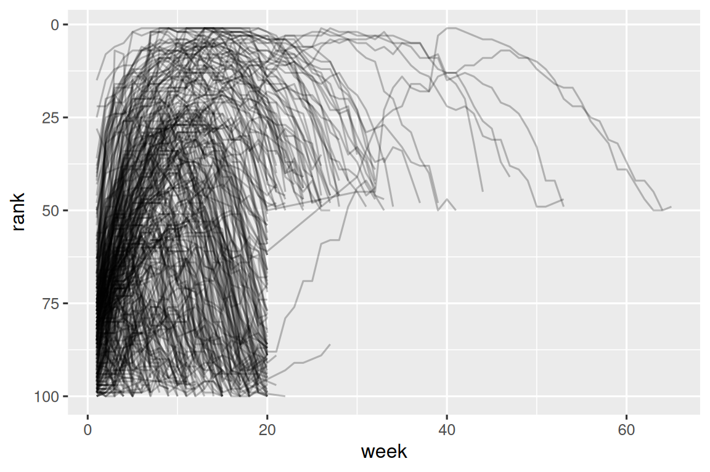
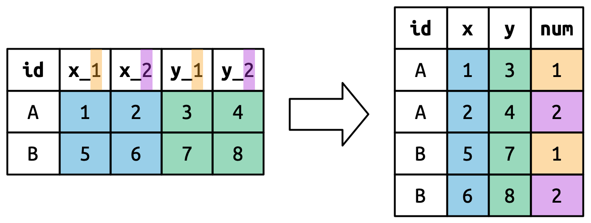

# 数据整理

2026-08-27⭐
@author Jiawei Mao
***
## 1. 简介

>“幸福的家庭都是相似的，不幸的家庭各有各的不幸。”
>—— 列夫·托尔斯泰
>
>“整洁的数据集都是相似的，但每个混乱的数据集都有各自混乱的原因。”
>—— Hadley Wickham

本章介绍一种在 R 中组织数据的一致方法，即使用一种称为“整洁数据”（tidy data）的系统。虽然将数据转换为这种格式需要在前期做一些工作，但从长远来看，这些付出是值得的。一旦拥有了整洁的数据，并结合 `tidyverse` 系列包提供的整洁工具，你将大幅减少在不同数据表示形式之间来回转换（清洗）的时间，从而能够将更多精力集中在你真正关心的数据问题上。

本章首先介绍整洁数据的定义，并了解如何将其应用于一个简单的玩具数据集（示例数据集）。接着，我们将深入探讨整理数据的核心工具：枢轴转换（pivoting）。枢轴转换允许你在不改变任何数据值的情况下，改变数据的形态。

### 1.1 准备工作

在本章中，我们将重点介绍 `tidyr` 包，它提供了一系列工具，帮助你整理混乱的数据集。tidyr 是 tidyverse 核心包家族的一员。

```R
library(tidyverse)
```

从本章开始，我们将隐藏 `library(tidyverse)` 的加载提示信息。

## 2. 整洁数据

同一份数据可以有多种表示方式。下面展示相同数据的三种不同组织形式。每个数据集都包含四个变量的相同值：国家（country）、年份（year）、人口数（population）以及结核病（TB）的确诊登记病例数，但每个数据集对这些值的组织方式各不相同。

```R
table1
#> # A tibble: 6 × 4
#>   country      year  cases population
#>   <chr>       <dbl>  <dbl>      <dbl>
#> 1 Afghanistan  1999    745   19987071
#> 2 Afghanistan  2000   2666   20595360
#> 3 Brazil       1999  37737  172006362
#> 4 Brazil       2000  80488  174504898
#> 5 China        1999 212258 1272915272
#> 6 China        2000 213766 1280428583

table2
#> # A tibble: 12 × 4
#>   country      year type           count
#>   <chr>       <dbl> <chr>          <dbl>
#> 1 Afghanistan  1999 cases            745
#> 2 Afghanistan  1999 population  19987071
#> 3 Afghanistan  2000 cases           2666
#> 4 Afghanistan  2000 population  20595360
#> 5 Brazil       1999 cases          37737
#> 6 Brazil       1999 population 172006362
#> # ℹ 6 more rows

table3
#> # A tibble: 6 × 3
#>   country      year rate             
#>   <chr>       <dbl> <chr>            
#> 1 Afghanistan  1999 745/19987071     
#> 2 Afghanistan  2000 2666/20595360    
#> 3 Brazil       1999 37737/172006362  
#> 4 Brazil       2000 80488/174504898  
#> 5 China        1999 212258/1272915272
#> 6 China        2000 213766/1280428583
```

这些都是对同一份数据的表示方式，但它们的易用程度各不相同。由于 `table1` 符合整洁数据的标准，因此在 tidyverse 中使用它会方便得多。

使数据集保持整洁有三条相互关联的规则：

1. 每个变量是一列；每列代表一个变量。
2. 每个观测值是一行；每行代表一个观测值。
3. 每个值是一个单元格；每个单元格只包含一个值。

图 5.1 直观地展示了这些规则。


> 图 5.1：使数据集保持整洁的三条规则：变量作为列，观测值作为行，值作为单元格。

为什么要确保你的数据是整洁的？主要有两大优势：

1. 首先，采用一致的方式来存储数据具有普遍的优势。拥有统一的数据结构，学习与之配套的工具就会变得更容易，因为这些工具的底层设计是统一的。
2. 其次，将变量放在列中具有特定的优势，这能让 R 语言的向量化特性充分发挥作用。正如你在 3.3.1 节和 3.5.2 节中学到的，大多数 R 语言的内置函数都是基于值向量（vectors）进行运算的。这使得对整洁数据进行转换时，感觉特别自然顺畅。

`dplyr`、`ggplot2` 以及 `tidyverse` 的其他包，都是为处理整洁数据而设计。下面是一些简单示例，展示如何使用 `table1` 这个数据集。

```R
# Compute rate per 10,000
table1 |>
  mutate(rate = cases / population * 10000)
#> # A tibble: 6 × 5
#>   country      year  cases population  rate
#>   <chr>       <dbl>  <dbl>      <dbl> <dbl>
#> 1 Afghanistan  1999    745   19987071 0.373
#> 2 Afghanistan  2000   2666   20595360 1.29 
#> 3 Brazil       1999  37737  172006362 2.19 
#> 4 Brazil       2000  80488  174504898 4.61 
#> 5 China        1999 212258 1272915272 1.67 
#> 6 China        2000 213766 1280428583 1.67

# Compute total cases per year
table1 |> 
  group_by(year) |> 
  summarize(total_cases = sum(cases))
#> # A tibble: 2 × 2
#>    year total_cases
#>   <dbl>       <dbl>
#> 1  1999      250740
#> 2  2000      296920

# Visualize changes over time
ggplot(table1, aes(x = year, y = cases)) +
  geom_line(aes(group = country), color = "grey50") +
  geom_point(aes(color = country, shape = country)) +
  scale_x_continuous(breaks = c(1999, 2000)) # x-axis breaks at 1999 and 2000
```


## 3. 数据拉长

整洁数据的原则看起来显而易见，以至于你可能会怀疑自己是否还会遇到不整洁的数据集。然而遗憾的是，现实中的大多数数据都是不整洁的。这主要有两个原因：

1. 首先，数据的组织方式往往是为了方便实现分析之外的其他目的。例如，为了方便数据录入（而非数据分析），数据常常会被构造成特定的结构。
2. 其次，大多数人对整洁数据的原则并不熟悉，除非你花费大量时间处理数据，否则很难自己总结出这些原则。

这意味着，在大多数实际的数据分析中，至少需要进行一些数据整理工作。你首先需要弄清楚数据中潜在的变量（variables）和观测值（observations）分别是什么。有时候这很容易判断；但在其他情况下，你可能需要向最初生成这些数据的人进行咨询。接下来，你需要将数据转换为整洁的形式，也就是把变量放在列中，把观测值放在行中。

`tidyr` 包提供了两个用于转换数据形态的函数：`pivot_longer()` 和 `pivot_wider()`。我们将首先从 `pivot_longer()` 开始，因为这是最常见的情况。让我们来看一些具体的例子。

### 3.1 列名中包含数据

`billboard` 数据集记录了 2000 年歌曲在 Billboard 排行榜上的排名：

```R
billboard
#> # A tibble: 317 × 79
#>   artist       track               date.entered   wk1   wk2   wk3   wk4   wk5
#>   <chr>        <chr>               <date>       <dbl> <dbl> <dbl> <dbl> <dbl>
#> 1 2 Pac        Baby Don't Cry (Ke… 2000-02-26      87    82    72    77    87
#> 2 2Ge+her      The Hardest Part O… 2000-09-02      91    87    92    NA    NA
#> 3 3 Doors Down Kryptonite          2000-04-08      81    70    68    67    66
#> 4 3 Doors Down Loser               2000-10-21      76    76    72    69    67
#> 5 504 Boyz     Wobble Wobble       2000-04-15      57    34    25    17    17
#> 6 98^0         Give Me Just One N… 2000-08-19      51    39    34    26    26
#> # ℹ 311 more rows
#> # ℹ 71 more variables: wk6 <dbl>, wk7 <dbl>, wk8 <dbl>, wk9 <dbl>, …
```

在该数据集中，每个观测值（observation）代表一首歌曲。前三列（`artist`、`track` 和 `date.entered`）是描述这首歌曲的变量。随后还有 76 列（`wk1` 到 `wk76`），分别描述了这首歌曲在每一周的排名。在这里，列名本身代表了一个变量（即“周数”），而单元格中的值则是另一个变量（即“排名”）。

为了将这些数据转换为整洁格式，我们将使用 `pivot_longer()` 函数：

```R
billboard |> 
  pivot_longer(
    cols = starts_with("wk"), 
    names_to = "week", 
    values_to = "rank"
  )
#> # A tibble: 24,092 × 5
#>    artist track                   date.entered week   rank
#>    <chr>  <chr>                   <date>       <chr> <dbl>
#>  1 2 Pac  Baby Don't Cry (Keep... 2000-02-26   wk1      87
#>  2 2 Pac  Baby Don't Cry (Keep... 2000-02-26   wk2      82
#>  3 2 Pac  Baby Don't Cry (Keep... 2000-02-26   wk3      72
#>  4 2 Pac  Baby Don't Cry (Keep... 2000-02-26   wk4      77
#>  5 2 Pac  Baby Don't Cry (Keep... 2000-02-26   wk5      87
#>  6 2 Pac  Baby Don't Cry (Keep... 2000-02-26   wk6      94
#>  7 2 Pac  Baby Don't Cry (Keep... 2000-02-26   wk7      99
#>  8 2 Pac  Baby Don't Cry (Keep... 2000-02-26   wk8      NA
#>  9 2 Pac  Baby Don't Cry (Keep... 2000-02-26   wk9      NA
#> 10 2 Pac  Baby Don't Cry (Keep... 2000-02-26   wk10     NA
#> # ℹ 24,082 more rows
```

在指定了数据参数之后，还有三个关键参数：

- `cols`：指定需要进行 pivot 转换的列，也就是那些不属于变量的列。该参数使用的语法与 `select()` 相同，因此在这里可以使用 `!c(artist, track, date.entered)` 或 `starts_with("wk")`。
- `names_to`：为存储在列名中的变量命名，这里我们将该变量命名为 `week`。
- `values_to`：为存储在单元格值中的变量命名，这里我们将该变量命名为 `rank`。

请注意，在代码中 `"week"` 和 `"rank"` 被加上了引号，因为它们是我们正在创建的新变量，在执行 `pivot_longer()` 函数调用时，它们还不存在于数据中。

现在，我们转向转换后变长（longer）的数据框。如果一首歌曲进入百强榜的时间不足 76 周，会发生什么情况呢？以 2 Pac 的《Baby Don’t Cry》为例，上面的输出结果表明，这首歌进入百强榜的时间只有 7 周，其余的周数都被填充了缺失值（NA）。这些 NA 并不真正代表未知的观测值；它们是由于数据集本身的结构而被迫存在的。因此，我们可以通过设置 `values_drop_na = TRUE`，让 `pivot_longer()` 将它们剔除：

```R
billboard |> 
  pivot_longer(
    cols = starts_with("wk"), 
    names_to = "week", 
    values_to = "rank",
    values_drop_na = TRUE
  )
#> # A tibble: 5,307 × 5
#>   artist track                   date.entered week   rank
#>   <chr>  <chr>                   <date>       <chr> <dbl>
#> 1 2 Pac  Baby Don't Cry (Keep... 2000-02-26   wk1      87
#> 2 2 Pac  Baby Don't Cry (Keep... 2000-02-26   wk2      82
#> 3 2 Pac  Baby Don't Cry (Keep... 2000-02-26   wk3      72
#> 4 2 Pac  Baby Don't Cry (Keep... 2000-02-26   wk4      77
#> 5 2 Pac  Baby Don't Cry (Keep... 2000-02-26   wk5      87
#> 6 2 Pac  Baby Don't Cry (Keep... 2000-02-26   wk6      94
#> # ℹ 5,301 more rows
```

现在的行数大幅减少，这表明许多包含 NA（缺失值）的行已被剔除。

你可能还会好奇，如果一首歌曲进入百强榜的时间超过了 76 周会怎样？虽然从这份数据中无法得知，但你可以推测，数据集中会额外添加 `wk77`、`wk78` 等列。

现在这份数据已经是整洁格式了，但我们可以使用 `mutate()` 和 `readr::parse_number()` 将 `week` 的值从字符串转换为数字，从而让后续的计算更加简便。`parse_number()` 函数可以从字符串中提取出第一个数字，并忽略所有其他文本。

```R
billboard_longer <- billboard |> 
  pivot_longer(
    cols = starts_with("wk"), 
    names_to = "week", 
    values_to = "rank",
    values_drop_na = TRUE
  ) |> 
  mutate(
    week = parse_number(week)
  )
billboard_longer
#> # A tibble: 5,307 × 5
#>   artist track                   date.entered  week  rank
#>   <chr>  <chr>                   <date>       <dbl> <dbl>
#> 1 2 Pac  Baby Don't Cry (Keep... 2000-02-26       1    87
#> 2 2 Pac  Baby Don't Cry (Keep... 2000-02-26       2    82
#> 3 2 Pac  Baby Don't Cry (Keep... 2000-02-26       3    72
#> 4 2 Pac  Baby Don't Cry (Keep... 2000-02-26       4    77
#> 5 2 Pac  Baby Don't Cry (Keep... 2000-02-26       5    87
#> 6 2 Pac  Baby Don't Cry (Keep... 2000-02-26       6    94
#> # ℹ 5,301 more rows
```

现在，我们已经将所有的周数（week）归入了一个变量，并将所有的排名（rank）归入了另一个变量，这样可以直观地展示歌曲排名随时间的变化情况。相关代码如下，结果如图 5.2 所示。我们可以发现，能够连续 20 周以上留在百强榜上的歌曲寥寥无几。

```R
billboard_longer |> 
  ggplot(aes(x = week, y = rank, group = track)) + 
  geom_line(alpha = 0.25) + 
  scale_y_reverse()
```



> 图 5.2：展示歌曲排名随时间变化的折线图。

### 3.2 数据透视（pivoting）是如何工作的？

已经介绍如何使用数据透视来重塑数据，接下来我们花点时间，凭直觉感受一下数据透视到底对数据做了什么。为了让大家更容易看清其中的变化，我们先从一个非常简单的数据集开始。假设我们有三位患者，ID 分别是 A、B 和 C，并且对每位患者都进行了两次血压测量。我们使用 `tribble()` 函数来创建这份数据——这是一个非常方便的小工具，能让我们通过手写的方式快速构建小型的 tibble 数据框：

```R
df <- tribble(
  ~id,  ~bp1, ~bp2,
   "A",  100,  120,
   "B",  140,  115,
   "C",  120,  125
)
```

我们希望新的数据集包含三个变量：`id`（已经存在）、`measurement`（即原来的列名）和 `value`（即单元格里的值）。为了实现这个目标，我们需要将 `df` 转换为长格式（pivot longer）：

```R
df |> 
  pivot_longer(
    cols = bp1:bp2,
    names_to = "measurement",
    values_to = "value"
  )
#> # A tibble: 6 × 3
#>   id    measurement value
#>   <chr> <chr>       <dbl>
#> 1 A     bp1           100
#> 2 A     bp2           120
#> 3 B     bp1           140
#> 4 B     bp2           115
#> 5 C     bp1           120
#> 6 C     bp2           125
```

数据重塑的过程是如何进行的呢？如果我们逐列来思考，就会更容易理解。

正如**图 5.3** 所示，对于原数据集中已经作为独立变量存在的列（比如 `id`），其中的值需要进行重复。具体要重复多少次，取决于被透视（pivoted）的列数：有多少列被透视，`id` 的值就需要重复多少次。


> **图 5.3**：原数据集中已经作为独立变量存在的列，其值需要进行重复。具体重复的次数，取决于被透视（pivoted）的列数——有多少列被透视，该列的值就需要重复多少次。

原来的列名会变成一个全新变量中的值，这个新变量的名称由 `names_to` 参数来定义，如**图 5.4** 所示。这些值需要进行重复，原数据集中有多少行，它们就需要重复多少次。


> **图 5.4**：被透视（pivoted）的列名会成为一个新列中的值。这些值需要进行重复，原数据集中有多少行，它们就需要重复多少次。

原来单元格里的数据也会变成一个全新变量中的值，这个新变量的名称由 `values_to` 参数来定义。这些数据会按行依次展开。**图 5.5** 展示了这一过程。


> **图 5.5**：数值的总数保持不变（不会被重复），而是按行依次展开。

### 3.3 列名中包含多个变量

当列名中挤入了多条信息，而你希望将这些信息拆分并存储到独立的新变量中时，处理起来就会更具挑战性。例如，我们来看看 `who2` 数据集，它就是上面提到的 `table1` 及其相关数据的来源：

```R
who2
#> # A tibble: 7,240 × 58
#>   country      year sp_m_014 sp_m_1524 sp_m_2534 sp_m_3544 sp_m_4554
#>   <chr>       <dbl>    <dbl>     <dbl>     <dbl>     <dbl>     <dbl>
#> 1 Afghanistan  1980       NA        NA        NA        NA        NA
#> 2 Afghanistan  1981       NA        NA        NA        NA        NA
#> 3 Afghanistan  1982       NA        NA        NA        NA        NA
#> 4 Afghanistan  1983       NA        NA        NA        NA        NA
#> 5 Afghanistan  1984       NA        NA        NA        NA        NA
#> 6 Afghanistan  1985       NA        NA        NA        NA        NA
#> # ℹ 7,234 more rows
#> # ℹ 51 more variables: sp_m_5564 <dbl>, sp_m_65 <dbl>, sp_f_014 <dbl>, …
```

这份数据集由世界卫生组织（WHO）收集，记录了关于结核病诊断的信息。其中有两列已经是独立的变量：`country`（国家）和 `year`（年份）。在这两列之后，还有 56 个类似 `sp_m_014`、`ep_m_4554` 和 `rel_m_3544` 这样的列。如果你仔细观察这些列名，就会发现其中的规律：每个列名都由三部分组成，中间用下划线 `_` 隔开。第一部分（如 sp/rel/ep）代表诊断方法；第二部分（如 m/f）代表性别（在此数据集中被编码为二分类变量）；第三部分（如 014/1524/2534/3544/4554/5564/65）代表年龄段（例如，014 代表 0-14 岁）。

因此，在这个例子中，`who2` 数据集实际上记录了六项信息：国家和年份（已经是独立的列）；诊断方法、性别类别和年龄段类别（隐藏在其余的列名中）；以及该类别下的患者人数（即单元格的值）。为了将这六项信息整理到六个独立的列中，我们需要使用 `pivot_longer()` 函数。具体做法是：

- 为 `names_to` 参数提供一个列名向量
- 为 `names_sep` 参数提供用于将原始变量名拆分成多部分的规则
- 为 `values_to` 参数指定一个列名

```R
who2 |> 
  pivot_longer(
    cols = !(country:year),
    names_to = c("diagnosis", "gender", "age"), 
    names_sep = "_",
    values_to = "count"
  )
#> # A tibble: 405,440 × 6
#>   country      year diagnosis gender age   count
#>   <chr>       <dbl> <chr>     <chr>  <chr> <dbl>
#> 1 Afghanistan  1980 sp        m      014      NA
#> 2 Afghanistan  1980 sp        m      1524     NA
#> 3 Afghanistan  1980 sp        m      2534     NA
#> 4 Afghanistan  1980 sp        m      3544     NA
#> 5 Afghanistan  1980 sp        m      4554     NA
#> 6 Afghanistan  1980 sp        m      5564     NA
#> # ℹ 405,434 more rows
```

除了 `names_sep`，还可以使用 `names_pattern` 参数。当你学完第 15 章的正则表达式后，就可以用它来应对更复杂的列名提取场景。

从概念上讲，这与你之前见过的简单情况只有微小的差别。**图 5.6** 展示了其基本思路：原来的列名不再是透视（pivot）到单一的一列中，而是被透视到多个列里。你可以想象这个过程分成了两步（先透视，再拆分），但在底层代码中，它实际上是一步完成的，因为这样处理速度更快。


> **图 5.6**：当列名中包含多条信息时，对其进行透视意味着原来的每个列名现在都会被拆分，并分别填入多个输出列中。

### 3.4 列标题中同时包含数据和变量名

接下来是一个更为复杂的情况：列名中不仅包含变量的值，还混合了变量本身的名称。例如，我们来看看 `household` 数据集：

```R
household
#> # A tibble: 5 × 5
#>   family dob_child1 dob_child2 name_child1 name_child2
#>    <int> <date>     <date>     <chr>       <chr>      
#> 1      1 1998-11-26 2000-01-29 Susan       Jose       
#> 2      2 1996-06-22 NA         Mark        <NA>       
#> 3      3 2002-07-11 2004-04-05 Sam         Seth       
#> 4      4 2004-10-10 2009-08-27 Craig       Khai       
#> 5      5 2000-12-05 2005-02-28 Parker      Gracie
```

这份数据集包含了五个家庭的信息，每个家庭最多记录了两个孩子的姓名和出生日期。这个数据集带来的新挑战在于：列名中同时包含了两个变量的名称（`dob` 代表出生日期，`name` 代表姓名），以及另一个变量的值（`child` 代表孩子，其值为 1 或 2）。

为了解决这个问题，我们同样需要向 `names_to` 参数传入一个向量，但这一次我们要使用一个特殊的标记符（sentinel）—— `.value`。它本身并不是一个变量的名称，而是一个特殊的值，用来告诉 `pivot_longer()` 函数执行不同的操作。它会覆盖默认的 `values_to` 参数的作用，转而将透视后的列名中的第一个组成部分，直接作为输出结果中的变量名。

```R
household |> 
  pivot_longer(
    cols = !family, 
    names_to = c(".value", "child"), 
    names_sep = "_", 
    values_drop_na = TRUE
  )
#> # A tibble: 9 × 4
#>   family child  dob        name 
#>    <int> <chr>  <date>     <chr>
#> 1      1 child1 1998-11-26 Susan
#> 2      1 child2 2000-01-29 Jose 
#> 3      2 child1 1996-06-22 Mark 
#> 4      3 child1 2002-07-11 Sam  
#> 5      3 child2 2004-04-05 Seth 
#> 6      4 child1 2004-10-10 Craig
#> # ℹ 3 more rows
```

我们再次使用了 `values_drop_na = TRUE`，因为输入数据的结构会强制产生显式的缺失值（例如，对于只有一个孩子的家庭）。

**图 5.7** 通过一个更简单的例子展示了这一基本思想。当你在 `names_to` 参数中使用 `.value` 时，输入数据中的列名将同时决定输出结果中的变量名和对应的值。



> **图 5.7**：使用 `names_to = c(".value", "num")` 进行透视时，会将原来的列名拆分为两部分：第一部分决定输出结果的列名（例如 `x` 或 `y`），第二部分则决定 `num` 列中的值。

## 4. 将数据变宽

到目前为止，我们一直在使用 `pivot_longer()` 来解决一类常见问题，即数据值被混入了列名中。接下来，我们将转向 `pivot_wider()` 函数。它通过增加列数、减少行数来使数据集变宽，这在处理“一个观测值被分散在多行中”的情况时非常有帮助。这种情况在现实数据中似乎相对少见，但在处理政府数据时却经常出现。

我们首先来看 `cms_patient_experience` 数据集，它由美国医疗保险与医疗补助服务中心（CMS）提供，用于收集患者的就医体验数据：

```R
cms_patient_experience
#> # A tibble: 500 × 5
#>   org_pac_id org_nm                     measure_cd   measure_title   prf_rate
#>   <chr>      <chr>                      <chr>        <chr>              <dbl>
#> 1 0446157747 USC CARE MEDICAL GROUP INC CAHPS_GRP_1  CAHPS for MIPS…       63
#> 2 0446157747 USC CARE MEDICAL GROUP INC CAHPS_GRP_2  CAHPS for MIPS…       87
#> 3 0446157747 USC CARE MEDICAL GROUP INC CAHPS_GRP_3  CAHPS for MIPS…       86
#> 4 0446157747 USC CARE MEDICAL GROUP INC CAHPS_GRP_5  CAHPS for MIPS…       57
#> 5 0446157747 USC CARE MEDICAL GROUP INC CAHPS_GRP_8  CAHPS for MIPS…       85
#> 6 0446157747 USC CARE MEDICAL GROUP INC CAHPS_GRP_12 CAHPS for MIPS…       24
#> # ℹ 494 more rows
```

该研究的核心单元是机构（organization），但每个机构的数据都分散在六行中，调查机构中进行的每一项测量指标各占一行。我们可以通过使用 `distinct()` 函数来查看 `measure_cd`（指标代码）和 `measure_title`（指标名称）的所有不重复值：

```R
cms_patient_experience |> 
  distinct(measure_cd, measure_title)
#> # A tibble: 6 × 2
#>   measure_cd   measure_title                                                 
#>   <chr>        <chr>                                                         
#> 1 CAHPS_GRP_1  CAHPS for MIPS SSM: Getting Timely Care, Appointments, and In…
#> 2 CAHPS_GRP_2  CAHPS for MIPS SSM: How Well Providers Communicate            
#> 3 CAHPS_GRP_3  CAHPS for MIPS SSM: Patient's Rating of Provider              
#> 4 CAHPS_GRP_5  CAHPS for MIPS SSM: Health Promotion and Education            
#> 5 CAHPS_GRP_8  CAHPS for MIPS SSM: Courteous and Helpful Office Staff        
#> 6 CAHPS_GRP_12 CAHPS for MIPS SSM: Stewardship of Patient Resources
```

这两列都不太适合直接用作变量名：`measure_cd` 看不出变量的具体含义，而 `measure_title` 又太长，而且包含空格。目前，我们先暂且用 `measure_cd` 作为新列名的来源；但在实际的分析中，你可能更希望创建一些既简短又有明确意义的自定义变量名。

`pivot_wider()` 函数的参数接口与 `pivot_longer()` 正好相反：我们不再是去设定新的列名，而是需要指定现有的列——即提供包含具体数值的列（`values_from`）以及作为新列名的列（`names_from`）：

```R
cms_patient_experience |> 
  pivot_wider(
    names_from = measure_cd,
    values_from = prf_rate
  )
#> # A tibble: 500 × 9
#>   org_pac_id org_nm                   measure_title   CAHPS_GRP_1 CAHPS_GRP_2
#>   <chr>      <chr>                    <chr>                 <dbl>       <dbl>
#> 1 0446157747 USC CARE MEDICAL GROUP … CAHPS for MIPS…          63          NA
#> 2 0446157747 USC CARE MEDICAL GROUP … CAHPS for MIPS…          NA          87
#> 3 0446157747 USC CARE MEDICAL GROUP … CAHPS for MIPS…          NA          NA
#> 4 0446157747 USC CARE MEDICAL GROUP … CAHPS for MIPS…          NA          NA
#> 5 0446157747 USC CARE MEDICAL GROUP … CAHPS for MIPS…          NA          NA
#> 6 0446157747 USC CARE MEDICAL GROUP … CAHPS for MIPS…          NA          NA
#> # ℹ 494 more rows
#> # ℹ 4 more variables: CAHPS_GRP_3 <dbl>, CAHPS_GRP_5 <dbl>, …
```

输出的结果看起来不太对劲；每个机构似乎依然对应着多行数据。这是因为，我们还需要告诉 `pivot_wider()` 函数，究竟是哪一列（或哪几列）包含了能够唯一标识每一行的值；在这个例子中，也就是那些以 "org" 开头的变量：

```R
cms_patient_experience |> 
  pivot_wider(
    id_cols = starts_with("org"),
    names_from = measure_cd,
    values_from = prf_rate
  )
#> # A tibble: 95 × 8
#>   org_pac_id org_nm           CAHPS_GRP_1 CAHPS_GRP_2 CAHPS_GRP_3 CAHPS_GRP_5
#>   <chr>      <chr>                  <dbl>       <dbl>       <dbl>       <dbl>
#> 1 0446157747 USC CARE MEDICA…          63          87          86          57
#> 2 0446162697 ASSOCIATION OF …          59          85          83          63
#> 3 0547164295 BEAVER MEDICAL …          49          NA          75          44
#> 4 0749333730 CAPE PHYSICIANS…          67          84          85          65
#> 5 0840104360 ALLIANCE PHYSIC…          66          87          87          64
#> 6 0840109864 REX HOSPITAL INC          73          87          84          67
#> # ℹ 89 more rows
#> # ℹ 2 more variables: CAHPS_GRP_8 <dbl>, CAHPS_GRP_12 <dbl>
```

这样我们就得到了想要的结果。

### 4.1 `pivot_wider()` 是如何工作的？

为了理解 `pivot_wider()` 的工作原理，让我们再次从一个非常简单的数据集开始。这一次，我们有两位患者，ID 分别为 A 和 B。其中，患者 A 有三次血压测量记录，患者 B 有两次血压测量记录：

```R
df <- tribble(
  ~id, ~measurement, ~value,
  "A",        "bp1",    100,
  "B",        "bp1",    140,
  "B",        "bp2",    115, 
  "A",        "bp2",    120,
  "A",        "bp3",    105
)
```

我们以 `value` 列作为新单元格的值，并以 `measurement` 列作为新的列名：

```R
df |> 
  pivot_wider(
    names_from = measurement,
    values_from = value
  )
#> # A tibble: 2 × 4
#>   id      bp1   bp2   bp3
#>   <chr> <dbl> <dbl> <dbl>
#> 1 A       100   120   105
#> 2 B       140   115    NA
```

在开始处理之前，`pivot_wider()` 首先需要确定哪些数据将被放入行，哪些数据将被放入列。新的列名将由 `measurement` 列中的唯一值构成。

```r
df |> 
  distinct(measurement) |> 
  pull()
#> [1] "bp1" "bp2" "bp3"
```

默认情况下，输出结果中的行是由那些**未被**用作新列名或新值的所有变量来决定的。这些变量被称为 `id_cols`（标识列）。在这个例子中只有一个这样的列，但通常来说，标识列的数量可以是任意的。

```R
df |> 
  select(!measurement & !value) |> 
  distinct()
#> # A tibble: 2 × 1
#>   id   
#>   <chr>
#> 1 A    
#> 2 B
```

接着，`pivot_wider()` 会将这些结果组合起来，生成一个空的数据框（data frame）：

```R
df |> 
  select(!measurement & !value) |> 
  distinct() |> 
  mutate(x = NA, y = NA, z = NA)
#> # A tibble: 2 × 4
#>   id    x     y     z    
#>   <chr> <lgl> <lgl> <lgl>
#> 1 A     NA    NA    NA   
#> 2 B     NA    NA    NA
```

随后，它会利用输入数据来填充所有缺失的值。在这个例子中，输出结果中的并非每个单元格都能在输入数据中找到对应的值，因为患者 B 并没有第三次血压测量记录，所以那个单元格会保持缺失状态。关于 `pivot_wider()` 能够“制造”缺失值这一概念，我们将在第 18 章中再次探讨。

你可能还会好奇，如果输入数据中有多个行对应输出结果中的同一个单元格，会发生什么情况？下面的例子中，就有两行数据同时对应着 id 为“A”且 measurement 为“bp1”的单元格：

```R
df <- tribble(
  ~id, ~measurement, ~value,
  "A",        "bp1",    100,
  "A",        "bp1",    102,
  "A",        "bp2",    120,
  "B",        "bp1",    140, 
  "B",        "bp2",    115
)
```

如果我们尝试对这样的数据进行宽表转换（pivot），得到的输出结果中会包含列表列（list-columns）。关于列表列的更多细节，你将在第 23 章中学习到：

```R
df |>
  pivot_wider(
    names_from = measurement,
    values_from = value
  )
#> Warning: Values from `value` are not uniquely identified; output will contain
#> list-cols.
#> • Use `values_fn = list` to suppress this warning.
#> • Use `values_fn = {summary_fun}` to summarise duplicates.
#> • Use the following dplyr code to identify duplicates.
#>   {data} |>
#>   dplyr::summarise(n = dplyr::n(), .by = c(id, measurement)) |>
#>   dplyr::filter(n > 1L)
#> # A tibble: 2 × 3
#>   id    bp1       bp2      
#>   <chr> <list>    <list>   
#> 1 A     <dbl [2]> <dbl [1]>
#> 2 B     <dbl [1]> <dbl [1]>
```

由于你目前还不知道如何处理这种数据，因此你需要根据警告信息（warning）中的提示，来排查问题究竟出在哪里：

```R
df |> 
  group_by(id, measurement) |> 
  summarize(n = n(), .groups = "drop") |> 
  filter(n > 1)
#> # A tibble: 1 × 3
#>   id    measurement     n
#>   <chr> <chr>       <int>
#> 1 A     bp1             2
```

接下来，就需要你自己去排查数据究竟出了什么问题，然后要么修复底层的数据损坏，要么利用分组（grouping）和汇总（summarizing）技巧，确保行与列值的每一种组合都只对应唯一的一行数据。

## 5. 本章小结

在本章中，你学习了“整洁数据”（tidy data）的概念：即变量存放在列中，观测值存放在行中的数据格式。整洁数据能让 tidyverse 生态下的工作变得更加轻松，因为大多数函数都理解这种一致的数据结构。你面临的主要挑战是如何将接收到的各种结构的数据转换为整洁格式。为此，你学习了 `pivot_longer()` 和 `pivot_wider()` 这两个函数，它们能帮你把许多不整洁的数据集转换为整洁格式。我们在这里展示的示例选自 `vignette("pivot", package = "tidyr")`，因此，如果你遇到了本章未能解决的问题，这篇 vignette 将是你接下来尝试的绝佳资源。

另一个挑战在于，对于某些特定的数据集，可能根本无法绝对地说出长格式或宽格式哪一个是“整洁”的。这在一定程度上反映了我们对整洁数据的定义：虽然我们认为整洁数据的每一列只包含一个变量，但我们实际上并没有明确定义什么是“变量”（而且事实证明，这出乎意料地难）。因此，保持务实的态度是完全可以的，你可以认为“能让你的分析最方便的，就是变量”。所以，如果你在思考如何进行某项计算时陷入了僵局，不妨考虑改变数据的组织方式；不要害怕在需要时打破整洁格式、进行数据转换，然后再重新整理为整洁格式！

如果你喜欢本章的内容并希望深入了解其背后的理论，你可以阅读发表在《统计软件杂志》（Journal of Statistical Software）上的《Tidy Data》论文，以了解更多关于整洁数据的历史和理论基础。

既然你现在已经编写了大量的 R 代码，是时候学习如何将代码组织到文件和目录中了。在下一章中，你将全面了解脚本（scripts）和项目（projects）的优势，以及它们提供的众多能让你的工作变得更轻松的工具。