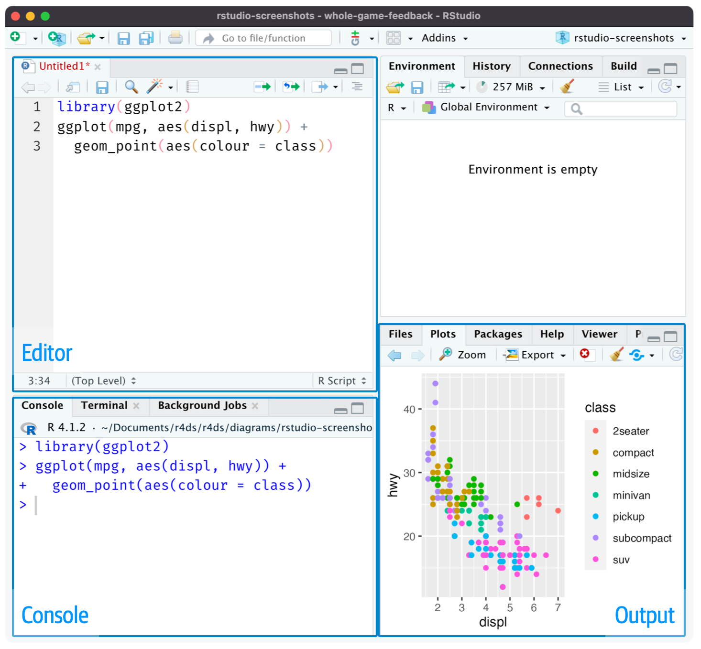
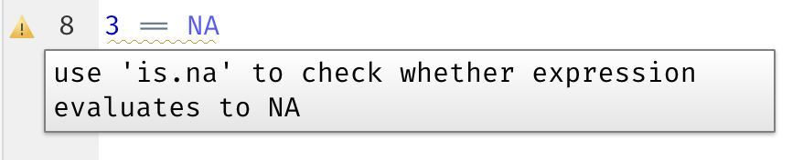

# 6. 脚本和项目

本章将向你介绍两种组织代码的必备工具：脚本（scripts）和项目（projects）。

## 6.1 脚本（Scripts）

到目前为止，你一直使用控制台（console）来运行代码。控制台是一个很好的起点，但随着你创建越来越复杂的 `ggplot2` 图形和越来越长的 `dplyr` 数据管道，你会发现控制台的空间很快就会变得捉襟见肘。为了获得更充裕的编写空间，你可以使用脚本编辑器。点击“File”（文件）菜单，选择“New File”（新建文件），然后点击“R script”（R 脚本），或者直接使用快捷键 `Cmd/Ctrl + Shift + N` 即可打开它。现在，你会看到四个窗格，如图 6.1 所示。

脚本编辑器是试验代码的绝佳场所。当你需要修改某些内容时，无需重新输入整段代码，只需编辑脚本并重新运行即可。而且，一旦你编写出了能够正常运行并达到预期效果的代码，就可以将其保存为脚本文件，以便日后随时轻松调用。



> 图 6.1：打开脚本编辑器会在 IDE（集成开发环境）的左上角新增一个窗格。

### 6.1.1 运行代码

脚本编辑器是构建复杂的 `ggplot2` 图表或编写长串 `dplyr` 数据处理管道的绝佳场所。想要高效使用脚本编辑器，关键在于记住一个最重要的快捷键：`Cmd/Ctrl + Enter`。这个快捷键会在控制台中执行当前的 R 表达式。例如，请看下面的代码：

```R
library(dplyr)
library(nycflights13)

not_cancelled <- flights |> 
  filter(!is.na(dep_delay)█, !is.na(arr_delay))

not_cancelled |> 
  group_by(year, month, day) |> 
  summarize(mean = mean(dep_delay))
```

如果你的光标位于 `█` 处，按下 `Cmd/Ctrl + Enter` 将会运行生成 `not_cancelled` 对象的完整命令。同时，光标会自动移动到下一条语句（以 `not_cancelled |>` 开头）。这使得你只需反复按下 `Cmd/Ctrl + Enter`，就能非常轻松地逐步执行整个脚本。

除了逐条表达式地运行代码外，还可以使用 `Cmd/Ctrl + Shift + S` 快捷键，一步执行整个脚本。经常这样做是一个好习惯，可以确保你已经把代码中所有重要的部分都完整地记录在了脚本里。

我们建议你在编写脚本时，始终将所需的包（packages）放在脚本的最开头。这样一来，如果你将代码分享给他人，他们就能很容易地看出需要安装哪些包。但需要注意的是，**绝对不要**在你分享的脚本中包含 `install.packages()` 函数。如果对方不够谨慎，你的脚本可能会在他们不知情的情况下修改电脑环境，这是非常不体贴的做法！

在学习后续章节时，我们强烈建议你从一开始就使用脚本编辑器，并多加练习这些快捷键。久而久之，通过这种方式将代码发送到控制台会变成一种自然而然的肌肉记忆，你甚至都不需要刻意去想它了。

### 6.1.2 RStudio 诊断功能

在脚本编辑器中，RStudio 会用红色波浪线以及侧边栏中的叉号（×）来高亮显示语法错误：


将鼠标悬停在该红色叉号上，即可查看具体的问题所在：


此外，对于潜在的问题，RStudio 也会发出提示：




### 6.1.3 保存与命名

当你退出 RStudio 时，它会自动保存脚本编辑器的内容，并在你重新打开时自动重新加载。尽管如此，最好还是避免使用“Untitled1”、“Untitled2”、“Untitled3”等默认名称，而是将脚本保存并赋予它们具有描述性的名称。

将文件命名为 `code.R` 或 `myscript.R` 可能很诱人，但在选择文件名之前，你应该再多思考一下。文件命名的三个重要原则如下：

1. **文件名应机器可读（machine readable）**：避免使用空格、符号和特殊字符。不要依赖大小写来区分文件。
2. **文件名应人类可读（human readable）**：使用文件名来描述文件的内容。
3. **文件名应便于默认排序**：文件名应以数字开头，这样在按字母顺序排序时，文件就会按照它们被使用的顺序排列。

例如，假设你的项目文件夹中有以下文件：

```text
alternative model.R
code for exploratory analysis.r
finalreport.qmd
FinalReport.qmd
fig 1.png
Figure_02.png
model_first_try.R
run-first.r
temp.txt
```

这里存在各种问题：很难确定首先应该运行哪个文件；文件名中包含空格；存在两个仅大小写不同的文件（`finalreport` 与 `FinalReport`）；并且有些名称没有描述其内容（如 `run-first` 和 `temp`）。

以下是命名和组织同一组文件的更好方式：

```text
01-load-data.R
02-exploratory-analysis.R
03-model-approach-1.R
04-model-approach-2.R
fig-01.png
fig-02.png
report-2022-03-20.qmd
report-2022-04-02.qmd
report-draft-notes.txt
```

对关键脚本进行编号可以明确它们的运行顺序，而一致的命名方案使差异更容易识别。此外，图形采用了类似的标记方式，报告通过文件名中包含的日期进行区分，而 `temp` 被重命名为 `report-draft-notes`，以更好地描述其内容。如果目录中有大量文件，建议进一步组织，将不同类型的文件（如脚本、图形等）放在不同的目录中。

