# Layers

@since 2026-09-16⭐
@author Jiawei Mao

***
## 1. 简介

本章将首先深入探讨图形属性映射（aesthetic mappings）、几何对象（geometric objects）和分面（facets）。接着，你将了解 `ggplot2` 在底层创建图表时进行的统计变换（statistical transformations）。这些变换用于计算需要绑定的新值，例如条形图中柱子的高度或箱线图中的中位数。你还将学习位置调整（position adjustments），它可以修改几何对象在图表中的显示方式。最后，我们会对坐标系（coordinate systems）进行简要介绍。

我们不会涵盖这些图层中所有的函数和选项，但会为你梳理 `ggplot2` 提供的最重要、最常用的功能，并为你介绍用于扩展 `ggplot2` 的第三方包。

### 1.1 准备工作

本章重点介绍 `ggplot2`。如需访问本章使用的数据集、帮助页面及函数，请运行以下代码加载 `tidyverse`：

```R
library(tidyverse)
```

## 2. 图形属性映射（Aesthetic mappings）

与 `ggplot2` 包捆绑在一起的 `mpg` 数据框，包含了 38 种汽车型号的 234 个观测值。

```R
mpg
#> # A tibble: 234 × 11
#>   manufacturer model displ  year   cyl trans      drv     cty   hwy fl   
#>   <chr>        <chr> <dbl> <int> <int> <chr>      <chr> <int> <int> <chr>
#> 1 audi         a4      1.8  1999     4 auto(l5)   f        18    29 p    
#> 2 audi         a4      1.8  1999     4 manual(m5) f        21    29 p    
#> 3 audi         a4      2    2008     4 manual(m6) f        20    31 p    
#> 4 audi         a4      2    2008     4 auto(av)   f        21    30 p    
#> 5 audi         a4      2.8  1999     6 auto(l5)   f        16    26 p    
#> 6 audi         a4      2.8  1999     6 manual(m5) f        18    26 p    
#> # ℹ 228 more rows
#> # ℹ 1 more variable: class <chr>
```

`mpg` 数据框中包含的变量有：

1. **displ**：汽车的发动机排量，单位为升（L）。这是一个数值型变量。
2. **hwy**：汽车在高速公路上的燃油效率，单位为英里每加仑（mpg）。在行驶相同距离的情况下，燃油效率低的汽车比燃油效率高的汽车消耗更多的燃料。这是一个数值型变量。

- **class**：汽车类型。这是一个分类型变量。

我们先可视化不同车型（class）的发动机排量（displ）与高速公路燃油效率（hwy）之间的关系。可以通过绘制散点图来实现：将这两个数值型变量分别映射到 x 轴和 y 轴，同时将分类型变量映射到颜色（color）或形状（shape）等图形属性上。

```R
library(tidyverse)

# Left
ggplot(mpg, aes(x = displ, y = hwy, color = class)) +
  geom_point()

# Right
ggplot(mpg, aes(x = displ, y = hwy, shape = class)) +
  geom_point()
#> Warning: The shape palette can deal with a maximum of 6 discrete values because more
#> than 6 becomes difficult to discriminate
#> ℹ you have requested 7 values. Consider specifying shapes manually if you
#>   need that many of them.
#> Warning: Removed 62 rows containing missing values or values outside the scale range
#> (`geom_point()`).
```


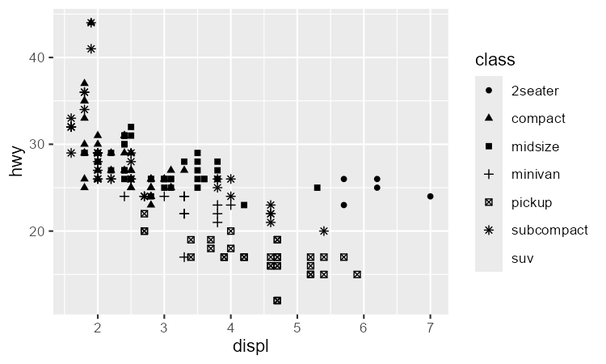

> [!TIP]
>
> 设置图形属性映射语法：
>
> ```R
> aes(x = displ, y = hwy, color = class)
> ```

将 `class` (汽车类型) 映射到形状（shape）时，会收到两条警告信息：

1. `shape` 调色板最多只能处理 6 个离散值，因为超过 6 个就很难区分，而数据中有 7 个
2. 删除了包含缺失值的 62 行数据 `geom_point()`

因为 `ggplot2` 默认一次最多只能使用 6 种形状，所以使用形状（shape）图形属性时，多出来的分组将不会被绘制出来。第二条警告信息与此相关——数据集中有 62 辆 SUV，但它们并没有被绘制在图中。

同样地，我们也可以将 `class`（汽车类型）映射到大小（size）或透明度（alpha）图形属性上，它们分别用来控制数据点的大小和透明度。

```R
library(tidyverse)

# Left
ggplot(mpg, aes(x = displ, y = hwy, size = class)) +
  geom_point()

# Right
ggplot(mpg, aes(x = displ, y = hwy, alpha = class)) +
  geom_point()

#Warning messages:
#1: Using size for a discrete variable is not advised. 
#2: Using alpha for a discrete variable is not advised. 
```


这两种做法同样也会产生警告信息：

> Using alpha for a discrete variable is not advised.

不建议将无序的离散型变量（如 `class`）映射到具有顺序含义的图形属性（如 `size` 或 `alpha`），因为这会暗示一种实际上并不存在的排序关系。

完成图形属性映射后，`ggplot2` 会自动处理后续工作：

- 它会为该图形属性选择一个合理的标度（scale），并生成一个图例，用于解释类别水平与具体数值之间的映射关系。
- 对于 x 轴和 y 轴图形属性，`ggplot2` 不创建图例，而是会生成带有刻度和标签的坐标轴。坐标轴提供了与图例相同的信息，即解释了位置与数值之间的映射关系。

此外，你也可以在几何对象函数（geom function）的参数中（放在 `aes()` 之外）手动设置几何对象的视觉属性，而不是依赖变量映射来决定其外观。例如，我们可以将图表中的所有数据点都设置为蓝色：

```r
library(tidyverse)

ggplot(mpg, aes(x = displ, y = hwy)) +
  geom_point(color = "blue")
```

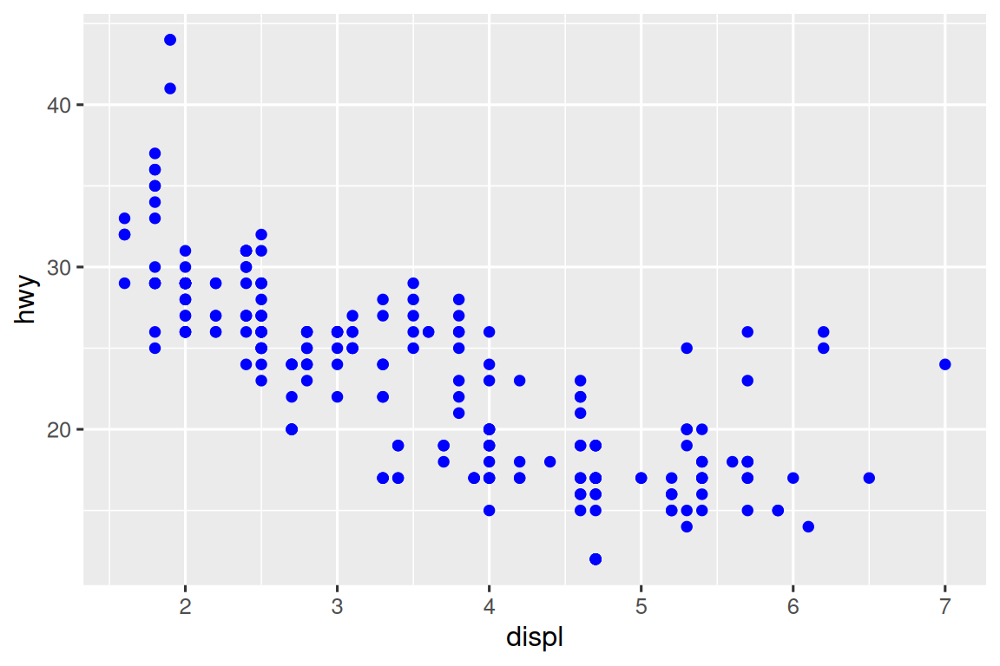

在这里，颜色不再传递关于某个变量的信息，而仅仅是为了改变图表的外观。你需要为该图形属性选择一个合理的值：

- 用字符串表示的颜色名称，例如 `color = "blue"`
- 以毫米（mm）为单位的数据点大小，例如 `size = 1`
- 用数字表示的数据点形状，例如 `shape = 1`，如图 9.1 所示。


> 图 9.1：R 内置了 26 种形状，通过数字进行标识。其中有一些看似重复的形状：例如，0、15 和 22 都是正方形。它们的区别在于 `color`（颜色）和 `fill`（填充）图形属性的相互作用。
>
> - 空心形状（0–14）的边框由 `color` 决定；
> - 实心形状（15–20）由 `color` 进行填充；
> - 而带填充的形状（21–25）则由 `color` 决定的边框，并由 `fill` 进行内部填充。
>
> 这些形状在排列时，会将相似的形状放在一起。

目前我们都是使用点（point）几何对象绘制散点图时映射或设置图形属性。关于所有可能的图形属性映射，你可以在 `ggplot2` 的官方文档“图形属性规范”（Aesthetic specifications） vignette 中了解更多：https://ggplot2.tidyverse.org/articles/ggplot2-specs.html。

需要注意的是，一个图表具体可以使用哪些图形属性，取决于你用来呈现数据的几何对象（geom）。在下一节中，我们将更深入地探讨几何对象。

### 2.1 练习题

1. 创建一个 `hwy` 与 `displ` 的散点图，要求数据点为粉色填充的三角形。

```R
library(tidyverse)

ggplot(mpg, aes(x = displ, y = hwy)) +
  geom_point(color = "pink", shape = 17)
```

2. 为什么下面的代码没有生成一个包含蓝色数据点的图表？

```r
ggplot(mpg) + 
  geom_point(aes(x = displ, y = hwy, color = "blue"))
```

在 `ggplot2` 中，`aes()` 用于将数据变量映射到图形属性，而固定值（如颜色、大小、形状）应写在 `aes()` 外部。

- 在 `aes()` 内写 `color = "blue"`，ggplot2 会认为你要创建一个新的变量，这个变量的所有值都是字符串 `"blue"`。
- 然后它把这个分类变量映射到颜色，并使用**默认的离散颜色标度**。默认色盘中第一个颜色是粉红色（`#F8766D`），所以点会变成粉红色，而不是蓝色。
- 同时，图例中会出现一个名为 `"blue"` 的条目，颜色是默认色盘的颜色。

正确写法：

```R
ggplot(mpg) + 
  geom_point(aes(x = displ, y = hwy), color = "blue")
```

3. `stroke`（描边）图形属性有什么作用？它适用于哪些形状？（提示：可以使用 `?geom_point` 查看帮助文档）

`stroke` 适用于具有边框的形状，即 21-25，用于设置边框线的宽度。

4. 如果在 `aes()` 中将某个图形属性映射为一个表达式而不是单纯的变量名（例如 `aes(color = displ < 5)`），会发生什么？（注意：你还需要同时指定 `x` 和 `y` 轴。）

ggplot2 会先计算这个表达式，得到一个逻辑向量，然后把这个逻辑向量当做一个新的分类变量来映射颜色。例如：

```r
library(tidyverse)

ggplot(mpg) +
  geom_point(aes(x = displ, y = hwy, color = displ < 5))
```

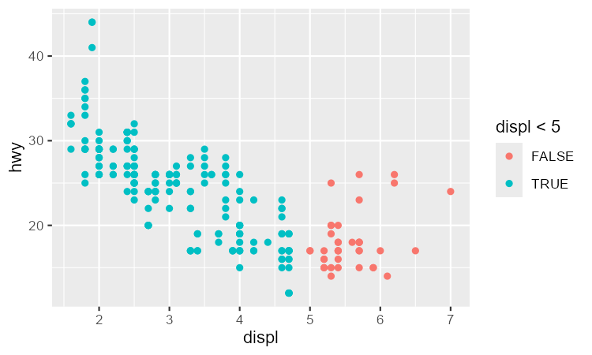

## 3. 几何对象（Geometric objects）

这两张图有什么相似之处？

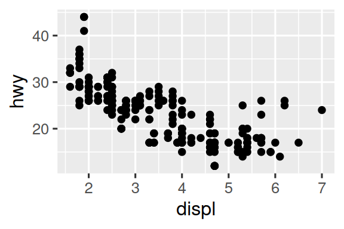

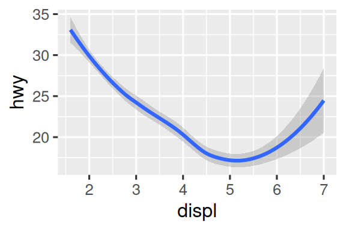

上图是汽车高速公路燃油效率与发动机排量的散点图；下图则展示了一条平滑曲线，描绘了这两个变量之间的关系轨迹，并且在平滑曲线周围还显示了置信区间。

这两张图包含相同的 x 变量和 y 变量，并且描述的是同一组数据。但它们并不完全相同。每张图都使用了不同的几何对象（geom）来呈现数据：

- 上图使用的是点（point）几何对象；
- 下图使用的是平滑（smooth）几何对象，即一条拟合数据的平滑线。

若要更改图表中的几何对象，只需修改你添加到 `ggplot()` 中的 geom 函数即可。例如，可以使用以下代码绘制上述图表：

```R
library(tidyverse)

ggplot(mpg, aes(x = displ, y = hwy)) +
  geom_point()

ggplot(mpg, aes(x = displ, y = hwy)) +
  geom_smooth()
```

`ggplot2` 中的每一个几何对象（geom）函数都接收一个映射（`mapping`）参数，该参数既可以在 geom 图层中局部定义，也可以在 `ggplot()` 图层中进行全局定义。

然而，并非所有的图形属性（aesthetic）都适用于所有的 geom。例如：

- 可以设置点的形状（`shape`），但无法设置线的“形状”。如果你这样做，`ggplot2` 会默默忽略该映射。
- 可以设置线的类型（`linetype`）。当你将某个变量映射到 `linetype` 时，`geom_smooth()` 会为该变量的每个唯一值绘制一条具有不同线型的平滑线。

```R
# Left
ggplot(mpg, aes(x = displ, y = hwy, shape = drv)) + 
  geom_smooth()

# Right
ggplot(mpg, aes(x = displ, y = hwy, linetype = drv)) + 
  geom_smooth()
```

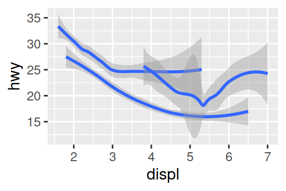

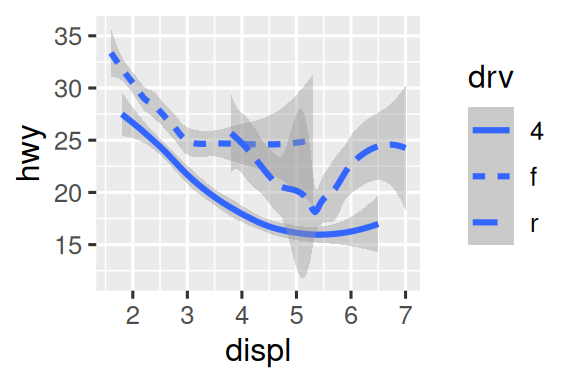

在这里，`geom_smooth()` 根据 `drv` 值将汽车分成了三条线，`drv` 描述的是汽车的驱动方式，其中：

- 一条线描述了所有 `drv` 值为 `4` 的数据点；
- 一条线描述了所有值为 `f` 的数据点；
- 还有一条线描述了所有值为 `r` 的数据点。

这里的 `4` 代表四轮驱动，`f` 代表前轮驱动，`r` 代表后轮驱动。

如果这听起来有些难以理解，我们可以通过将这些线叠加在原始数据之上，并根据 `drv` 对所有内容进行着色，来使图表更加清晰直观。

```r
ggplot(mpg, aes(x = displ, y = hwy, color = drv)) + 
  geom_point() +
  geom_smooth(aes(linetype = drv))
```

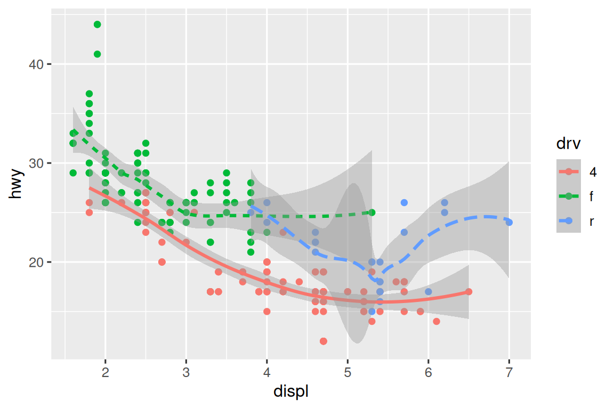

请注意，这张图在同一个图表中包含了两种 geoms。

许多几何对象（如 `geom_smooth()`）会使用单一的几何图形来展示多行数据。对于这类几何对象，你可以将 `group`（分组）图形属性设置为一个分类变量，从而绘制出多个图形。`ggplot2` 会根据分组变量的每个唯一值，分别绘制一个独立的图形。

在实际操作中，只要你将某个图形属性映射到一个离散变量上，`ggplot2` 就会自动为这些 geom 进行数据分组。通常我们应该使用这一自动特性，因为如果单独使用 `group` 图形属性，它并不会为 geoms 添加图例或其他用于区分的视觉特征。

```R
# top
ggplot(mpg, aes(x = displ, y = hwy)) +
  geom_smooth()

# Middle
ggplot(mpg, aes(x = displ, y = hwy)) +
  geom_smooth(aes(group = drv))

# bottom
ggplot(mpg, aes(x = displ, y = hwy)) +
  geom_smooth(aes(color = drv), show.legend = FALSE)
```


如果将映射（mappings）放在 geom 函数中，`ggplot2` 会将其视为该图层的局部映射。这些局部映射仅用于**扩展或覆盖**该图层的全局映射。从而可以在不同的图层中展示不同的图形属性。

```R
ggplot(mpg, aes(x = displ, y = hwy)) + 
  geom_point(aes(color = class)) + 
  geom_smooth()
```

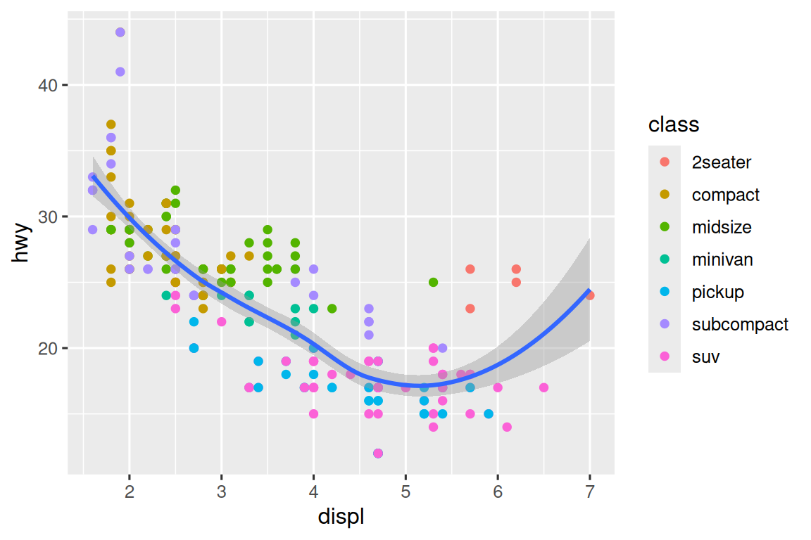

利用同样的思路，可以为不同图层**指定不同的数据**。在这里，我们使用红色的空心圆点来突出显示双座汽车。`geom_point()` 中的局部 `data`（数据）参数仅会覆盖该图层中 `ggplot()` 的全局 `data` 参数。

```R
library(tidyverse)

ggplot(mpg, aes(x = displ, y = hwy)) +
  geom_point() + # 使用所有数据绘制散点图，默认黑色实心圆
  geom_point( # 在原有散点上，用红色实心点重绘 2seater
    data = mpg |> filter(class == "2seater"),
    color = "red"
  ) +
  geom_point( # 在原有基础上，再画一个红色空心圆
    data = mpg |> filter(class == "2seater"),
    shape = "circle open",
    size = 3,
    color = "red"
  )
```

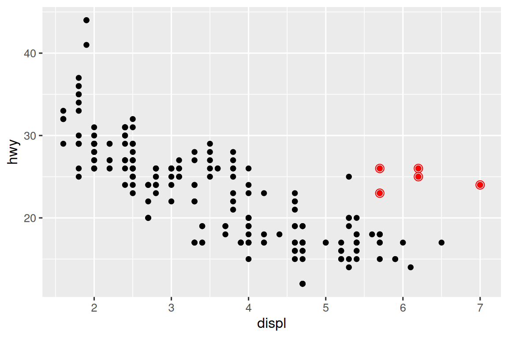

几何对象（Geoms）是 `ggplot2` 的基本构建模块。通过更改 geom，你可以彻底改变图表的呈现效果，而不同的 geom 也能揭示数据的不同特征。例如，下方的直方图和密度图揭示了高速公路油耗分布呈现双峰且右偏的特征，而箱线图则揭示了两个潜在的异常值。

```R
library(tidyverse)

ggplot(mpg, aes(x = hwy)) +
  geom_histogram(binwidth = 2)

ggplot(mpg, aes(x = hwy)) +
  geom_density()

ggplot(mpg, aes(x = hwy)) +
  geom_boxplot()
```

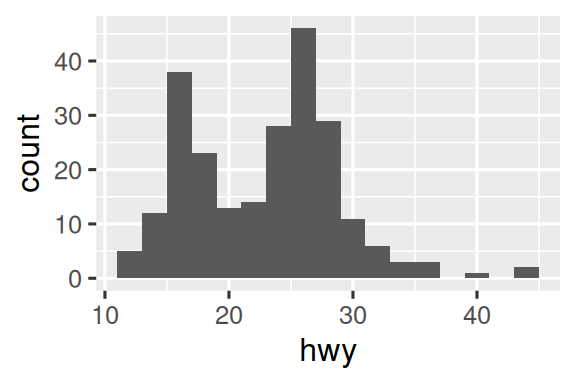

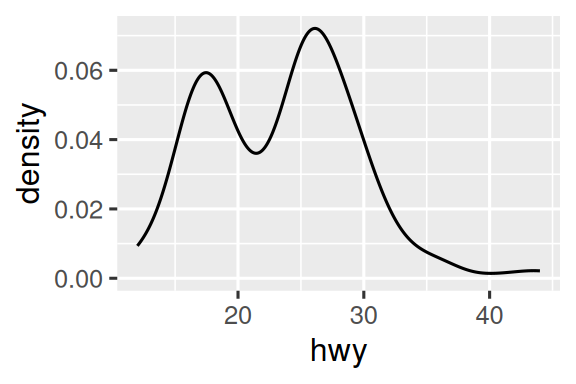

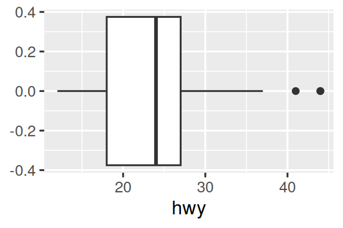

`ggplot2` 提供了超过 40 种 geoms，但这些仍不足以涵盖所有可能绘制的图表。如果你需要一种不同的几何对象，建议首先查看扩展包，看看是否已经有人实现了它（可以访问 https://exts.ggplot2.tidyverse.org/gallery/ 浏览一些示例）。例如，[`ggridges` 包](https://wilkelab.org/ggridges/) 非常适合绘制山脊图（ridgeline plots），这种图表对于可视化一个数值变量在不同分类变量水平下的密度分布非常有用。在下面的图表中，我们不仅使用了一种新的几何对象（`geom_density_ridges()`），还将同一个变量映射到了多个图形属性上（将 `drv` 同时映射到 `y`、`fill` 和 `color`），并且设置了一个图形属性（`alpha = 0.5`）来使密度曲线呈现半透明效果。

```R
library(tidyverse)
library(ggridges)

ggplot(mpg, aes(x = hwy, y = drv, fill = drv, color = drv)) +
  geom_density_ridges(alpha = 0.5, show.legend = FALSE)
#> Picking joint bandwidth of 1.28
```

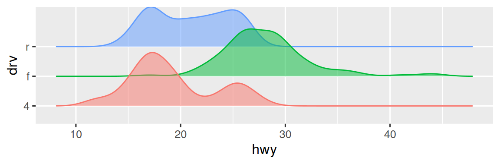

全面了解 ggplot2 提供的所有几何对象（geoms）以及包内的所有函数，最好的去处就是参考页面：https://ggplot2.tidyverse.org/reference。如果想深入了解某个具体的几何对象，可以使用帮助功能（例如，输入 `?geom_smooth`）。

### 3.1 练习题

1. 如果要绘制折线图，你会使用哪种几何对象（geom）？箱线图呢？直方图呢？面积图呢？

折线图：`geom_line()`

箱线图：`geom_boxplot()`

直方图：`geom_histogram()`

面积图：`geom_area()`

2. 在本章前面的内容中，我们使用了 `show.legend` 参数但没有进行解释：

```r
ggplot(mpg, aes(x = displ, y = hwy)) +
  geom_smooth(aes(color = drv), show.legend = FALSE)
```

在这里，`show.legend = FALSE` 的作用是什么？如果将其删除会发生什么？你认为我们在前面的例子中为什么要使用它？

`show.legend = FALSE` 禁止该 `geom` 图层在图形中生成图例条目。如果删除，图形右侧（或底部）会出现一个图例，标题为 `drv`，显示三种驱动类型对应的颜色。图例中通常还会带有一条线，表示这些颜色用于绘制平滑曲线。使用它可以避免图例重复或多余。

3. `geom_smooth()` 中的 `se` 参数有什么作用？

是否在平滑曲线周围显示置信区间带？（默认值为 `TRUE`，可通过 `level` 参数来控制置信水平。）

4. 重新编写生成以下图表所需的 R 代码。请注意，只要图表中使用了分类变量，该变量就是 `drv`。

```R
library(tidyverse)

ggplot(mpg, aes(x = displ, y = hwy)) +
  geom_point() +
  geom_smooth(se = FALSE)
```

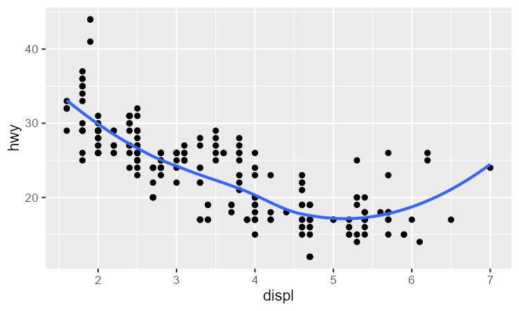

```R
library(tidyverse)

ggplot(mpg, aes(x = displ, y = hwy)) +
  geom_point() +
  geom_smooth(aes(group = drv), se = FALSE)
```

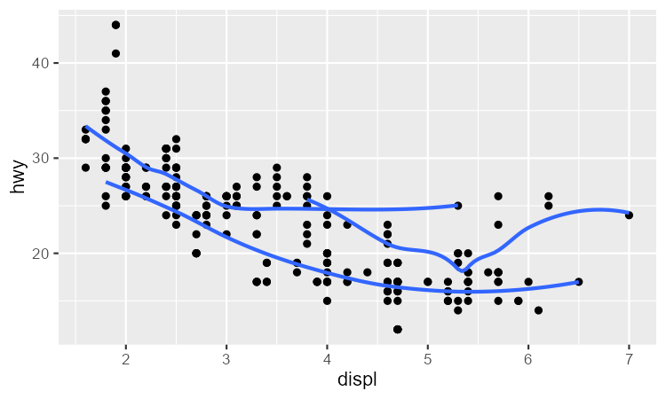

```R
library(tidyverse)

ggplot(mpg, aes(x = displ, y = hwy, color = drv)) +
  geom_point() +
  geom_smooth(se = FALSE)
```

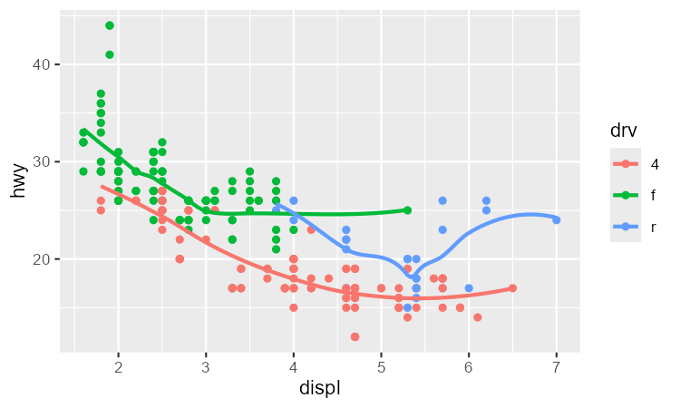

```R
library(tidyverse)

ggplot(mpg, aes(x = displ, y = hwy)) +
  geom_point(aes(color = drv)) +
  geom_smooth(se = FALSE)
```

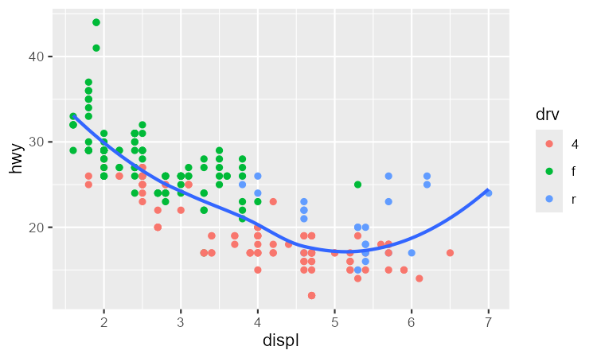

```R
library(tidyverse)

ggplot(mpg, aes(x = displ, y = hwy)) +
  geom_point(aes(color = drv)) +
  geom_smooth(aes(linetype = drv), se = FALSE)
```

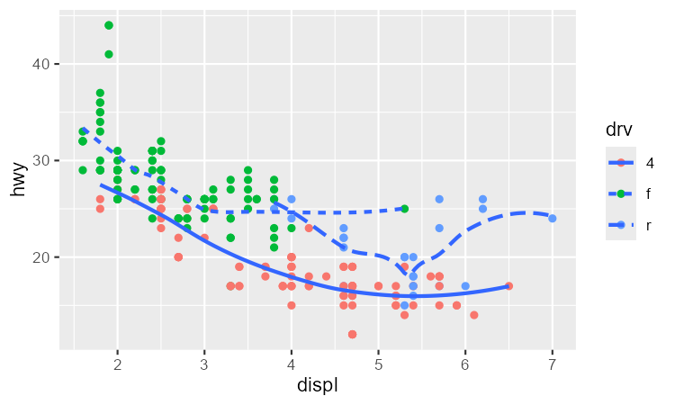

```R
library(tidyverse)

ggplot(mpg, aes(x = displ, y = hwy)) +
  geom_point(color = "white", size = 3) +
  geom_point(aes(color = drv))
```

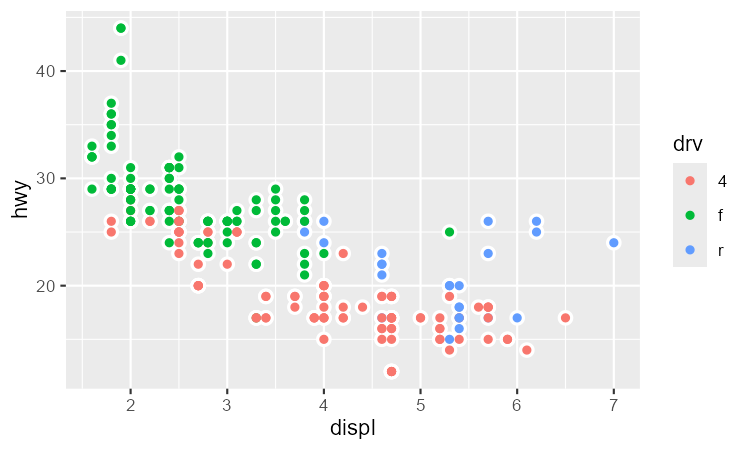

## 4. 分面（Facets）

在第 1 章中，你已经学习了如何使用 `facet_wrap()` 进行分面。该函数会根据某个分类变量，将图表拆分成多个子图，每个子图展示数据的一个子集。

- **facet_wrap**

```R
library(tidyverse)

ggplot(mpg, aes(x = displ, y = hwy)) +
  geom_point() +
  facet_wrap(~cyl)
```

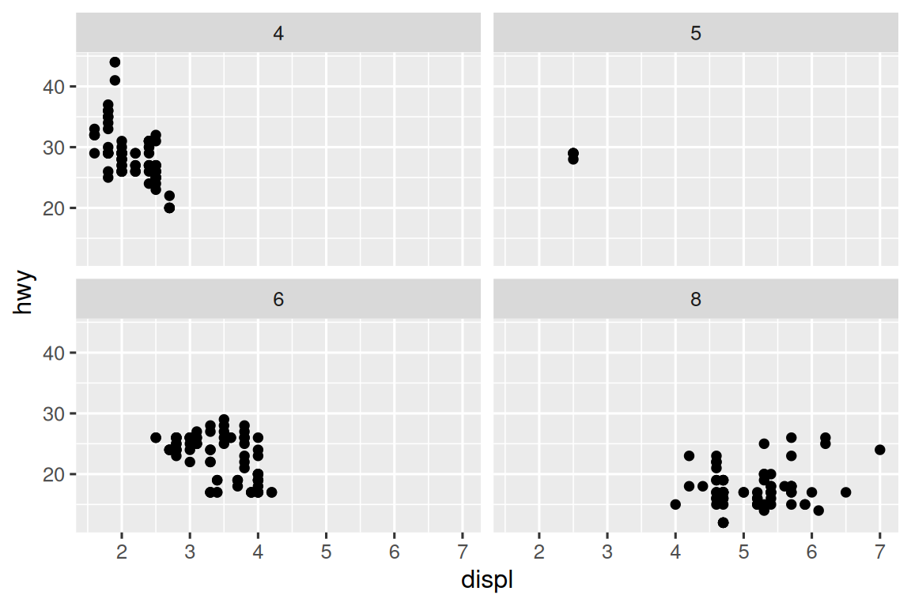

- **facet_grid**

如果要使用两个变量的组合对图表进行分面，可使用 `facet_grid()`。`facet_grid()` 的第一个参数同样是一个公式，但此时它是一个双侧公式：`rows ~ cols`（行 ~ 列）。

```R
ggplot(mpg, aes(x = displ, y = hwy)) + 
  geom_point() + 
  facet_grid(drv ~ cyl)
```

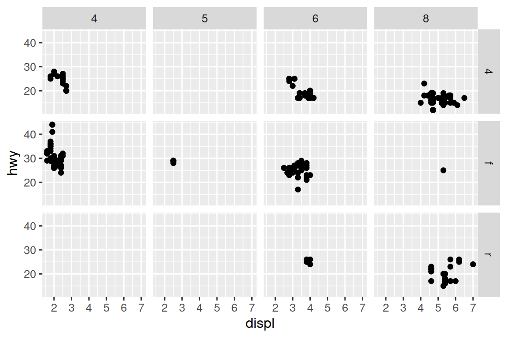

默认每个分面（facets）共享相同的 x 轴和 y 轴刻度与范围。当你需要跨分面比较数据时，这非常有用；但如果你想更好地展示每个分面内部的关系，这种设置就显得受限。

在分面函数中将 `scales`（刻度）参数：

- 设置为 `"free_x"`，允许各列拥有不同的 x 轴刻度；

- 设置为 `"free_y"`，允许各行拥有不同的 y 轴刻度；
- 设置为 `"free"`，允许 x 轴和 y 轴的刻度都各自独立。

```R
library(tidyverse)

ggplot(mpg, aes(x = displ, y = hwy)) +
  geom_point() +
  facet_grid(drv ~ cyl, scales = "free")
```

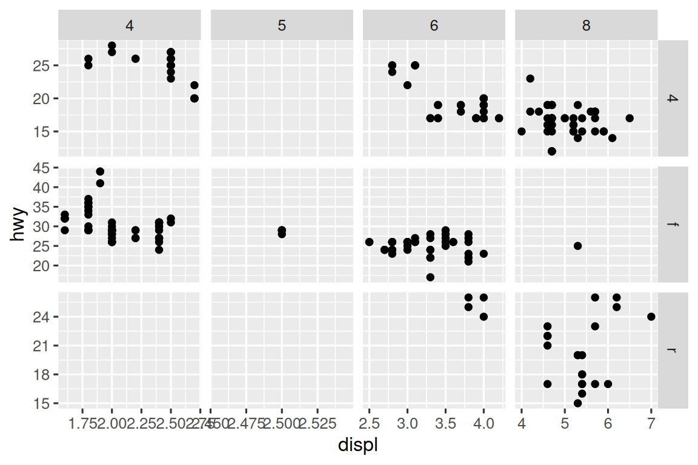

### 4.1 练习题

1. 如果对连续变量进行分面，会发生什么？

ggplot2 的分面（facet）的设计初衷是**按离散变量**（分类变量、因子）将数据拆分成多个子图。如果直接把一个**连续变量**传给 `facet_wrap()` 或 `facet_grid()`，ggplot2 会：

- 自动将其强制转换为因子（`as.factor()`）。
- 为每个唯一值创建一个分面面板。

- 发出警告：`Continuous variables are not allowed for facetting. Convert them to factors.`

2. 上面使用 `facet_grid(drv ~ cyl)` 绘制的图表中的空白单元格代表什么意思？请运行以下代码，这些空白单元格与生成的图表有什么关系？

```r
ggplot(mpg) + 
  geom_point(aes(x = drv, y = cyl))
```

3. 以下代码会绘制出什么样的图表？其中的 `.` 有什么作用？

```r
ggplot(mpg) + 
  geom_point(aes(x = displ, y = hwy)) +
  facet_grid(drv ~ .)

ggplot(mpg) + 
  geom_point(aes(x = displ, y = hwy)) +
  facet_grid(. ~ cyl)
```

`.` 是占位符，表示这一侧不分面。`facet_grid()` 的公式格式为：

```
行变量 ~ 列标量
```

`~` 左侧控制行分面，右侧控制列分面。

- `drv` 在左侧，表示按 `drv`（驱动类型）进行**行分面**。

- `.` 在右侧，表示**列方向不分面**。

结果：生成多个**垂直堆叠**的面板，每个 `drv` 类别占一行，所有面板共享同一组列（即只有一列）。

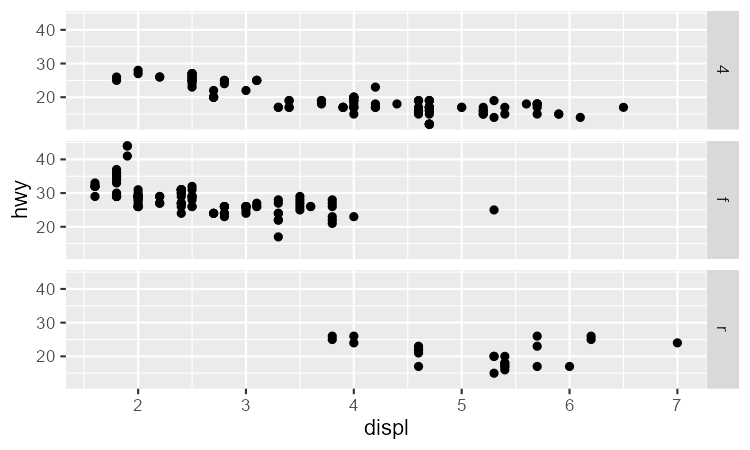

4. 观察本节中的第一个分面图表：

```r
ggplot(mpg) + 
  geom_point(aes(x = displ, y = hwy)) + 
  facet_wrap(~ cyl, nrow = 2)
```

使用分面代替颜色（color）图形属性有什么优势？又有什么劣势？如果数据集更大，这种优劣平衡可能会发生怎样的变化？

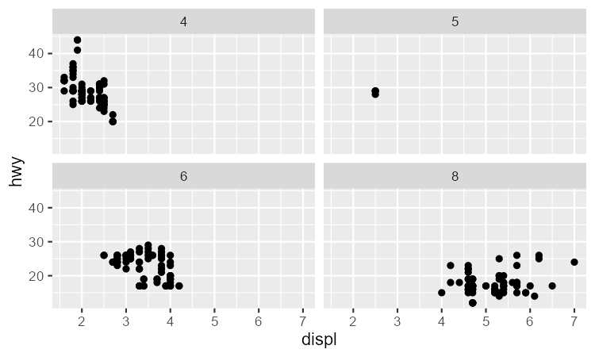

用分面（facet）代替颜色映射（color），本质上是把**一个维度上的分组信息**从“同一张图内的视觉编码”变成“多张子图的空间分离”。两者各有取舍。建议：

- 类别少，数据量大——优先分面，避免重叠
- 类别多，数据量小——优先颜色，避免面板太多
- 类别多，数据量大——考虑分面+颜色映射组合
- 需要组件比较——颜色映射更合适
- 需要展示组内结构——分面更合适。

5. 查阅 `?facet_wrap` 的帮助文档。`nrow` 的作用是什么？`ncol` 的作用是什么？还有哪些其他选项可以控制各个子图面板的布局？为什么 `facet_grid()` 没有 `nrow` 和 `ncol` 这两个参数？

`facet_wrap` 顾名思义，按一个离散变量将数据拆分为多个子图。它会自动换行，而 `nrow` 与 `ncol` 设置行数和列数。而 `facet_grid()` 使用两个变量，行数和列数等于这两个变量值的种类数。

6. 以下哪张图表更容易比较不同驱动系统（drive trains）汽车的发动机排量（displ）？这说明了在决定将分面变量放置在行还是列时，有什么规律？

```r
ggplot(mpg, aes(x = displ)) + 
  geom_histogram() + 
  facet_grid(drv ~ .)

ggplot(mpg, aes(x = displ)) +
  geom_histogram() +
  facet_grid(. ~ drv)
```

`drv ~ .` 将数据分为三行显示，而 `. ~ drv` 分为三列显示。横坐标为排量 `displ`，纵坐标为 count 数。count 并排显示更容易比较，因此，三列显示更合适。

7. 请使用 `facet_wrap()` 代替 `facet_grid()` 重新绘制以下图表。分面标签（facet labels）的位置发生了怎样的变化？

```r
ggplot(mpg) + 
  geom_point(aes(x = displ, y = hwy)) +
  facet_grid(drv ~ .)
```


替换为 `facet_wrap()`：

```R
library(tidyverse)

ggplot(mpg) +
  geom_point(aes(x = displ, y = hwy)) +
  facet_wrap(~drv)
```

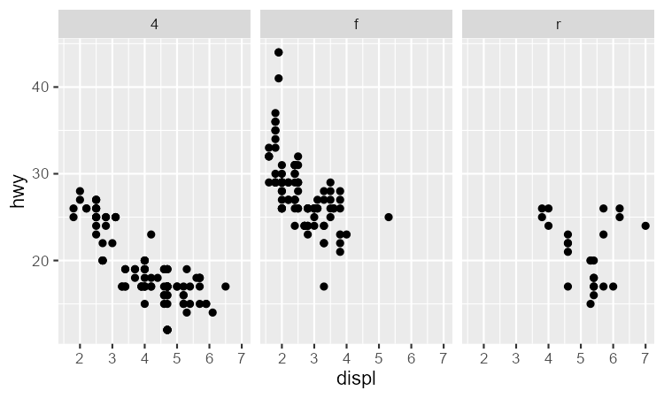

## 5. 统计变换（Statistical transformations）

以使用 `geom_bar()` 或 `geom_col()` 绘制的柱状图为例。下面展示了 `diamonds` 数据集中按切工（`cut`）分组的钻石总数。`diamonds` 数据集包含在 `ggplot2` 包中，记录了约 54,000 颗钻石的信息，包括每颗钻石的价格、克拉数、颜色、净度和切工。该图表表明，高质量切工的钻石数量多于低质量切工的钻石。

```R
library(tidyverse)

ggplot(diamonds, aes(x = cut)) +
  geom_bar()
```

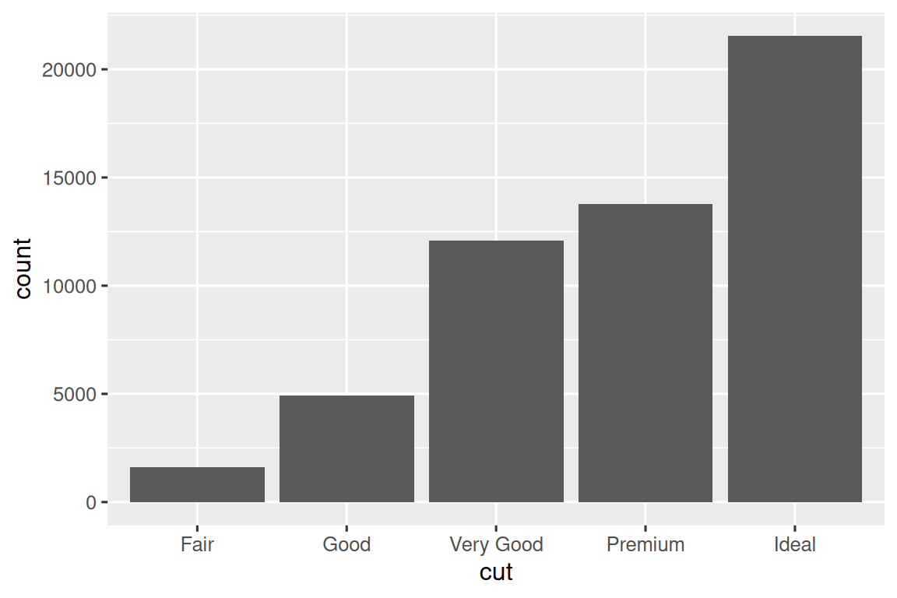

图中 x 轴展示 `diamonds` 数据集中的 `cut`（切工）变量。而 y 轴展示的是 `count`（计数），但 `count` 并不是 `diamonds` 数据集中的变量！那么 `count` 从何而来？

许多图表（如散点图）直接绘制数据集中的原始值。而有些图表（如柱状图）则会计算出新值来进行绘制：

- 柱状图、直方图和频率多边形会将数据进行分箱（bin），然后绘制每个 bin 中包含的数据点数量。
- 平滑曲线（smoothers）会为数据拟合一个模型，然后绘制该模型的预测值。
- 箱线图会计算数据分布的五数概括（five-number summary），然后将其以特定格式的箱体展示出来。

用于为图表计算新值的算法被称为 **stat**，即**统计变换**（statistical transformation）的简称。图 9.2 展示了 `geom_bar()` 的这一处理过程。


> **图 9.2**：在创建 bar-chart 时，我们首先获取原始数据，然后对其进行聚合以计算每个柱子中观测值数量，最后将这些计算出的变量映射到图表的图形属性（aesthetics）上。

可以通过查看 `stat` 参数的默认值，来了解某个 geom 使用了哪种统计变换。例如，查阅 `?geom_bar` 的帮助文档可以发现，`stat` 的默认值是 `"count"`，表示 `geom_bar()` 使用的是 `stat_count()`。`stat_count()` 计算出两个新变量：`count`（计数）和 `prop`（比例）。

每个 geom 都有默认的统计变换（stat），每个 stat 也有默认的 geom。这意味着，通常情况下你可以直接使用 geom，而无需关心底层的 stat 过程。然而，在以下三种情况下，你可能需要显式地调用 stat：

1. 想要覆盖默认的 stat。在下面的代码中，将 `geom_bar()` 的 `stat` 参数从默认的 `count` 改为了 `identity`。这样就可以将柱子的高度直接映射到 y 轴变量的原始值上。

```R
library(tidyverse)

# diamonds 为 ggplot2 内置数据集
diamonds |>  # 管道操作符将左边对象传给右边函数
  count(cut) |> # count() 来自 dplyr，按 cut 变量分组并计算每组的行数
  ggplot(aes(x = cut, y = n)) +
  geom_bar(stat = "identity") # stat = "identity" 表示直接使用 y 值作为条形的高度，不再进行计数
```

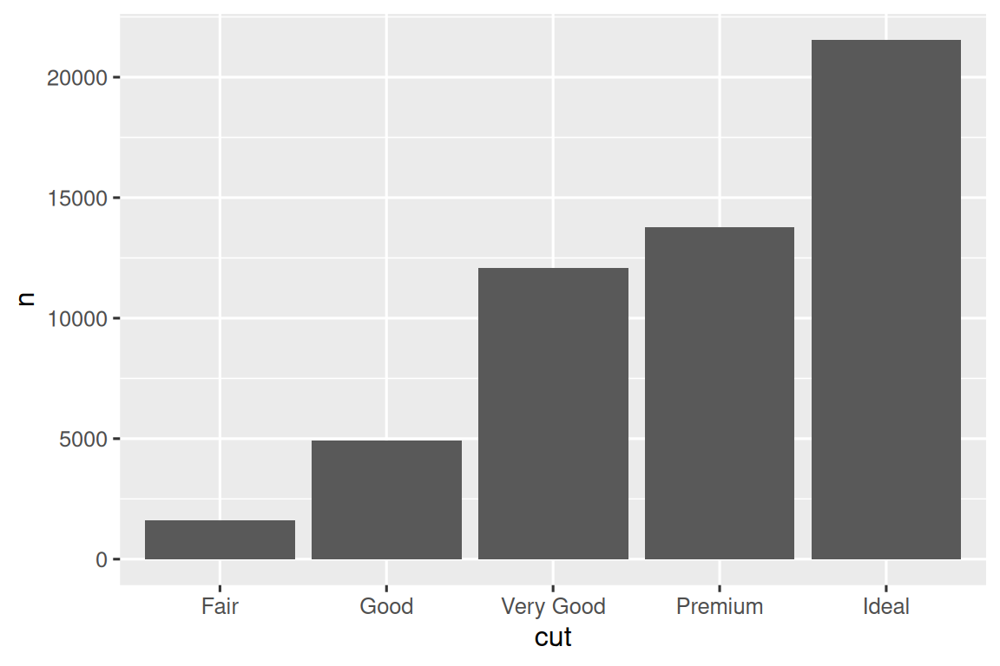

2. 想要覆盖从变换后的变量到图形属性（aesthetics）的默认映射。例如，绘制一个显示比例（proportions）而非计数（counts）的柱状图：

```R
library(tidyverse)

# geom_bar() 默认使用 stat_count() 统计变换，它会为每个 x 类别计算：
# count：该类的观测数
# prop：该类的比例，即 count / sum(count)
# after_stat(prop) 表示在统计变换之后，使用计算出的 prop 作为 y 值。
# 也就是说，条形的高度将表示每个 cut 类别的相对频率，所有条形高度之和为 1。
ggplot(diamonds, aes(x = cut, y = after_stat(prop), group = 1)) +
  geom_bar()
```

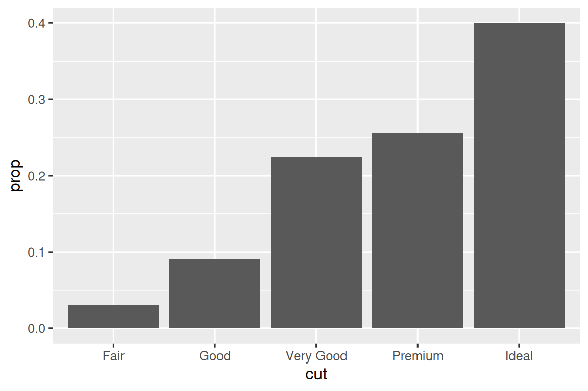

要查找该 stat 计算出的变量，请查阅 `geom_bar()` 帮助文档中名为“Computed variables”（计算变量）的章节。

3. 在代码中更突出地强调统计变换（statistical transformation）。例如，可以使用 `stat_summary()` 函数，它会对每个唯一的 x 值对应的 y 值进行汇总计算；这样能让你的代码更直观地体现出你正在执行的汇总操作：

```R
library(tidyverse)

ggplot(diamonds) +
  stat_summary(
    aes(x = cut, y = depth),
    fun.min = min,
    fun.max = max,
    fun = median
  )
```

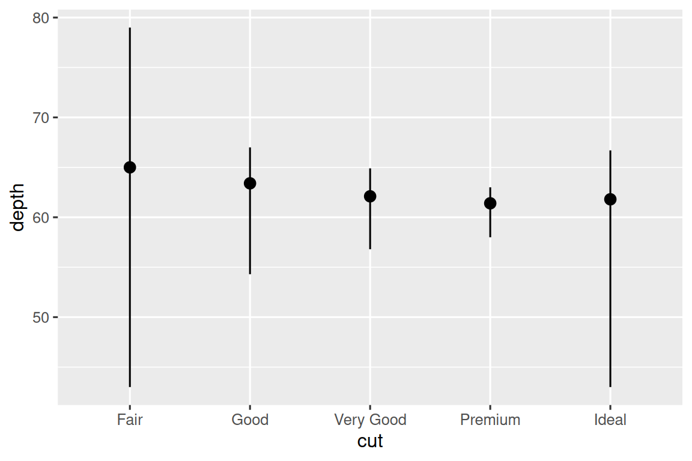

`ggplot2` 提供了 20 多种 stats。每个 stat 都是一个函数，因此你可以通过帮助文档来了解它们，例如使用 `?stat_bin`。

### 5.1 练习题

1. `stat_summary()` 默认的 geom 是什么？如何重写之前的图表，使其使用该 geom 函数而不是 stat 函数？

`stat_summary()` 的默认 geom 为 `geom = "pointrange"`，它为么给 x 类别计算一个汇总统计量（由 `fun` 参数指定，这里计算中位数）。并绘制一条从 `fun.min` 到 `fun.max` 的竖线。

使用 `geom_pointrange()` 重写：

```R
library(tidyverse)

ggplot(diamonds) +
  geom_pointrange(
    aes(x = cut, y = depth),
    stat = "summary",
    fun.min = min,
    fun.max = max,
    fun = median
  )

```

得到相同的 chart.


2. `geom_col()` 的作用是什么？它与 `geom_bar()` 有何不同？

柱状图有两种绘制函数：`geom_bar()` 和 `geom_col()`。

- `geom_bar()` 会使柱子的高度与每个组中的样本数量成正比（如果提供了 `weight` 图形属性映射，则与权重之和成正比）。`geom_bar()` 默认使用 `stat_count()` 统计变换：它会自动计算每个 x 轴位置上的样本数量。
- `geom_col()` 使用 `stat_identity()`：它不对数据进行任何转换，直接保留原始数据。


3. 大多数 geoms 和 stats 都是成对出现，且通常配合使用。请列出所有这些配对。它们有什么共同点？

> [!TIP]
>
> 图层由数据、图形属性映射、geom、stat 以及位置调整组合而成。

| geom 函数                  | 默认 stat                | stat 的默认 geom         | 典型用途              |
| :------------------------- | :----------------------- | :----------------------- | :-------------------- |
| `geom_bar()`               | `stat_count`             | `geom_bar`               | 条形图（计数）        |
| `geom_col()`               | `stat_identity`          | `geom_point`             | 条形图（直接用 y 值） |
| `geom_histogram()`         | `stat_bin`               | `geom_bar`               | 直方图                |
| `geom_freqpoly()`          | `stat_bin`               | `geom_line`              | 频率多边形            |
| `geom_density()`           | `stat_density`           | `geom_area`              | 密度曲线              |
| `geom_boxplot()`           | `stat_boxplot`           | `geom_boxplot`           | 箱线图                |
| `geom_violin()`            | `stat_ydensity`          | `geom_violin`            | 小提琴图              |
| `geom_dotplot()`           | `stat_bindot`            | `geom_dotplot`           | 点阵图                |
| `geom_smooth()`            | `stat_smooth`            | `geom_smooth`            | 平滑趋势线            |
| `geom_contour()`           | `stat_contour`           | `geom_contour`           | 等高线                |
| `geom_contour_filled()`    | `stat_contour_filled`    | `geom_contour_filled`    | 填充等高线            |
| `geom_density_2d()`        | `stat_density_2d`        | `geom_density_2d`        | 二维密度等高线        |
| `geom_density_2d_filled()` | `stat_density_2d_filled` | `geom_density_2d_filled` | 填充二维密度          |
| `geom_bin_2d()`            | `stat_bin_2d`            | `geom_tile`              | 二维分箱热图          |
| `geom_hex()`               | `stat_bin_hex`           | `geom_hex`               | 六边形分箱图          |
| `geom_count()`             | `stat_sum`               | `geom_point`             | 计数散点图            |
| `geom_qq()`                | `stat_qq`                | `geom_point`             | QQ 图                 |
| `geom_qq_line()`           | `stat_qq_line`           | `geom_path`              | QQ 参考线             |
| `geom_quantile()`          | `stat_quantile`          | `geom_quantile`          | 分位数回归线          |
| `geom_sf()`                | `stat_sf`                | `geom_sf`                | 简单特征地图          |
| `geom_function()`          | `stat_function`          | `geom_function`          | 函数曲线              |
| `geom_ecdf()`              | `stat_ecdf`              | `geom_step`              | 经验累积分布          |
| `stat_summary()`           | —                        | `geom_pointrange`        | 汇总统计图            |
| `geom_pointrange()`        | `stat_identity`          | `geom_point`             | 点 + 范围线           |
| `geom_errorbar()`          | `stat_identity`          | `geom_point`             | 误差条                |
| `geom_linerange()`         | `stat_identity`          | `geom_point`             | 范围线                |
| `geom_crossbar()`          | `stat_identity`          | `geom_point`             | 十字线汇总图          |

许多 geoms 默认使用 `stat_identity`，即不对数据做统计变换，直接用原始值绘图：

`geom_point()`、`geom_line()`、`geom_path()`、`geom_segment()`、`geom_rect()`、`geom_polygon()`、`geom_raster()`、`geom_tile()`、`geom_area()`（在旧版中）、`geom_ribbon()`、`geom_step()`、`geom_rug()`、`geom_hline()`、`geom_vline()`、`geom_abline()`、`geom_blank()`、`geom_text()`、`geom_label()`、`geom_jitter()`、`geom_curve()`、`geom_spoke()` 等。

而 `stat_identity` 的默认 geom 是 `geom_point()`。


4. [`stat_smooth()`](https://ggplot2.tidyverse.org/reference/geom_smooth.html) 会计算哪些变量？哪些参数可以控制它的行为？

`stat_smooth()` 计算以下变量：

- `after_stat(y)` 或 `after_stat(x)` 预测值（Predicted value）。
- `after_stat(ymin)` 或 `after_stat(xmin)` 均值周围的逐点置信区间下限（Lower pointwise confidence band around the mean）。
- `after_stat(ymax)` 或 `after_stat(xmax)` 均值周围的逐点置信区间上限（Upper pointwise confidence band around the mean）。
- `after_stat(y)` 或 `after_stat(x)` 标准误（Standard error）。


5. 在绘制比例柱状图时，我们需要设置 `group = 1`。这是为什么？换句话说，下面这两个图表存在什么问题？

```r
ggplot(diamonds, aes(x = cut, y = after_stat(prop))) + 
  geom_bar()

ggplot(diamonds, aes(x = cut, fill = color, y = after_stat(prop))) + 
  geom_bar()
```

在 ggplot2 中绘制比例柱状图时，`group=1` 是为了强制所有数据属于同一个分组，从而让 stat 在全局范围内计算比例，而不是在每个 `x` 类别内部单独计算。

`geom_bar()` 默认使用 `stat_count()`，这个统计变量会计算两个变量：

- `count`：每个 `x` 类别的观测数
- `prop`：每个 `x` 类别的计数在所在 group 中总观测数的比例

ggplot2 会根据 `aes()` 中所有离散类别自动分组。因此以下代码：

```R
ggplot(diamonds, aes(x = cut, y = after_stat(prop))) + 
  geom_bar()
```

`aes()` 里只有 `x=cut`，因此 ggplot2 默认把每个 `cut` 类别当做一个独立 group。于是 `stat_count()` 会计算每个 group 内的 `prop`：

- 对 `Fair` 组：`prop=count(Fair)/count(Fair)=1`
- 对 `Good` 组：`prop=count(Good)/count(Good)=1`

显然都是 1，如下图：

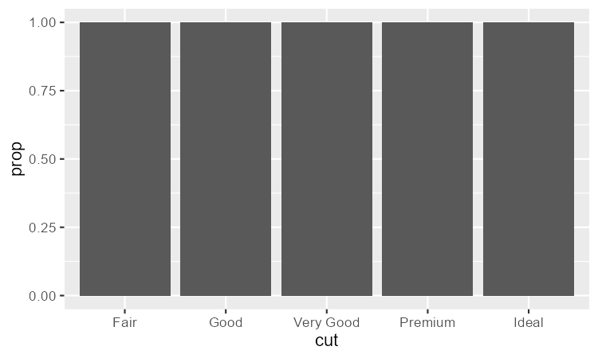

设置 `group=1` 后：

```R
ggplot(diamonds, aes(x = cut, y = after_stat(prop), group = 1)) +
  geom_bar()
```

`stat_count()` 计算 `prop` 时，分母就是全部观测的总数。

下面代码问题类似：

```R
ggplot(diamonds, aes(x = cut, fill = color, y = after_stat(prop))) + 
  geom_bar()
```

`aes()` 映射 `x=cut` 和 `fill=color`，因此 ggplot2 会将数据按 (cut, color) 的所有组合进行分组。每个组内的 `cut` 与 `color` 都相同：

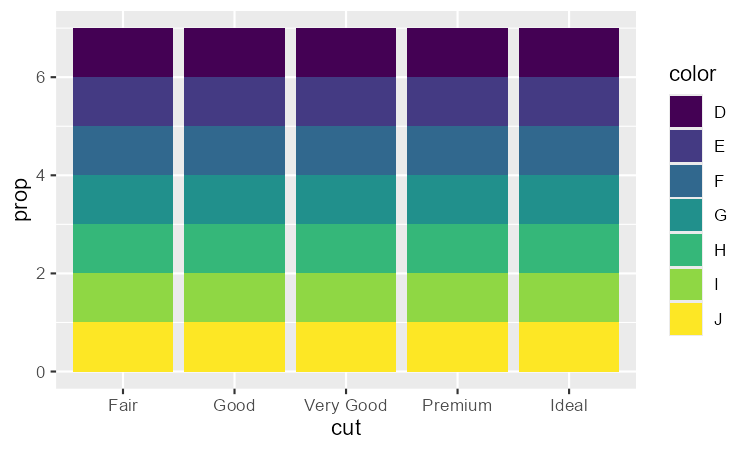

## 6. 位置调整（Position adjustments）

柱状图还有一个非常神奇的特性。你可以通过 `color` 图形属性为柱状图上色，不过使用 `fill` 图形属性更实用：

```R
library(tidyverse)

ggplot(mpg, aes(x = drv, color = drv)) +
  geom_bar()

ggplot(mpg, aes(x = drv, fill = drv)) +
  geom_bar()

```

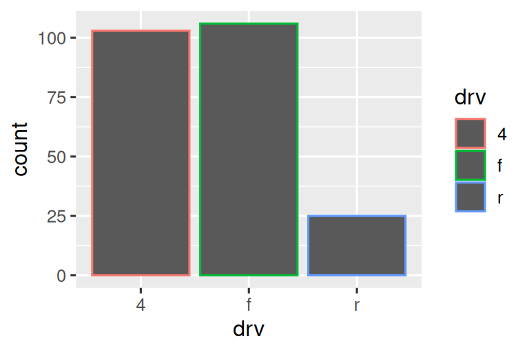

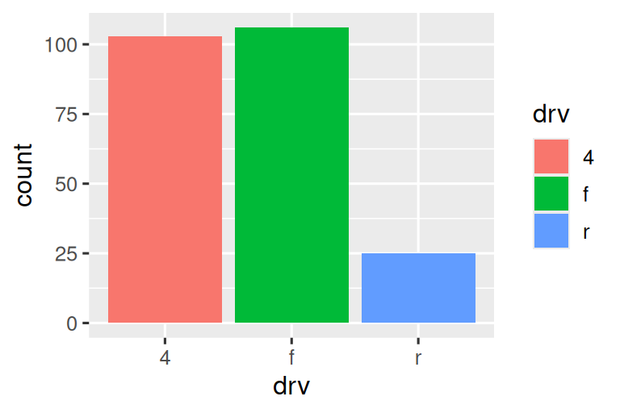

需要注意，如果将 `fill` 图形属性映射到另一个变量（例如 `class`），柱子会自动堆叠。此时，每个带颜色的矩形代表 `drv` 和 `class` 的一种组合。

```r
ggplot(mpg, aes(x = drv, fill = class)) + 
  geom_bar()
```

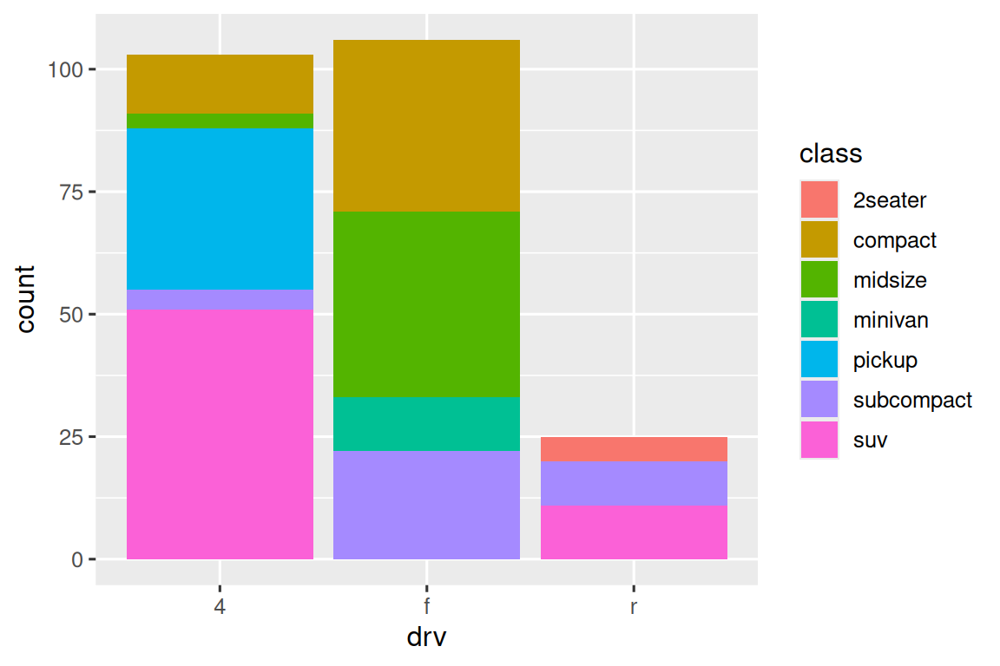

这种堆叠效果是通过 `position` 参数指定的位置调整自动完成的。如果你不需要堆叠柱状图，可以使用以下三种选项进行调整：`"identity"`、`"dodge"` 或 `"fill"`。

- `position = "identity"` 会将每个图形对象精确地放置在图表中它原本所处的位置。这对于柱状图来说通常不太实用，因为柱子会相互重叠。为了看清这种重叠效果，我们要么将柱子设置为半透明（通过将 `alpha` 设置为一个较小的值），要么将其完全透明（通过设置 `fill = NA`）。

```R
# Left
ggplot(mpg, aes(x = drv, fill = class)) + 
  geom_bar(alpha = 1/5, position = "identity")

# Right
ggplot(mpg, aes(x = drv, color = class)) + 
  geom_bar(fill = NA, position = "identity")
```

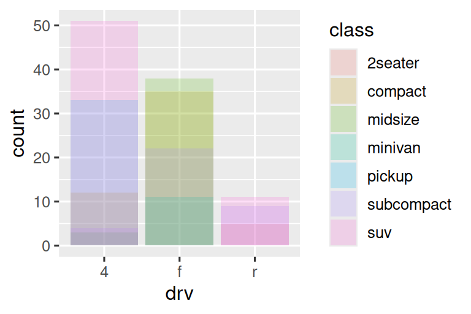

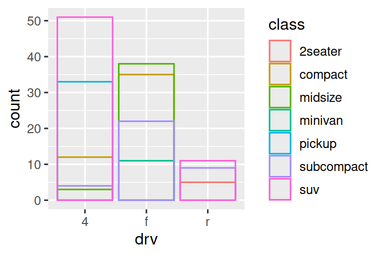

`identity` 位置调整对于二维几何对象（如散点）来说更实用，并且它也是这类对象的默认位置调整方式。

- `position = "fill"` 的工作原理与堆叠（stacking）类似，但它会使每一组堆叠柱的总高度保持一致。这使得跨组比较比例变得更加容易。

- `position = "dodge"` 会将原本重叠的图形对象并排紧挨着放置。这使得比较各个单独的数值变得更加直观和方便。

```R
# Left
ggplot(mpg, aes(x = drv, fill = class)) + 
  geom_bar(position = "fill")

# Right
ggplot(mpg, aes(x = drv, fill = class)) + 
  geom_bar(position = "dodge")
```


还有一种位置调整方式，虽然对柱状图没什么用处，但在散点图中却非常实用。回想一下我们画的第一个散点图，你有没有注意到，尽管数据集中有 234 个观测值，但图表上却只显示了 126 个点？

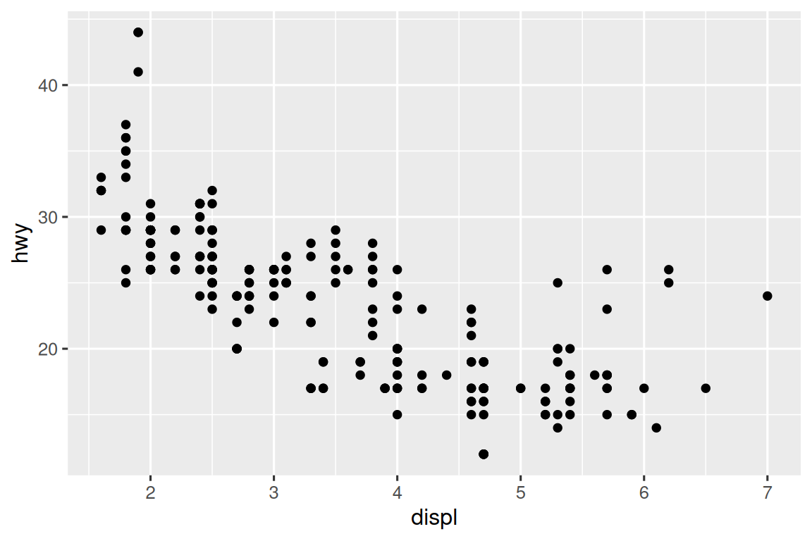

`hwy` 和 `displ` 的底层数值经过了四舍五入处理，导致数据点看起来像是排列在一个网格上，许多点因此发生了重叠。这个问题被称为**过度绘制（overplotting）**。这种排列方式使得我们很难看清数据的真实分布。这些数据点到底是均匀分布在图表上的，还是说存在某一种特定的 `hwy` 和 `displ` 组合，恰好包含了 109 个观测值？

你可以通过将位置调整设置为 `"jitter"`（抖动）来避免这种网格化对齐现象。`position = "jitter"` 会为每个数据点添加少量的随机噪声。因为几乎不可能有两个点接收到完全相同的随机噪声量，所以这会将原本重叠的点分散开来。

```R
ggplot(mpg, aes(x = displ, y = hwy)) + 
  geom_point(position = "jitter")
```

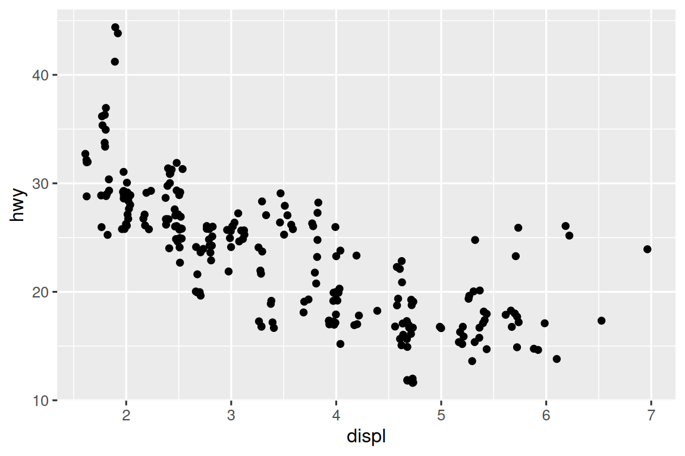

添加随机噪声看似是一种改善图表的奇怪方法，虽然它会让图表在局部细节上变得不那么精确，却能让你在宏观尺度上更清晰地洞察数据的全貌。正因为这个操作非常实用，`ggplot2` 专门为 `geom_point(position = "jitter")` 提供了一个简写函数：`geom_jitter()`。

如果想深入了解某种位置调整方式，可以查阅对应调整函数的帮助文档：`?position_dodge`、`?position_fill`、`?position_identity`、`?position_jitter` 以及 `?position_stack`。

### 6.1 练习

1. 下面的图表有什么问题？你可以如何改进它？

```r
ggplot(mpg, aes(x = cty, y = hwy)) + 
  geom_point()
```


2. 这两幅图之间有什么区别（如果有的话）？为什么？

```r
ggplot(mpg, aes(x = displ, y = hwy)) +
  geom_point()

ggplot(mpg, aes(x = displ, y = hwy)) +
  geom_point(position = "identity")
```


3. `geom_jitter()` 的哪些参数可以控制抖动（jittering）的程度？

4. 比较 `geom_jitter()` 和 `geom_count()` 的异同。
   
5. `geom_boxplot()` 的默认位置调整方式是什么？请创建一个基于 `mpg` 数据集的可视化图表来演示这一效果。

## 7. 坐标系

坐标系可能是 `ggplot2` 中最复杂的部分。默认的坐标系是笛卡尔坐标系，在这种坐标系中，x 和 y 共同决定每个点的位置。此外，还有两种偶尔会派上用场的其他坐标系。

- `coord_quickmap()` 能够为地理地图正确设置纵横比（aspect ratio）。如果你使用 `ggplot2` 绘制空间数据，这一点非常重要。由于篇幅所限，本书无法对地图进行详细讨论，但你可以在（ggplot2: Elegant graphics for data analysis）一书的[地图（Maps）](https://ggplot2-book.org/maps.html) 中了解更多信息。

```r
nz <- map_data("nz")

ggplot(nz, aes(x = long, y = lat, group = group)) +
  geom_polygon(fill = "white", color = "black")

ggplot(nz, aes(x = long, y = lat, group = group)) +
  geom_polygon(fill = "white", color = "black") +
  coord_quickmap()
```

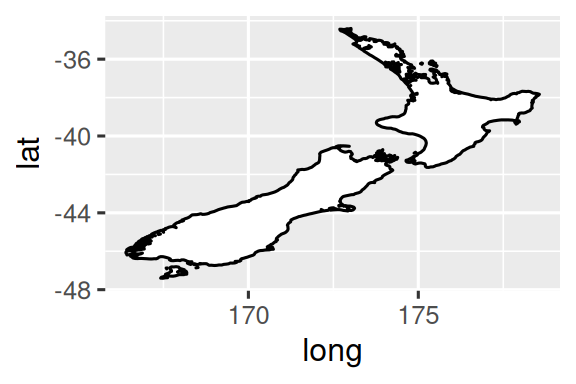

- `coord_polar()` 使用极坐标系。极坐标系揭示了柱状图与南丁格尔玫瑰图（Coxcomb chart，又称极区图）之间一个有趣的内在联系。

```R
bar <- ggplot(data = diamonds) + 
  geom_bar(
    mapping = aes(x = clarity, fill = clarity), 
    show.legend = FALSE,
    width = 1
  ) + 
  theme(aspect.ratio = 1)

bar + coord_flip()
bar + coord_polar()
```

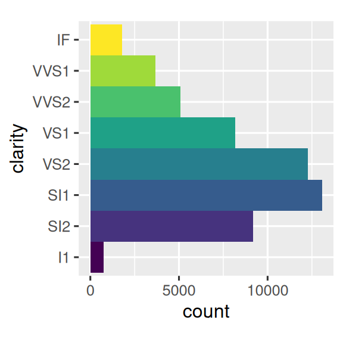

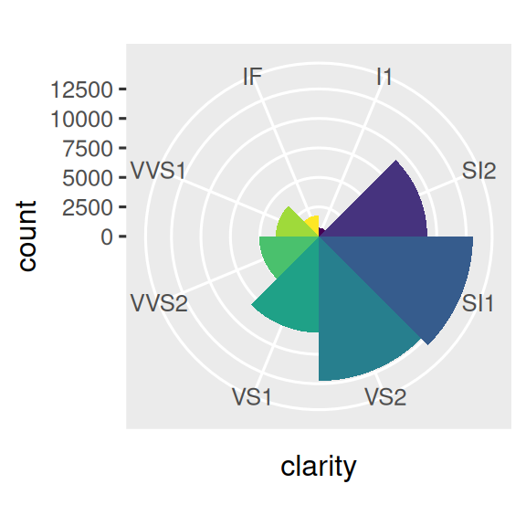

### 7.1 练习

1. 使用 `coord_polar()` 将堆叠柱状图转换为饼图。
2. `coord_quickmap()` 和 `coord_map()` 之间有什么区别？
3. 下面的图表说明了城市油耗（city mpg）与高速公路油耗（highway mpg）之间存在什么关系？为什么 `coord_fixed()` 很重要？`geom_abline()` 的作用是什么？

```R
ggplot(data = mpg, mapping = aes(x = cty, y = hwy)) +
  geom_point() + 
  geom_abline() +
  coord_fixed()
```

## 8. 图形语法

通过在 1.3 节学习的绘图模板基础上，加入位置调整（position adjustments）、统计变换（stats）、坐标系（coordinate systems）和分面（faceting），我们可以将其扩展为如下形式：

```r
ggplot(data = <DATA>) + 
  <GEOM_FUNCTION>(
     mapping = aes(<MAPPINGS>),
     stat = <STAT>, 
     position = <POSITION>
  ) +
  <COORDINATE_FUNCTION> +
  <FACET_FUNCTION>
```

这个新模板包含 7 个参数，即模板中用尖括号标出的部分。在实际应用中，你很少需要同时指定全部 7 个参数，因为除了数据（data）、映射（mappings）和几何对象函数（geom function）之外，`ggplot2` 会为其余所有参数提供合理的默认值。

模板中的这 7 个参数构成了“图形语法（grammar of graphics）”，这是一种用于构建图表的严谨体系。图形语法基于这样一个深刻的洞见：任何一张图表都可以被唯一地描述为以下元素的组合：数据集、几何对象（geom）、一组映射、统计变换、位置调整、坐标系、分面方案以及主题（theme）。

为了理解它是如何运作的，我们可以设想如何从零开始构建一张基础图表：

1. 首先，从一个数据集出发，将其转换为你想要展示的信息（通过统计变换 stat）。
2. 接着，选择一种几何对象（geom）来表示转换后数据中的每个观测值。
3. 然后，利用几何对象的图形属性（aesthetic properties）来表示数据中的变量，即将每个变量的值映射到图形属性的不同层级上。

这些步骤如图 9.3 所示。随后，你需要选择一个坐标系来放置这些几何对象，并利用对象的位置（位置本身也是一种图形属性）来展示 x 和 y 变量的值。


> 图 9.3：从原始数据到频数表，再到柱状图（柱子的高度代表频数）的构建步骤。

到这一步，你已经得到了一张完整的图表，但你还可以进一步调整几何对象在坐标系中的位置（即位置调整），或者将图表拆分为多个子图（即分面）。你还可以通过添加一个或多个额外的图层来扩展图表，其中每一个额外的图层都拥有自己的数据集、几何对象、映射、统计变换和位置调整。

你可以使用这种方法来构建你想象中的任何图表。换句话说，你可以使用本章学到的代码模板来绘制成千上万种独特的图表。

如果你想深入了解 `ggplot2` 的理论基础，推荐阅读《分层图形语法》（[The Layered Grammar of Graphics](https://vita.had.co.nz/papers/layered-grammar.pdf)），这是一篇详细阐述 `ggplot2` 理论的科学论文。

## 9. 小结

在本章中，我们学习了分层图形语法，从图形属性（aesthetics）和几何对象（geometries）入手来构建一个简单的图表，接着学习了分面（facets）用于将图表拆分为子集，统计变换（statistics）用于理解几何对象的计算方式，位置调整（position adjustments）用于在几何对象可能重叠时控制其位置的细节，以及坐标系（coordinate systems）用于从根本上改变 x 和 y 的含义。我们还剩下一个图层——主题（theme）尚未涉及，我们将在 11.5 节中介绍它。

要全面了解 `ggplot2` 的所有功能，有两个非常实用的资源：`ggplot2` 速查表（cheatsheet，可在 https://posit.co/resources/cheatsheets 找到）和 `ggplot2` 软件包官网（[https://ggplot2.tidyverse.org）。](https://ggplot2.tidyverse.org)./)

本章一个重要的启示是，当你觉得需要一个 `ggplot2` 未提供的几何对象时，最好先查一下是否已经有人通过创建一个提供该几何对象的 `ggplot2` 扩展包来解决你的问题了。
