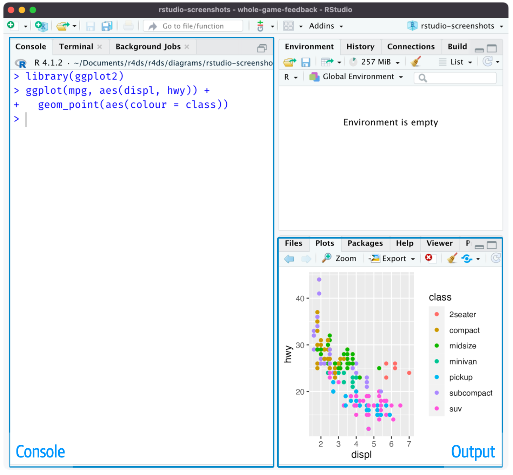

# 引言

2026-09-21: 润色简化
@since 2026-03-12⭐
@author Jiawei Mao

***
## 简介

数据科学是一门将原始数据转化为认知与知识的学科。

《R for Data Science》这本书旨在教你掌握 R 语言中最核心的工具，从而高效、可复现地开展数据科学工作。

## 你将学到什么

数据科学领域广阔，一本书无法全部覆盖。本书介绍最重要工具，并传授足够的知识，使你在需要时能够自学进阶。典型的数据科学项目流程如图 1 所示。


> **图 1** 典型数据分析流程：先**导入**并**清洗**数据，再通过**转换、可视化与建模**循环迭代来探索、理解数据，最后将分析结果**分享**给他人。

首先要把数据**导入 R**，通常是从文件、数据库或 API 加载到 R 里的 data-frame。导入数据是分析的前体。

导入后建议先清洗数据，即让数据格式统一：**每列代表一个变量，每行代表一个样本**。这种统一的结构能让你专注于**数据问题**上，而不是反复调整数据格式。

整洁数据通常需要**转换**，包括：

- 筛选关注的变量
- 基于已有变量创建新变量
- 计算汇总统计量

**清洗与转换合称数据整理（wrangling）**，因为把数据变成便于分析的格式并不轻松。

有了整洁数据后 ，分析主要依靠**可视化**与**建模**，二者互补，通常需要反复迭代。

- **可视化**让人更容易理解，能带来意外发现，甚至提示新问题或数据收集方向。但它扩展性优先，需要人工解读。
- **模型**是可视化的互补工具。明确问题后，可以用模型寻找答案。模型是数学工具，扩展性好。但所有模型都基于特定假设，**模型无法质疑自身假设**，因此难以带来意外发现。

数据科学的最后一步是**交流**，这是数据分析的关键环节。无论模型和可视化多好，若无法将结果清晰地传达给他人，那一切都白费。

贯穿始终的基础是**编程**。不必成为编程专家，但编程能力越强，越能自动化日常任务，也能更轻松地解决新问题。

在接下来的数据科学项目中，你会用到这些工具，但仅靠它们往往是不够的。这里有一个大致的‘二八定律’：这些工具能覆盖项目中约 80% 的工作，剩下 20% 需要其他工具。本书会随时指引更多学习资源。

## 本书的组织结构

本书大致按照实际分析中使用的顺序介绍这些工具。但先学数据导入与整理并不合适：这类工作 80% 内容常规枯燥，20% 棘手，不适合入门。因此，我们从已导入、整理好的数据开始，先学数据可视化与转换。这样后续再学导入整理数据时，动力更足，因为你知道这些付出是值得的。

每章尽量遵循统一的结构：先用启发性示例展示整体框架，再深入细节。每部分都配有练习题。尽管跳过练习题很诱人，但解决实际问题才是最有效的学习方式。

## 本书不包含的内容

本书**专注核心内容**，帮助你尽快入门并动手实践，因此无法涵盖所有主题。

**建模**

建模很重要，但这是一个庞大的主题，本书无法全面讲解。推荐 Max Kuhn 与 Julia Silge 的《[Tidy Modeling with R](https://www.tmwr.org/)》，书中介绍 **tidymodels**，与 **tidyverse** 设计规范一致。

**大数据**

本书**主要聚焦小型内存数据集**。没有小数据处理经验，就无法应对大数据。书中工具可轻松处理数百 MB的数据；稍加注意，通常也能处理 GB 级数据。我们还会介绍如何从数据库和 Parquet 文件获取数据，这两者常被用于存储大数据。你不一定需要处理整个数据集，子集或抽样通常足以解答你关心的问题。

如果你经常处理大型数据数据（比如 10–100 GB），建议深入学习 [data.table](https://github.com/Rdatatable/data.table)。本书不讲解它，因为它与 tidyverse 接口不同，规则也不同；但它速度极快，如果需要处理大数据，值得投入时间学习。

**Python, Julia 及其它语言**

本书不教 Python、Julia 或其他数据科学编程语言。它们**非常优秀**，大多数数据科学团队经常会混合使用多种语言。但我们认为，最好先精通一种工具，而 R 是极佳的起点。

## 学习前提

本书假设你具备基本的数理常识，有编程基础更佳。若从未编程，推荐 Garrett 的[Hands On Programming with R](https://rstudio-education.github.io/hopr/) 作为补充读物。

运行本书代码需要准备：R、RStudio、tidyverse 包集合及少量辅助包。包（Package）是可复现的 R 代码单元，包含可复用的函数、说明文档和示例数据。

### R

从 CRAN 下载 R：https://cloud.r-project.org。R 每年发布一个主版本和 2-3 个次版本，建议定期更新。主版本升级需要重装所有 R 包，稍显麻烦，但拖延升级可能带来更大麻烦。本书推荐 R 4.2.0+。

### RStudio

RStudio 是 R 的集成开发环境（IDE），可以 https://posit.co/download/rstudio-desktop/ 下载。RStudio 每年更新数次，有新版本会自动提醒。建议定期升级以使用其最新功能。阅读本书需 RStudio  2022.02.0+。

启动 RStudio 后（图 2）有两个关键区域：**控制台**和**输出**。目前只需知道：在控制台输入 R 代码，按回车运行。后续会逐步学习更多内容！



> 图 2：RStudio IDE：在左侧**控制台**中输入代码，右侧**输出面板**中查看图表。

### tidyverse

你还需要安装一些 R 包。**R 包**是函数、数据和文档的集合，用于扩展基础 R 的功能。使用包是成功运用 R 的关键。本书大部分包属于 **tidyverse** 包集合，它们遵循共同的数据理念与编程思想，可协同工作。

用一行代码安装:

```R
install.packages("tidyverse")
```

在控制台输入并按回车运行，R 会从 CRAN下载并将安装。

使用 `library()` 加载包后，才能使用其中的函数、对象与帮助文件：

```R
> library(tidyverse)
── Attaching core tidyverse packages ────────────────────────────────────────────── tidyverse 2.0.0 ──
✔ dplyr     1.2.0     ✔ readr     2.2.0
✔ forcats   1.0.1     ✔ stringr   1.6.0
✔ ggplot2   4.0.2     ✔ tibble    3.3.1
✔ lubridate 1.9.5     ✔ tidyr     1.3.2
✔ purrr     1.2.1     
── Conflicts ──────────────────────────────────────────────────────────────── tidyverse_conflicts() ──
✖ dplyr::filter() masks stats::filter()
✖ dplyr::lag()    masks stats::lag()
ℹ Use the conflicted package to force all conflicts to become errors
```

输出显示 `tidyverse` 会加载九个包：`dplyr`、`forcats`、`ggplot2`、`lubridate`、`purrr`、`readr`、`stringr`、`tibble`、`tidyr`。几乎在每次分析中都会用到它们。

tidyverse 更新频率，可用 `tidyverse_update()` 查看更新。

### 其它包

还有许多优秀的包不属于 tidyverse，因为它们解决的是不同领域的问题，或是基于不同设计理念开发的。它们只是定位不同，并非更好或更差。本书会使用许多非 **tidyverse**包，例如下面这些包提供有趣的数据集：

```R
install.packages(
  c("arrow", "babynames", "curl", "duckdb", "gapminder", 
    "ggrepel", "ggridges", "ggthemes", "hexbin", "janitor", "Lahman", 
    "leaflet", "maps", "nycflights13", "openxlsx", "palmerpenguins", 
    "repurrrsive", "tidymodels", "writexl")
  )
```

还有一些包用来做一次性示例。若看到类似报错时：

```R
library(ggrepel)
#> Error in library(ggrepel) : there is no package called ‘ggrepel’
```

运行 `install.packages("ggrepel")` 安装这个包即可。

## 运行 R 代码

本书的代码格式如下：

```R
1 + 2
#> [1] 3
```

在本地控制台运行同样代码，显示为：

```R
> 1 + 2
[1] 3
```

主要有两点区别：控制台中有提示符 `>`，书中不显示；书中用 `#>` 注释结果，控制台直接显示结果。因此本书电子版的代码可以直接复制并粘贴到控制台运行。

本书约定：

- 函数用等宽字体加圆括号，如 `sum()` 或 `mean()`。
- 其他 R 对象用等宽字体不带圆括号，例如 `flights` 或 `x`。
- 有时为了明确某个对象所属包，会在包名后加上**两个冒号**，如 `dplyr::mutate()` 和 `nycflights13::flights`。这种也是合法 R 代码。

## 参考

- https://r4ds.hadley.nz/intro.html
