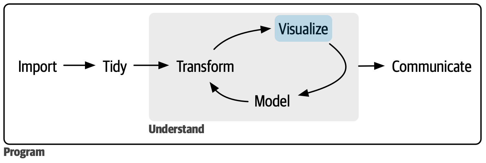

# 可视化

@since 2026-09-16⭐
@author Jiawei Mao
***
读完本书的第一部分后，你已经对数据科学中最重要的一些工具有了初步的了解。现在开始深入探究细节。本书的这一部分将更深入地介绍数据可视化。

> 图 1：数据可视化通常是数据探索的第一步。

每一章都会介绍数据可视化创建中的一个或几个方面。

- 第 9 章“图层”，介绍图形语法中的分层概念。

- 在第 10 章“探索性数据分析”中，将结合可视化、好奇心与批判性思维，对数据提出并回答有趣的问题。

- 最后，在第 11 章“沟通”中，你将学习如何对探索性图形进行优化提升，将其转化为解释性图形，帮助初次接触你分析成果的人能够尽可能快速、轻松地理解其中的内容。

这三章将带你进入可视化世界的大门，但其中还有更多值得学习的内容。扩展资源：

- [《ggplot2: Elegant graphics for data analysis》](https://ggplot2-book.org/)：这本书更深入地探讨了其背后的理论，并提供了大量关于如何组合各个组件以解决实际问题的示例。
- ggplot2 扩展包画廊（https://exts.ggplot2.tidyverse.org/gallery/）。该网站列出了许多通过新增几何对象（geoms）和标度（scales）来扩展 ggplot2 功能的软件包。如果你正尝试用 ggplot2 实现某些看似困难的功能，这里将是一个绝佳的起点。