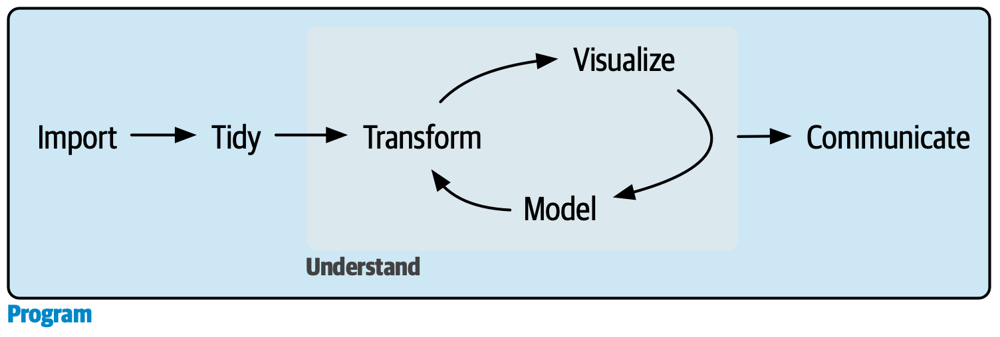

# 编程

2026-08-27⭐
@author Jiawei Mao
***

在本书的这一部分，你将提升自己的编程技能。编程是数据科学所有工作中不可或缺的一项核心技能：你必须借助计算机来进行数据科学工作，这绝不是仅靠大脑思考或纸笔就能完成的。

> **图 1：编程是承载其他所有组件的水域。**

编程的产出是代码，而代码本身就是一种沟通工具。代码能告诉计算机你想要它做什么，但它同样也向其他人类传递着信息。将代码视为沟通的载体非常重要，因为你做的每一个项目本质上都是协作性的。即使你现在没有和别人共事，你也绝对是在与“未来的自己”协作！编写清晰的代码至关重要，这样其他人（比如未来的你）才能理解你当初为什么选择这种方式来进行数据分析。这意味着，提升编程能力的同时，也是在提升你的沟通能力。随着时间的推移，你不仅要让代码写起来更顺手，还要让它更容易被别人阅读。

在接下来的三章中，你将学习以下技能来进一步提升编程能力：

1. 复制粘贴是一个强大的工具，但你应该尽量避免将同一段代码复制粘贴超过两次。在代码中重复自己是很危险的，因为它极易导致错误和不一致。在 **第 25 章 函数** 中，你将学习如何编写函数，从而提取出重复的 tidyverse 代码，使其能够被轻松复用。
2. 函数可以提取出重复的代码，但在实际应用中，你经常需要对不同的输入执行相同的操作。因此，你需要“迭代”工具，让你能够重复执行类似的任务。这些工具包括 `for` 循环和函数式编程，你将在 **第 26 章 迭代** 中详细学习它们。
3. 随着你阅读越来越多其他人编写的代码，你会发现很多代码并没有使用 tidyverse。在 **第 27 章 R 语言基础实战指南** 中，你将学习一些在实际应用中最常遇到的 R 语言基础（base R）函数。

这几章的目标是教授你进行数据科学研究所必需的最基础的编程知识。一旦你掌握了这里的内容，我们强烈建议你继续投资并精进你的编程技能。[Hands-On Programming with R](https://r4ds.hadley.nz/program.html) 是一本将 R 编程入门书，如果 R 是你的第一门编程语言，这将是一个极佳的起点；而 Hadley Wickham 编写的[Advanced R](https://adv-r.hadley.nz/) 则深入探讨了 R 语言的底层细节，如果你已有一定的编程经验，或者在完全消化了这几章的内容后想要更进一步，这将是你绝佳的下一站。

