# 快速入门

- [快速入门](#快速入门)
  - [简介](#简介)
    - [语法模板](#语法模板)
    - [ggplot](#ggplot)
    - [aes](#aes)
  - [演示数据](#演示数据)
  - [映射](#映射)
  - [映射 vs. 设置](#映射-vs-设置)
  - [几何对象](#几何对象)
  - [全局变量和局部变量](#全局变量和局部变量)
  - [导出图片](#导出图片)

2020-05-29, 21:44
*** *

## 简介

ggplot2 是 RStudio 首席科学家 Hadley Wickham 在 2005 年读博期间的作品。

ggplot2 的 "gg" 表示 grammar of graphics.

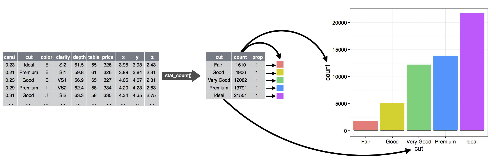

`ggplot()` 包括 9 个部分：

| 编号 | 组件       | 说明    |
| ---- | ---------- | ------- |
| 1    | 数据       | 数据框  |
| 2    | 映射       | mapping |
| 3    | 几何对象   | geom    |
| 4    | 统计变化   | stats   |
| 5    | 标度       | scale   |
| 6    | 坐标系     | coord   |
| 7    | 分面       | facet   |
| 8    | 主题       | theme   |
| 9    | 存储和输出 | output  |

前三个是必须的。

一张统计图是从数据到几何对象（点、线）的美学属性（颜色、形状、大小）的映射。

此外，图形中还可能包含数据的统计变换（statistical transformation, stats），最后绘制在特定的坐标系中，而分面（facet）可用来生成数据不同子集的图形。

### 语法模板

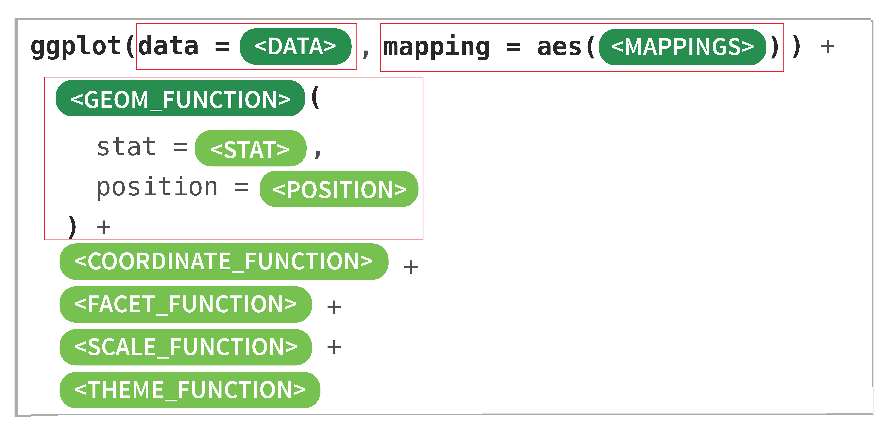

ggplot 作图的一般步骤：

- 准备数据，一般为数据框
- 将数据输入到 ggplot() 函数中，并指定参与作图的每个变量分别映射到哪些图形特性
- 选择一个合适的图形类型
- 设定适当的坐标系统
- 设定标题和图例位置等

### ggplot

`ggplot()` 函数用于创建 ggplot 对象。

```r
ggplot(data = NULL, mapping = aes(), ...)
```

参数：

1. data

用于绘图的默认数据集。如果不是 `data.frame` 类型，则默认使用 `fortify()` 转换为该类型。如果不指定数据集，则在后续添加图层时，需要逐一指定数据。

2. mapping

用于绘图的默认美学映射。如果不指定，则在后续添加图层时需要指定。

`ggplot()`用于构造初始的绘图对象，后面总会跟着 `+` 添加组件。

下面是调用 `ggplot()` 的常见三种方式：

- `ggplot(df, aes(x, y, other aesthetics))`

如果所有图层使用相同的数据和美学特征，则推荐使用该方法。

- `ggplot(df)`

指定了默认数据，但是没有指定映射关系。适合于不同图层采用不同美学映射的绘图。

- `ggplot()`

只是初始化了一个框架，适合于使用多种数据构建复杂图形。

### aes

美学映射描述如何将数据映射到几何图形的视觉属性（如颜色、形状、大小等）。在 `ggplot()` 和图层中都可以指定美学映射。

```r
aes(x, y, ...)
```

参数：

`x, y, ...`，参数为键值对的格式，`aesthetic = variable`，将变量映射到后续 geom/stat 所需的美学特征。变量 `variable` 在图层数据中计算，因此无需引用原始数据。所以使用 `ggplot(df, aes(variable))`，而不用 `ggplot(df, aes(df$variable))`。对 x,y 的美学特征一般可以省略，其它的必须命名。


## 演示数据

下面以 ggplot2 内置的 mpg 数据演示，mpg 数据是美国环境保护署收集的1999年到2008年流行车型的燃油经济性的信息。

```r
> library(ggplot2)
> str(mpg)
tibble [234 x 11] (S3: tbl_df/tbl/data.frame)
 $ manufacturer: chr [1:234] "audi" "audi" "audi" "audi" ...
 $ model       : chr [1:234] "a4" "a4" "a4" "a4" ...
 $ displ       : num [1:234] 1.8 1.8 2 2 2.8 2.8 3.1 1.8 1.8 2 ...
 $ year        : int [1:234] 1999 1999 2008 2008 1999 1999 2008 1999 1999 2008 ...
 $ cyl         : int [1:234] 4 4 4 4 6 6 6 4 4 4 ...
 $ trans       : chr [1:234] "auto(l5)" "manual(m5)" "manual(m6)" "auto(av)" ...
 $ drv         : chr [1:234] "f" "f" "f" "f" ...
 $ cty         : int [1:234] 18 21 20 21 16 18 18 18 16 20 ...
 $ hwy         : int [1:234] 29 29 31 30 26 26 27 26 25 28 ...
 $ fl          : chr [1:234] "p" "p" "p" "p" ...
 $ class       : chr [1:234] "compact" "compact" "compact" "compact" ...
```

mpg 数据包含 234 行 11 列。如下所示：

| 序号 | 变量         | 含义                                        |
| ---- | ------------ | ------------------------------------------- |
| 1    | manufacturer | 生产厂家                                    |
| 2    | model        | 类型                                        |
| 3    | displ        | 发动机排量（升）                              |
| 4    | year         | 生产年份                                    |
| 5    | cyl          | 气缸数量                                    |
| 6    | trans        | 传输类型                                    |
| 7    | drv          | 驱动类型(f =前轮驱动，r =后轮驱动，4 = 4wd) |
| 8    | cty          | 每加仑城市里程                              |
| 9    | hwy          | 每加仑高速公路英里                          |
| 10   | fl           | 汽油种类                                    |
| 11   | class        | 类型                                        |

## 映射

下面就一个问题就行分析：是否汽车的排量越大，油耗越大？

就该问题，需要 mpg 数据集的三个变量：

- displ, 发动机排量
- hwy, 每加仑英里数，即油耗
- class，汽车类型

```r
> mpg[c('displ', 'hwy', 'class')]
# A tibble: 234 x 3
   displ   hwy class  
   <dbl> <int> <chr>  
 1   1.8    29 compact
 2   1.8    29 compact
 3   2      31 compact
 4   2      30 compact
 5   2.8    26 compact
 6   2.8    26 compact
 7   3.1    27 compact
 8   1.8    26 compact
 9   1.8    25 compact
10   2      28 compact
# ... with 224 more rows
```

为考察发动机排量（displ）与油耗（hwy）的关系，先绘制这两个变量的散点图：

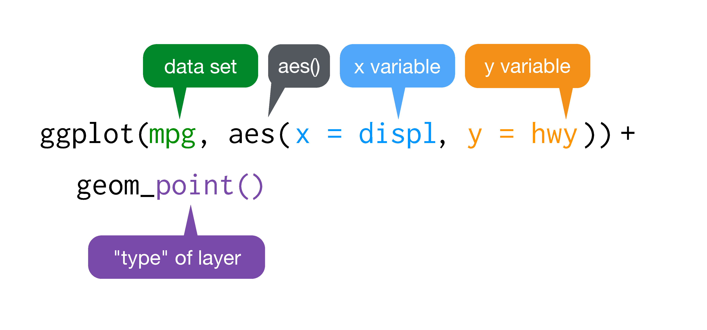

说明：

- `ggplot()` 是用于画图的函数
- `data=mpg` 指定用于画图的数据
- `aes()` 表示数据和图形属性之间的映射

`aes(x=displ, y=hwy)` 意思是变量 `displ` 映射为 x 轴坐标，变量 `hwy` 映射为 y 轴坐标。

另外，`aes()` 除了映射坐标，还可以将数值映射为颜色、形状、透明度等等图形属性。

- `geom_point()` 表示绘制散点图
- `+` 表示添加图层

```r
ggplot(mpg, aes(x=displ, y=hwy)) + geom_point()
```

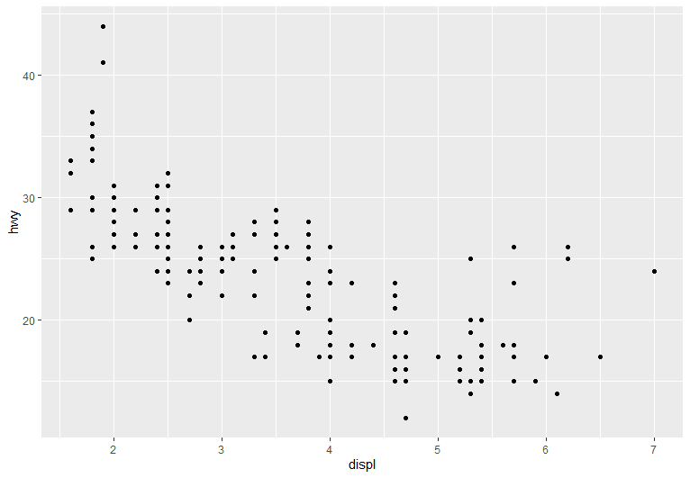

- 颜色映射

下面，我们在 `aes()` 中再将 mpg 的 `class` 映射为颜色，`color=class`。这样不同汽车类型，用不同颜色的数据点表示：

```r
ggplot(mpg, aes(x=displ, y=hwy, color=class)) +
  geom_point()
```


- class 映射为数据点大小

还可以将 `class` 映射为数据点大小：

```r
ggplot(mpg, aes(x=displ, y=hwy, size=class)) +
  geom_point()
```

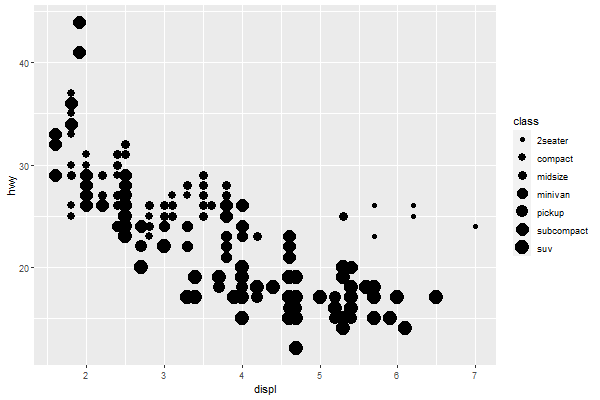

- 将 `class` 映射为形状

```r
ggplot(mpg, aes(x=displ, y=hwy, shape=class)) +
  geom_point()
```

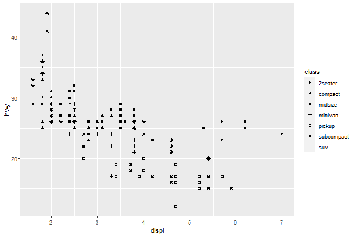

- 将 `class` 映射为透明度

```r
ggplot(mpg, aes(x=displ, y=hwy, alpha=class)) +
  geom_point()
```

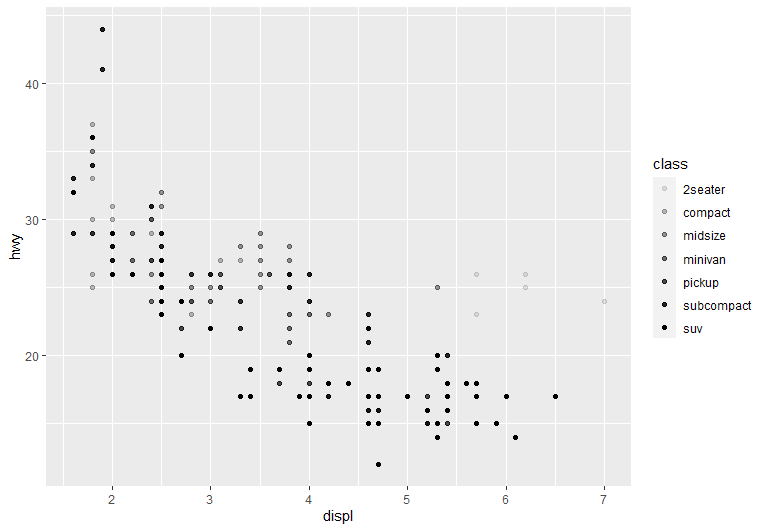

## 映射 vs. 设置

想把图中的数据点设置为某个颜色，例如将图形的数据点设置为蓝色：

```r
ggplot(mpg, aes(x=displ, y=hwy)) +
  geom_point(color="blue")
```

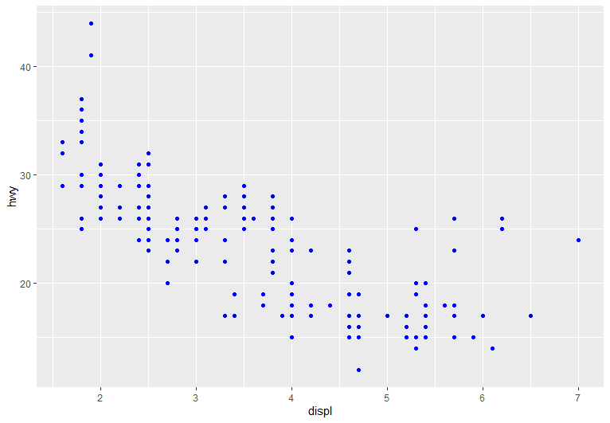

那么下面两种语法有何异同：

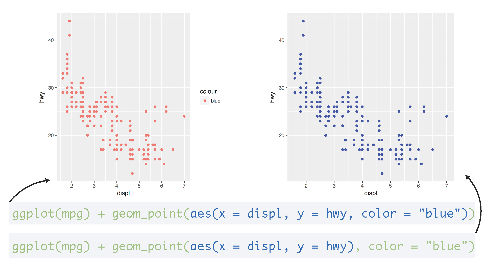

说明：

- 左侧的图形在 `aes()` 中指定，即将 `color` 映射为 "blue"
- 右侧的图形 `color="blue"` 指定在 `geom_point` 中，实现设置颜色

由于 "blue" 只有一个值，所以对左侧图形，所有数据点映射为默认的第一个颜色，红色。

## 几何对象

`geom_point()` 画散点图，`geom_smooth()` 可以绘制平滑曲线。例如：

```r
p2 <- ggplot(data=mpg, aes(x=displ, y=hwy)) +
  geom_smooth()
p2
```

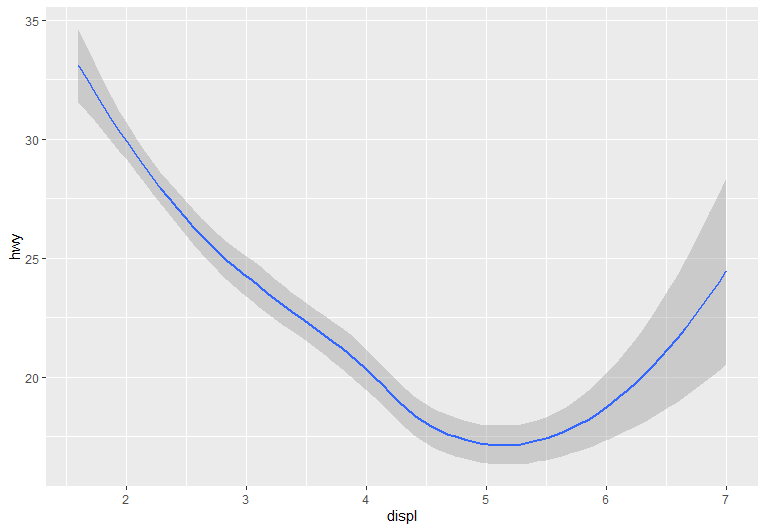

- 散点图加平滑曲线

```r
p3 <- ggplot(data=mpg, aes(x=displ, y=hwy)) +
  geom_point() +
  geom_smooth()
p3
```

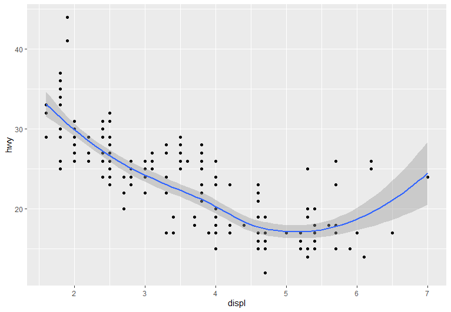

## 全局变量和局部变量

例：

```r
ggplot(mpg, aes(x=displ, y=hwy, color=class)) +
    geom_point()
```

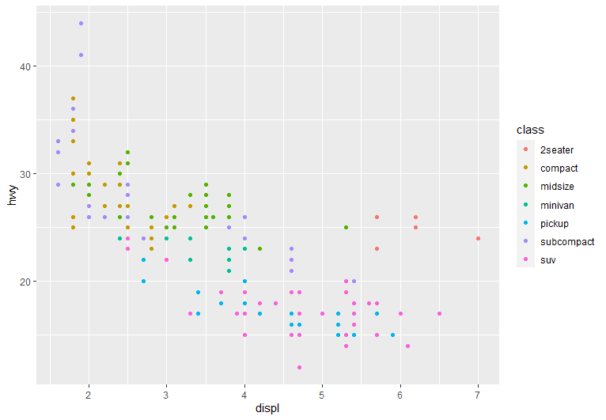

或者

```r
ggplot(mpg) +
    geom_point(aes(x=displ, y=hwy, color=class))
```


这两段代码的效果完全一样，不过代码的含义却不同。

如果映射关系 `aes()` 放在 `ggplot()` 里，此时 `x=displ`, `y=hwy`, `color=class` 为全局变量。

如果将映射关系放在 `geom_point()` 例，就是局部变量。

如果 `geom_point()` 缺少绘图所需的映射关系，会**继承全局变量**的映射关系。例如：

```r
ggplot(mpg, aes(x=displ, y =hwy))+
    geom_point(aes(color=class))+
    geom_smooth()
```

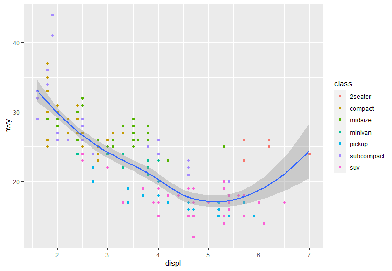

这里，`geom_point` 和 `geom_smooth` 没有定义映射关系，都是从全局变量继承。

如果局部变量已经定义了映射关系，就不再从全局变量继承。

```r
ggplot(mpg, aes(x = displ, y = hwy, color = class)) +
  geom_smooth(method = lm) +
  geom_point()
```

后面两个图层都完全继承全局变量，所以对每种颜色分类进行了平滑

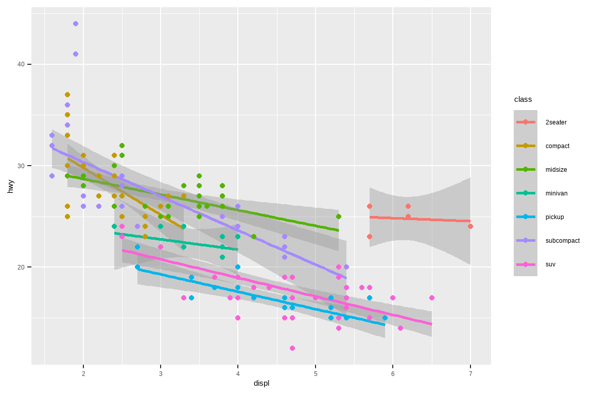

而下面 `color=class` 只放在散点图，所以平滑曲线对整体进行平滑：

```r
ggplot(mpg, aes(x = displ, y = hwy)) +
  geom_smooth(method = lm) +
  geom_point(aes(color = class))
```


## 导出图片

使用 `ggsave()` 将图片保存为所需格式：

```r
p <- ggplot(mpg, aes(x = displ, y = hwy)) +
  geom_smooth(method = lm) +
  geom_point(aes(color = class)) +
  ggtitle("This is my first plot")


ggsave(filename = "myfirst_plot.pdf", plot = p, width = 8, height = 6, dpi = 300)
```
