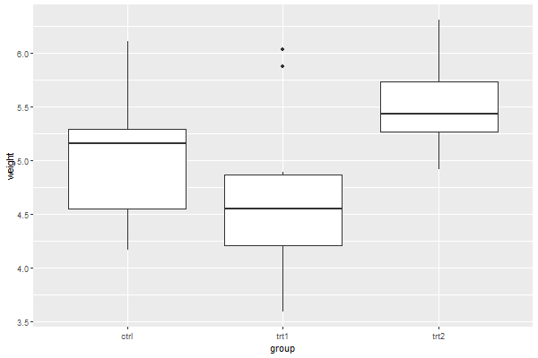
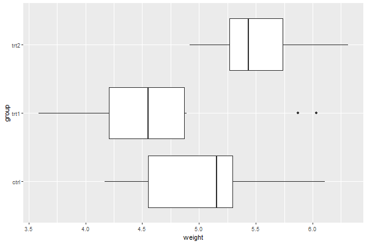

# Axes

- [Axes](#axes)
  - [简介](#简介)
  - [交换 x,y 轴](#交换-xy-轴)
  - [网格线](#网格线)
    - [隐藏所有网格线](#隐藏所有网格线)
    - [隐藏 minor 网格线](#隐藏-minor-网格线)

2020-08-28, 13:52
@jiaweiM
***
## 简介

下面使用内置数据集 `PlantGrowth` 演示坐标轴相关的设置。

```r
library(ggplot2)

bp <- ggplot(PlantGrowth, aes(x = group, y = weight)) +
  geom_boxplot()
print(bp)
```



## 交换 x,y 轴

使用 `coord_flip()` 交换 x, y 轴位置：

```r
library(ggplot2)

bp <- ggplot(PlantGrowth, aes(x = group, y = weight)) +
  geom_boxplot() +
  coord_flip()
print(bp)
```



## 网格线

### 隐藏所有网格线

```r
library(ggplot2)

bp <- ggplot(PlantGrowth, aes(x = group, y = weight)) +
  geom_boxplot() +
  theme(panel.grid.minor = element_blank(),
        panel.grid.major = element_blank())
print(bp)
```


### 隐藏 minor 网格线

```r
library(ggplot2)

bp <- ggplot(PlantGrowth, aes(x = group, y = weight)) +
  geom_boxplot() +
  theme(panel.grid.minor = element_blank())
print(bp)
```


