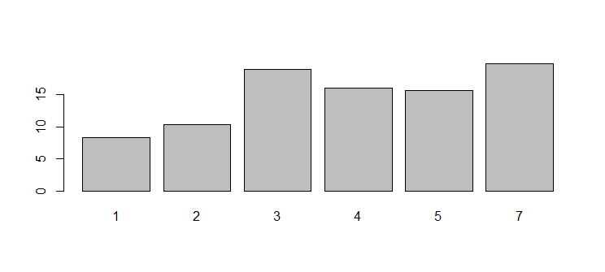
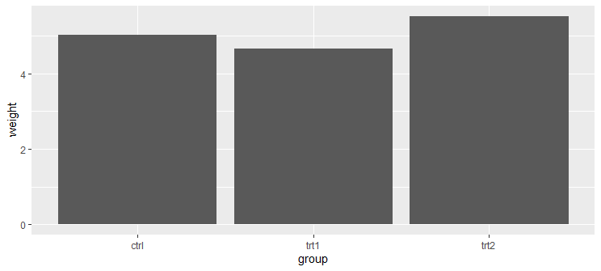
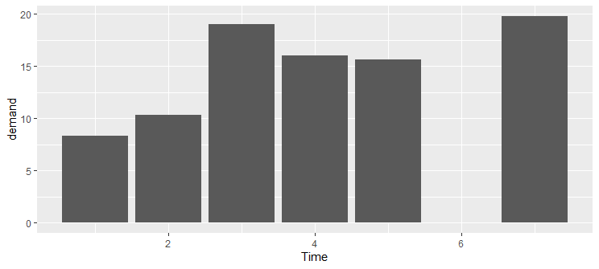
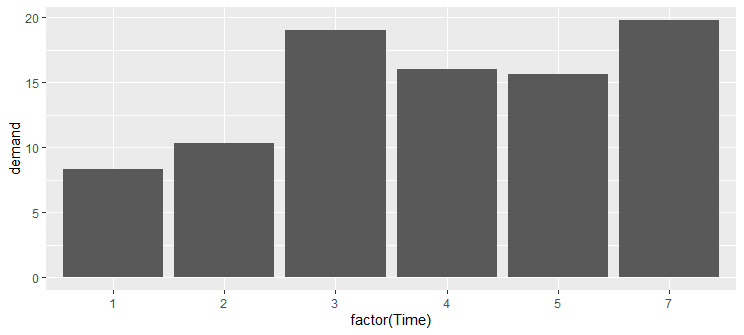
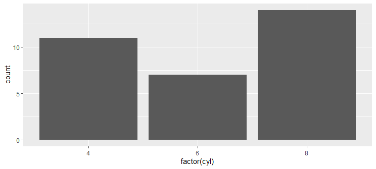
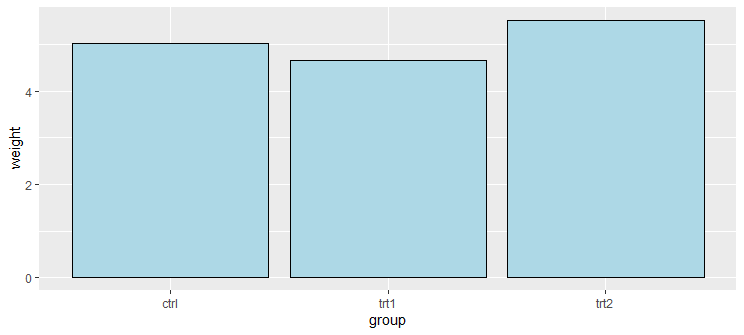
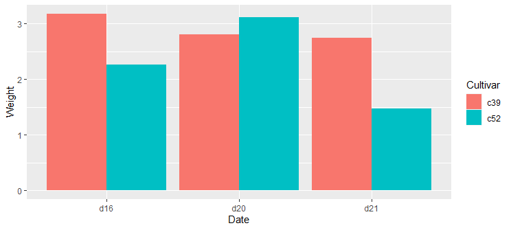
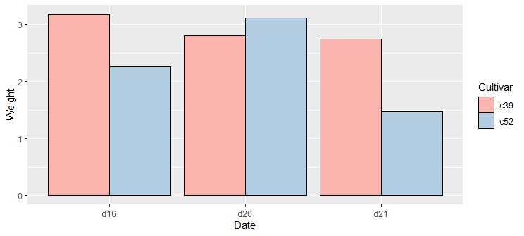
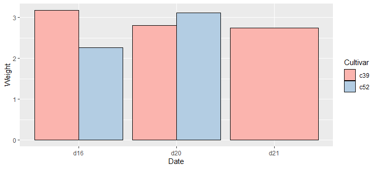
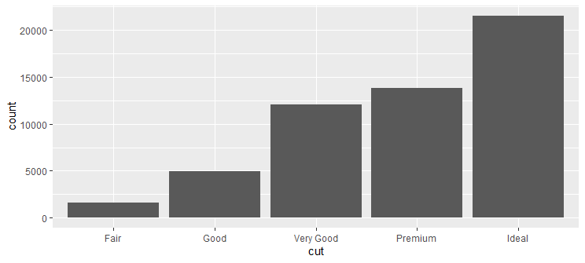

# Bar Graph

- [Bar Graph](#bar-graph)
  - [简介](#简介)
  - [R barplot](#r-barplot)
  - [ggplot](#ggplot)
  - [Grouping Bars](#grouping-bars)
  - [Count Bar](#count-bar)
  - [Color](#color)

2020-06-16, 21:48
***

## 简介

Bar Graph 是简单的二维图，x 表示每个 bar 的位置，y 表示 bar 的高度。

## R barplot

使用 `barplot()` 绘制条形图。首先来看一下 BOD 数据：

```r
> BOD
  Time demand
1    1    8.3
2    2   10.3
3    3   19.0
4    4   16.0
5    5   15.6
6    7   19.8
```

使用向量给 `barplot()` 提供数据，如果是命名向量，则向量名称自动作为条形图的标签。

```r
barplot(BOD$demand, names.arg = BOD$Time)
```



条形图和直方图很像，不过其 x 坐标是离散的，一般用作分类变量。

使用 `table()` 函数可以获得向量 unique 值的个数：

```r
> table(mtcars$cyl)

 4  6  8
11  7 14
```

绘制条形图：

```r
# Generate a table of counts
barplot(table(mtcars$cyl))
```

## ggplot

ggplot2 有两种条形图：`geom_bar()` 和 `geom_col()`:

- `geom_bar` 中 bar 的高度和分组中 count 数成正比，如果提供了 `weight`，则和 weights 的加和成正比。
- 如果希望 bar 的高度表示数据，使用 `geom_col()`。

`geom_bar()` 默认使用 `stat_count()`，即计算各个值出现的次数。

`geom_col()` 使用 `stat_identity()`，即不做任何改变。

ggplot2 使用 `geom_col()` 绘制条形图。下面先看一个简单的数据：

```r
> pg_mean
  group weight
1  ctrl  5.032
2  trt1  4.661
3  trt2  5.526
```

```r
p <- ggplot(pg_mean, aes(x = group, y = weight)) +
  geom_col()
print(p)
```



如果 x 是连续型变量，`geom_col()` 不是在每个 x 处添加 bar，而是在最大值和最小值范围内每个可能的 x 处都添加 bar。例如：

```r
p <- ggplot(BOD, aes(x = Time, y = demand)) +
  geom_col()
print(p)
```



此处，x 是作为连续数据处理，虽然在 X=6 处没有值，还是添加了高度为 0 的矩形.

可以通过将其转换为 factor，转换成离散型变量：

```r
# Convert the x variable to a factor, so that it is treated as discrete
ggplot(BOD, aes(x = factor(Time), y = demand)) +
  geom_col()
```

这样就没有 `x=6` 出的矩形。



ggplot2 还可以用来不同分类的分布，此时用 `geom_bar()`。此时也需要注意离散变量和连续变量的差异。

```r
# Bar graph of counts. This uses the mtcars data frame, with the 'cyl' column for
# x position. The y position is calculated by counting the number of rows for
# each value of cyl.
ggplot(mtcars, aes(x = cyl)) +
  geom_bar()
```


转换为离散变量：

```r
p <- ggplot(mtcars, aes(x = factor(cyl))) +
  geom_bar()
```



bar 的颜色默认为黑灰色。可以使用 `fill` 指定颜色。并且默认没有边框，可以使用 `colour` 添加边框，如下所示，填充浅蓝色、黑边框：

```r
p <- ggplot(pg_mean, aes(x = group, y = weight)) +
  geom_col(fill = "lightblue", color = "black")
print(p)
```



## Grouping Bars

将一个分类变量映射到 `fill`，并设置 `geom_col(position='dodge')`，可以创建分组 bar。

下面使用 `cabbage_exp` 数据集：

```r
> cabbage_exp
  Cultivar Date Weight        sd  n         se
1      c39  d16   3.18 0.9566144 10 0.30250803
2      c39  d20   2.80 0.2788867 10 0.08819171
3      c39  d21   2.74 0.9834181 10 0.31098410
4      c52  d16   2.26 0.4452215 10 0.14079141
5      c52  d20   3.11 0.7908505 10 0.25008887
6      c52  d21   1.47 0.2110819 10 0.06674995
```

```r
p <- ggplot(cabbage_exp, aes(x = Date, y = Weight, fill = Cultivar)) +
  geom_col(position = "dodge")
print(p)
```

对相同 x 位置的多个 bars，有多种处理方式：

|函数|参数|说明|
|---|----|---|
|`position_stack()`|'stack'|默认值，即堆叠在一起|
|`position_dodge()`|'dodge'|水平排列|
|`position_dodge2()`|'dodge2'|用于箱线图的特殊 dodge|
|`position_fill()`|'fill'|堆叠后归一化高度，使得每个总高度相同|



在 `geom_col()` 中设置 `colour = 'black'` 可以添加黑色边框。

使用 `scale_fill_brewer()` 或 `scale_fill_manual()` 可以设置颜色。

例如：

```r
p <- ggplot(cabbage_exp, aes(x = Date, y = Weight, fill = Cultivar)) +
  geom_col(position = "dodge", colour = "black") +
  scale_fill_brewer(palette = "Pastel1")
print(p)
```



对分组 columns，如果某个组合缺失一个，另一个 bar 会扩宽以填充余下空间。

例如，我们移除 `cabbage_exp` 的最后一行，然后绘图：

```r
ce <- cabbage_exp[1:5, ]
p <- ggplot(ce, aes(x = Date, y = Weight, fill = Cultivar)) +
  geom_col(position = "dodge", colour = "black") +
  scale_fill_brewer(palette = "Pastel1")
```



对这种情况，可以手动确实的值，对 y 设置为 `NA` 即可。

## Count Bar

假如你只有一列数据，你想统计其中各个值出现的次数，绘制条形图，此时可以用 `geom_bar()`。例如，对数据集 diamonds:

```r
> diamonds
# A tibble: 53,940 x 10
   carat cut       color clarity depth table price     x     y     z
   <dbl> <ord>     <ord> <ord>   <dbl> <dbl> <int> <dbl> <dbl> <dbl>
 1 0.23  Ideal     E     SI2      61.5    55   326  3.95  3.98  2.43
 2 0.21  Premium   E     SI1      59.8    61   326  3.89  3.84  2.31
 3 0.23  Good      E     VS1      56.9    65   327  4.05  4.07  2.31
 4 0.290 Premium   I     VS2      62.4    58   334  4.2   4.23  2.63
 5 0.31  Good      J     SI2      63.3    58   335  4.34  4.35  2.75
 6 0.24  Very Good J     VVS2     62.8    57   336  3.94  3.96  2.48
 7 0.24  Very Good I     VVS1     62.3    57   336  3.95  3.98  2.47
 8 0.26  Very Good H     SI1      61.9    55   337  4.07  4.11  2.53
 9 0.22  Fair      E     VS2      65.1    61   337  3.87  3.78  2.49
10 0.23  Very Good H     VS1      59.4    61   338  4     4.05  2.39
# ... with 53,930 more rows
```

该数据集有 53,940 行，每一行是一个 diamond 的信息。

统计 `cut` 各个值出现的次数，绘图：

```r
p <- ggplot(diamonds, aes(x = cut)) +
  geom_bar()
```

`stat` 参数有两个选项：

- `bin`，将数据分为不同范围，计算每个范围内的个数
- `count`，计算每个 x 值的个数。



## Color

将变量映射到 `fill` 属性。

