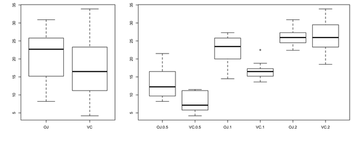
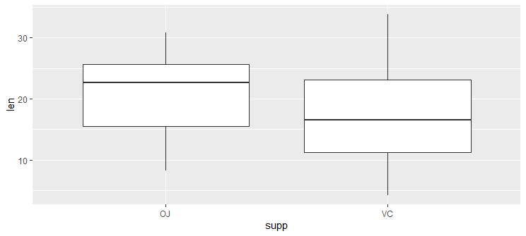
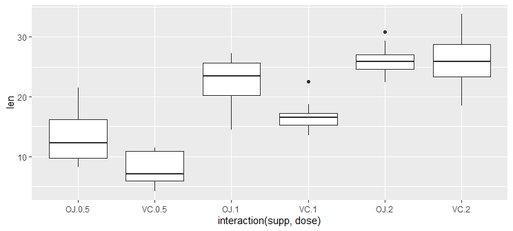

# Box Plot

- [Box Plot](#box-plot)
  - [R plot](#r-plot)
  - [ggplot](#ggplot)

2020-06-16, 22:38
***

## R plot

使用 `plot()` 函数， x 类型必须为 factor，y 为向量，则自动绘制箱线图：

```r
plot(ToothGrowth$supp, ToothGrowth$len)
```



如果数据在同一个数据框，则可以使用 `boxplot()` 配合公式语法一起使用。使用该语法，可以将多个变量和一起：

```r
# Formula syntax
boxplot(len ~ supp, data = ToothGrowth)

# Put interaction of two variables on x-axis
boxplot(len ~ supp + dose, data = ToothGrowth)
```

效果同上图。

## ggplot

`geom_boxplot()` 绘制箱线图：

```r
library(ggplot2)
ggplot(ToothGrowth, aes(x = supp, y = len)) +
  geom_boxplot()
```



使用 `interaction()` 可以组合多个变量，例如：

```r
p <- ggplot(
  ToothGrowth,
  aes(x = interaction(supp, dose), y = len)
) +
  geom_boxplot()
print(p)
```



此时 x 轴是 `supp` 和 `dose` 所有可能组合。