# Line Chart

- [Line Chart](#line-chart)
  - [plot](#plot)
  - [ggplot](#ggplot)
  - [图形分组](#图形分组)
  - [折线散点](#折线散点)
  - [面积图](#面积图)
  - [离散变量](#离散变量)
  - [facet](#facet)

2020-06-16, 21:27
***

## plot

使用 `plot()` 绘制线图，需要设置 `type = 'l'`:

```r
plot(pressure$temperature, pressure$pressure, type = 'l')
```

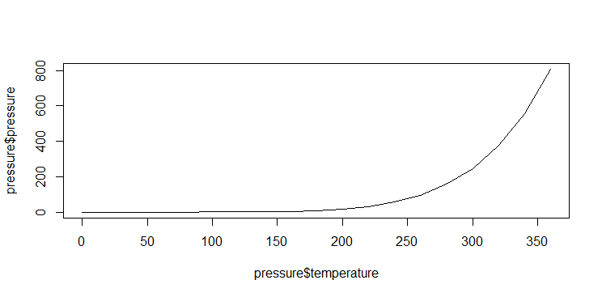

如果要同时添加散点图和线图，可以先用 `plot()` 添加线图，然后用 `points()` 和 `lines()` 添加额外的图：

```r
plot(pressure$temperature, pressure$pressure, type = "l")
points(pressure$temperature, pressure$pressure)

lines(pressure$temperature, pressure$pressure / 2, col = "red")
points(pressure$temperature, pressure$pressure / 2, col = "red")
```

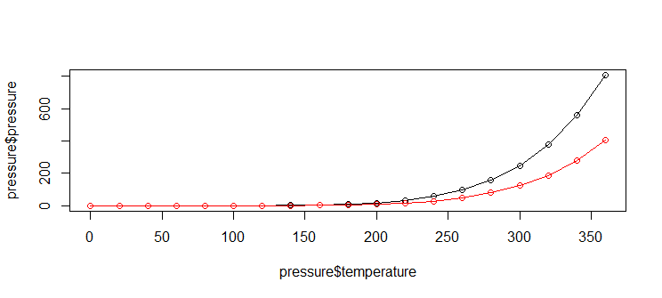

## ggplot

使用 ggplot2 的 `geom_line()` 可以获得线图：

```r
ggplot(pressure, aes(x = temperatur, y = pressure)) +
  geom_line()
```

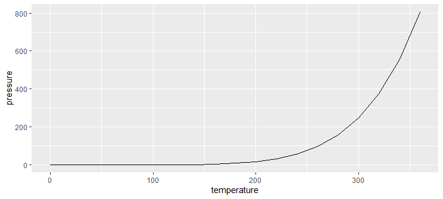

散点图+线图：

```r
ggplot(pressure, aes(x = temperature, y = pressure)) +
  geom_line() +
  geom_point()
```

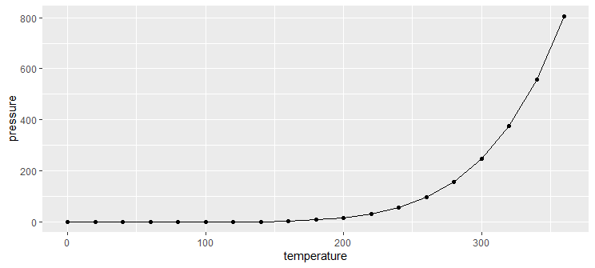

## 图形分组

考虑 gapminder 数据集中每个国家的期望寿命随时间的变化。

用 `geom_line()` 画折线图，因为有很多国家，所以仅指定 x,y 变量无法得到所需图形。例如：

```r
library(tidyverse)
library(gapminder)

p <- ggplot(
  data = gapminder,
  mapping = aes(
    x = year,
    y = lifeExp
  )
)
gplot <- p + geom_line()

print(gplot)
```

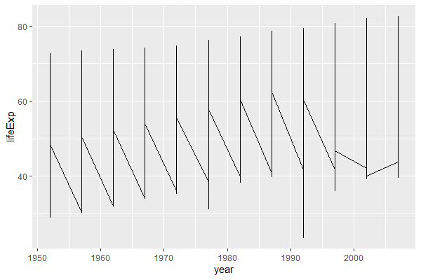

没有得到我们想要的每个国家一条曲线的效果，这是因为程序中没有指定需要按照国家进行分组，使得同一年的不同国家的坐标练成了 一条竖线。

要注意的是，`geom_line()` 会自动将 x 坐标从小到大排序，然后再连接相邻的点。如果希望按输入数据的次序连接相邻的点，需要用 `geom_path()` 函数。

为了解决上图的问题你，加入按照国家分组的设定。实际上，分组（group）与x, y, color, fill 一样可以映射到一个变量，但仅能映射到**分类变量**。

改进上述程序：

```r
p <- ggplot(
  data = gapminder,
  mapping = aes(
    x = year,
    y = lifeExp,
    group = country
  )
)
gplot <- p + geom_line()
print(gplot)
```

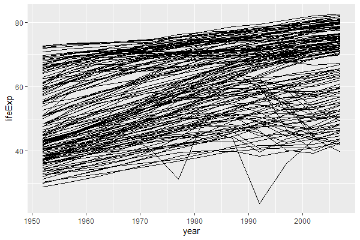

上图中，每一条曲线对应一个国家。为了查探其中最下方不稳定曲线是哪一个国家，使用筛选观测的功能：

```r
> gapminder %>% filter(lifeExp < 30, year>=1990)
# A tibble: 1 x 6
  country continent  year lifeExp     pop gdpPercap
  <fct>   <fct>     <int>   <dbl>   <int>     <dbl>
1 Rwanda  Africa     1992    23.6 7290203      737.
```

该国家为 Rwanda （卢旺达）。

如果需要按照两个或多个分类变量交叉分组，可以给 group 指定 `interaction(...)`，其中 `...` 为分类变量列表。

`geom_line()` 用来绘制从左向右连接的折线。比如，仅绘制 Rwanda 的期望寿命时间序列：

```r
p <- ggplot(
  data = filter(gapminder, country == "Rwanda"),
  mapping = aes(
    x = year,
    y = lifeExp,
    group = country
  )
)
gplot <- p + geom_line()

print(gplot)
```

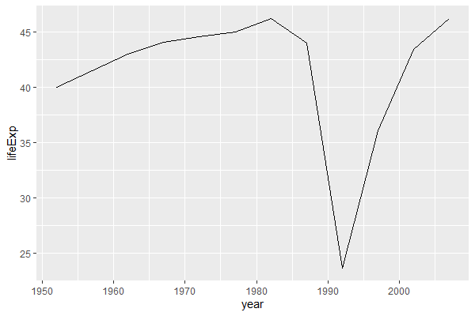

## 折线散点

如果需要再加上散点符号，可以同时使用 `geom_point()`，例如：

```r
library(tidyverse)
library(gapminder)

p <- ggplot(
  data = filter(gapminder, country == "Rwanda"),
  mapping = aes(
    x = year,
    y = lifeExp,
    group = country
  )
)
gplot <- p + geom_line() + geom_point()

print(gplot)
```

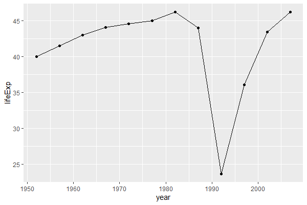

## 面积图

`geom_area()` 可以作类似折线图，但在折线下方填充颜色：

```r
library(tidyverse)
library(gapminder)

p <- ggplot(
  data = filter(gapminder, country == "Rwanda"),
  mapping = aes(
    x = year,
    y = lifeExp
  )
)
gp <- p + geom_area(fill = "darkseagreen1", alpha = 0.5)

print(gp)
```

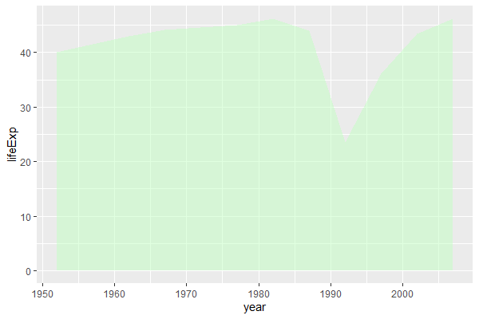

这种图形的纵坐标应该从 0 开始，使得阴影部分的大小与纵坐标值成比例，这是 ggplot2 的默认做法。

## 离散变量

连线图有一个问题，如果 x 坐标不是数值型变量，而是因子或字符型，则两点之间不会相连。比如，将 gapminder 的 Rwanda 子集的 year 转换为因子，再画图:

```r
library(tidyverse)
library(gapminder)

d <- gapminder %>%
  filter(country == "Rwanda") %>%
  mutate(year = factor(year, levels = seq(1952, 2007, by = 5)))

p <- ggplot(data = d, mapping = aes(
  x = year,
  y = lifeExp
))
gp <- p + geom_line()
print(gp)
```

`geom_path: Each group consists of only one observation. Do you need to adjust the group
aesthetic?`

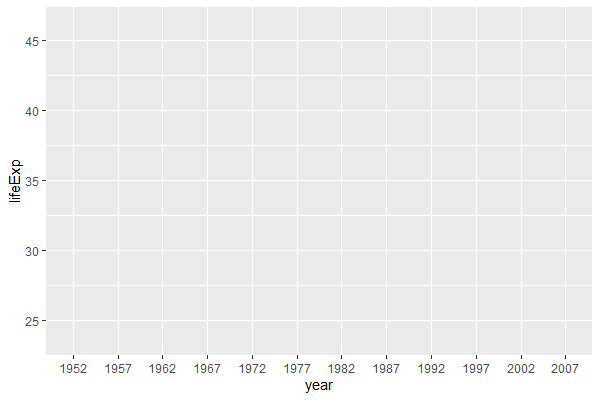

因为 y 是离散变量，这里起到了分组的作用，相当于每个年份为一组，连线只能在组内连，但每组仅有一个观测。这时，显示地指定 group 变量可以解决该问题：

```r
d <- gapminder %>%
  filter(country == "Rwanda") %>%
  mutate(year = factor(year, levels = seq(1952, 2007, by = 5)))

p <- ggplot(data = d, mapping = aes(
  x = year,
  y = lifeExp,
  group = country
))
gp <- p + geom_line()
print(gp)
```

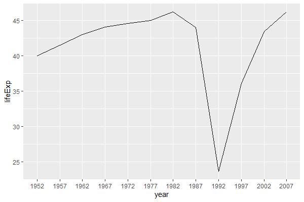

对折线图，可以在 `geom_line()` 中用 color 指定颜色，`linetype` 指定线型，`size` 指定以毫米为单位的粗细。线型包括：

- 0, 不划线
- 1，实线
- 2，dashed,
- 3, dotted,
- 4, dotdash
- 5, longdash
- 6, twodash

## facet

前面所有国家的图包含了过多的曲线， 使得图形表现得很拥挤。可以将一个作图区域拆分成若干个小块， 称为**小图**（facet），按照某一个或两个分类变量的不同值将数据分为若干个子集， 每个数据子集分别在小图上作图。

对于上面的例子，可以将每个大洲的图形分别放置在一个小图上。小图不是一种变量映射，而是一种图形摆放方法，所以不在`aes()` 函数内设置，而是用`facet_wrap()` 函数。该功能与 `group` 映射的功能有些重复，所以有时需要与group映射配合使用，有时则不需要。 程序如：

```r
library(gapminder)
library(tidyverse)

p <- ggplot(
  data = gapminder,
  mapping = aes(
    x = year,
    y = lifeExp,
    group = country
  )
)

gp <- p + geom_line() + facet_wrap(~continent)
print(gp)
```

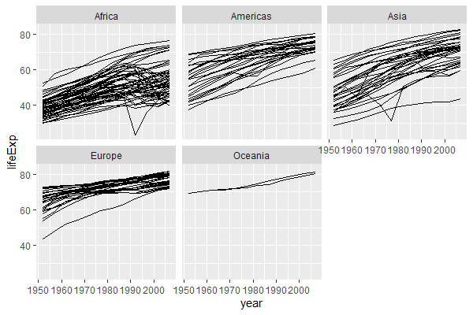

区分不同小图的标签写在每个小图的上方。可以用 `facet_wrap()` 参数`strip_position` 和 `switch` 调整标签的上下左右。

