# 散点图

- [散点图](#散点图)
  - [R 作图](#r-作图)
  - [ggplot](#ggplot)
  - [拟合线](#拟合线)
  - [基本散点图](#基本散点图)
  - [添加拟合线](#添加拟合线)
  - [scale](#scale)
  - [颜色、符号、线型映射](#颜色符号线型映射)
  - [添加标题](#添加标题)
  - [在 geom 中映射变量](#在-geom-中映射变量)
  - [映射形状](#映射形状)
  - [连续变量的颜色映射](#连续变量的颜色映射)

2020-06-16, 21:10
***

## R 作图

使用 `plot()` 绘制散点图，例如：

```r
plot(mtcars$wt, mtcars$mpg)
```

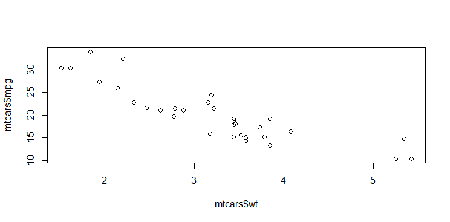

## ggplot

```r
library(ggplot2)

ggplot(mtcars, aes(x = wt, y = mpg)) +
  geom_point()
```

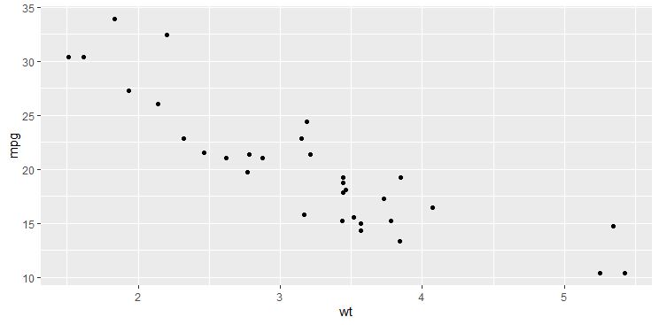

`ggplot()` 创建一个 plot 对象，`geom_point()` 在 plot 上添加散点图层。

`ggplot()` 经典的用法是，将 frame (`mtcars`) 传递给 `ggplot()`，指定 `x` 和 `y` 的数据，如果希望将两个单独的向量作为 x 和 y 值，可以设置 `data=NULL`，不过这样只能使用 `ggplot()` 的部分功能。例如：

```r
ggplot(data = NULL, aes(x = mtcars$wt, y = mtcars$mpg)) +
  geom_point()
```

## 拟合线

`geom_smooth`

参数说明：

- `size` 指定线的粗细（单位毫米）
- `se=FALSE` 表示关闭置信区间显示
- `alpha=` 设置透明度，0 到 1 之间，值越小越透明

## 基本散点图

gapminder 数据集是多个国家在多个年份的期望寿命与人均 GDP，下面作期望寿命对人均 GDP 的散点图，每个国家的每个年份作为一个点。

首先调用 `ggplot()` 函数，指定数据集，将人均 GDP 映射到 x 轴，期望寿命映射到 y 轴，结果保存为一个 R 变量：

```r
library(tidyverse)
library(gapminder)

p <- ggplot(
  data = gapminder,
  mapping = aes(
    x = gdpPercap,
    y = lifeExp
  )
)
```

x, y 轴是最常见的映射，也可以将变量映射为颜色、符号、线型等，这时不需要指定具体的颜色、符号、线型，而是将变量映射为这些图形元素类型。

`ggplot()` 的调用中，可以省略 `data=`, `mapping=`, `x=`, `y=`，写成：

```r
p <- ggplot(gapminder, aes(gdpPercap, lifeExp))
```

数据映射后，只要用 `geom_xxx()` 指定一个图形类型，并与 `ggplot()` 相加就可以作图了，例如：

```r
p + geom_point()
```

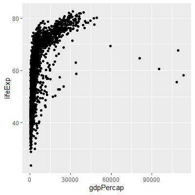

上面的程序等同于调用 `print(p+geom_point())`。在 R 函数中或者在循环中需要显式调用 `print()`，否则不会显示结果。在 tidyverse 系统中可以写成 `(p+geom_point()) %>% pint()`。

## 添加拟合线

绘制好基本图形后，随后可以逐步对坐标系、坐标系刻度、标签与图例、配色等进行改善。

作图步骤之间用加号连接，这是 ggplot 特定的语法。例如，用相同的映射做拟合曲线图：

```r
p + geom_smooth()
```

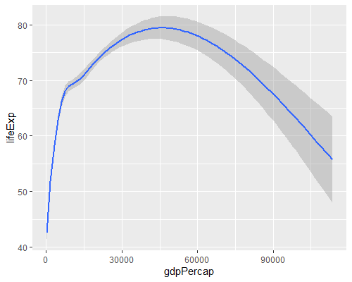

用相同的映射做散点图+拟合曲线图：

```r
p + geom_point() + geom_smooth()
```

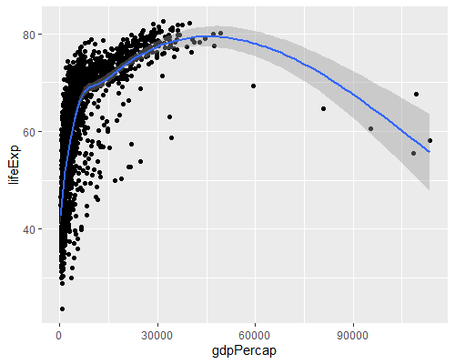

`geom_smooth()` 默认使用 `gam()` 函数拟合曲线，在 `geom_smooth()` 中可以用 `method` 参数指定不用的拟合方法，如直线拟合：

```r
p + geom_point() + geom_smooth(method="lm")
```

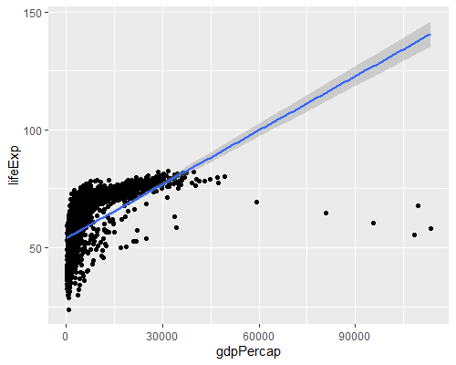

## scale

在以上所有图形中， x 轴变量（人均 GDP）分布非正态，严重右偏，使得大多数散点重叠地分布在直角坐标系的左下角。将 x 轴对数刻度可以改善，函数为 `scale_x_log10()`：

```r
print(p + geom_point() +
        geom_smooth(method = "gam") +
        scale_x_log10())
```


广义可加模型拟合的曲线基本是一条直线。注意，对数刻度实际上对原始数据进行对数变换，而 `geom_smooth()` 的拟合计算是在对数变换之后进行的。

下面先调整一下 x 轴刻度标签，可以使用 scales 扩展包的函数进行改善，作为 `scale_x_log10()` 的 `labels` 选项：

```r
print(p + geom_point() +
        geom_smooth(method = "gam") +
        scale_x_log10(labels=scales::dollar))
```

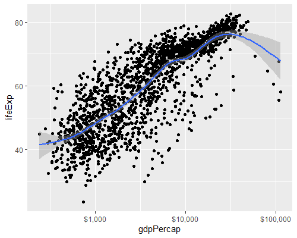

`scale_xxx()` 的 `labels` 选项指定如何标出坐标刻度数字，参数值是一个函数对象，如果 `scales` 包中找不到适当的功能，可以自定义一个函数将数值转换为字符串。`scales` 包提供了 `comma`, `date`, `dollar`, `math`, `number`, `ordinal`, `pvalue`, `scientific`, `time` 等坐标刻度值转换函数。

## 颜色、符号、线型映射

`ggplot()` 函数的 `mapping` 参数的 `aes()` 可以将变量映射到 x, y 轴、颜色、符号、线型等图形元素类型，也可以作为图形设置将某些图形元素设置为固定值。

例如，用不同颜色表示不同洲，即将 continent 变量映射到 color:

```r
p <- ggplot(
  data = gapminder,
  mapping = aes(
    x = gdpPercap,
    y = lifeExp,
    color = continent
  )
)

p + geom_point() +
  geom_smooth(method = "loess") +
  scale_x_log10(labels = scales::dollar)
```

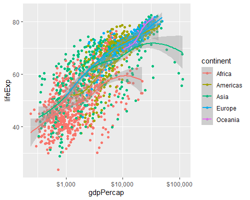

这里，不同 continent 变量的值用不同颜色，五个大洲分别进行了曲线拟合，曲线使用了不同颜色但置信域颜色相同，使得不好读取。在图形右侧自动生成了颜色与continent 变量值的对应关系图例。

下面依然分不同大洲作拟合曲线，并将置信区间阴影也用不同颜色区分，即在 `aes()` 中将 `color` 和 `fill` 都指定为 `continent`：

```r
p <- ggplot(
  data = gapminder,
  mapping = aes(
    x = gdpPercap,
    y = lifeExp,
    color = continent,
    fill = continent
  )
)

p + geom_point() +
  geom_smooth(method = "loess") +
  scale_x_log10(labels = scales::dollar)
```

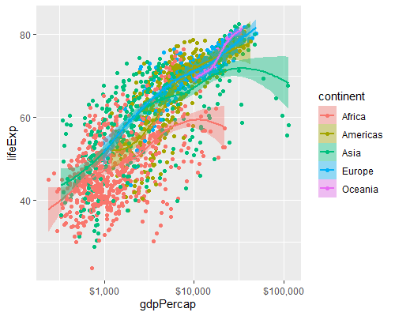

下面尝试将颜色指定为一个固定值：

```r
p <- ggplot(
  data = gapminder,
  mapping = aes(
    x = gdpPercap,
    y = lifeExp,
    color = "chartreuse4"
  )
)

pp <- p + geom_point() +
  geom_smooth(method = "loess") +
  scale_x_log10(labels = scales::dollar)
print(pp)
```

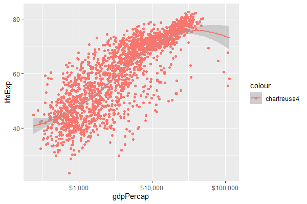

有点出乎意料啊，散点图没有变成草绿色（chartreuse4），而且在图形右侧生成了 chartreuse4 图例。

这是因为 `aes()` 仅用来指定变量与图形元素类型的映射，所以实际上是生成了一个仅有一个常数值 chartreuse4 的新变量，用颜色表示这个新变量。

要指定固定颜色，应该在 `geom_xxx()` 中指定 `color=` 选项，而不是在 `aes()` 中。例如：

```r
p <- ggplot(
  data = gapminder,
  mapping = aes(
    x = gdpPercap,
    y = lifeExp
  )
)

pp <- p + geom_point(color = "chartreuse4") +
  geom_smooth(method = "loess") +
  scale_x_log10(labels = scales::dollar)
print(pp)
```

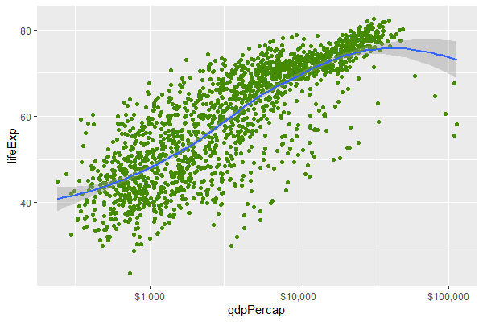

`geom_xxx()` 函数接受许多关于颜色、透明度、符号、线型的设置参数。比如，下面指定散点的透明度，以及拟合直线的粗细：

```r
pp <- p + geom_point(alpha = 0.5) +
  geom_smooth(method = "lm", color = "cadetblue1", se = FALSE, size = 4, alpha = 0.3) +
  scale_x_log10(labels = scales::dollar)
```


参数说明：

- `size` 指定线的粗细，单位为毫米。
- `se=FALSE` 关闭直线区间显示
- `alpha=` 指定了透明度，取0 到 1 之间，数值越小越透明

在数据点较多时适当的设置透明度，可以比较好地显示重叠的点。

对线条可以用 `linetype` 指定线型，0 表示实线，1到6表示不同的虚线类型。

## 添加标题

可以用 `labs()` 函数给图形加上适当的标题：

```r
p <- ggplot(data = gapminder,
            mapping = aes(x = gdpPercap,
                          y = lifeExp))

pp <- p + geom_point(alpha = 0.5) +
  geom_smooth(method = "gam") +
  scale_x_log10(labels = scales::dollar) +
  labs(
    x = "人均GDP",
    y = "期望寿命（年）",
    title = "经济增长与期望寿命",
    subtitle = "数据点为每个国家每年",
    caption = "数据来源：gapminder"
  )
print(pp)
```

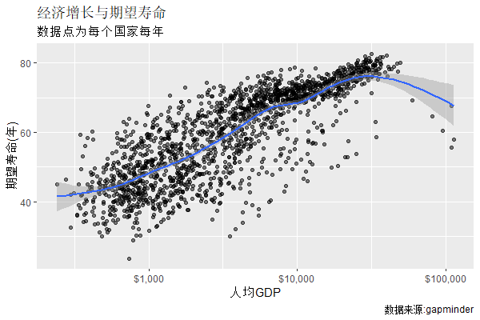

`labs()` 参数说明：

- `x` 指定了 x 轴标题
- `y` 指定 y 轴标题
- `title` 指定图标题
- `subtitle` 指定图的副标题
- `caption` 指定右下方的标注

## 在 geom 中映射变量

在前面的例子中，在 ggplot() 函数中将 color 和 fill 映射到 continent 变量，使得不仅散点颜色代表了不同大洲，还使得每个大洲单独拟合了曲线。如果只希望所有大洲拟合一条曲线呢？

在必要时，也可以在 `geom_xxx()` 函数中用 `mapping=aes()` 单独指定变量映射。例如，下面在 `geom_point()` 中将不同大洲映射为不同颜色，这样就不影响 `geom_smooth()` 中的颜色及分组：

```r
p <- ggplot(
  data = gapminder,
  mapping = aes(
    x = gdpPercap,
    y = lifeExp
  )
)

pp <- p + geom_point(mapping = aes(color = continent)) +
  geom_smooth(method = "loess") +
  scale_x_log10(labels = scales::dollar)

print(pp)
```

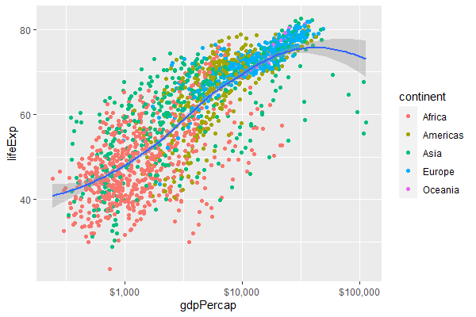

## 映射形状

也可以将分类变量映射到不同绘图符号。例如，取 gapminder 2007 年数据子集，将大洲映射到符号：

```r
p <- ggplot(
  data = filter(gapminder, year == 2007),
  mapping = aes(
    x = gdpPercap,
    y = lifeExp,
    shape = continent
  )
)

pp <- p + geom_point(alpha = 0.4, size = 4) +
  geom_smooth(method = "loess") +
  scale_x_log10(labels = scales::dollar)
print(pp)
```

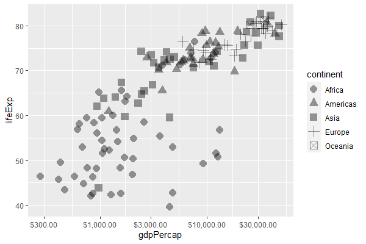

这种映射只适合点数比较少的情况。

如果所有点使用同一指定符号，可以在 `geom_point()` 中用 `shape` 参数指定，数值从 0 到25，也可以用字符串符号名称表示，如 "circle" 表示实心点。

需要注意，绘图时参与映射的分类变量会自动产生分类效果，color 映射与 fill 映射到分类变量时常常会起到与添加 group 相同的作用，但为了逻辑清晰，需要分组时还应该显式映射到 group。

## 连续变量的颜色映射

可以将连续变量映射为渐变色。除了表示二元函数的等值线图以外，这种方法并不利于读者认读。

例如，将人口数取对数映射为渐变色：

```r
p <- ggplot(
  data = filter(gapminder, year == 2007),
  mapping = aes(
    x = gdpPercap,
    y = lifeExp,
    color = log(pop)
  )
)

pp <- p + geom_point() +
  geom_smooth(method = "loess") +
  scale_x_log10(labels = scales::dollar)
print(pp)
```

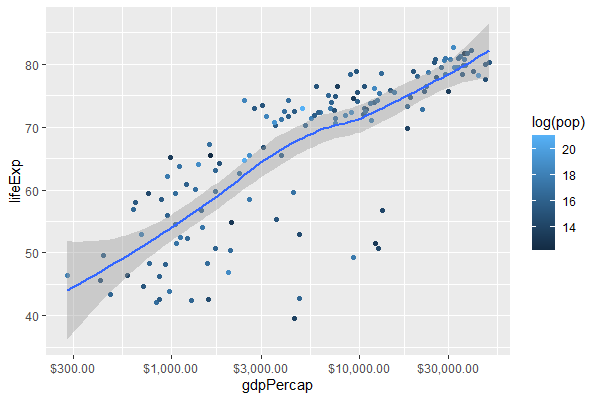

这里，不同散点的颜色是连续变化的，右侧的图例仅显示有限的一些代表值。
