# Color

- [Color](#color)
  - [简介](#简介)
  - [样例数据](#样例数据)
  - [指定颜色](#指定颜色)
  - [变量颜色映射](#变量颜色映射)
  - [色盲友好色板](#色盲友好色板)
  - [选择颜色](#选择颜色)
  - [设置亮度和饱和度](#设置亮度和饱和度)
  - [自定义颜色](#自定义颜色)

2020-08-28, 11:54
@jiaweiM
***

## 简介

ggplot2 的默认颜色区分度不是很好，对色盲也不是很友好，因此自定义颜色很重要。

## 样例数据

```r
# Two variables
df <- read.table(header=TRUE, text='
 cond yval
    A 2
    B 2.5
    C 1.6
')

# Three variables
df2 <- read.table(header=TRUE, text='
 cond1 cond2 yval
    A      I 2
    A      J 2.5
    A      K 1.6
    B      I 2.2
    B      J 2.4
    B      K 1.2
    C      I 1.7
    C      J 2.3
    C      K 1.9
')
```

## 指定颜色

线条和点的颜色可以直接使用 `color="red"` 指定。bar 等填充对象的颜色可以使用 `fill="red"` 格式指定。

如果要使用基本颜色之外的颜色，使用十六进制颜色代码最为方便，例如 "#FF6699"。

- 默认黑色

```r
library(ggplot2)
library(readr)

d1 <- read_table2("cond yval
    A 2
    B 2.5
    C 1.6", col_names = TRUE)


# default: dark bars
ggplot(d1, aes(x = cond, y = yval)) +
  geom_bar(stat = "identity")
```

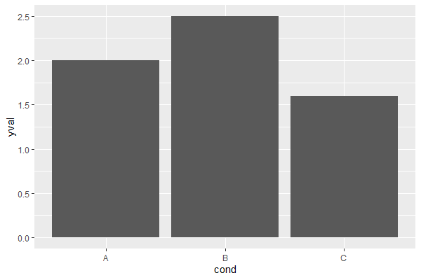

- 指定红色边框

```r
ggplot(d1, aes(x = cond, y = yval)) +
  geom_bar(stat = "identity", colour = "#FF9999")
```


- 指定填充红色、边框黑色

```r
ggplot(d1, aes(x = cond, y = yval)) +
  geom_bar(stat = "identity", fill = "#FF9999", colour = "black")
```

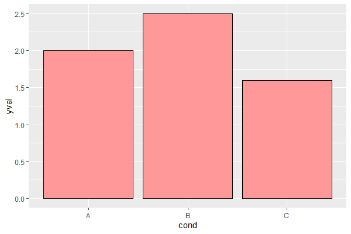

- 默认黑线黑点
  
```r
ggplot(d1, aes(x = cond, y = yval)) +
  geom_line(aes(group = 1)) +
  geom_point(size = 3)
```

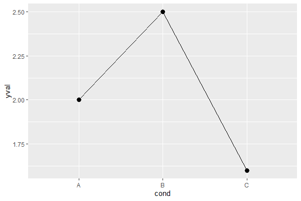

- 蓝线红点

```r
ggplot(d1, aes(x = cond, y = yval)) +
  geom_line(aes(group = 1), colour = "#000099") + # Blue lines
  geom_point(size = 3, colour = "#CC0000") # Red dots
```

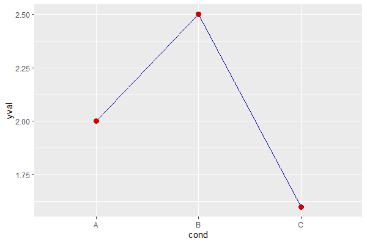

## 变量颜色映射

除了在 `geom_xxx()` 函数中修改颜色，还可以将变量映射到颜色。

在 `aes()` 语句中将颜色映射到颜色。

- 颜色映射到 x 值

```r
library(readr)
library(ggplot2)

d1 <- read_table2("cond yval
    A 2
    B 2.5
    C 1.6")
d2 <- read_table2("cond1 cond2 yval
    A      I 2
    A      J 2.5
    A      K 1.6
    B      I 2.2
    B      J 2.4
    B      K 1.2
    C      I 1.7
    C      J 2.3
    C      K 1.9")

ggplot(d1, aes(x = cond, y = yval, fill = cond)) +
  geom_bar(stat = "identity")
```

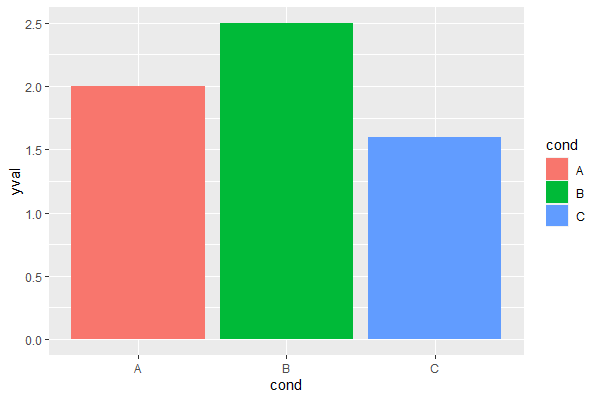

- 颜色映射到其它列

```r
ggplot(d2, aes(x = cond1, y = yval)) +
  geom_bar(aes(fill = cond2), # 颜色和 cond2 映射
    stat = "identity",
    color = "black", # 边框颜色
    position = position_dodge() # 并排显示
  )
```

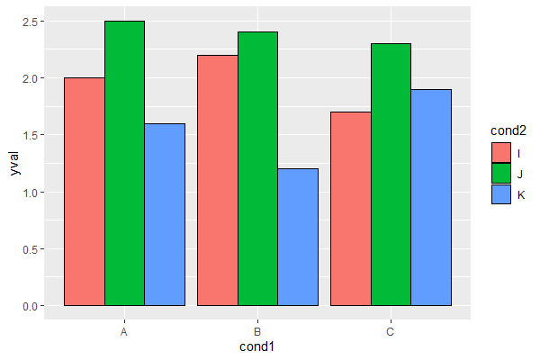

- 点线

```r
ggplot(d2, aes(x = cond1, y = yval)) +
  geom_line(aes(colour = cond2, group = cond2)) + # color, group boton depend on cond2
  geom_point(aes(colour = cond2), size = 3) # colour depends on cond2
```

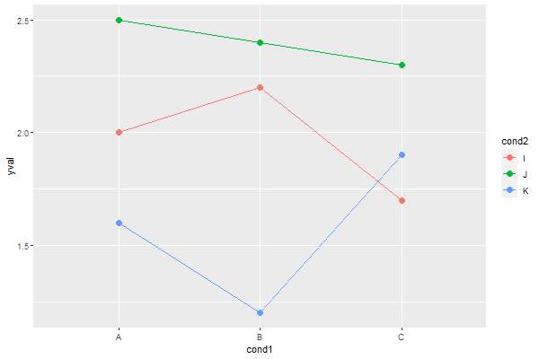

```r
## Equivalent to above; but move "colour=cond2" into the global aes() mapping
ggplot(df2, aes(x=cond1, y=yval, colour=cond2)) +
   geom_line(aes(group=cond2)) +
   geom_point(size=3)
```

如果是相同映射，将其放在全局更简洁。

## 色盲友好色板

下面两个是对色盲友好的色板：


创建上面两个色板的方法：

```r
# The palette with grey:
cbPalette <- c("#999999", "#E69F00", "#56B4E9", "#009E73", "#F0E442", "#0072B2", "#D55E00", "#CC79A7")

# The palette with black:
cbbPalette <- c("#000000", "#E69F00", "#56B4E9", "#009E73", "#F0E442", "#0072B2", "#D55E00", "#CC79A7")

# To use for fills, add
  scale_fill_manual(values=cbPalette)

# To use for line and point colors, add
  scale_colour_manual(values=cbPalette)
```

更多色盲友好色板可以参考 [https://jfly.uni-koeln.de/color/](https://jfly.uni-koeln.de/color/)。

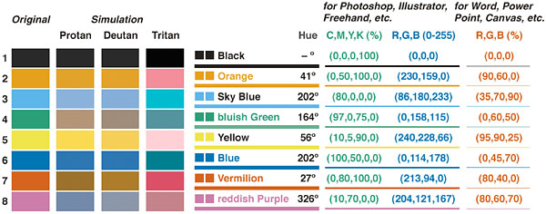

## 选择颜色

离散色阶的颜色默认在 HSL 色环周围均匀分布。例如，如果有两种颜色，则选择色环中相对的两个点；如果选择三个颜色，则它们在色环中相差 120°。下图是不同种类对应的颜色：

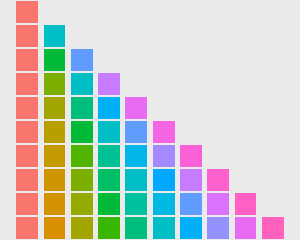

如果只有一种数据，则采用第一行颜色；如果有两种数据，则采用第二行的两种颜色，依次类推。

默认使用 `scale_fill_hue()` 和 `scale_colour_hue()` 选择颜色。例如：

```r
# These two are equivalent; by default scale_fill_hue() is used
ggplot(df, aes(x=cond, y=yval, fill=cond)) + geom_bar(stat="identity")
# ggplot(df, aes(x=cond, y=yval, fill=cond)) + geom_bar(stat="identity") + scale_fill_hue()

# These two are equivalent; by default scale_colour_hue() is used
ggplot(df, aes(x=cond, y=yval, colour=cond)) + geom_point(size=2)
# ggplot(df, aes(x=cond, y=yval, colour=cond)) + geom_point(size=2) + scale_colour_hue()
```

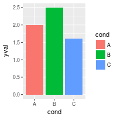

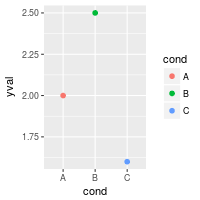

## 设置亮度和饱和度

## 自定义颜色

可以使用 `scale_fill_manual()` 自定义颜色。例如：

```r
library(readr)
library(ggplot2)

d1 <- read_table2("cond yval
    A 2
    B 2.5
    C 1.6")

ggplot(d1, aes(x = cond, y = yval, fill = cond)) +
  geom_bar(stat = "identity") +
  scale_fill_manual(values = c("red", "blue", "green"))
```

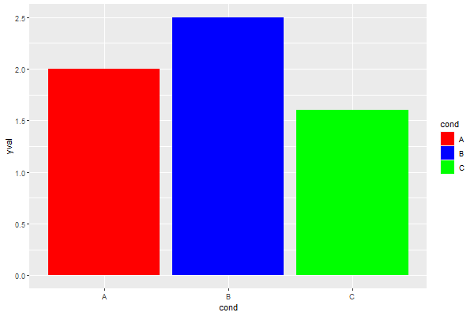

```r
ggplot(d1, aes(x = cond, y = yval, fill = cond)) +
  geom_bar(stat = "identity") +
  scale_fill_manual(values = c("#CC6666", "#9999CC", "#66CC99"))
```

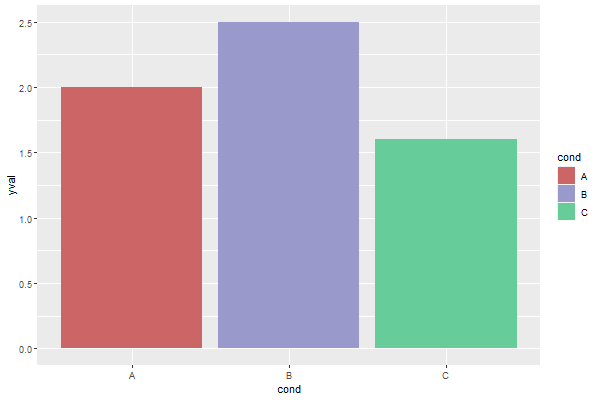
