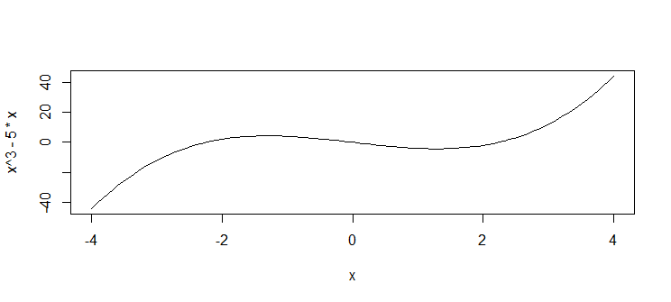
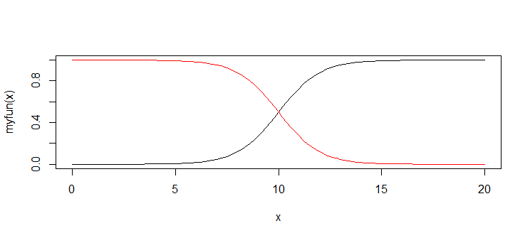
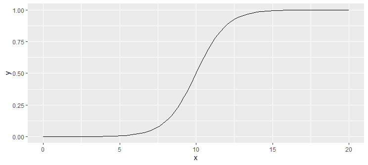

# Function Curve

- [Function Curve](#function-curve)
  - [简介](#简介)
  - [ggplot](#ggplot)

2020-06-17, 08:24
***

## 简介

绘制函数的曲线图，在R 中可以直接使用 `curve()` 函数。例如：

```r
curve(x^3 - 5 * x, from = -4, to = 4)
```



`curve()` 可以绘制任何输入为数值向量，数值为数值向量的函数。添加 `add = TRUE` 则在已有基础上添加曲线。例如：

```r
myfun <- function(xvar) {
  1 / (1 + exp(-xvar + 10))
}
curve(myfun(x), from = 0, to = 20)
curve(1 - myfun(x), add = TRUE, col = "red")
```



## ggplot

ggplot2 使用 `stat_function(geom = 'line')` 绘制函数曲线图。例如：

```r
myfun <- function(xvar) {
  1 / (1 + exp(-xvar + 10))
}

p <- ggplot(
  data.frame(x = c(0, 20)),
  aes(x = x)
) +
  stat_function(fun = myfun, geom = "line")
print(p)
```


