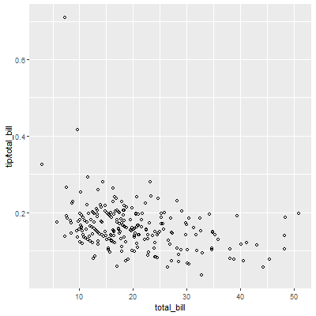
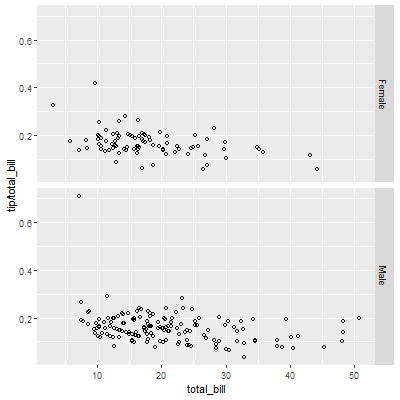
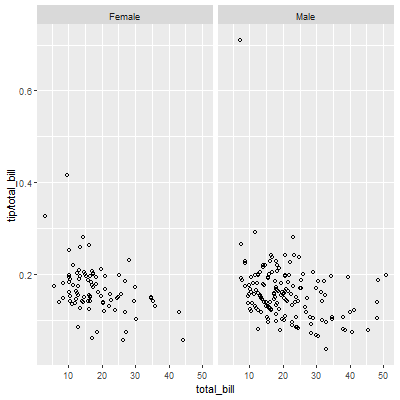
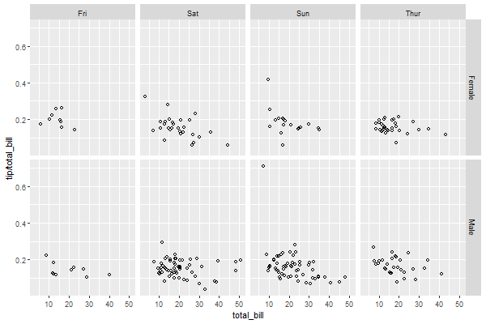
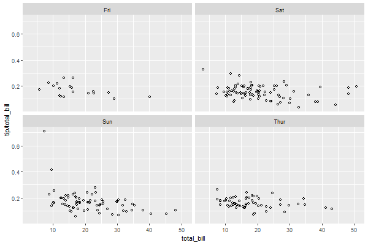
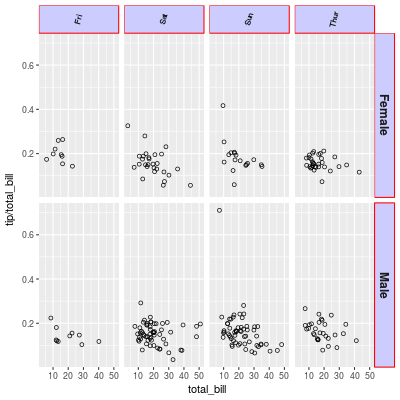

# Facetting

- [Facetting](#facetting)
  - [简介](#简介)
  - [实践](#实践)
    - [facet_grid](#facet_grid)
    - [facet_wrap](#facet_wrap)
    - [修改标签样式](#修改标签样式)
    - [修改标签文本](#修改标签文本)
    - [Free scales](#free-scales)
  - [参考](#参考)

2020-09-07, 20:17
@jiawei
***

## 简介

通过一个或多个变量将数据拆分，然后将数据子集分别绘制，构成多个小图。

## 实践

采用 `reshape2` 包的 `tips` 数据集演示。

```r
> library(reshape2)
> 
> head(tips)
  total_bill  tip    sex smoker day   time size
1      16.99 1.01 Female     No Sun Dinner    2
2      10.34 1.66   Male     No Sun Dinner    3
3      21.01 3.50   Male     No Sun Dinner    3
4      23.68 3.31   Male     No Sun Dinner    2
5      24.59 3.61 Female     No Sun Dinner    4
6      25.29 4.71   Male     No Sun Dinner    4
```

使用 `total_bill` 和 `tip` 这两列绘制散点图：

```r
library(ggplot2)

sp <- ggplot(tips, aes(x = total_bill, y = tip / total_bill)) +
  geom_point(shape = 1)
print(sp)
```



### facet_grid

可以根据一个或多个变量对数据进行分类，语法为：

`vertical ~ horizontal`

- 垂直两行

例如，根据 `sex` 变量将数据分为垂直两行：

```r
sp <- ggplot(tips, aes(x = total_bill, y = tip / total_bill)) +
  geom_point(shape = 1) +
  facet_grid(sex ~ .)
```



- 水平两列

或者分为水平两列：

```r
sp + facet_grid(. ~ sex)
```



- 同时分行和列

垂直方向按 `sex` 分，水平方向按 `day` 分：

```r
sp <- sp + facet_grid(sex ~ day)
```



### facet_wrap

除了使用变量在水平或垂直方向划分外，还可以直接指定行号和列号进行定位。每个 plot 的标题会放在图的上方。

例如，按照 day 进行分类，然后设置为两列：

```r
sp <- sp + facet_wrap(~day, ncol = 2)
```



### 修改标签样式

```r
sp + facet_grid(sex ~ day) +
    theme(strip.text.x = element_text(size=8, angle=75),
          strip.text.y = element_text(size=12, face="bold"),
          strip.background = element_rect(colour="red", fill="#CCCCFF"))
```



### 修改标签文本

修改标签文本的方法有多种，最简单的方法是提供原名称到新名称的映射：

```r
labels <- c(Female = "Women", Male = "Men")
sp + facet_grid(. ~ sex, labeller=labeller(sex = labels))
```

或者直接修改数据框的标签：

```r
tips2 <- tips
levels(tips2$sex)[levels(tips2$sex)=="Female"] <- "Women"
levels(tips2$sex)[levels(tips2$sex)=="Male"]   <- "Men"
head(tips2, 3)
#>   total_bill  tip   sex smoker day   time size
#> 1      16.99 1.01 Women     No Sun Dinner    2
#> 2      10.34 1.66   Men     No Sun Dinner    3
#> 3      21.01 3.50   Men     No Sun Dinner    3

# Both of these will give the same output:
sp2 <- ggplot(tips2, aes(x=total_bill, y=tip/total_bill)) + geom_point(shape=1)
sp2 + facet_grid(. ~ sex)
```

`labeller()` 可以使用任何以字符向量为输入，输出为字符向量的函数。

### Free scales

使用 facet，一般来说

## 参考

- [Cookbook for R](http://www.cookbook-r.com/Graphs/Facets_(ggplot2)/)
