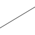
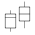
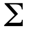
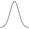

# 几何对象

- [几何对象](#几何对象)
  - [简介](#简介)

2020-08-31, 10:39
@jiaweiM
***

## 简介

图层结合了数据、美学映射、几何对象、统计转换以及位置调整。使用 ggplot 画图，一般使用 `geom_xxx` 函数添加图层，然后覆盖默认的位置，如果需要，再添加统计转换。

|几何对象|函数|说明|
|---|---|---|
||`geom_abline()`, `geom_hline()`, `geom_vline()`|定义水平、垂直以及对角线|
||`geom_bar()`, `geom_col()`, `stat_count()`|Bar charts|
||`geom_bin2d()`, `stat_bin_2d()`|2D 热图|
||`geom_blank()`|空白|
||`geom_boxplot()`, `stat_boxplot()`|箱线图|
||`geom_contour()`, `geom_contour_filled()`, `stat_contour()`, `stat_contour_filled()`|2D contours of a 3D surface|
||`geom_count()`, `stat_sum()`|计算重叠点|
||`geom_density()`, `stat_density`|Smoothed density estimates|
||`geom_density_2d()`, `deom_density_2d_filled()`, `stat_density_2d()`, `stat_density_2d_filled()`|Contours of a 2D density estimate|
||`geom_dotplot()`|dot plot|
||`geom_errorbarh()`|水平 error bar|
||`geom_function()`, `stat_function()`|Draw a function as a continuous curve|
||`geom_hex()`, `stat_bin_hex()`|Hexagonal heatmap of 2d bin counts|
||`geom_freqpoly()`, `geom_histogram()`, `stat_bin()`|Histograms and frequency polygons|
