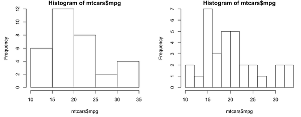
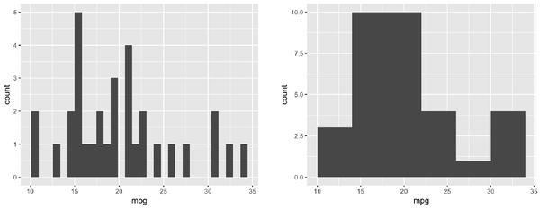

# Histogram

## R hist

R 自带的 `hist()` 函数可以绘制直方图。

```r
hist(mtcars$mpg)

# Specify approximate number of bins with breaks
hist(mtcars$mpg, breaks = 10)
```



## ggplot2

`geom_histogram()` 绘制直方图。

```r
library(ggplot2)
ggplot(mtcars, aes(x = mpg)) +
  geom_histogram()
#> `stat_bin()` using `bins = 30`. Pick better value with `binwidth`.

# With wider bins
ggplot(mtcars, aes(x = mpg)) +
  geom_histogram(binwidth = 4)
```



`geom_histogram()` 默认使用 30 个bins。
