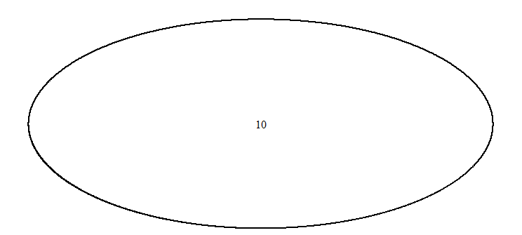
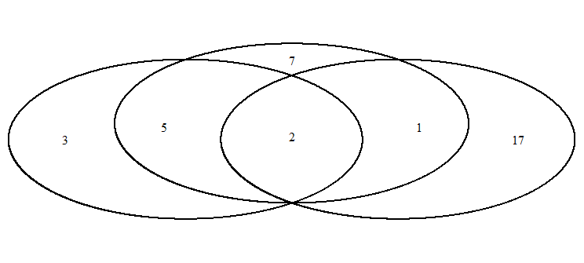
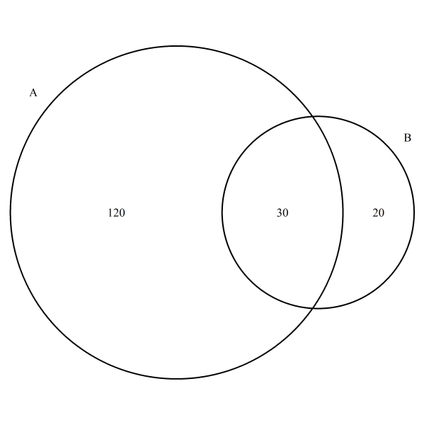
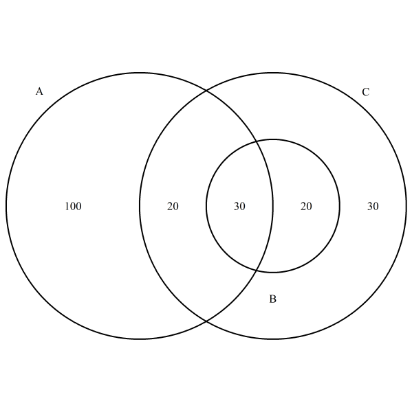
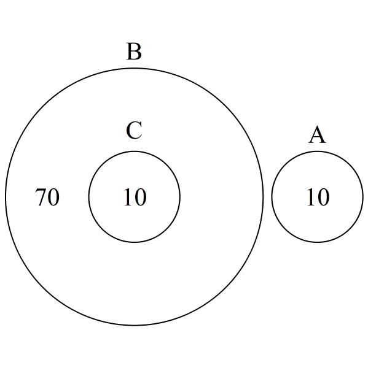
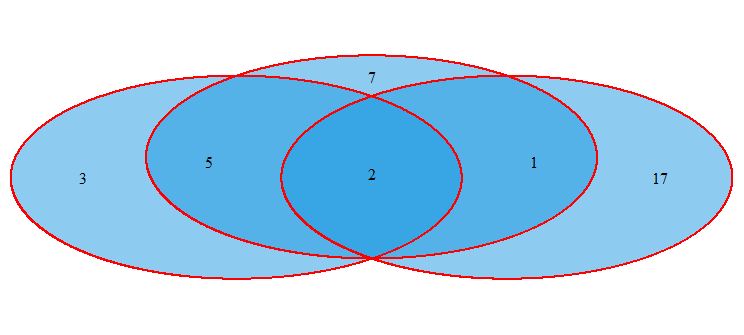
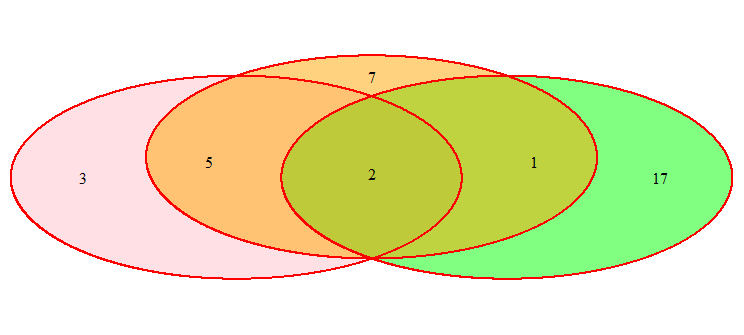
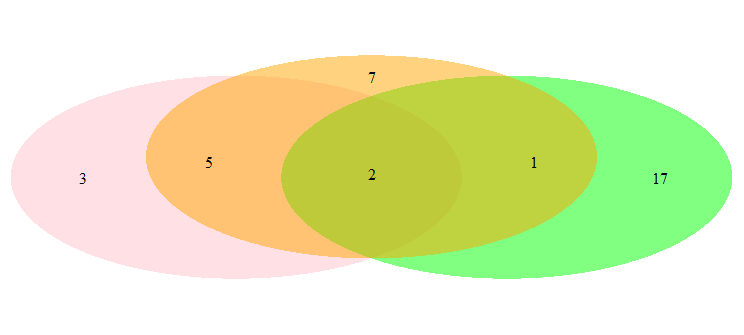
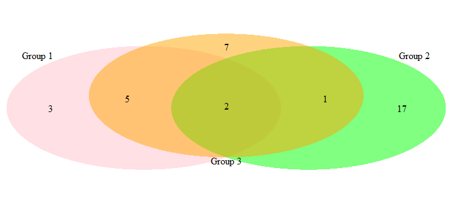

# Venn

- [Venn](#venn)
  - [VennDiagram](#venndiagram)
    - [`calculate.overlap(x)`](#calculateoverlapx)
  - [单个圆](#单个圆)
  - [两个集合](#两个集合)
  - [三个集合](#三个集合)
  - [venn.diagram](#venndiagram-1)
    - [标题设置](#标题设置)
    - [图形参数](#图形参数)
    - [外部文本 (set 2)](#外部文本-set-2)
    - [Set2](#set2)
    - [Set 3](#set-3)
  - [设置颜色](#设置颜色)
  - [为不同集合设置不同颜色](#为不同集合设置不同颜色)
  - [移除边框](#移除边框)
  - [添加名称](#添加名称)
  - [References](#references)

2020-06-17, 20:46
***

## VennDiagram

### `calculate.overlap(x)`

`x` 为 vector 列表，每个 vector 对应 venn 的一个集合。

是对 `venn.diagram()` 函数的一个补充，方便用户确定不同区域的值。

## 单个圆

```r
library(VennDiagram)

grid.newpage()
draw.single.venn(area = 10)
```

首先使用 `grid.newpage` 函数创建一个绘图页，然后使用 `draw.single.venn()` 绘制三个维恩图。



## 两个集合

`draw.pairwise.venn` 用于绘制包含两个集合的维恩图。

```r
library(VennDiagram)

grid.newpage()
draw.pairwise.venn(area1 = 10, area2 = 20, cross.area = 2)
```


## 三个集合

使用 `draw.triple.venn` 函数绘制三集合维恩图。

```r
library(VennDiagram)

grid.newpage()
draw.triple.venn(
  area1 = 10, area2 = 20, area3 = 15,
  n12 = 2, n23 = 3, n13 = 7, n123 = 2
)
```



## venn.diagram

`venn.diagram` 是绘制维恩图的最重要函数。

```r
venn.diagram(x, filename, height = 3000, width = 3000, resolution = 500, imagetype = "tiff", units = "px",
             compression = "lzw", na = "stop", main = NULL, sub = NULL,
             main.pos = c(0.5, 1.05), main.fontface = "plain", main.fontfamily = "serif",
             main.col = "black", main.cex = 1, main.just = c(0.5, 1),
             sub.pos = c(0.5, 1.05), sub.fontface = "plain", sub.fontfamily = "serif", sub.col = "black",
             sub.cex = 1, sub.just = c(0.5, 1), category.names = names(x), force.unique = TRUE,
             print.mode = "raw", sigdigs = 3, direct.area = FALSE, area.vector = 0, hyper.test = FALSE,
             total.population = NULL, lower.tail = TRUE, ...)
```

1. `x`

vector 列表。每个 vector 对应一个集合。

2. `filename`

导出图片文件路径。`NULL` 表示返回 grid 对象本身。

3. `height`

图像高度 in unit。

4. `width`

图像宽度 in unit。

5. `resolution`

分辨率，DPI。

6. `imagetype`

图片类型，如 'tiff', 'png' 或 'svg'。

7. `units`

设置图像尺寸的单位。

8. `compression`

应用到最终 tiff 的压缩算法。

9. `na`

缺失值处理方法："none", "stop", "remove"

10. `category.names`

使用 plotmath 语法指定分类名称。

11. `force.unique`

布尔值，是否使用输入列表元素的唯一值，默认 FALSE。

12. `print.mode`

'raw' 或 'percent'。

数值输出样式。可以使用向量传入两个样式，第二个在第一个下面显示。

13. `sigdigs`

如果 `print.mode` 包含 'percent'，该参数指定小数点位数。

14. `direct.area`

如果为 true，则 `area.vector` 参数的向量直接分配为对应区域的面积。只在知道向量元素和图中区域的对应关系时使用该参数。

15. `area.vector`

`direct.area` 为 true 时使用该参数。用于指定 venn 图不同区域的面积。

16. `hyper.test`

如果只有两个类别，并且 `total.population` 不为 NULL，则执行超几何测试，并将其添加到副标题。

17. `total.population`

`hyper.test` 为 true 时使用。为总体大小。

18. `lower.tail`

BOOLEAN 值。如果为 TRUE (default)，则概率为 $P[X \le x]$，否则概率为 $P[X \gt x]$。

19. `...`

图像参数。

### 标题设置

|主标题|子标题|说明|
|---|---|---|
|`main`|`sub`|标题文本|
|`main.pos`|`sub.pos`|标题位置，长度为 2 的向量，对应 (x,y)|
|`main.fontface`|`sub.fontface`|字体样式|
|`main.fontfamily`|`sub.fontfamily`|字体类型|
|`main.col`|`sub.col`|字体颜色|
|`main.cex`|`sub.cex`|字体大小|
|`main.just`|`sub.just`|对齐方式，长度为 2 的向量，对应水平和垂直对齐方式|

### 图形参数

|参数|Venn size|Class|说明|
|---|---|---|---|
|lwd|1,2,3,4,5|numeric|向量：圆圈线条宽度|
|lty|1,2,3,4,5|numeric|向量：圆圈线条虚线样式|
|col|1,2,3,4,5|character|向量：圆圈线条颜色|
|fill|1,2,3,4,5|character|向量：圆圈填充颜色|
|alpha|1,2,3,4,5|numeric|向量：圆圈透明度|
|label.col|1,2,3,4,5|character|向量：每个区域标签的颜色，根据集合数长度分别为 1/3/7/15|
|cex|1,2,3,4,5|numeric|向量：每个区域标签大小，根据集合数长度分别为 1/3/7/15|
|fontface|1,2,3,4,5|character|向量：每个区域标签字体样式，根据集合数长度分别为 1/3/7/15|
|fontfamily|1,2,3,4,5|character|向量：标签字体|
|cat.pos|1,2,3,4,5|numeric|向量：指定分类名称位置（度数），0 对应12点方向|
|cat.dist|1,2,3,4,5|numeric|向量：分类名称和圆边框的距离 in npc，取 0 时文本和圆内边挨着，负值则到圆内部，正值在圆外部|
|cat.cex|1,2,3,4,5|numeric|向量：分类名称大小|
|cat.col|1,2,3,4,5|character|向量：分类名称颜色|
|cat.fontface|1,2,3,4,5|character|向量：分类名称字体样式|
|cat.fontfamily|1,2,3,4,5|character|向量：分类名称字体|
|cat.just|1,2,3,4,5|numeric|List：长度为 2的 vector 列表，指定分类名称水平和垂直对齐方式|
|cat.default.pos|1,2,3|character|One of c('outer', 'text') to specify the default location of category names (cat.pos and cat.dist are handled differently)|
|cat.prompts|2|numeric|Boolean indicating whether to display help text on category name positioning or not
|margin|1,2,3,4,5|numeric|Number giving the amount of whitespace around the diagram in grid units
|rotation.degree|1,2,3,4,5|numeric|Number of degrees to rotate the entire diagram|
|rotation.centre|1,2,3,4,5|numeric|Vector of length 2 indicating (x,y) of the rotation centre|
|rotation|3|numeric|Number giving the clockwise rotation of a three-set Venn diagram (1, 2, or 3)|
|reverse|3|logical|沿着中心垂直对称轴翻转 three-set venn 图。和 `rotation` 组合可以生成各种可能的集合顺序|
|euler.d|2, 3|logical|Enable Euler diagrams for two-set and three-set Venn diagrams (Venn Diagrams with moveable circles)|
|`scaled`|2, 3|logical|对 two-set 和某些three-set Euler (`euler.d` 必须为 true)启用缩放|
|sep.dist|2, 3|numeric|Controls the separation between distinct circles in certain two-set or three-set Euler diagrams.|
|offset|2, 3|numeric|Number between 0 and 1 giving the amount to offset the smaller circle by in the inclusion type of two-set Euler diagram and certain similar three-set Euler diagrams.
|inverted|2|logical|沿垂直轴方向翻转 two-set venn 图|

### 外部文本 (set 2)

- `ext.text`, 2, logical

当区域很小时，是否允许外部文本标签。

- `ext.percent`, 2, numeric

触发外部文本的最小面积比例，长度为3，对应区域1、区域2和交集区域。

- `ext.pos`, 2, numeric

外部文本相对圆的位置（度数），长度为 1 或 2，0 对应 12 点方向。

- `ext.line.lwd`, 2, numeric

连接 `ext.text` 的线条宽度。

- `ext.line.lty`, 2, numeric

外部线条虚线样式。

- `ext.dist`, 2, numeric

Vector:长度1或2，外部线条长度（负值缩短线条）

- `ext.length`, 2, numeric

Vector：长度1或2，从锚点到文本的外部线条比例

### Set2

```r
library(VennDiagram)

venn.plot <- venn.diagram(
  list(A = 1:150, B = 121:170),
  "Venn_2Set_simple.tiff"
)
```

2-set 维恩图，`list` 给出两个集合 A 和 B，列表标签 `A` 和 `B` 默认作为集合标签。



### Set 3

```r
library(VennDiagram)

venn.plot <- venn.diagram(
  list(A = 1:150, B = 121:170, C = 101:200),
  "Venn_3Set_simple.tiff"
)
```



```r
venn.plot <- venn.diagram(
  x = list(
    A = c(1:10),
    B = c(11:90),
    C = c(81:90)
  ),
  filename = "2-9_triple_special_case-121AO.tiff",
  cex = 2.5,
  cat.cex = 2.5,
  cat.pos = 0,
  cat.dist = c(0.04, 0.04, 0.02),
  reverse = TRUE
)
```

说明：

- C 完全在 B 中。
- cex 指定标签文本大小（10， 70）
- cat.cex 指定分类名称大小（A, B, C）
- cat.dist 指定标签和圆的距离



## 设置颜色

```r
library(VennDiagram)

grid.newpage() # Move to new plotting page
draw.triple.venn(
  area1 = 10, # Change color of venn diagram
  area2 = 20,
  area3 = 15,
  n12 = 2,
  n23 = 3,
  n13 = 7,
  n123 = 2,
  col = "red",
  fill = "#1b98e0"
)
```



## 为不同集合设置不同颜色

```r
library(VennDiagram)

grid.newpage() # Move to new plotting page
draw.triple.venn(
  area1 = 10, # Different color for each set
  area2 = 20,
  area3 = 15,
  n12 = 2,
  n23 = 3,
  n13 = 7,
  n123 = 2,
  col = "red",
  fill = c("pink", "green", "orange")
)
```



## 移除边框

边框通过 `lty` 参数指定，将其设置为 `blank` 移除边框。例如：

```r
library(VennDiagram)

grid.newpage() # Move to new plotting page
draw.triple.venn(
  area1 = 10, # Remove lines from venn diagram
  area2 = 20,
  area3 = 15,
  n12 = 2,
  n23 = 3,
  n13 = 7,
  n123 = 2,
  fill = c("pink", "green", "orange"),
  lty = "blank"
)
```



## 添加名称

通过 `category` 选项指定集合名称。

```r
library(VennDiagram)

grid.newpage() # Move to new plotting page
draw.triple.venn(
  area1 = 10, # Add name to each set
  area2 = 20,
  area3 = 15,
  n12 = 2,
  n23 = 3,
  n13 = 7,
  n123 = 2,
  fill = c("pink", "green", "orange"),
  lty = "blank",
  category = c("Group 1", "Group 2", "Group 3")
)
```



## References

- [VennDiagram RDocumentation](https://www.rdocumentation.org/packages/VennDiagram/versions/1.6.20)
