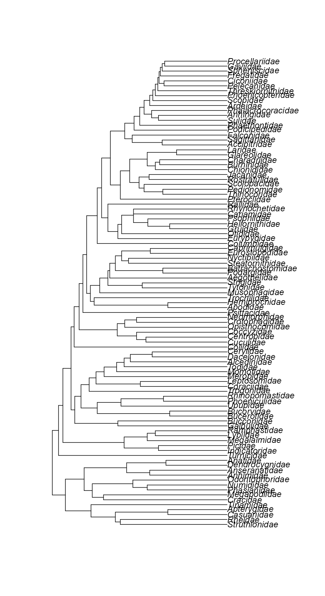
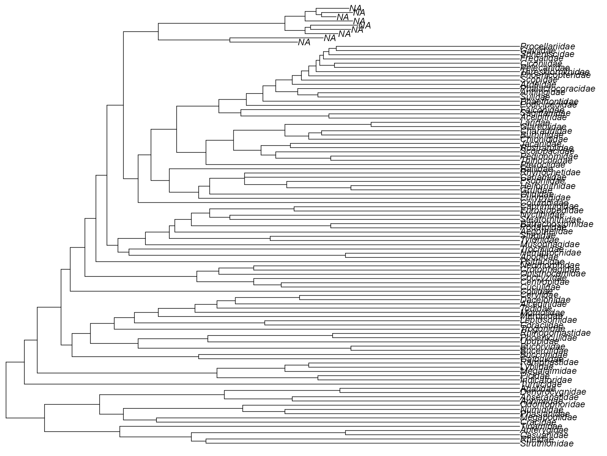

# 移除系统发育树的末端分支（Tips）

@since 2026-09-28
@author Jiawei Mao
***

## 概述

- `drop.tip`：移除系统发育树末端分支，同时支持删除对应的内部分支
- `keep.tip`：执行相反操作，即保留指定末端分支，返回推导的子树
- `extract.clade` 执行逆向操作：保留从指定节点出发的所有叶节点，并删除其余所有叶节点。

## 使用

- `drop.tip`

```R
drop.tip(phy, tip, ...)

## 针对 'phylo' 类的 S3 方法
drop.tip(phy, tip, trim.internal = TRUE, subtree = FALSE,
         root.edge = 0, rooted = is.rooted(phy), collapse.singles = TRUE,
         interactive = FALSE, ...)

## 针对 'multiPhylo' 类的 S3 方法
drop.tip(phy, tip, ...)
```

- `keep.tip`

```R
keep.tip(phy, tip, ...)
## S3 method for class 'phylo'
keep.tip(phy, tip, ...)
## S3 method for class 'multiPhylo'
keep.tip(phy, tip, ...)
```

- `extract.clade`

```R
extract.clade(phy, node, root.edge = 0, collapse.singles = TRUE,
              interactive = FALSE)
```

## 参数

- `phy`

`"phylo"` 类对象。

- `tip`

数值型或字符型向量，指定要删除的叶节点（Tips）。

- `trim.internal`

逻辑值，指定是否同时删除对应的内部分支。

- `subtree`

逻辑值，指定是否在输出的树中标明已删除的叶节点数量及其位置。

- `root.edge`

整数，指定用于构建新树根分支（root-edge）的内部分支数量。如果 `trim.internal = FALSE`，此参数将不起作用。

- `rooted`

逻辑值，指示是否将该树视为有根树。该参数允许将有根树强制视为无根树处理（参见示例）。关于树中可能存在的 `root.edge` 元素，请参阅详细说明。

- `collapse.singles`

逻辑值，指定是否删除 degree 为 2 的内部节点（即删除只有一个子节点的冗余内部节点）。

- `node`

节点的编号或标签。

- `interactive`

逻辑值。如果设为 `TRUE`，系统会要求用户通过点击已绘制的树来交互式地选择要删除的叶节点或目标节点。

- `...`

传递给其他方法或从其他方法接收的额外参数。

## 详细说明

`tip` 参数可以是字符型（character）或数值型（numeric）：

- 当 `tip` 为字符型，它指定的是要删除的叶节点（tips）的标签名称；
- 当 `tip` 为数值型，它指定的是这些标签在 `phy$tip.label` 向量中的位置编号。

上述规则同样适用于 `node` 参数。但如果该参数是字符型，且该树没有节点标签，则会报错。如果 `node` 参数传入了多个值（即长度大于或等于 2 的向量），则只使用第一个值，并会弹出警告提示。


- 如果 `trim.internal = FALSE`，新生成的叶节点标签将被设为 `"NA"`，除非该树中原本就存在节点标签，此时将沿用原有的节点标签。

如果 `subtree = TRUE`，返回的树中会有一个或多个终端枝（terminal branches），如果存在节点标签，则会以节点标签来命名。否则，会标明有多少个叶节点被移除（标签显示为 `"[x_tips]"`）。这一操作会针对所有被删除的单系群（monophyletic groups）执行。

请注意，设置 `subtree = TRUE` 会默认隐含 `trim.internal = TRUE`。

要了解 `root.edge` 选项的具体工作原理，请参阅下方的示例。如果 `rooted = FALSE` 且该树具有根枝（root edge），则在输出的结果中该根枝会被移除。

## 返回值

- 返回一个 `"phylo"` 类的对象。

## 示例

```R
data(bird.families)

tip <- c(
  "Eopsaltriidae", "Acanthisittidae", "Pittidae", "Eurylaimidae",
  "Philepittidae", "Tyrannidae", "Thamnophilidae", "Furnariidae",
  "Formicariidae", "Conopophagidae", "Rhinocryptidae", "Climacteridae",
  "Menuridae", "Ptilonorhynchidae", "Maluridae", "Meliphagidae",
  "Pardalotidae", "Petroicidae", "Irenidae", "Orthonychidae",
  "Pomatostomidae", "Laniidae", "Vireonidae", "Corvidae",
  "Callaeatidae", "Picathartidae", "Bombycillidae", "Cinclidae",
  "Muscicapidae", "Sturnidae", "Sittidae", "Certhiidae",
  "Paridae", "Aegithalidae", "Hirundinidae", "Regulidae",
  "Pycnonotidae", "Hypocoliidae", "Cisticolidae", "Zosteropidae",
  "Sylviidae", "Alaudidae", "Nectariniidae", "Melanocharitidae",
  "Paramythiidae", "Passeridae", "Fringillidae"
)
plot(drop.tip(bird.families, tip))
```



```R
plot(drop.tip(bird.families, tip, trim.internal = FALSE))
```




