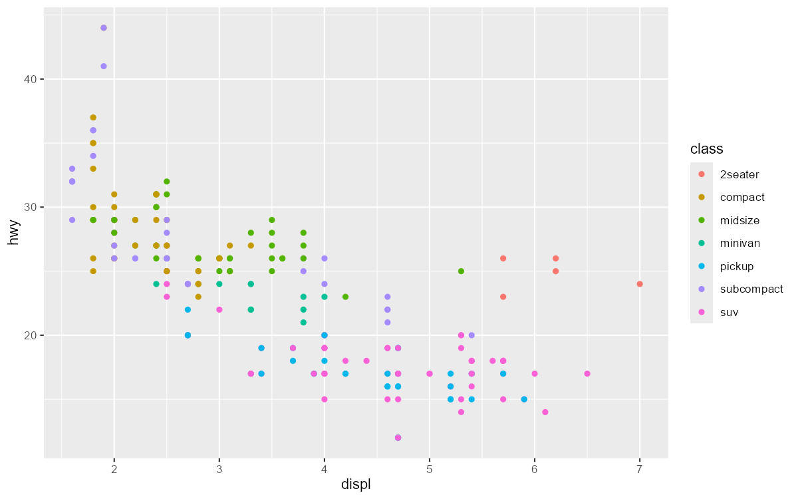

# ggplot

@since 2026-09-15⭐
@author Jiawei Mao
***
- [快速入门](1_intro.md)
- [几何对象](geoms.md)
- [散点图](chart_scatter.md)
- [折线图](chart_line.md)
- [函数曲线](chart_curve.md)
- [导出图形](output.md)
- [Facetting](facetting.md)

## 概述

`ggplot2` 是一个基于“图形语法”（The Grammar of Graphics）的声明式图形创建系统。你只需提供数据，并告诉 `ggplot2` 如何将变量映射到图形属性（aesthetics）、使用哪些基础图元，剩下的细节它自会处理。

## 安装

1. 安装 `ggplot2` 最简单的方法是安装整个 `tidyverse` 包集合

```R
install.packages("tidyverse")
```

2. 也可以只安装 `ggplot2`

```r
install.packages("ggplot2")
```

3. 或者从 GitHub 安装开发版

```R
# install.packages("pak")
pak::pak("tidyverse/ggplot2")
```

## 使用

很难用简短的语言来描述 `ggplot2` 的工作原理。不过，在大多数情况下，你只需：

1. 先调用 `ggplot()` 函数
2. 提供数据集
3. 通过 `aes()` 设置图形属性映射
4. 随后，可以逐步添加图层（如 `geom_point()` 或 `geom_histogram()`）、标度（如 `scale_colour_brewer()`）、分面设置（如 `facet_wrap()`）以及坐标系（如 `coord_flip()`）。

```R
library(ggplot2)

ggplot(mpg, aes(displ, hwy, colour = class)) +
  geom_point()
```



## 学习 ggplot2

如果你是 `ggplot2` 新手，最好从系统性的介绍开始学习，而不是通过阅读零散的文档页面来学习。目前，有几个很好的入门途径：

1. **《R for Data Science》中的“数据可视化”和“交流”章节**：这本书旨提供 `tidyverse` 的全面介绍，阅读这两个章节能让你快速度掌握 `ggplot2` 的核心要点。
2. **在线课程**：如果你想参加在线课程，可以尝试 [Data Visualization in R With ggplot2](https://learning.oreilly.com/videos/data-visualization-in/9781491963661/)。
3. **网络研讨会**：如果你想看网络研讨会，可以尝试 Thomas Lin Pedersen 的[Plotting Anything with ggplot2](https://youtu.be/h29g21z0a68)。
4. **《The R Graphics Cookbook》**：如果你想尽快上手制作常见图形，我强烈推荐 Winston Chang 的这本书。它提供了一系列解决常见图形问题的实用代码示例。
5. **《ggplot2: Elegant Graphics for Data Analysis》**：如果你已经掌握了基础知识并希望深入学习，请阅读此书。它详细描述了 `ggplot2` 的理论基础，并展示了各个组件如何相互配合。这本书能帮助你深刻理解 `ggplot2` 背后的理论，从而创建出专门针对你特定需求的全新图形类型。

## 参考

- [ggplot2 Reference](https://ggplot2.tidyverse.org/reference/)

