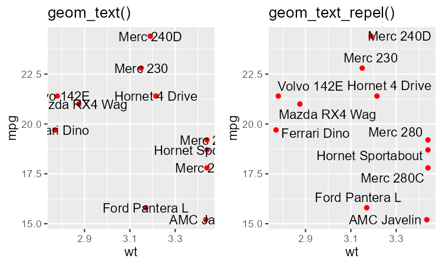

# ggrepel 示例

## 概述

`ggrepel` 为 `ggplot2` 提供了几种专门的几何图层，用来解决文本标签重叠的问题：

- `geom_text_repel()`
- `geom_label_repel()`
- `geom_marquee_repel()`

使用这些函数后，文本标签会互相“排斥”：它们会自动避开彼此、避开数据点，并且远离绘图区（面板）的边缘。

接下来对比 `geom_text()` 和 `geom_text_repel()` 的效果：

```R
library(ggrepel)
library(gridExtra) # 用于将多张图拼在一起展示
set.seed(42)

dat <- subset(mtcars, wt > 2.75 & wt < 3.45) # 选取车重 2.75 到 3.45 之间的子集
dat$car <- rownames(dat) # 将 row-name 提取出来，作为新列 car

# 车重 wt 为 x，油耗 mpg 为 y 建散点图
p <- ggplot(dat, aes(wt, mpg, label = car)) +
  geom_point(color = "red") 

p1 <- p + geom_text() + labs(title = "geom_text()")

p2 <- p + geom_text_repel() + labs(title = "geom_text_repel()")

gridExtra::grid.arrange(p1, p2, ncol = 2)
```




## 参考

- https://ggrepel.slowkow.com/articles/examples